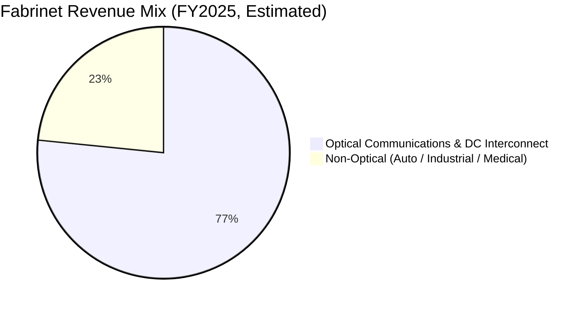
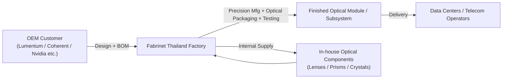

# Fabrinet (FN) Deep-Dive: The "Hidden Champion" Behind AI Compute

## I. Company Overview: Not a Chipmaker, But It Defines What's Possible

Fabrinet (NYSE: FN) is a **high-complexity optical and electronics manufacturing services provider**, incorporated in the Cayman Islands with its core operations in Thailand. Founded in 1999, the company's defining characteristic is: **it sells no products of its own, yet almost every high-end optical communications giant relies on it to manufacture their most critical subsystems.**

In plain terms: Nvidia makes GPUs, but the high-speed interconnects between GPUs require optical modules. Optical module companies (Lumentum, Coherent, etc.) design the modules, but **manufacturing the most intricate sub-assemblies and optical packaging** — a huge portion of that is done by Fabrinet.

| Company Basics | |
|:---|---|
| Full Name | Fabrinet |
| Ticker | NYSE: FN |
| Founded | 1999 (operations began 2000) |
| HQ (Registered) | Cayman Islands |
| Core Operations Base | Thailand (90%+ of manufacturing footprint) |
| CEO | Seamus Grady (since 2023) |
| Employees | 16,457 (LTM) |
| Manufacturing Footprint | ~3.7M sq ft (3.3M in Thailand) |
| Business Model | High-end optical/electronics manufacturing services (EMS); no own-brand products |

## II. What Does Fabrinet Actually Do? — Four Business Segments

### 2.1 Optical Communications & Data Center Interconnect (The Core Pillar)

This is Fabrinet's absolute core — and its deepest moat. The company manufactures the following for world-class optical OEMs (Lumentum, Coherent, Infinera, etc.):

- **Transceivers / Transponders** — including 400G, 800G, and **1.6T (supporting Nvidia Blackwell)** optical modules
- Tunable lasers, modulators, optical amplifiers
- **ROADM** (Reconfigurable Optical Add-Drop Multiplexers) — critical optical network nodes
- **Active Optical Cables (AOCs)** — for GPU-to-GPU high-speed interconnects inside data centers

In AI data centers, GPU cluster communication bandwidth is exploding, and optical module speeds are accelerating from 400G → 800G → 1.6T. Fabrinet sits at the **precision manufacturing** link in this chain — it doesn't design the modules, but it makes sure they get built, and built right.

### 2.2 Automotive Electronics & Sensors

Manufactures high-precision sensors and electronic modules for automotive OEMs and Tier-1 suppliers:

- Differential pressure sensors, micro-gyroscopes
- Fuel and environmental sensors
- Applications in vehicle safety, powertrain, and intelligent systems

### 2.3 Industrial Laser Systems

Manufactures various industrial and scientific laser equipment:

- Fiber lasers, solid-state lasers
- Diode-pumped lasers
- Applications in semiconductor processing, precision manufacturing, and medical devices

### 2.4 Custom Optical Components & Precision Glass

This is what separates Fabrinet from generic EMS providers — **it can manufacture its own core optical components in-house**:

- Laser crystals, lenses, prisms, mirrors
- Optical substrates and specialized assemblies
- Quartz, fused silica, borosilicate, and other precision glass products

This segment can be used internally (integrated into customer systems) or sold independently, deepening customer stickiness.

## III. Key Financial Metrics: A Manufacturer That Actually Makes Money

Unlike MaxLinear (persistently unprofitable), **Fabrinet is profitable — and profitably so.**

### 3.1 Revenue & Profitability (LTM as of Q1 FY2026)

| Metric | Value | Assessment |
|--------|-------|------------|
| **Revenue (LTM)** | $4.24B | Steady growth |
| **FY2025 Revenue** | $3.42B | +19% YoY |
| **Q1 FY2026 Revenue** | $978M | +22% YoY |
| **Q2 FY2026 Guidance** | $1.05–1.10B | Strong sequential growth |
| **Gross Margin** | 12.04% | 🟡 Typical EMS level; low |
| **Operating Margin** | 9.86% | 🟢 Excellent for EMS |
| **Net Margin** | 9.94% | 🟢 Nearly 10% — outstanding |
| **Net Income (LTM)** | $420.97M | 🟢 |
| **EPS (LTM)** | $11.64 | 🟢 |
| **EBITDA** | $479.71M | 🟢 |

> A 12% gross margin looks low? Yes — that's the nature of manufacturing services. But Fabrinet turns 12% gross into nearly 10% net — operating efficiency at its finest. For comparison, Foxconn (Hon Hai) runs net margins of just 2–3%.

### 3.2 Balance Sheet — Pristine

| Metric | Value | Assessment |
|--------|-------|------------|
| Cash & Equivalents | $945.24M | 🟢🟢 Extremely strong |
| Total Debt | $4.43M | 🟢🟢 Virtually zero debt |
| **Net Cash** | **+$940.81M** | 🟢🟢 $26.26 net cash per share |
| Book Value | $2.30B | |
| BV Per Share | $64.32 | |
| Current Ratio | 2.55 | 🟢 Ample liquidity |
| Quick Ratio | 1.60 | 🟢 |

> 🔑 **This balance sheet is Fabrinet's most underappreciated advantage.** Nearly $1 billion in net cash means the company can ride out industry downturns, and even buy back stock or make acquisitions counter-cyclically.

### 3.3 Cash Flow — High Investment, High Growth

| Metric | Value |
|--------|-------|
| Operating Cash Flow (LTM) | $256.85M |
| Capital Expenditures | −$211.04M |
| **Free Cash Flow** | **$45.81M** |
| FCF Per Share | $1.28 |

> ⚠️ FCF is thin, but this is **by design** — the company is aggressively expanding its Thailand manufacturing footprint to meet AI-driven demand. CapEx consumes 82% of operating cash flow. Once the expansion cycle matures, FCF should significantly improve.

### 3.4 Profitability & Efficiency

| Metric | Value | Assessment |
|--------|-------|------------|
| **ROE** | 19.99% | 🟢 Near 20% — excellent |
| **ROIC** | **30.23%** | 🟢🟢 Stellar capital returns |
| ROA | 8.52% | 🟢 |
| Revenue per Employee | $257,337 | |
| Profit per Employee | $25,580 | |

**What does a 30% ROIC mean?** For every dollar of capital invested, Fabrinet generates $0.30 in annual returns. Among all manufacturing companies, this is top-tier. High ROIC also confirms the moat is real — customer switching costs translate into pricing power.

## IV. Business Model: Why "Hidden Champion"?

### 4.1 Not Your Average Contract Manufacturer

First reaction: "It's just a Thai EMS — like Foxconn." — **Wrong.**

| Dimension | Generic EMS (Foxconn / Jabil) | Fabrinet |
|-----------|------------------------------|----------|
| Core Products | Consumer electronics assembly (iPhone, PC) | **High-precision optical subsystems** |
| Technical Barrier | Medium (scale assembly) | **High (precision optical packaging + fiber alignment)** |
| Yield Requirement | 95–99% | **Near 100% (a single optical defect = total scrap)** |
| Customer Switching Cost | Low-Medium | **Very High (re-qualification takes 6–18 months)** |
| Net Margin | 1–3% | **~10%** |
| Customer Dependency | Diversified | Relatively concentrated |

Fabrinet isn't "assembling parts" — it's "aligning lasers to optical fiber at micron precision, packaging optics in a vacuum." One micron off, and the whole module is scrap. This capability isn't something you can outsource to just any factory in Thailand.

### 4.2 Thailand Manufacturing = Cost Advantage + Geopolitical Hedge

Over 90% of Fabrinet's manufacturing footprint is concentrated in Thailand. In the global supply chain restructuring away from China, Thailand is among the biggest beneficiaries:

- ✅ Labor costs far lower than China or the U.S.
- ✅ Mature manufacturing ecosystem (30+ years of development)
- ✅ Geopolitically neutral — not directly in the U.S.-China trade war's crosshairs
- ✅ Fabrinet has been there for 20+ years with a stable engineer and technician workforce

## V. The AI Narrative: Substance or Hype?

Fabrinet's AI story is straightforward and **backed by real evidence**:

### 5.1 1.6T Optical Modules — The "Blood Vessels" of Nvidia Blackwell

Nvidia's Blackwell GPU platform requires **1.6Tbps optical modules** to support high-speed GPU-to-GPU interconnects. Fabrinet is a **core manufacturing partner** for this generation of optical modules.

> The logic chain: AI training demands larger GPU clusters → GPUs need more interconnect bandwidth → faster optical modules needed (800G → 1.6T) → Fabrinet manufactures the core subsystems with precision.

This isn't "concept riding" — the company's Q1 FY2026 revenue growth of 22% YoY is a direct result of AI-driven demand.

### 5.2 Before and After AI

| Metric | 2022 (Pre-AI) | 2026 (Current LTM) | Change |
|--------|:-----------:|:-----------------:|:------:|
| FY Revenue | $2.26B | $4.24B | +88% |
| Net Margin | 8.9% | 9.94% | Operating leverage emerging |
| Employees | ~11,000 | 16,457 | +50% |
| Stock Price | ~$125 | $654 | +423% |

### 5.3 The "Yi Zhong Tian" Comparison

In China, the optical module supply chain is dominated by three companies nicknamed "Yi Zhong Tian" — Eoptolink (新易盛), TFC Optical (天孚通信), and Zhongji Innolight (中际旭创). Fabrinet plays a similar role in the U.S. ecosystem, and is actually **a downstream customer of TFC Optical** — underscoring its pivotal position in the global optical communications supply chain.

## VI. Stock Price & Valuation: Expensive, But for Good Reason?

### 6.1 Market Snapshot

| Metric | Value |
|--------|-------|
| Current Price (May 29, 2026) | $654.16 |
| 52-Week Change | **+182%** |
| Market Cap | $23.44B |
| Enterprise Value | $22.50B |
| Beta | 1.22 (slightly above market) |
| Short Interest | 6.69% (elevated) |
| Institutional Ownership | 110.56% (extremely high) |

### 6.2 Valuation Metrics

| Valuation Metric | Value | Industry Context | Verdict |
|------------------|:----:|:----------------:|:------:|
| P/E (LTM) | 56.19x | | 🟡 Expensive |
| Forward P/E | 39.92x | EMS 15–25x; high-growth 25–35x | 🟡 Slightly rich |
| P/S | 5.53x | EMS 1–2x | 🔴 Expensive |
| Forward P/S | 4.34x | | 🟡 |
| P/B | 10.17x | | 🟡 |
| P/FCF | 511x | | 🔴 (CapEx-cycle distortion) |
| EV/EBITDA | 46.90x | | 🟡 Slightly rich |
| ROIC | **30.23%** | | 🟢🟢 Excellent |

### 6.3 Analyst Consensus

- **9 analysts, consensus rating: Buy**
- **Average price target: $749.11**
- **Current price vs. target: +14.5% upside**

> A completely different picture from MaxLinear (target 37% below current price) — analysts think Fabrinet still has room to run.

### 6.4 What Growth Is Priced In?

The market is paying 40x forward P/E because it assumes **20%+ annual earnings growth for the next 2–3 years**. Reverse-engineering from free cash flow, the current price implies:

> **Mid-term FCF growth of ~15–17% CAGR, tapering to a steady state thereafter.**

In the context of ongoing AI infrastructure expansion, this assumption is not unreasonable. But there are concerns:

1. **CapEx is massive.** $211M in capital spending consumes 82% of operating cash flow. If order growth slows, those new production lines become idle costs.
2. **Customer concentration risk.** A single large customer (e.g., Lumentum) switching suppliers or building in-house capacity would be devastating.
3. **Optical module cycles.** Each generation (400G → 800G → 1.6T) has a limited volume ramp window. There could be a "gap quarter" between generations.

## VII. Risk Factors

### 7.1 🔴 Customer Concentration

The optical communications OEM industry is highly concentrated. Fabrinet's top customers (Lumentum, Coherent/II-VI, Infinera, etc.) contribute the bulk of revenue. Any single customer shifting to in-house manufacturing or switching suppliers would materially impact the business.

### 7.2 🔴 Optical Module Technology Risk

1.6T optical modules are the current growth engine. If the next generation (3.2T) adopts a fundamentally different optical architecture — such as silicon photonics integration replacing discrete optical packaging — Fabrinet's precision optical manufacturing advantage could be bypassed.

### 7.3 🟡 Valuation Compression Risk

At 56x P/E, the market has a low tolerance for disappointment. If a single quarter misses expectations, the "double whammy" (earnings drop + multiple compression) could be painful.

### 7.4 🟡 CapEx Cycle Risk

The company is aggressively expanding its Thailand production capacity. If AI capex growth decelerates (not even shrinking — just growing more slowly), the new capacity could drag down utilization rates and erode margins.

### 7.5 🟡 Geopolitical Risk

While Thailand is geopolitically neutral, Southeast Asian regional instability (South China Sea, Myanmar) remains a persistent uncertainty. Fabrinet has nearly all its manufacturing eggs in the Thailand basket.

## VIII. Bull vs. Bear Case

| | Bull Case | Bear Case |
|---|---|---|
| **AI Trend** | 1.6T module demand is just ramping; 3.2T is on the way | Optical modules are cyclical; each generation's window is limited |
| **Competitive Moat** | Precision optical manufacturing barrier is very high; switching costs are steep | Key customers (Lumentum, etc.) may build in-house capacity |
| **Profitability** | 30% ROIC, 10% net margins — an outlier in EMS | 12% gross margins — still fundamentally a low-margin manufacturing business |
| **Balance Sheet** | ~$1B net cash; deep resilience | Cash is plentiful, but CapEx is huge; FCF is razor-thin |
| **Valuation** | 40x forward P/E for 20%+ growth = PEG ~2x — reasonable | 56x trailing P/E, 5.5x P/S — extremely expensive by manufacturing standards |
| **Momentum** | +182% rally is fundamentally supported; analysts are bullish | 6.69% short interest; an earnings miss could trigger a stampede |

## IX. Summary & Bottom Line

**Fabrinet is the closest thing to a "hidden champion" in the AI optical communications supply chain.** It designs no chips and writes no software, yet virtually all high-end optical module core subsystems can't be built without its precision manufacturing. With a 30% ROIC, 10% net margins, and nearly $1 billion in net cash, Fabrinet is in the absolute top tier of the EMS industry.

But it's not without concerns: customer concentration, technology iteration risk, heavy CapEx, and a 56x P/E that leaves no room for error. Any crack in the fundamentals could trigger a valuation correction.

| Dimension | Rating | Commentary |
|-----------|:------:|------------|
| Business Quality | ⭐⭐⭐⭐ | High-barrier precision optical manufacturing; core position in AI optical interconnects |
| Financial Health | ⭐⭐⭐⭐⭐ | Near-zero debt + $940M net cash + 30% ROIC |
| Growth | ⭐⭐⭐⭐ | AI-driven demand strong; Q2 FY2026 guidance of $1.05–1.10B |
| Valuation Reasonableness | ⭐⭐⭐ | 56x P/E is rich, but 40x forward P/E is acceptable for this growth profile |
| Management | ⭐⭐⭐⭐ | Consistent execution; ongoing buybacks; orderly capacity expansion |
| **Overall** | **⭐⭐⭐⭐** | A quality AI optical play — but patience for a better entry point is warranted |

> **Fabrinet vs. MaxLinear — Side by Side:**
>
> | | MaxLinear (MXL) | Fabrinet (FN) |
> |---|---|---|
> | Profitable? | ❌ Still losing money | ✅ 10% net margins |
> | Cash Position? | 🔴 Net debt | 🟢 $940M net cash |
> | ROIC? | −15% | 30% |
> | Valuation Paradox? | PEG 0.7 but supported by nothing | 56x P/E but backed by real earnings |
> | Analyst Sentiment? | Target 37% BELOW current price | Target 14% ABOVE current price |
>
> **Both are in the AI optical interconnect lane, but Fabrinet's fundamentals are leagues ahead of MaxLinear's.** If you're bullish on AI infrastructure long-term, Fabrinet is a much safer bet than MaxLinear — though, naturally, at a higher price.

> **Disclaimer:** This is a fundamental analysis piece only and does not constitute investment advice. Investing involves risk. Data sources include Fabrinet's official filings, StockAnalysis, Sina Finance, and other public information as of late May 2026.

---

*In the AI gold rush, some sell shovels, some sell maps. Fabrinet's role is subtler — it doesn't sell shovels; it manufactures the most precise part of the shovel for the shovel companies. While everyone watches Nvidia's GPU shipments, an unassuming factory in Thailand is quietly determining just how fast those GPUs can run.*
