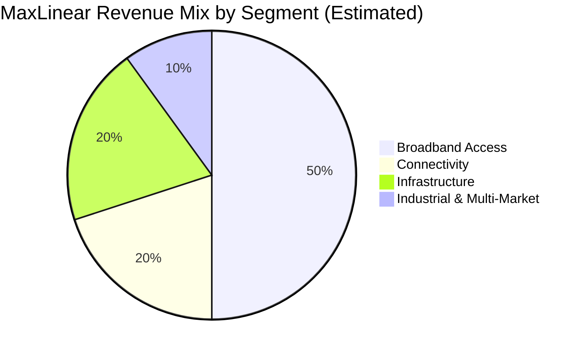
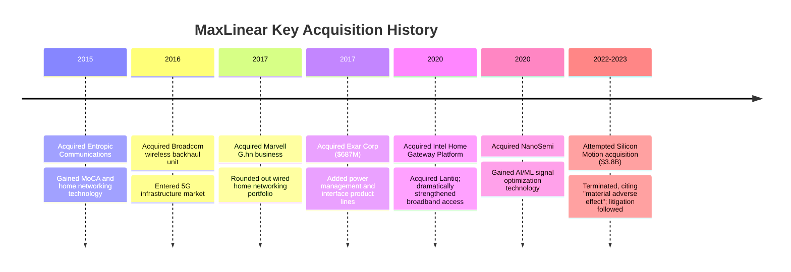

# MaxLinear (MXL) Deep-Dive: A Chip Stock Up 700% — Is It Worth It?

## I. Company Overview: Who Is MaxLinear?

MaxLinear (NYSE: MXL) is a **fabless semiconductor company** headquartered in Carlsbad, California. Founded in 2003, it went public on the NYSE in 2010. The company's core positioning: **making "multi-gig connectivity a reality" through radio-frequency (RF) analog and mixed-signal integrated circuits.**

In plain terms: the cable modem or fiber gateway in your home, the wireless backhaul chips in 5G base stations, and the optical interconnect modules in data centers — there's a good chance a MaxLinear chip sits at the heart of these devices.

| Company Basics | |
|:---|---|
| Full Name | MaxLinear, Inc. |
| Ticker | NYSE: MXL |
| Founded | 2003 |
| IPO | 2010 (IPO price $14) |
| Headquarters | Carlsbad, California, USA |
| CEO | Kishore Seendripu (co-founder) |
| CTO | Curtis Ling (co-founder) |
| Employees | 1,115 (2025) |
| Business Model | Fabless (designs chips; outsources manufacturing to foundries like UMC) |

## II. Product Lines and Business Segments

MaxLinear operates across four segments:

### 2.1 Broadband Access — The Core Revenue Driver

This is MaxLinear's flagship business, providing chip solutions for wired broadband access:

- **DOCSIS 3.1 / 4.0 chips**: For cable modems on cable TV networks. In May 2026, the company announced that its Puma™ 8 platform was the first to achieve DOCSIS 3.1 VFI (Virtual Fiber Interface), accelerating DOCSIS 4.0 readiness.
- **Fiber access (PON)**: Chip solutions for Fiber-to-the-Home (FTTH).
- **MoCA / G.hn**: In-home networking technologies that solve the "last meter" of wired connectivity.

### 2.2 Connectivity

- **Wi-Fi chips**: For home gateways, routers, and access points.
- **Ethernet**: Multi-gigabit Ethernet PHYs and switching chips.

### 2.3 Infrastructure

- **5G Wireless Backhaul**: Acquired from Broadcom in 2016; chips for data transmission between base stations.
- **Optical Interconnects**: High-speed optical communication chips (400Gbps+) for intra- and inter-data-center connectivity.
- **AI Data Centers**: In May 2026, launched Coronado™ and Laguna™ USB UART solutions for AI data center control-plane connectivity.

### 2.4 Industrial & Multi-Market

- **Power Management ICs (PMICs)**: Acquired through the 2017 Exar purchase, serving industrial and automotive applications.
- **Interface chips**: Serial transceivers, UARTs, and more.

> Note: The company does not disclose exact revenue splits per segment. The chart above is an estimate based on publicly available information.

## III. Key Financial Metrics

### 3.1 Revenue & Profitability (LTM as of Q1 2026)

| Metric | Value | Assessment |
|--------|-------|------------|
| **Revenue (LTM)** | $508.9M | Recovering year-over-year |
| **FY 2025 Revenue** | $468M | Down from 2024 |
| **Q1 2026 Revenue** | $137.2M | Solid quarter |
| **Gross Margin** | 57.16% | 🟢 Healthy — typical fabless level |
| **Operating Margin** | −15.89% | 🔴 Deeply unprofitable |
| **Net Income** | −$132.1M | 🔴 Persistent losses |
| **EPS** | −$1.52 | 🔴 |
| **EBITDA** | −$37.1M | 🔴 |
| **Free Cash Flow** | +$10.15M | 🟡 Barely positive |

**The core contradiction: 57% gross margins are decent, but operating expenses are too high — driving persistent losses.** This isn't a company that "can't sell products." It's a company that "spends money faster than it makes it."

### 3.2 Balance Sheet

| Metric | Value | Assessment |
|--------|-------|------------|
| Cash & Equivalents | $61.08M | 🟡 On the lean side |
| Total Debt | $151.18M | 🟡 Manageable |
| Net Cash | −$90.10M | 🔴 Net debt position |
| Book Value | $454.2M | |
| Book Value Per Share | $5.07 | |
| Current Ratio | 1.70 | 🟢 Adequate liquidity |
| Debt / Equity | 0.33 | 🟢 Modest leverage |
| Interest Coverage | −8.30 | 🔴 Can't cover interest from profits |

### 3.3 Cash Flow

| Metric | Value |
|--------|-------|
| Operating Cash Flow (LTM) | +$22.15M |
| Capital Expenditures | −$11.99M |
| **Free Cash Flow** | **+$10.15M** |
| Depreciation & Amortization | $43.78M |

Free cash flow is barely positive — the company relies on D&A to "prop up" positive cash flow. The underlying business operates at roughly breakeven.

## IV. Growth History: A "Roll-Up" Semiconductor Story

MaxLinear's growth has been heavily M&A-driven. Several key transactions shaped today's business:

### The Double-Edged Sword of M&A

**The good:**
- The Intel Home Gateway (formerly Lantiq) acquisition brought core DOCSIS and PON technology and customer relationships, making MaxLinear a serious broadband access player.
- The Exar acquisition diversified the business into power management.

**The bad:**
- Frequent acquisitions have accumulated **goodwill and intangibles**, adding ongoing amortization pressure.
- The 2022 attempt to acquire Silicon Motion (a NAND flash controller company) for $3.8 billion — and the 2023 termination — revealed **management's "empire-building" impulse**: reaching for a transformational deal before proving sustainable profitability.

## V. Industry Position & Competitive Landscape

MaxLinear operates in a highly fragmented market with formidable competitors:

| Segment | MaxLinear Position | Key Competitors |
|---------|:-----------------:|-----------------|
| Broadband Access (DOCSIS/PON) | Core player | Broadcom, MediaTek |
| Wi-Fi Chips | Mid-tier | Broadcom, Qualcomm, MediaTek |
| 5G Wireless Backhaul | Niche player | Broadcom, Marvell |
| Optical Interconnects | Emerging entrant | Marvell, Broadcom, Credo |
| Power Management | Mid-tier | TI, ADI, MPS, Renesas |

**Key judgment: MaxLinear faces competitors 10–100x its size on every product line.** Broadcom's market cap exceeds $1 trillion; MaxLinear sits at $8.3 billion. MaxLinear's survival strategy is "be the best in niches the giants overlook" — but this means a relatively limited ceiling.

## VI. Stock Price & Valuation: The Biggest Red Flag

### 6.1 The Mystery of the 700% Rally

| Metric | Value |
|--------|-------|
| Current Price (May 29, 2026) | $92.93 |
| 52-Week Change | **+713%** |
| Market Cap | $8.32B |
| Enterprise Value | $8.41B |
| Beta | 3.96 (extremely volatile) |

The stock has risen 7x in a year while the company remains unprofitable. Potential drivers:

1. **AI halo effect**: The market is projecting "AI data center connectivity demand" onto MaxLinear (the company did launch new AI data center products).
2. **Broadband upgrade cycle**: Anticipation of the DOCSIS 4.0 and Wi-Fi 7 upgrade cycle.
3. **Small-cap + high-beta momentum**: 85% institutional ownership and 3.34% short interest create squeeze potential.

### 6.2 Valuation Metrics — Off the Charts

| Valuation Metric | MXL | Industry Range | Verdict |
|------------------|:---:|:-------------:|:------:|
| Price / Sales | 16.35x | 3–8x | 🔴 Extremely expensive |
| Forward P/S | 13.06x | | 🔴 |
| Forward P/E | 62.33x | 15–25x | 🔴 |
| Price / Book | 18.32x | 3–6x | 🔴 |
| P / FCF | 819x | 20–40x | 🔴🔴 |
| PEG Ratio | 0.70 | <1.0 is good | 🟢 Deceptively reasonable |

**A PEG of 0.70 looks cheap — but it depends entirely on analyst expectations for future earnings growth that haven't materialized yet.** The company is still losing money. The PEG is low because the "E" (earnings) is projected to grow from a near-zero base — a classic **value-trap metric**.

### 6.3 Analyst Divergence

- **11 analysts, consensus rating: Buy**
- **Average price target: $58.27**
- **Current price vs. target: 37.3% premium**

> 🚨 Even the analysts who rate it a "Buy" think the stock is nearly 40% overvalued. This means either the market knows something the analysts don't — or this is a bubble.

## VII. The AI Narrative: Substance or Hype?

MaxLinear's hottest recent theme is **"AI data center connectivity."** In May 2026, the company announced two products targeting AI data centers:

- **Coronado™ USB UART**: For AI server control-plane connectivity
- **Laguna™ USB UART**: Same category

Additionally, the company's optical interconnect chips (400Gbps+) do genuinely benefit from AI-driven demand for high-speed connectivity.

### Sober Assessment:

| AI-Related Tailwind | Reality Check |
|---------------------|---------------|
| Data center optical interconnect growth | MaxLinear's market share is far smaller than Marvell/Broadcom's |
| AI server internal connectivity | USB UART is an auxiliary product, not core AI compute |
| Compute boom → network upgrade → broadband upgrade | Long transmission chain; near-term impact limited |

**Conclusion: The AI tailwind for MaxLinear is real, but the market has magnified it.** The company won't become the next Nvidia. It remains, at its core, a broadband access chip company. AI might contribute 10–20% incremental revenue at best.

## VIII. Risk Factors

### 8.1 🔴 Valuation Bubble Risk

P/S of 16x, P/FCF of 819x, analyst targets 37% below current price — this is the most immediate risk. With a beta of 3.96, if sentiment reverses, the fall will be just as violent as the rise.

### 8.2 🔴 Persistent Losses, No Clear Path to Profitability

The company has posted losses for multiple consecutive quarters with −16% operating margins. If the broadband upgrade cycle (DOCSIS 4.0 / Wi-Fi 7) is delayed or disappoints, the "turnaround" narrative collapses.

### 8.3 🔴 High Customer Concentration

Broadband access chips primarily serve cable operators (Comcast, Charter, etc.) and gateway equipment makers — a concentrated customer base. Losing one key customer would materially impact revenue.

### 8.4 🟡 M&A Integration Risk

MaxLinear has historically built its portfolio through heavy M&A. Integration risks, goodwill impairment risks, and cultural friction are persistent concerns. The failed Silicon Motion deal further exposed management's aggressive tendencies in capital allocation.

### 8.5 🟡 Competitive Risk

Broadcom, Marvell, Qualcomm, and MediaTek compete across every product line with enormous scale advantages. MaxLinear must stay technologically ahead just to defend its niche.

### 8.6 🟡 Semiconductor Cycle Risk

Semiconductors are deeply cyclical. If a macro downturn leads operators to cut capex, broadband infrastructure chip demand will be hit directly.

## IX. Investment Framework: The Bull vs. Bear Case

| | Bull Case | Bear Case |
|---|-----------|-----------|
| **Industry Trends** | DOCSIS 4.0 + Wi-Fi 7 + AI data centers — a triple upgrade super-cycle | Upgrade cycles may be slower than expected; broadband capex is cyclical |
| **Market Position** | Core supplier for broadband access, deeply embedded with operators | Giants like Broadcom can ramp investment and crush niches at any time |
| **Profitability** | Revenue growth will soon cover fixed costs; operating leverage about to kick in | Multiple years of losses; "turnaround" story is wearing thin |
| **Valuation** | PEG of 0.70 — not expensive on a growth basis | P/S 16x, P/FCF 819x — expensive by any standard |
| **Momentum** | AI narrative + broadband upgrade catalysts + high-beta upward inertia | Already up 713%; 3.34% short interest; correction could come anytime |
| **Management** | Experienced team with strong M&A integration track record | Silicon Motion debacle exposed judgment issues |

## X. Summary & Bottom Line

**MaxLinear is a company with solid products and healthy gross margins that has yet to prove it can sustainably turn a profit.** Its broadband access market has genuine upgrade demand (DOCSIS 4.0, Wi-Fi 7, FTTH), but it must carve a path amid fierce competition from far larger rivals.

At $92.93 per share and an $8.3 billion market cap, the market is pricing in a **"perfect scenario"** — all three upgrade cycles firing simultaneously, AI data centers adding incremental growth, and the company successfully achieving profitability. **Any of these assumptions falling short would put the stock at significant risk of a sharp correction.**

| Dimension | Rating | Commentary |
|-----------|:------:|------------|
| Business Quality | ⭐⭐⭐ | Products have real demand, but ceiling is limited against giants |
| Financial Health | ⭐⭐ | Decent gross margins but persistent losses; net debt position |
| Growth | ⭐⭐⭐ | Broadband upgrade + AI provide medium-term growth drivers |
| Valuation Reasonableness | ⭐ | P/S 16x, P/FCF 819x — far beyond reasonable ranges |
| Management | ⭐⭐⭐ | Technical founders, but M&A judgment has blemishes |
| **Overall** | **⭐⭐** | A good company ≠ a good stock; current price discounts too much optimism |

> **Disclaimer:** This is a fundamental analysis piece only and does not constitute investment advice. Investing involves risk — do your own due diligence. Data sources include MaxLinear's official filings, Wikipedia, and StockAnalysis as of late May 2026.

---

*MaxLinear's story is a classic "great company, wrong price" case. On Wall Street, you don't just judge whether a company is good — you judge how much the market is paying for that "good." And right now, the market is paying a price that requires everything to go perfectly right.*
