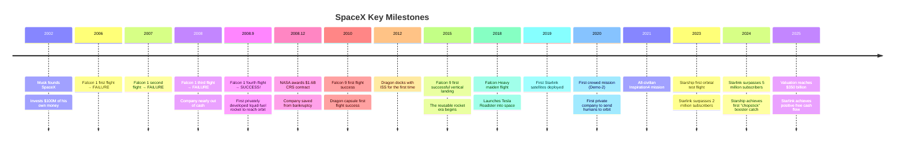
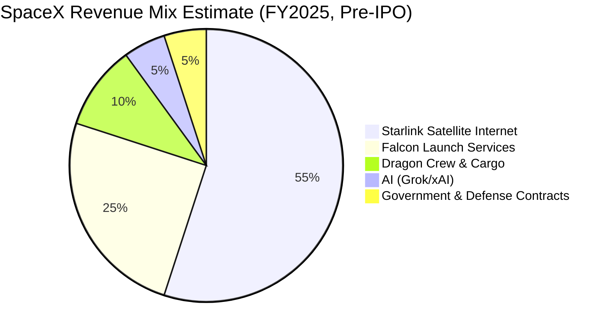
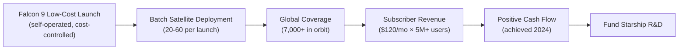
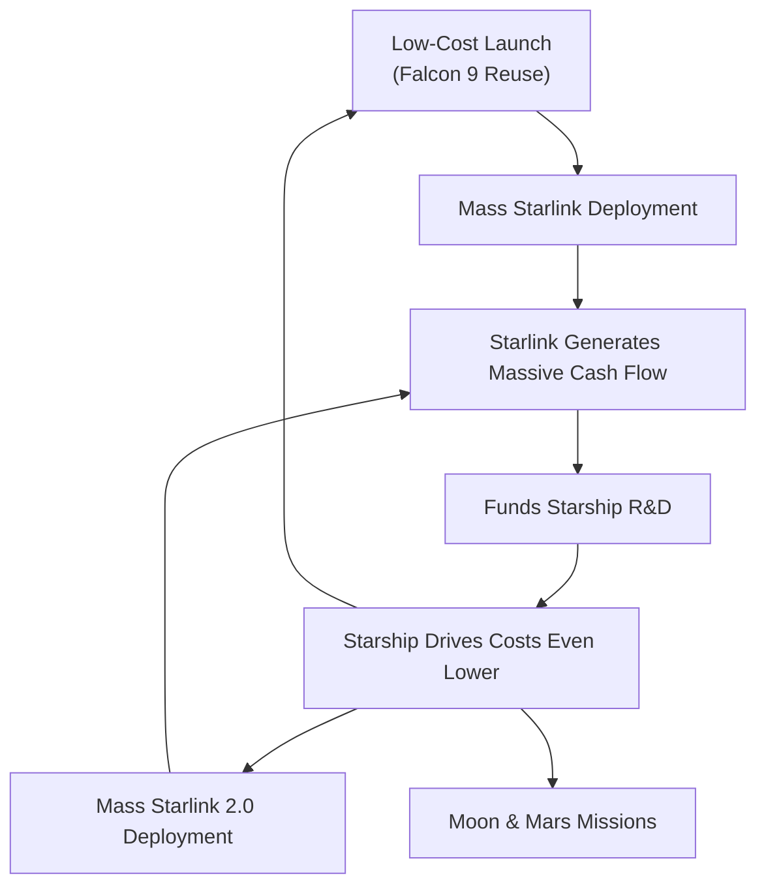

# SpaceX (SPCX) Deep Dive: The Trillion-Dollar Company Rewriting Space History — Is It Worth Betting On?

## I. Company Overview: Who Is SpaceX?

SpaceX (Space Exploration Technologies Corp., Nasdaq: **SPCX**) is an aerospace and technology company **founded by Elon Musk in 2002**, headquartered in Starbase, Texas. In 22 years, it has gone from a near-bankrupt rocket startup to **one of the most valuable publicly traded companies in the world**. On June 12, 2026, SpaceX listed on the Nasdaq, debuting with a market cap exceeding $2 trillion.

SpaceX's core mission: **make humanity a multi-planetary species**. But its business logic is equally clear — use reusable rockets to slash launch costs to the floor, build a global satellite internet empire with Starlink, and ultimately colonize Mars with Starship.

| Basic Information | |
|:---|---|
| Full Name | Space Exploration Technologies Corp. |
| Ticker | **NASDAQ: SPCX** (Listed June 12, 2026) |
| Founded | 2002 |
| Founder & CEO | Elon Musk |
| President & COO | Gwynne Shotwell (joined 2008, operational mastermind) |
| Headquarters | Starbase, Texas, USA (formerly Hawthorne, CA) |
| Employees | ~22,000 |
| Key Products | Falcon 9, Falcon Heavy, Dragon, Starlink, Starship, Grok (AI) |
| Publicly Traded? | **Yes — Nasdaq Listed (June 12, 2026)** |
| Current Market Cap | ~$2.11 Trillion (as of June 12, 2026 close) |
| Current Stock Price | $160.95 |
| IPO Reference Price | $135.00 |
| Shares Outstanding | ~13.09 Billion |

## II. History & Key Milestones: Four Near-Death Experiences, Four Rebirths

SpaceX's history is a script of "from the brink of death to the mountaintop." Without this company, the United States would have had no ability to send astronauts into space between the Space Shuttle's retirement in 2011 and 2020.



### 🔑 The Turning Point: Autumn 2008

On September 28, 2008, SpaceX attempted the fourth launch of Falcon 1. The first three had all failed. The company had enough money for exactly one more launch. If this one failed, SpaceX was done.

**The fourth launch succeeded.** SpaceX became the first private entity in history to send a liquid-fueled rocket into orbit. That December, NASA awarded SpaceX a $1.6 billion ISS resupply contract — a deal that saved the company.

> A detail: Musk later revealed that the NASA contract was signed just days before his personal bankruptcy would have been triggered.

## III. Business Segments Deep Dive

SpaceX's business can be broken into four segments. Each one, on its own, could anchor a company worth tens or hundreds of billions.



### 3.1 🚀 Launch Services: The Price Disruptor of Global Aerospace

SpaceX's foundation. Core products: **Falcon 9** and **Falcon Heavy**.

| Rocket | LEO Payload | Launch Price | Reusability | Competitor Price |
|--------|:---------:|:------:|:------:|:-------------:|
| **Falcon 9** | 22.8 tons | $67M | First stage reusable 20+ times | ULA Atlas V: $110M |
| **Falcon Heavy** | 63.8 tons | $97M | All three boosters reusable | SLS: $2B+ |
| **Starship (in development)** | 100–200 tons | Target <$10M | Fully reusable | — |

**In 2024, SpaceX conducted over 130 orbital launches — more than 50% of the entire world's total.** Every other rocket launch on Earth is a SpaceX launch.

The economic logic is dead simple:
- Traditional rockets: single-use, build a new one every time → $100M–400M per launch
- Falcon 9: recover, refurbish, and refly the first stage → marginal cost as low as $15M per launch

**Reusability isn't a gimmick — it's a business model revolution.** As of late 2025, individual Falcon 9 boosters have flown over 25 times each. SpaceX has turned rocketry into something more like airline operations — you don't buy a new plane for every flight.

### 3.2 🛰️ Starlink: The Satellite Internet Empire

Starlink is SpaceX's cash cow — or rather, the cow that is rapidly maturing.

**Key Metrics:**

| Metric | Value |
|--------|-------|
| Satellites in orbit | ~7,000+ (most in the world) |
| Active subscribers | 5 million+ (end of 2024) |
| Countries/regions covered | 100+ |
| Monthly subscription | $120 (US residential) / $50–80 (international) |
| Terminal hardware price | $599 → $349 → $299 (steadily declining) |
| 2024 estimated revenue | $7–9 billion |
| 2026 revenue estimate | $12–15 billion (some analyst projections) |
| Positive free cash flow achieved | Yes (confirmed 2024) |

**Starlink's business model is classic "lose big on infrastructure upfront, collect subscriptions forever":**



**Starlink's real advantage isn't raw speed — it's ubiquity:**
- Rural areas: no fiber → Starlink is the only option
- Planes, cruise ships, RVs: high-speed internet in motion
- Wartime communications: Ukraine proved Starlink is irreplaceable in extreme environments
- Maritime & aviation B2B: airline WiFi, cargo ship connectivity → high-margin enterprise customers

> 💡 Starlink's most underrated value proposition: it's not competing with urban fiber — it's eating the market that "fiber will never reach." That market is worth roughly $100–200 billion per year.

### 3.3 🚀 Starship: Either Changes Everything, or Burns Everything

Starship is the **super-heavy launch vehicle** SpaceX is developing — the largest rocket in human history. Its specs are science-fiction level:

| Metric | Starship | Saturn V (Moon rocket) | SLS (NASA's new rocket) |
|--------|:------:|:----------------:|:---------------:|
| Height | 121 m | 110 m | 98 m |
| LEO payload | 100–200 tons | 118 tons | 95 tons |
| Fully reusable? | ✅ | ❌ | ❌ |
| Target cost per launch | <$10M | $1.2B (inflation-adjusted) | $2B+ |

**Starship's significance goes beyond the launch market:**
1. **Drop cost-to-orbit below $100/kg** (currently $2,000–3,000/kg), fundamentally transforming the space economy
2. **Orbital refueling** — Starships can refuel each other in space, enabling missions to the Moon, Mars, and beyond
3. **Mass deployment of Starlink 2.0** — V3 satellites are bigger and heavier; only Starship can launch them in bulk
4. **NASA's Artemis Moon program** — SpaceX won a $2.9 billion NASA contract for a Starship-derived lunar lander

> ⚠️ Starship is SpaceX's biggest bet and biggest risk. If it succeeds, SpaceX becomes the first company in history to enable interplanetary transport. If it fails, billions in R&D go up in smoke. As of June 2026, Starship has completed multiple test flights, achieving the spectacular "chopstick" booster catch, but full upper-stage (Ship) recovery has not yet been demonstrated.

### 3.4 🐉 Dragon: NASA's Lifeline

The Dragon capsule is SpaceX's crewed and cargo spacecraft. After the Space Shuttle retired in 2011, NASA was dependent on Russian Soyuz capsules for astronaut transport (fare: $86M per seat). SpaceX's Dragon brought that capability back at ~$55M per seat.

| Mission Type | Cumulative Count | Customer |
|--------------|:------:|----------|
| NASA Cargo Resupply (CRS) | 30+ | NASA |
| NASA Crew Missions | 10+ | NASA |
| Private Space Missions | 3+ | Axiom Space, Jared Isaacman, etc. |

Dragon isn't SpaceX's biggest revenue driver (~$2–3 billion/year), but it has unique strategic value: **it is currently NASA's only certified American crewed spacecraft.** Boeing's Starliner has been repeatedly delayed, leaving SpaceX with a near-monopoly on US human spaceflight capability.

### 3.5 🤖 AI Business: Grok & xAI

IPO filings reveal SpaceX has integrated Elon Musk's AI startup xAI. The company now has a third business segment: **AI Platform**.

| AI Business Components | Description |
|------------------------|-------------|
| **Grok** | Frontier large language model (LLM), competing with ChatGPT and Gemini |
| **AI Solutions** | Consumer and enterprise AI products |
| **X Platform** | Real-time information, entertainment, and free speech social platform |
| **AI Compute Infrastructure** | Self-built AI computing clusters |

AI currently represents a small slice of revenue (~5%) but is growing extremely fast. There's natural synergy with SpaceX's satellite internet: Starlink can provide low-latency connectivity for global AI inference nodes, while AI can optimize Starlink's satellite network scheduling.

> ⚠️ This structure means post-IPO SpaceX is a three-in-one platform — aerospace + satellite internet + AI — essentially Musk's "flagship public company."

## IV. Financial Analysis (Based on IPO Disclosures)

With its Nasdaq listing, SpaceX has publicly disclosed full financials for the first time. The following data comes from SEC filings and public market data.

### 4.1 Revenue & Profit (Latest Pre-IPO Financials)

| Metric | Value | Assessment |
|--------|-------|------|
| **Revenue (TTM)** | ~$19.23B (back-calculated from EV/Sales) | 🟢 High growth |
| **Revenue Growth (YoY)** | **33.24%** | 🟢🟢 Exceptional |
| **Gross Margin** | 48.83% | 🟢 Solid, mixed aerospace + internet model |
| **EBIT Margin** | −21.10% | 🔴 Deep operating losses |
| **Net Income Margin** | −45.00% | 🔴 Significant losses |
| **EPS (FWD)** | −$0.64 | 🔴 Still burning cash |
| **ROE** | −132.79% | 🔴 Massive investment dragging returns |
| **ROA** | −8.51% | 🔴 |

> 🚨 **Key tension: 33%+ revenue growth is stellar; 49% gross margin is solid. Yet the company is bleeding heavily.** Not because products aren't selling — but because Starship R&D, Starlink infrastructure, and AI compute cluster investments are all running simultaneously at massive scale.

### 4.2 Balance Sheet — First Public Look

| Metric | Value | Assessment |
|--------|-------|------|
| Cash & Equivalents | $23.68B | 🟢🟢 Extremely ample (bolstered by IPO proceeds) |
| Total Debt | $30.60B | 🟡 Manageable but significant |
| Net Cash | −$6.92B | 🟡 Net debt position |
| Enterprise Value (EV) | $2.12T | |
| Book Value Per Share | ~$5.96 | |
| Price/Book (P/B) | 27.02x | 🔴 Extremely high |

> 🔑 Pre-IPO, SpaceX carried almost no debt. Post-IPO, the balance sheet shows $30.6B in debt — likely from capital restructuring around the IPO or the consolidation of xAI and X platform liabilities.

### 4.3 Cash Flow (Estimated)

| Metric | Estimate |
|--------|----------|
| Operating Cash Flow | Likely still negative (Starlink buildout + Starship R&D) |
| CapEx | Extremely high (Starlink replenishment + Starship factory + AI compute) |
| **Free Cash Flow** | **Almost certainly negative** |

### 4.4 Profitability Metrics

| Metric | Value | Assessment |
|--------|-------|------|
| Altman Z-Score | −0.45 | 🔴 Financial distress zone |
| Gross Margin | 48.83% | 🟢 Good |
| Net Margin | −45.00% | 🔴 Deep losses |

> ⚠️ Altman Z-Score of −0.45 (below the 1.8 warning threshold) is primarily because the company is in hyper-expansion mode with assets far exceeding current earnings. This is typical for growth companies and doesn't indicate bankruptcy risk — but it does mean the company currently depends on capital markets for funding.

## V. Business Model & Moat: Why Can't Anyone Catch Up?

### 5.1 🔒 Moat #1: Launch Cost Leadership (10+ Year Lead)

SpaceX has driven launch costs to the lowest in the world. This isn't a gap that can be closed by "spending more money":

- Falcon 9 reuse technology — competitors (ULA, Arianespace, Blue Origin) have yet to field a production reusable rocket
- The only competing reusable rocket — Blue Origin's New Glenn — had its maiden flight in January 2025, a full decade after Falcon 9's first landing
- China's commercial space sector is catching up fast, but still years behind on booster recovery and reuse

### 5.2 🔒 Moat #2: Vertical Integration + Internal Synergy

SpaceX's unique business model: **use your own rockets to launch your own satellites, and use your own satellites' revenue to fund your own rocket R&D.**

```
Normal satellite company: pay SpaceX $67M to rent a rocket to launch satellites
SpaceX: launch your own satellites on your own rockets at marginal cost (~$15M)
```

This alone makes Starlink's deployment cost 1/5 to 1/10 of any competitor's. Amazon's Project Kuiper is Starlink's most direct rival, but it must pay market rates for launches — including, ironically, on SpaceX rockets.

### 5.3 🔒 Moat #3: Talent + Culture + Speed

SpaceX attracts the world's best aerospace engineers. Why? **Because there, you get to do things that genuinely change the world — and the iteration speed is 10x NASA's.** The Starship development philosophy — "iterate fast, allow explosions, learn from failure" — is completely unthinkable at traditional defense contractors (Lockheed Martin, Boeing).

### 5.4 🔒 Moat #4: First-Mover Advantage + Frequency Advantage

- Starlink already has 7,000+ satellites in orbit — frequency bands and orbital slots are first-come, first-served scarce resources
- Even if competitors start deploying today, it will take 5–10 years to match Starlink's coverage density
- SpaceX's launch cadence (2–3 per week) means competitors can't keep up on replenishment speed



## VI. Competitive Landscape

### 6.1 Launch Market

| Competitor | Country | Reusable? | Status | Gap vs. SpaceX |
|------------|:---:|:------:|--------|:-----------:|
| **ULA (Boeing + Lockheed)** | US | ❌ | Vulcan just entered service | Large (3–5x price) |
| **Blue Origin** | US | ✅ | New Glenn maiden flight 2025 | Medium (10 years behind) |
| **Rocket Lab** | US | Partial (booster recovery in progress) | Electron + Neutron | Medium-Large (smaller scale) |
| **Arianespace** | Europe | ❌ | Ariane 6 (just debuted) | Large |
| **China Aerospace** | China | 🟡 In development | Commercial companies catching up | Medium (advancing extremely fast) |
| **ISRO** | India | ❌ | Low cost but small payload | Large |

### 6.2 Satellite Internet Market

| Competitor | Satellites | Status | Gap vs. Starlink |
|------------|:------:|--------|:-----------:|
| **Amazon Project Kuiper** | 0 (first launch 2024) | Just starting | Enormous (5+ years behind) |
| **OneWeb (Eutelsat)** | 600+ | Operational | Large (fewer satellites, higher cost) |
| **China SatNet (Guowang)** | Early deployment | Starting | Medium-Large (backed by state will) |
| **Telesat Lightspeed** | Planned | Not yet deployed | Enormous |

> Satellite internet isn't a "hundred flowers bloom" market — it's **winner-takes-most.** Frequency rights, orbital slots, and subscriber scale create a positive feedback loop that makes the first-mover advantage nearly insurmountable.

## VII. Stock Price & Valuation: Is $2.11 Trillion Justified?

### 7.1 First Week of Trading

| Metric | Value |
|--------|-------|
| Current Price (June 12, 2026 close) | **$160.95** |
| IPO Reference Price | $135.00 |
| First-Day Gain | **+19.22%** |
| Market Cap | **$2.11 Trillion** |
| Enterprise Value (EV) | $2.12 Trillion |
| 52-Week Range | $135.00 – $176.52 |
| First-Day Volume | 522.13M shares |
| Avg. Volume (3 months) | 261.07M shares |
| Shares Outstanding | 13.09B |

### 7.2 Valuation Metrics — Extremely Expensive

| Valuation Metric | Value | Industry Range | Judgment |
|------------------|:----:|:------------:|:----:|
| Price/Sales (P/S) | ~11x (on est. revenue) | 3–8x | 🔴 Expensive |
| EV/Sales (TTM) | **109.89x** | 3–8x | 🔴🔴 Extremely Expensive |
| EV/EBITDA (TTM) | **536.95x** | 15–25x | 🔴🔴 Extremely Expensive |
| Price/Book (P/B) | **27.02x** | 3–6x | 🔴 Extremely Expensive |
| P/E (TTM) | N/M (unprofitable) | — | N/A |
| Forward P/E | N/M (FWD EPS −$0.64) | — | N/A |

> 🚨 EV/Sales at 109.89x! For comparison, NVIDIA at the peak of AI mania was 30–40x. This is among the most expensive valuations for any large-cap stock globally. The market isn't pricing today's SpaceX — it's pricing the SpaceX where "everything has gone perfectly."

### 7.3 Valuation Decomposition

At a $2.11T market cap and ~$19.2B revenue: P/S ≈ 11x. But EV/Sales = 109.89x (the enterprise value metric differs due to $30.6B debt and $23.7B cash adjustments plus TTM revenue calculation).

If SpaceX can achieve in 3–5 years:
- Revenue of $80–100B (50M+ Starlink subscribers + launch + AI)
- Net margin of 20% (scale + high-margin AI)
- Net profit $16–20B × 25x P/E = $400–500B valuation

Then $2.11T is still rich — unless revenue growth far exceeds expectations. **In other words, the current price already discounts 5+ years of the most optimistic scenario.**

### 7.4 Analyst Coverage

Having listed only days ago (June 12), Wall Street analysts have yet to publish formal ratings or price targets. Both Seeking Alpha's Quant rating and Wall Street analyst ratings show as "Not Covered."

## VIII. AI & Space Economy Narrative

SpaceX doesn't directly do AI, but it's an indirect beneficiary of AI infrastructure buildout:

1. **AI data centers need massive power** → distributed energy + remote data centers → need Starlink for connectivity
2. **Long-distance AI compute cluster interconnects** → Starlink's inter-satellite laser links provide low-latency global connectivity
3. **AI processing of space data** → SpaceX satellites generate massive data; AI used for autonomous satellite operations and Earth observation

More importantly: **if AI is the next platform for human civilization, space resources are AI's physical ceiling.** SpaceX is the only company seriously working on "getting humanity off Earth" — on a 100-year timescale, that narrative is absurdly large.

## IX. Investment Accessibility: You Can Finally Buy — But Should You?

### 🟢 SpaceX Is Now Public — Anyone Can Buy

On June 12, 2026, SpaceX listed on Nasdaq under ticker **SPCX**. Any investor with a US brokerage account can now buy shares directly.

| Trading Information | |
|:---|---|
| Ticker | **SPCX** (NASDAQ) |
| Listing Date | June 12, 2026 |
| IPO Reference Price | $135.00 |
| First-Day Close | $160.95 (+19.22%) |
| Minimum Trade | 1 share |
| Fractional Shares Available? | Yes (most brokers support) |

### Key Considerations

| Point | Detail |
|-------|--------|
| **Massive Market Cap** | $2.11T — among the top 3 publicly traded companies globally |
| **Extreme Valuation** | EV/Sales 109.89x, EV/EBITDA 536.95x |
| **Still Losing Money** | EBIT margin −21%, Net margin −45% |
| **Ample Liquidity** | 261M shares average daily volume — no liquidity concerns |
| **ETF Coverage Begun** | RONB (Baron First Principles ETF) already holds SPCX |

### Who Already Owns It?

Pre-IPO investors have gained liquidity through the listing:

| Institution | Notes |
|-------------|-------|
| **Alphabet (Google)** | Invested $900M in 2015, holds ~7.5% stake |
| **Fidelity** | Multi-round core investor |
| **Baillie Gifford** | Long-term holder |
| **Baron Capital** | Holds via Baron First Principles ETF (RONB) |
| **Elon Musk** | Founder, retains controlling stake |

> 💡 Google's $900M investment is now worth ~$158B at SpaceX's $2.11T market cap — a ~175x return over 10 years.

## X. Risk Factors

### 🔴 Risk #1: Valuation Bubble — $2.11T of "Perfect Expectations"

EV/Sales 109.89x, EV/EBITDA 536.95x… this isn't just "expensive" — it's "every best-case scenario already priced in." If Starlink subscriber growth slows, Starship suffers a major accident, or AI underperforms, the stock could face a "Davis Double Play" — earnings miss combined with multiple compression, potentially resulting in 50%+ drawdowns.

### 🔴 Risk #2: Key Person Risk

Elon Musk is SpaceX's soul. His divided attention (simultaneously running Tesla, X, xAI, DOGE government efficiency department, etc.) is a real risk. The saving grace: Gwynne Shotwell as COO has proven SpaceX can operate effectively even when Musk's attention is elsewhere.

### 🔴 Risk #3: Starship R&D Failure

Starship is SpaceX's biggest bet for the next decade. If it suffers a major technical setback (e.g., inability to achieve upper-stage recovery, orbital refueling failure), not only is NASA's Moon contract at risk, but Starlink 2.0 deployment will also be hampered.

### 🔴 Risk #4: Persistent Losses + Cash Burn

Net margin of −45%, ROE of −132%. While these are "strategic losses" (Starship + AI infrastructure), every quarter will now face Wall Street scrutiny. If revenue growth slows while spending doesn't, stock price pressure will be immediate and brutal.

### 🔴 Risk #5: Regulatory & Political Risk

- FAA launch licensing for Starship has faced repeated delays
- China's SatNet competition with Starlink, and potential orbital frequency disputes
- Space debris concerns — the long-term management of 7,000+ satellites is a regulatory gray zone

### 🟡 Risk #6: Intensifying Competition

- China's commercial space and satellite internet sectors are advancing at full state-backed speed
- Amazon Kuiper has Bezos's "infinite firepower" (Amazon's cash flow)
- If Blue Origin's New Glenn succeeds, launch market monopoly premiums will shrink

### 🟡 Risk #7: Starlink Profitability Not Yet Fully Proven

While Starlink claims positive cash flow, public-market analysts will now rigorously scrutinize: Is satellite depreciation fully accounted? When can terminal subsidies end? Can subscriber growth rates be sustained?

### 🟡 Risk #8: AI Business Integration Risk

The xAI and X platform integration happened shortly before the IPO. Can three radically different businesses (aerospace, telecom, AI/social media) generate real synergies within one public company — or will they drag each other down?

## XI. Bull vs. Bear: Core Arguments

| | Bull Case | Bear Case |
|---|---|---|
| **Launch Business** | Reuse technology leads by 10 years; >50% global launch share | Blue Origin, China are catching up; monopoly premiums unsustainable |
| **Starlink** | 5M+ subscribers; first-mover + cost advantages unassailable | Can subscriber growth be sustained? When will terminal subsidies end? |
| **Starship** | If successful, drops cost-to-orbit 95%, opens trillion-dollar market | Extreme technical risk; upper-stage full recovery not yet demonstrated |
| **AI Business** | Grok + X platform + AI compute — three-in-one synergy | Integration complexity; fierce AI competition; synergy with core business questionable |
| **Financials** | 33%+ revenue growth, 49% gross margin — scale benefits ahead | −45% net margin; no clear path to profitability |
| **Valuation** | $2.11T reflects long-term monopoly + growth potential | EV/Sales 109x — among the most expensive large-caps globally |
| **Moat** | Vertical integration (own rockets + own satellites + AI) globally unique | Competitors (China) can compete via non-economic means |
| **IPO Timing** | Listed at peak market heat — maximizes fundraising | IPO may mark the exact cycle top |

## XII. Summary & Rating

**SpaceX is the most awe-inspiring engineering company of the 21st century. Bar none.** It has turned space launch from a "government program" into a "commercial service," satellite internet from a "PowerPoint concept" into a "cash cow," and Mars colonization from "science fiction" into "an engineering problem."

But a $2.11 trillion market cap and 109x EV/Sales means — **almost all the good news is already priced in.**

| Dimension | Rating | Notes |
|-----------|:----:|------|
| Business Quality | ⭐⭐⭐⭐⭐ | Triple monopoly-level advantages: launch + satellite internet + AI |
| Technology & Moat | ⭐⭐⭐⭐⭐ | Reusable rockets + vertical integration + orbital slots, 10-year lead |
| Financial Health | ⭐⭐⭐ | Cash-rich but deeply unprofitable (−45% net margin), Altman Z −0.45 |
| Growth | ⭐⭐⭐⭐⭐ | 33%+ annual revenue growth; Starlink + AI dual engines |
| Valuation Reasonableness | ⭐ | 109x EV/Sales, 536x EV/EBITDA — among the most expensive stocks globally |
| Management | ⭐⭐⭐⭐ | Shotwell's operations are solid; Musk's divided attention is a concern |
| **Overall** | **⭐⭐⭐** | Great company, but the current price is too high — wait for a pullback |

### Final Verdict

> **SpaceX is a miracle in human technological history. But a $2.11 trillion market cap means you're buying not "today" but "the perfect script for the next 10 years."**
>
> If you're a long-term investor with a 10+ year horizon and can stomach 50%+ volatility, gradually building a position on pullbacks is a reasonable strategy. But if you expect reasonable returns in 1–2 years, the current valuation offers almost no margin of safety — any disappointing earnings could trigger violent selloffs.
>
> Recommended strategy:
> 1. **Don't chase the IPO frenzy (first week)** — price has already jumped 19% from $135 to $161; valuation is euphoric
> 2. **Wait for the first earnings call (likely August–September)** — management will face Wall Street scrutiny for the first time; expect significant volatility
> 3. **If the stock pulls back to $120–135 (near IPO price)** — that would be a far more attractive entry point for long-term investors
> 4. **Track Starlink subscriber growth + Starship test flight progress** — these are the two most critical variables for whether the valuation can be justified
>
> One-line summary: **SpaceX is a stock worth owning for a lifetime — just not at $160 chasing the IPO pop.**

> **Disclaimer:** This is fundamental analysis only, not investment advice. SpaceX listed on June 12, 2026; some financial data is based on initial public disclosures and may be updated in subsequent filings. Investing involves risk; decisions should be made with caution.

---

*In 1969, humanity walked on the Moon. For half a century after, we never went back. Not for lack of will — but because it was too expensive. Each launch cost as much as an aircraft carrier.*

*What SpaceX is doing, at its core, is turning "going to the Moon" from something only a nation could afford, into something a single company could afford. And then from something a company could do, into — perhaps one day — something an ordinary person could buy a ticket for.*

*$2.11 trillion is the price the market is paying for that vision. Is it expensive? Very. Is it worth it? Depends on how much of that vision you believe.*
