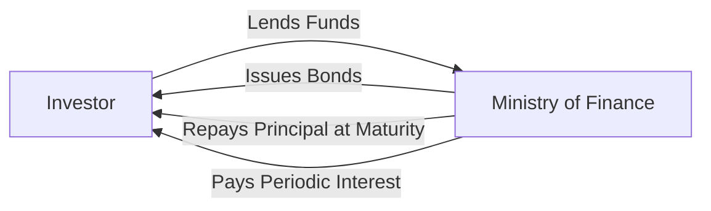
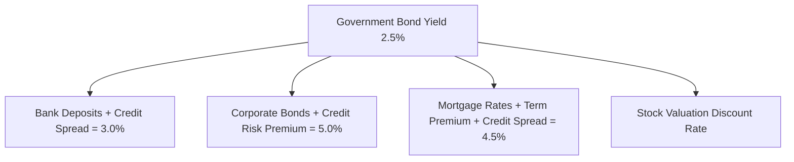
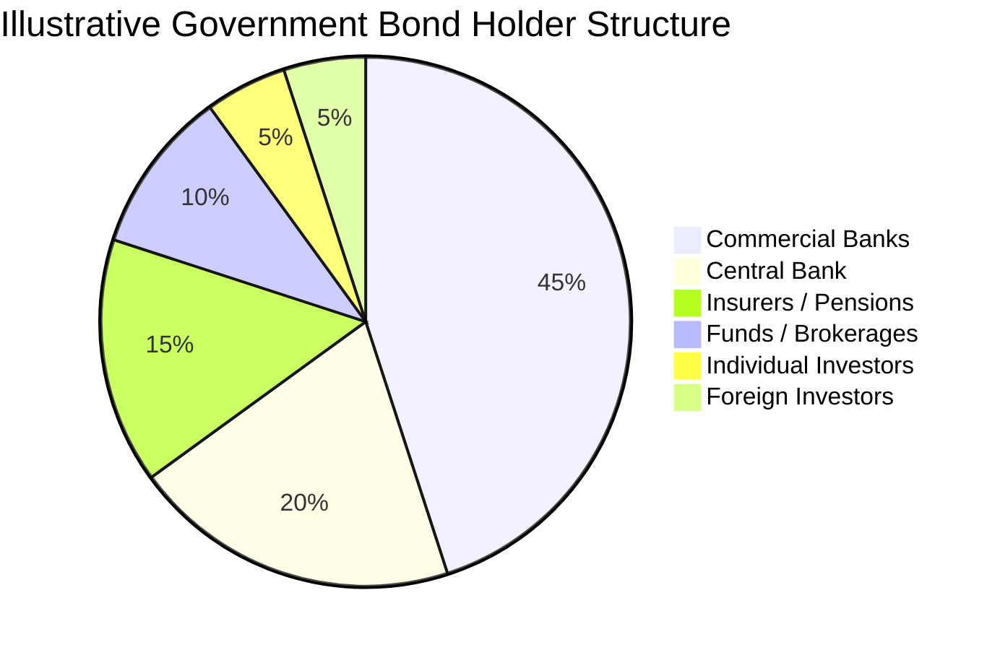
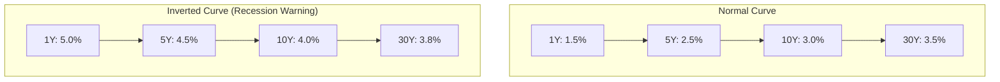
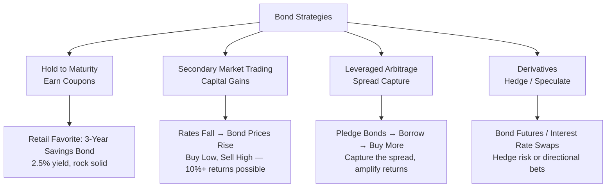
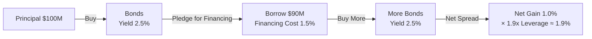

# What Are Government Bonds? A Complete Guide

## I. The Essence of Government Bonds: A Nation's "IOU"

A government bond, formally known as a **sovereign bond**, is essentially an **IOU issued by a government when it borrows money from you**.

Think of it this way: your friend needs 10,000 dollars to open a store, borrows from you, and writes an IOU promising to repay the principal in 3 years with 3% annual interest. Replace "your friend" with "the government" and "10,000 dollars" with "billions or trillions", and you have the basic logic of government bonds.



The three elements of a government bond:

| Element | Description | Example |
|---------|-------------|---------|
| **Face Value** | The nominal amount of the bond | $100 per bond |
| **Coupon Rate** | The agreed annual interest rate | 2.5% per year |
| **Maturity** | Time from issuance to repayment | 3 / 10 / 30 years |

## II. Why Do Governments Issue Bonds?

Governments issue bonds not simply because they are "short on cash" — bonds serve multiple macroeconomic functions:

### 2.1 Covering Fiscal Deficits

When tax revenues and other government income fall short of expenditures, borrowing is needed to bridge the gap. Government bonds are the primary financing instrument.

```
Government Revenue (taxes, SOE profits, etc.) ──→ covers ──→ Expenditures (infrastructure, defense, education, etc.)
                                                              │
                                        Shortfall ←── covered by issuing bonds
```

### 2.2 Macroeconomic Regulation

Government bonds are a core tool for central bank **monetary policy**:

- During **economic overheating**, the central bank sells bonds to absorb liquidity from the market and cool the economy.
- During **economic downturns**, the central bank buys bonds to inject liquidity and stimulate the economy.

This is known as **Open Market Operations** (OMO).

### 2.3 Providing a Risk-Free Benchmark Rate

The government bond yield is considered a country's **risk-free rate**, serving as the pricing anchor for the entire financial system:



All other financial assets are priced by adding their respective **risk premiums** on top of the government bond yield.

### 2.4 Financing Major Projects

Infrastructure (high-speed rail, water conservancy, renewable energy, etc.) requires massive upfront investment with long payback periods — projects that private capital is unwilling or unable to fund. Governments issue long-term bonds to finance these public-good investments.

## III. Types of Government Bonds

### 3.1 By Maturity

| Type | Maturity | Characteristics |
|------|----------|-----------------|
| Treasury Bills (T-Bills) | Under 1 year | Highly liquid, near-cash |
| Treasury Notes (T-Notes) | 1–10 years | Balances yield and liquidity |
| Treasury Bonds (T-Bonds) | 10+ years (up to 50) | Lock in long-term rates; high price volatility |

### 3.2 By Interest Payment Method

- **Coupon Bonds**: Pay interest periodically (semi-annually or annually), with principal at maturity. Most common.
- **Discount Bonds**: Issued below face value, redeemed at face value at maturity — the difference is the return. Common for short-term bonds.

### 3.3 By Issuance Venue

- **Book-Entry Bonds**: Electronically recorded, tradable on secondary markets.
- **Savings Bonds**: Available to individual investors only; not listed on exchanges but redeemable early with penalties.

## IV. Why Are Government Bonds Called the "Safest Asset"?

Government bonds carry minimal default risk because nations possess three unique "privileges":

1. **Taxation Power**: The government can raise revenue through taxes to repay debt.
2. **Currency Issuance Power**: A sovereign state can print its own currency to repay bonds denominated in that currency.
3. **Refinancing Ability**: Governments can typically "roll over" debt — borrowing new money to repay old.

> ⚠️ The above privileges apply only to countries issuing bonds in their **own sovereign currency**. If a country borrows in foreign currency (e.g., US dollar debt) and cannot print dollars, default risk is very real — Russia (1998) and Argentina (2001) are textbook examples.

## V. Major Players in the Government Bond Market



### 5.1 Commercial Banks

Banks are the largest buyers of government bonds. When market risks rise, banks tend to allocate funds to safe government bonds; they also hold bonds as liquidity management tools.

### 5.2 Central Banks

Central banks buy and sell bonds not for profit but to execute monetary policy — absorbing or injecting base money into the financial system.

### 5.3 Individual Investors

Channels for ordinary people to buy government bonds:
- Bank counters for savings bonds
- Securities accounts for book-entry bonds (secondary market trading)
- Indirect investment through bond funds

## VI. Government Bond Yields: The Economy's "Thermometer"

### 6.1 What Is a Government Bond Yield?

While the coupon rate is fixed, the actual yield fluctuates with bond prices when bonds are traded on secondary markets:

$$
\text{Yield} = \frac{\text{Coupon Interest} + (\text{Face Value} - \text{Purchase Price}) / \text{Remaining Years}}{\text{Purchase Price}} \times 100\%
$$

**The golden rule**: Bond price ↑ → Yield ↓. They move in opposite directions.

### 6.2 The Yield Curve

Plotting yields of bonds with different maturities creates a curve that reflects market expectations about the future economy:



- **Normal Curve**: Long-term rates > short-term rates — healthy economic expansion.
- **Flat Curve**: Long and short rates converge — uncertain economic outlook.
- **Inverted Curve**: Short-term rates > long-term rates — a recession signal that has preceded every US recession in the past 50 years.

> 🚨 Yield curve inversion is one of Wall Street's most closely-watched recession indicators. Over the past 50 years, it has appeared 6–18 months before every US recession.

### 6.3 Factors Affecting Government Bond Yields

| Factor | Direction | Logic |
|--------|-----------|-------|
| Central bank rate hikes | Yield ↑ | Higher base rates make newly issued bonds more attractive |
| Rising inflation expectations | Yield ↑ | Investors demand higher returns to offset purchasing power loss |
| Recession fears | Yield ↓ | Capital floods into safe-haven assets |
| Widening fiscal deficit | Yield ↑ | Increased supply presses prices down |
| Global risk aversion | Yield ↓ | Capital flows into sovereign bond markets |

## VII. Overview of Government Bond Markets

### 7.1 Market Size

China is now the world's **second-largest bond market** (behind the US), with outstanding government bonds exceeding 30 trillion RMB. The US Treasury market remains the largest and most liquid bond market globally, with over $26 trillion in outstanding marketable Treasuries.

### 7.2 Recent Trends


Government bond yields have been trending lower in many major economies, reflecting:
- Decelerating economic growth
- Subdued inflationary pressures
- Accommodative monetary policy stances
- "Asset scarcity" — a shortage of quality yielding assets

### 7.3 Foreign Investors

With the inclusion of major government bond markets in global bond indices (Bloomberg Barclays, J.P. Morgan, FTSE Russell), foreign capital continues to flow in. Foreign institutions now hold trillions of dollars' worth of government bonds globally, making them a force to be reckoned with.

## VIII. How Can Ordinary People Invest in Government Bonds?

| Method | Minimum Investment | Liquidity | Suitable For |
|--------|:------------------:|-----------|--------------|
| Savings bonds at bank counters | $100 | Low (hold to maturity) | Risk-averse, seeking absolute safety |
| Book-entry bonds via brokerage | $1,000+ per lot | High (sell anytime) | Some investment experience |
| Bond ETFs / Bond funds | $1 | High | Most individual investors |
| Bond futures | High ($50k+) | Extreme | Professional investors |

## IX. Common Misconceptions

### Misconception #1: "Governments don't go bankrupt, so bonds are risk-free"

Nations are indeed extremely unlikely to default on local-currency debt, but **interest rate risk and inflation risk** remain. A 30-year bond yielding 2.5% loses real purchasing power if inflation reaches 5% ten years later.

### Misconception #2: "Bond yields are too low to be worth investing"

Government bonds serve as **ballast** in an investment portfolio, not the engine. They provide certainty — when stock markets crash, government bonds are often one of the few assets that preserve value.

### Misconception #3: "Bonds are like savings accounts — you can withdraw anytime"

Savings bonds incur **penalties** when redeemed early, with tiered interest calculations. Book-entry bonds sold on the secondary market can face **price losses** if market rates have risen since purchase.

---

# How to "Play" Government Bonds — From Earning Interest to High-Leverage Bets

Now that we understand what government bonds are, let's explore how different players actually "play" them — from retirees queuing at bank counters to fund managers running leveraged arbitrage strategies.

## X. The Strategy Landscape



## XI. Strategy #1: Hold to Maturity — The Simplest "Passive Income"

### 11.1 How It Works

Buy a bond, do nothing, and collect the principal plus all coupon payments at maturity.

### 11.2 Example

> **Case: Bob buys savings bonds**
>
> In March 2024, Bob bought $10,000 worth of 3-year savings bonds at a 2.38% coupon rate at his bank.
>
> - Each March, Bob's account automatically receives $238 in interest.
> - In March 2027: $10,000 principal returned + final $238 interest payment.
> - Total earnings over three years: $238 × 3 = $714.
> - **Annualized return: 2.38%, near-zero risk.**

### 11.3 Who Is This For?

- Risk-averse, conservative investors
- Those with a defined future spending need (e.g., child's tuition in 3 years)
- The "ballast" allocation in a diversified portfolio

### 11.4 Limitations

- **Low liquidity**: early redemption of savings bonds incurs penalties with tiered interest calculations.
- **Inflation erosion**: if inflation exceeds the coupon rate, real purchasing power shrinks.
- **Opportunity cost**: locked in for 3 years — if a better opportunity emerges, the money is stuck.

---

## XII. Strategy #2: Secondary Market Trading — Profiting from Price Movements

### 12.1 Core Logic

Bond prices and market interest rates move in **opposite directions**:

```
Market Rates ↓  →  New bonds have lower coupons  →  Your older high-coupon bond becomes more attractive  →  Price ↑
Market Rates ↑  →  New bonds have higher coupons  →  Your older low-coupon bond loses appeal  →  Price ↓
```

This creates opportunities for buying low and selling high.

### 12.2 Example

> **Case: Alice's rate-decline arbitrage**
>
> In early 2023, the 10-year government bond yield was 2.90%. Alice bought a 10-year bond (face value $100, coupon 2.80%) on the secondary market at **$98**.
>
> By mid-2024, the 10-year yield had fallen to 2.25%. Her older bond, with its higher coupon, now traded at **$103**.
>
> - Interest income during the holding period: $100 × 2.80% × 1.5 years = $4.20
> - Capital gain on sale: $103 − $98 = $5.00
> - Total return: $4.20 + $5.00 = $9.20
> - **Annualized return: $9.20 / $98 / 1.5 ≈ 6.26%**
>
> Far exceeding the 2.38% savings bond return — Alice profited from the "rates down → bonds up" dynamic.

### 12.3 Who Is This For?

- Investors who can assess the direction of interest rates
- Those with brokerage accounts for trading book-entry bonds
- Those willing to accept some price volatility risk

### 12.4 Risk Warning

If your rate call is wrong — rates rise, bond prices fall — you can lose principal. For example:

> **Counter-example: The 2022 US "Bond Bear Market"**
>
> The Fed hiked rates aggressively, and the 10-year Treasury yield surged from 1.5% to 4.2%. If you had bought long-term Treasuries at the end of 2021, you could have lost **15%–20%** within a year — a historically brutal rout for bonds.

---

## XIII. Strategy #3: Leveraged Arbitrage — The Institutional "Money Printer"

### 13.1 Core Logic

This is the dominant strategy for banks and funds: **buy bonds → pledge them as collateral to borrow money → use the borrowed money to buy more bonds → pledge again…** Profiting from the **spread** between bond yields and financing costs.



### 13.2 Example

> **Case: A bond fund's leveraged operation**
>
> A bond fund has $1 billion in net assets. The fund manager executes the following:
>
> | Step | Action | Amount |
> |------|--------|--------|
> | ① | Buy $1B in government bonds, coupon 2.5% | $1.0B |
> | ② | Pledge the $1B in bonds through **repo** to borrow | +$0.8B |
> | ③ | Use $0.8B to buy more bonds, coupon 2.5% | +$0.8B |
> | ④ | Pledge the new $0.8B bonds for more borrowing… (capped at 120%–140% leverage by regulation) | ≈ +$0.4B |
>
> **Final position: ~$2.2B in bonds, leverage ≈ 2.2x.**
>
> | Item | Amount |
> |------|--------|
> | Asset-side return ($2.2B × 2.5%) | $55M |
> | Liability-side cost ($1.2B × 1.5%) | $18M |
> | **Net return** | **$37M** |
> | **Return on Net Assets** | **3.7% (vs. 2.5% unlevered)** |
>
> With 2.2x leverage, the return rose from 2.5% to 3.7%. A 1.2% bump may seem modest, but on a multi-billion-dollar fund, that's real money.

### 13.3 The Key Tool: Bond Repo

```
The interbank repo market is one of the largest funding markets, with average daily volumes exceeding $5 trillion.
```

The essence of a repo: **a short-term loan collateralized by bonds**. You temporarily "sell" your bonds to a counterparty, agreeing to buy them back days later at a slightly higher price — the difference is the counterparty's interest.

| Type | Term | Use Case |
|------|------|----------|
| Overnight Repo (R001) | 1 day | Daily liquidity management |
| 7-Day Repo (R007) | 7 days | Short-term leveraged financing |
| 14-Day / 1-Month | 14–30 days | Quarter-end / year-end funding arrangements |

### 13.4 Risks

- **Spread inversion**: if financing costs rise above bond yields, leverage becomes a "loss accelerator."
- **Liquidity crunch**: in extreme markets (e.g., the 2013 "cash crunch"), repo rates can spike above 10%+, forcing institutions to sell assets at fire-sale prices.
- **Margin calls**: if the pledged bonds fall in value, counterparties demand additional collateral — or liquidate your bonds directly.

---

## XIV. Strategy #4: Government Bond Futures — Amplified Speculation

### 14.1 What Are Bond Futures?

A futures contract is an agreement to buy or sell bonds at a fixed price in the future. You don't need to actually own the bonds — just post **margin** (typically 2%–5%), enabling leverage of 20–50x.

```
A 10-year bond futures contract covering $100,000 in face value requires only ~$2,000 in margin.
For every 0.01% move in yields, the futures price shifts roughly $70–80.
Right call → thousands in profit per day. Wrong call → same in losses.
```

### 14.2 Examples

> **Case: Hedging — a fund manager's "insurance"**
>
> Manager Zhang runs a $5 billion bond fund and believes rates will rise over the next 3 months (bonds will fall).
>
> He doesn't want to sell his bond holdings (market impact, transaction costs), so he goes short on bond futures:
>
> | Leg | Action |
> |-----|--------|
> | Spot (physical) | Continue holding $5B in bonds |
> | Futures | Short ~$5B notional in 10-year bond futures |
>
> **Three months later, rates did rise. The physical bonds lost $250M, but the futures short position gained $240M.**
> The net loss was only $10M — the futures profits offset the spot losses.
>
> This is **hedging**: transferring interest rate risk away.

> **Case: Directional speculation — "naked short" on bonds**
>
> In early 2024, Tom believed the central bank was about to tighten liquidity and rates would spike. He **naked-shorted** 50 contracts (~$5M notional) in bond futures, posting ~$100K in margin.
>
> Instead of tightening, the central bank unexpectedly cut rates. The 10-year yield plunged from 2.5% to 2.2%, and bond futures skyrocketed.
>
> - Loss per contract: ~$2,400
> - Total loss on 50 contracts: $120,000
> - His entire $100K margin was wiped out, plus he owed the broker an additional $20K (a margin blowout)
>
> **Wrong direction + high leverage = total wipeout.**

### 14.3 Who Is This For?

- **Hedging**: Institutions holding large bond portfolios (banks, insurers, funds).
- **Directional speculation**: Professional traders who can stomach margin-call risk.
- **Not suitable for**: individual investors without rigorous training — leverage cuts both ways.

---

## XV. Strategy #5: Riding the Yield Curve

### 15.1 Core Logic

The yield curve is normally **upward-sloping** (long rates > short rates). Buy a bond with a maturity *longer* than your planned holding period, hold it as the remaining maturity shortens, and sell when the yield decline drives the price up.

### 15.2 Example

> **Case: Riding the curve**
>
> Current yield curve:
> - 1-Year: 1.80%
> - 3-Year: 2.30%
> - 5-Year: 2.60%
>
> Zhao plans to hold for 2 years. Instead of buying a 2-year bond, he buys a **5-year bond** (coupon 2.60%, price $100).
>
> Two years later, the bond has 3 years remaining. Assuming the 3-year rate is still 2.30%, his bond — with its higher coupon — now trades at roughly **$100.85**.
>
> | Return Source | Amount |
> |---------------|--------|
> | 2 years of coupons ($2.60 × 2) | $5.20 |
> | Capital gain on sale ($100.85 − $100) | $0.85 |
> | **Total** | **$6.05** |
> | **Annualized return** | **≈ 3.03%** |
>
> If he had simply bought a 2-year bond (yielding 2.05%), he'd have earned only $4.10 over two years. The ride strategy boosted returns by nearly 50%.

### 15.3 Risks

- If the yield curve flattens or inverts, the ride strategy fails or loses money.
- If overall rates rise sharply during the holding period, falling bond prices can swallow the ride gains.

---

## XVI. Strategy #6: Spread Trading — "Arbitrage" Between Bonds

### 16.1 Core Logic

Different maturity bonds have yield spreads between them. By going "long one + short another," you bet on whether the spread will widen or narrow.

### 16.2 Example

> **Case: Curve steepener trade**
>
> Current market:
> - 2-Year yield: 2.00%
> - 10-Year yield: 2.50%
> - **Spread (10Y − 2Y) = 0.50% (50 bp)**
>
> Zhao believes the central bank will cut rates, and short-term rates will fall faster than long-term rates → the spread will **widen** to 80 bp.
>
> | Action | Direction | Logic |
> |--------|-----------|-------|
> | Long 2-Year bonds | Buy | Rate cuts directly benefit the short end; prices rise |
> | Short 10-Year bonds | Sell | Long end has limited room to fall; will underperform |
>
> A month later, the central bank cuts rates by 10 bp:
> - 2-Year yield falls to 1.70%, price rises ~0.6%
> - 10-Year yield falls to 2.40%, price rises ~0.9%
>
> The pair **lost money** — because the spread actually **narrowed** to 70 bp (0.90% − 0.60% = 0.30%), opposite to his "widen" call.

> 💡 This is the risk of spread trading: your directional view can be right (rates went down), but you won on the wrong leg. The long 2-year gain was more than offset by the short 10-year loss, because the latter rallied harder.

---

## XVII. Strategy Comparison Summary

| Strategy | Return Source | Typical Annual Return | Max Drawdown Risk | Leverage | Suitable For |
|----------|--------------|:---------------------:|:-----------------:|:--------:|--------------|
| Hold to Maturity | Coupons | 2%–3% | ≈ 0 (sovereign local-currency) | None | Everyone |
| Secondary Market Trading | Capital gains + coupons | 3%–10% | 5%–20% | None/Low | Informed individuals |
| Leveraged Arbitrage | Spread | 3%–5% | 5%–15% (margin call risk) | 1.5–3x | Institutions |
| Bond Futures | Directional gains | ±?? (highly uncertain) | Unlimited (blowout possible) | 20–50x | Professional traders |
| Riding the Curve | Yield roll-down + coupons | 3%–5% | 2%–8% | None/Low | Intermediate/advanced |
| Spread Trading | Spread changes | ±?? (uncertain) | Depends on leverage | Variable | Institutions / advanced |

---

## XVIII. Practical Advice for Individuals

### 18.1 How to Get Started

| Capital | Recommended Approach | Channel |
|:-------:|----------------------|---------|
| < $10K | Bond funds / Bond ETFs | Brokerage app or robo-advisor |
| $10K–$50K | Savings bonds + bond fund mix | Bank counter + brokerage |
| > $50K | Consider direct book-entry bonds | Brokerage platform |

### 18.2 Key Principles

1. **Know whether you're after interest income or capital gains.** The two require completely different mindsets — mixing them leads to getting hit on both sides.
2. **Use leverage only if you can survive a margin blowout.** Institutions use leverage because they have risk controls and capital buffers. A retail investor going in naked with leverage is indistinguishable from gambling.
3. **A bond's true enemy isn't default — it's inflation and rising rates.** The 2022 US bond bear market taught everyone: don't assume bonds don't fall.
4. **In a rate-cutting cycle, lock in for longer, and do it early.** Getting the broad direction right matters far more than agonizing over 0.1% spread differences.
5. **Most people only need a bond fund.** Fund managers handle the leverage, riding, and spread trades for you — you pay a 0.3% management fee and move on.

---

## XIX. Conclusion

Government bonds are far more than just a "national IOU":

1. **For governments**, they are instruments of fiscal financing and macroeconomic regulation.
2. **For central banks**, they are the medium for monetary policy operations.
3. **For financial markets**, they are the pricing benchmark and the ultimate safe haven.
4. **For individuals**, they are the most foundational preservation asset — and a window into the macroeconomy.

And the ways to participate span from the simplest "buy and hold for interest" to professional leveraged arbitrage, futures hedging, and spread trading — each with its own risk-reward profile.

Understanding government bonds is understanding the foundation of the modern financial system. They provide the reference point for all risk-taking: without a risk-free rate, there is no risk pricing; without government bonds, there is no modern financial market.
