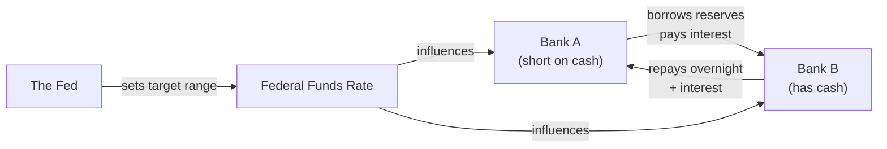
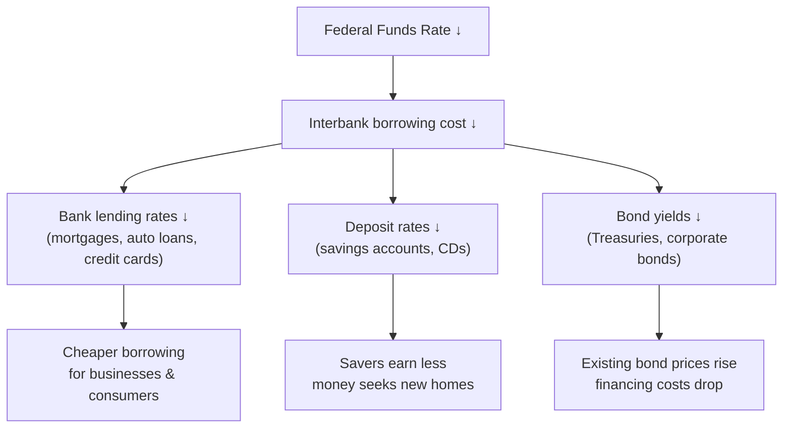
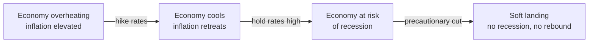
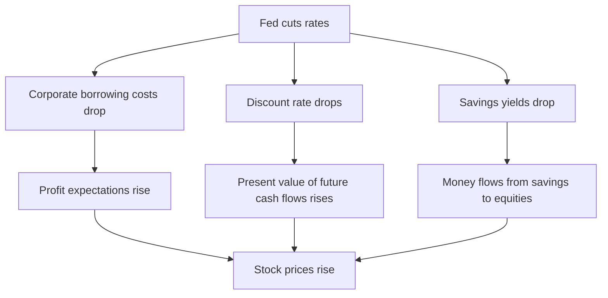
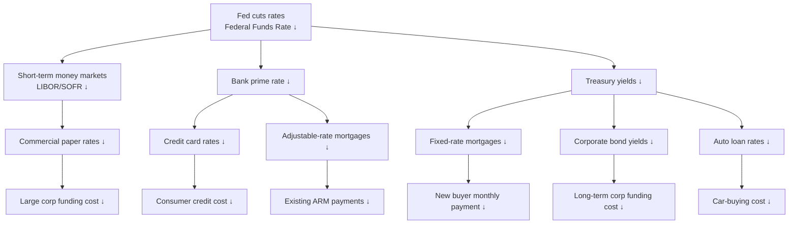
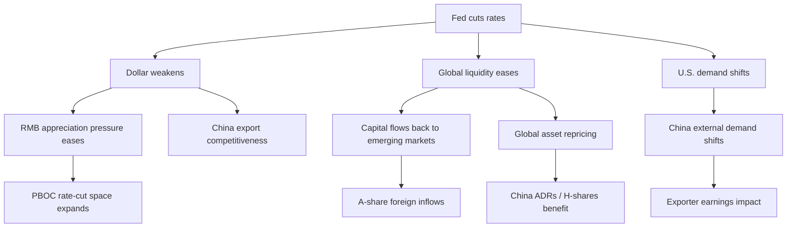
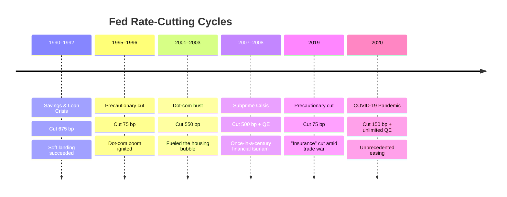
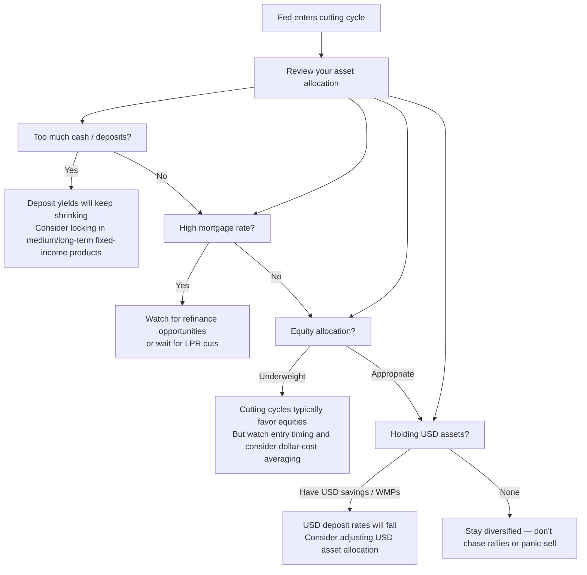
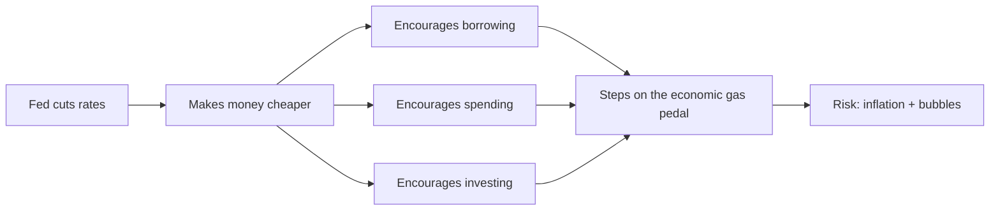

# What Does a Fed Rate Cut Really Mean?

## I. Who Is the Federal Reserve?

The **Federal Reserve (the Fed)** is the central bank of the United States. Its role is similar to that of the People's Bank of China — it manages monetary policy and regulates the temperature of the economy. It is responsible only for the U.S. economy, but because the U.S. dollar is the world's reserve currency, every decision it makes ripples across the globe like a chain of dominoes.

The Fed's most important "thermostat" is called the **Federal Funds Rate**. This is NOT the interest rate you pay at a bank for a loan — it is the rate at which **commercial banks lend reserves to each other overnight**.

In plain terms: Bank A is short on cash today, so it borrows from Bank B to get through the night. The interest on that loan is the federal funds rate.



## II. What Exactly Is Being "Cut"?

A Fed "rate cut" means **lowering the target range for the federal funds rate**. For example:

```
Before: 5.25% – 5.50%
After a 50 bp cut: 4.75% – 5.00%

(1 basis point = 0.01%, so 50 bp = 0.50%)
```

This rate is the **foundation** for all interest rates in the economy. When it drops, the entire interest rate structure sinks with it:



So a Fed rate cut essentially makes **capital cheaper throughout the entire economy**.

### 2.1 Why Do Lending Rates Follow?

The key logic: **a bank's loan pricing = cost of funds + credit risk premium + operating costs + profit**. When the federal funds rate drops, it directly squeezes the bank's cost of funds. The transmission works in two steps:

**Step 1: The bank's "wholesale cost" gets cheaper.**

Where do banks get the money to lend? Three main sources — customer deposits, interbank borrowing, and direct borrowing from the Fed (the discount window). When the federal funds rate drops, the cost of borrowing between banks falls immediately, and the Fed's discount rate typically follows. It's like the bank's wholesale cost just dropped.

**Step 2: Competition forces banks to pass on the savings.**

If only one bank's funding cost dropped, it could quietly pocket the extra margin — borrow cheap, lend high. The problem is **every bank enjoys this lower cost simultaneously**. When Bank A drops its mortgage rate from 6.5% to 6.2% to win customers, Bank B either matches or watches its clients walk away. After a round of price competition, lending rates fall across the entire industry.

```
Bank loan pricing logic:

  Loan rate = Cost of funds (driven by Fed Funds Rate) + Credit risk premium + Operating costs + Target profit
                    ↑
                    └── A rate cut directly lowers this term, giving banks room to cut
                    └── Competition then "squeezes" that room over to borrowers
```

### 2.2 Why Do Deposit Rates Fall Too?

This is the most counterintuitive part — the bank's borrowing cost drops, so why does the interest on my savings go *down*? The logic:

**Deposit rates are not a "favor to customers" — they are "competition for funds."**

Banks need deposits to make loans. When money is tight in the market and interbank rates are high, banks must offer higher deposit rates to attract savers — "if you don't deposit with us, we'll have to borrow from another bank at an even higher cost." That's why your savings account rate went up during the hiking cycle.

After a rate cut, the situation flips:

1. **The alternative got cheaper.** Banks no longer rely on expensive deposit-gathering — if customers don't deposit, the bank can borrow from peers at a much lower rate, or even go directly to the Fed. Deposits are no longer the only option. "If you won't save with us, fine — we'll borrow cheaper on the open market."
2. **Lending rates are falling too — the spread can't compress forever.** A bank's profit comes from the gap between loan interest and deposit interest. If the lending rate drops from 6% to 5% while deposit rates stay at 4%, the spread shrinks to just 1% — not enough to cover operating costs. Banks MUST push deposit rates down to maintain viable margins.
3. **Savers lose bargaining power.** In a falling-rate environment, savers can't find higher-yielding alternatives, weakening their negotiating position.

```
Rate cut → deposit rate decline transmission chain:

  Federal Funds Rate ↓
    → Interbank borrowing cost ↓ (banks can get cheap funds without relying on deposits)
      → Banks' "thirst" for deposits drops
        → Banks lower deposit rates (if you won't save, someone else will — or the bank just borrows on the market)
          → Savers' interest income shrinks
```

### 2.3 A Day in the Life of a Bank

Let's ground this in a concrete scenario:

> **Simulation: An asset-liability committee's decision before and after a rate cut**
>
> **Before the cut (Federal Funds Rate at 5.50%):**
> - Bank borrows 100 million from peers: cost = 5.50% annualized
> - To reduce reliance on expensive interbank borrowing, the bank aggressively attracts deposits at **4.50%**
> - It lends out at **7.00%**
> - Spread: 7.00% − 4.50% = **2.50%** (using deposits) or 7.00% − 5.50% = **1.50%** (using interbank funds)
>
> **After the cut (Federal Funds Rate at 4.75%):**
> - Bank borrows 100 million from peers: cost = 4.75% annualized (saving 0.75%)
> - Motivation to attract deposits drops; deposit rate falls from 4.50% to **3.80%**
> - Lending rate, pressured by competition, drops from 7.00% to **6.50%**
> - Spread: 6.50% − 3.80% = **2.70%** (using deposits) or 6.50% − 4.75% = **1.75%** (using interbank funds)
>
> **Takeaway:** After the cut, lending rates fell by 0.50%, deposit rates fell by 0.70%, and the bank's spread actually widened slightly from 2.50% to 2.70%. Did savers and borrowers both lose to the bank? No — borrowers pay less in absolute interest, savers just earn a bit less, and the bank captures a more stable but not necessarily larger spread. **The real winner is the broader economy — cheaper capital means more investment and consumption.**

### 2.4 A Common Follow-up: The Fed Only Controls Interbank Rates — How Does That Reach My Savings Account?

The Fed does not directly set your deposit rate. What it does is **change the marginal funding cost for the entire banking system** — that is, the price a bank pays to borrow one more dollar. When this "marginal cost" drops, banks recalibrate the pricing of ALL their funding sources:

| Funding Source | Cost Before Cut | Cost After Cut | Why It Changed |
|----------------|:--------------:|:--------------:|----------------|
| Interbank borrowing | 5.50% | 4.75% | Directly linked to the federal funds rate |
| Fed discount window | 5.75% | 5.00% | Discount rate typically follows |
| Customer deposits | 4.50% | 3.80% | Banks no longer need to bid aggressively for deposits |
| Bond issuance | 5.80% | 5.00% | Dragged down by falling Treasury yields |

Every funding channel drops together — that's what "foundation" means. When the federal funds rate sinks, every floor above it sinks too.

## III. Why Cut Rates?

Rate cuts typically happen in two scenarios:

### Scenario 1: Recession Risk ("Rescue" Cuts)

Growth is slowing, unemployment is rising, and businesses are reluctant to invest. Cutting rates makes borrowing cheaper → businesses borrow to expand → jobs are created → people spend their wages → businesses profit → the economy turns over.

> **Case study: March 2020**
>
> As COVID-19 hit the global economy, the Fed cut rates twice in two weeks — an emergency move that took rates from 1.50%–1.75% straight to 0%–0.25%, paired with unlimited QE (Quantitative Easing). This was a textbook "rescue" cut — do whatever it takes to prevent economic collapse.

### Scenario 2: Precautionary Cuts (the "Soft Landing")

Inflation is under control, but rates are high enough to hurt the economy. The Fed makes small, preemptive cuts to ease pressure without reigniting inflation. This is the much-discussed **"soft landing"** script — bringing the economy down from altitude without crashing it.



### Triggers the Fed Watches

| Indicator | What They Watch | Signal for a Cut |
|-----------|----------------|------------------|
| **PCE Price Index** | Core PCE approaching 2%? | Sustained at or below 2% → door opens |
| **Nonfarm Payrolls** | Monthly job gains | Consistent weakening → labor market needs stimulus |
| **Unemployment Rate** | Is it rising significantly? | Rapid climb → recession risk rising |
| **GDP Growth** | Is growth decelerating? | Consecutive slowdowns → policy support needed |
| **Financial Conditions** | Are credit conditions too tight? | Banks "hoarding" → need to lower funding costs |

## IV. What Happens After a Rate Cut?

### For Stocks 📈 (typically positive, but not always)



**But distinguish between two types of cuts:**

| Type of Cut | Typical Stock Reaction | Why |
|-------------|----------------------|-----|
| **Precautionary cut** | Usually rises | Fundamentals still OK; cut is "icing on the cake" |
| **Recession cut** | May crash | Cut confirms "something is badly wrong" |

> **Historical comparison**
>
> - 1995 precautionary cut: stocks surged for two years (pre-dot-com)
> - 2001 recession cut: cut 475 bp, Nasdaq still fell 78%
> - 2007–2008 recession cut: cut 500 bp, S&P 500 was cut in half

### For Bonds 📉

- Newly issued bonds carry lower coupons → existing bonds (locked in at higher rates) become scarce and sought-after → **bond prices rise**
- In a cutting cycle, bondholders earn primarily from **price appreciation**, not coupon income

### For Housing 🏠 (positive)

- Mortgage rates follow down → monthly payments drop → more people can afford to buy → home prices may rise
- Existing mortgage holders get a **refinance** opportunity — swap a high-rate mortgage for a lower one, saving significant interest

### For the U.S. Dollar 💵 (typically weakens)

- Lower USD rates → holding dollar assets becomes less attractive → capital flows to higher-yielding currencies → dollar depreciates
- Emerging-market currencies like the Chinese yuan appreciate relatively, imports become cheaper

### For Gold 🥇 (typically positive)

Gold pays no interest — its "enemy" is high rates. When rates are high, holding gold carries a large opportunity cost (you forgo the interest you could earn in a savings account). When rates drop, gold's appeal returns. Combined with dollar weakness, gold typically strengthens.

### For Commodities 🛢️

- A weaker dollar → dollar-denominated commodities (oil, copper, iron ore) tend to rise in price
- Rate cuts stimulate the economy → industrial demand expectations improve → demand-side tailwind for commodities

## V. The Transmission Mechanism: From the Fed to You



The entire transmission chain has **lags** — your mortgage doesn't adjust the moment the Fed announces a cut. In general:

| Link in the Chain | Response Speed |
|-------------------|:-------------:|
| Money market rates | Instant |
| Short-term loans (credit cards, floating-rate) | 1–2 months |
| Long-term loans (fixed-rate mortgages) | 3–6 months |
| Real economy (business investment, employment) | 6–18 months |

This is why the Fed tries to "get ahead of the curve" — by the time economic data has visibly deteriorated, cutting rates is often already too late.

## VI. Rate Cuts ≠ "Printing Money" — The Fed's Full Toolkit

A rate cut is merely the most conventional tool in the Fed's arsenal. The complete "loosening toolkit" includes:

| Tool | Mechanism | Firepower |
|------|-----------|:---------:|
| **Rate Cuts** | Lower the federal funds rate target | ⭐⭐⭐ |
| **Quantitative Easing (QE)** | Central bank directly buys Treasuries and MBS, injecting liquidity | ⭐⭐⭐⭐⭐ |
| **Forward Guidance** | Verbal commitment to "keep rates low until condition X is met" | ⭐⭐ |
| **Yield Curve Control (YCC)** | Directly cap the yield on a specific Treasury maturity | ⭐⭐⭐⭐ |
| **Emergency Lending Facilities** | Targeted funding for specific sectors or institutions | ⭐⭐⭐ |

> **The Fed's "all-in" combo — March 2020**
>
> 1. Emergency 150 bp cut to 0%–0.25%
> 2. Unlimited QE ($75 billion/day in Treasuries + $50 billion/day in MBS)
> 3. Reactivated a suite of emergency lending tools from the 2008 crisis
> 4. Even broke precedent to start buying corporate bond ETFs
>
> This barrage ballooned the Fed's balance sheet from $4 trillion to nearly $9 trillion.

## VII. Spillover Effects on China

Fed rate cuts transmit to China through several channels:



| Transmission Channel | Direction | Details |
| :--- | :--- | :--- |
| **Exchange Rate** | Weaker USD → less RMB depreciation pressure → PBOC has more room to cut | Narrowing China-U.S. rate spread reduces capital outflow pressure |
| **Capital Flows** | USD assets less attractive → some capital returns to emerging markets (including A-shares) | Northbound connect flows may accelerate |
| **External Demand** | If the U.S. economy avoids recession → stable Chinese export demand | Positive for manufacturing and exporters |
| **Policy Space** | China-U.S. rate spread narrows → less constraint on China's monetary policy | Creates conditions for RRR cuts and rate cuts |
| **Hong Kong Stocks** | HKD pegged to USD, follows down → HK stock valuation pressure released | Positive for Hang Seng Index and Hang Seng Tech |

So when you see "Fed Cuts Rates by X Basis Points," it's not just a U.S. story — **China's rate-cut window may also open**, affecting your mortgage rate, wealth-management returns, A-share market movements, and even the global appeal of RMB-denominated assets.

## VIII. Famous Rate-Cutting Cycles in History



### A Few Historical Patterns

1. **Precautionary cuts (1995, 2019) often achieved soft landings**, with stocks performing well afterward.
2. **Recession cuts (2001, 2007) could not stop bear markets**, because deteriorating fundamentals outweighed the rate cuts.
3. **The end of a cutting cycle is often the beginning of the next bubble** — the 2001 cuts fueled the housing bubble; the 2020 cuts fueled the 2021 meme-stock frenzy and crypto bull run.
4. **The Fed is always "too late" on cuts** — it overtightens, then scrambles to cut only after the data has visibly soured.

## IX. Historical Asset Performance Across Cutting Cycles

Based on average performance across the last six cutting cycles:

| Asset | 6 Months After First Cut | 12 Months After First Cut | Key Variable |
|-------|:------------------------:|:-------------------------:|--------------|
| U.S. Stocks (S&P 500) | +5% to +15% | −10% to +20% | Recession or not? |
| U.S. Treasuries (10Y) | Price +3% to +8% | Price +5% to +12% | Magnitude of cuts |
| Gold | +8% to +20% | +15% to +30% | Real rates |
| U.S. Dollar Index | −3% to −8% | −5% to −12% | Relative rate spreads |
| Emerging-Market Stocks | +5% to +25% | −5% to +35% | Risk appetite |
| Bitcoin | Limited data | Limited data | Liquidity + narrative |

> ⚠️ **Important caveat:** Past performance does not guarantee future results. Every cutting cycle differs in macro backdrop, inflation level, and geopolitical context. These numbers are statistical summaries, not predictions.

## X. Common Misconceptions and Pitfalls

### Misconception 1: "The Fed cut rates → my mortgage drops immediately"

The Fed's rate influences direction, not direct linkage. Your mortgage rate tracks:

- **China:** LPR (Loan Prime Rate), set by the PBOC
- **U.S.:** 10-year Treasury yield + bank spread

Transmission takes time, and the bank's "spread" acts as a buffer — a 50 bp Fed cut does not mean your mortgage drops 50 bp.

### Misconception 2: "Rate cuts are always bullish for stocks"

If the cut happens because the economy is in serious trouble (a recession cut), stocks may crash instead. The key isn't "whether they cut" — it's "**why** they cut."

### Misconception 3: "Rate cuts = inflation must come roaring back"

Not necessarily. If demand itself is weak (a recession), cheap money doesn't automatically become inflation — Japan has had near-zero rates for decades and still battles deflation. Inflation requires **"too much money" AND "too few goods"** simultaneously.

### Misconception 4: "The moment the Fed cuts, I should go all-in on U.S. stocks"

The early phase of a cutting cycle is often the most dangerous — if it coincides with a recession, stocks may still have a long way to fall. History shows that from the first cut to the ultimate market bottom can take another 6–12 months.

### Misconception 5: "Hiking is bad, cutting is good"

For borrowers, cutting is good (less interest to pay). For savers, cutting is bad (less interest earned). For retirees living on fixed income, rate cuts mean their deposit and bond income shrinks. **"Good" or "bad" depends on where you stand.**

## XI. How Should Ordinary People Navigate a Cutting Cycle?



### Practical Suggestions

| Suggestion | Explanation |
|------------|-------------|
| **Don't panic, but don't ignore** | Rate-cut effects are gradual, not overnight. You have time to adjust. |
| **Examine your liabilities** | If you have floating-rate loans, the cutting cycle saves you interest. If you have spare cash, consider paying down some high-interest debt. |
| **Examine your assets** | Cash and deposit yields will keep falling. Consider reallocating some to bonds, high-dividend stocks, or other income-generating assets. |
| **Don't try to time the market** | "I'll buy after the cut" often underperforms "DCA + long-term hold." Markets move faster than you think. |
| **Gold can be ballast** | A falling-rate, weaker-dollar environment is typically positive for gold. It's a reasonable diversifier for a portfolio. |

## XII. Key Terms at a Glance

| Term | Definition |
|------|------------|
| **Federal Funds Rate** | The overnight lending rate between U.S. commercial banks — the Fed's "policy rate" |
| **Basis Point (bp)** | 1 bp = 0.01%. A 50 bp cut = a 0.50% reduction |
| **FOMC** | Federal Open Market Committee; the body that sets rates, meets 8 times a year |
| **Dot Plot** | A scatter plot of FOMC members' future rate projections — the market's favorite guessing game |
| **Soft Landing** | Hiking brings down inflation without causing a recession — the ideal outcome |
| **Hard Landing** | Overtightening sends the economy straight into recession |
| **QE (Quantitative Easing)** | The central bank prints money to buy bonds — a more powerful easing tool than rate cuts |
| **QT (Quantitative Tightening)** | The reverse of QE — shrinking the balance sheet to drain liquidity |
| **Real Interest Rate** | Nominal rate minus inflation — this is what actually drives asset prices |
| **Neutral Rate (r\*)** | The theoretical rate that neither stimulates nor restrains the economy |

## XIII. Summary



**In one sentence: A Fed rate cut makes money cheaper — it encourages borrowing, spending, and investing; it steps on the economy's gas pedal.** The side effects are that money gets devalued (inflation risk) and asset-price bubbles can form.

It's a policy choice to "trade today's easing for tomorrow's growth" — and because the U.S. dollar is the world's currency, the whole world rides in the same car.

Understanding Fed rate cuts isn't just about decoding a financial-news headline. It's about grasping the underlying logic of global capital flows — why your mortgage rate is what it is, why your funds rise and fall, and why a decision made yesterday in a faraway country can quietly shift what's in your wallet today.

---

*The next time a push notification says "The Fed cut rates by X basis points," you won't need to scratch your head — you'll already know what it means for you.*
