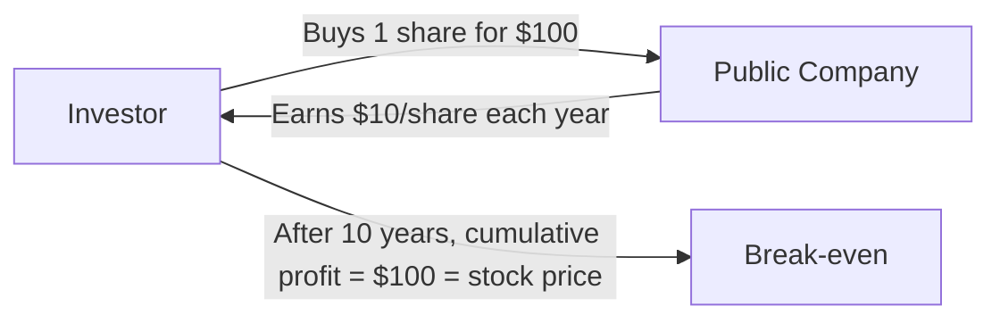
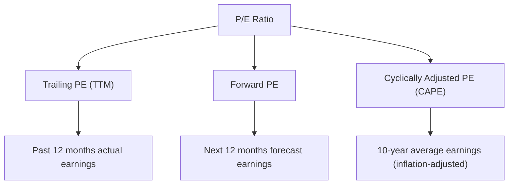
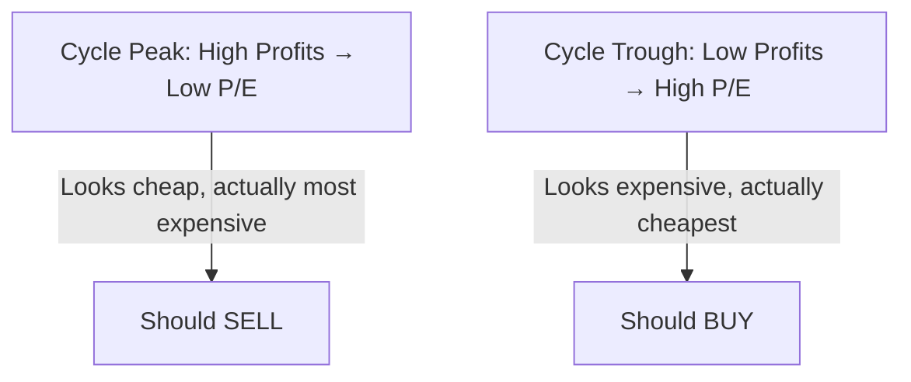

# What Is P/E Ratio? Understanding the Core Metric of Stock Valuation

## I. The Essence of P/E: How Much Are You Willing to Pay for $1 of Profit?

The **Price-to-Earnings Ratio** (P/E) is the most fundamental and widely used valuation metric in stock investing. Its core meaning is dead simple:

> **How many dollars are you willing to pay for every $1 of profit the company earns?**

A quick example:

| Scenario | Stock Price | Earnings Per Share (EPS) | P/E Ratio | Meaning |
|----------|:---:|:---:|:---:|------|
| Company A | $100 | $10 | **10x** | You pay $100; the company earns $10/year for you — payback in 10 years |
| Company B | $100 | $2 | **50x** | You pay $100; the company earns $2/year for you — payback in 50 years |

The P/E ratio is essentially a rough **"payback period"** estimate. A 10x P/E means that, assuming profits stay constant, it takes 10 years for the company to earn back your investment.



## II. Three Ways to Calculate P/E

P/E seems simple (Price ÷ EPS), but the choice of "which EPS" gives us at least three common variants:

### 2.1 Trailing P/E (TTM P/E)

Uses **actual earnings per share over the past 12 months** (Trailing Twelve Months).

```
Trailing P/E = Current Stock Price ÷ TTM EPS
```

**Characteristics**: Most reliable — based on real, historical profits. The downside: it's backward-looking. If a company just reported a disaster quarter, TTM P/E might look "cheap" when it's actually a trap.

### 2.2 Forward P/E

Uses analyst **earnings forecasts for the next 12 months**.

```
Forward P/E = Current Stock Price ÷ Forward EPS (FWD EPS)
```

**Characteristics**: More forward-looking, but entirely dependent on analyst accuracy. If analysts are collectively over-optimistic, Forward P/E will look "artificially low."

### 2.3 Shiller CAPE (Cyclically Adjusted P/E)

Proposed by Nobel laureate Robert Shiller, uses **the average of 10 years of inflation-adjusted earnings**.

```
CAPE = Current Stock Price ÷ 10-Year Average Inflation-Adjusted EPS
```

**Characteristics**: Smooths out economic cycle fluctuations. Best for judging overall market valuation levels (e.g., S&P 500 CAPE). Not suitable for individual stocks.



## III. The Three P/Es Can Be Radically Different

Take SpaceX (SPCX) on its IPO day as an example:

| P/E Type | Value | Why |
|----------|:----:|------|
| **Trailing P/E (TTM)** | N/M | Company is still losing money; TTM EPS is negative |
| **Forward P/E** | N/M | Analyst forecast FWD EPS is −$0.64 |
| **CAPE** | N/A | Not enough public trading history |

> This is P/E's first lesson: **unprofitable companies have no meaningful P/E.** P/E only works for companies with stable, positive earnings.

## IV. How to Interpret High vs. Low P/E?

### 4.1 Absolute Level: What Counts as "High"?

There is no universal answer, but some historical references:

| P/E Range | General Interpretation | Typical Examples |
|:--------:|------|------|
| **0–10x** | Very low — market expects profits to decline, or sunset industry | Traditional energy, coal, tobacco |
| **10–15x** | Low — mature industry, stable but no growth | Banks, utilities |
| **15–20x** | Reasonable — S&P 500 long-term historical median ~16x | Consumer staples, industrials |
| **20–30x** | High — market expects moderate-to-high growth | Tech blue chips, healthcare |
| **30–50x** | Very high — high growth expected or monopoly premium | High-growth tech, SaaS |
| **50x+** | Extremely high — either a super-growth stock or a bubble | AI-themed stocks, early-stage SaaS |
| **Negative** | Meaningless — company is losing money | Startups, cyclically-depressed companies |

### 4.2 Relative Level: Compare Within Industries

**Cross-industry P/E comparison is one of the most common investor mistakes.**

| Industry | Typical P/E Range | Why? |
|----------|:--------:|------|
| **Technology** | 25–40x | High growth expectations, asset-light |
| **Banking** | 8–12x | Mature, constrained by regulation and interest rates |
| **Utilities** | 12–18x | Stable but no growth, rate-regulated |
| **Biotech** | 20–100x or N/M | R&D-driven, earnings unstable |
| **Semiconductors** | 15–25x | Cyclical, but valuations have trended up |

> **You cannot say a 30x P/E tech stock is "more expensive" than a 10x P/E bank stock.** The tech stock has higher growth expectations; its elevated P/E may be entirely justified.

### 4.3 P/E + Growth = PEG Ratio

To address the "high-growth companies deserve higher P/E" problem, the **PEG ratio** was created:

```
PEG = P/E Ratio ÷ Earnings Growth Rate (%)
```

| PEG Range | General Interpretation |
|:------:|------|
| **< 1.0** | Potentially undervalued |
| **1.0–2.0** | Roughly fair value |
| **> 2.0** | Potentially overvalued |

> ⚠️ PEG's flaw: it depends on future growth rate forecasts — and growth is one of the hardest variables to predict. A low PEG might simply mean "the market expects growth to collapse."

## V. The Core Limitations of P/E — What It Doesn't Tell You

### 5.1 Earnings Can Be "Manipulated"

Accounting profit (the denominator of EPS) is not objective fact — it's a product of accounting standards. Management can adjust earnings through:

- **Depreciation method changes**: lengthen asset depreciation periods → lower annual depreciation → "higher" profit
- **Revenue recognition timing**: accelerate or delay revenue booking
- **One-time items**: non-recurring gains from asset sales
- **Stock-based compensation**: some companies don't expense it

> A company with a seemingly low 5x P/E might simply have sold a building last year.

### 5.2 Ignores Debt Levels

P/E only looks at profits, not the balance sheet. Two companies with identical P/E:

| | Company A | Company B |
|---|:---:|:---:|
| P/E | 15x | 15x |
| Debt | $0 | $50 billion |
| Risk | Low | High |

Company A is clearly safer — but P/E alone reveals nothing about this.

### 5.3 Ignores Capital Expenditure

Some companies (e.g., Fabrinet) show solid net income (reasonable P/E), but actually require massive annual CapEx to maintain equipment. Free cash flow is far below net income — the company "earns money on paper" but can't keep it.

### 5.4 The Cyclical Trap

Cyclical companies (semiconductors, shipping, steel) at their peak have sky-high profits → extremely low P/E → look "cheap." But this is often the best time to **sell**, because profits are about to decline. Conversely, at the cycle trough, P/E is extremely high or negative → looks "expensive" → often the best time to **buy**.



### 5.5 Useless for Unprofitable Companies

As noted, unprofitable companies have negative P/E — it's meaningless. For such companies, investors typically use:

- **Price/Sales (P/S)**: Market Cap ÷ Revenue
- **Price/Book (P/B)**: Market Cap ÷ Net Assets
- **EV/EBITDA**: Enterprise Value ÷ EBITDA

## VI. P/E in Different Market Environments

### 6.1 Interest Rates: The Gravity on P/E

Interest rates act as a "gravitational field" on P/E:

```
Rates ↓ → Bonds become unattractive → Money flows into stocks → P/E expands
Rates ↑ → Bonds become attractive → Money flows out of stocks → P/E contracts
```

This is why, in the 2020–2021 zero-rate era, tech stock P/E ratios ballooned to 50–100x; and during the 2022 rate-hiking cycle, the same companies saw their P/E ratios cut in half.

### 6.2 P/E Characteristics Across Markets

| Market | Typical Index P/E | Characteristics |
|--------|:--------:|------|
| **US (S&P 500)** | 18–25x | High tech weighting drives overall P/E higher |
| **China A-Shares (CSI 300)** | 12–16x | Banks and traditional industries weight heavily; lower P/E |
| **Hong Kong (Hang Seng)** | 8–12x | Chronic discount; geopolitical and liquidity factors |
| **Japan (Nikkei 225)** | 15–20x | Valuation recovery post-Abenomics |
| **India (Nifty 50)** | 20–25x | High-growth premium |

> A-Shares having a lower overall P/E than US stocks doesn't mean they're "cheaper" — the two markets have completely different sector compositions, growth prospects, and capital costs.

## VII. Practical Guide: How to Use P/E Correctly

### 7.1 When P/E Works

| Scenario | Suitability |
|----------|:-----:|
| Stable, profitable mature companies (consumer, healthcare, utilities) | ✅ Highly suitable |
| Peer comparison within the same industry | ✅ Suitable |
| Judging overall market valuation (using CAPE) | ✅ Suitable |
| High-growth companies | 🟡 Reference only (combine with PEG) |
| Cyclical companies | ❌ Contrarian indicator |
| Unprofitable companies | ❌ Meaningless |
| Asset-heavy companies (banks, insurance) | 🟡 P/B works better |

### 7.2 P/E Usage Rules

1. **Always compare within the same industry** — comparing a tech stock's P/E to a bank's is pointless
2. **Look at the 3–5 year historical range** — understand what's "normal" for this company
3. **Combine with PEG for growth context** — high P/E with high growth may be justified
4. **Check the balance sheet** — low P/E with high debt may be a value trap
5. **Don't rely on a single P/E** — cross-reference with P/S, P/B, EV/EBITDA
6. **Know which P/E you're looking at** — TTM or Forward? They can be very different

### 7.3 A Self-Check Checklist

Before making an investment decision based on P/E, ask yourself:

- 🔲 Is this company consistently profitable? (Negative-earnings companies yield meaningless P/E)
- 🔲 Am I comparing against industry peers?
- 🔲 Am I looking at TTM P/E or Forward P/E?
- 🔲 Is the earnings quality good? (Or boosted by one-time gains?)
- 🔲 Where does the current P/E sit within its historical range?
- 🔲 How is the interest rate environment affecting P/E?
- 🔲 Does the company carry high debt?
- 🔲 Can the company's growth justify this P/E?

## VIII. Summary

| Dimension | Key Point |
|-----------|------|
| **Essence** | P/E = How much you pay for every $1 of company profit |
| **Formula** | P/E = Stock Price ÷ Earnings Per Share (EPS) |
| **Three Variants** | Trailing P/E (TTM), Forward P/E, Cyclically Adjusted P/E (CAPE) |
| **Core Use** | Comparing valuation levels within the same industry |
| **Biggest Trap** | Low P/E ≠ Cheap (profits may be inflated or about to decline) |
| **Biggest Limitation** | Useless for unprofitable companies; ignores debt and CapEx |
| **Best Practice** | Combine with PEG, P/B, EV/EBITDA — never rely on P/E alone |

> **P/E is the starting point of valuation, not the destination.** It's like a thermometer — it can tell you whether you have a fever, but not what's causing it. A low P/E could be an opportunity or a trap; a high P/E could be a bubble or a fair premium for a quality company. Real investment judgment always requires looking beyond the P/E — at earnings quality, growth logic, and competitive moats.

---

*The first metric everyone learns when entering the stock market is P/E. But the best investors are often those who've spent 20 years learning to "forget P/E" — because they've internalized it into intuition while deeply understanding its boundaries.*
