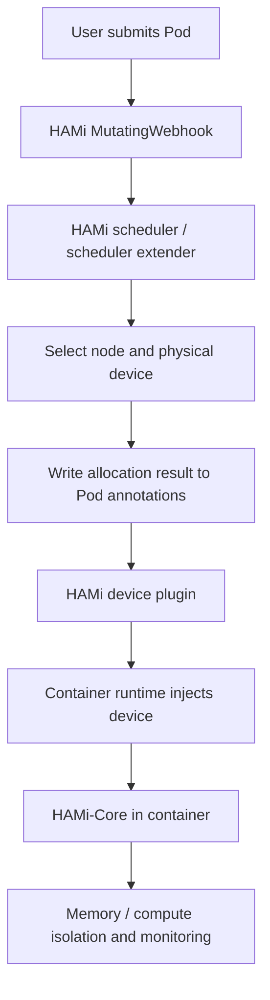

# HAMi 做了什么

HAMi 是 **Heterogeneous AI Computing Virtualization Middleware** 的缩写，项目名官方写作 `HAMi`。它的前身是 `k8s-vGPU-scheduler`，现在是 CNCF Sandbox 项目，目标是在 Kubernetes 上提供异构 AI 加速卡的共享、隔离和调度能力。

项目地址：

- GitHub 组织：[https://github.com/Project-HAMi](https://github.com/Project-HAMi)
- 核心仓库：[https://github.com/Project-HAMi/HAMi](https://github.com/Project-HAMi/HAMi)
- 官方文档：[https://project-hami.io/zh/docs](https://project-hami.io/zh/docs)

如果用一句话概括：

> HAMi 把 Kubernetes 原本“按整卡分配 GPU”的模型，扩展成“按显存、算力、卡型、UUID、拓扑和调度策略分配异构设备”的模型。

它解决的不是“怎么安装 NVIDIA 驱动”这种底层问题，而是 GPU / NPU / MLU / DCU 等设备已经接入 Kubernetes 之后，如何让多个 AI workload 更高效、更可控地使用这些昂贵设备。

## 为什么需要 HAMi

Kubernetes 原生使用 GPU 的典型方式是 Device Plugin：

```yaml
resources:
  limits:
    nvidia.com/gpu: 1
```

这个模型足够简单，但它有一个明显问题：`nvidia.com/gpu: 1` 表示申请一整张 GPU。

在 AI 推理、Notebook、开发调试、小模型训练等场景里，一个 Pod 可能只使用 20% 到 40% 的 GPU 算力，显存也只占一小部分。如果仍然按整卡分配，就会出现：

- GPU 显存剩很多，但 Kubernetes 认为整卡已经被占用。
- 多个小推理服务无法共享一张卡。
- 团队之间抢 GPU，资源利用率低。
- 单靠 Node label 很难表达卡型、UUID、NUMA、NVLink、显存余量等设备信息。
- NVIDIA、华为 Ascend、寒武纪、海光 DCU、沐曦、摩尔线程等设备的资源模型不统一。

HAMi 做的事情，就是在 Kubernetes 现有扩展机制上补齐这层能力。

## HAMi 的核心能力

### 1. 设备共享

HAMi 允许多个 Pod 共享同一张物理 GPU 或其他异构设备。用户不再只能申请整卡，而是可以申请部分显存和部分算力。

以 NVIDIA GPU 为例：

```yaml
apiVersion: v1
kind: Pod
metadata:
  name: hami-gpu-demo
spec:
  containers:
  - name: app
    image: nvidia/cuda:12.4.1-base-ubuntu22.04
    command: ["sleep", "3600"]
    resources:
      limits:
        nvidia.com/gpu: 1
        nvidia.com/gpumem: 3000
        nvidia.com/gpucores: 50
```

含义：

- `nvidia.com/gpu: 1`：申请 1 个 GPU 设备实例。
- `nvidia.com/gpumem: 3000`：每个 GPU 实例分配约 3000 MiB 显存。
- `nvidia.com/gpucores: 50`：分配约 50% 的 GPU 计算核心时间片。

也可以按百分比分配显存：

```yaml
resources:
  limits:
    nvidia.com/gpu: 1
    nvidia.com/gpumem-percentage: 50
```

注意：`nvidia.com/gpumem` 和 `nvidia.com/gpumem-percentage` 不能同时使用。

### 2. 资源隔离

共享 GPU 只有调度是不够的，还要在容器运行时限制它实际能用多少资源。

HAMi 对 NVIDIA 的典型做法是通过 `HAMi-Core` 在容器内拦截 CUDA API，从软件层限制容器可见和可用的 GPU 显存、计算核心。这样一个 Pod 申请 3GiB 显存，就只能看到或使用对应范围内的显存；超出配额时会在容器内表现为 OOM，而不是把整张卡拖垮。

这和 NVIDIA Time-Slicing 不一样：

- Time-Slicing 主要解决多个 Pod 同时使用同一张 GPU。
- HAMi 进一步提供显存和算力的配额语义。
- MIG 是硬件级隔离，但只适用于支持 MIG 的数据中心卡，例如 A100 / H100；HAMi 的软件虚拟化能覆盖更多卡型，但隔离强度取决于具体后端和驱动能力。

### 3. 设备感知调度

Kubernetes 默认 scheduler 只看到 Node 上的扩展资源数量，例如 `nvidia.com/gpu: 10`。它不知道每张物理卡的 UUID、型号、显存、NUMA 节点、健康状态，也不知道某张卡已经被分走多少显存。

HAMi 用自己的 scheduler extender 维护这些信息，并参与调度决策。

调度维度主要包括：

- 节点维度：选哪个 GPU 节点。
- 设备维度：选节点上的哪张卡。
- 资源维度：检查显存、算力、设备数量是否满足。
- 策略维度：使用 `binpack` 还是 `spread`。
- 拓扑维度：在支持场景下考虑 GPU 拓扑，例如 NVLink / NUMA 亲和性。

例如可以通过 annotation 指定调度策略：

```yaml
metadata:
  annotations:
    hami.io/node-scheduler-policy: "spread"
    hami.io/gpu-scheduler-policy: "binpack"
```

策略含义：

- `node binpack`：尽量把任务集中到已经使用的节点，提高整体资源压缩率。
- `node spread`：尽量分散到不同节点，减少节点级争抢。
- `gpu binpack`：尽量把多个小任务放到同一张卡上，释放完整空卡给大任务。
- `gpu spread`：尽量分散到不同卡上，减少单卡竞争。

### 4. 指定卡型或指定设备

在混部 GPU 集群里，用户常常希望“这个任务只跑 A100/V100”或者“避开某类消费级 GPU”。HAMi 支持通过 annotation 指定或排除卡型。

指定卡型：

```yaml
metadata:
  annotations:
    nvidia.com/use-gputype: "A100,V100"
```

排除卡型：

```yaml
metadata:
  annotations:
    nvidia.com/nouse-gputype: "1080,2080"
```

也可以指定某个具体 GPU UUID：

```yaml
metadata:
  annotations:
    nvidia.com/use-gpuuuid: "GPU-123456"
```

这类能力本质上是在 Kubernetes 原生整卡调度能力之上，补了一层设备级选择逻辑。

### 5. 异构设备统一管理

HAMi 不只面向 NVIDIA GPU。官方文档列出的设备后端包括：

- NVIDIA GPU
- Huawei Ascend NPU
- Cambricon MLU
- Hygon DCU
- Iluvatar GPU
- Moore Threads GPU
- MetaX GPU
- Enflame GCU
- AWS Neuron
- Vastai / Vaststream 等更多后端

不同厂商的资源名、隔离粒度、多卡能力并不完全一致。HAMi 的价值在于把这些设备纳入同一套 Kubernetes 调度和资源分配流程中。平台层可以用统一的调度器、监控、WebUI 和 Helm 配置去管理异构加速卡。

## HAMi 的架构

HAMi 不是单一组件，它由几个部分协作完成 GPU 虚拟化。



### MutatingWebhook

MutatingWebhook 是入口。它检查新提交的 Pod 是否申请了 HAMi 管理的资源。如果这个 Pod 只使用 CPU、Memory 或 HAMi 设备资源，Webhook 会把 Pod 的 `schedulerName` 改成 HAMi scheduler 使用的调度器名称。

这样用户仍然写普通 Pod YAML，不需要直接调用 HAMi API。

### HAMi scheduler

HAMi scheduler 负责真正的节点和设备选择。

它会读取节点上的设备信息、已经分配的资源、Pod 的资源请求和 annotation，然后做 Filter / Score / Bind：

- Filter：过滤掉显存、算力、卡型、UUID 不满足要求的节点和设备。
- Score：根据 binpack / spread / topology-aware 等策略打分。
- Bind：选定节点和具体设备，把分配结果写回 Pod annotation。

HAMi 之所以需要自己的 scheduler 逻辑，是因为标准 Device Plugin 只能把设备数量暴露给 kubelet / scheduler，无法把每张卡的显存余量、UUID、拓扑等信息作为标准调度输入。

### Device Plugin

HAMi device plugin 仍然走 Kubernetes Device Plugin 机制，把设备资源注册给 kubelet。它的职责包括：

- 发现节点上的真实设备。
- 将物理设备扩展成可调度的逻辑资源。
- 将设备信息写入 Node annotation，供 scheduler 使用。
- 在 kubelet 调用 `Allocate` 时，根据 Pod annotation 中的分配结果把具体设备映射进容器。

例如一张物理 GPU 可以被配置成多个逻辑 vGPU slot。kubelet 看到的是扩展后的资源数量，而 HAMi scheduler 额外维护“这些 slot 背后是哪张物理卡、还剩多少显存、还剩多少算力”。

### HAMi-Core

HAMi-Core 是容器内资源控制层。

它负责在容器内监控和限制 GPU 资源使用。对 NVIDIA 场景，HAMi-Core 会通过 CUDA API 拦截实现显存和算力限制。`nvidia.com/gpucores` 的算力限制本质上是时间片控制，所以用 `nvidia-smi` 看 GPU 利用率时可能会有波动。

这也是 HAMi 和单纯 scheduler extender 的关键区别：它不只负责“把 Pod 调度到哪张卡”，还负责“Pod 启动之后不能越界使用 GPU 资源”。

## 一个完整的调度流程

以一个申请 1 个 GPU、3GiB 显存、50% 算力的 Pod 为例：

```yaml
apiVersion: v1
kind: Pod
metadata:
  name: hami-demo
  annotations:
    nvidia.com/use-gputype: "A100,V100"
    hami.io/gpu-scheduler-policy: "binpack"
spec:
  containers:
  - name: app
    image: nvidia/cuda:12.4.1-base-ubuntu22.04
    command: ["sleep", "3600"]
    resources:
      limits:
        nvidia.com/gpu: 1
        nvidia.com/gpumem: 3000
        nvidia.com/gpucores: 50
```

流程如下：

1. 用户提交 Pod。
2. HAMi MutatingWebhook 识别到 Pod 申请了 HAMi 设备资源。
3. Pod 被交给 HAMi scheduler。
4. scheduler 读取各 GPU 节点 annotation 中的设备信息。
5. scheduler 过滤出卡型包含 A100 或 V100、且剩余显存和算力足够的设备。
6. scheduler 根据 `gpu binpack` 策略选择最合适的一张物理卡。
7. scheduler 把分配结果写入 Pod annotation，例如设备 UUID、显存、算力等。
8. kubelet 创建容器时调用 HAMi device plugin。
9. device plugin 根据 annotation 把指定设备注入容器。
10. HAMi-Core 在容器内限制 GPU 显存和计算资源。

## 安装方式

HAMi 推荐通过 Helm 安装。

```bash
helm repo add hami-charts https://project-hami.github.io/HAMi/
helm repo update
```

安装时要让 HAMi 内置 kube-scheduler 镜像版本与集群版本匹配。例如集群是 `v1.29.0`：

```bash
helm install hami hami-charts/hami \
  --set scheduler.kubeScheduler.imageTag=v1.29.0 \
  -n kube-system
```

按默认配置，通常还需要给希望由 HAMi 管理的 GPU 节点打标签，具体以当前 Helm values 为准：

```bash
kubectl label node <node-name> gpu=on
```

验证：

```bash
kubectl get pods -n kube-system | grep hami
```

一般会看到 `hami-device-plugin` 和 `hami-scheduler` 相关 Pod 处于 Running。

NVIDIA 路径常见前置条件包括：

- 节点已经安装 NVIDIA driver。
- 容器运行时已经配置 NVIDIA runtime / toolkit。
- Kubernetes 版本满足 HAMi 当前版本要求。
- Helm 版本大于 3。

## 观测和排障

HAMi 提供 metrics、Grafana dashboard 示例和 HAMi WebUI。

常见排查入口：

```bash
# 查看 HAMi 组件
kubectl get pods -n kube-system | grep hami

# 查看节点上 HAMi 写入的设备信息
kubectl get node <node-name> -o yaml | grep -A 5 'hami.io/node'

# 查看 Pod 分配到的设备
kubectl get pod <pod-name> -o yaml | grep -A 10 'hami.io'

# 查看调度失败原因
kubectl describe pod <pod-name>
kubectl get events --sort-by=.lastTimestamp
```

对 NVIDIA 场景，重点看这些信息：

- 节点是否有 `nvidia.com/gpu`、`nvidia.com/gpumem`、`nvidia.com/gpucores` 等资源。
- 节点 annotation 是否包含 HAMi 设备注册信息。
- Pod annotation 是否写入了设备分配结果。
- container 内 `nvidia-smi` 看到的显存是否符合预期。
- HAMi scheduler / device plugin 日志是否有资源不足、卡型不匹配、UUID 不存在等错误。

## HAMi 和 Device Plugin 的关系

HAMi 当前传统模式仍然基于 Kubernetes Device Plugin。

区别在于：

- 普通 Device Plugin 主要告诉 kubelet“这个节点有几张 GPU”。
- HAMi device plugin 会把一张物理 GPU 扩展成多个可分配逻辑资源。
- HAMi scheduler 额外维护设备显存、算力、卡型、UUID 和分配状态。
- HAMi-Core 在容器内做显存和算力隔离。

所以 HAMi 不是简单替代 Device Plugin，而是在 Device Plugin 之上叠加了调度和隔离能力。

## HAMi 和 MIG 的关系

MIG 是 NVIDIA 在部分数据中心 GPU 上提供的硬件切分能力，隔离强度高，但有几个限制：

- 只支持特定 GPU，例如 A100、H100 等。
- 切分 profile 相对固定。
- 动态调整通常涉及节点级操作和已有 workload 影响。

HAMi 的软件虚拟化路径更灵活：

- 可以覆盖更多 NVIDIA GPU 型号。
- 可以按 MiB / 百分比申请显存。
- 可以按百分比申请算力。
- 可以和 dynamic MIG 结合，在支持的环境里动态调整 MIG 实例。

工程上可以这样理解：

- 对强隔离、固定规格、核心生产推理池，优先评估 MIG。
- 对卡型复杂、任务粒度小、共享诉求强、需要快速提高利用率的集群，HAMi 更灵活。
- 二者不是互斥关系，HAMi 可以作为统一调度层，把 MIG、软件切分和异构设备管理纳入同一套流程。

## HAMi 和 DRA 的关系

DRA 是 Kubernetes 原生的下一代设备资源分配 API。它通过 `DeviceClass`、`ResourceSlice`、`ResourceClaim` 等对象，让 scheduler 原生理解设备属性和分配状态。

HAMi 的传统模式基于 Device Plugin、Webhook、scheduler extender 和 annotation 协议。这个模式成熟、可用，但设备信息不是 Kubernetes 标准 API 对象。

HAMi 官方已经提供 DRA 模式：

- 要求 Kubernetes 1.34+。
- 需要启用 DRA Consumable Capacity 等相关 feature gate。
- 通过 HAMi DRA webhook 保持与传统资源写法相近的用户体验。
- 当前官方文档列出的 DRA 支持设备主要是 NVIDIA GPU。
- DRA 模式和传统模式不兼容，不能同时启用。

安装 DRA 模式示例：

```bash
helm install hami hami-charts/hami \
  --set dra.enable=true \
  -n hami-system
```

从长期看，DRA 更接近 Kubernetes 原生方向；从生产可用性看，HAMi 传统模式仍然是当前更常见的落地路径。平台侧可以先用 HAMi 传统模式解决利用率问题，同时关注 HAMi-DRA 的成熟度。

## 适合使用 HAMi 的场景

HAMi 适合这些场景：

- 多租户 AI 平台，希望多个团队共享 GPU 池。
- 推理服务很多，但单个服务不需要独占整卡。
- Notebook / 开发调试任务多，整卡分配浪费严重。
- GPU 型号复杂，需要按卡型、UUID、拓扑做调度。
- 希望统一管理 NVIDIA、Ascend、Cambricon、Hygon、Iluvatar、MetaX 等异构设备。
- 希望通过 binpack / spread 策略平衡资源利用率和性能隔离。
- 希望在 Kubernetes 上快速引入 vGPU 语义，但暂时不想等待完整 DRA 生态成熟。

不太适合的场景：

- 每个任务都稳定吃满整卡，整卡调度已经足够。
- 对硬隔离要求极高，必须依赖 MIG 或厂商硬件虚拟化。
- workload 对 CUDA API 拦截、时间片调度或容器内 preload 非常敏感。
- GPU 通信性能要求极高，例如大规模多机多卡训练，且需要严格控制拓扑和带宽。
- 平台无法接受 scheduler、webhook、device plugin、容器内 runtime hook 带来的额外复杂度。

## 使用时的关键风险

### 资源隔离不是性能保证

HAMi 可以限制显存和算力配额，但共享同一物理卡的 Pod 仍然会竞争：

- HBM 带宽
- L2 cache
- PCIe / NVLink
- kernel launch 开销
- 上下文切换
- GPU runtime 内部锁

所以 HAMi 更适合提高平均利用率，不应该被理解成“多个租户共享后性能完全互不影响”。

### 显存隔离依赖后端实现

不同设备厂商、不同驱动版本、不同隔离模式的效果不一样。NVIDIA 的 HAMi-Core、Ascend 的 vNPU / hami-vnpu-core、Cambricon / Hygon / Iluvatar 等后端都有自己的限制和前置条件。上线前必须对目标卡型做压测和越界测试。

### 调度状态依赖 annotation 协议

传统 HAMi 模式会把设备信息和分配结果写入 Node / Pod annotation。这让它能绕过 Device Plugin 的整数资源限制，但也意味着平台排障时要同时看：

- Kubernetes Pod 状态
- HAMi scheduler cache
- Node annotation
- Pod annotation
- device plugin 日志
- 容器内 HAMi-Core 行为

复杂度比普通 GPU Operator + Device Plugin 更高。

### 与现有 GPU 插件不要冲突

如果集群已经安装 NVIDIA GPU Operator 或 NVIDIA device plugin，需要确认资源名、device plugin、runtime 配置、scheduler 配置之间不会冲突。不要让两个插件在同一节点上以同一个资源名重复注册或重复管理同一批设备。

## 总结

HAMi 做了四件核心事情：

1. **共享**：把整卡 GPU / NPU / MLU / DCU 等设备拆成更细粒度的可申请资源。
2. **隔离**：通过 HAMi-Core 或各厂商后端限制容器内显存和算力使用。
3. **调度**：用 scheduler extender 理解卡型、UUID、显存、算力、拓扑和 binpack / spread 策略。
4. **统一管理**：把多厂商异构加速卡纳入一套 Kubernetes 资源使用方式。

它的本质不是一个简单的 GPU device plugin，而是一套围绕 Kubernetes 的异构算力虚拟化中间件。对于 AI Infra 平台，HAMi 的价值在于把“昂贵 GPU 只能整卡独占”的资源模型，变成“可以按配额共享、按策略调度、按后端能力隔离”的资源池模型。

## 参考资料

- [Project-HAMi GitHub](https://github.com/Project-HAMi/HAMi)
- [HAMi 官网](https://project-hami.io/)
- [HAMi: GPU Virtualization Principles](https://project-hami.io/docs/core-concepts/gpu-virtualization)
- [HAMi: Architecture](https://project-hami.io/docs/core-concepts/architecture)
- [HAMi: Device sharing](https://project-hami.io/docs/key-features/device-sharing)
- [HAMi: Device resource isolation](https://project-hami.io/docs/key-features/device-resource-isolation/)
- [HAMi: Online Installation from Helm](https://project-hami.io/docs/installation/online-installation)
- [HAMi: Allocate NVIDIA device memory](https://project-hami.io/docs/userguide/nvidia-device/specify-device-memory-usage/)
- [HAMi: Allocate NVIDIA device core usage](https://project-hami.io/docs/userguide/nvidia-device/specify-device-core-usage/)
- [HAMi: HAMi DRA for Kubernetes](https://project-hami.io/docs/installation/how-to-use-hami-dra/)
