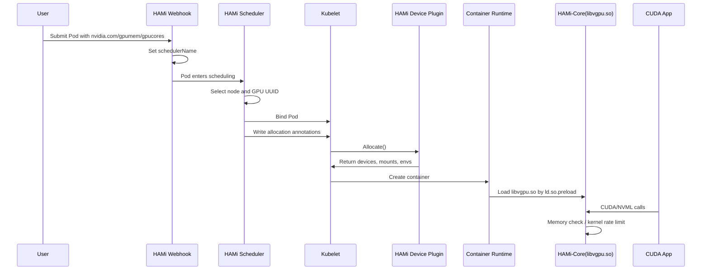

# HAMi 设备注入与库劫持

HAMi 的 GPU 共享能力可以分成两层：

- Kubernetes 层：让 Pod 能够按 `nvidia.com/gpumem`、`nvidia.com/gpucores` 这类细粒度资源声明需求，并调度到合适的节点和物理 GPU。
- 容器运行时层：让 Pod 进入容器以后，真的只能看到和使用被分配的显存、算力。

前一层主要由 `hami-scheduler` 完成，后一层主要由 `hami-device-plugin` 和 `HAMi-Core` 完成。

本文重点讲后一层：**设备注入** 和 **库劫持**。

如果对 `LD_PRELOAD`、`/etc/ld.so.preload`、`dlsym(RTLD_NEXT)` 这类机制不熟，可以先看：[动态链接器解析与劫持](/program-language/r79yeegl/)。

一句话总结：

> HAMi 的调度器决定“这个 Pod 应该使用哪张 GPU、多少显存、多少算力”；Device Plugin 把设备、环境变量和 `libvgpu.so` 注入容器；`libvgpu.so` 再通过劫持 CUDA / NVML API 在容器内执行资源限制。

## 整体链路

先看一个完整流程：



这个链路里有两个关键边界：

- Scheduler 只做资源计算和选卡，不直接修改容器。
- Device Plugin 只负责把“限制所需的材料”放进容器，真正的显存和算力限制发生在容器进程调用 CUDA / NVML API 时。

## 调度结果如何传给 Device Plugin

Kubernetes 标准 Device Plugin 的模型比较简单：scheduler 只知道节点上有多少个扩展资源，例如 `nvidia.com/gpu: 10`。它不会把“这个 Pod 申请了 3000 MiB 显存、30% 算力、绑定到 GPU-xxx”这种结构化信息传给 kubelet。

HAMi 的做法是用 Pod annotation 在 scheduler 和 device plugin 之间传递调度结果。

典型 Pod 资源申请：

```yaml
resources:
  limits:
    nvidia.com/gpu: 1
    nvidia.com/gpumem: 3000
    nvidia.com/gpucores: 30
```

Scheduler 完成 Filter / Bind 后，会把结果写入 Pod annotation，核心信息包括：

```yaml
metadata:
  annotations:
    hami.io/bind-time: "1716199325"
    hami.io/vgpu-devices-allocated: "GPU-0fc3eda5-e98b-a25b-5b0d-cf5c855d1448,NVIDIA,3000,30:;"
    hami.io/vgpu-devices-to-allocate: "GPU-0fc3eda5-e98b-a25b-5b0d-cf5c855d1448,NVIDIA,3000,30:;"
```

含义大致是：

- `hami.io/bind-time`：调度绑定时间，Device Plugin 可以用它判断分配是否超时。
- `hami.io/vgpu-devices-allocated`：最终分配记录，包含 GPU UUID、设备类型、显存配额、算力配额。
- `hami.io/vgpu-devices-to-allocate`：待 Device Plugin 处理的设备列表。Device Plugin 成功处理后会更新或清空它。

这样，Device Plugin 在 `Allocate()` 时就不只是拿到一个抽象的 device ID，而是能知道要给当前容器注入哪张物理卡，以及对应的显存、算力限制。

## Device Plugin 注入了什么

Pod 被调度到目标节点后，kubelet 会调用节点上 HAMi Device Plugin 的 `Allocate()`。这是设备注入发生的地方。

从容器视角看，Device Plugin 主要注入四类东西。

### 1. 设备可见性

Device Plugin 会让容器只能访问被分配的 GPU。对 NVIDIA 场景来说，这通常涉及：

- 设备文件，例如 `/dev/nvidia0`、`/dev/nvidiactl`、`/dev/nvidia-uvm`。
- `NVIDIA_VISIBLE_DEVICES`，把容器可见设备限制为调度器选中的 GPU UUID。
- 在支持 CDI 的运行时里，也可能通过 CDI 设备描述完成注入。

这里的目标是“选卡生效”：Pod 不能随便看到节点上的所有 GPU，而是只看到 HAMi 调度给它的那张或那几张卡。

### 2. `libvgpu.so`

HAMi-Core 的核心产物是 `libvgpu.so`。Device Plugin 会把宿主机上的这个动态库挂载进容器，常见路径是：

```text
/usr/local/vgpu/libvgpu.so
```

这一步只是把库文件放进容器，还没有真正开始限制资源。限制生效依赖下一步：让动态链接器优先加载这个库。

### 3. `/etc/ld.so.preload`

Linux glibc [动态链接器](/program-language/r79yeegl/) 会读取 `/etc/ld.so.preload`。文件里列出的动态库，会在普通动态链接程序启动时被优先加载。

HAMi 会把宿主机上的 preload 文件挂载到容器内：

```text
/etc/ld.so.preload
```

文件内容通常只有一行：

```text
/usr/local/vgpu/libvgpu.so
```

它的效果类似设置：

```bash
LD_PRELOAD=/usr/local/vgpu/libvgpu.so
```

但它不要求用户修改镜像入口、启动命令或环境变量。只要容器里的 CUDA 程序是通过 glibc 动态链接启动，`libvgpu.so` 就会被提前加载。

如果容器显式设置：

```bash
CUDA_DISABLE_CONTROL=true
```

HAMi 可以跳过这类控制注入，相当于禁用容器内的资源限制逻辑。这个选项通常只应该用于调试或明确不需要 HAMi 控制的场景。

### 4. 配额环境变量

Device Plugin 还会把调度结果转成环境变量，供 `libvgpu.so` 读取。

典型变量包括：

```bash
CUDA_DEVICE_MEMORY_LIMIT_0=3000m
CUDA_DEVICE_SM_LIMIT=30
LIBCUDA_LOG_LEVEL=1
```

含义：

- `CUDA_DEVICE_MEMORY_LIMIT_0=3000m`：容器内第 0 张可见 GPU 的显存上限是 3000 MiB。
- `CUDA_DEVICE_SM_LIMIT=30`：算力目标上限是 30%。
- `LIBCUDA_LOG_LEVEL`：控制 HAMi-Core 日志级别。

多 GPU 容器里会出现多个按容器内设备索引编号的显存限制，例如：

```bash
CUDA_DEVICE_MEMORY_LIMIT_0=3000m
CUDA_DEVICE_MEMORY_LIMIT_1=6000m
```

注意这里的索引是容器内可见设备索引，不一定等于宿主机上的 GPU 序号。

## 为什么要做库劫持

只把 `/dev/nvidia*` 挂进容器并不能限制显存。GPU 显存分配发生在 NVIDIA driver / CUDA API 调用里，Kubernetes 的 cgroup 不能像限制 CPU、Memory 一样直接限制 GPU 显存。

所以 HAMi-Core 选择在 CUDA API 层做拦截。

应用调用链大致是：

```text
PyTorch / TensorFlow / vLLM / llama.cpp
        |
        v
CUDA Runtime: libcudart.so
        |
        v
CUDA Driver API: libcuda.so
        |
        v
NVIDIA kernel driver
```

HAMi-Core 插在 CUDA Runtime 和 CUDA Driver API 之间：

```text
Application
    |
    v
libcudart.so
    |
    v
libvgpu.so  <-- hook layer
    |
    v
libcuda.so / libnvidia-ml.so
    |
    v
NVIDIA driver
```

它不是改应用代码，也不是改 NVIDIA driver，而是让进程在解析 CUDA / NVML 符号时，优先拿到 HAMi-Core 提供的 wrapper 函数。

## dlsym 劫持的核心思路

很多 CUDA Runtime 或框架会通过动态链接或 [`dlsym()`](/program-language/r79yeegl/) 找到 CUDA Driver API 函数地址，例如：

```c
cuMemAlloc_v2
cuMemAllocManaged
cuLaunchKernel
nvmlDeviceGetMemoryInfo
```

`libvgpu.so` 被提前加载后，会重写 `dlsym`。当进程查找函数符号时，HAMi-Core 可以判断这个符号是不是它关心的 CUDA / NVML 函数：

```text
if symbol starts with "cu" or "nvml":
    return HAMi wrapper function
else:
    return real dlsym result
```

实际实现会处理更多细节，例如版本后缀、真实函数地址缓存、递归调用保护等。概念上可以理解成：

```c
void *dlsym(void *handle, const char *symbol) {
    if (is_cuda_or_nvml_symbol(symbol)) {
        if (has_hami_wrapper(symbol)) {
            return hami_wrapper(symbol);
        }
    }
    return real_dlsym(handle, symbol);
}
```

这样应用以为自己调用的是原生 CUDA / NVML 函数，实际先进入 HAMi-Core 的 wrapper。wrapper 完成检查、统计或限速后，再决定是否调用真实函数。

## 显存限制如何生效

显存限制主要靠两类 hook。

### 1. 虚拟化查询结果

很多程序启动时会查询 GPU 总显存和剩余显存，用来决定 batch size、KV cache 大小、模型加载策略等。

HAMi-Core 会拦截这类查询，例如：

```text
nvmlDeviceGetMemoryInfo
nvmlDeviceGetMemoryInfo_v2
cuDeviceTotalMem_v2
```

如果 Pod 被分配了 3000 MiB 显存，那么容器内程序看到的“总显存”就应该接近 3000 MiB，而不是物理卡的 24 GiB、40 GiB 或 80 GiB。

这一步解决的是“感知问题”：让应用按虚拟配额做自适应，而不是误以为自己拥有整张卡。

### 2. 拦截分配请求

真正的硬限制发生在显存分配函数上，例如：

```text
cuMemAlloc_v2
cuMemAllocManaged
cuMemAllocAsync
```

HAMi-Core 在调用真实分配函数之前，会先计算：

```text
当前已用显存 + 本次申请显存 <= CUDA_DEVICE_MEMORY_LIMIT_<index>
```

如果没有超过配额，就调用真实 CUDA 函数完成分配，并记录这次分配。

如果超过配额，wrapper 不再向下调用真实分配函数，而是直接返回类似：

```text
CUDA_ERROR_OUT_OF_MEMORY
```

应用侧看到的就是正常 CUDA OOM。这样 Pod 超过自己的 HAMi 配额时，失败会发生在容器内，而不是把整张物理卡的显存耗尽。

## 多进程显存统计

显存限制不能只看单进程。一个容器里可能有：

- 主进程和 worker 进程。
- Python multiprocessing。
- vLLM / Ray / TorchRun 这类多进程模型服务或训练任务。

如果每个进程都只维护自己的本地计数，就会出现每个进程都认为自己还有 3000 MiB，最后总量远超配额。

因此 HAMi-Core 需要跨进程协调显存统计。官方 README 中提到本地缓存文件和 `/tmp/vgpulock/`，实际就是为了让多个进程之间共享或保护计数状态。

在 Kubernetes 注入场景里，Device Plugin 也会给容器挂载 HAMi 需要的工作目录和 lock 目录，使同一个容器内的多个进程能围绕同一份配额做协作。

## 算力限制如何生效

显存可以在分配时做 hard check，但 GPU 算力不是一个可以直接扣减的静态资源。HAMi 对 `nvidia.com/gpucores` 的限制，本质是基于 CUDA kernel launch 的软件限速。

HAMi-Core 会拦截 kernel 提交相关函数，例如：

```text
cuLaunchKernel
cuLaunchKernelEx
```

每次应用提交 kernel 前，HAMi-Core 进入 `rate_limiter` 逻辑：

1. 根据本次 kernel 的 grid 信息估算本次提交消耗。
2. 从全局 token / counter 中扣减。
3. 如果 counter 仍然足够，就继续调用真实 `cuLaunchKernel`。
4. 如果 counter 不足，就让当前调用短暂等待，例如 `nanosleep`，直到后台 watcher 补充额度。

后台 watcher 会周期性采样 GPU 利用率，并根据 `CUDA_DEVICE_SM_LIMIT` 调整补充速度。利用率低于目标时补得快一些，利用率高于目标时补得慢一些，最终让容器整体使用率向目标比例收敛。

所以 `gpucores` 要理解成 **软件时间片限速**，不是硬件级 SM 分区。它能降低长期平均占用，但不等价于 MIG 那样的硬件隔离。

## 为什么 nvidia-smi 看到的也会变化

`nvidia-smi` 主要通过 NVML 查询 GPU 信息。HAMi-Core 拦截 NVML 函数后，容器内运行的 `nvidia-smi` 看到的是被虚拟化后的结果。

例如物理卡是 24 GiB，Pod 只申请 3000 MiB，那么容器内可能看到类似：

```text
Memory-Usage: 0MiB / 3000MiB
```

这不表示物理 GPU 真的被切成了一个 3000 MiB 的硬件分区，而是 NVML 查询结果被 HAMi-Core 改写了。

从宿主机或没有被 HAMi-Core 注入的进程里看，仍然能看到物理 GPU 的完整信息和所有进程占用。

## 和 NVIDIA MIG 的区别

HAMi 的库劫持方案和 MIG 很容易混淆，但两者隔离层次不同。

| 维度 | HAMi-Core 库劫持 | NVIDIA MIG |
| --- | --- | --- |
| 隔离位置 | CUDA / NVML API 层 | GPU 硬件分区 |
| 适用范围 | 不依赖 MIG，覆盖更多 NVIDIA GPU | 只支持特定数据中心 GPU |
| 显存限制 | 拦截分配函数并返回 OOM | 硬件实例有独立显存 |
| 算力限制 | kernel launch 前限速，长期收敛 | 硬件切分 SM / cache 等资源 |
| 安全边界 | 软件隔离，依赖 hook 覆盖面 | 硬件隔离更强 |
| 灵活性 | 配额粒度灵活 | 受 MIG profile 限制 |

所以 HAMi 更像是“在 Kubernetes 上用软件方式做 GPU 分时和显存配额”，适合提升利用率；MIG 更像“把一张卡切成多个硬件实例”，适合对隔离强度要求更高的场景。

## 这种机制的边界

HAMi-Core 的优点是通用、灵活，不需要应用改代码。但它也有明确边界。

### 1. 它依赖动态链接和 hook 覆盖

`/etc/ld.so.preload` 主要影响 glibc 动态链接程序。如果应用静态链接、绕过常规 CUDA Driver API、直接使用某些未被覆盖的新 API，就可能绕过或削弱限制。

HAMi-Core 需要持续跟进 CUDA / NVML API 变化。CUDA 新版本出现新函数或新后缀时，如果 hook 没覆盖到，可能出现统计不准或限制不完整。

### 2. 它不是安全沙箱

HAMi 的目标是资源复用和配额控制，不应该被理解成强安全隔离。容器内如果有足够权限修改 `/etc/ld.so.preload`、替换动态库、关闭控制变量，就可能破坏限制。

生产环境里仍然需要配合：

- 非特权容器。
- 只读 root filesystem 或限制关键路径写入。
- 合理的 PodSecurity / admission 策略。
- 避免给普通 workload 过高 Linux capabilities。

### 3. 算力限制不是精确实时 SLA

`gpucores` 是基于 kernel launch 的软件节流。它适合控制长期平均使用率，但不能保证每个瞬间都严格等于 30% 或 50%。

如果 workload 的 kernel 特别短、特别碎，或者不同 Pod 的 kernel 行为差异很大，限速效果会有波动。官方文档也提醒过，使用 `nvidia-smi` 看 core utilization 时会有波动。

### 4. 框架缓存分配器会影响观感

PyTorch、TensorFlow、vLLM 等框架通常有自己的显存缓存机制。应用可能一次性向 CUDA 申请较大内存池，然后在框架内部复用。

在 HAMi 里，这种申请仍然会被计入配额。用户看到的现象可能是：

- 应用刚启动就占用接近配额。
- batch size 稍大就触发 OOM。
- 框架显示的 reserved / allocated 和 NVML 看到的数值不完全一致。

这不是 HAMi 独有问题，而是 GPU 框架内存池和底层显存统计口径不同导致的常见现象。

## 排查时看什么

如果一个 Pod 使用 HAMi 后没有按预期限制显存或算力，可以按这条链路排查。

### 1. 看 Pod 资源声明

```bash
kubectl get pod <pod> -o yaml | yq '.spec.containers[].resources'
```

确认是否申请了：

```yaml
nvidia.com/gpu: 1
nvidia.com/gpumem: 3000
nvidia.com/gpucores: 30
```

### 2. 看调度 annotation

```bash
kubectl get pod <pod> -o yaml | yq '.metadata.annotations'
```

重点看：

```text
hami.io/vgpu-devices-allocated
hami.io/vgpu-devices-to-allocate
hami.io/bind-time
```

如果没有这些 annotation，说明可能没有经过 HAMi scheduler，或者资源名、schedulerName、Webhook 配置有问题。

### 3. 看容器内 preload 是否存在

进入容器：

```bash
kubectl exec -it <pod> -- sh
```

检查：

```bash
cat /etc/ld.so.preload
ls -l /usr/local/vgpu/libvgpu.so
env | grep -E 'CUDA_DEVICE_MEMORY_LIMIT|CUDA_DEVICE_SM_LIMIT|NVIDIA_VISIBLE_DEVICES|LIBCUDA'
```

期望看到：

```text
/usr/local/vgpu/libvgpu.so
CUDA_DEVICE_MEMORY_LIMIT_0=3000m
CUDA_DEVICE_SM_LIMIT=30
```

如果 `/etc/ld.so.preload` 不存在，或者 `libvgpu.so` 没挂进去，说明 Device Plugin 注入阶段没有成功。

### 4. 看容器内 nvidia-smi

```bash
nvidia-smi
```

如果 HAMi-Core 正常拦截 NVML，容器内看到的显存总量应该接近申请的 `nvidia.com/gpumem`，而不是物理卡总显存。

### 5. 看 HAMi-Core 日志

可以调高日志级别：

```yaml
env:
- name: LIBCUDA_LOG_LEVEL
  value: "3"
```

然后观察容器日志里是否有 HAMi-Core 初始化、显存分配、OOM 或限速相关输出。

## 小结

HAMi 设备注入与库劫持的核心不是“把 GPU 真的切开”，而是通过 Kubernetes 调度协议和容器内 API hook 组合出一个可用的虚拟 GPU 语义。

完整链路可以概括为：

1. 用户用 `nvidia.com/gpumem` / `nvidia.com/gpucores` 声明显存和算力。
2. HAMi Scheduler 选择节点和 GPU UUID，把结果写入 Pod annotation。
3. Kubelet 调用 HAMi Device Plugin 的 `Allocate()`。
4. Device Plugin 注入 GPU 可见性、`libvgpu.so`、`/etc/ld.so.preload` 和配额环境变量。
5. 容器启动后，`libvgpu.so` 被动态链接器提前加载。
6. HAMi-Core 劫持 CUDA / NVML API，实现显存查询虚拟化、分配前 OOM 检查和 kernel launch 限速。

理解这条链路后，很多问题就容易定位：

- 调度失败，看 scheduler 和 Pod annotation。
- 容器没有限制，看 Device Plugin 的 `Allocate()` 注入结果。
- `nvidia-smi` 不对，看 NVML hook 和 preload。
- 超额没有 OOM，看 CUDA 分配函数是否被 hook。
- 算力波动，看 kernel launch 限速机制和 workload 特征。

参考资料：

- [HAMi：GPU 虚拟化原理](https://project-hami.io/zh/docs/core-concepts/gpu-virtualization)
- [HAMi-core design](https://project-hami.io/docs/next/developers/hami-core-design)
- [Project-HAMi/HAMi-core](https://github.com/Project-HAMi/HAMi-core)
- [Project-HAMi/HAMi](https://github.com/Project-HAMi/HAMi)
