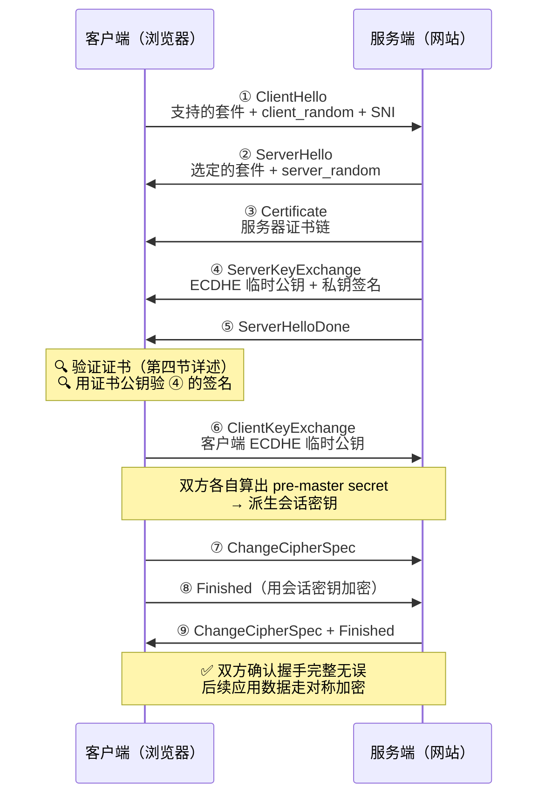
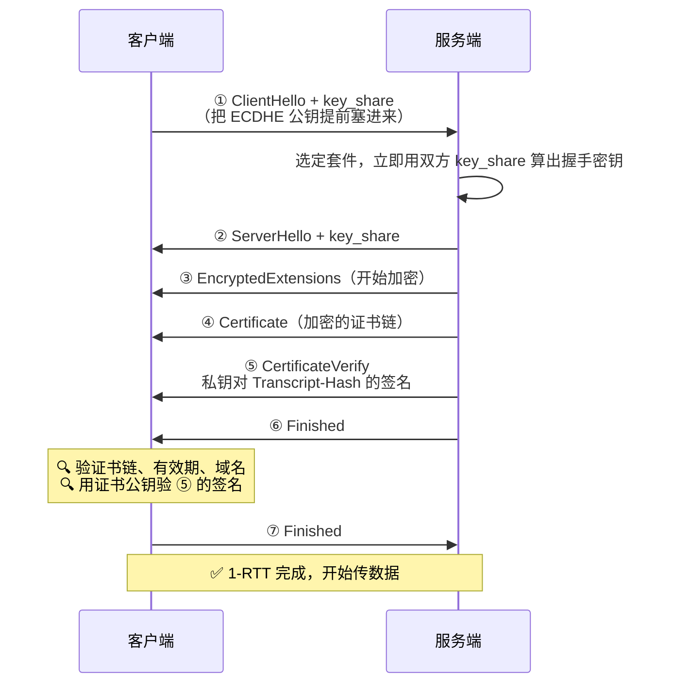
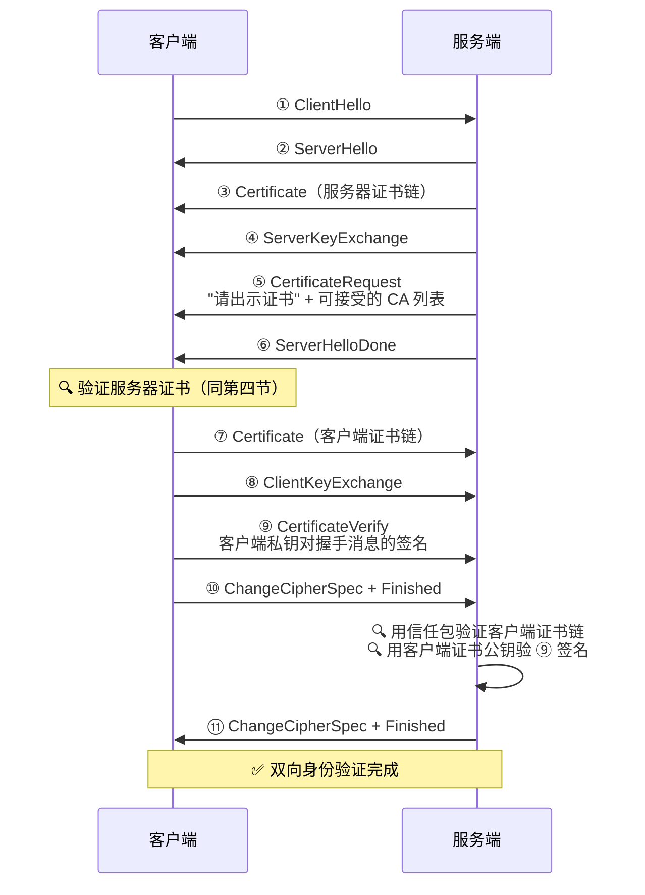
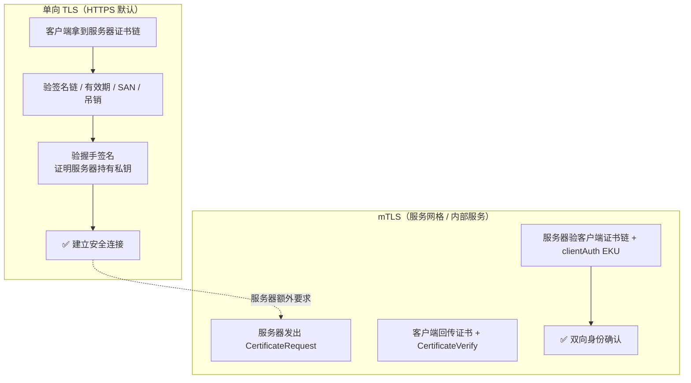

# 证书握手验证原理

## 一、上一篇文章留下的问题

在[《证书签发原理》](/basic-knowledge/cert-issuance/)里，我们回答了：

> 浏览器凭什么相信它连上的真的是 GitHub？

答案是数字证书——CA 为"公钥 + 身份"做签名担保。但那篇文章止步于**证书怎么来**，留下了另一个问题：

> 握手时，客户端拿到服务器证书后，**具体做了哪些验证**才敢把数据发过去？如果服务器反过来也要验证客户端呢？

这篇文章继续往下讲：**TLS 握手全过程、证书在握手中如何被验证，以及双向验证的 mTLS**。

---

## 二、一次 TLS 握手要完成几件事

证书只是握手的一个环节。先看清握手的全貌，TLS 握手要完成四件事：

| # | 目标 | 手段 | 结果 |
|---|------|------|------|
| 1 | **协商加密套件** | ClientHello / ServerHello | 确定密钥交换、加密、哈希算法 |
| 2 | **密钥交换** | ECDHE 等 | 双方各自算出相同的 pre-master secret |
| 3 | **身份验证** | 证书 + 签名 | 确认"你就是证书上写的那个人" |
| 4 | **派生会话密钥** | PRF / HKDF | 生成对称加密密钥，加密后续应用数据 |

> 💡 非对称加密太慢，握手只用它做"钥匙交换 + 身份验证"，**真正传数据时已经切到对称加密**。

**证书只在第 3 步出场**。理解了这一点，下面看它具体怎么被验证。

---

## 三、TLS 1.2 握手全流程（ECDHE）

先看经典 TLS 1.2 的完整握手。现代主流套件用 ECDHE 做密钥交换：



### 3.1 ④ 的签名为什么关键

注意 ④ `ServerKeyExchange`：服务器发来 **ECDHE 临时公钥**，同时附上签名：

```
签名 = Sign(服务器私钥, Hash(client_random + server_random + ECDHE 参数))
```

客户端拿到后：

1. 从 ③ 的证书里取出**服务器公钥**；
2. 用这个公钥验证 ④ 的签名。

如果验证通过，说明**持有证书私钥的人确实在线的对端**——因为签名刚才是用私钥现算的，只有私钥持有者算得出来。

> 💡 这是证书验证里最容易被忽略的一环：证书本身是公开的，谁都能偷来重放。**签名才是"实时持有私钥"的证明。**

> 📌 补充：如果用老式的 RSA 密钥交换套件，则没有 ④。客户端直接用证书公钥加密 pre-master secret，服务器能用私钥解开就**隐式**证明了私钥持有。TLS 1.3 已彻底移除这种交换方式。

### 3.2 Finished 消息的作用

⑦⑨ 的 `Finished` 消息：对"**迄今为止所有握手消息的哈希**"用刚派生的会话密钥做 PRF 计算。

- 中间人哪怕篡改了握手中的任何一条消息，两边的哈希就对不上，Finished 校验必然失败；
- 同时它证明双方派生出了**相同的**会话密钥。

---

## 四、客户端验证服务器证书的五道检查

现在聚焦第三节中"🔍 验证证书"到底做什么。浏览器拿到证书链后，依次做**五道检查**：

### 4.1 证书链验签

沿着证书链逐级用上一级公钥验下一级的签名，直到**根证书**；根证书必须在系统信任库中（信任锚）。具体机制在[上一篇文章](/basic-knowledge/cert-issuance/)的第七节已经讲过。

### 4.2 有效期

当前时间必须在 `Not Before` 和 `Not After` 之间。过期一天都不行——所以每年"证书忘记续期导致全站挂掉"是运维事故排行榜常客。

### 4.3 域名匹配（SAN）

从证书的 **SAN（Subject Alternative Name）** 列表里找目标主机名：

- `*.baidu.com` 匹配 `a.baidu.com`，但**不匹配** `a.b.baidu.com`（通配符只覆盖一级）；
- 老证书用 CN 字段存域名，**Chrome 58+ 已忽略 CN**，只看 SAN；
- 如果 SAN 里没有你访问的域名 → 验证失败。

### 4.4 吊销状态

证书可能被吊销（私钥泄露、域名易主）。客户端通过以下方式检查：

| 方式 | 机制 | 特点 |
|------|------|------|
| CRL | 客户端下载 CA 发布的吊销列表 | 列表可能很大，有延迟 |
| OCSP | 客户端在线问 CA "这证书吊销了吗" | 实时但暴露浏览隐私 |
| OCSP Stapling | 服务器在握手中**附带** CA 签发的 OCSP 应答 | 兼顾实时与隐私，主流方案 |

### 4.5 私钥持有证明

即 3.1 节讲的握手签名验证：TLS 1.2 的 `ServerKeyExchange` 签名 / TLS 1.3 的 `CertificateVerify`（第五节详述）。

### 4.6 失败时的报错

每道检查失败，浏览器会给出不同的错误页：

| 检查失败 | Chrome 报错示例 |
|----------|-----------------|
| 证书链不可信（根不在信任库） | `NET::ERR_CERT_AUTHORITY_INVALID` |
| 已过期 | `NET::ERR_CERT_DATE_INVALID` |
| 域名不匹配 | `NET::ERR_CERT_COMMON_NAME_INVALID` |
| 已吊销 | `NET::ERR_CERT_REVOKED` |

---

## 五、TLS 1.3 握手：更短，验证更显式

TLS 1.3（RFC 8446）砍掉了往返，并把"私钥持有证明"从隐式变为显式：



### 5.1 CertificateVerify：显式的私钥证明

```
CertificateVerify = Sign(服务器私钥,
    Transcript-Hash(从 ClientHello 到 Certificate 为止的所有握手消息))
```

客户端用证书公钥验证这个签名，一举两得：

1. 证明服务器**实时持有**证书私钥；
2. 证明双方看到的**握手消息完全一致**（Transcript-Hash 对不上就验签失败）。

### 5.2 TLS 1.2 vs 1.3

| | TLS 1.2 | TLS 1.3 |
|---|---------|---------|
| 完成握手 | 2-RTT | 1-RTT（0-RTT 可选） |
| 密钥交换 | ECDHE 或 RSA | 仅 ECDHE（RSA 交换被移除） |
| 证书和握手消息 | 明文传输 | ServerHello 之后全部加密 |
| 私钥证明 | ServerKeyExchange 签名（ECDHE）/ 隐式（RSA） | 显式 `CertificateVerify` |
| 对称加密 | 含 CBC 等旧算法 | 仅 AEAD（如 AES-GCM、ChaCha20） |

> 💡 TLS 1.3 的另一个好处：证书加密传输后，中间设备不再能被动看到服务器域名证书，减少指纹识别。

---

## 六、实操：用 OpenSSL 观察验证过程

沿用上一篇文章建好的自建 CA 环境（`ca.crt` + `server.crt`）。

### 6.1 观察一次真实握手

```bash
# 连接真实网站，查看协议、套件和验证结果
echo | openssl s_client -connect www.baidu.com:443 \
  -servername www.baidu.com -tls1_3 2>/dev/null | \
  grep -E "Protocol|Cipher|Verify"
```

输出示例：

```
Protocol  : TLSv1.3
Cipher    : TLS_AES_256_GCM_SHA384
Verify return code: 0 (ok)
```

`Verify return code: 0 (ok)` 表示证书链验证通过。

### 6.2 验证失败案例一：根证书不受信

用上一篇文章的自建 CA 签发证书并起服务：

```bash
openssl s_server -cert server.crt -key server.key -accept 8443 -www &
```

不带信任包连接（模拟系统不认这个 CA）：

```bash
echo | openssl s_client -connect localhost:8443 2>&1 | grep "Verify return"
# Verify return code: 19 (self-signed certificate in certificate chain)
```

带上 `ca.crt` 再连：

```bash
echo | openssl s_client -connect localhost:8443 -CAfile ca.crt 2>&1 | grep "Verify return"
# Verify return code: 0 (ok)
```

### 6.3 验证失败案例二：域名不匹配

```bash
echo | openssl s_client -connect localhost:8443 \
  -CAfile ca.crt -verify_hostname wrong.example.com 2>&1 | \
  grep -E "Verify return|Hostname"
# Verify return code: 62 (hostname mismatch)
```

> ⚠️ **一个常见坑**：`openssl s_client` 默认**不校验域名**，只验证书链。加了 `-verify_hostname` 才会做 SAN 匹配。而浏览器默认两者都验——所以"curl 能通但浏览器报错"的问题常出在这里。

---

## 七、mTLS：服务器也要验证客户端

前面所有流程都是**单向 TLS**：只有客户端验证服务器。mTLS（Mutual TLS，双向 TLS）在此基础上反过来：

> **服务器也要求客户端出示证书，并验证它的身份。**

### 7.1 握手流程的变化（TLS 1.2）



与单向 TLS 相比，多了三处：

1. ⑤ **CertificateRequest**：服务端主动要客户端证书，并附上自己信任的 CA 列表（客户端据此选合适的证书）。
2. ⑦ 客户端把自己的**证书链**发过去。
3. ⑨ 客户端的 **CertificateVerify**：用客户端私钥对握手消息签名，证明"我实时持有这张证书的私钥"。

### 7.2 服务端验证客户端证书时查什么

与第四节的检查几乎对称：

- 客户端证书链能验到服务端信任包中的根；
- 证书在有效期内、未被吊销；
- 证书扩展 **EKU 包含 `clientAuth`**（TLS Web Client Authentication）——一张只有 `serverAuth` 的服务器证书不能反过来当客户端证书用；
- ⑨ 的 CertificateVerify 签名验证通过。

### 7.3 实操：完整的 mTLS 环境

```bash
# 1. 给客户端签发带 clientAuth EKU 的证书
openssl genrsa -out client.key 2048
openssl req -new -key client.key -out client.csr \
  -subj "/CN=client.internal"
openssl x509 -req -in client.csr \
  -CA ca.crt -CAkey ca.key -CAcreateserial \
  -out client.crt -days 365 \
  -extfile <(printf "extendedKeyUsage=clientAuth")

# 2. 服务端：-Verify 2 表示"必须提供客户端证书，且验证深度 2"
openssl s_server -accept 8443 \
  -cert server.crt -key server.key \
  -CAfile ca.crt -Verify 2

# 3. 客户端：带证书连接
openssl s_client -connect localhost:8443 \
  -cert client.crt -key client.key \
  -CAfile ca.crt -quiet
```

服务端会打出验证结果，例如：

```
depth=0 C = CN, CN = client.internal
verify return:1
```

### 7.4 客户端没证书会怎样

```bash
# 不带 -cert / -key 直接连
openssl s_client -connect localhost:8443 -CAfile ca.crt
```

服务器验证不过，直接回一个**致命的 `certificate required` 告警**，握手失败。所以 mTLS 本质上就是服务端的一道"门禁"：没有合法证书，连 TCP 之上的握手都完不成。

### 7.5 Nginx 配置示例

生产环境常用 Nginx 做 mTLS：

```nginx
server {
    listen 443 ssl;
    server_name api.internal.com;

    ssl_certificate     /etc/nginx/certs/server.crt;
    ssl_certificate_key /etc/nginx/certs/server.key;

    # mTLS：信任包 + 强制验证
    ssl_client_certificate /etc/nginx/certs/client-ca.crt;  # 客户端证书的信任包
    ssl_verify_client on;          # on=必须提供并验证; optional=可提供可不提供
    ssl_verify_depth 2;            # 客户端证书链验证深度
}
```

### 7.6 mTLS 的典型应用场景

| 场景 | 说明 |
|------|------|
| 服务网格（Istio / Linkerd） | Sidecar 之间默认 mTLS，流量透明加密 + 身份认证 |
| SPIRE / SVID | 以 SPIFFE ID 作为服务身份，Workload API 下发短生命周期证书 |
| 企业内部微服务 | 只允许持有公司签发证书的服务互相调用 |
| 金融 / 支付接口 | 双向认证，防止伪造商户或渠道 |
| K8s 管控通道 | kubelet 与 API Server 之间双向认证 |
| 物联网设备接入 | 设备出厂烧录证书，服务端据此验证设备身份 |

---

## 八、总结



核心要点：

| 要点 | 说明 |
|------|------|
| **握手四件事** | 协商套件、密钥交换、验证身份、派生会话密钥，证书只用于第三件 |
| **验证五道检查** | 证书链、有效期、SAN 域名、吊销状态、私钥持有证明 |
| **私钥证明是动态的** | 证书可被重放，握手签名（ServerKeyExchange / CertificateVerify）才证明私钥"现在"在线上 |
| **TLS 1.3 更快更显式** | 1-RTT、证书加密传输、CertificateVerify 显式验签 |
| **mTLS 是门禁** | 服务器用信任包 + clientAuth EKU 验证客户端证书，无证书直接握手失败 |

和上一篇文章串起来看，整个 HTTPS 信任体系就闭环了：

> **签发**回答了"证书怎么来"（CA 担保公钥与身份的绑定），**握手验证**回答了"证书怎么用"（每一段连接都用签名实时证明身份）。

理解了这两步，再遇到 `CERT_AUTHORITY_INVALID`、`certificate required` 这类报错，你就能顺着"链、期、名、吊销、私钥"这五道检查快速定位了。
