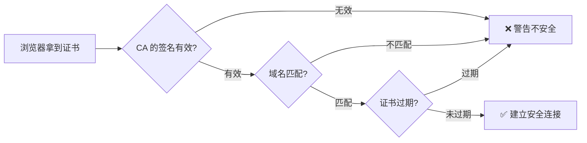
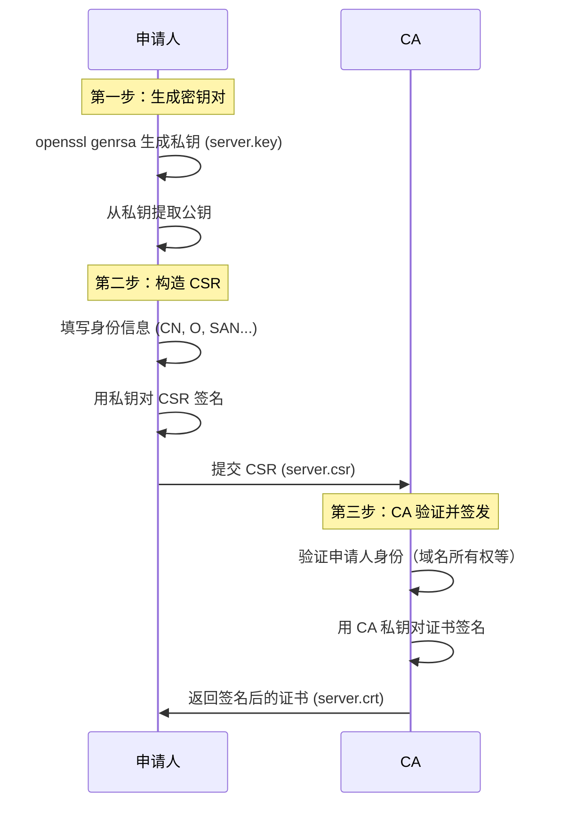
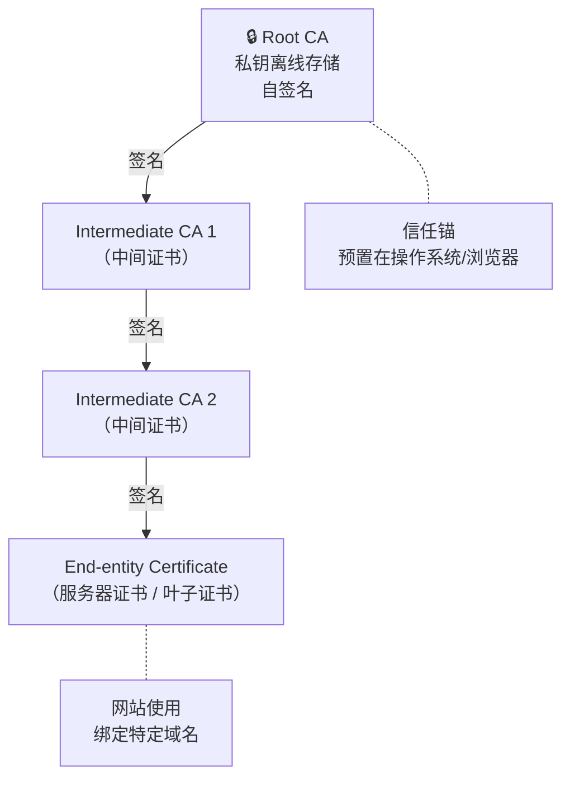
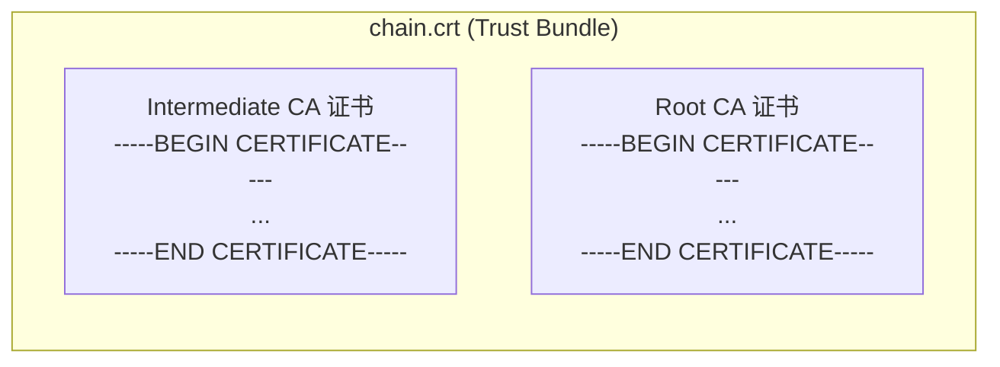
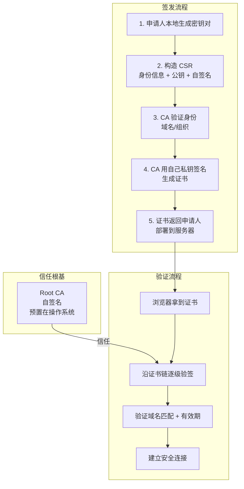

# 证书签发原理

## 一、从"你是谁"说起

假设你在浏览器里打开 `https://github.com`，浏览器显示了一把小锁 🔒，告诉你连接是安全的。但你有没有想过一个问题：

> 浏览器凭什么相信它连上的真的是 GitHub，而不是一个伪装成 GitHub 的钓鱼网站？

答案就是 **数字证书**。这篇文章将从零开始，讲清楚证书是怎么签发的、为什么能防伪造，并用 OpenSSL 实操每一步。

---

## 二、前置知识：非对称加密

理解证书之前，必须先理解**非对称加密**（也叫公钥加密）。

### 2.1 对称加密的问题

对称加密：加解密用**同一把钥匙**。就跟你家门锁一样，开门和锁门是同一把钥匙。

```
A 和 B 通信用对称加密:
  A --[用密钥 K 加密]--> B --[用密钥 K 解密]--> 明文
```

问题来了：**这把钥匙 K 怎么安全地交给对方？** 如果通过网络传，可能被中间人窃听。

### 2.2 非对称加密

非对称加密有**两把钥匙**：公钥（Public Key）和私钥（Private Key）。

- **公钥**：可以公开，谁都能拿到。用来**加密**。
- **私钥**：必须保密，只有自己知道。用来**解密**。

```
公钥加密，私钥解密:
  A --[用 B 的公钥加密]--> B --[用 B 的私钥解密]--> 明文

私钥签名，公钥验签:
  A --[用 A 的私钥签名]--> B --[用 A 的公钥验签]--> 验证通过
```

关键特性：
- 公钥加密的内容，**只有**对应的私钥能解开。
- 私钥签名的内容，**任何**有公钥的人都能验证签名确实来自私钥持有者。

### 2.3 非对称加密的新问题：中间人攻击

非对称加密解决了密钥传输问题，但引入了一个新问题：

```
A 想和 B 通信:
  A --"请给我你的公钥"--> [中间人 M 截获]
                          M 把自己的公钥发给 A
  A --[用 M 的公钥加密数据]--> M 解密后偷看，再用 B 的公钥加密转发给 B
```

A 以为在和 B 通信，实际上在和中间人 M 通信。这就是**中间人攻击（MITM）**。

**核心矛盾**：A 拿到一个公钥，但无法确认这个公钥到底是不是 B 的。

---

## 三、证书解决什么问题

证书的本质就是一句话：

> **由一个可信的第三方（CA），为"公钥 + 身份信息"做签名担保。**

类比现实世界：
- 你的**身份证**上有你的姓名、照片，由公安局签发盖章。
- **数字证书**上有网站域名、网站公钥，由 CA（Certificate Authority）签发签名。

浏览器验证证书时：



---

## 四、X.509 证书长什么样

现代 HTTPS 使用的是 **X.509 v3** 标准证书。我们用 OpenSSL 看看百度证书的内容：

```bash
# 连接百度的 443 端口，导出证书
echo | openssl s_client -connect www.baidu.com:443 -servername www.baidu.com 2>/dev/null | \
  openssl x509 -text -noout | head -50
```

你会看到类似这样的结构：

```
Certificate:
    Version: 3 (0x2)                    # X.509 v3
    Serial Number: 0a:5e:...            # 证书序列号（CA 分配的唯一编号）
    Signature Algorithm: sha256WithRSAEncryption  # CA 签名使用的算法
    Issuer: C=BE, O=GlobalSign nv-sa, CN=GlobalSign RSA OV SSL CA 2018  # 签发者（谁签的）
    Validity                             # 有效期
        Not Before: Jul 10 00:00:00 2025 GMT
        Not After : Aug 11 23:59:59 2026 GMT
    Subject: C=CN, ST=beijing, L=beijing, O=Beijing Baidu Netcom Science Technology Co., Ltd, CN=baidu.com
    Subject Public Key Info:            # 网站的公钥
        Public Key Algorithm: rsaEncryption
        RSA Public-Key: (2048 bit)
        Modulus: ...
        Exponent: 65537 (0x10001)
    X509v3 extensions:                  # 扩展字段
        X509v3 Subject Alternative Name: # SAN：证书绑定的域名
            DNS:www.baidu.com, DNS:baidu.com, DNS:*.baidu.com
```

一张 X.509 证书的核心字段：

| 字段 | 含义 | 举例 |
|------|------|------|
| **Subject** | 证书持有者身份 | `CN=baidu.com, O=Beijing Baidu...` |
| **Subject Public Key** | 持有者的公钥 | RSA 2048-bit |
| **Issuer** | 签发者（CA）的身份 | `CN=GlobalSign RSA OV SSL CA 2018` |
| **Validity** | 有效期 | 2025-07-10 ~ 2026-08-11 |
| **Serial Number** | 证书序列号 | CA 分配的唯一编号 |
| **Signature** | CA 对上述所有内容的数字签名 | 一长串二进制数据 |
| **SAN** | 主题备用名称（证书绑定的域名列表） | `DNS:*.baidu.com` |

---

## 五、证书签发的完整流程

证书签发分为三步：**生成密钥对 → 构造 CSR → CA 签名**。



### 5.1 第一步：生成密钥对

申请人首先在**自己本地**生成一对公私钥：

```bash
# 生成 2048 位 RSA 私钥（保密！不要分享）
openssl genrsa -out server.key 2048

# 查看私钥内容
openssl rsa -in server.key -text -noout | head -10
```

输出示例：
```
RSA Private-Key: (2048 bit, 2 primes)
modulus:
    00:b5:8e:3c:21:a7:f9:12:4e:6d:...
publicExponent: 65537 (0x10001)
privateExponent:
    00:9a:3d:72:11:5e:c8:...
```

> 💡 **私钥永远不会离开申请人的机器**。CA 永远拿不到你的私钥，这也是证书安全性的基石。

### 5.2 第二步：构造 CSR（Certificate Signing Request）

CSR 是"证书签名请求"文件，包含：
- 你的**身份信息**（域名、组织等）
- 你的**公钥**
- 你用**私钥做的签名**（证明你确实持有对应私钥）

```bash
# 方法一：交互式生成 CSR
openssl req -new -key server.key -out server.csr
# 会提示输入国家、省份、组织名、Common Name（域名）等

# 方法二：一行命令，非交互式生成
openssl req -new \
  -key server.key \
  -out server.csr \
  -subj "/C=CN/ST=Guangdong/L=Shenzhen/O=MyCompany/CN=mysite.com"
```

查看 CSR 内容：

```bash
openssl req -in server.csr -text -noout
```

输出示例：
```
Certificate Request:
    Subject: C=CN, ST=Guangdong, L=Shenzhen, O=MyCompany, CN=mysite.com
    Subject Public Key Info:
        Public Key Algorithm: rsaEncryption
        RSA Public-Key: (2048 bit)
        Modulus: ...（同 server.key 中的公钥）
    Signature Algorithm: sha256WithRSAEncryption
    Signature: ...（用 server.key 私钥做的签名）
```

重点关注：
1. **Subject** — 你的身份信息，CN 通常是域名。
2. **公钥** — 和你的私钥配对的那个公钥。
3. **签名** — 用你的私钥签的。CA 收到后会用你 CSR 里的公钥验证这个签名，确保 CSR 确实是你发的（你有私钥），而且内容没被篡改。

### 5.3 第三步：CA 签发证书

CA 收到你的 CSR 后：

1. **验证你的身份**：
   - DV（域名验证）：让你在 DNS 加一条 TXT 记录，或在网站放一个特定文件，证明你控制这个域名。
   - OV（组织验证）：额外验证你的公司是否真实存在。
   - EV（扩展验证）：最严格的验证，浏览器地址栏会显示公司名称（绿色）。

2. **签发证书**：验证通过后，CA 用 **自己的私钥** 为你的 CSR 签名，生成证书：

```bash
# CA 用自己的私钥 (ca.key) 和根证书 (ca.crt) 签发你的证书
openssl x509 -req \
  -in server.csr \          # 你的 CSR
  -CA ca.crt \              # CA 自己的证书
  -CAkey ca.key \           # CA 的私钥
  -CAcreateserial \         # 自动生成序列号
  -out server.crt \         # 输出：签名后的证书
  -days 365 \               # 有效期 365 天
  -extfile <(printf "subjectAltName=DNS:mysite.com,DNS:www.mysite.com")  # SAN 扩展
```

3. **签名过程详解**：

```
CA 签名 = 对证书内容做以下操作:

  1. 对证书的 TBSCertificate（To Be Signed，待签名部分）做哈希，得到 HASH
     证书内容 = [版本号, 序列号, 签名算法, 签发者, 有效期, 持有者, 公钥, 扩展...]
                └──────────────── TBSCertificate ────────────────┘

  2. 用 CA 私钥对 HASH 加密，得到 SIGNATURE
     SIGNATURE = RSA_Encrypt(CA私钥, SHA256(TBSCertificate))

  3. 将 SIGNATURE 附在证书末尾
     最终证书 = TBSCertificate + 签名算法标识 + SIGNATURE

验证时:
  浏览器用 CA 公钥解密 SIGNATURE → 得到 original_hash
  浏览器自己对 TBSCertificate 做 SHA256 → 得到 computed_hash
  如果 original_hash == computed_hash → ✅ 证书未被篡改，确由该 CA 签发
```

---

## 六、完整实操：自建 CA 并签发证书

下面我们完整模拟一遍：自己建一个 Root CA，然后用它签发一张服务器证书。

### 6.1 创建 Root CA

```bash
# 1. 生成 Root CA 的私钥（4096 位，更安全）
openssl genrsa -out ca.key 4096

# 2. 用这个私钥生成自签名根证书（Root CA 自己签自己）
openssl req -new -x509 \
  -key ca.key \
  -out ca.crt \
  -days 3650 \                    # 有效期 10 年
  -subj "/C=CN/ST=Guangdong/L=Shenzhen/O=MyRootCA/CN=My Root CA"

# 3. 查看根证书
openssl x509 -in ca.crt -text -noout | head -20
```

输出：
```
Certificate:
    Issuer: C=CN, ST=Guangdong, L=Shenzhen, O=MyRootCA, CN=My Root CA
    Subject: C=CN, ST=Guangdong, L=Shenzhen, O=MyRootCA, CN=My Root CA
    # 👆 注意：自签名证书的 Issuer == Subject
```

> 根证书的 Issuer 和 Subject 是同一个人——Root CA 自己签自己。这是整个信任链的**信任锚点**。

### 6.2 生成服务器证书

```bash
# 1. 生成服务器私钥
openssl genrsa -out server.key 2048

# 2. 生成 CSR
openssl req -new \
  -key server.key \
  -out server.csr \
  -subj "/C=CN/ST=Guangdong/L=Shenzhen/O=MyServer/CN=mysite.local"

# 3. 用 Root CA 签发证书（注意添加 SAN）
openssl x509 -req \
  -in server.csr \
  -CA ca.crt \
  -CAkey ca.key \
  -CAcreateserial \
  -out server.crt \
  -days 365 \
  -extfile <(printf "subjectAltName=DNS:mysite.local,DNS:www.mysite.local")

# 4. 验证：用 CA 证书验证服务器证书
openssl verify -CAfile ca.crt server.crt
# 输出: server.crt: OK ✅
```

查看服务器证书的签发者：

```bash
openssl x509 -in server.crt -issuer -subject -noout
# issuer=C = CN, ST = Guangdong, L = Shenzhen, O = MyRootCA, CN = My Root CA
# subject=C = CN, ST = Guangdong, L = Shenzhen, O = MyServer, CN = mysite.local
```

可以看到 Issuer 是 My Root CA，Subject 是 mysite.local——**签发者和持有者不同**，这是一张正常的终端实体证书。

### 6.3 用证书搭建 HTTPS 服务

```bash
# 用 openssl 快速启动一个 HTTPS 服务（测试用）
openssl s_server \
  -cert server.crt \
  -key server.key \
  -accept 8443 \
  -www &
```

然后在浏览器访问 `https://localhost:8443`，浏览器会警告"不安全"——因为我们的 Root CA 不在浏览器的信任列表里。把 `ca.crt` 导入系统信任库后警告就消失了。

---

## 七、证书链：从根到叶的信任传递

现实中，Root CA 的私钥被物理隔离保护（比如放在硬件安全模块 HSM 中），不会直接拿它签发终端证书。实际证书链通常至少三层：



验证时，浏览器沿着链条一级一级往上验：

```
验证 server.crt:
  1. 用 Intermediate CA 2 的公钥验证 server.crt 的签名 ✅
  2. 用 Intermediate CA 1 的公钥验证 Intermediate CA 2 的签名 ✅
  3. 用 Root CA 的公钥验证 Intermediate CA 1 的签名 ✅
  4. Root CA 在系统信任库中 → 整条链可信 ✅
```

### 7.1 实操：构建三层证书链

```bash
# === 第一层：Root CA（自签名）===
openssl genrsa -out root.key 4096
openssl req -new -x509 -key root.key -out root.crt -days 7300 \
  -subj "/CN=Root CA"

# === 第二层：Intermediate CA（由 Root CA 签发）===
openssl genrsa -out intermediate.key 4096
openssl req -new -key intermediate.key -out intermediate.csr \
  -subj "/CN=Intermediate CA"
openssl x509 -req \
  -in intermediate.csr \
  -CA root.crt -CAkey root.key \
  -CAcreateserial \
  -out intermediate.crt \
  -days 3650 \
  -extfile <(printf "basicConstraints=CA:TRUE\nkeyUsage=keyCertSign,cRLSign")
# 💡 注意：中间 CA 的文件扩展名也是 .crt，和根证书、服务器证书一样。
#    文件扩展名（.crt / .pem / .ca）只是命名习惯，不参与证书验证。
#    真正决定一张证书是 "CA 证书" 还是 "终端证书" 的是证书扩展字段：
#      - basicConstraints=CA:TRUE  → 这是一张 CA 证书（可以签其他证书）
#      - 没有 basicConstraints=CA:TRUE → 这是终端实体证书（不能签其他证书）
#    根 CA 和中间 CA 本质上都是 CA 证书，只是层级不同。

# === 第三层：服务器证书（由 Intermediate CA 签发）===
openssl genrsa -out www.key 2048
openssl req -new -key www.key -out www.csr \
  -subj "/CN=mysite.local"
openssl x509 -req \
  -in www.csr \
  -CA intermediate.crt -CAkey intermediate.key \
  -CAcreateserial \
  -out www.crt \
  -days 365 \
  -extfile <(printf "subjectAltName=DNS:mysite.local,DNS:www.mysite.local")

# === 验证证书链 ===
# 把中间证书和根证书合并为链文件
cat intermediate.crt root.crt > chain.crt
openssl verify -CAfile chain.crt www.crt
# 输出: www.crt: OK ✅
```

### 7.2 Trust Bundle（证书信任包）

上面 `cat intermediate.crt root.crt > chain.crt` 生成的 `chain.crt` 就是一个 **Trust Bundle**（也叫 CA Bundle）。

**Bundle 就是把多个 CA 证书拼在一起的文件。** 它告诉验证方："这些是我信任的 CA，用它们来验证证书链。"



一个 Bundle 文件内部就是多个 PEM 格式证书首尾相连，格式如下：

```
-----BEGIN CERTIFICATE-----
MIID...（Intermediate CA 的证书内容）...
-----END CERTIFICATE-----
-----BEGIN CERTIFICATE-----
MIID...（Root CA 的证书内容）...
-----END CERTIFICATE-----
```

**Bundle 的常见使用场景**：

| 场景 | 说明 |
|------|------|
| **TLS 服务端配置** | Nginx 的 `ssl_trusted_certificate` 参数需要一个 Bundle 来验证客户端证书 |
| **SPIRE** | Workload API 下发的 Trust Bundle 包含信任域内所有 CA 证书，用于验证对端 SVID |
| **操作系统信任库** | Linux 的 `/etc/ssl/certs/`、macOS 的 Keychain 本质上就是系统级的 Trust Bundle |
| **编程语言** | Go 的 `x509.SystemCertPool()`、Python 的 `certifi` 包都是 Bundle 的变体 |

> 💡 **一句话总结**：Bundle = 一组 CA 证书的集合。服务器用它告诉客户端"这些 CA 签的证书我都认"，客户端用它来验证服务器证书的签发链。

---

## 八、为什么证书需要"链"？

你可能想问：为什么不让 Root CA 直接签服务器证书，省掉中间层？

**安全考虑**：

1. **私钥安全**：Root CA 私钥一旦泄露，整个信任体系崩塌（需要操作系统/浏览器推送更新才能吊销）。中间 CA 私钥泄露影响范围可控。
2. **私钥离线**：Root CA 私钥通常离线存储在硬件安全模块（HSM）中，物理上无法联网。日常签发由中间 CA 在线完成。
3. **灵活吊销**：某个中间 CA 出问题，只吊销这一个中间 CA，不影响其他。

---

## 九、公开 CA 签发的实际流程

以 Let's Encrypt（免费 CA）为例，实际申请证书的流程：

```bash
# 使用 certbot（Let's Encrypt 的官方客户端）
certbot certonly --standalone -d mysite.com -d www.mysite.com
```

certbot 在背后做的事：

```
1. certbot 在本地生成密钥对和 CSR
2. certbot 把 CSR 发给 Let's Encrypt 的 ACME 服务器
3. Let's Encrypt 发出一个"挑战"（Challenge）：
   - HTTP-01: 要求你在 http://mysite.com/.well-known/acme-challenge/<token> 放指定内容
   - DNS-01: 要求你在 DNS 加一条 _acme-challenge.mysite.com 的 TXT 记录
4. certbot 完成挑战，Let's Encrypt 验证通过
5. Let's Encrypt 签发证书，certbot 下载保存到本地
```

**整个过程中，Let's Encrypt 从来没有拿到过你的私钥。**

---

## 十、总结



核心要点：

| 要点 | 说明 |
|------|------|
| **私钥不出门** | 私钥在本地生成，CA 永远不会拿到你的私钥 |
| **CA 做担保** | CA 用自己的私钥为"公钥+身份"签名，担保绑定关系 |
| **信任靠链** | Root CA → Intermediate CA → 终端证书，逐级验证 |
| **安全靠根** | Root CA 预置在操作系统/浏览器中，是整个体系的信任锚点 |
| **验证靠签名** | 用 CA 公钥解密签名，比对哈希，确认证书未被篡改 |

理解了这些，你就知道为什么 HTTPS 的那把小锁 🔒 是可以信赖的——它背后是一整套基于非对称加密的信任体系。
