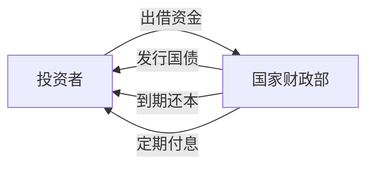
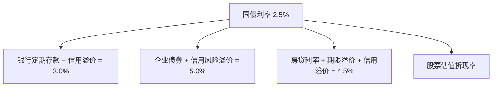
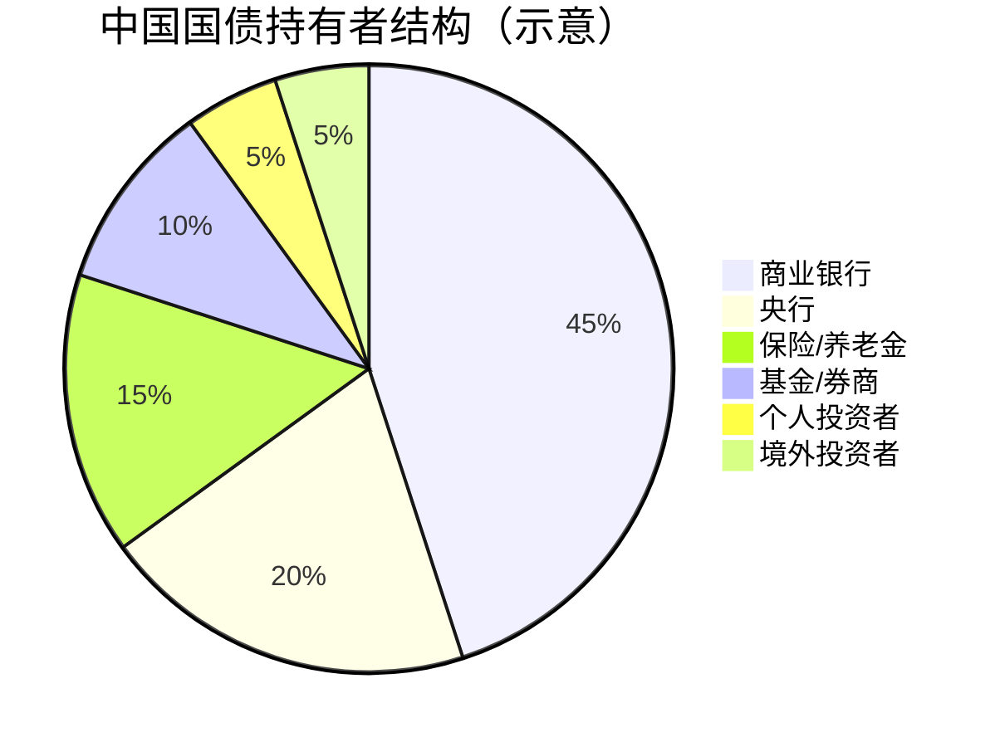

# 什么是国债？一文读懂国家借条

## 一、国债的本质：国家的"借条"

国债，全称**国家公债**（Government Bond），通俗地说就是**国家向你借钱时打的一张借条**。

想象一个场景：你朋友开店缺 10 万块，找你借钱并写了一张借条，约定 3 年后还本，每年付你 3% 的利息。把"朋友"换成"国家"，把"10 万块"换成"几百亿、几千亿"，就是国债的基本逻辑。



国债的三要素：

| 要素 | 说明 | 举例 |
|------|------|------|
| **面值** | 债券的票面金额 | 100 元 / 张 |
| **票面利率** | 约定的年化利率 | 2.5% / 年 |
| **期限** | 从发行到还本的时间 | 3 年 / 10 年 / 30 年 |

## 二、国家为什么要发行国债？

国家发行国债并不是因为"缺钱"这么简单，它承担着多重宏观经济职能：

### 2.1 弥补财政赤字

当政府的税收等收入不足以覆盖支出时，就需要借钱来填补缺口。国债是最主要的融资手段。

```
财政收入（税收、国企利润等）──→ 覆盖 ──→ 财政支出（基建、国防、教育等）
                                          │
                              不足部分 ←── 发行国债补足
```

### 2.2 调控宏观经济

国债是央行实施**货币政策**的核心工具之一：

- **经济过热**时，央行卖出国债，回收市场上的流动性（钱），给经济降温。
- **经济低迷**时，央行买入国债，向市场投放流动性，刺激经济。

这就是常说的**公开市场操作**（OMO，Open Market Operations）。

### 2.3 提供无风险基准利率

国债利率被视为一个国家的**无风险利率**（Risk-Free Rate），是整个金融体系的定价锚：



所有其他金融资产的定价，都是在国债利率的基础上加上各自的**风险溢价**。

### 2.4 重大项目建设融资

基础设施（高铁、水利、新能源等）投资大、回收周期长，私人资本不愿意或无力承担。国家通过发行长期国债募集资金，完成这些具有公共品属性的投资。

## 三、国债的分类

### 3.1 按期限划分

| 类型 | 期限 | 特点 |
|------|------|------|
| 短期国债（T-Bills） | 1 年以内 | 流动性极高，近似现金 |
| 中期国债（T-Notes） | 1 - 10 年 | 兼顾收益与流动性 |
| 长期国债（T-Bonds） | 10 年以上（最长达 50 年） | 锁定长期利率，价格波动大 |

### 3.2 按付息方式

- **附息国债**：定期（半年或一年）支付利息，到期还本。最常见。
- **贴现国债**：以低于面值的价格发行，到期按面值兑付，差价即为收益。短期国债多用此方式。

### 3.3 按发行场所

- **记账式国债**：电子化记录，可在二级市场交易。
- **储蓄国债（凭证式/电子式）**：面向个人投资者，不可上市交易，但可提前兑取。

## 四、国债为什么被称为"最安全的资产"？

国债违约风险极低，原因在于国家拥有三大"特权"：

1. **征税权**：国家可以通过税收获取收入来偿还债务。
2. **货币发行权**：主权国家可以发行本国货币来偿还以本币计价的国债。
3. **再融资能力**：国家通常可以"借新还旧"，滚动债务。

> ⚠️ 以上特权限定于**主权货币国家**。如果一个国家借的是外币债务（比如美元债），又无法印美元，那违约风险就真实存在了——1998 年俄罗斯、2001 年阿根廷都是典型例子。

## 五、国债的主要玩家



### 5.1 商业银行

银行是国债最大的买家。当市场风险加大时，银行倾向将资金配置到安全的国债上；同时银行也需要持有国债作为流动性管理工具。

### 5.2 中央银行

央行买卖国债不是为了盈利，而是为了执行货币政策——吞吐基础货币。

### 5.3 个人投资者

普通人购买国债的主要渠道：
- 银行柜台购买储蓄国债
- 证券账户购买记账式国债（二级市场交易）
- 通过债券基金间接持有

## 六、国债收益率：经济的"体温计"

### 6.1 什么是国债收益率？

虽然票面利率是固定的，但国债在二级市场上交易后，实际收益率会随价格波动：

$$
收益率 = \frac{票面利息 + (面值 - 购买价格) / 剩余年限}{购买价格} \times 100\%
$$

**核心规律**：债券价格 ↑ → 收益率 ↓（二者反向变动）

### 6.2 收益率曲线

不同期限国债的收益率连成一条曲线，它反映了市场对未来经济的预期：

```mermaid
graph TD
    subgraph 正常曲线
    A1[1年期 1.5%] --> A2[5年期 2.5%] --> A3[10年期 3.0%] --> A4[30年期 3.5%]
    end
    subgraph 倒挂曲线（衰退预警）
    B1[1年期 5.0%] --> B2[5年期 4.5%] --> B3[10年期 4.0%] --> B4[30年期 3.8%]
    end
```

- **正常曲线**：长期利率 > 短期利率，经济健康扩张。
- **平坦曲线**：长短端利率接近，经济前景不明朗。
- **倒挂曲线**：短期利率 > 长期利率，历史上每次美国经济衰退前都出现过。

> 🚨 收益率曲线倒挂是华尔街最关注的衰退预警信号之一，过去 50 年间每次美国经济衰退前 6-18 个月都出现了这一信号。

### 6.3 影响国债收益率的因素

| 因素 | 作用方向 | 逻辑 |
|------|----------|------|
| 央行加息 | 收益率 ↑ | 基准利率提升，新发债券更有吸引力 |
| 通胀预期上升 | 收益率 ↑ | 投资者要求更高回报弥补购买力损失 |
| 经济衰退预期 | 收益率 ↓ | 资金涌入安全资产（避险需求） |
| 财政赤字扩大 | 收益率 ↑ | 供给增加，压低价格 |
| 全球避险情绪 | 收益率 ↓ | 资金流入主权债券市场 |

## 七、中国国债市场概况

### 7.1 市场规模

中国现在是全球**第二大债券市场**（仅次于美国），国债存量规模超过 30 万亿人民币。

### 7.2 近年趋势


中国 10 年期国债收益率近年来持续走低，反映了：
- 经济增长中枢下移
- 通胀压力温和（甚至通缩风险）
- 央行宽松的货币政策取向
- 市场"资产荒"——优质资产稀缺

### 7.3 境外投资者

随着中国债券纳入全球三大债券指数（彭博巴克莱、摩根大通、富时罗素），境外资金持续流入。目前境外机构持有中国国债约 2 万亿人民币，成为不可忽视的力量。

## 八、普通人如何参与国债投资？

| 方式 | 门槛 | 流动性 | 适合人群 |
|------|------|--------|----------|
| 银行柜台买储蓄国债 | 100 元起 | 低（持有至到期） | 保守型，追求绝对安全 |
| 证券账户买记账式国债 | 10 万元起（每手） | 高（可随时卖出） | 有一定投资经验 |
| 债券 ETF / 债基 | 1 元起 | 高 | 普通投资者首选 |
| 国债期货 | 高（50 万+） | 极高 | 专业投资者 |

## 九、常见误区澄清

### 误区 1：「国家不会破产，所以国债没风险」

国家确实极难破产（以本币计价），但**利率风险和通胀风险**依然存在。你买的 30 年期国债利率 2.5%，如果 10 年后通胀率达到 5%，你的实际购买力就在缩水。

### 误区 2：「国债收益率低，不值得投」

国债在投资组合中的角色是**压舱石**，不是发动机。它提供的是确定性——在股市大跌时，国债往往是少数能保值的资产。

### 误区 3：「国债就是理财，随时可以取」

储蓄国债提前兑取是有**手续费**的，且分段计息。记账式国债在二级市场卖出可能面临**价格亏损**（市场利率上升时你的债券会折价）。

## 十、总结

国债远不止是一张"国家借条"：

1. **对政府**，它是财政融资和宏观调节的工具。
2. **对央行**，它是货币政策的操作媒介。
3. **对金融市场**，它是定价的基准和风险的避风港。
4. **对普通人**，它是最基础的保值资产，也是观察宏观经济的窗口。

理解国债，就是理解现代金融体系的根基。它为一切高风险投资提供了参照系——没有无风险利率，就没有风险定价；没有国债，就没有现代金融市场。

---

> 📚 **延伸阅读**：理解了国债之后，可以进一步了解：通胀如何侵蚀债券收益、央行的货币政策工具箱、以及债券收益率曲线的实战应用。
