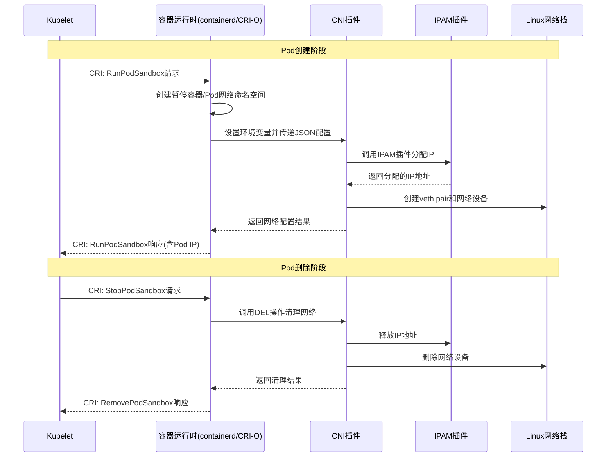

# Kubernetes CNI 网络插件原理详解：从核心概念到实现细节

## 1. 引言：Kubernetes 网络模型与 CNI 的诞生

Kubernetes 设计了一套简洁而强大的网络模型，要求所有容器运行时必须满足四个基本条件：
1.  Pod 拥有唯一IP且可直接通信
2.  Pod 能通过Service IP访问服务
3.  节点能与所有Pod直接通信
4.  HostNetwork模式下的Pod能与集群网络互通

为实现这一模型而诞生的**容器网络接口（CNI）**，提供了一个标准化的插件框架，让不同的网络解决方案能够在Kubernetes中无缝工作。CNI定义了容器运行时与网络插件之间的契约，使得网络配置变得模块化和可扩展。

## 2. CNI 插件的基本工作原理

### 2.1 调用流程：从Kubelet到网络插件

Kubernetes并不直接管理网络，而是通过一个清晰的调用链委托处理：



### 2.2 插件调用机制

容器运行时通过两种方式向CNI插件传递信息：

1.  **环境变量**：提供执行上下文
   - `CNI_COMMAND`：操作类型(ADD/DEL/CHECK/VERSION)
   - `CNI_CONTAINERID`：容器唯一标识符
   - `CNI_NETNS`：Pod网络命名空间路径
   - `CNI_IFNAME`：Pod内容器接口名(通常为eth0)
   - `CNI_PATH`：CNI插件搜索路径

2.  **标准输入(stdin)**：传递JSON格式的完整配置信息

## 3. CNI 插件的三种类型与链式调用

CNI生态系统由三类插件组成，它们通过链式调用协同工作。

### 3.1 主插件(Main Plugins)
负责数据通路的建立，是网络配置的核心：
- **功能**：创建虚拟网络设备(veth pair、网桥、隧道等)，配置设备状态
- **示例**：`bridge`、`macvlan`、`ipvlan`、`vlan`，以及Calico、Flannel等实现的插件

### 3.2 IPAM插件(IP Address Management Plugins)
负责IP地址的分配和管理：
- **功能**：从地址池中分配空闲IP，记录分配状态，回收IP地址
- **示例**：`host-local`(本地文件管理)、`dhcp`(DHCP服务器分配)

### 3.3 Meta插件(meta Plugins)
编排和修饰其他插件，增强网络功能：
- **功能**：控制插件链执行流程，修改网络配置
- **示例**：
  - `portmap`：提供HostPort功能，通过iptables实现端口映射
  - `bandwidth`：使用tc命令限制网络带宽
  - `tuning`：调整网络接口参数(MTU、sysctl等)
  - `flannel`：特殊meta插件，根据集群状态生成配置并调用其他插件

### 3.4 插件链示例

```json
{
  "cniVersion": "0.4.0",
  "name": "mynet",
  "plugins": [
    {
      "type": "bridge",
      "bridge": "cni0",
      "ipam": {
        "type": "host-local",
        "subnet": "10.244.0.0/24"
      }
    },
    {
      "type": "portmap",
      "capabilities": {"portMappings": true}
    },
    {
      "type": "bandwidth",
      "capabilities": {"bandwidth": true}
    }
  ]
}
```

## 4. CNI 插件可获取的信息详情

### 4.1 通过环境变量获取的信息
| 变量名 | 描述 | 示例值 |
|--------|------|--------|
| `CNI_COMMAND` | 要执行的操作 | `ADD`, `DEL`, `CHECK` |
| `CNI_CONTAINERID` | 容器唯一ID | `a1b2c3d4...` |
| `CNI_NETNS` | 网络命名空间路径 | `/proc/12345/ns/net` |
| `CNI_IFNAME` | 容器内接口名 | `eth0` |
| `CNI_PATH` | 插件搜索路径 | `/opt/cni/bin` |

### 4.2 通过标准输入获取的信息

```json
{
  "cniVersion": "0.4.0",
  "name": "mybridge",
  "type": "bridge",
  "bridge": "cni0",
  "ipam": {"type": "host-local", "subnet": "10.244.0.0/24"},
  "args": {
    "K8S_POD_NAMESPACE": "my-namespace",
    "K8S_POD_NAME": "nginx-55f5c6d859-abcde",
    "K8S_POD_UID": "a1b2c3d4-5678-90ef-...",
    "K8S_POD_INFRA_CONTAINER_ID": "containerd://a1b2c3d4..."
  },
  "runtimeConfig": {
    "org.example.cni": {"ip": "10.244.0.123"}
  },
  "prevResult": {
    "ips": [{"address": "10.244.0.123/24"}],
    "interfaces": [...]
  }
}
```

**关键数据字段：**
- **网络配置**：插件类型、网桥名、IPAM策略等
- **Kubernetes元数据**：Pod名称、命名空间、UID等（通过`args`字段）
- **运行时配置**：CRI运行时覆盖的配置参数
- **先前结果**：用于DEL操作或插件链中后续插件的上一次执行结果

## 5. 编写一个简单的CNI插件

以下是一个简易的bash版CNI插件示例，演示了插件的基本结构：

```bash
#!/bin/bash

# 读取环境变量
COMMAND=$CNI_COMMAND
NETNS=$CNI_NETNS
CONTAINER_ID=$CNI_CONTAINERID

# 从标准输入读取配置
CONFIG=$(cat /dev/stdin)
NETWORK_NAME=$(echo $CONFIG | jq -r '.name')
BRIDGE_NAME=$(echo $CONFIG | jq -r '.bridge')

# 提取Kubernetes信息（如果存在）
K8S_POD_NAMESPACE=$(echo $CONFIG | jq -r '.args.K8S_POD_NAMESPACE // empty')
K8S_POD_NAME=$(echo $CONFIG | jq -r '.args.K8S_POD_NAME // empty')

case $COMMAND in
ADD)
    # 调用IPAM插件分配IP
    IPAM_RESULT=$(echo $CONFIG | /opt/cni/bin/host-local)
    POD_IP=$(echo $IPAM_RESULT | jq -r '.ips[0].address')
    
    # 记录日志（包含Kubernetes信息）
    if [[ -n "$K8S_POD_NAMESPACE" ]]; then
        echo "Configuring network for Pod: $K8S_POD_NAMESPACE/$K8S_POD_NAME" >&2
    fi
    
    # 创建网络设备
    ip link add veth0 type veth peer name eth0
    ip link set veth0 master $BRIDGE_NAME
    ip link set veth0 up
    ip link set eth0 netns $NETNS
    ip netns exec $NETNS ip addr add $POD_IP dev eth0
    ip netns exec $NETNS ip link set eth0 up

    echo $IPAM_RESULT
    ;;

DEL)
    # 清理网络资源
    echo $CONFIG | /opt/cni/bin/host-local
    # 这里需要更复杂的逻辑来查找和删除veth设备
    ;;

VERSION)
    echo '{"cniVersion": "0.4.0", "supportedVersions": ["0.3.0", "0.3.1", "0.4.0"]}'
    ;;

*)
    echo "Unknown CNI_COMMAND: $COMMAND" >&2
    exit 1
    ;;
esac
```

## 6. 高级主题与生产实践

### 6.1 多节点网络实现
单节点插件只能实现节点内Pod通信，多节点通信需要：
- **Overlay网络**：使用VXLAN、IPsec等隧道技术封装Pod流量
- **路由方案**：通过BGP协议或云平台路由表实现跨节点路由
- **网络策略**：使用Calico、Cilium等插件实现基于命名空间和Pod标签的精细网络策略

### 6.2 生产环境考量
- **性能**：选择数据平面性能高的插件（如Calico的BPF模式、Cilium）
- **可靠性**：确保网络控制平面的高可用性
- **安全性**：实施网络策略，实现最小权限原则
- **可观测性**：集成监控、日志和追踪功能
- **维护性**：选择有活跃社区支持和良好文档的CNI插件

## 7. 总结

Kubernetes CNI插件体系通过标准化的接口和模块化的设计，将复杂的容器网络问题分解为可管理的组件。主插件、IPAM插件和Meta插件各司其职，通过链式调用协同工作，为容器提供灵活、强大的网络能力。
