kind create cluster --name calico-cluster --config - <<EOF
kind: Cluster
apiVersion: kind.x-k8s.io/v1alpha4
nodes:
- role: control-plane
- role: worker
- role: worker
networking:
  disableDefaultCNI: true
  podSubnet: 192.167.0.0/16
EOF

kubectl create -f https://raw.githubusercontent.com/projectcalico/calico/v3.30.2/manifests/tigera-operator.yaml

kubectl create -f https://raw.githubusercontent.com/projectcalico/calico/v3.30.2/manifests/custom-resources.yaml


cat <<EOF | calicoctl apply -f - 
---
apiVersion: projectcalico.org/v3
kind: IPPool
metadata:
  name: external-pool
spec:
  cidr: 192.168.64.0/24
  blockSize: 29
  ipipMode: Never
  natOutgoing: true
  nodeSelector: "!all()"
EOF


multipass set local.bridged-network.range=10.168.64.0/24


cat <<EOF | calicoctl apply -f -
---
apiVersion: projectcalico.org/v3
kind: BGPPeer
metadata:
  name: bgppeer-global-host1
spec:
  peerIP: 192.168.64.5
  asNumber: 64512
EOF


sudo bash -c "cat > /etc/bird/bird.conf <<EOF
router id 192.168.64.6;

protocol kernel {
    scan time 60;
    import none;
    export all;
}

protocol device {
    scan time 60;
}

protocol bgp k8s_calico {
    local as 64512;
    neighbor 172.18.0.3 as 64511;  # 将指向Kind节点的IP
    import all;
    export none;
    multihop;
}
EOF"


kubectl apply -f - <<EOF
apiVersion: projectcalico.org/v3
kind: BGPPeer
metadata:
  name: multipass-peer
spec:
  peerIP: 192.168.64.6
  asNumber: 64512
  nodeSelector: all()
EOF


### **1. 节点加入集群**
当新节点加入 Kubernetes 集群时，Calico 会触发路由宣告，流程如下：
1. **节点注册**：
   - 新节点通过 `kubelet` 注册到 Kubernetes API Server。
   - Calico 的 `CNI 插件` 为该节点分配 Pod CIDR（如 `10.244.3.0/24`）。
2. **Felix 检测变化**：
   - Felix 监听 Kubernetes API，发现新节点及分配的 Pod CIDR。
   - Felix 在本地配置路由表，确保本机 Pod 可访问新节点的 Pod CIDR。
3. **BIRD 触发 BGP 宣告**：
   - BIRD 检测到新路由（如 `10.244.3.0/24` 属于新节点），通过 BGP 协议向所有对等体（其他节点）宣告该路由。
   - 其他节点通过 BGP 学习到新路由，更新内核路由表。

**关键日志**（通过 `journalctl -u bird` 查看）：
```
BGP: Sending UPDATE to neighbor 192.168.100.3: Added 10.244.3.0/24
```

---

### **2. 节点离开或故障**
1. **节点失联**：
   - BGP 会话因节点宕机或网络中断而断开（默认 Keepalive 超时为 90 秒）。
2. **路由撤回**：
   - BIRD 检测到对等体失效，自动触发 `WITHDRAW` 消息，通知其他节点撤销该节点的路由（如 `10.244.3.0/24`）。
3. **集群收敛**：
   - 其他节点删除失效路由，流量不再转发至故障节点。

**影响**：
- 若故障节点恢复，BGP 会话重新建立，路由会重新宣告。

---

### **3. Pod 创建或删除**
1. **Pod 创建**：
   - Calico 的 `IPAM` 从 Pod CIDR 中分配 IP（如 `10.244.1.5`）。
   - Felix 在主机添加该 Pod 的直连路由（无需 BGP 宣告，因为属于本地 CIDR）。
2. **Pod 跨节点通信**：
   - 只有 **Pod CIDR 的子网**（如 `10.244.1.0/24`）会通过 BGP 宣告，单个 Pod IP 不会单独广播。
   - 其他节点通过已学习的 Pod CIDR 路由，结合主机的 ARP 解析，定位具体 Pod。

**例外**：
- 若启用 `host-local` IPAM 且 Pod CIDR 耗尽，可能触发新节点加入以扩展地址池。

---

### **4. 网络策略变更**
1. **策略更新**：
   - 修改 `NetworkPolicy` 可能导致 Felix 重新生成 iptables/eBPF 规则。
2. **路由策略调整**：
   - 若策略影响路由（如禁止某些子网通信），BIRD 可能触发路由过滤或重新宣告。
   - 例如：通过 `export filter` 限制通告的路由范围。

---

### **5. 手动干预**
1. **强制路由刷新**：
   ```bash
   birdc reload  # 重新加载 BIRD 配置
   birdc disable bgp_peer  # 临时禁用对等体，再启用以触发路由更新
   ```
2. **Calico 配置变更**：
   - 修改 `BGPConfiguration`（如调整 AS 号、启用 RR 模式）会触发全集群路由重新同步。

---

### **6. 其他场景**
| **场景**               | **触发条件**                          | **路由宣告行为**                     |
|-------------------------|---------------------------------------|--------------------------------------|
| **集群扩容**           | 新增多个节点                          | 每个新节点的 Pod CIDR 被独立宣告      |
| **节点 IP 变更**       | 主机 IP 更新（如 DHCP 续约）          | BGP 会话重建，路由重新宣告            |
| **BGP 对等体配置变更** | 新增/删除 BGP 邻居（如 Spine-Leaf 架构） | 动态调整路由传播范围                  |
| **IP 池修改**          | 调整 `IPPool` 的 CIDR                 | 所有受影响节点重新宣告路由            |

---

### **底层原理（BGP 协议视角）**
1. **路由更新条件**：
   - 当 BGP Speaker（如 BIRD）检测到本地路由表变化时（新增/删除路由），会向对等体发送 `UPDATE` 消息。
2. **收敛机制**：
   - 默认采用 `Full-Mesh` 模式，每个节点直接交换路由。
   - 在大规模集群中，可通过 `Route Reflector (RR)` 优化，减少 BGP 连接数。

---

### **验证路由宣告**
1. **查看 BGP 邻居状态**：
   ```bash
   calicoctl node status
   # 或
   birdc show protocols
   ```
2. **检查路由表**：
   ```bash
   ip route  # 查看内核路由表
   birdc show route  # 查看 BIRD 学习到的路由
   ```
3. **抓包分析**：
   ```bash
   tcpdump -i eth0 'tcp port 179'  # 捕获 BGP 协议流量
   ```

---

### **总结**
Calico 的路由宣告主要由以下事件触发：
1. **节点生命周期变化**（加入/离开）。
2. **Pod CIDR 分配或回收**。
3. **BGP 会话状态变更**（如对等体断开）。
4. **策略或配置更新**。

这种设计确保了集群网络的 **高可用性** 和 **快速收敛**，同时避免了传统 SDN 控制器的单点瓶颈。


在 Calico 中，**路由宣告的职责**主要由以下组件协作完成，不同场景下由不同组件主导：

---

### **1. 默认场景：Pod 网络路由宣告**
#### **宣告者：BIRD（BGP Client）**
- **角色**：Calico 在每个节点上部署的轻量级 BGP 客户端（默认使用 BIRD 或 GoBGP）。
- **工作流程**：
  1. **Felix** 监控本机 Pod 变化，更新本地路由表（如 `10.244.1.0/24 via veth-host`）。
  2. **BIRD** 检测到路由变化后，通过 BGP 协议向对等体（其他节点或外部路由器）宣告这些路由。
  3. 对等体学习路由后，更新自己的路由表。
- **关键配置**：
  ```yaml
  # 查看 Calico 的 BGP 配置
  calicoctl get bgpconfiguration
  ```
- **日志验证**：
  ```bash
  journalctl -u bird | grep "UPDATE"  # 查看 BIRD 宣告的路由
  ```

---

### **2. 特殊场景：Service CIDR 宣告（实验性）**
#### **宣告者：Calico Node 上的 BIRD**
- **触发条件**：需显式配置 `BGPConfiguration` 中的 `serviceClusterIPs`。
- **配置示例**：
  ```yaml
  apiVersion: projectcalico.org/v3
  kind: BGPConfiguration
  metadata:
    name: default
  spec:
    serviceClusterIPs:
      - cidr: 10.96.0.0/16  # Kubernetes Service CIDR
  ```
- **行为**：
  - Calico 会通过 BIRD 将 `10.96.0.0/16` 作为聚合路由宣告出去。
  - **注意**：Service IP 的负载均衡仍由 `kube-proxy` 或 `eBPF` 处理，BGP 仅负责路由可达性。

---

### **3. 高级场景：路由反射器（Route Reflector）**
#### **宣告者：Calico Route Reflector（RR）**
- **适用场景**：大规模集群中，为避免 Full-Mesh BGP 连接过多。
- **角色**：
  - 专用节点作为 RR，集中管理路由宣告。
  - 其他节点（RR Client）仅与 RR 交换路由，不直接互连。
- **配置方法**：
  ```bash
  # 将某节点标记为 Route Reflector
  calicoctl patch node node1 -p '{"spec": {"bgp": {"routeReflectorClusterID": "224.0.0.1"}}}'
  ```

---

### **4. 外部网络集成**
#### **宣告者：边界节点（Border Node）**
- **场景**：需将集群路由（Pod 或 Service）宣告到外部网络（如数据中心路由器）。
- **配置**：
  - 在边界节点上配置 BGP 对等：
  ```yaml
  apiVersion: projectcalico.org/v3
  kind: BGPPeer
  metadata:
    name: border-router
  spec:
    peerIP: 192.168.100.254  # 外部路由器 IP
    asNumber: 65000          # 外部 AS 号
  ```

---

### **组件协作流程图**

```mermaid
flowchart TB
    Felix -->|更新路由| BIRD
    BIRD -->|BGP 宣告| OtherNodes[其他节点]
    BIRD -->|BGP 宣告| BorderRouter[边界路由器]
    RouteReflector -->|集中路由| BIRD
    Kubernetes -->|Service CIDR| CalicoBGPConfig
```


---

### **关键总结**
| **路由类型**       | **宣告者**          | **依赖组件**       | **配置方式**                     |
|--------------------|---------------------|--------------------|----------------------------------|
| **Pod 路由**       | BIRD（每个节点）    | Felix              | 自动触发，无需额外配置           |
| **Service 路由**   | BIRD（实验性）      | BGPConfiguration   | 需显式声明 `serviceClusterIPs`   |
| **外部路由**       | 边界节点的 BIRD     | BGPPeer            | 配置对等体 IP 和 AS 号           |
| **聚合路由**       | Route Reflector     | 集群拓扑           | 标记节点为 RR                    |

---

### **常见问题**
#### **Q1：为什么我的 Pod 路由没有宣告出去？**
- 检查 BGP 会话状态：
  ```bash
  calicoctl node status
  ```
- 确认 BGP 已启用：
  ```bash
  calicoctl get bgpconfig -o yaml
  ```

#### **Q2：Service 路由宣告失败如何排查？**
- 验证配置：
  ```bash
  calicoctl get bgpconfiguration -o yaml
  ```
- 检查 BIRD 日志：
  ```bash
  journalctl -u bird | grep "service"
  ```

#### **Q3：如何限制路由宣告范围？**
使用 `exportFilter` 过滤路由：
```yaml
apiVersion: projectcalico.org/v3
kind: BGPConfiguration
spec:
  nodeToNodeMeshEnabled: false
  serviceClusterIPs:
    - cidr: 10.96.0.0/16
  exportFilter:
    - action: Deny
      matchExpression: '!has(10.244.0.0/16)'  # 只允许 10.244.0.0/16 的路由
```