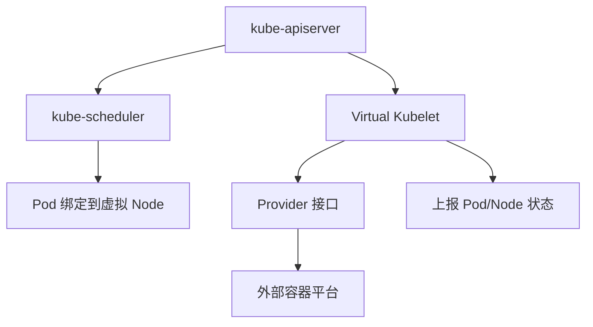
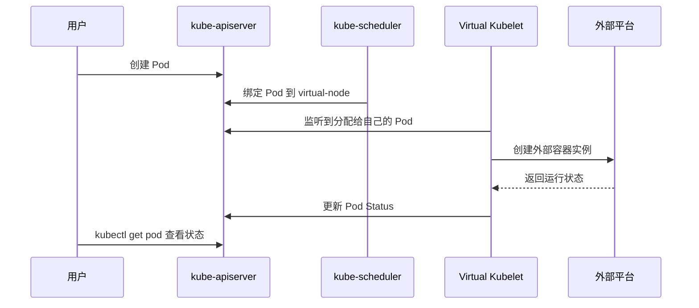

# Virtual Kubelet 是什么

## 一句话理解

Virtual Kubelet 是一种“伪装成 kubelet 的适配层”。它会向 Kubernetes 集群注册一个看起来像普通 Node 的虚拟节点，但它自己并不在这台节点上启动容器，而是把 Pod 的创建、删除、状态查询等操作转发给外部计算平台。

换句话说：

> 普通 kubelet 管理真实机器上的容器运行时；Virtual Kubelet 管理外部平台上的容器资源。

这个外部平台可以是 Serverless 容器服务、云厂商的弹性容器实例、边缘节点平台、批处理平台，或者任何实现了 Virtual Kubelet provider 接口的系统。

## 为什么会有 Virtual Kubelet

在标准 Kubernetes 集群中，每个 Node 上都会运行一个 kubelet。kubelet 的核心职责包括：

1. 向 apiserver 注册 Node。
2. 监听被调度到本节点的 Pod。
3. 调用容器运行时创建容器。
4. 上报 Pod、容器、Node 的状态。
5. 提供日志、exec、attach、metrics 等能力。

这种模型要求集群里必须有真实的 worker node。你要扩容集群，就要增加机器或虚拟机；你要维护集群，就要关心节点操作系统、容器运行时、网络插件、磁盘、内核参数等基础设施细节。

Virtual Kubelet 解决的是另一类问题：如果我不想维护真实节点，但又想继续使用 Kubernetes 的 API、调度器、Deployment、Job、Service 等抽象，能不能把 Pod 跑到外部平台？

答案就是：让外部平台“看起来像” Kubernetes 的一个节点。

## 核心架构

Virtual Kubelet 通常以一个进程运行在集群内或集群外。它会向 Kubernetes 注册一个 Node 对象，例如 `virtual-node`。调度器看到这个 Node 后，就可以把满足条件的 Pod 调度过去。

整体结构如下：



更具体一点：

1. Virtual Kubelet 启动后向 apiserver 注册一个虚拟 Node。
2. 用户创建 Pod、Deployment、Job 等资源。
3. kube-scheduler 根据 `nodeSelector`、`nodeAffinity`、`tolerations` 等规则，把 Pod 调度到这个虚拟 Node。
4. Virtual Kubelet 监听到分配给自己的 Pod。
5. Virtual Kubelet 调用 provider，把 Pod 转换成外部平台能理解的容器创建请求。
6. 外部平台实际运行容器。
7. Virtual Kubelet 定期查询外部平台，并把 Pod 状态回写到 Kubernetes。

这里最关键的一点是：Kubernetes 控制面并不知道后端到底是一台机器、一个 Serverless 容器平台，还是其他执行系统。它只看到一个符合 kubelet 行为的 Node。

## Virtual Kubelet 和 kubelet 的区别

| 对比项 | kubelet | Virtual Kubelet |
| --- | --- | --- |
| 运行位置 | 每台真实 Node 上 | 通常作为独立进程运行 |
| 管理对象 | 本机上的容器运行时 | 外部平台上的容器资源 |
| 是否需要真实节点 | 需要 | 不一定需要 |
| 容器创建方式 | 调用 CRI，例如 containerd | 调用 provider，例如云厂商 API |
| 网络模型 | 依赖 CNI | 依赖 provider 的实现 |
| 存储能力 | 支持标准 Kubernetes volume 能力 | 取决于 provider |
| 主机能力 | 支持 hostPath、hostNetwork、DaemonSet 等 | 通常不支持或支持有限 |
| 典型场景 | 常规 Kubernetes 工作负载 | 弹性突增、Serverless 容器、外部算力接入 |

可以把 kubelet 理解成“本地执行器”，把 Virtual Kubelet 理解成“远程执行器适配器”。

## 调度是怎么发生的

Virtual Kubelet 本身不负责调度。调度仍然由 Kubernetes scheduler 完成。

为了避免普通 Pod 被误调度到虚拟节点，Virtual Kubelet 注册的 Node 通常会带有特殊的 label 和 taint。只有明确声明要使用虚拟节点的 Pod，才会被调度过去。

一个简化示例：

```yaml
apiVersion: v1
kind: Pod
metadata:
  name: vk-demo
spec:
  nodeSelector:
    type: virtual-kubelet
  tolerations:
    - key: virtual-kubelet.io/provider
      operator: Exists
      effect: NoSchedule
  containers:
    - name: nginx
      image: nginx:1.25
      resources:
        requests:
          cpu: "250m"
          memory: "256Mi"
        limits:
          cpu: "500m"
          memory: "512Mi"
```

这里的含义是：

1. `nodeSelector` 要求 Pod 只能调度到带有 `type=virtual-kubelet` 标签的节点。
2. `tolerations` 允许 Pod 容忍虚拟节点上的 `NoSchedule` taint。
3. 调度器完成绑定后，Virtual Kubelet 负责接手后续 Pod 生命周期。

实际环境里的 label 和 taint 名称取决于具体安装方式和 provider 配置，不一定与上面的示例完全一致。

## Pod 生命周期

一个 Pod 被调度到虚拟节点后，大致会经历下面的流程：



从用户视角看，Pod 仍然是 Kubernetes Pod：

```bash
kubectl get pods -o wide
```

可能看到类似结果：

```text
NAME      READY   STATUS    RESTARTS   AGE   IP           NODE
vk-demo   1/1     Running   0          30s   10.0.1.23    virtual-node
```

但这个 Pod 并不是运行在传统 worker node 上，而是运行在 Virtual Kubelet 背后的外部平台里。

## 适合什么场景

### 1. 弹性突增

当集群内真实节点资源不足时，可以把部分无状态任务调度到虚拟节点，由外部 Serverless 容器平台承接突发流量。

这种模式的好处是不用提前准备大量空闲机器，适合流量峰谷明显的业务。

### 2. 批处理任务

Job、CronJob、临时计算任务通常不需要长期占用节点。如果 provider 支持这类任务，Virtual Kubelet 可以把它们转发到更适合弹性执行的平台。

### 3. 隔离型工作负载

一些任务希望和主集群 worker node 隔离，例如不可信任务、资源消耗不稳定的任务、临时实验任务。把它们调度到虚拟节点，可以减少对主节点池的影响。

### 4. 接入非 Kubernetes 计算平台

如果公司内部已经有一套容器执行平台、边缘计算平台或批处理平台，可以通过 Virtual Kubelet provider 把它接入 Kubernetes，让用户继续使用熟悉的 Kubernetes API。

## 不适合什么场景

Virtual Kubelet 不是完整 kubelet 的 100% 替代品。它的能力强依赖于 provider，通常不适合下面这些场景：

1. **强依赖宿主机能力的 Pod**
   - `hostPath`
   - `hostNetwork`
   - `hostPID`
   - `privileged` 容器
   - 设备插件，例如 GPU、RDMA

2. **DaemonSet**
   DaemonSet 的语义是“每个真实节点运行一个 Pod”。虚拟节点背后没有传统意义上的宿主机，所以 DaemonSet 通常没有意义，或者行为受限。

3. **复杂网络需求**
   Service、Pod IP、NetworkPolicy、Ingress 等能力是否完整可用，取决于外部平台如何接入集群网络。

4. **复杂存储需求**
   PVC、CSI、本地盘、挂载传播等能力通常不是默认就能完整支持，要看 provider 的实现。

5. **强依赖本地调试能力**
   `kubectl logs`、`kubectl exec`、`kubectl attach`、metrics 等能力可能支持不完整，排障方式也可能和普通节点不同。

## 和 Cluster Autoscaler 的区别

Virtual Kubelet 和 Cluster Autoscaler 都可以解决资源不足的问题，但思路不同。

| 对比项 | Cluster Autoscaler | Virtual Kubelet |
| --- | --- | --- |
| 扩容对象 | 真实 Node | 虚拟 Node 背后的外部平台 |
| 扩容方式 | 增加 VM/物理机 | 创建外部容器实例 |
| 启动速度 | 取决于节点启动速度 | 通常更快，但取决于 provider |
| 兼容性 | 接近普通 Kubernetes 节点 | provider 相关 |
| 运维成本 | 仍需维护节点池 | 节点运维成本更低 |

如果业务需要完整 Kubernetes 节点能力，Cluster Autoscaler 更合适；如果业务是无状态、短生命周期、对宿主机能力依赖少的任务，Virtual Kubelet 可能更合适。

## 和 Serverless Kubernetes 的关系

很多云厂商的 Serverless Kubernetes 产品，本质上也是想让用户不再关心节点，只关心 Pod 或工作负载。

Virtual Kubelet 是实现这种体验的一种方式：它把外部 Serverless 容器资源抽象成 Kubernetes Node。用户仍然提交 Pod，仍然使用 Deployment、Job、HPA 等 Kubernetes 对象，但底层不再一定是传统 worker node。

不过要注意，不是所有 Serverless Kubernetes 产品都使用 Virtual Kubelet 实现。它们可能使用自研调度器、控制器、沙箱运行时或其他架构。判断一个平台能力时，不应该只看它是否叫 Virtual Kubelet，而应该看它对 Kubernetes API 的兼容范围。

## HPA 能不能配合 Virtual Kubelet

可以，但要满足前提。

HPA 负责根据指标调整 Deployment、ReplicaSet 等对象的副本数。副本数增加后，新 Pod 仍然由 scheduler 调度。如果这些 Pod 的调度规则指向虚拟节点，那么扩出来的副本就可以由 Virtual Kubelet 接管。

需要注意的是：

1. HPA 需要 Metrics API 或自定义指标可用。
2. provider 需要能正确上报 Pod 资源使用情况，或者你需要使用外部指标。
3. 外部平台本身也要有足够配额。
4. 冷启动时间会影响扩容效果。

所以 HPA + Virtual Kubelet 是可行组合，但生产使用前必须压测扩容延迟和指标链路。

## 生产使用建议

1. **把虚拟节点当成独立节点池**
   使用明确的 label、taint、toleration 和 node affinity，把哪些工作负载能去虚拟节点控制清楚。

2. **优先放无状态任务**
   无状态 Deployment、Job、CronJob 更适合。强依赖本地磁盘、宿主机网络或特权能力的任务不要轻易迁移。

3. **显式声明 requests 和 limits**
   外部平台通常按资源规格创建实例。资源声明不清晰，会导致调度、计费和稳定性都变差。

4. **提前验证网络路径**
   包括 Pod 到 Service、Service 到 Pod、Pod 到外部依赖、DNS、Ingress、NetworkPolicy 等链路。

5. **确认日志和排障能力**
   至少要验证 `kubectl logs`、事件、Pod status、外部平台日志、失败原因回写是否可用。

6. **关注配额和冷启动**
   虚拟节点看起来容量很大，但真实限制通常在外部平台的账号配额、地域配额、镜像拉取速度和容器启动速度上。

7. **不要假设所有 Kubernetes 特性都支持**
   每个 provider 的实现范围不同，上线前应该维护一份兼容性清单。

## 总结

Virtual Kubelet 的核心价值是：把 Kubernetes 的工作负载 API 扩展到传统 worker node 之外。

它通过注册一个虚拟 Node，让 Kubernetes scheduler 可以把 Pod 调度到这个节点；然后它再通过 provider 把 Pod 生命周期操作转发给外部平台。这样用户仍然使用 Kubernetes 的声明式 API，而底层计算资源可以来自 Serverless 容器、边缘平台、批处理系统或其他外部执行环境。

但它不是普通 kubelet 的完全替代品。Virtual Kubelet 更适合无状态、短生命周期、弹性突增、对宿主机能力依赖少的工作负载。对于网络、存储、调试、监控、安全和 Kubernetes API 兼容性要求高的业务，需要结合具体 provider 做充分验证。