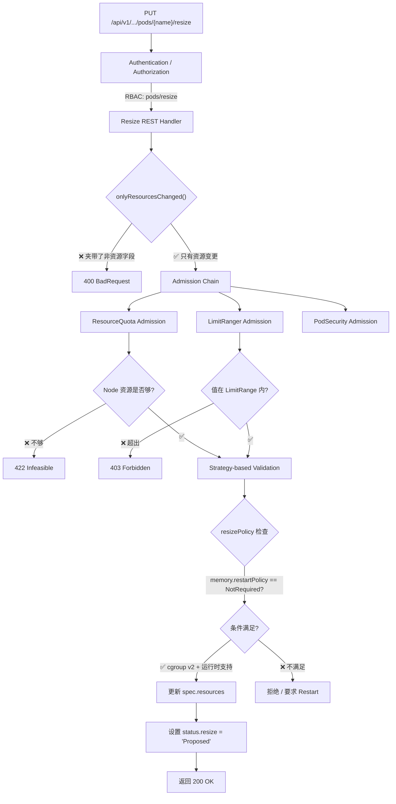
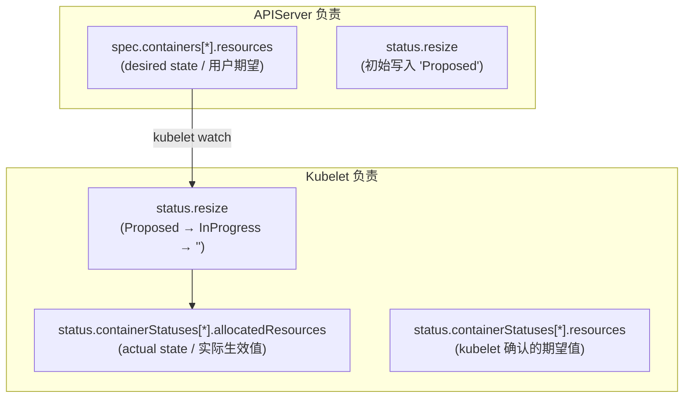
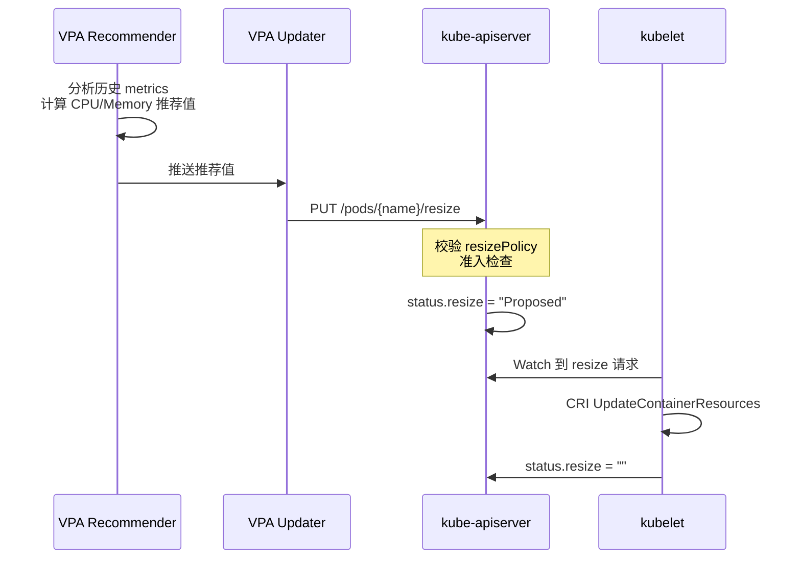

# Kubernetes Resize Subresource 与内存原地调整详解

## 背景：为什么需要专门的 Resize 子资源

Kubernetes 的 Pod 资源原地调整（In-place Resource Resize，KEP-1287）从 1.28 开始 GA。但很多人只关注到 "Pod 可以不重启调 CPU/内存" 这个结果，忽略了实现这个能力的关键设计：**Resize Subresource**。

简单回顾一下问题：在早期 Kubernetes 中，Pod 的 `spec` 一经创建就不可变。要改容器的 CPU 或 memory，只能重建 Pod。这带来了 IP 变化、连接断开、缓存丢失等一系列问题。

社区要解决的不只是 "技术上能不能在线改 cgroup"，更重要的是 **如何在 API 层面安全、可控地允许 Pod 资源变更**。直接放开 `spec.containers[].resources` 的可变性会带来几个严重问题：

1. **安全问题**：如果 Pod spec 可以随意 PATCH，任何有 Pod write 权限的角色都能改资源，不受控。
2. **校验混乱**：资源修改和其他 spec 字段修改混在一起，校验逻辑难以隔离。
3. **状态追踪**：没有专门的机制来追踪一次资源调整从"发起"到"完成"的全过程。

因此，KEP-1287 的设计者做了一个关键决定：**为 Pod 引入一个全新的 `/resize` 子资源**，专门负责资源的原地调整。

本文将以 **Resize Subresource 的设计与实现** 为主线，以**内存（memory）调整**为具体场景，深入剖析整个机制。

## 一、Resize Subresource 是什么

### 1.1 API 定义

Resize Subresource 是 Pod 的一个独立 REST 端点：

```text
PUT /api/v1/namespaces/{namespace}/pods/{name}/resize
```

这不是一个虚拟概念，而是 Kubernetes API 中真实注册的子资源（subresource），和 `/status`、`/exec`、`/log` 处于同一层级。

```go
// staging/src/k8s.io/api/core/v1/register.go 中注册的 Pod 子资源
func addKnownTypes(scheme *runtime.Scheme) error {
    // ...其它注册...
    // Pod 的 /resize 子资源
    // Pod 的 /status 子资源
    // Pod 的 /exec 子资源
    // ...
}
```

在 APIServer 内部，Resize 子资源有自己独立的 **REST handler**、**admission 链** 和 **validation 逻辑**，与 Pod 主资源的 handler 完全隔离。

### 1.2 为什么必须是子资源而不是放通 spec？

这是一个经典的设计权衡，答案有三层：

**第一层：RBAC 隔离**

```yaml
# 允许修改 Pod 的资源，但不允许修改其它 spec 字段（如镜像、命令等）
apiVersion: rbac.authorization.k8s.io/v1
kind: Role
metadata:
  name: pod-resizer
rules:
- apiGroups: [""]
  resources: ["pods/resize"]   # ← 只授权 resize 子资源
  verbs: ["update", "patch"]
```

如果资源修改直接走 Pod 主资源的 PATCH，RBAC 只能做全有或全无的控制——要么能改资源也能改镜像，要么都不能改。

**第二层：校验隔离**

Resize Subresource 有自己的 admission 和 validation 逻辑。它只允许修改 `spec.containers[].resources`，任何试图在 resize 请求中夹带镜像、环境变量、volume 等其它字段变更的行为都会被明确拒绝。这种"白名单"式校验比在主资源 handler 里做 `if` 判断要安全得多。

**第三层：状态机驱动**

资源调整不是瞬间完成的——从用户发起请求到 kubelet 完成 cgroup 更新，中间有一个异步过程。Resize Subresource 配合 `status.resize` 字段形成了一个完整的状态机，让这个异步过程可观测、可追踪、可恢复。

### 1.3 请求体约束

对 Resize Subresource 的请求体有严格的格式限制——**只能包含 `spec.containers[].resources`**：

```json
// ✅ 合法的 resize 请求体
{
  "spec": {
    "containers": [
      {
        "name": "app",
        "resources": {
          "requests": {"memory": "4Gi"},
          "limits": {"memory": "4Gi"}
        }
      }
    ]
  }
}
```

```json
// ❌ 非法的 resize 请求体 — 夹带了非资源字段
{
  "spec": {
    "containers": [
      {
        "name": "app",
        "image": "nginx:new",           // ← 会被 Reject
        "resources": {
          "requests": {"memory": "4Gi"},
          "limits": {"memory": "4Gi"}
        }
      }
    ]
  }
}
```

APIServer 在 resize REST handler 中会做如下校验（源码级逻辑）：

```go
// staging/src/k8s.io/apiserver/pkg/endpoints/handlers/patch.go (简化)
func (r *PodResizeREST) Update(ctx context.Context, name string, 
    objInfo rest.UpdatedObjectInfo, ...) (runtime.Object, bool, error) {
    
    // 1. 获取旧 Pod
    oldPod, _ := r.store.Get(ctx, name, &metav1.GetOptions{})
    
    // 2. 应用 resize 请求 → 生成新 Pod
    newPod, _ := objInfo.UpdatedObject(ctx, oldPod)
    
    // 3. 校验：只允许变更 spec.containers[].resources
    if !onlyResourcesChanged(oldPod, newPod) {
        return nil, false, errors.NewBadRequest(
            "only updates to spec.containers[*].resources are allowed via /resize")
    }
    
    // 4. 继续 admission + validation...
}
```

这个校验函数 `onlyResourcesChanged` 会逐字段对比新旧 Pod 的 spec，确保 `containers[].resources` 之外的所有字段都完全一致。

## 二、Resize Subresource 对内存调整的校验链路

当用户通过 Resize Subresource 调整内存时，请求要经过一条完整的校验链。以下是 APIServer 内部的完整处理流程：



### 2.1 内存专项校验

Resize Subresource 对内存（memory）有额外的校验逻辑：

**校验 1：内存值合法性**

```go
// 内存必须以 Kubernetes 认可的格式表示
// ✅ 合法: "128974848", "129e6", "129M", "128974848000m", "123Mi"
// ❌ 非法: "1.5Gi" (K8s 1.30+ 开始支持小数，之前版本不支持)
```

**校验 2：requests ≤ limits**

```go
if newMemoryRequest.Cmp(newMemoryLimit) > 0 {
    return fmt.Errorf("memory request %s exceeds limit %s", 
        newMemoryRequest.String(), newMemoryLimit.String())
}
```

**校验 3：ResizePolicy 与节点条件匹配**

```go
func validateMemoryResize(pod *v1.Pod, container v1.Container) error {
    // 查找 memory 的 resizePolicy
    policy := findResizePolicy(container.ResizePolicy, v1.ResourceMemory)
    
    if policy.RestartPolicy == v1.NotRequired {
        // 检查节点是否支持 NotRequired 内存调整
        // 前提：cgroup v2 + 容器运行时支持 UpdateContainerResources
        if !nodeSupportsInPlaceMemoryResize(pod.Spec.NodeName) {
            return fmt.Errorf(
                "node does not support in-place memory resize, " +
                "set restartPolicy to 'Restart' or upgrade node")
        }
    }
    return nil
}
```

**校验 4：不下调至已用量以下（软校验）**

虽然 APIServer 不会强制拒绝下调内存，但 kubelet 在执行调整前会做安全检查。如果目标 limit 低于容器当前内存用量，kubelet 会记录一个 Warning Event，提示用户有 OOM 风险：

```text
Warning  MemoryResizeRisk  
  New memory limit (1Gi) is below current container usage (1.5Gi).
  Container may be OOM killed after resize.
```

### 2.2 内存下调的准入策略

对于**内存下调**（从大往小调），Resize Subresource 会触发额外的准入判断：

| 检查项 | 逻辑 | 失败处理 |
|--------|------|----------|
| 目标值 ≥ requests | `newLimit >= newRequest` | 400 BadRequest |
| 目标值 ≥ 0 | 非负数 | 400 BadRequest |
| 目标值格式正确 | Kubernetes resource quantity | 400 BadRequest |
| resizePolicy = NotRequired | 节点支持 cgroup v2 | Warning Event（不拒绝） |
| resizePolicy = Restart | 无条件允许，但会触发容器重启 | Accepted |
| 当前用量 > 目标 limit | — | Warning Event |

这意味着 **APIServer 不会阻止你执行危险的内存下调操作**，但会在 resize 状态中留下可观测的证据。

## 三、Resize 状态机：一次内存调整的生命周期

Resize Subresource 真正的精髓在于它驱动的**异步状态机**。一次内存调整从发起到完成，经历以下状态：

```
                      用户 PUT /resize
                           │
                           ▼
                    ┌──────────────┐
                    │   Proposed   │  ← APIServer 写入
                    └──────┬───────┘
                           │ kubelet 接受
                           ▼
                    ┌──────────────┐
                    │  InProgress  │  ← kubelet 写入
                    └──────┬───────┘
                           │ CRI update 完成
                    ┌───────┴───────┐
                    │               │
              成功  ▼          失败  ▼
            ┌──────────┐   ┌──────────────┐
            │    ""    │   │  Infeasible  │
            │ (完成)    │   │  / Deferred  │
            └──────────┘   └──────────────┘
```

### 3.1 状态字段定义

```go
// staging/src/k8s.io/api/core/v1/types.go

// PodResizeStatus 定义在 Pod.Status.Resize 上
type PodResizeStatus string

const (
    // Proposed: APIServer 已接受 resize 请求，等待 kubelet 确认
    PodResizeStatusProposed PodResizeStatus = "Proposed"
    
    // InProgress: kubelet 已接受 resize 请求，正在执行 cgroup 更新
    PodResizeStatusInProgress PodResizeStatus = "InProgress"
    
    // Deferred: kubelet 暂时无法执行 resize（如节点资源不足）
    PodResizeStatusDeferred PodResizeStatus = "Deferred"
    
    // Infeasible: resize 不可能完成（如目标资源超过节点 allocatable）
    PodResizeStatusInfeasible PodResizeStatus = "Infeasible"
    
    // "" (空字符串): 没有正在进行的 resize
)
```

### 3.2 谁写入什么？——APIServer vs Kubelet 的职责边界

这是理解 Resize Subresource 最关键的部分。APIServer 和 kubelet 分别负责不同的字段：



关键字段对比：

| 字段 | 路径 | 写入者 | 含义 |
|------|------|--------|------|
| `spec.containers[].resources` | Pod spec | 用户 (via APIServer) | 用户**期望**的资源量 |
| `status.containerStatuses[].resources` | Pod status | kubelet | kubelet **已确认**的期望值 |
| `status.containerStatuses[].allocatedResources` | Pod status | kubelet | cgroup 中**实际生效**的资源量 |
| `status.resize` | Pod status | APIServer + kubelet | resize 流程的当前状态 |

**为什么需要三个同类型的字段？**

考虑这个场景：用户通过 `/resize` 把 memory limit 从 `2Gi` 调到 `8Gi`，但节点上只剩 `4Gi` 可分配。此时：

- `spec.containers[].resources.limits.memory` = `8Gi`（用户的期望）
- `status.resize` = `"Infeasible"`（kubelet 发现节点资源不够）
- `status.containerStatuses[].allocatedResources.limits.memory` = `2Gi`（cgroup 中仍然是旧值）
- `status.containerStatuses[].resources.limits.memory` = `2Gi`（kubelet 尚未更新）

三个字段在不同时刻取值不同，共同描述了"期望 vs 实际 vs 状态"的完整画面。

### 3.3 内存调整的状态流转示例

以下是 memory 从 `2Gi` → `4Gi` 上调的完整字段变化时序：

**T0：初始状态**

```yaml
spec:
  containers:
  - name: app
    resources:
      requests: {memory: "2Gi"}
      limits:   {memory: "2Gi"}
    resizePolicy:
    - resourceName: memory
      restartPolicy: NotRequired
status:
  containerStatuses:
  - name: app
    allocatedResources:  # 实际生效值
      memory: "2Gi"
    resources:            # kubelet 确认值
      requests: {memory: "2Gi"}
      limits:   {memory: "2Gi"}
  resize: ""              # 无进行中的 resize
```

**T1：用户 PUT /resize，新的期望 memory=4Gi**

```yaml
# spec 已更新
spec:
  containers:
  - name: app
    resources:
      requests: {memory: "4Gi"}
      limits:   {memory: "4Gi"}

# status 由 APIServer 更新
status:
  resize: "Proposed"
  containerStatuses:
  - name: app
    allocatedResources: {memory: "2Gi"}   # ← 依然是旧值!
    resources: {limits: {memory: "2Gi"}}  # ← kubelet 还没确认
```

**T2：kubelet 接收 resize 请求，开始执行**

```yaml
status:
  resize: "InProgress"
  containerStatuses:
  - name: app
    allocatedResources: {memory: "2Gi"}   # cgroup 还没改
    resources: {limits: {memory: "4Gi"}}  # kubelet 已确认新的期望
```

**T3：cgroup 更新完成**

```yaml
status:
  resize: ""                    # ← 清空，表示完成
  containerStatuses:
  - name: app
    allocatedResources: {memory: "4Gi"}   # cgroup 已更新
    resources: {limits: {memory: "4Gi"}}  # 与 allocatedResources 一致
```

注意 T2 → T3 之间的时间窗口通常只有几十毫秒（cgroup 文件写入非常快），但在高负载节点上可能更长。

## 四、kubelet 中的 Memory Resize 执行逻辑

当 kubelet 在 syncPod 循环中检测到 `status.resize == "Proposed"` 且 spec 的资源与 allocatedResources 不一致时，进入以下逻辑。

### 4.1 kubelet 的处理函数

```go
// pkg/kubelet/kubelet.go (简化后的核心流程)
func (kl *Kubelet) computePodResize(pod *v1.Pod, podStatus *kubecontainer.PodStatus) {
    
    for _, container := range pod.Spec.Containers {
        // 1. 找到容器在 status 中的对应项
        cs, found := findContainerStatus(pod, container.Name)
        if !found { continue }
        
        // 2. 比较 spec.desired vs status.allocated
        desired := container.Resources
        current := cs.AllocatedResources
        
        if resourceListEqual(desired.Requests, current) &&
           resourceListEqual(desired.Limits, current) {
            continue // 没有变化
        }
        
        // 3. 获取内存相关的 resizePolicy
        memPolicy := getResizePolicy(container.ResizePolicy, v1.ResourceMemory)
        
        // 4. 如果内存的 restartPolicy 是 Restart
        if memPolicy != nil && memPolicy.RestartPolicy == v1.RestartContainer {
            // 不在这里处理：标记容器需要重启
            // 后续在 killContainer + startContainer 时才更新资源
            podShouldRestart = true
            continue
        }
        
        // 5. 如果是 NotRequired → 走 CRI UpdateContainerResources
        // 只更新那些与当前 allocatedResources 不同的资源
        resourcesToUpdate := computeResourceDelta(desired, current)
        
        if hasMemoryChange(resourcesToUpdate) {
            // 安全检查：当前内存用量 vs 新 limit
            if shouldWarnAboutMemoryResize(container.ID, resourcesToUpdate.Memory) {
                kl.recorder.Eventf(pod, v1.EventTypeWarning, 
                    "MemoryResizeRisk",
                    "New memory limit (%s) is below current usage",
                    resourcesToUpdate.Memory.Limit)
            }
        }
        
        // 6. 调用 CRI
        err := kl.containerRuntime.UpdateContainerResources(
            container.ID,
            convertToCRIResources(resourcesToUpdate),
        )
        if err != nil {
            // 失败处理...
            pod.Status.Resize = v1.PodResizeStatusInfeasible
            return
        }
    }
}
```

### 4.2 内存调整通过 CRI 到 cgroup 的链路

kubelet 最终通过 CRI gRPC 的 `UpdateContainerResources` 接口传递资源变更。对于内存（memory），关键字段是 `memory_limit_in_bytes`：

```protobuf
// CRI API: k8s.io/cri-api/pkg/apis/runtime/v1/api.proto
message LinuxContainerResources {
    int64 cpu_period = 1;
    int64 cpu_quota = 2;
    int64 cpu_shares = 3;
    int64 memory_limit_in_bytes = 4;         // ← 内存硬限制
    int64 oom_score_adj = 5;
    string cpuset_cpus = 6;
    string cpuset_mems = 7;
    repeated HugepageLimit hugepage_limits = 8;
    // cgroup v2 新增
    int64 memory_swap_limit_in_bytes = 9;    // ← swap 限制
    int64 memory_min = 10;                   // ← 内存保护（对应 requests）
}
```

containerd 收到后调用 runc：

```go
// containerd 内部路径
// criService.UpdateContainerResources()
//   → container.Task.Update()
//     → runc --update <container-id>
//       → write to /sys/fs/cgroup/.../memory.max
```

最终在 Linux 层面的操作极为简单——就是一次文件写入：

```bash
# cgroup v2: 写入一个 int64 到 memory.max
echo 4294967296 > /sys/fs/cgroup/kubepods.slice/.../memory.max  # = 4GiB
```

整个过程容器进程无需任何配合。这也是 `NotRequired` 策略能工作的根本原因：cgroup 是内核级的强制约束，对进程完全透明。

## 五、cgroup v1 与 v2 对内存调整的差异

前文提到 in-place memory resize 强依赖 cgroup v2。这里从 Resize Subresource 的角度具体说明 why。

### 5.1 cgroup 版本如何影响 Resize 行为

| 场景 | cgroup v1 | cgroup v2 |
|------|-----------|-----------|
| Memory 上调 | `memory.limit_in_bytes` 写入新值，大多可行 | `memory.max` 写入新值，原生支持 ✅ |
| Memory 下调 | `memory.limit_in_bytes` 写入**可能失败**（内核拒绝下调已使用的限制）| `memory.max` 写入新值，**无论当前用量**，内核立即执行 ✅ |
| 是否需要容器重启 | 内存下调需重启 | 上调下调均不需要 ✅ |
| ResizePolicy 要求 | memory 必须设为 `Restart` | memory 可设为 `NotRequired` ✅ |

### 5.2 cgroup v1 下调内存为什么失败？

cgroup v1 的 memory 控制器在内核中的实现不允许将 `memory.limit_in_bytes` 下调到低于 `memory.usage_in_bytes` 的值。内核会返回 `EBUSY`：

```bash
# cgroup v1: 下调内存到已用量以下 → 失败
echo 1073741824 > /sys/fs/cgroup/memory/.../memory.limit_in_bytes
# bash: echo: write error: Device or resource busy
```

即使容器当前用量低于新 limit，cgroup v1 对已使用的内存页回收机制也不如 v2 可靠。这就是为什么在 cgroup v1 上，memory 的 resizePolicy 必须设为 `Restart`——只有重建容器（创建新 cgroup）才能安全地应用新限制。

### 5.3 生产环境检查清单

```bash
# 1. 确认 cgroup 版本
stat -fc %T /sys/fs/cgroup/
# cgroup2fs → 可以使用 NotRequired
# tmpfs     → 必须使用 Restart（内存下调不安全）

# 2. 确认内核版本
uname -r
# >= 5.8 → cgroup v2 基本可用
# >= 5.15 → 推荐（内存控制器更成熟）

# 3. 确认容器运行时
crictl info | jq '.config.cgroupDriver'
# "systemd" → cgroup v2 的 systemd 驱动
```

## 六、实战：通过 Resize Subresource 调整内存

### 6.1 直接调用 Resize API

虽然 `kubectl patch` 在某些条件下也会走 Resize 子资源，但最明确的方式是直接调用：

```bash
# 直接调用 Pod 的 /resize 子资源
kubectl proxy --port=8080 &
# 或者用 kubectl --raw

# 上调内存
kubectl patch pod mem-resize-demo --subresource='resize' \
  --type='merge' -p='{
  "spec": {
    "containers": [{
      "name": "app",
      "resources": {
        "requests": {"memory": "1Gi"},
        "limits": {"memory": "1Gi"}
      }
    }]
  }
}'
```

### 6.2 完整的端到端示例

**Step 1: 创建一个支持内存原地调整的 Pod**

```yaml
apiVersion: v1
kind: Pod
metadata:
  name: mem-resize-demo
spec:
  containers:
  - name: app
    image: python:3.11-slim
    command: ["python3", "-c"]
    args:
    - |
      import time
      data = []
      while True:
          try:
              data.append(bytearray(50 * 1024 * 1024))
              print(f"Allocated {len(data) * 50}MB")
          except MemoryError:
              print("OOM!")
          time.sleep(5)
    resources:
      requests: {memory: "256Mi"}
      limits:   {memory: "512Mi"}
    resizePolicy:
    - resourceName: memory
      restartPolicy: NotRequired
    - resourceName: cpu
      restartPolicy: NotRequired
```

**Step 2: 通过 /resize 子资源上调内存**

```bash
kubectl apply -f pod.yaml

# 通过 subresource 调整
kubectl patch pod mem-resize-demo --subresource='resize' \
  --type='merge' -p='{
  "spec": {
    "containers": [{
      "name": "app",
      "resources": {
        "requests": {"memory": "512Mi"},
        "limits":   {"memory": "1Gi"}
      }
    }]
  }
}'
```

**Step 3: 实时监控 resize 状态**

```bash
# 终端 1：观察 resize 状态机
watch -n 0.5 '
kubectl get pod mem-resize-demo \
  -o jsonpath="Resize: {.status.resize}" && echo "" && \
kubectl get pod mem-resize-demo \
  -o jsonpath="Allocated: {.status.containerStatuses[0].allocatedResources.memory}" && echo "" && \
kubectl get pod mem-resize-demo \
  -o jsonpath="Restarts: {.status.containerStatuses[0].restartCount}"
'
# 你会看到:
# Resize: Proposed → InProgress → ""
# Allocated: 512Mi → 1Gi
# Restarts: 0 (始终为 0!)
```

**Step 4: 验证 cgroup 已更新**

```bash
# 在 Pod 所在节点上
POD_UID=$(kubectl get pod mem-resize-demo -o jsonpath='{.metadata.uid}')
CGROUP_PATH=$(find /sys/fs/cgroup -name "*${POD_UID}*" -type d 2>/dev/null | head -1)

cat ${CGROUP_PATH}/memory.max
# 1073741824 (= 1GiB) ✅ 已生效
```

### 6.3 调试：当 Resize 出问题时查什么？

```bash
# 1. 查 resize 状态是否卡在某一步
kubectl get pod <pod> -o jsonpath='{.status.resize}'

# 2. 如果状态为 Infeasible，查 kubelet 日志
journalctl -u kubelet --since "5 min ago" | grep -i resize

# 3. 对比 spec vs allocatedResources，看差距在哪
diff <(kubectl get pod <pod> -o jsonpath='{.spec.containers[0].resources}') \
     <(kubectl get pod <pod> -o jsonpath='{.status.containerStatuses[0].allocatedResources}')

# 4. 查 eventos
kubectl describe pod <pod> | grep -A5 -i resize

# 5. 确认 Pod 是否真的用了 cgroup v2
kubectl exec <pod> -- cat /sys/fs/cgroup/memory.max 2>/dev/null && echo "cgroup v2" || echo "cgroup v1"
```

## 七、Resize Subresource 对 QoS 的影响

使用 Resize Subresource 调整资源会改变 Pod 的 QoS 等级，且这一变更在 resize 完成后立即生效：

| 原 QoS | Resize 操作 | 新 QoS | 驱逐优先级变化 |
|--------|------------|--------|---------------|
| Guaranteed | 只上调 CPU/Memory | Guaranteed | 不变 |
| Guaranteed | 下调至不满足 Guaranteed 条件 | Burstable | ⬇️ 降低 |
| Burstable | 上调至满足 Guaranteed 条件 | Guaranteed | ⬆️ 提升 |
| Burstable | 调整但保持 Burstable | Burstable | 不变 |
| BestEffort | 添加 requests/limits | Burstable 或 Guaranteed | ⬆️ 提升 |

QoS 变更在 kubelet 下一次 status 更新时生效。特别要注意：**从上往下调内存可能同时降低 QoS 等级**，这会增加 Pod 在节点资源紧张时被驱逐的概率。

## 八、ResizePolicy 选择指南：Restart vs NotRequired（内存专项）

这是使用 Resize Subresource 时必须做的抉择。对内存资源（memory）：

| 应用类型 | 推荐策略 | 原因 |
|---------|---------|------|
| Java (JVM) / Go (GC) | `NotRequired` | GC 能感知 cgroup memory limit 并自适应堆大小 |
| Python / Node.js | `NotRequired` | 通常没有预分配的大内存池 |
| C/C++ 自定义内存池（如 jemalloc pool） | `Restart` | 内存池在启动时按 limit 预分配，运行时无法缩容 |
| MySQL / PostgreSQL | `Restart` | `innodb_buffer_pool_size` / `shared_buffers` 在启动时固定 |
| Redis | `Restart` | `maxmemory` 由配置控制，cgroup 变化不会触发 Redis 主动回收 |
| Envoy / Nginx | `NotRequired` | 内存用量相对固定且小，调整风险低 |

**决策原则**：应用是否在启动时按 limit 预先分配了大量内存？是 → `Restart`；否 → `NotRequired`。

## 九、Resize Subresource 与 VPA 的集成

VPA（Vertical Pod Autoscaler）是 Resize Subresource 的核心消费者。VPA Updater 会直接调用 Pod 的 `/resize` 子资源来实施推荐值：



关键配置：

```yaml
apiVersion: autoscaling.k8s.io/v1
kind: VerticalPodAutoscaler
metadata:
  name: my-app-vpa
spec:
  targetRef:
    apiVersion: apps/v1
    kind: Deployment
    name: my-app
  updatePolicy:
    updateMode: Auto      # VPA 自动执行 resize
  resourcePolicy:
    containerPolicies:
    - containerName: app
      controlledResources: ["cpu", "memory"]
      controlledValues: RequestsAndLimits
      minAllowed:
        memory: "256Mi"     # VPA 不会调到低于此值
      maxAllowed:
        memory: "8Gi"       # VPA 不会调到高于此值
```

当 Pod 的 `resizePolicy.memory = NotRequired` 时，VPA 的内存调整是无重启的；当设为 `Restart` 时，VPA 的调整会触发容器重启。

## 十、限制与注意事项

### 10.1 只能调整 CPU 和 Memory

当前 (v1.32) Resize Subresource 只接受这两个资源名。以下资源**不能**通过 `/resize` 调整：

- `ephemeral-storage`
- `hugepages-*`
- 扩展资源（`nvidia.com/gpu` 等）
- `claims`（动态资源分配）

### 10.2 内存下调的风险

下调内存限制时，如果容器当前用量超过新 limit，cgroup v2 会立即触发 OOM。这不是 Kubernetes 的 bug，而是 Linux 内存管理的基本行为。

### 10.3 与 HPA 的交互

- HPA 基于 metrics 触发副本数变化（水平扩缩）。
- Resize Subresource 改变单个 Pod 的资源量（垂直扩缩）。
- 二者同时作用于同一 workload 时，可能互相干扰（例如 resize 改变 metrics 基准，触发意外缩容）。
- **建议**：HPA + VPA(in-place) 不作用于同一 workload，除非你清楚交互逻辑。

### 10.4 容器运行时兼容性

| 运行时 | UpdateContainerResources 支持 |
|--------|------------------------------|
| containerd >= 1.6 | ✅ 完整支持 |
| CRI-O >= 1.25 | ✅ 完整支持 |
| Docker (dockershim) | ❌ 已从 K8s 移除 |

### 10.5 Resize 状态的一致性问题

kubelet 重启时可能丢失 resize 进度。例如：
- `status.resize = "InProgress"` 时 kubelet 重启。
- kubelet 重启后看到 `spec.resources != allocatedResources`，但 `status.resize` 可能是旧值。
- kubelet 会重新执行完整的 resize 流程（幂等性由 CRI UpdateContainerResources 保证）。

## 总结

Resize Subresource 是 Kubernetes 面向**垂直弹性**的核心 API 设计。它的关键设计决策值得反复理解：

1. **独立子资源** → RBAC 隔离，只授权资源调整而不放开整个 Pod spec。
2. **状态机驱动** → `status.resize` 让异步调整过程可观测、可追踪。
3. **字段三件套** → `spec.resources`（期望）、`status.resources`（确认）、`status.allocatedResources`（实际），完整描述调整全貌。
4. **cgroup 透明性** → 内存调整本质上是内核级操作，容器进程零感知。

对于运行在 cgroup v2 + Kubernetes 1.28+ 环境中的业务，通过 Resize Subresource 实现内存的无重启动态调整，已经是生产可用的成熟能力。
