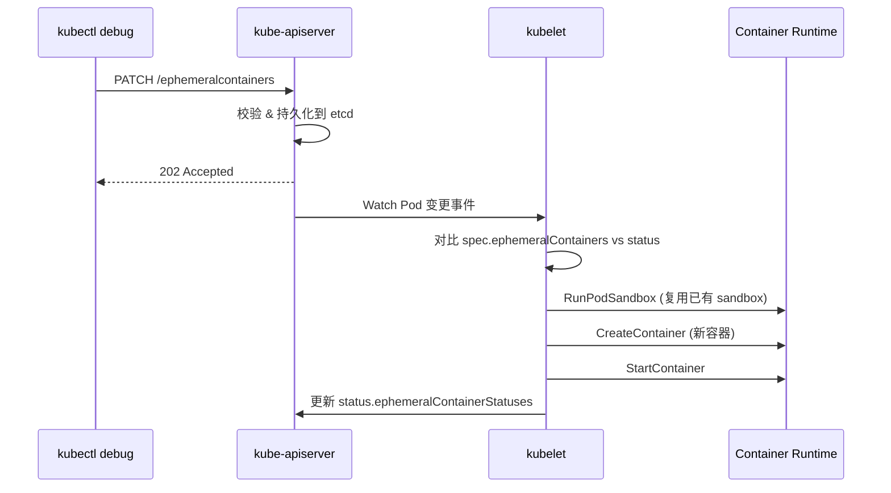
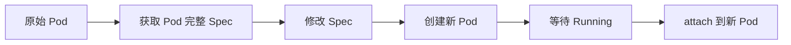
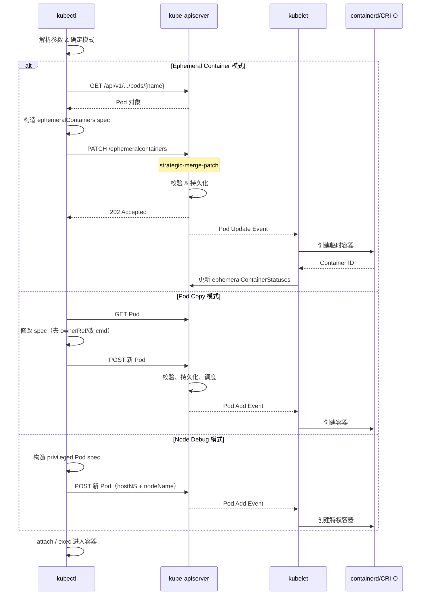
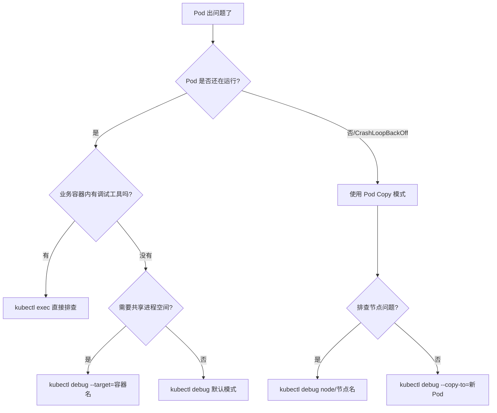

# kubectl debug 原理详解

## 一、什么是 kubectl debug

`kubectl debug` 是 Kubernetes 从 v1.18 引入（v1.20 beta、v1.23 GA）的调试命令。在它出现之前，排查 Pod 问题通常面临一个尴尬的局面：业务镜像为了体积和安全，往往只包含最小运行时（如 distroless、scratch），连 `curl`、`ps`、`tcpdump` 等基础排障工具都没有。运维人员要么重新构建包含调试工具的镜像，要么 exec 进去却什么也干不了。

`kubectl debug` 从根本上解决了这个问题，提供了三种调试模式：

| 模式 | 命令示例 | 适用场景 |
|------|----------|----------|
| **Ephemeral Container**（动态注入） | `kubectl debug -it <pod> --image=busybox --target=<container>` | 运行中的 Pod 无法修改，需要一个临时容器进去排查 |
| **Pod Copy**（副本调试） | `kubectl debug <pod> --copy-to=debug-pod --share-pid -- bash` | 需要修改 Pod 启动命令、更换镜像来复现问题 |
| **Node Debug**（节点调试） | `kubectl debug node/<node> -it --image=busybox` | 排查节点级别的文件系统、进程、网络问题 |

下面我们从底层原理逐一分析。

## 二、核心机制一：Ephemeral Container（临时容器）

### 2.1 为什么需要 Ephemeral Container

Pod 是 Kubernetes 中的最小调度单位，一旦 Pod 被创建，其 `.spec.containers` 字段就**不可变**。你无法在运行时向 Pod 添加一个常规容器。这是 kube-apiserver 在 Pod 对象的 schema 校验层面强制执行的设计约束。

Ephemeral Container 另辟蹊径——它不走 `.spec.containers`，而是走 Pod 的一个**独立子资源** `/ephemeralcontainers`，在 `PodStatus` 中声明。这意味着：

1. **不走 Pod spec 校验**：不需要修改不可变的 `.spec.containers` 字段
2. **不参与调度**：不会触发调度器重新调度 Pod
3. **不保证资源**：不能为 Ephemeral Container 设置 `resources.requests/limits`，它"借用" Pod 所在的节点剩余资源
4. **不会被重启**：即使退出，kubelet 也不会尝试重启它
5. **不体现在 Pod spec 中**：`kubectl get pod -o yaml` 在顶层 spec 里看不到它

### 2.2 API 层面的实现

Ephemeral Container 是 Pod 的一个子资源 `/api/v1/namespaces/{ns}/pods/{name}/ephemeralcontainers`。

```text
# 等效于 kubectl debug 所调用的 API
PATCH /api/v1/namespaces/default/pods/my-pod/ephemeralcontainers
Content-Type: application/strategic-merge-patch+json

{
  "spec": {
    "ephemeralContainers": [
      {
        "name": "debug-abc123",
        "image": "busybox:latest",
        "command": ["sh"],
        "targetContainerName": "my-app",
        "stdin": true,
        "tty": true
      }
    ]
  }
}
```

关键点：
- 这是一个 **PATCH** 操作，不是 PUT/POST——意味着它可以增量添加到已存在的 Ephemeral Container 列表
- 用 `strategic-merge-patch+json` 作为 Content-Type
- Ephemeral Container 被附加到 `spec.ephemeralContainers[]` 后，kubelet 会将其写入 `status.ephemeralContainerStatuses[]`

### 2.3 kubelet 创建流程

当 kubelet 检测到 Pod 的 `spec.ephemeralContainers` 发生变化时，执行以下步骤：



与常规容器的核心区别：
1. **复用 Pod Sandbox**：不创建新的 network/pid namespace，而是加入目标 Pod 已有的 namespace（取决于是否指定 `--target`）
2. **不做资源预留**：跳过资源 admission，直接创建
3. **不影响 Pod 状态**：即使 Ephemeral Container 退出或 OOM，Pod Phase 不变

### 2.4 Namespace 共享机制

Ephemeral Container 的 namespace 行为由 `--target` 参数决定：

```bash
# 不指定 --target：独立 namespace + 共享 Pod namespace
kubectl debug -it my-pod --image=busybox
# 拥有自己独立的进程空间，但共享 Pod 的网络

# 指定 --target <container>：加入目标容器的全部 namespace
kubectl debug -it my-pod --image=busybox --target=my-app
# 进程空间、网络、文件系统均与目标容器相同
```

`--target` 对应 Ephemeral Container spec 中的 `targetContainerName` 字段。当设置了此字段后，kubelet/CRI 会将新容器加入到目标容器所在的 Linux namespace 中。底层技术上，CRI runtime（如 containerd）会使用目标容器的 `/proc/{pid}/ns/{net,pid,mnt}` 作为新容器的 namespace 引用，从而实现 "sidecar-style" 的进程注入。

这解释了为什么：
- 不带 `--target` 时，`ps aux` 只能看到自己的进程
- 带 `--target` 时，`ps aux` 可以看到目标容器内的所有进程（共享 PID namespace）
- 带 `--target` 时，可以直接访问目标容器的文件系统（如 `/proc/1/root`）

## 三、核心机制二：Pod Copy（副本调试）

### 3.1 工作原理

当执行 `kubectl debug <pod> --copy-to=<new-name>` 时，kubectl 做的是：



具体步骤：
1. **Get** 原始 Pod 的完整对象（spec + metadata）
2. **修改**关键字段：
   - 移除 `metadata.ownerReferences`（不再被上层 controller 管理）
   - 清空 `metadata.labels` 中的 selector label（避免被 Service 选中）
   - 移除 `metadata.resourceVersion`、`metadata.uid` 等不可复用字段
   - 将 `.spec.containers[0].command` 替换为调试命令（如 `["sleep", "1d"]` 或 `["sh"]`）
   - 如果指定了 `--share-pid`，在 Pod spec 中设置 `shareProcessNamespace: true`
3. **Create** 新 Pod 通过标准 API
4. **Attach** 到新 Pod 的 stdin/stdout

### 3.2 与原始 Pod 的隔离

Pod copy 创建的是一个**完全独立的新 Pod**。关键隔离特性：

| 属性 | 行为 |
|------|------|
| **网络** | 新 Pod 有独立的 network namespace 和独立 pod IP |
| **存储** | 默认不共享 Volume（除非指定了 hostPath 等节点级存储） |
| **节点** | 可能调度到同一节点（取决于资源），可通过 `--node` 指定 |
| **标签** | 被剥离，避免被 Service 选中导致流量误路由 |

### 3.3 何时使用 Pod Copy

- **需要改启动命令**：原 Pod 的 entrypoint 是业务程序，直接 crash 了，你需要改 command 为 `sleep 1d` 进去排查
- **复现启动时问题**：原 Pod 启动瞬间就退出，来不及 `kubectl debug` 注入 ephemeral container
- **需要完整的资源隔离**：不希望调试容器占用原 Pod 所在节点的资源竞争

## 四、核心机制三：Node Debug（节点调试）

### 4.1 工作原理

```bash
kubectl debug node/<node-name> -it --image=busybox
```

这条命令的本质是创建一个**特权的 host-namespace Pod**，并被强制调度到目标节点：

```yaml
# kubectl debug 实际创建的 Pod 等价于：
spec:
  nodeName: <target-node>          # 强制调度到目标节点
  hostNetwork: true                # 使用宿主机网络
  hostPID: true                    # 使用宿主机进程空间
  hostIPC: true                    # 使用宿主机 IPC
  containers:
  - name: debugger
    image: busybox
    stdin: true
    tty: true
    volumeMounts:
    - name: host-root
      mountPath: /host             # 挂载宿主机根文件系统
    securityContext:
      privileged: true             # 特权模式
  volumes:
  - name: host-root
    hostPath:
      path: /
```

### 4.2 关键设计

1. **节点文件系统访问**：通过 `hostPath` 将宿主机的 `/` 挂载到容器内的 `/host`，可以直接检查和修改节点文件
2. **宿主机进程空间**：`hostPID: true` 使你可以 `nsenter` 到任何宿主机进程或查看所有节点进程
3. **宿主机网络**：`hostNetwork: true` 可以直接使用节点网络接口，排查 iptables 规则、网络配置
4. **特权模式**：`privileged: true` 绕过大部分安全检查，允许执行系统级操作

### 4.3 内部实现细节

与普通 Pod 不同，node debug 创建的 Pod：

- 不走调度器（`nodeName` 直接指定，跳过 scheduling）
- 通过 `spec.nodeName` 直接绑定节点
- kubelet 在收到这类 Pod 后，正常走 CRI 创建容器流程，但由于 privileged + host namespace 配置，容器本质上是节点上的超级进程

## 五、Profile（调试配置集）

从 Kubernetes v1.23 开始，`kubectl debug` 支持 `--profile` 参数，通过预定义的 profile 简化不同场景的配置：

```bash
# 查看支持的 profiles
kubectl debug --help

# 使用 general profile（默认）
kubectl debug -it my-pod --image=busybox --profile=general

# 使用 netadmin profile（包含网络管理能力）
kubectl debug -it my-pod --image=busybox --profile=netadmin
```

Profile 本质上是 **Ephemeral Container 的一组安全能力预设**：

| Profile | Linux Capabilities | 用途 |
|---------|-------------------|------|
| `general` | `NET_ADMIN`, `NET_RAW` | 通用调试，允许 tcpdump 等 |
| `baseline` | 无额外能力 | 最小权限，仅允许基本 shell |
| `netadmin` | `NET_ADMIN`, `NET_RAW`, `SYS_ADMIN` | 完整的网络管理权限 |
| `sysadmin` | `SYS_ADMIN`, `SYS_PTRACE` 等 | 系统管理级调试 |
| `debug` | 所有 capabilities | 等同于 privileged，最大权限 |

在底层，profile 映射到 Ephemeral Container 的 `securityContext.capabilities.add` 和 `securityContext.privileged` 字段。

## 六、kubectl debug 的完整执行流程



## 七、Ephemeral Container 的限制与边界

了解这些限制有助于在实际排障中做出正确的选择：

### 7.1 硬性限制
- **不可移除**：添加后无法删除。退出容器后其状态保留在 Pod 中，直到 Pod 被销毁
- **不可修改**：一旦添加就不可修改（image/command 等字段均不可变）
- **无资源预留**：无法设置 `resources.requests/limits`，可能被节点 OOM killer 杀掉
- **无健康检查**：不支持 `livenessProbe`、`readinessProbe`、`startupProbe`
- **无生命周期钩子**：不支持 `lifecycle.postStart` 和 `preStop`
- **无端口暴露**：不能为 Ephemeral Container 声明 `ports`

### 7.2 版本兼容性
- Kubernetes v1.16~1.22：Ephemeral Container 为 alpha/beta，需手动开启 feature gate `EphemeralContainers=true`
- Kubernetes v1.23+：GA，默认开启
- `kubectl debug` 命令从 kubectl v1.18+ 开始支持

### 7.3 安全性
- 默认仅允许 `kubectl debug` 使用者通过 RBAC 的 `pods/ephemeralcontainers` 子资源进行 `update` 或 `patch` 操作
- 需要在 RBAC 中显式授予此权限
- 滥用 Ephemeral Container 可能造成安全风险，因为它可以注入到任意 Pod 并共享其 namespace

## 八、实战场景与选择策略



## 九、总结

| 维度 | Ephemeral Container | Pod Copy | Node Debug |
|------|--------------------|----------|------------|
| **API 资源** | Pod 子资源 `/ephemeralcontainers` | 新建 Pod | 新建 Pod |
| **创建方式** | PATCH | POST | POST |
| **Pod 生命周期** | 依附原 Pod | 独立新 Pod | 独立新 Pod |
| **Namespace 共享** | 可选（通过 `--target`） | 可选（通过 `--share-pid`） | 宿主机 namespace |
| **资源预留** | 不支持 | 支持 | 支持 |
| **适用场景** | 运行时排查 | 启动/崩溃排查 | 节点级排查 |

理解 `kubectl debug` 的原理，有助于在排障时快速选择正确的调试策略，也能帮助你理解 Kubernetes 中 Ephemeral Container 这一独特的 API 设计——如何在不可变的 Pod 模型中优雅地实现"注入"能力。
