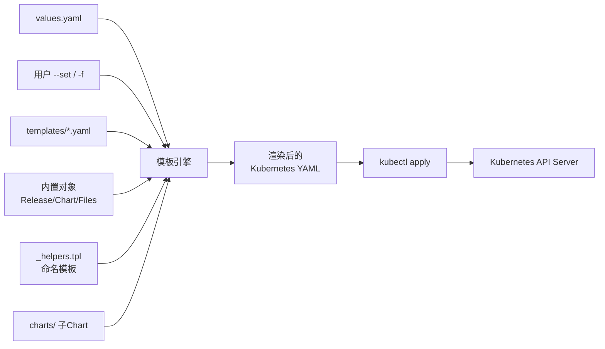

# Helm 使用详解：Chart 目录结构与渲染原理

## 一、Helm 概述

Helm 是 Kubernetes 的包管理工具，类似于 Linux 系统中的 `apt` 或 `yum`。它能够帮助开发者：

1. **统一管理**：将一组相关的 Kubernetes 资源打包为一个 Chart，便于分发和复用。
2. **参数化部署**：通过 `values.yaml` 将配置与模板分离，同一套模板可以适配不同环境。
3. **版本控制**：支持 Chart 的版本管理与升级回滚，让应用的生命周期管理更加可靠。
4. **依赖管理**：自动处理 Chart 之间的依赖关系。

### Helm 的核心概念

| 概念 | 说明 |
|------|------|
| **Chart** | 一个 Helm 包，包含运行应用所需的所有 Kubernetes 资源定义 |
| **Repository** | Chart 仓库，用于存储和共享 Chart |
| **Release** | 在 Kubernetes 集群中运行的一个 Chart 实例 |
| **Revision** | Release 的版本快照，每次 `helm upgrade` 都会生成一个新的 revision |

## 二、Chart 目录结构

一个标准的 Helm Chart 目录结构如下：

```
mychart/
├── Chart.yaml          # Chart 元数据
├── values.yaml         # 默认配置值
├── values.schema.json  # (可选) values 的 JSON Schema 校验
├── charts/             # 子 Chart 依赖目录
├── templates/          # Kubernetes 资源模板目录
│   ├── NOTES.txt       # 安装后显示的帮助信息
│   ├── _helpers.tpl    # 模板辅助函数（命名模板）
│   ├── deployment.yaml # Deployment 模板
│   ├── service.yaml    # Service 模板
│   ├── ingress.yaml    # Ingress 模板
│   ├── hpa.yaml        # HPA 模板
│   ├── serviceaccount.yaml
│   ├── configmap.yaml
│   └── tests/          # 测试模板
│       └── test-connection.yaml
├── crds/               # (可选) CustomResourceDefinition
├── .helmignore         # 打包时忽略的文件
├── LICENSE             # 许可证
└── README.md           # 说明文档
```

### 2.1 `Chart.yaml` — Chart 元数据

这是 Chart 的"身份证"，定义了 Chart 的基本信息。**每个 Chart 必须包含此文件**。

```yaml
apiVersion: v2          # Helm Chart API 版本（v2 对应 Helm 3）
name: mychart           # Chart 名称
version: 0.1.0          # Chart 版本（SemVer 2 格式）
appVersion: "1.16.0"    # 应用版本
description: A Helm chart for Kubernetes
type: application       # 类型：application（应用） 或 library（库）
keywords:
  - nginx
  - web
maintainers:
  - name: zhihao
    email: zhihao@example.com
dependencies:           # 依赖的其他 Chart
  - name: mysql
    version: "9.4.0"
    repository: "https://charts.bitnami.com/bitnami"
    condition: mysql.enabled
```

**关键字段说明**：

- **`apiVersion: v2`**：Helm 3 使用 v2，Helm 2 使用 v1。
- **`type`**：
  - `application`：可部署的应用 Chart（默认）。
  - `library`：库 Chart，不生成资源，只提供可复用的命名模板。
- **`dependencies`**：声明对其他 Chart 的依赖，`helm dependency update` 会下载到 `charts/` 目录。
- **`condition`**：条件依赖，通过 values 控制是否启用子 Chart。

### 2.2 `values.yaml` — 默认配置值

这是 Chart 的"配置中心"，定义了模板中所有可配置参数的默认值。模板文件通过 `.Values.xxx` 引用这些值。

```yaml
# 副本数
replicaCount: 2

# 镜像配置
image:
  repository: nginx
  pullPolicy: IfNotPresent
  tag: "1.25.0"

# 服务配置
service:
  type: ClusterIP
  port: 80

# Ingress 配置
ingress:
  enabled: false
  className: nginx
  hosts:
    - host: example.local
      paths:
        - path: /
          pathType: Prefix

# 资源限制
resources:
  limits:
    cpu: 500m
    memory: 512Mi
  requests:
    cpu: 250m
    memory: 256Mi

# 环境变量
env:
  - name: LOG_LEVEL
    value: info

# 节点选择器
nodeSelector: {}

# 容忍度
tolerations: []

# 亲和性
affinity: {}
```

**覆盖配置的方式**：

```bash
# 方式 1：命令行 --set
helm install my-release ./mychart --set replicaCount=3 --set image.tag=v2.0

# 方式 2：自定义 values 文件
helm install my-release ./mychart -f custom-values.yaml

# 方式 3：多个 values 文件（后面的优先级更高）
helm install my-release ./mychart -f base.yaml -f production.yaml
```

**配置优先级（从低到高）**：

```
Chart 内置 values.yaml  <  父 Chart 的 values  <  用户 -f 文件  <  --set 参数
```

### 2.3 `templates/` — 模板目录

这是 Chart 的核心，存放所有需要渲染的 Kubernetes 资源模板。Helm 使用 **Go template** 语法，并在此基础上扩展了 **Sprig 函数库** 和 **Helm 内置对象/函数**。

#### 模板文件命名规则

- **文件后缀必须是 `.yaml`、`.yml`、`.tpl` 或 `.txt`**。
- 以 `_` 开头的文件不会被渲染为 Kubernetes 资源，如 `_helpers.tpl`。
- `NOTES.txt` 是一个特殊文件，渲染后会在 `helm install` 完成时输出到终端。

#### Helm 内置对象

在模板中可以直接访问以下内置对象：

| 对象 | 说明 | 示例 |
|------|------|------|
| `.Release` | Release 相关信息 | `.Release.Name`, `.Release.Namespace`, `.Release.Revision` |
| `.Values` | `values.yaml` 中的配置 | `.Values.replicaCount`, `.Values.image.tag` |
| `.Chart` | `Chart.yaml` 中的元数据 | `.Chart.Name`, `.Chart.Version` |
| `.Files` | 访问 Chart 中的非模板文件 | `.Files.Get "config.json"` |
| `.Capabilities` | 集群能力信息 | `.Capabilities.KubeVersion` |
| `.Template` | 当前模板的元信息 | `.Template.Name` |

#### `_helpers.tpl` — 命名模板

##### 为什么需要 `_helpers.tpl`？

假设我们要写 Deployment、Service、ConfigMap 三个资源模板。它们都需要在 `metadata.labels` 和 `spec.selector.matchLabels` 中写同样的标签：

```yaml
# deployment.yaml — 写一遍标签
metadata:
  labels:
    app.kubernetes.io/name: mychart
    app.kubernetes.io/instance: my-release

# service.yaml — 又写一遍标签（一模一样！）
metadata:
  labels:
    app.kubernetes.io/name: mychart
    app.kubernetes.io/instance: my-release

# configmap.yaml — 再写一遍标签（还是一模一样！）
metadata:
  labels:
    app.kubernetes.io/name: mychart
    app.kubernetes.io/instance: my-release
```

**问题显而易见**：
1. **重复劳动**：同样的内容写了三遍。
2. **维护地狱**：如果要改标签名，三个文件全得改。
3. **容易出错**：改漏了一个文件，标签就不一致了。

`_helpers.tpl` 就是用来解决这个问题的——**把重复的模板片段定义一次，到处引用**。类比编程语言：

| 编程语言 | Helm 模板 |
|---------|----------|
| 定义函数 `func getName() { ... }` | `{{- define "mychart.name" -}} ... {{- end }}` |
| 调用函数 `getName()` | `{{ include "mychart.name" . }}` |
| 头文件 / 工具模块 | `_helpers.tpl` 文件 |

> **文件名为什么以下划线 `_` 开头？**
>
> Helm 渲染 `templates/` 目录时，**以 `_` 开头的文件不会被渲染为 Kubernetes 资源**（不会生成 YAML 输出），只当作"辅助文件"加载其中的 `define` 模板定义，供其他模板文件引用。这就像 C 语言的 `.h` 头文件，只提供声明，不生成可执行代码。

---

##### 从头拆解一个 `_helpers.tpl`

下面逐行拆解每个语法元素，让你理解**每一行在干什么、为什么这样写**。

##### 1. 注释：`{{/* ... */}}`

```yaml
{{/*
这是 Helm 模板注释，渲染后会被完全删除，不会出现在最终 YAML 中。
可以跨多行写，就像代码里的 /* ... */ 注释。
*/}}
```

- 和 YAML 注释 `#` 不同，`{{/* */}}` 在渲染阶段就被去掉了，**最终 YAML 中不留痕迹**。
- 通常放在每个 `define` 前面，说明这个模板是干什么的。

##### 2. 定义命名模板：`define` 和 `end`

```yaml
{{- define "模板名称" -}}
  模板内容...
{{- end }}
```

- **`define "模板名称"`**：声明一个命名模板，"模板名称" 是一个字符串，**全局唯一**（整个 Chart 范围内不能重名）。
- **`end`**：标志着模板定义结束。
- **`{{-` 和 `-}}`**：`-` 的作用是**吃掉空白字符**（空格、换行）。后面会详细解释。

##### 3. 第一个命名模板：`mychart.fullname`

```yaml
{{- define "mychart.fullname" -}}
{{- .Release.Name | trunc 63 | trimSuffix "-" }}
{{- end }}
```

逐行解释：

| 语法 | 含义 |
|------|------|
| `{{- define "mychart.fullname" -}}` | 定义一个名为 `mychart.fullname` 的模板。前后的 `-` 吃掉本行的换行符。 |
| `{{- .Release.Name \| trunc 63 \| trimSuffix "-" }}` | **管道操作**：取 Release 名称 → 截断到 63 字符 → 去掉末尾的 `-`。 |
| `{{- end }}` | 模板定义结束。 |

> **为什么是 63 个字符？** Kubernetes 资源名称（如 Deployment、Service 的名字）最长不能超过 63 个字符。Helm 用 `trunc 63` 确保生成的资源名不会超长。

**管道 `|` 是什么？** 和 Linux shell 的管道一样，把左边的输出作为右边的输入：

```
.Release.Name          →  "my-very-long-release-name-with-extra-words"
      ↓  trunc 63      →  "my-very-long-release-name-with-extra-words"（不超过 63，原样保留）
      ↓  trimSuffix "-" →  如果末尾是 "-" 就去掉（防止截断后末尾是连字符）
最终结果                  →  "my-very-long-release-name-with-extra-words"
```

##### 4. 第二个命名模板：`mychart.labels`

```yaml
{{/*
mychart.labels — 生成标准的 Kubernetes 推荐标签
这些标签会打在每个资源的 metadata.labels 上
*/}}
{{- define "mychart.labels" }}
app.kubernetes.io/name: {{ include "mychart.name" . }}
app.kubernetes.io/instance: {{ .Release.Name }}
app.kubernetes.io/version: {{ .Chart.AppVersion }}
app.kubernetes.io/managed-by: {{ .Release.Service }}
{{- end }}
```

逐行解释：

| 行 | 含义 |
|----|------|
| `app.kubernetes.io/name: {{ include "mychart.name" . }}` | 输出一行 YAML：key = `app.kubernetes.io/name`，value = 调用 `mychart.name` 模板的结果。注意 `.` 是传递"当前上下文"（后面会详细讲）。 |
| `app.kubernetes.io/instance: {{ .Release.Name }}` | 输出一行 YAML，值直接取 Release 的名字。 |
| `app.kubernetes.io/version: {{ .Chart.AppVersion }}` | 输出一行 YAML，值取 `Chart.yaml` 中定义的 `appVersion`。 |
| `app.kubernetes.io/managed-by: {{ .Release.Service }}` | 输出一行 YAML，值取部署工具名（Helm 会设为 `"Helm"`）。 |

> **这些标签名 `app.kubernetes.io/xxx` 是 Kubernetes 官方推荐的标签规范**（见 [Kubernetes 文档](https://kubernetes.io/docs/concepts/overview/working-with-objects/common-labels/)），被很多工具（如 `kubectl`、监控系统、服务网格）识别和使用。

##### 5. 第三个命名模板：`mychart.selectorLabels`

```yaml
{{/*
mychart.selectorLabels — 生成选择器标签
注意：选择器标签是 Deployment 用于"找到"它管理的 Pod 的，
必须是 Pod template 标签的子集，且值一旦创建就不能改（immutable）
*/}}
{{- define "mychart.selectorLabels" }}
app.kubernetes.io/name: {{ include "mychart.name" . }}
app.kubernetes.io/instance: {{ .Release.Name }}
{{- end }}
```

> **为什么 selectorLabels 比 labels 少几项？**
>
> `spec.selector.matchLabels` 是 Kubernetes 用来**关联 Deployment 和 Pod** 的标识，它在 Deployment 创建后**不能修改**（immutable）。如果 selector 包含了 `version`，那每次升级版本就得重建 Deployment。所以 selector 只保留 **name + instance** 这两个最稳定的维度。

---

##### 关键概念：`include` 的第二个参数 `.` 是什么意思？

这是新手最容易困惑的地方。看这个调用：

```yaml
{{ include "mychart.name" . }}
```

- **第一个参数 `"mychart.name"`**：要调用的模板名称。
- **第二个参数 `.`**：传给模板的**上下文对象**。`.` 在 Go template 中代表"当前作用域的最顶层对象"。

**通俗理解**：`.` 就像你在一个房间里，`.` 就是"这个房间里你能看到的所有东西"——包括 `.Values`、`.Release`、`.Chart` 等等。把 `.` 传给子模板，就是在说"把我当前能访问的所有数据都给你，你需要什么自己拿"。

用代码类比：

```go
// Go 语言类比
type Context struct {
    Values  map[string]interface{}
    Release ReleaseInfo
    Chart   ChartInfo
    // ...
}

// mychart.name 模板相当于这个函数，参数 ctx 就是那个 "."
func mychart_name(ctx Context) string {
    return ctx.Chart.Name  // 对应模板中的 .Chart.Name
}

// 调用时把当前上下文传进去
name := mychart_name(currentContext)  // 对应 include "mychart.name" .
```

---

##### 关键概念：`{{-` 和 `-}}` 的空白控制

这是 Helm 模板中最容易让人抓狂的细节。看两个版本的对比：

**❌ 不用 `-`（会产生多余空行）**：

模板：
```yaml
{{ define "mychart.fullname" }}
{{ .Release.Name }}
{{ end }}
```

渲染结果（注意多余的换行）：
```


my-release


```

**✅ 用 `-`（吃掉多余空白）**：

模板：
```yaml
{{- define "mychart.fullname" -}}
{{- .Release.Name }}
{{- end }}
```

渲染结果（干净）：
```
my-release
```

**规则速记**：
- `{{-` → 吃掉**左边**的空白字符（空格、Tab、换行）
- `-}}` → 吃掉**右边**的空白字符（空格、Tab、换行）
- 两边都加 `-` → 把当前这一行"压缩"干净

> **记忆口诀**：`-` 在哪边就吃哪边。`-}}` 是结尾，吃掉后面的空白；`{{-` 是开头，吃掉前面的空白。

---

##### 实战：在 Deployment 模板中引用 `_helpers.tpl`

现在我们把上面定义的命名模板用到实际的 Deployment 模板中：

```yaml
# templates/deployment.yaml
apiVersion: apps/v1
kind: Deployment
metadata:
  name: {{ include "mychart.fullname" . }}        # ① 引用 fullname 模板
  labels:
    {{- include "mychart.labels" . | nindent 4 }} # ② 引用 labels 模板 + 缩进
spec:
  replicas: {{ .Values.replicaCount }}
  selector:
    matchLabels:
      {{- include "mychart.selectorLabels" . | nindent 6 }}  # ③ selector 标签
  template:
    metadata:
      labels:
        {{- include "mychart.labels" . | nindent 8 }}        # ④ Pod 模板标签
    spec:
      containers:
        - name: {{ .Chart.Name }}
          image: "{{ .Values.image.repository }}:{{ .Values.image.tag }}"
```

**逐处解释**：

| 位置 | 代码 | 含义 |
|------|------|------|
| ① | `{{ include "mychart.fullname" . }}` | 调用 `fullname` 模板生成 Deployment 名称，如 `my-release-mychart`。 |
| ② | `{{- include "mychart.labels" . \| nindent 4 }}` | 调用 `labels` 模板生成 4 行标签，然后整体向右缩进 **4 个空格**（因为 Deployment 的 `metadata.labels` 缩进层级是 4）。 |
| ③ | `{{- include "mychart.selectorLabels" . \| nindent 6 }}` | 调用 `selectorLabels` 模板生成 2 行标签，整体缩进 **6 个空格**（`spec.selector.matchLabels` 的缩进更深）。 |
| ④ | `{{- include "mychart.labels" . \| nindent 8 }}` | Pod 模板的标签需要缩进 **8 个空格**。 |

> **`nindent N` 是什么？**
>
> `nindent` = **n**ewline + **indent**。它做两件事：
> 1. 在前面加一个**换行符** `\n`。
> 2. 把后面的每一行向右缩进 `N` 个空格。
>
> 因为 `{{-` 已经吃掉了前面的空白，所以需要 `nindent` 来重新生成正确的缩进。如果没有它，标签行会顶格写，YAML 层级就乱了。

**`nindent` 效果演示**：

```
# include "mychart.labels" . 的原始输出（顶格、无前导换行）：
app.kubernetes.io/name: mychart
app.kubernetes.io/instance: my-release
app.kubernetes.io/version: 1.16.0
app.kubernetes.io/managed-by: Helm

# 加上 | nindent 4 之后（前面加换行，每行缩进 4 格）：
（空行由 nindent 的 newline 产生）
    app.kubernetes.io/name: mychart
    app.kubernetes.io/instance: my-release
    app.kubernetes.io/version: 1.16.0
    app.kubernetes.io/managed-by: Helm
```

---

##### 完整的渲染过程推演

假设我们有：
- `Release.Name` = `my-release`
- `Chart.Name` = `mychart`
- `Chart.AppVersion` = `1.16.0`
- `Release.Service` = `Helm`
- `nameOverride` 和 `fullnameOverride` 都为空

**步骤 1**：Helm 先加载 `_helpers.tpl`，把三个 `define` 模板注册到命名模板池中。

**步骤 2**：渲染 `deployment.yaml` 时，遇到 `{{ include "mychart.fullname" . }}`：

```
进入 mychart.fullname 模板
  → .Release.Name = "my-release"
  → trunc 63 后 = "my-release"（没超过 63 字符）
  → trimSuffix "-" 后 = "my-release"（末尾无 "-"）
  → 返回 "my-release"  ← 这就是 Deployment 的 name
```

**步骤 3**：渲染到 `labels:` 时，遇到 `{{- include "mychart.labels" . | nindent 4 }}`：

```
进入 mychart.labels 模板，逐行计算：
  app.kubernetes.io/name: ... → 调用 mychart.name → .Chart.Name = "mychart"
  app.kubernetes.io/instance: ... → .Release.Name = "my-release"
  app.kubernetes.io/version: ... → .Chart.AppVersion = "1.16.0"
  app.kubernetes.io/managed-by: ... → .Release.Service = "Helm"

原始输出（4 行）加上 nindent 4 后，每行缩进 4 格，插入到 labels: 下方。
```

**步骤 4**：同理渲染 selector 标签和 Pod 模板标签。

**最终渲染结果**：

```yaml
apiVersion: apps/v1
kind: Deployment
metadata:
  name: my-release-mychart
  labels:
    app.kubernetes.io/name: mychart
    app.kubernetes.io/instance: my-release
    app.kubernetes.io/version: 1.16.0
    app.kubernetes.io/managed-by: Helm
spec:
  replicas: 2
  selector:
    matchLabels:
      app.kubernetes.io/name: mychart
      app.kubernetes.io/instance: my-release
  template:
    metadata:
      labels:
        app.kubernetes.io/name: mychart
        app.kubernetes.io/instance: my-release
        app.kubernetes.io/version: 1.16.0
        app.kubernetes.io/managed-by: Helm
    spec:
      containers:
        - name: mychart
          image: "nginx:1.25.0"
```

可以看到，三组标签（Deployment 自己的 labels、selector 的 matchLabels、Pod 模板的 labels）都是通过 `_helpers.tpl` 统一生成的。**改一处 `_helpers.tpl`，所有资源文件的标签都会同步更新**——这就是命名模板的核心价值。

---

##### `include` vs `template` 的区别

| 特性 | `include` | `template` |
|------|-----------|------------|
| 返回值 | 返回**字符串**，可以赋值、传入管道 | 直接输出到模板，没有返回值 |
| 结合管道 | ✅ 支持，如 `include "x" . \| quote` | ❌ 不支持管道式处理 |
| 缩进控制 | 需配合 `indent` / `nindent` 函数 | 自动处理缩进 |
| 推荐程度 | ⭐⭐⭐ **推荐使用** | ⭐ 仅简单场景 |

**为什么推荐 `include`？** 因为它返回字符串，可以和管道函数组合使用：

```yaml
# ✅ include 可以这么做：先调用模板，再给结果加引号
key: {{ include "mychart.name" . | quote }}
# 结果：key: "mychart"

# ✅ include 可以这么做：先调用模板，再缩进
labels:
  {{- include "mychart.labels" . | nindent 4 }}

# ❌ template 做不到上面的操作，因为它直接输出了，没法再加工
```

**一句话总结**：能用 `include` 就用 `include`，除非你 100% 确定不需要对结果做任何加工。

---

##### 常用 Sprig 函数：`dig` — 安全地读取深层嵌套的值

在写 `_helpers.tpl` 或模板时，经常需要从 `.Values` 中读取嵌套的配置。比如：

```yaml
# values.yaml
global:
  spire:
    eksProfiles:
      enabled: true
      server: "spire-server.example.com"
```

**❌ 直接用 `.` 访问嵌套值的问题**：

```yaml
{{ .Values.global.spire.eksProfiles.server }}
```

如果 `global`、`spire` 或 `eksProfiles` 这三层中**任何一层不存在**，Helm 渲染会直接**报错崩溃**（Go template 的 `nil` panic）。这在以下场景很常见：

- 某个环境不需要 SPIRE，所以 `values.yaml` 中根本没定义 `global.spire` 这个 key。
- 用了 `helm install --set` 只覆盖了部分值，中间层级缺失。

**✅ `dig` 就是用来解决这个问题的**：

```
dig "key1" "key2" ... "keyN" 默认值 数据源
```

`dig` 会**一层一层**地尝试读取嵌套的 key。如果中途任何一层不存在或为 `nil`，它不会报错，而是**返回你指定的默认值**。

**拆解你看到的这行代码**：

```yaml
{{- $profiles := dig "spire" "eksProfiles" (dict) .Values.global -}}
```

逐部分解释：

| 部分 | 含义 |
|------|------|
| `$profiles :=` | 定义一个**变量** `$profiles`，把右边计算的结果存进去（`:=` 是 Go template 的变量赋值语法） |
| `dig` | Sprig 的"安全挖掘"函数 |
| `"spire"` | 第一层 key，去找 `.Values.global.spire` |
| `"eksProfiles"` | 第二层 key，在上一层找到后，继续找 `.spire.eksProfiles` |
| `(dict)` | **默认值**：如果 `.Values.global` 下找不到 `spire.eksProfiles`，就返回一个**空字典 `{}`**（`dict` 是 Sprig 函数，生成空 map） |
| `.Values.global` | **数据源**：从哪个对象开始挖掘 |

**用流程图理解**：

```
dig "spire" "eksProfiles" (dict) .Values.global

第一步：.Values.global 存在吗？
  ├─ 不存在 → 直接返回默认值 (dict) = {}
  └─ 存在 → 进入第二步

第二步：.Values.global.spire 存在吗？
  ├─ 不存在 → 返回默认值 {}
  └─ 存在 → 进入第三步

第三步：.Values.global.spire.eksProfiles 存在吗？
  ├─ 不存在 → 返回默认值 {}
  └─ 存在 → 返回实际值，比如 {enabled: true, server: "spire-server.example.com"}
```

**实战对比**：

```yaml
# values.yaml 场景 A：配置完整
global:
  spire:
    eksProfiles:
      enabled: true
      server: "spire.example.com"

# 模板中用 dig：
{{- $profiles := dig "spire" "eksProfiles" (dict) .Values.global -}}
# $profiles = map[enabled:true server:spire.example.com]
# 后续可以用 $profiles.enabled、$profiles.server 安全访问 ✅


# values.yaml 场景 B：global 下根本没有 spire 这个 key（比如开发环境不需要 SPIRE）
global:
  imageRegistry: my-registry.com
  # 注意：这里没有 spire！

# 模板中用 dig：
{{- $profiles := dig "spire" "eksProfiles" (dict) .Values.global -}}
# $profiles = map[]  （空字典，不报错！）✅
# 如果用 {{ .Values.global.spire.eksProfiles }} → 💥 渲染崩溃！


# values.yaml 场景 C：有 spire 但没 eksProfiles
global:
  spire:
    serverAddr: "spire-server.example.com"
    # 注意：这里没有 eksProfiles！

# 模板中用 dig：
{{- $profiles := dig "spire" "eksProfiles" (dict) .Values.global -}}
# $profiles = map[]  （不报错，安静返回空字典）✅
```

**后续如何使用 `$profiles`？**

```yaml
{{- $profiles := dig "spire" "eksProfiles" (dict) .Values.global -}}
{{- range $name, $profile := $profiles }}
---
# 为每个 eks profile 生成配置
profile: {{ $name }}
server: {{ $profile.server }}
{{- end }}
```

> **`dig` vs `default` 的区别**：
>
> | 函数 | 用途 | 示例 |
> |------|------|------|
> | `default` | 给**单个值**设默认值 | `{{ .Values.image.tag \| default "latest" }}` — 只能管一层 |
> | `dig` | 安全穿越**多层嵌套** | `{{ dig "a" "b" "c" "默认" .Values }}` — 穿越 a→b→c，任一层缺失就返回默认值 |
>
> **一句话**：当访问路径超过一层时，用 `dig`；只有一层时，用 `default`。

##### `_helpers.tpl` 最佳实践

1. **每个命名模板上方加注释**：用 `{{/* */}}` 说明模板的用途和返回值格式。
2. **模板名称加 Chart 前缀**：如 `mychart.fullname` 而非 `fullname`，避免与子 Chart 的模板重名。
3. **遵循 Kubernetes 标签规范**：使用 `app.kubernetes.io/` 前缀的推荐标签。
4. **`labels` 和 `selectorLabels` 分开定义**：selector 更精简（不可变），labels 可以更丰富（可变）。
5. **涉及缩进的地方一律用 `nindent`**：不要手动数空格，让 `nindent` 帮你处理。
6. **深层取值用 `dig` 替代裸 `.` 访问**：避免因配置缺失导致渲染崩溃，让模板更健壮。

### 2.4 `charts/` — 子 Chart 依赖

存放当前 Chart 依赖的子 Chart。有两种方式填充此目录：

**方式一：手动放置**

直接将子 Chart 的压缩包或目录放入 `charts/` 中。

**方式二：通过依赖管理（推荐）**

在 `Chart.yaml` 中声明 `dependencies`，然后执行：

```bash
# 下载依赖到 charts/ 目录，并生成 Chart.lock 锁定版本
helm dependency update mychart/

# 将依赖打包到 mychart-0.1.0.tgz 中
helm dependency build mychart/
```

下载后的 `charts/` 目录结构示例：

```
charts/
├── mysql-9.4.0.tgz       # 压缩包形式
└── redis-18.0.0.tgz
```

### 2.5 `Chart.lock` — 依赖锁定文件

与 `package-lock.json` 类似，锁定依赖 Chart 的确切版本，确保可重复构建。

```yaml
dependencies:
- name: mysql
  version: 9.4.0
  repository: https://charts.bitnami.com/bitnami
  digest: sha256:abc123...
```

### 2.6 `crds/` — 自定义资源定义

存放 CRD（CustomResourceDefinition）YAML 文件。这些文件：

- **不会被模板渲染**，直接原样安装。
- **不支持升级和回滚**：Helm 安装 CRD 后不会在后续 upgrade 中修改它；删除 Release 也不会删除 CRD。
- 适用于需要安装 Operator 的场景。

### 2.7 `.helmignore` — 忽略文件

与 `.gitignore` 类似，指定 `helm package` 打包时需要忽略的文件。

```
# 忽略 .git
.git/
# 忽略临时文件
*.swp
*.bak
*.tmp
# 忽略 IDE 配置
.idea/
.vscode/
```

## 三、Helm 渲染流程与原理

### 3.1 整体渲染管线



### 3.2 逐步渲染过程

当执行 `helm install` 或 `helm template` 时，Helm 按以下步骤工作：

**第一步：加载并合并 Values**

Helm 按照优先级从低到高合并所有配置来源：

```
Chart 内置 values.yaml
  → 父 Chart 的 values（如果有）
    → -f 指定的自定义 values 文件（多个文件按指定顺序覆盖）
      → --set 命令行参数
```

合并采用**深度合并**策略：嵌套的 map 会递归合并，而非简单替换。

```yaml
# values.yaml（基础）
image:
  repository: nginx
  tag: "1.25"

# custom.yaml（覆盖）
image:
  tag: "1.26"
  pullPolicy: Always

# 合并结果
image:
  repository: nginx      # 未覆盖，保留原值
  tag: "1.26"            # 被覆盖
  pullPolicy: Always      # 新增
```

**第二步：解析 Chart 依赖**

处理 `Chart.yaml` 中的 `dependencies`，确保 `charts/` 中的子 Chart 最新。如果声明了 `condition`，会根据对应的 values 值决定是否启用子 Chart。

**第三步：构建模板上下文**

创建模板渲染上下文，包含所有内置对象：

- `.Release`：当前 Release 的 Name, Namespace, Service 等
- `.Values`：第一步合并后的完整配置
- `.Chart`：`Chart.yaml` 中的元数据
- `.Files`：Chart 包中非模板文件的访问接口
- `.Capabilities`：目标 Kubernetes 集群的能力信息
- `.Template`：当前模板文件的 Name 和 BasePath

**第四步：递归渲染 templates/**

对 `templates/` 中的每个 `.yaml` / `.tpl` 文件执行 Go template 渲染：

1. **解析**：Go 的 `text/template` 引擎解析模板语法。
2. **函数注入**：注入 Sprig 函数库（70+ 函数）和 Helm 自定义函数。
3. **命名模板加载**：先处理 `_` 开头的文件（如 `_helpers.tpl`），将其中的 `define` 模板加载到命名模板池中。
4. **逐一渲染**：处理其余 `.yaml` 文件，遇到 `include`/`template` 调用时从命名模板池中查找。

**第五步：后处理与输出**

渲染完成后，Helm 对 YAML 输出进行后处理：

1. **去除多余空白行**：清理模板渲染产生的空白行。
2. **分离多文档 YAML**：一个模板文件可能产生多个 YAML 文档（用 `---` 分隔），Helm 将它们拆分为独立的资源对象。
3. **按类型排序**：按 Kubernetes 资源类型排序输出（如 Namespace → ServiceAccount → ConfigMap → Deployment → Service）。
4. **子 Chart 资源标注**：子 Chart 的资源会被自动添加 `helm.sh/chart` 标签以标识来源。

### 3.3 一个完整的渲染示例

#### values.yaml

```yaml
replicaCount: 2
image:
  repository: nginx
  tag: "1.25.0"
  pullPolicy: IfNotPresent
service:
  type: ClusterIP
  port: 80
nameOverride: ""
fullnameOverride: ""
```

#### templates/_helpers.tpl

```yaml
{{- define "mychart.name" -}}
{{- default .Chart.Name .Values.nameOverride | trunc 63 | trimSuffix "-" }}
{{- end }}

{{- define "mychart.fullname" -}}
{{- if .Values.fullnameOverride }}
{{- .Values.fullnameOverride | trunc 63 | trimSuffix "-" }}
{{- else }}
{{- $name := default .Chart.Name .Values.nameOverride }}
{{- printf "%s-%s" .Release.Name $name | trunc 63 | trimSuffix "-" }}
{{- end }}
{{- end }}
```

#### templates/deployment.yaml（模板）

```yaml
apiVersion: apps/v1
kind: Deployment
metadata:
  name: {{ include "mychart.fullname" . }}
  labels:
    {{- include "mychart.labels" . | nindent 4 }}
spec:
  replicas: {{ .Values.replicaCount }}
  selector:
    matchLabels:
      {{- include "mychart.selectorLabels" . | nindent 6 }}
  template:
    metadata:
      labels:
        {{- include "mychart.selectorLabels" . | nindent 8 }}
    spec:
      containers:
        - name: {{ .Chart.Name }}
          image: "{{ .Values.image.repository }}:{{ .Values.image.tag }}"
          imagePullPolicy: {{ .Values.image.pullPolicy }}
          ports:
            - name: http
              containerPort: {{ .Values.service.port }}
```

#### 执行渲染

```bash
helm template my-release ./mychart --debug
```

#### 渲染结果

```yaml
apiVersion: apps/v1
kind: Deployment
metadata:
  name: my-release-mychart
  labels:
    app.kubernetes.io/name: mychart
    app.kubernetes.io/instance: my-release
spec:
  replicas: 2
  selector:
    matchLabels:
      app.kubernetes.io/name: mychart
      app.kubernetes.io/instance: my-release
  template:
    metadata:
      labels:
        app.kubernetes.io/name: mychart
        app.kubernetes.io/instance: my-release
    spec:
      containers:
        - name: mychart
          image: "nginx:1.25.0"
          imagePullPolicy: IfNotPresent
          ports:
            - name: http
              containerPort: 80
```

可以看到模板中的 `{{ }}` 已经被替换为实际值，这就是 Helm 渲染的核心能力。

### 3.4 子 Chart 的渲染机制

子 Chart 的渲染有其特殊性：

1. **独立渲染**：每个子 Chart 在自己的作用域内独立渲染，只能访问自己的 `.Values`（由父 Chart 的 values 中对应 key 传入）。
2. **全局值**：通过 `global` 字段可以跨 Chart 共享配置。

```yaml
# 父 Chart 的 values.yaml
mysql:
  enabled: true
  auth:
    rootPassword: "secret123"

global:
  imageRegistry: my-registry.com
  imagePullSecrets:
    - name: regcred
```

在子 Chart 模板中，通过 `.Values.global` 访问全局值。

3. **依赖条件控制**：在 `Chart.yaml` 中声明 `condition` 可以动态启用/禁用子 Chart。

```yaml
dependencies:
  - name: mysql
    version: "9.4.0"
    repository: "https://charts.bitnami.com/bitnami"
    condition: mysql.enabled   # 当 mysql.enabled=true 时才安装
```

## 四、常用 Helm 命令速查

### 仓库管理

```bash
# 添加仓库
helm repo add bitnami https://charts.bitnami.com/bitnami

# 更新仓库索引
helm repo update

# 列出仓库
helm repo list

# 搜索 Chart
helm search repo nginx
helm search hub nginx      # 搜索 Artifact Hub
```

### Chart 管理

```bash
# 创建新 Chart
helm create mychart

# 语法检查（lint）
helm lint mychart/

# 打包 Chart
helm package mychart/

# 查看渲染结果（不安装）
helm template my-release mychart/

# 带调试信息渲染
helm template my-release mychart/ --debug

# 查看 Chart 的 values 说明
helm show values bitnami/nginx
helm show readme bitnami/nginx
```

### Release 管理

```bash
# 安装
helm install my-release mychart/ -n my-namespace --create-namespace

# 列出 Release
helm list -n my-namespace
helm list -A                        # 所有命名空间

# 查看 Release 状态
helm status my-release -n my-namespace

# 查看 Release 的实际配置值
helm get values my-release -n my-namespace
helm get values my-release --all    # 包含默认值

# 查看 Release 的渲染后清单
helm get manifest my-release -n my-namespace

# 查看 Release 历史
helm history my-release -n my-namespace

# 升级
helm upgrade my-release mychart/ -n my-namespace -f new-values.yaml

# 回滚
helm rollback my-release 1 -n my-namespace   # 回滚到 revision 1
helm rollback my-release -n my-namespace      # 回滚到上一个版本

# 卸载
helm uninstall my-release -n my-namespace

# 试运行（dry-run）
helm install my-release mychart/ --dry-run --debug
helm upgrade my-release mychart/ --dry-run --debug
```

### 依赖管理

```bash
# 更新依赖（下载到 charts/）
helm dependency update mychart/

# 列出依赖
helm dependency list mychart/

# 构建并打包依赖
helm dependency build mychart/
```

## 五、最佳实践

### 5.1 模板编写规范

1. **使用命名模板**：将标签、名称等重复逻辑抽到 `_helpers.tpl`。
2. **合理使用 `-` 控制空白**：`{{-` 去掉左侧空白，`-}}` 去掉右侧空白。
3. **提供默认值**：为所有 `values` 设置合理的默认值，降低使用门槛。
4. **使用 `required` 函数**：对必需参数进行校验。

```yaml
# 如果 image.repository 未设置，渲染时报错
image: "{{ required "image.repository is required" .Values.image.repository }}:{{ .Values.image.tag }}"
```

### 5.2 Values 设计原则

1. **扁平优于深层嵌套**：过深的嵌套让覆盖配置变得困难。
2. **使用描述性命名**：配置参数名称应该自解释。
3. **添加注释**：在 `values.yaml` 中为每个参数添加注释说明用途。

### 5.3 版本管理

1. **使用 SemVer**：Chart 版本遵循语义化版本规范。
2. **锁定子 Chart 版本**：通过 `Chart.lock` 确保依赖版本一致性。
3. **区分 Chart 版本和应用版本**：`version` 是 Chart 版本，`appVersion` 是应用版本。

### 5.4 安全考量

1. **敏感信息使用 Secret**：不要将密码、Token 等写入 `values.yaml` 明文。
2. **配合 sealed-secrets 或 External Secrets** 管理密钥。
3. **设置 `values.schema.json`**：对 values 进行结构校验，防止错误配置。

## 六、多环境部署管理策略

在实际项目中，同一套应用通常需要部署到多个环境（开发、测试、预发布、生产），不同环境会有差异化的配置需求。Helm 提供了多种策略来管理这种多环境场景。

### 6.1 策略一：多 Values 文件（Base + Overlay）

这是最常用也最推荐的方式。将公共配置抽取为 `base` 文件，各环境差异配置用独立的 overlay 文件覆盖。

#### 目录结构

```
mychart/
├── Chart.yaml
├── templates/
├── values.yaml              # Chart 默认值（最通用的安全默认值）
└── envs/
    ├── base.yaml            # 所有环境的公共配置
    ├── dev.yaml             # 开发环境差异配置
    ├── staging.yaml         # 预发布环境差异配置
    └── prod.yaml            # 生产环境差异配置
```

#### `envs/base.yaml` — 公共配置

```yaml
# 所有环境共享的配置
image:
  repository: my-registry.com/myapp

service:
  type: ClusterIP
  port: 8080

ingress:
  enabled: true
  className: nginx
  hosts:
    - paths:
        - path: /
          pathType: Prefix

# 通用资源限制
resources:
  requests:
    cpu: 200m
    memory: 256Mi
```

#### `envs/dev.yaml` — 开发环境

```yaml
# 开发环境覆盖
image:
  tag: "dev-latest"

replicaCount: 1

ingress:
  hosts:
    - host: dev.myapp.example.com

resources:
  limits:
    cpu: 500m
    memory: 512Mi

# 开启调试功能
env:
  - name: LOG_LEVEL
    value: debug
  - name: DEBUG
    value: "true"

# 开发环境不启用 HPA
autoscaling:
  enabled: false
```

#### `envs/prod.yaml` — 生产环境

```yaml
# 生产环境覆盖
image:
  tag: "v2.5.3"       # 使用明确的版本号，不要用 latest

replicaCount: 6

ingress:
  hosts:
    - host: myapp.example.com

resources:
  limits:
    cpu: 2000m
    memory: 2Gi

env:
  - name: LOG_LEVEL
    value: info

# 开启自动扩缩容
autoscaling:
  enabled: true
  minReplicas: 3
  maxReplicas: 20
  targetCPUUtilizationPercentage: 70

# 生产级别的探针配置
livenessProbe:
  initialDelaySeconds: 30
  periodSeconds: 10
readinessProbe:
  initialDelaySeconds: 10
  periodSeconds: 5
```

#### 部署命令

```bash
# 公共 + 开发环境
helm upgrade --install myapp ./mychart \
  -f envs/base.yaml -f envs/dev.yaml \
  -n dev --create-namespace

# 公共 + 生产环境
helm upgrade --install myapp ./mychart \
  -f envs/base.yaml -f envs/prod.yaml \
  -n prod --create-namespace
```

### 6.2 策略二：Umbrella Chart（伞形 Chart）

当一个微服务系统由多个独立 Chart 组成时，可以用一个顶层"伞形 Chart"统一管理所有子服务。

#### 目录结构

```
myplatform/
├── Chart.yaml              # 伞形 Chart，声明所有子 Chart 依赖
├── values.yaml             # 全局公共配置
├── envs/
│   ├── base.yaml           # 子服务的公共配置
│   ├── dev.yaml            # 开发环境覆盖
│   └── prod.yaml           # 生产环境覆盖
└── charts/                 # 子 Chart（由 helm dependency update 下载）
    ├── frontend-1.2.0.tgz
    ├── backend-2.0.1.tgz
    ├── redis-18.0.0.tgz
    └── postgresql-15.0.0.tgz
```

#### `Chart.yaml`

```yaml
apiVersion: v2
name: myplatform
version: 1.0.0
type: application

dependencies:
  - name: frontend
    version: "1.2.0"
    repository: "https://charts.mycompany.com"
    condition: frontend.enabled
  - name: backend
    version: "2.0.1"
    repository: "https://charts.mycompany.com"
    condition: backend.enabled
  - name: redis
    version: "18.0.0"
    repository: "https://charts.bitnami.com/bitnami"
    condition: redis.enabled
  - name: postgresql
    version: "15.0.0"
    repository: "https://charts.bitnami.com/bitnami"
    condition: postgresql.enabled
```

#### `envs/dev.yaml` — 开发环境覆盖

```yaml
frontend:
  enabled: true
  replicaCount: 1
  ingress:
    host: dev.myapp.example.com

backend:
  enabled: true
  replicaCount: 1
  resources:
    limits:
      cpu: 500m
      memory: 512Mi

redis:
  enabled: true
  auth:
    password: "dev-redis-pass"

postgresql:
  enabled: true
  auth:
    password: "dev-pg-pass"
```

#### `envs/prod.yaml` — 生产环境覆盖

```yaml
frontend:
  enabled: true
  replicaCount: 4
  ingress:
    host: myapp.example.com

backend:
  enabled: true
  replicaCount: 6
  resources:
    limits:
      cpu: 2000m
      memory: 4Gi
  autoscaling:
    enabled: true
    minReplicas: 3
    maxReplicas: 20

redis:
  enabled: true
  auth:
    password: "prod-secure-password"
  master:
    persistence:
      enabled: true
      size: 20Gi

postgresql:
  enabled: true
  auth:
    password: "prod-secure-password"
  primary:
    persistence:
      enabled: true
      size: 100Gi
```

#### 部署命令

```bash
# 先更新子 Chart 依赖
helm dependency update myplatform/

# 部署到不同环境
helm upgrade --install platform-dev ./myplatform \
  -f myplatform/envs/base.yaml -f myplatform/envs/dev.yaml \
  -n dev

helm upgrade --install platform-prod ./myplatform \
  -f myplatform/envs/base.yaml -f myplatform/envs/prod.yaml \
  -n prod
```

### 6.3 策略三：Library Chart（库 Chart）

将通用的模板逻辑封装为 Library Chart，供多个应用 Chart 引用，避免模板重复。

```yaml
# Library Chart 的 Chart.yaml
apiVersion: v2
name: mylib
version: 1.0.0
type: library    # 关键：type 必须设为 library
```

```yaml
# Library Chart 的 templates/_deployment.tpl
{{- define "mylib.deployment" -}}
apiVersion: apps/v1
kind: Deployment
metadata:
  name: {{ .name }}
spec:
  replicas: {{ .replicaCount }}
  selector:
    matchLabels:
      app: {{ .name }}
  template:
    spec:
      containers:
        - name: {{ .name }}
          image: "{{ .image.repo }}:{{ .image.tag }}"
{{- end -}}
```

```yaml
# 业务 Chart 通过依赖引用 Library Chart
# Chart.yaml
dependencies:
  - name: mylib
    version: "1.0.0"
    repository: "file://../mylib"   # 本地路径引用
```

```yaml
# 业务 Chart 模板中直接用 define 好的命名模板
{{ include "mylib.deployment" (dict "name" .Values.appName "replicaCount" .Values.replicaCount "image" .Values.image) }}
```

### 6.4 策略四：原生 Helm + 环境变量

对于简单的多环境场景，也可以利用 Helm 的 `--set` 和模板中的条件判断来处理。

```yaml
# templates/configmap.yaml
apiVersion: v1
kind: ConfigMap
metadata:
  name: app-config
data:
  log-level: {{ .Values.logLevel | default "info" }}
  {{- if eq .Values.environment "production" }}
  cache-ttl: "3600"
  db-pool-size: "50"
  {{- else }}
  cache-ttl: "60"
  db-pool-size: "5"
  {{- end }}
```

但这种方式会让模板逻辑变得复杂，**不建议大量使用**，仅在差异项较少时可以接受。

### 6.5 四种策略对比

| 策略 | 适用场景 | 优点 | 缺点 |
|------|---------|------|------|
| **多 Values 文件** | 单个应用多环境 | 简单直观，团队易理解 | values 文件多时需要管理好继承关系 |
| **Umbrella Chart** | 微服务系统 | 统一管理所有服务版本和配置 | 依赖关系复杂，升级需谨慎 |
| **Library Chart** | 多个应用共享模板 | 模板复用，DRY 原则 | 抽象层级增加，调试困难 |
| **模板条件判断** | 少量环境差异 | 无需额外文件 | 模板逻辑复杂化，难维护 |

### 6.6 多环境管理最佳实践

1. **环境隔离用命名空间**：每个环境一个 Kubernetes Namespace，保证资源隔离。

   ```bash
   helm install myapp ./mychart -f envs/prod.yaml -n prod
   helm install myapp ./mychart -f envs/dev.yaml -n dev
   ```

2. **Release 名保持统一**：不同环境使用相同的 Release 名称（如 `myapp`），靠 Namespace 区分，便于 CI/CD 脚本统一。

3. **敏感信息永远不进 values 文件**：数据库密码、API Key 等通过 External Secrets Operator 或 Sealed Secrets 注入，不要在 values 中明文存放。

4. **Git 管理的 values 文件不放机密**：

   ```
   envs/
   ├── base.yaml          # ✅ 提交到 Git
   ├── dev.yaml           # ✅ 提交到 Git
   ├── prod.yaml          # ✅ 提交到 Git（但只含非敏感配置）
   └── secrets/
       └── prod-secrets.yaml  # ❌ .gitignore 或使用外部密钥管理
   ```

5. **版本固化**：生产环境部署时使用明确的镜像 tag 和 Chart 版本，杜绝 `latest`。

6. **CI/CD 集成**：

   ```yaml
   # GitLab CI 示例
   deploy-dev:
     stage: deploy
     script:
       - helm upgrade --install myapp ./chart
           -f chart/envs/base.yaml
           -f chart/envs/dev.yaml
           -n dev --wait
     only:
       - develop

   deploy-prod:
     stage: deploy
     script:
       - helm upgrade --install myapp ./chart
           -f chart/envs/base.yaml
           -f chart/envs/prod.yaml
           -n prod --wait
     only:
       - main
     when: manual   # 生产部署需手动触发
   ```

7. **渲染验证**：在 CI 中渲染出最终 YAML 进行校验，确保配置正确。

   ```bash
   # CI 中校验渲染结果
   helm template myapp ./mychart -f envs/base.yaml -f envs/prod.yaml | kubeconform -strict
   ```

## 七、调试技巧

### 查看渲染结果

```bash
# 渲染到标准输出
helm template my-release ./mychart -f values.yaml

# 渲染并输出调试信息
helm template my-release ./mychart --debug 2>&1 | head -100

# 只渲染特定模板
helm template my-release ./mychart -s templates/deployment.yaml
```

### 查找渲染问题

```bash
# 语法检查
helm lint ./mychart

# Dry-run 安装（发送到 API Server 但不持久化）
helm install my-release ./mychart --dry-run --debug

# 对比升级前后的差异
helm diff upgrade my-release ./mychart -f new-values.yaml  # 需要 helm-diff 插件
```

## 八、总结

Helm 的核心价值在于**"配置与模板分离"**。理解其工作原理可以总结为三条主线：

1. **目录结构**：`Chart.yaml`（元数据）+ `values.yaml`（配置）+ `templates/`（模板）+ `charts/`（依赖），各司其职。
2. **渲染流程**：合并 values → 构建上下文 → Go template 引擎渲染 → YAML 后处理 → 提交到 API Server。
3. **配置优先级**：默认 values < 父 Chart values < `-f` 文件 < `--set`，层层覆盖。

掌握这些核心概念后，就能灵活地编写、调试和部署 Helm Chart，让 Kubernetes 应用管理变得高效且可靠。
