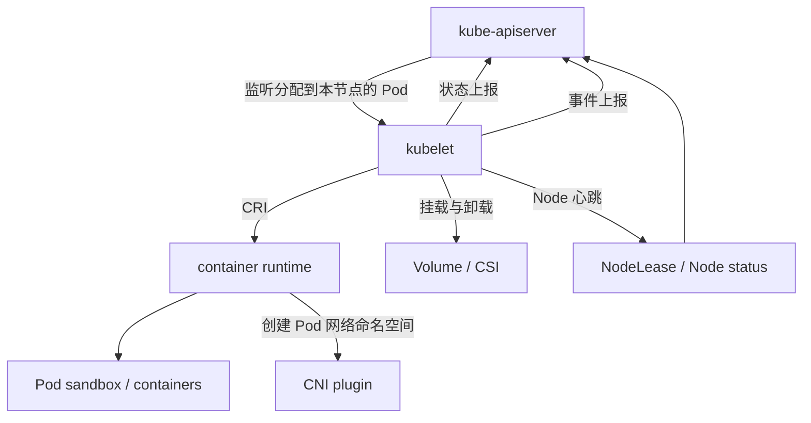
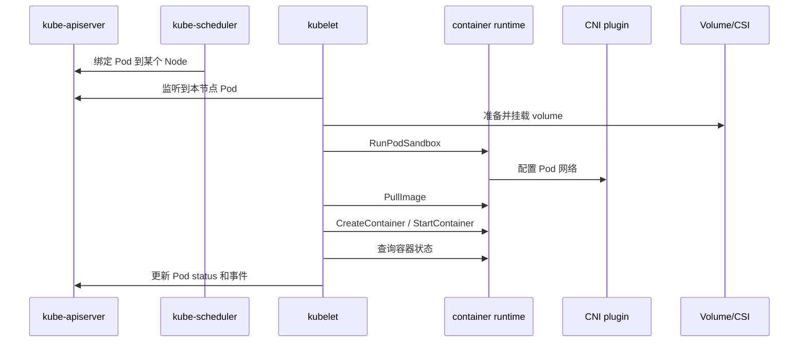
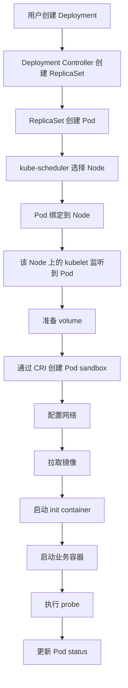

# kubelet 是什么

## 一句话理解

kubelet 是 Kubernetes 运行在每个 Node 上的核心代理进程。它负责把“控制面希望这个节点上运行哪些 Pod”的声明，真正落实成“这个节点上启动、停止、检查和维护哪些容器”。

换句话说：

> kube-apiserver 保存期望状态，scheduler 决定 Pod 去哪个节点，kubelet 负责让这个节点上的 Pod 真的跑起来并保持健康。

在一个标准 Kubernetes 集群里，如果没有 kubelet，节点就只是普通机器；只有 kubelet 向 apiserver 注册 Node，并持续上报状态、接收 PodSpec、调用容器运行时创建容器，这台机器才成为 Kubernetes 的工作节点。

## kubelet 在 Kubernetes 架构中的位置

Kubernetes 可以粗略分成两层：

1. **控制面**
   - kube-apiserver
   - kube-scheduler
   - kube-controller-manager
   - etcd

2. **节点侧组件**
   - kubelet
   - kube-proxy
   - container runtime，例如 containerd、CRI-O
   - CNI 插件
   - CSI 插件
   - device plugin

kubelet 位于节点侧，是控制面和本机运行环境之间的桥梁。



这里最重要的一点是：kubelet 不直接替代容器运行时、网络插件或存储插件。它是编排节点本地资源的协调者，真正创建容器、配置网络、挂载存储的动作通常由下层组件完成。

## kubelet 主要负责什么

### 1. 注册和维护 Node

kubelet 启动后会向 kube-apiserver 注册一个 Node 对象。这个 Node 对象描述了节点的身份和能力，包括：

1. 节点名称。
2. 节点 IP。
3. 操作系统和架构。
4. kubelet 版本。
5. 容器运行时信息。
6. CPU、内存、临时存储、Pod 数量等资源容量。
7. Node Conditions，例如 `Ready`、`MemoryPressure`、`DiskPressure`、`PIDPressure`。

可以通过下面的命令查看：

```bash
kubectl get nodes -o wide
kubectl describe node <node-name>
```

常见 Node 状态包括：

| 状态 | 含义 |
| --- | --- |
| `Ready=True` | kubelet 正常工作，节点可以运行 Pod |
| `Ready=False` | 节点不可用，常见原因是 kubelet、runtime、网络或系统资源异常 |
| `Ready=Unknown` | 控制面长时间没有收到节点心跳 |
| `MemoryPressure=True` | 节点内存压力过高 |
| `DiskPressure=True` | 节点磁盘或镜像存储压力过高 |
| `PIDPressure=True` | 节点可用 PID 不足 |
| `NetworkUnavailable=True` | 节点网络还没有正确配置 |

kubelet 会持续发送心跳。现代 Kubernetes 中，心跳主要通过 `Lease` 对象快速更新，Node status 则包含更完整的节点状态信息。

### 2. 监听并执行 PodSpec

kubelet 的核心输入是 PodSpec。PodSpec 描述了一个 Pod 应该是什么样子，例如：

1. 使用哪些镜像。
2. 有哪些容器和 init container。
3. 需要哪些环境变量。
4. 需要挂载哪些 volume。
5. 资源 requests 和 limits 是多少。
6. 使用什么 restartPolicy。
7. 配置哪些 liveness、readiness、startup probe。
8. 是否使用 hostNetwork、hostPID、securityContext 等特殊能力。

最常见的来源是 kube-apiserver：scheduler 把 Pod 绑定到某个 Node 后，运行在该 Node 上的 kubelet 会监听到这个 Pod，然后开始执行。

除此之外，kubelet 也可以从本地静态 Pod manifest 目录读取 PodSpec。kubeadm 部署的控制面组件，例如 apiserver、scheduler、controller-manager，通常就是以 static Pod 的方式由 kubelet 管理。

```bash
# kubeadm 集群中常见的 static Pod 目录
/etc/kubernetes/manifests
```

### 3. 调用容器运行时创建容器

kubelet 本身不负责真正启动容器。它通过 CRI 和容器运行时通信。

CRI 全称是 Container Runtime Interface，是 kubelet 和容器运行时之间的 gRPC 接口。常见运行时包括：

1. containerd
2. CRI-O
3. 其他实现 CRI 的运行时

一个 Pod 创建时，大致会发生下面这些动作：

1. kubelet 发现一个 Pod 被分配到当前节点。
2. kubelet 检查 PodSpec、准入条件、资源约束。
3. kubelet 准备 volume。
4. kubelet 通过 CRI 要求 runtime 创建 Pod sandbox。
5. runtime 创建网络命名空间，并通过 CNI 插件配置 Pod 网络。
6. kubelet 通过 CRI 拉取镜像。
7. kubelet 依次启动 init container。
8. kubelet 启动业务容器。
9. kubelet 持续检查容器状态和健康探针。
10. kubelet 把 Pod status 回写到 apiserver。



### 4. 维护 Pod 的实际状态

kubelet 不是只在 Pod 创建时工作一次，而是会持续运行一个同步循环。它不断比较：

1. **期望状态**：apiserver 或 static manifest 中描述的 PodSpec。
2. **实际状态**：本机 runtime 中真实存在的 sandbox、容器、volume、网络和进程状态。

如果发现不一致，kubelet 会尝试把实际状态修正回期望状态。例如：

1. 容器异常退出，并且 restartPolicy 允许重启，kubelet 会重启容器。
2. Pod 被删除，kubelet 会停止容器并清理资源。
3. 镜像不存在，kubelet 会拉取镜像。
4. volume 没有挂载，kubelet 会尝试挂载。
5. 探针失败，kubelet 会更新 Pod condition，必要时重启容器。

这个机制就是 Kubernetes 声明式模型在节点侧落地的核心。

### 5. 处理健康检查

kubelet 负责执行 Pod 中配置的三类 probe：

| Probe | 作用 | 失败后的典型行为 |
| --- | --- | --- |
| `startupProbe` | 判断应用是否已经完成启动 | 启动探针失败时，容器可能被重启 |
| `readinessProbe` | 判断容器是否可以接收流量 | 失败时 Pod 从 Service Endpoints 中移除 |
| `livenessProbe` | 判断容器是否仍然健康 | 失败时 kubelet 重启容器 |

示例：

```yaml
apiVersion: v1
kind: Pod
metadata:
  name: probe-demo
spec:
  containers:
    - name: app
      image: nginx:1.25
      ports:
        - containerPort: 80
      startupProbe:
        httpGet:
          path: /
          port: 80
        failureThreshold: 30
        periodSeconds: 2
      readinessProbe:
        httpGet:
          path: /
          port: 80
        periodSeconds: 5
      livenessProbe:
        httpGet:
          path: /
          port: 80
        periodSeconds: 10
```

这三种探针经常被混用，实际生产中建议这样理解：

1. 启动慢的应用优先配置 `startupProbe`，避免还没启动完就被 liveness 杀掉。
2. 能不能接流量交给 `readinessProbe`。
3. 进程是否卡死、不可恢复交给 `livenessProbe`。

### 6. 管理资源和驱逐

kubelet 会根据 Pod 的 `requests`、`limits` 和节点资源状态，配合 Linux cgroups 管理资源。

常见资源包括：

1. CPU
2. Memory
3. Ephemeral storage
4. HugePages
5. PID
6. 通过 device plugin 暴露的设备资源，例如 GPU

Pod 会根据 requests 和 limits 被划分为不同 QoS：

| QoS | 条件 | 稳定性 |
| --- | --- | --- |
| `Guaranteed` | 每个容器 CPU 和内存都设置 request 和 limit，且二者相等 | 最不容易被驱逐 |
| `Burstable` | 至少设置了部分 request 或 limit，但不满足 Guaranteed | 中等 |
| `BestEffort` | 没有设置 CPU 和内存 request/limit | 最容易被驱逐 |

当节点资源紧张时，kubelet 的 eviction manager 会根据阈值和 QoS 选择要驱逐的 Pod。例如：

1. 内存不足时驱逐低优先级、超用资源较多的 Pod。
2. 磁盘压力过高时清理无用镜像、容器日志，必要时驱逐 Pod。
3. PID 不足时驱逐部分 Pod，避免节点整体不可用。

所以生产环境中不要省略 `resources.requests`。它不仅影响调度，也影响节点压力下的稳定性。

### 7. 管理日志、exec、attach 和 port-forward

常用的 `kubectl logs`、`kubectl exec`、`kubectl attach`、`kubectl port-forward`，背后都和 kubelet 有关。

大致路径是：

```text
kubectl -> kube-apiserver -> kubelet -> container runtime / container
```

这意味着如果 kubelet 的 10250 端口不可达、证书异常、鉴权失败，或者容器运行时异常，这些调试命令也可能失败。

## kubelet 不负责什么

理解 kubelet 的边界同样重要。

### 1. kubelet 不负责调度

kubelet 不决定 Pod 去哪个节点。调度由 kube-scheduler 完成。

如果 Pod 处于 `Pending`，并且还没有被绑定到 Node，通常应该先看 scheduler、资源不足、nodeSelector、affinity、taint/toleration 等问题，而不是先怀疑 kubelet。

```bash
kubectl describe pod <pod-name>
```

如果事件里出现类似下面的信息，问题通常还在调度阶段：

```text
0/3 nodes are available: insufficient cpu
0/3 nodes are available: node(s) had untolerated taint
```

### 2. kubelet 不实现 Service 负载均衡

Service 的 VIP 转发通常由 kube-proxy、iptables、IPVS、eBPF 或 CNI 相关能力实现。kubelet 不负责维护 Service 转发规则。

### 3. kubelet 不直接实现 CNI 网络

kubelet 关心 Pod 应该有网络，但具体如何创建 veth、分配 Pod IP、配置路由、实现 NetworkPolicy，通常由容器运行时和 CNI 插件完成。

在 CRI 模型下，kubelet 请求 runtime 创建 Pod sandbox，runtime 再调用 CNI 插件完成网络配置。

### 4. kubelet 不管理非 Kubernetes 创建的容器

kubelet 只管理由 Kubernetes PodSpec 描述的容器。你手动用 `ctr`、`crictl` 或其他方式在节点上启动的容器，不属于 kubelet 的期望状态，kubelet 不会把它们当成 Kubernetes Pod 管理。

## kubelet 的核心工作流

一个 Deployment 创建出来的 Pod，最终在节点上跑起来，完整流程可以这样看：



从这个流程可以看出，kubelet 是 Pod 真正进入运行态的最后执行者。控制面可以创建对象、绑定节点，但容器能不能真的启动，最终还要看节点上的 kubelet、runtime、网络、存储、镜像仓库和系统资源是否正常。

## Static Pod

Static Pod 是直接由 kubelet 读取本地 manifest 文件创建的 Pod，不通过 scheduler 调度。

常见目录：

```bash
/etc/kubernetes/manifests
```

如果这个目录里有下面这样的文件：

```yaml
apiVersion: v1
kind: Pod
metadata:
  name: static-nginx
spec:
  containers:
    - name: nginx
      image: nginx:1.25
      ports:
        - containerPort: 80
```

kubelet 会发现它，并在本节点启动对应 Pod。

Static Pod 有几个特点：

1. 不经过 scheduler，只运行在当前 kubelet 所在节点。
2. kubelet 会自动把它的状态映射成 apiserver 中的 mirror Pod，便于用 `kubectl get pod` 查看。
3. 删除 apiserver 里的 mirror Pod 没有用，只要本地 manifest 文件还在，kubelet 会继续维护它。
4. kubeadm 部署的控制面组件通常就是 static Pod。

所以排查控制面组件异常时，经常要同时看：

```bash
ls /etc/kubernetes/manifests
crictl ps -a
journalctl -u kubelet
```

## kubelet 和 CRI

CRI 是 kubelet 与容器运行时之间的接口。没有 CRI，kubelet 就需要为每一种 runtime 写一套适配逻辑，维护成本会非常高。

CRI 主要包含两类服务：

| 服务 | 作用 |
| --- | --- |
| RuntimeService | 管理 Pod sandbox 和 container 生命周期 |
| ImageService | 拉取、查询、删除镜像 |

常见配置项：

```yaml
apiVersion: kubelet.config.k8s.io/v1
kind: KubeletConfiguration
containerRuntimeEndpoint: unix:///run/containerd/containerd.sock
```

也可以通过 kubelet 参数指定：

```bash
kubelet --container-runtime-endpoint=unix:///run/containerd/containerd.sock
```

排查 runtime 问题时，常用 `crictl`：

```bash
# 查看运行中的 Pod sandbox
crictl pods

# 查看容器
crictl ps -a

# 查看镜像
crictl images

# 查看容器日志
crictl logs <container-id>

# 查看 runtime 信息
crictl info
```

如果 kubelet 报错连接不上 runtime，常见原因包括：

1. containerd 或 CRI-O 没有启动。
2. socket 路径配置错误。
3. runtime 版本与 kubelet 所需 CRI API 不兼容。
4. 节点上权限或 SELinux/AppArmor 策略阻止访问 socket。

## kubelet 和 CNI

CNI 负责 Pod 网络。kubelet 不是网络插件，但 Pod 网络异常最终会体现在 kubelet 创建 Pod 失败上。

典型报错可能是：

```text
FailedCreatePodSandBox
failed to setup network for sandbox
cni plugin not initialized
```

这类问题的排查方向通常是：

1. CNI 配置文件是否存在。
2. CNI 插件二进制是否存在。
3. CNI DaemonSet 是否正常运行。
4. 节点路由、iptables、eBPF 程序是否正常。
5. Pod CIDR 是否分配。

常见路径：

```bash
/etc/cni/net.d
/opt/cni/bin
```

不同 CNI 插件实现差异很大，例如 Calico、Cilium、Flannel 的排障方式就不完全一样。但从 kubelet 角度看，只要 runtime 无法完成 Pod sandbox 网络配置，Pod 就会停在 `ContainerCreating` 或反复出现 `FailedCreatePodSandBox`。

## kubelet 和 CSI / Volume

kubelet 还负责协调 Pod 的 volume 挂载。对于 PVC，典型路径是：

1. 调度器把 Pod 调度到 Node。
2. attach/detach controller 或 CSI 控制器完成云盘等远端卷的 attach。
3. kubelet 调用 CSI node plugin 在本机完成 mount。
4. kubelet 把 volume 挂载到容器路径。

如果 volume 有问题，Pod 常见状态也是 `ContainerCreating`，事件里可能会看到：

```text
MountVolume.SetUp failed
Unable to attach or mount volumes
timed out waiting for the condition
```

排查时先看：

```bash
kubectl describe pod <pod-name>
kubectl describe pvc <pvc-name>
kubectl get csinode
kubectl get pods -n kube-system | grep csi
journalctl -u kubelet
```

## kubelet 配置

生产环境中 kubelet 通常由 systemd 管理。kubeadm 集群里常见文件包括：

```bash
# kubelet systemd 配置
/usr/lib/systemd/system/kubelet.service
/etc/systemd/system/kubelet.service.d/10-kubeadm.conf

# kubelet 配置
/var/lib/kubelet/config.yaml

# kubelet 访问 apiserver 的 kubeconfig
/etc/kubernetes/kubelet.conf

# bootstrap kubeconfig
/etc/kubernetes/bootstrap-kubelet.conf

# kubelet 证书
/var/lib/kubelet/pki
```

一个简化的 `KubeletConfiguration` 示例：

```yaml
apiVersion: kubelet.config.k8s.io/v1
kind: KubeletConfiguration
clusterDomain: cluster.local
clusterDNS:
  - 10.96.0.10
containerRuntimeEndpoint: unix:///run/containerd/containerd.sock
authentication:
  anonymous:
    enabled: false
  webhook:
    enabled: true
authorization:
  mode: Webhook
readOnlyPort: 0
rotateCertificates: true
evictionHard:
  memory.available: "100Mi"
  nodefs.available: "10%"
  imagefs.available: "15%"
```

修改 kubelet 配置后，通常需要重启 kubelet：

```bash
sudo systemctl daemon-reload
sudo systemctl restart kubelet
sudo systemctl status kubelet
```

注意：不同 Kubernetes 版本、不同发行版、不同安装工具生成的 kubelet 配置路径可能不同。排查时以 systemd 实际启动参数为准：

```bash
systemctl cat kubelet
ps aux | grep kubelet
```

## kubelet 常用端口

| 端口 | 说明 |
| --- | --- |
| `10250` | kubelet HTTPS API，供 apiserver 调用 logs、exec、attach、metrics 等能力 |
| `10248` | kubelet healthz，本机健康检查常用 |
| `10255` | 旧的只读端口，生产环境应该关闭 |

生产环境不要把 kubelet 10250 直接暴露给不可信网络。它必须启用 TLS、认证和授权，否则风险非常高。

建议至少确认：

1. `anonymous auth` 关闭。
2. `authorization.mode` 使用 `Webhook`。
3. `readOnlyPort` 设置为 `0`。
4. kubelet 证书轮换开启。
5. 配合 Node authorizer 和 NodeRestriction admission plugin 限制节点身份权限。

## 常见状态和排查思路

### 1. Pod 一直 Pending

先判断是否已经调度到节点：

```bash
kubectl get pod <pod-name> -o wide
kubectl describe pod <pod-name>
```

如果 `NODE` 为空，问题通常不在 kubelet，而在调度阶段：

1. 资源不足。
2. nodeSelector 不匹配。
3. nodeAffinity 不满足。
4. taint 没有对应 toleration。
5. PVC 绑定或拓扑限制导致无法调度。

### 2. Pod 卡在 ContainerCreating

如果 Pod 已经有 Node，但一直 `ContainerCreating`，kubelet 已经接手，重点看节点侧依赖：

1. 镜像拉取是否正常。
2. runtime 是否正常。
3. CNI 是否正常。
4. volume 是否挂载成功。
5. secret/configmap 是否存在。
6. 节点磁盘是否有压力。

命令：

```bash
kubectl describe pod <pod-name>
journalctl -u kubelet -f
crictl ps -a
crictl pods
```

### 3. ImagePullBackOff

这是 kubelet 通过 runtime 拉镜像失败后的结果。

常见原因：

1. 镜像地址写错。
2. tag 不存在。
3. 镜像仓库不可达。
4. 私有仓库缺少 imagePullSecret。
5. 节点 DNS 或代理配置异常。

查看事件：

```bash
kubectl describe pod <pod-name>
```

在节点上验证：

```bash
crictl pull <image>
```

### 4. CrashLoopBackOff

CrashLoopBackOff 表示容器启动后不断退出，kubelet 按照退避策略反复重启。

常见原因：

1. 应用自身启动失败。
2. 启动命令或参数错误。
3. 缺少配置文件或环境变量。
4. 依赖服务不可达。
5. livenessProbe 配置过于激进。

优先看：

```bash
kubectl logs <pod-name> -c <container-name>
kubectl logs <pod-name> -c <container-name> --previous
kubectl describe pod <pod-name>
```

### 5. NodeNotReady

Node 变成 NotReady 时，说明控制面认为节点不可用或 kubelet 上报的条件异常。

排查顺序：

```bash
kubectl describe node <node-name>
ssh <node>
systemctl status kubelet
journalctl -u kubelet -n 200
systemctl status containerd
crictl info
df -h
free -m
ip route
```

常见原因：

1. kubelet 进程退出。
2. kubelet 无法连接 apiserver。
3. container runtime 异常。
4. CNI 没有初始化。
5. 节点磁盘满。
6. 节点内存或 PID 压力过高。
7. 证书过期或 kubeconfig 损坏。

### 6. Pod 被 Evicted

Evicted 通常不是应用主动退出，而是 kubelet 在节点压力下驱逐了 Pod。

查看：

```bash
kubectl describe pod <pod-name>
kubectl describe node <node-name>
```

重点关注：

1. `MemoryPressure`
2. `DiskPressure`
3. `PIDPressure`
4. Pod QoS
5. ephemeral-storage 使用量
6. 容器日志是否过大
7. 镜像垃圾回收是否正常

## kubelet 日志怎么看

kubelet 通常由 systemd 管理，所以最常用的是：

```bash
journalctl -u kubelet -f
journalctl -u kubelet -n 200
journalctl -u kubelet --since "1 hour ago"
```

排查时可以结合关键字：

```bash
journalctl -u kubelet | grep -i "failed"
journalctl -u kubelet | grep -i "runtime"
journalctl -u kubelet | grep -i "cni"
journalctl -u kubelet | grep -i "eviction"
journalctl -u kubelet | grep -i "certificate"
```

常见日志方向：

| 日志关键字 | 可能方向 |
| --- | --- |
| `container runtime is down` | runtime 异常或 socket 不可用 |
| `FailedCreatePodSandBox` | runtime 或 CNI 创建 sandbox 失败 |
| `MountVolume.SetUp failed` | volume、CSI、secret、configmap 问题 |
| `ImagePullBackOff` | 镜像拉取问题 |
| `eviction manager` | 节点资源压力 |
| `certificate` | kubelet 证书或 apiserver 认证问题 |

## kubelet 和其他组件的关系

### kubelet 和 kube-apiserver

kubelet 从 apiserver 获取 PodSpec，并向 apiserver 上报：

1. Node status。
2. Pod status。
3. Event。
4. Lease 心跳。

apiserver 也会反向访问 kubelet，用于：

1. `kubectl logs`
2. `kubectl exec`
3. `kubectl attach`
4. `kubectl port-forward`
5. kubelet metrics

### kubelet 和 scheduler

scheduler 决定 Pod 调度到哪个 Node，kubelet 只负责执行已经绑定到当前 Node 的 Pod。

如果你手动设置 `.spec.nodeName`，可以绕过 scheduler，直接让某个 kubelet 接手这个 Pod。但生产中不建议随意这么做，因为这会跳过调度器的资源和约束检查。

### kubelet 和 controller-manager

controller-manager 里的多个控制器会间接依赖 kubelet 上报的状态。例如：

1. Node controller 根据 Node 心跳判断节点是否失联。
2. ReplicaSet controller 根据 Pod 状态补副本。
3. EndpointSlice controller 根据 Pod readiness 更新 Service 后端。
4. Job controller 根据 Pod 成功或失败状态推进 Job。

kubelet 的状态上报不准确，会影响整个控制面的判断。

### kubelet 和 kube-proxy

kubelet 管 Pod 生命周期，kube-proxy 管 Service 转发规则。二者都运行在节点上，但职责不同。

例如一个 Pod readinessProbe 失败：

1. kubelet 把 Pod 标记为 NotReady。
2. EndpointSlice controller 更新 Service 后端。
3. kube-proxy 根据新的 EndpointSlice 更新转发规则。
4. 流量不再转发给这个 Pod。

这里 kubelet 不直接修改 kube-proxy 规则，但它上报的 readiness 会影响 Service 流量。

## 生产使用建议

### 1. 所有业务 Pod 都设置 requests 和 limits

至少要设置 CPU 和内存 requests。否则调度器无法准确评估资源，kubelet 在节点压力下也更容易驱逐这些 Pod。

推荐：

```yaml
resources:
  requests:
    cpu: "200m"
    memory: "256Mi"
  limits:
    cpu: "1"
    memory: "512Mi"
```

### 2. 谨慎配置 livenessProbe

livenessProbe 不是越敏感越好。配置过激会导致应用在短暂抖动、GC、冷启动时被频繁重启。

建议：

1. 慢启动应用加 `startupProbe`。
2. readinessProbe 用于摘流量。
3. livenessProbe 只检测真正不可恢复的问题。

### 3. 监控 kubelet 和 runtime

至少监控：

1. Node Ready 状态。
2. kubelet 进程存活。
3. container runtime 存活。
4. Pod 启动失败率。
5. 镜像拉取失败率。
6. 节点磁盘、内存、PID 压力。
7. kubelet 证书有效期。
8. Pod eviction 数量。

### 4. 控制容器日志大小

容器 stdout/stderr 日志最终会落到节点磁盘。如果没有限制，日志可能打满磁盘，引发 `DiskPressure`，最终导致 Pod 被驱逐。

应配合运行时日志轮转、日志采集系统和应用日志级别控制。

### 5. 定期检查节点基础环境

kubelet 能否稳定工作，依赖很多节点基础条件：

1. 系统时间同步。
2. DNS 正常。
3. container runtime 正常。
4. CNI 配置完整。
5. 磁盘空间充足。
6. 内核参数符合集群要求。
7. 证书未过期。
8. 节点可以访问 apiserver 和镜像仓库。

### 6. 不要直接修改 kubelet 管理的运行时状态

不要在生产节点上随意手动删除 kubelet 管理的 container、sandbox、pause 容器、volume 目录或 CNI 网络状态。这样可能导致 kubelet 看到的实际状态混乱，引发更多异常。

如果必须手动处理，先 cordon/drain 节点，并确认影响范围。

```bash
kubectl cordon <node-name>
kubectl drain <node-name> --ignore-daemonsets --delete-emptydir-data
```

## kubelet 和 Virtual Kubelet 的关系

普通 kubelet 是真实 Node 上的节点代理，负责管理本机容器运行时。

Virtual Kubelet 则是一个“伪装成 kubelet 的适配层”。它向 Kubernetes 注册一个虚拟 Node，但背后不一定有真实机器，而是把 Pod 生命周期操作转发给外部 Serverless 容器平台、边缘平台或其他计算系统。

简单对比：

| 对比项 | kubelet | Virtual Kubelet |
| --- | --- | --- |
| 管理对象 | 真实节点上的容器 | 外部平台上的容器资源 |
| 运行位置 | 每台 Node 上 | 通常作为独立进程运行 |
| 创建容器 | 通过 CRI 调用 runtime | 通过 provider 调用外部平台 API |
| 宿主机能力 | 支持较完整 | 取决于 provider |
| 典型场景 | 常规 Kubernetes 节点 | Serverless、弹性突增、外部算力接入 |

如果想进一步理解，可以继续看下一篇 Virtual Kubelet。

## 总结

kubelet 是 Kubernetes 节点侧最核心的组件。它的职责不是调度，也不是实现 Service 负载均衡，而是把已经分配到本节点的 PodSpec 转换成真实运行的容器，并持续维护它们的健康状态。

可以把 kubelet 理解成节点上的“执行器”和“状态汇报员”：

1. 它向 apiserver 注册 Node。
2. 它监听分配到本节点的 Pod。
3. 它调用 CRI runtime 创建 Pod sandbox 和容器。
4. 它协调 volume、网络、探针、资源和驱逐。
5. 它持续上报 Node、Pod、Event 和 Lease 状态。
6. 它为 `kubectl logs/exec/attach/port-forward` 等调试能力提供节点侧入口。

排查 Kubernetes 问题时，一个实用判断是：

> Pod 还没调度到节点，多半先看 scheduler；Pod 已经到了节点但起不来，就要重点看 kubelet、runtime、CNI、CSI、镜像仓库和节点资源。

理解 kubelet 的职责边界，就能更快判断问题发生在控制面、调度阶段，还是节点执行阶段。

## 参考资料

1. [Kubernetes 官方文档：kubelet](https://kubernetes.io/docs/reference/command-line-tools-reference/kubelet/)
2. [Kubernetes 官方文档：Kubelet Sync Loop](https://kubernetes.io/docs/reference/node/kubelet-sync-loop/)
3. [Kubernetes 官方文档：Container Runtime Interface](https://kubernetes.io/docs/concepts/architecture/cri/)
4. [Kubernetes 官方文档：Set Kubelet Parameters Via A Configuration File](https://kubernetes.io/docs/tasks/administer-cluster/kubelet-config-file/)
5. [Kubernetes 官方文档：Local Files And Paths Used By The Kubelet](https://kubernetes.io/docs/reference/node/kubelet-files/)
