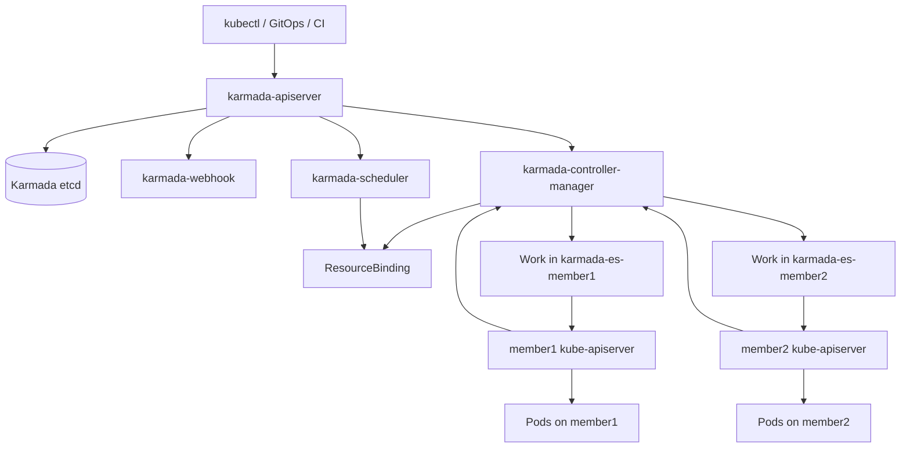
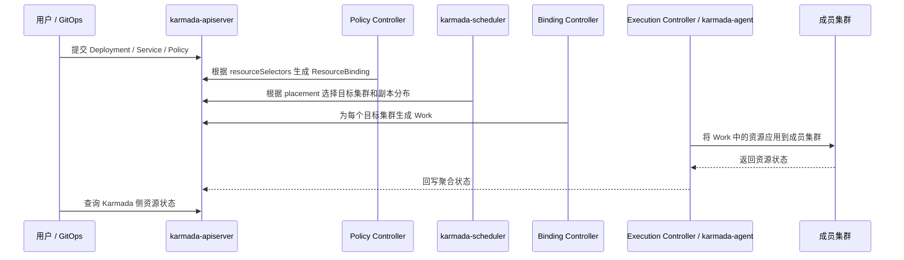

# Karmada 是什么

## 一句话理解

Karmada 是一个面向 Kubernetes 的多集群、多云、混合云编排系统。它不是把多个集群改造成一个超大 Kubernetes 集群，而是在多个独立 Kubernetes 集群之上提供一个统一控制面，让用户继续使用 Kubernetes 原生 API，再通过策略把应用分发、调度、差异化配置和故障迁移到不同成员集群。

换句话说：

> 单集群 Kubernetes 负责把 Pod 调度到 Node；Karmada 负责把 Kubernetes 资源调度到 Cluster。

这里的 Cluster 可以是不同区域、不同可用区、不同云厂商、不同数据中心，甚至是边缘侧的 Kubernetes 集群。Karmada 的核心价值在于：在尽量不改变应用 YAML 的前提下，把单集群应用管理模型扩展到多集群。

## 为什么需要 Karmada

Kubernetes 解决了单个集群内的容器编排问题，但生产环境里经常会继续遇到多集群问题。

### 1. 单集群不是天然的全局故障域

一个 Kubernetes 集群通常会绑定一个区域、一个机房、一套网络和一套控制面。即使集群内做了多副本、高可用控制面和节点池隔离，它仍然可能因为区域故障、网络故障、控制面故障、云厂商故障或大规模节点故障而整体受影响。

多集群可以把故障域继续拆开：

1. 同城多可用区部署。
2. 跨地域容灾。
3. 多云冗余。
4. 核心业务和非核心业务分集群。
5. 中心集群和边缘集群分离。

但多集群也带来了新的问题：应用应该部署在哪些集群？副本数怎么分？集群故障后怎么迁移？不同云厂商的镜像仓库、StorageClass、LoadBalancer 配置怎么处理？这些就是 Karmada 想解决的问题。

### 2. 多云和混合云不应该侵入应用 YAML

如果一个应用需要同时部署到 AWS、GCP、阿里云和自建机房，最直接的办法是维护多套 YAML：

1. AWS 用一套镜像仓库、StorageClass、Ingress 注解。
2. GCP 用另一套镜像仓库、StorageClass、Ingress 注解。
3. 自建机房可能没有云 LoadBalancer，需要走内部网关。
4. 边缘集群资源更小，需要更低的副本数或更小的 requests。

如果这些差异全部写进应用侧 Helm values 或 Kustomize overlay，应用仓库会越来越复杂。Karmada 的思路是把“资源模板”和“多集群策略”拆开：

1. 应用 YAML 尽量保持 Kubernetes 原生形态。
2. `PropagationPolicy` 决定资源去哪些集群、怎么分副本。
3. `OverridePolicy` 决定不同集群上的字段如何改写。

这样应用本身不需要理解每个集群的细节。

### 3. GitOps 解决发布流程，但不等于多集群调度

Argo CD、Flux 这类 GitOps 工具很适合解决“声明式交付”和“持续同步”。但如果只用 GitOps 管理多集群，常见方式是给每个集群建一个 Application 或 Kustomize overlay。

这种模式足够简单，也很可靠，但它没有天然解决这些问题：

1. 按集群容量动态拆分副本。
2. 按 region、zone、provider 做调度约束。
3. 集群故障后自动把副本迁移到其他集群。
4. 对同一个应用做多集群状态聚合。
5. 通过统一 API 查询多集群资源。

Karmada 可以和 GitOps 配合。GitOps 工具把资源提交到 Karmada 控制面，Karmada 再根据策略把资源分发到成员集群。

### 4. 多集群管理需要统一抽象

没有统一抽象时，多集群平台往往会变成一堆脚本、CI pipeline、Helm values、kubectl context 和人工规范。短期可以跑，长期会变成运维负担。

Karmada 提供的统一抽象主要包括：

| 抽象 | 解决的问题 |
| --- | --- |
| `Cluster` | 成员集群注册、状态、标签、区域、云厂商、污点 |
| `PropagationPolicy` | 资源选择、集群选择、副本调度、扩散约束 |
| `OverridePolicy` | 不同集群上的字段差异化改写 |
| `ResourceBinding` | 某个资源最终绑定到哪些集群 |
| `Work` | 实际下发到某个成员集群的资源包 |
| `MultiClusterService` | 多集群服务发现和跨集群访问 |
| `Failover` | 集群故障时的资源迁移策略 |

## Karmada 不是什么

理解 Karmada 时，也要避免把它的边界想得过大。

1. Karmada 不是 Cluster API。Cluster API 偏向创建和生命周期管理 Kubernetes 集群，Karmada 偏向把应用编排到已有集群。
2. Karmada 不是 CNI。它不会自动打通多个集群之间的 Pod 网络。跨集群访问仍然需要 Submariner、Cilium Cluster Mesh、服务网格、云网络或其他网络方案。
3. Karmada 不是存储复制系统。StatefulSet 可以被分发，但数据复制、RPO、RTO、主从切换仍然需要数据库、中间件或存储系统自己保证。
4. Karmada 不是 Service Mesh。它可以做多集群服务发现和入口编排，但 L7 流量治理、熔断、限流、mTLS 通常还是服务网格或网关的工作。
5. Karmada 不是把所有集群变成一个共享 kube-scheduler 的大集群。Karmada 的调度单位是集群，成员集群内部的 Pod 到 Node 调度仍然由各自的 kube-scheduler 完成。

# 核心架构

## 控制面和成员集群

Karmada 的整体结构可以拆成两层：

1. **Karmada 控制面**：运行 `karmada-apiserver`、`karmada-controller-manager`、`karmada-scheduler`、`karmada-webhook`、etcd 等组件。
2. **成员集群**：真正运行业务 Pod 的 Kubernetes 集群。

Karmada 控制面一般会部署在一个 host cluster 里，但要注意：用户提交业务资源时连接的是 `karmada-apiserver`，不是 host cluster 原生的 kube-apiserver。业务 Deployment、Service、ConfigMap 等资源会先存到 Karmada 控制面的 etcd 中，然后由 Karmada 控制器分发到成员集群。



从用户角度看，Karmada 暴露的是一个 Kubernetes 风格的 API Server。你仍然可以使用 `kubectl apply -f deployment.yaml`，也可以使用 Argo CD、Flux、Helm 等工具，只是目标 kubeconfig 指向 Karmada 控制面。

## 资源分发流程

一个 Deployment 从提交到最终在成员集群运行，大致会经历下面的流程：



关键点是：Karmada 自己不会在控制面创建业务 Pod。提交到 `karmada-apiserver` 的 Deployment 只是资源模板，真正的 Deployment 会被下发到成员集群，再由成员集群自己的 Deployment Controller 创建 ReplicaSet 和 Pod。

## 主要组件

### 1. karmada-apiserver

`karmada-apiserver` 是 Karmada 控制面的入口。它基于 Kubernetes 的 `kube-apiserver` 实现，因此天然兼容 Kubernetes API 语义。

它负责：

1. 暴露 Kubernetes 原生 API，例如 Deployment、Service、ConfigMap。
2. 暴露 Karmada 自己的 API，例如 Cluster、PropagationPolicy、OverridePolicy、ResourceBinding、Work。
3. 接收 `kubectl`、`karmadactl`、GitOps 工具、控制器等客户端请求。
4. 把控制面对象存入 Karmada 自己的 etcd。

这种设计是 Karmada 能和 Kubernetes 生态兼容的基础。已有工具只要能对接 Kubernetes API，就有机会对接 Karmada。

### 2. etcd

Karmada 使用 etcd 保存控制面数据，包括：

1. 用户提交的资源模板。
2. Karmada 策略对象。
3. 成员集群对象和状态。
4. ResourceBinding、Work 等内部对象。

生产环境里，Karmada 的 etcd 要按控制面关键组件对待，需要高可用、备份、恢复演练和容量规划。成员集群中的资源已经下发后，即使 Karmada 控制面短时间不可用，成员集群中的业务 Pod 通常仍会继续运行，但新的策略变更、状态聚合、故障迁移会受到影响。

### 3. karmada-controller-manager

`karmada-controller-manager` 是 Karmada 的控制器集合。它会监听 Karmada API 对象，并把期望状态推进到成员集群。

常见控制器包括：

1. **Cluster Controller**：管理成员集群生命周期和状态。
2. **Policy Controller**：监听 `PropagationPolicy` / `ClusterPropagationPolicy`，根据 `resourceSelectors` 找到匹配资源。
3. **Binding Controller**：根据调度结果为目标集群生成 `Work`。
4. **Execution Controller**：在 Push 模式下把 `Work` 中的资源写入成员集群。
5. **Status Controller**：收集成员集群上的资源状态，并回写到 Karmada 控制面。
6. **Failover 相关控制器**：在集群不可用或被打上特定 taint 时触发迁移。

可以把 `karmada-controller-manager` 理解成 Karmada 的核心执行层。策略对象本身只是声明，真正让资源下发、状态同步、故障迁移发生的是这些控制器。

### 4. karmada-scheduler

`karmada-scheduler` 负责把资源调度到成员集群。

它和 kube-scheduler 的区别非常重要：

| 调度器 | 调度对象 | 调度目标 |
| --- | --- | --- |
| kube-scheduler | Pod | Node |
| karmada-scheduler | Kubernetes 资源模板 | Cluster |

例如用户提交一个 6 副本 Deployment，Karmada scheduler 不会决定每个 Pod 放在哪台 Node 上，而是决定这个 Deployment 应该被放到哪些成员集群，以及每个集群应该拿到多少副本。之后，成员集群内部的 kube-scheduler 再把 Pod 调度到具体 Node。

`karmada-scheduler` 会参考：

1. `PropagationPolicy` 中的 placement。
2. 成员集群的标签、字段、污点和健康状态。
3. 成员集群资源容量和可调度副本数。
4. 扩散约束，例如跨 region、zone、cluster。
5. 副本调度策略，例如复制、拆分、按权重拆分。
6. workload affinity / anti-affinity。

### 5. karmada-webhook

`karmada-webhook` 提供 mutating 和 validating webhook。

典型职责包括：

1. 给资源设置默认值。
2. 校验 Karmada API 对象是否合法。
3. 阻止明显有冲突或不完整的策略。
4. 在某些场景下辅助注入控制面需要的字段。

和 Kubernetes webhook 一样，mutating webhook 可以修改入站对象，validating webhook 负责最终校验。

### 6. karmada-aggregated-apiserver

`karmada-aggregated-apiserver` 基于 Kubernetes API Aggregation Layer 扩展 Karmada API。它常用于提供聚合 API、集群代理和跨集群资源访问能力。

例如通过 Karmada 控制面访问成员集群资源时，背后就可能用到 aggregated API 和 proxy 能力。

### 7. kube-controller-manager

Karmada 控制面里也会运行一个 `kube-controller-manager`，但它并不是为了在 Karmada 控制面里创建业务 Pod。

当用户把 Deployment 提交到 `karmada-apiserver` 时，这个 Deployment 会被记录在 Karmada 控制面 etcd 中，然后同步到成员集群。它不会在 Karmada 控制面里像普通 Kubernetes 集群那样直接被 Deployment Controller reconcile 成 Pod。

Karmada 只继承部分 Kubernetes 控制器，用来保持必要的 Kubernetes API 行为和用户体验。

### 8. karmada-agent

`karmada-agent` 只在 Pull 模式中需要。它通常部署在成员集群侧，负责：

1. 把成员集群注册到 Karmada 控制面。
2. 从 Karmada 控制面拉取属于本集群的 `Work`。
3. 把 `Work` 中的资源应用到本集群。
4. 上报成员集群状态和资源状态。
5. 维护 Pull 模式下的 Lease 心跳。

如果 Karmada 控制面无法直接访问成员集群 kube-apiserver，例如成员集群在 NAT、边缘网络或客户 VPC 后面，Pull 模式会更合适。

## 可选组件和插件

### 1. karmada-scheduler-estimator

`karmada-scheduler-estimator` 用来给调度器提供更准确的集群可调度能力估算。

只看集群总资源是不够的。一个集群总共有 100 核 CPU，不代表一定能放下一个需要 16 核的 Pod，因为资源可能被碎片化在不同节点上。estimator 会基于成员集群节点和资源请求估算某个 workload 实际还能调度多少副本，从而避免“总量足够但每个节点都放不下”的问题。

### 2. karmada-descheduler

`karmada-descheduler` 用来做重调度。它关注的是已经分发出去的副本是否仍然放在合适的集群上。

例如：

1. 某个成员集群资源变少。
2. 某些副本实际状态发生变化。
3. 动态副本拆分策略需要重新平衡。
4. 集群权重变化，需要让副本重新分布。

它不会直接移动 Pod，而是触发 Karmada 重新计算分布，然后通过资源变更让成员集群完成更新。

### 3. karmada-search

`karmada-search` 提供多集群资源搜索和资源代理能力。

在多集群环境里，排查问题时经常需要回答：

1. 某个 Deployment 分布在哪些集群？
2. 某个 Pod 在哪个成员集群？
3. 哪些集群里存在某个 Service？
4. 某类资源的事件分布是什么？

如果每次都手动切 kubeconfig context，效率很低。`karmada-search` 就是为全局资源视图服务的。

# 集群注册模式：Push 和 Pull

Karmada 支持 Push 和 Pull 两种成员集群注册模式。核心区别是：谁主动访问谁。

| 模式 | 工作方式 | 优点 | 适合场景 |
| --- | --- | --- | --- |
| Push | Karmada 控制面直接访问成员集群 kube-apiserver | 架构简单，控制面直接管理 | 同机房、同 VPC、网络可达、集群数量较少 |
| Pull | 成员集群运行 `karmada-agent`，主动从控制面拉取 Work | 控制面不必直接访问成员集群，适合隔离网络和大规模集群 | 边缘集群、NAT 后集群、客户侧集群、大规模集群 |

Push 模式注册常用命令：

```bash
karmadactl join member1 \
  --kubeconfig=<karmada-kubeconfig> \
  --cluster-kubeconfig=<member1-kubeconfig>
```

Pull 模式注册常用命令：

```bash
karmadactl register <karmada-apiserver-address> \
  --token <bootstrap-token> \
  --discovery-token-ca-cert-hash <hash>
```

注册后可以查看集群：

```bash
kubectl get clusters
kubectl describe cluster member1
```

一个成员集群在 Karmada 中会对应一个 `Cluster` 对象。这个对象的名字会在调度策略中被频繁使用，例如：

```yaml
placement:
  clusterAffinity:
    clusterNames:
      - member1
      - member2
```

# 核心概念

## 1. Cluster

`Cluster` 表示一个被 Karmada 管理的成员 Kubernetes 集群。

一个 `Cluster` 通常包含：

1. 集群名称。
2. 访问方式和 sync mode。
3. provider、region、zone 等字段。
4. labels。
5. taints。
6. Ready 状态。
7. API Server 可达性和版本信息。

集群上的 label 和字段是调度的基础。例如：

```bash
kubectl label cluster member1 location=cn provider=aws env=prod
kubectl label cluster member2 location=sg provider=gcp env=prod
```

之后策略可以按 label 选择集群：

```yaml
placement:
  clusterAffinity:
    labelSelector:
      matchLabels:
        env: prod
```

也可以按内置字段选择：

```yaml
placement:
  clusterAffinity:
    fieldSelector:
      matchExpressions:
        - key: region
          operator: In
          values:
            - cn-east-1
            - cn-north-1
```

Cluster 也支持类似 Kubernetes Node taint 的机制。被打上 `NoSchedule` taint 的集群不会接收新的 workload，除非策略里声明了对应 toleration。被打上 `NoExecute` taint 的集群可以触发已有 workload 的迁移。

## 2. Resource Template

Resource Template 是用户提交给 Karmada 的原始 Kubernetes 资源模板。

常见资源包括：

1. Deployment
2. StatefulSet
3. DaemonSet
4. Job / CronJob
5. Service
6. ConfigMap
7. Secret
8. Ingress
9. CRD 和自定义资源

Karmada 尽量复用 Kubernetes 原生 API，这意味着很多已有 YAML 可以直接提交到 Karmada 控制面。例如：

```yaml
apiVersion: apps/v1
kind: Deployment
metadata:
  name: nginx
  labels:
    app: nginx
spec:
  replicas: 6
  selector:
    matchLabels:
      app: nginx
  template:
    metadata:
      labels:
        app: nginx
    spec:
      containers:
        - name: nginx
          image: nginx:1.25
          resources:
            requests:
              cpu: 100m
              memory: 128Mi
```

但只提交 Deployment 不够，因为 Karmada 还需要知道这个 Deployment 应该去哪些集群。这就需要 PropagationPolicy。

## 3. PropagationPolicy 和 ClusterPropagationPolicy

`PropagationPolicy` 用来描述资源如何传播到成员集群。它的核心字段有两个：

1. `resourceSelectors`：选择哪些资源。
2. `placement`：选择哪些集群，以及副本怎么分布。

`PropagationPolicy` 是 namespace 级策略，只影响同 namespace 下的资源。`ClusterPropagationPolicy` 是集群级策略，可以影响集群范围内匹配的资源。

一个最小示例：

```yaml
apiVersion: policy.karmada.io/v1alpha1
kind: PropagationPolicy
metadata:
  name: nginx-propagation
  namespace: default
spec:
  resourceSelectors:
    - apiVersion: apps/v1
      kind: Deployment
      name: nginx
  placement:
    clusterAffinity:
      clusterNames:
        - member1
        - member2
```

这表示：把 `default/nginx` 这个 Deployment 分发到 `member1` 和 `member2` 的候选集群中。

更完整一点的示例：

```yaml
apiVersion: policy.karmada.io/v1alpha1
kind: PropagationPolicy
metadata:
  name: nginx-propagation
  namespace: default
spec:
  resourceSelectors:
    - apiVersion: apps/v1
      kind: Deployment
      name: nginx
    - apiVersion: v1
      kind: Service
      name: nginx
  propagateDeps: true
  placement:
    clusterAffinity:
      clusterNames:
        - member1
        - member2
    spreadConstraints:
      - spreadByField: cluster
        minGroups: 2
        maxGroups: 2
    replicaScheduling:
      replicaSchedulingType: Divided
      replicaDivisionPreference: Weighted
      weightPreference:
        staticWeightList:
          - targetCluster:
              clusterNames:
                - member1
            weight: 1
          - targetCluster:
              clusterNames:
                - member2
            weight: 2
```

假设 Deployment 有 6 个副本，那么上面的静态权重会让 `member1` 获得大约 2 个副本，`member2` 获得大约 4 个副本。`spreadConstraints` 保证实际选择 2 个 cluster 维度的分组。

### resourceSelectors

`resourceSelectors` 用来选择资源。它可以按：

1. `apiVersion`
2. `kind`
3. `name`
4. `namespace`
5. `labelSelector`

选择单个资源：

```yaml
resourceSelectors:
  - apiVersion: apps/v1
    kind: Deployment
    name: nginx
```

按 label 选择一组资源：

```yaml
resourceSelectors:
  - apiVersion: apps/v1
    kind: Deployment
    labelSelector:
      matchLabels:
        app: payment
```

如果配合 `propagateDeps: true`，Karmada 可以自动传播某些被 workload 引用的依赖资源，例如 Deployment 引用的 ConfigMap 和 Secret。实际生产里仍建议谨慎使用，尤其是 Secret，需要明确边界和审计规则。

### clusterAffinity

`clusterAffinity` 定义候选集群集合。它只是候选集，不一定表示最终所有集群都会被选中。

常见写法包括按名字选：

```yaml
placement:
  clusterAffinity:
    clusterNames:
      - member1
      - member2
```

按 label 选：

```yaml
placement:
  clusterAffinity:
    labelSelector:
      matchLabels:
        env: prod
```

按字段选：

```yaml
placement:
  clusterAffinity:
    fieldSelector:
      matchExpressions:
        - key: provider
          operator: In
          values:
            - aws
        - key: region
          operator: NotIn
          values:
            - us-west-1
```

也可以显式排除：

```yaml
placement:
  clusterAffinity:
    exclude:
      - member3
```

### clusterAffinities

`clusterAffinities` 用来定义多个有顺序的候选集群组，适合主备、溢出和优先级场景。

例如优先使用自建 IDC，不够时溢出到云上：

```yaml
placement:
  clusterAffinities:
    - affinityName: idc-primary
      clusterNames:
        - idc-cluster1
      overflowAffinities:
        - affinityName: cloud-overflow
          clusterNames:
            - cloud-cluster1
            - cloud-cluster2
  replicaScheduling:
    replicaSchedulingType: Divided
    replicaDivisionPreference: Weighted
    weightPreference:
      dynamicWeight: AvailableReplicas
```

这类策略适合成本敏感场景：平时优先跑在自建资源池，峰值或资源不足时再溢出到云资源池。

### spreadConstraints

`spreadConstraints` 用来控制资源跨拓扑域扩散。

常见目标：

1. 至少跨 2 个集群。
2. 至少跨 2 个 region。
3. 每个 region 只选 1 个集群。
4. 不让所有副本集中在同一个故障域。

示例：

```yaml
placement:
  replicaScheduling:
    replicaSchedulingType: Duplicated
  spreadConstraints:
    - spreadByField: region
      minGroups: 2
      maxGroups: 2
    - spreadByField: cluster
      minGroups: 2
      maxGroups: 2
```

这表示希望 workload 扩散到 2 个 region，并且总共选择 2 个 cluster。

### clusterTolerations

Karmada 中的 Cluster 可以被打 taint，策略可以通过 `clusterTolerations` 容忍这些 taint。

例如给集群打 taint：

```bash
karmadactl taint clusters member1 dedicated=special-user:NoSchedule
```

策略中声明 toleration：

```yaml
placement:
  clusterTolerations:
    - key: dedicated
      value: special-user
      effect: NoSchedule
```

这和 Kubernetes Node taint / toleration 的语义非常接近，只是作用对象从 Node 变成了 Cluster。

## 4. 副本调度策略

Karmada 对带 `replicas` 字段的 workload 支持副本调度策略。最常见的是 Deployment、StatefulSet 以及一些自定义 workload。

### Duplicated

`Duplicated` 表示每个目标集群都获得完整副本数。

```yaml
placement:
  clusterAffinity:
    clusterNames:
      - member1
      - member2
  replicaScheduling:
    replicaSchedulingType: Duplicated
```

如果 Deployment 写的是 `replicas: 3`，那么 `member1` 有 3 个副本，`member2` 也有 3 个副本，总共 6 个副本。

适合场景：

1. 多活部署。
2. 每个区域都需要一份完整服务能力。
3. 边缘集群需要本地常驻副本。
4. 灾备集群需要预热副本。

### Divided + Aggregated

`Divided` 表示总副本数在多个集群之间拆分。`Aggregated` 表示尽量把副本放到更少的集群中。

```yaml
placement:
  clusterAffinity:
    clusterNames:
      - member1
      - member2
  replicaScheduling:
    replicaSchedulingType: Divided
    replicaDivisionPreference: Aggregated
```

如果 Deployment 是 6 副本，Karmada 会尽量用较少集群承载这 6 个副本。它适合成本优化或希望减少跨集群分布复杂度的场景。

### Divided + Weighted

`Weighted` 表示按权重拆分副本。

静态权重：

```yaml
placement:
  replicaScheduling:
    replicaSchedulingType: Divided
    replicaDivisionPreference: Weighted
    weightPreference:
      staticWeightList:
        - targetCluster:
            clusterNames:
              - member1
          weight: 1
        - targetCluster:
            clusterNames:
              - member2
          weight: 2
```

动态权重：

```yaml
placement:
  replicaScheduling:
    replicaSchedulingType: Divided
    replicaDivisionPreference: Weighted
    weightPreference:
      dynamicWeight: AvailableReplicas
```

动态权重会根据成员集群当前能容纳的副本数来计算分布。这个能力通常需要配合更准确的资源估算，尤其是在资源碎片明显的大集群中。

## 5. OverridePolicy 和 ClusterOverridePolicy

`OverridePolicy` 用来描述资源下发到不同集群前应该如何改写。

常见改写场景：

1. 不同 region 使用不同镜像仓库。
2. 不同云厂商使用不同 StorageClass。
3. 不同集群添加不同 annotation。
4. 边缘集群调小 requests / limits。
5. 特定集群替换 ConfigMap 中的配置项。
6. 不同环境使用不同启动参数。

`OverridePolicy` 是 namespace 级策略，`ClusterOverridePolicy` 是集群级策略。对于 namespaced 资源，通常先应用 `ClusterOverridePolicy`，再应用 `OverridePolicy`。

示例：给不同 region 添加镜像 registry，并给某个集群改写 CPU limit。

```yaml
apiVersion: policy.karmada.io/v1alpha1
kind: ClusterOverridePolicy
metadata:
  name: nginx-override
spec:
  resourceSelectors:
    - apiVersion: apps/v1
      kind: Deployment
      labelSelector:
        matchLabels:
          app: nginx
  overrideRules:
    - targetCluster:
        fieldSelector:
          matchExpressions:
            - key: region
              operator: In
              values:
                - cn-east-1
      overriders:
        imageOverrider:
          - component: Registry
            operator: add
            value: registry.cn-east-1.example.com
    - targetCluster:
        clusterNames:
          - edge-member1
      overriders:
        plaintext:
          - path: /spec/template/spec/containers/0/resources/limits/cpu
            operator: replace
            value: 500m
```

Karmada 提供多种 overrider：

| Overrider | 用途 |
| --- | --- |
| `imageOverrider` | 改写镜像 registry、repository、tag、digest |
| `commandOverrider` | 改写 container command |
| `argsOverrider` | 改写 container args |
| `labelsOverrider` | 改写 labels |
| `annotationsOverrider` | 改写 annotations |
| `plaintext` | 类似 JSON Patch，按 path 改写字段 |
| `fieldOverrider` | 改写 YAML / JSON 字段里的局部内容 |

OverridePolicy 是多云落地时非常关键的能力。它让应用模板保持相对统一，把环境差异移到平台策略里。

## 6. ResourceBinding 和 Work

`ResourceBinding` 和 `Work` 通常不是用户手写的对象，而是 Karmada 控制器生成的内部对象。

### ResourceBinding

`ResourceBinding` 表示一个资源模板和传播策略之间的绑定关系。

它会记录：

1. 被传播的资源是谁。
2. 使用了哪个策略。
3. 目标集群有哪些。
4. 每个集群分到多少副本。
5. 调度状态和聚合状态。

如果是 cluster-scoped 资源，对应对象是 `ClusterResourceBinding`。

可以通过下面命令排查：

```bash
kubectl get resourcebindings -n default
kubectl describe resourcebinding <binding-name> -n default
```

### Work

`Work` 是最终下发到某个成员集群的资源包。Karmada 会为每个成员集群创建一个执行空间 namespace，通常形如：

```text
karmada-es-<cluster-name>
```

例如：

```bash
kubectl get work -n karmada-es-member1
kubectl describe work <work-name> -n karmada-es-member1
```

可以把 `Work` 理解成“发给某个成员集群的任务单”。Execution Controller 或 `karmada-agent` 会读取 Work，然后把其中的 manifest 应用到成员集群。

# 一个完整例子

下面用一个简单的 Nginx 应用展示 Karmada 的基本使用方式。

## 1. 创建资源模板

```yaml
apiVersion: apps/v1
kind: Deployment
metadata:
  name: nginx
  namespace: default
  labels:
    app: nginx
spec:
  replicas: 6
  selector:
    matchLabels:
      app: nginx
  template:
    metadata:
      labels:
        app: nginx
    spec:
      containers:
        - name: nginx
          image: nginx:1.25
          ports:
            - containerPort: 80
          resources:
            requests:
              cpu: 100m
              memory: 128Mi
            limits:
              cpu: 500m
              memory: 256Mi
---
apiVersion: v1
kind: Service
metadata:
  name: nginx
  namespace: default
  labels:
    app: nginx
spec:
  selector:
    app: nginx
  ports:
    - port: 80
      targetPort: 80
```

## 2. 创建传播策略

```yaml
apiVersion: policy.karmada.io/v1alpha1
kind: PropagationPolicy
metadata:
  name: nginx-propagation
  namespace: default
spec:
  resourceSelectors:
    - apiVersion: apps/v1
      kind: Deployment
      name: nginx
    - apiVersion: v1
      kind: Service
      name: nginx
  placement:
    clusterAffinity:
      labelSelector:
        matchLabels:
          env: prod
    spreadConstraints:
      - spreadByField: cluster
        minGroups: 2
        maxGroups: 2
    replicaScheduling:
      replicaSchedulingType: Divided
      replicaDivisionPreference: Weighted
      weightPreference:
        dynamicWeight: AvailableReplicas
```

含义：

1. 选择 `default/nginx` Deployment 和 Service。
2. 候选集群必须带有 `env=prod` 标签。
3. 最终选择 2 个集群。
4. 6 个副本按成员集群可承载能力动态拆分。

## 3. 应用到 Karmada 控制面

```bash
kubectl --kubeconfig=<karmada-kubeconfig> apply -f nginx.yaml
kubectl --kubeconfig=<karmada-kubeconfig> apply -f nginx-propagation.yaml
```

## 4. 查看 Karmada 侧状态

```bash
kubectl --kubeconfig=<karmada-kubeconfig> get clusters
kubectl --kubeconfig=<karmada-kubeconfig> get propagationpolicy -n default
kubectl --kubeconfig=<karmada-kubeconfig> get resourcebindings -n default
```

查看 Work：

```bash
kubectl --kubeconfig=<karmada-kubeconfig> get work -A
```

## 5. 查看成员集群侧状态

```bash
kubectl --kubeconfig=<member-kubeconfig> --context=member1 get deploy,svc,pod -n default
kubectl --kubeconfig=<member-kubeconfig> --context=member2 get deploy,svc,pod -n default
```

如果一切正常，可以看到 Deployment 和 Service 已经出现在成员集群里，Pod 则由成员集群自己的控制器和调度器创建。

# 多集群服务发现和访问

应用被分发到多个集群后，下一个问题是服务访问。

Karmada 支持多集群服务治理相关能力，包括：

1. 基于 Multi-Cluster Services API 的 `ServiceExport` / `ServiceImport`。
2. `MultiClusterService`，让用户以接近原生 Service 的方式访问跨集群后端。
3. `MultiClusterIngress`，把外部流量导入多集群服务。

但要注意：服务发现不等于网络打通。

多集群服务通常需要满足几个前提：

1. 成员集群之间的 Pod 网络或 Service 网络可达。
2. 不同集群的 Pod CIDR 和 Service CIDR 不冲突。
3. DNS、EndpointSlice 或服务导入机制配置正确。
4. 跨集群访问路径的安全策略、防火墙和网关策略允许流量通过。

如果成员集群网络不互通，Karmada 可以帮你分发 ServiceExport / ServiceImport，但请求仍然无法凭空跨网络到达后端 Pod。

一个典型模式是：

1. 在 `member1` 部署服务提供方。
2. 创建 `ServiceExport` 并传播到 `member1`。
3. 在 `member2` 创建或同步 `ServiceImport` / derived Service。
4. `member2` 中的客户端通过导入后的 Service 访问 `member1` 的后端。

在实际生产中，跨集群服务访问通常会和 Submariner、Cilium Cluster Mesh、服务网格、云厂商私网互通或统一网关结合使用。

# 故障迁移

Karmada 的 failover 能力用于处理成员集群不可用或不希望继续承载 workload 的场景。

## 集群故障如何判断

Karmada 会维护成员集群状态。不同模式下心跳来源不同：

1. Push 模式：控制面中的 clusterStatus controller 周期性访问成员集群。
2. Pull 模式：`karmada-agent` 上报 `Cluster` status，并维护 Lease。

如果集群在配置的时间内不可达，或者健康检查持续失败，`Cluster` 的 Ready condition 可能变成 `False` 或 `Unknown`。

可以查看：

```bash
kubectl describe cluster member1
```

## taint 和迁移

Karmada 可以通过 Cluster taint 控制调度和迁移：

1. `NoSchedule`：阻止新的 workload 调度到该集群。
2. `NoExecute`：触发已有 workload 从该集群迁移。

例如：

```bash
karmadactl taint clusters member1 maintenance=true:NoSchedule
karmadactl taint clusters member1 unavailable=true:NoExecute
```

当某个集群被打上 `NoExecute` taint 且策略允许 failover 时，Karmada 可以把受影响的 workload 迁移到其他满足条件的集群。

## failover 配置

Karmada 的集群故障迁移通过 feature gate 控制。以官方 v1.17 文档为参考，`Failover` 仍是 Beta 能力，需要在 `karmada-controller-manager` 显式开启：

```bash
--feature-gates=Failover=true
```

策略中可以配置：

```yaml
apiVersion: policy.karmada.io/v1alpha1
kind: PropagationPolicy
metadata:
  name: nginx-propagation
spec:
  failover:
    cluster:
      purgeMode: Gracefully
  resourceSelectors:
    - apiVersion: apps/v1
      kind: Deployment
      name: nginx
  placement:
    clusterAffinity:
      clusterNames:
        - member1
        - member2
        - member3
    spreadConstraints:
      - spreadByField: cluster
        minGroups: 1
        maxGroups: 1
```

`purgeMode` 影响迁移时如何处理原集群上的旧实例：

| 模式 | 含义 | 适合场景 |
| --- | --- | --- |
| `Gracefully` | 等新集群上的应用健康或超时后再清理旧实例 | 无状态服务、允许短暂双跑的服务 |
| `Directly` | 直接清理旧实例后再迁移 | 不允许双跑的任务，例如某些 exactly-once 计算任务 |

## 有状态应用要格外谨慎

无状态服务的 failover 相对简单：只要镜像、配置、依赖和流量入口可用，重新拉起副本即可。

有状态应用更复杂。数据库、消息队列、Flink、Spark Streaming、业务状态机等应用需要考虑：

1. 数据是否已经复制到目标集群。
2. 旧实例和新实例是否会双写。
3. checkpoint / savepoint 是否可用。
4. 存储路径和权限是否一致。
5. 故障恢复后如何避免 split brain。

Karmada 从 v1.15 开始为集群 failover 增加了状态保留相关能力，可以在 failover 时通过 JSONPath 提取状态并注入到新集群对象中。这个能力仍然需要应用和外部系统配合，例如 Flink checkpoint、Kyverno 注入规则和共享存储路径。它不能替代应用层的数据一致性设计。

# 安装和基本操作

Karmada 支持多种安装方式：

1. `karmadactl init`
2. `kubectl karmada init`
3. Helm Chart
4. Karmada Operator
5. 二进制部署
6. 源码开发环境脚本

本地体验时，最常见的是使用 kind 和官方脚本。生产环境更关注 HA、证书、etcd、备份、监控和升级。

## 安装 CLI

安装 `karmadactl`：

```bash
curl -s https://raw.githubusercontent.com/karmada-io/karmada/master/hack/install-cli.sh | sudo bash
```

也可以安装 `kubectl karmada` 插件。两者命令能力基本一致，只是使用形式不同。

## 初始化控制面

在一个已有 Kubernetes 集群中安装 Karmada：

```bash
karmadactl init --kubeconfig=<host-cluster-kubeconfig>
```

高可用安装时，需要考虑 `karmada-apiserver` 和 etcd 副本：

```bash
karmadactl init \
  --karmada-apiserver-replicas 3 \
  --etcd-replicas 3 \
  --etcd-storage-mode PVC \
  --storage-classes-name <storage-class> \
  --kubeconfig=<host-cluster-kubeconfig>
```

安装完成后检查：

```bash
kubectl --kubeconfig=<host-cluster-kubeconfig> get pods -n karmada-system
```

## 加入成员集群

Push 模式：

```bash
karmadactl join member1 \
  --kubeconfig=<karmada-kubeconfig> \
  --cluster-kubeconfig=<member1-kubeconfig>
```

查看：

```bash
kubectl --kubeconfig=<karmada-kubeconfig> get clusters
```

给集群打标签：

```bash
kubectl --kubeconfig=<karmada-kubeconfig> label cluster member1 env=prod region=cn-east-1
```

暂停某个集群接收新 workload：

```bash
karmadactl taint clusters member1 maintenance=true:NoSchedule
```

恢复：

```bash
karmadactl taint clusters member1 maintenance=true:NoSchedule-
```

# 和其他方案的关系

## Karmada vs Kubernetes Federation

Karmada 延续了 Kubernetes Federation v1/v2 的一些思想，但它不是简单的 Federated API 复刻。

Kubernetes Federation v2 里的一个核心思路是为每类资源定义 federated type，例如 FederatedDeployment。Karmada 更强调 Kubernetes 原生 API 兼容，用户可以直接提交 Deployment、Service、ConfigMap 等原生资源，再通过独立策略描述多集群调度和差异化配置。

这降低了从单集群迁移到多集群的成本。

## Karmada vs Cluster API

Cluster API 管的是“集群怎么创建、升级、扩容和销毁”。Karmada 管的是“应用资源怎么分发到多个集群”。

两者可以配合：

1. Cluster API 创建多套 Kubernetes 集群。
2. Karmada 注册这些集群。
3. GitOps 把应用和策略提交到 Karmada。
4. Karmada 负责跨集群编排。

## Karmada vs Argo CD / Flux

Argo CD / Flux 解决 GitOps 交付。Karmada 解决多集群调度和分发。

常见组合方式：

1. Argo CD 连接 Karmada 控制面。
2. Git 仓库中保存 Deployment、Service、PropagationPolicy、OverridePolicy。
3. Argo CD 把这些资源同步到 Karmada。
4. Karmada 根据策略分发到成员集群。

这样 GitOps 保持交付闭环，Karmada 负责多集群策略执行。

## Karmada vs Rancher / ACM / 多云管理平台

Rancher、Red Hat ACM、云厂商多集群平台通常覆盖更宽的管理面，包括集群生命周期、权限、可视化、策略、安全、监控、运维等。

Karmada 更聚焦开放的多集群 Kubernetes 编排能力。它可以作为底层编排引擎，也可以被更上层平台集成。

# 生产实践建议

## 1. 先设计集群标签体系

Karmada 的调度策略高度依赖集群元数据。上线前应该先统一标签和字段规范。

常见标签：

```text
env=prod
region=cn-east-1
zone=cn-east-1a
provider=aws
cluster-type=edge
network=private
capacity-tier=large
compliance=finance
```

不要让每个团队自由发明标签。标签体系不稳定，策略就会变得不可预测。

## 2. 区分平台策略和业务策略

建议把策略分层：

1. 平台层 `ClusterPropagationPolicy`：通用命名空间、基础 CRD、公共配置、安全基线。
2. 业务层 `PropagationPolicy`：某个 namespace 内应用自己的分发规则。
3. 平台层 `ClusterOverridePolicy`：公共镜像仓库、云厂商差异。
4. 业务层 `OverridePolicy`：应用自己的小范围差异。

不要所有东西都用 `ClusterPropagationPolicy`。范围越大，误匹配的风险越高。

## 3. 对 conflictResolution 保持保守

当目标成员集群已经存在同名资源时，Karmada 需要决定如何处理冲突。生产里通常要避免默认覆盖已有资源，除非你明确知道这些资源应该被 Karmada 接管。

接入已有集群时，建议先做审计：

```bash
kubectl --context=member1 get deploy,svc,cm,secret -A
```

再决定哪些资源由 Karmada 管，哪些继续由原有平台或团队管理。

## 4. Secret 和 ConfigMap 要有清晰边界

多集群传播 Secret 很方便，但也容易扩大敏感信息暴露范围。

建议：

1. 不要用宽泛 selector 自动传播所有 Secret。
2. 对 Secret 使用独立 policy。
3. 用命名规范或 label 明确哪些 Secret 允许跨集群。
4. 配合 External Secrets、Vault 或云厂商 Secret Manager 管理敏感数据。
5. 对成员集群的访问权限做最小化控制。

## 5. 无状态服务先上，有状态服务后上

Karmada 最适合先承接无状态服务、多副本服务、读多写少服务、批处理任务和边缘分发。

有状态服务要单独设计：

1. 数据复制方案。
2. 主从或多主一致性。
3. failover 流程。
4. 备份恢复。
5. 跨集群网络延迟。
6. 回切流程。

不要因为 Karmada 能分发 StatefulSet，就默认数据库可以跨集群透明迁移。

## 6. 把 Karmada 控制面当成关键基础设施

生产 Karmada 控制面至少要考虑：

1. `karmada-apiserver` 多副本。
2. etcd 多副本和定期备份。
3. controller-manager 和 scheduler 高可用。
4. webhook 证书续期。
5. 控制面资源 request / limit。
6. API Server 审计日志。
7. Prometheus 指标和告警。
8. 版本升级和回滚预案。

Karmada 控制面短时间故障不一定会让已运行业务立刻失败，但它会影响多集群编排、状态同步和故障迁移，所以不能按普通业务 Deployment 对待。

## 7. 明确最终一致性模型

Karmada 是声明式控制系统，不是强事务系统。

从用户提交资源，到 Karmada 生成 binding，再到 Work 下发，再到成员集群创建实际对象，再到状态回传，中间有多个异步控制循环。排查问题时要按链路看：

```text
Resource Template
  -> PropagationPolicy
  -> ResourceBinding
  -> Work
  -> Member Cluster Resource
  -> Aggregated Status
```

常用排查命令：

```bash
kubectl get propagationpolicy -n default
kubectl describe propagationpolicy nginx-propagation -n default

kubectl get resourcebindings -n default
kubectl describe resourcebinding <name> -n default

kubectl get work -A
kubectl describe work <name> -n karmada-es-member1

kubectl --context=member1 get deploy nginx -n default
kubectl --context=member1 describe deploy nginx -n default
kubectl --context=member1 get events -n default --sort-by=.metadata.creationTimestamp
```

## 8. 网络和服务发现要单独验收

应用能成功分发，不代表跨集群访问可用。

上线前至少验证：

1. 集群间 Pod CIDR / Service CIDR 是否冲突。
2. Pod 到 Pod 是否可达。
3. Service 到 Service 是否可达。
4. DNS 解析是否符合预期。
5. EndpointSlice 或 ServiceImport 是否正确生成。
6. 网络策略、防火墙、安全组是否放行。
7. 跨地域延迟是否满足业务 SLA。

# 常见问题

## 1. Karmada 控制面故障后，成员集群中的应用会不会消失？

一般不会。

已经下发到成员集群的 Deployment、Service、Pod 等资源会继续存在，并由成员集群自己的控制面继续 reconcile。Karmada 控制面故障主要影响新的资源分发、策略变更、状态聚合和故障迁移。

但如果故障期间成员集群里有人手动改了资源，Karmada 恢复后可能会根据期望状态重新覆盖这些变更。因此要明确资源 ownership。

## 2. Karmada 能不能管理不同 Kubernetes 版本的集群？

可以，但要谨慎。

Karmada 可以把资源分发到不同版本的成员集群，但目标集群必须支持对应 API。比如某个资源使用了较新 Kubernetes 版本才支持的字段，老版本成员集群可能会拒绝。

实践中建议：

1. 控制成员集群版本跨度。
2. 使用 OverridePolicy 处理版本差异。
3. 对 CRD 先确保所有目标集群都安装兼容版本。
4. 在升级前用 canary 集群验证。

## 3. 是否应该把所有资源都交给 Karmada？

不一定。

适合交给 Karmada 的资源：

1. 需要跨集群分发的业务 workload。
2. 多集群共享的基础配置。
3. 跨区域容灾服务。
4. 需要统一调度策略的批处理任务。

不一定适合的资源：

1. 只和某个集群本地基础设施相关的 DaemonSet。
2. CNI、CSI、节点监控等强集群本地属性组件。
3. 云厂商控制器和集群 bootstrap 资源。
4. 手动运维且 ownership 不清晰的历史资源。

## 4. Karmada 能不能替代 Helm values 或 Kustomize overlay？

不能完全替代，但可以减少 overlay 数量。

Helm / Kustomize 仍然适合表达应用自身的配置组合。Karmada 的 OverridePolicy 更适合表达“同一个应用下发到不同集群时的环境差异”。

一个比较清晰的边界是：

1. 应用版本、模块开关、业务配置：Helm / Kustomize。
2. 集群选择、副本分布、跨集群扩散：PropagationPolicy。
3. 镜像仓库、StorageClass、region annotation、集群特定字段：OverridePolicy。

## 5. 多集群 failover 是否可以做到完全无感？

通常不能保证完全无感。

无状态服务可以做到比较平滑，但仍然受镜像拉取、Pod 启动、健康检查、流量切换和 DNS 缓存影响。有状态服务还受数据复制、checkpoint、锁、幂等性和 split brain 风险影响。

Karmada 提供的是编排和迁移机制，不是业务连续性的全部答案。

# 总结

Karmada 的核心思想是把 Kubernetes 从单集群编排扩展到多集群编排，同时尽量保持 Kubernetes 原生 API 体验。

它的关键链路可以概括为：

```text
原生资源模板 + PropagationPolicy + OverridePolicy
  -> ResourceBinding
  -> Work
  -> 成员集群资源
  -> 状态回传和故障迁移
```

适合使用 Karmada 的场景包括：

1. 多地域部署。
2. 多云和混合云。
3. 边缘集群管理。
4. 跨集群容灾。
5. 需要按资源和拓扑动态分布副本。
6. 希望保留 Kubernetes 原生 API 和工具链。

真正落地时，重点不只是安装 Karmada，而是要设计好集群标签体系、策略边界、网络互通、权限模型、状态数据和故障恢复流程。Karmada 能把多集群编排变成声明式 API，但多集群系统本身的复杂性仍然需要工程化治理。

# 参考资料

1. [Karmada 官方文档：What is Karmada](https://karmada.io/docs/)
2. [Karmada 官方文档：Components](https://karmada.io/docs/next/core-concepts/components/)
3. [Karmada 官方文档：Architecture](https://karmada.io/docs/next/core-concepts/architecture/)
4. [Karmada 官方文档：Cluster Registration](https://karmada.io/docs/next/userguide/clustermanager/cluster-registration/)
5. [Karmada 官方文档：Propagation Policy](https://karmada.io/docs/next/userguide/scheduling/propagation-policy/)
6. [Karmada 官方文档：Override Policy](https://karmada.io/docs/userguide/scheduling/override-policy/)
7. [Karmada 官方文档：Cluster Failover](https://karmada.io/docs/userguide/failover/cluster-failover/)
8. [Karmada 官方文档：Multi-cluster Service Discovery](https://karmada.io/docs/userguide/service/multi-cluster-service/)
