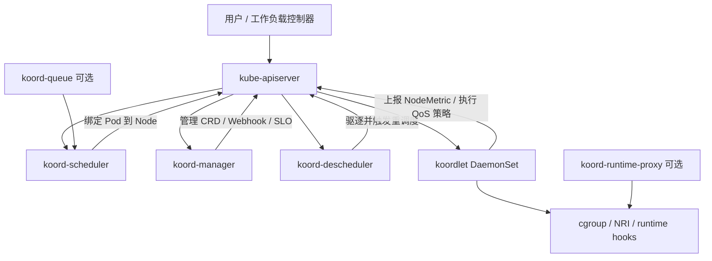
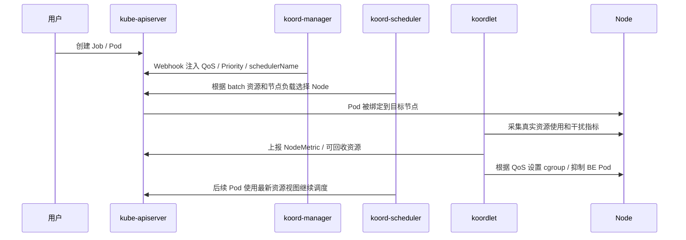

# Koordinator 是什么

## 一句话理解

Koordinator 是一个面向 Kubernetes 的 QoS 感知调度和资源优化系统。它在原生 Kubernetes 之上增强调度、混部、资源超卖、运行时隔离、重调度和异构资源管理能力，用来让在线服务、离线批任务、AI 训练、Spark / Presto 等不同类型的 workload 更高效、更稳定地运行在同一个集群里。

换句话说：

> Kubernetes 负责把 Pod 跑起来，Koordinator 进一步解决“怎么调得更准、怎么混得更稳、怎么把机器资源用得更满”的问题。

Koordinator 不是一个新的容器运行时，也不是 kubelet 的替代品。它更像是一组围绕 Kubernetes 调度链路和节点资源管理链路的增强组件：控制面负责调度、配额、Profile、SLO 和重调度，节点侧负责指标采集、资源隔离、干扰检测和 QoS 执行。

## 为什么需要 Koordinator

原生 Kubernetes 已经有 scheduler、requests / limits、PriorityClass、QoS Class、HPA、VPA、Cluster Autoscaler 等能力，但在大规模生产集群里，仍然会遇到几个典型问题。

### 1. requests 和真实用量之间有差距

Kubernetes 调度时主要看 Pod 的 `requests`。业务为了稳定性，通常会把 `requests` 设置得比平均用量高很多。这样可以降低资源不足的风险，但也会带来一个问题：节点上看起来资源已经被分配完了，实际上 CPU、内存可能长期处于低使用率。

例如一个在线服务申请了 8 核 CPU，但大多数时间只用 2 核。如果调度器只看 request，剩下的 6 核就很难被合理利用。Koordinator 的混部模型就是希望识别这些“已分配但短期不会使用”的资源，把它们以可回收资源的形式提供给低优先级任务使用。

### 2. 在线服务和离线任务的目标不同

在线服务关注延迟、抖动和可用性，例如 Web 服务、RPC 服务、网关、数据库中间件等。离线任务关注吞吐和成本，例如大数据报表、日志处理、模型训练、视频转码等。

如果把它们简单地放在同一个节点上，很容易出现资源争抢：

1. 离线任务把 CPU 打满，在线服务 P99 延迟升高。
2. 离线任务占用大量内存，在线服务触发 OOM 或频繁 GC。
3. 磁盘 IO、网络带宽、LLC、内存带宽等共享资源互相干扰。
4. 节点负载突然升高，调度器却没有及时感知。

Koordinator 的目标不是“无脑超卖”，而是在资源复用和 QoS 保障之间建立一套可控机制：高优先级 workload 优先获得确定性资源，低优先级 workload 使用可回收资源，并且在压力升高时被限制、压制或驱逐。

### 3. 调度不仅仅是找一台有资源的 Node

生产调度往往还需要考虑更多维度：

1. 当前节点真实负载，而不是只看已声明的 request。
2. NUMA、CPU 拓扑、GPU、RDMA、网卡等异构资源。
3. 大数据和 AI 任务的 gang scheduling。
4. 多租户资源配额和弹性借用。
5. 资源碎片整理、预留和抢占。
6. 热点节点迁移和负载再平衡。

这些能力如果全部在业务侧或调度器插件里零散实现，复杂度会很高。Koordinator 把这些能力抽象成一套完整的调度和运行时资源管理体系。

## 核心架构

Koordinator 由控制面组件和节点侧组件组成。一个典型部署中会包含：

1. `koord-scheduler`
2. `koord-manager`
3. `koordlet`
4. `koord-descheduler`
5. 可选的 `koord-runtime-proxy`
6. 可选的 `koord-device-daemon`
7. 可选的 `koord-queue`

整体关系可以简化成下面这样：



这里最重要的一点是：Koordinator 保持和原生 Kubernetes workload 的兼容。你仍然使用 Pod、Deployment、Job、PriorityClass、SchedulerName、CRD、Webhook 等 Kubernetes 机制，只是把某些 workload 交给 `koord-scheduler` 调度，并通过 Koordinator 的标签、注解、扩展资源和 CRD 表达更细的调度语义。

## 主要组件

### 1. koord-scheduler

`koord-scheduler` 是 Koordinator 的增强调度器，通常以 Deployment 形式运行。

它不是简单替换 kube-scheduler，而是在 Kubernetes scheduling framework 的基础上增加一系列插件和能力。典型能力包括：

1. **QoS 感知调度**
   根据 workload 的 QoS、优先级、资源模型等信息做调度决策。

2. **负载感知调度**
   调度时参考节点真实负载，尽量避免把新 Pod 调度到已经很热的节点上。

3. **资源超卖调度**
   把高优先级 Pod 已经申请但暂时未使用的资源，转化成低优先级 Pod 可使用的 batch 资源。

4. **任务调度**
   支持 gang scheduling、ElasticQuota、资源预留、异构资源调度等，适合大数据和 AI workload。

5. **细粒度调度**
   支持 CPU 拓扑、NUMA、设备拓扑等更细的资源选择。

使用 `koord-scheduler` 的 Pod 通常需要显式指定：

```yaml
spec:
  schedulerName: koord-scheduler
```

如果没有指定，Pod 仍然会走默认的 `default-scheduler`，也就无法使用 Koordinator 调度器提供的增强能力。

### 2. koord-manager

`koord-manager` 是 Koordinator 的控制面管理组件，通常以 Deployment 形式运行，并通过 leader election 保证高可用。

它主要负责：

1. 管理 Koordinator 相关 CRD。
2. 提供 mutating / validating webhook。
3. 维护混部相关配置。
4. 管理 SLO 策略。
5. 根据节点指标动态计算可回收资源。
6. 维护 `ClusterColocationProfile` 等配置对象。

一个很常见的用法是通过 `ClusterColocationProfile` 自动给 Pod 注入 Koordinator 语义。例如把某类 batch workload 自动设置成 `BE` QoS、`koord-batch` priority，并指定 `koord-scheduler`。

### 3. koordlet

`koordlet` 是节点侧组件，通常以 DaemonSet 形式运行在每个 Node 上。

它是 Koordinator 能做混部和 QoS 保障的关键，因为调度器只能决定 Pod 放到哪里，真正的运行时状态必须在节点上观察和执行。

`koordlet` 主要负责：

1. 采集节点、Pod、Container 的资源使用情况。
2. 生成并上报 `NodeMetric` 等指标对象。
3. 做资源画像，估算可回收资源。
4. 检测 CPU、内存、网络、磁盘等维度的干扰。
5. 根据 QoS 和优先级设置 cgroup、CPU、内存等隔离参数。
6. 在压力升高时压制或驱逐低优先级 Pod。
7. 通过 NRI 或 runtime hooks 在容器生命周期中注入资源策略。

可以把 `koordlet` 理解成 Koordinator 的“节点资源代理”。没有 `koordlet`，调度器就很难知道节点真实负载，也很难在节点侧执行 QoS 策略。

### 4. koord-descheduler

`koord-descheduler` 是增强版重调度组件。它关注的是已经运行起来的 Pod 是否还处在合适的位置。

典型场景包括：

1. 某些节点负载过高，需要迁移部分 Pod。
2. 集群资源分布不均衡，需要重新打散。
3. 节点池成本不同，希望 workload 逐步迁移到更合适的节点池。
4. 调度时条件满足，但运行一段时间后节点状态发生变化。

它的基本动作不是直接“搬迁容器”，而是根据策略驱逐某些 Pod，让这些 Pod 重新进入调度流程，再由调度器选择更合适的节点。

### 5. koord-runtime-proxy

`koord-runtime-proxy` 是可选组件，通常以 systemd service 方式部署在节点上。它位于 kubelet 和容器运行时之间，拦截 CRI 请求，并在 Pod sandbox 或 container 创建过程中注入一些资源管理策略。

它适合那些必须在容器启动前完成的策略，例如提前设置 cpuset、RDT、某些 GPU Share 相关环境等。

生产里不要把它当成默认必装组件。现在很多节点侧资源管理能力可以通过 NRI 或 koordlet 的 runtime hook 完成，只有明确需要 runtime proxy 支持的特性时再安装它。

### 6. koord-device-daemon

在异构资源场景里，Koordinator 通过 `Device` CRD 抽象节点上的 GPU、RDMA、FPGA 等设备信息。`koordlet` 和 `koord-device-daemon` 可以协同完成设备发现、设备信息上报和健康状态维护。

调度时，`koord-scheduler` 不只看 Node 上有没有某种设备，还可以结合设备拓扑、部分设备资源、虚拟 GPU、RDMA VF、故障隔离等信息做决策。

这类能力主要面向 AI、HPC、大数据加速等场景。普通 Web 服务通常不需要重点关注。

### 7. koord-queue

`koord-queue` 是 Koordinator v1.8 引入的可选组件，面向多租户 AI / batch 集群的作业级排队和准入控制。

原生 Kubernetes scheduler 的调度对象是 Pod，但很多 batch 和 AI workload 的自然单位是“一个 Job”。例如一个 PyTorchJob 可能包含多个 worker，一个 Spark 应用可能包含 driver 和 executor。只按 Pod 调度，容易出现部分 Pod 已经占资源、部分 Pod 还 Pending 的问题。

`koord-queue` 解决的是“作业先排队、满足条件后再进入调度”的问题。它可以和 `ElasticQuota` 集成，支持多队列、公平共享、优先级、阻塞策略、预调度准入等能力。

如果集群主要跑在线服务，可能不需要 `koord-queue`。如果集群里有大量 AI 训练、Spark、Ray、Argo Workflow、原生 Job 等任务，作业级队列会更有价值。

## Koordinator 的核心概念

### 1. Priority

Kubernetes 已经有 `PriorityClass`。Koordinator 在此基础上定义了更适合混部场景的优先级分层。

常见的 Koordinator PriorityClass 包括：

| PriorityClass | 优先级范围 | 典型 workload |
| --- | --- | --- |
| `koord-prod` | `[9000, 9999]` | 核心在线服务、延迟敏感服务 |
| `koord-mid` | `[7000, 7999]` | 重要但可一定程度弹性的服务、实时计算、部分 AI 任务 |
| `koord-batch` | `[5000, 5999]` | 离线批处理、分析任务、训练任务 |
| `koord-free` | `[3000, 3999]` | 低优先级任务、测试任务、尽力而为任务 |

`PriorityClass` 决定大方向，Pod 上的 `koordinator.sh/priority` 可以表达更细的子优先级。例如：

```yaml
apiVersion: v1
kind: Pod
metadata:
  name: batch-demo
  labels:
    koordinator.sh/priority: "5300"
spec:
  priorityClassName: koord-batch
  schedulerName: koord-scheduler
  containers:
    - name: app
      image: nginx
```

这样 Koordinator 既能兼容 Kubernetes 原生优先级机制，也能在同一优先级大类内部做更细的排序和资源控制。

### 2. QoS

Kubernetes 原生 QoS 主要有三类：

1. `Guaranteed`
2. `Burstable`
3. `BestEffort`

这些 QoS 对 kubelet 驱逐顺序和资源保障有影响，但对复杂混部场景来说不够细。Koordinator 引入了独立的 `koordinator.sh/qosClass`，用来描述 Pod 在混部场景下的运行质量。

Koordinator 支持的 QoS 可以概括为：

| Koordinator QoS | 含义 | 典型场景 |
| --- | --- | --- |
| `SYSTEM` | 系统组件，延迟需要保障，但资源使用也需要约束 | DaemonSet、节点系统服务 |
| `LSE` | Latency Sensitive Exclusive，延迟敏感且资源隔离要求高 | 中间件、独占资源池应用 |
| `LSR` | Latency Sensitive Reserved，预留资源，确定性更强 | Guaranteed 类在线服务、绑核服务 |
| `LS` | Latency Sensitive，共享资源但要求延迟稳定 | 常见微服务、Web 服务 |
| `BE` | Best Effort，使用可回收资源，必要时可被压制或驱逐 | 离线任务、批处理、低成本计算 |

Koordinator QoS 和 Kubernetes QoS 有大致对应关系：

| Koordinator QoS | Kubernetes QoS |
| --- | --- |
| `SYSTEM` | 无直接对应 |
| `LSE` | `Guaranteed` |
| `LSR` | `Guaranteed` |
| `LS` | `Guaranteed` / `Burstable` |
| `BE` | `BestEffort` |

这里要注意：`koordinator.sh/qosClass` 不等于 Kubernetes 原生 QoS Class。原生 QoS 由 requests 和 limits 自动推导；Koordinator QoS 是混部语义，需要通过 label、Profile 或 webhook 注入。

### 3. 资源模型

Koordinator 的混部资源模型可以用四条线理解：

1. **limit / request**
   高优先级 Pod 申请的资源，也是 Kubernetes 调度时常用的资源声明。

2. **usage**
   Pod 实际使用的资源，会随时间波动。

3. **short-term reservation**
   根据短周期历史用量预测的资源保留量。它比真实 usage 更稳一点，但比 request 更低。

4. **long-term reservation**
   根据更长周期历史用量估算的保留量。它更保守，适合生命周期更长的任务。

Koordinator 的基本思路是：

> request 和 reservation 之间的差值，在可控条件下可以变成低优先级 workload 使用的可回收资源。

这些可回收资源通常会以扩展资源的形式暴露给 batch workload，例如：

```yaml
resources:
  requests:
    kubernetes.io/batch-cpu: "1000"
    kubernetes.io/batch-memory: 2Gi
  limits:
    kubernetes.io/batch-cpu: "1000"
    kubernetes.io/batch-memory: 2Gi
```

其中 `kubernetes.io/batch-cpu` 和 `kubernetes.io/batch-memory` 来自节点的可回收资源池。它们不是凭空产生的资源，而是 Koordinator 根据在线 workload 的申请量、真实用量、节点负载和 SLO 策略计算出来的。

### 4. SLO

SLO 是 Service Level Objective，也就是服务等级目标。在 Koordinator 里，SLO 不是只用来描述业务可用性，它还会影响节点资源管理策略。

常见策略包括：

1. CPU 使用率水位线。
2. 内存使用率水位线。
3. BE workload 的 CPU suppress。
4. BE workload 的内存驱逐。
5. LS workload 的 CPU Burst。
6. Memory QoS。
7. LLC、内存带宽、网络带宽、blkio 等隔离策略。

当节点压力升高时，Koordinator 会优先保护高优先级、高 QoS 的 workload，再限制低优先级 workload 的资源使用。

## 一个典型混部流程

假设集群中有两类 workload：

1. 在线微服务：`LS`，`koord-prod`，需要稳定延迟。
2. 离线批任务：`BE`，`koord-batch`，可以被压制或重试。

整体流程大致如下：



关键点有三个：

1. `koord-manager` 负责把 workload 转成 Koordinator 能理解的语义。
2. `koord-scheduler` 负责基于这些语义做调度决策。
3. `koordlet` 负责在节点侧持续观察并执行资源保障策略。

## 使用 ClusterColocationProfile 自动注入混部配置

如果已经有很多业务控制器和 Job 模板，不希望每个模板都手动加 `koordinator.sh/qosClass`、`priorityClassName`、`schedulerName`，可以用 `ClusterColocationProfile`。

例如，把带有 `app-type=batch` 标签的 Pod 自动作为 batch workload 运行：

```yaml
apiVersion: config.koordinator.sh/v1alpha1
kind: ClusterColocationProfile
metadata:
  name: batch-workload-profile
spec:
  namespaceSelector:
    matchLabels:
      koordinator.sh/enable-colocation: "true"
  selector:
    matchLabels:
      app-type: batch
  qosClass: BE
  priorityClassName: koord-batch
  schedulerName: koord-scheduler
  labels:
    koordinator.sh/mutated: "true"
```

然后给 namespace 打标签：

```bash
kubectl create namespace batch-demo
kubectl label namespace batch-demo koordinator.sh/enable-colocation=true
```

之后创建的 batch Pod 只要带上匹配标签：

```yaml
apiVersion: batch/v1
kind: Job
metadata:
  name: data-processing-job
  namespace: batch-demo
spec:
  template:
    metadata:
      labels:
        app-type: batch
    spec:
      containers:
        - name: worker
          image: python:3.9
          command: ["python", "-c", "print('hello koordinator')"]
          resources:
            requests:
              cpu: "2"
              memory: 4Gi
            limits:
              cpu: "2"
              memory: 4Gi
      restartPolicy: Never
```

Webhook 就可以根据 Profile 注入 Koordinator 相关配置。实际注入后的 Pod 可能包含：

```yaml
metadata:
  labels:
    koordinator.sh/qosClass: BE
    koordinator.sh/mutated: "true"
spec:
  priorityClassName: koord-batch
  schedulerName: koord-scheduler
```

如果需要完全显式声明，也可以直接写成下面这样：

```yaml
apiVersion: batch/v1
kind: Job
metadata:
  name: manual-batch-job
  namespace: batch-demo
spec:
  template:
    metadata:
      labels:
        koordinator.sh/qosClass: BE
    spec:
      priorityClassName: koord-batch
      schedulerName: koord-scheduler
      containers:
        - name: worker
          image: busybox:stable
          command: ["sh", "-c", "sleep 60"]
          resources:
            requests:
              kubernetes.io/batch-cpu: "1000"
              kubernetes.io/batch-memory: 2Gi
            limits:
              kubernetes.io/batch-cpu: "1000"
              kubernetes.io/batch-memory: 2Gi
      restartPolicy: Never
```

## 安装和基本检查

Koordinator 通常通过 Helm 安装。以 v1.8.0 为例：

```bash
helm repo add koordinator-sh https://koordinator-sh.github.io/charts/
helm repo update
helm install koordinator koordinator-sh/koordinator --version 1.8.0
```

安装后可以检查组件状态：

```bash
kubectl get pod -n koordinator-system
```

常见组件包括：

```text
koord-manager
koord-scheduler
koord-descheduler
koordlet
koord-device-daemon
```

检查 PriorityClass：

```bash
kubectl get priorityclass | grep koord
```

检查节点是否有 Koordinator 上报的指标：

```bash
kubectl get nodemetric
kubectl get nodemetric -o yaml
```

如果要验证 batch 可回收资源，可以查看 Node allocatable：

```bash
kubectl get node <node-name> -o yaml | grep -A 20 allocatable
```

可能会看到类似资源：

```yaml
allocatable:
  cpu: "8"
  memory: 16Gi
  kubernetes.io/batch-cpu: "15000"
  kubernetes.io/batch-memory: 20Gi
```

这说明 Koordinator 已经计算出了可用于 batch workload 的可回收资源。

## Koordinator 和原生 Kubernetes 的关系

### Koordinator 不替代 kube-scheduler

Koordinator 提供 `koord-scheduler`，但它并不要求所有 Pod 都走 Koordinator 调度器。

生产里常见做法是：

1. 普通 workload 继续使用 `default-scheduler`。
2. 需要混部、负载感知、异构资源、Gang Scheduling、ElasticQuota 的 workload 使用 `koord-scheduler`。
3. 通过 `schedulerName` 明确区分调度入口。

这样可以逐步接入，降低风险。

### Koordinator 不替代 kubelet

kubelet 仍然负责：

1. 监听分配到本节点的 Pod。
2. 调用容器运行时创建容器。
3. 管理 volume、probe、Pod status。
4. 执行驱逐、上报节点状态。

Koordinator 的节点侧组件 `koordlet` 是增强节点资源管理，不是替代 kubelet。它观察节点状态、调整资源隔离参数、执行 Koordinator 的 QoS 策略，但不会接管 kubelet 的核心生命周期管理。

### Koordinator 不替代 HPA / VPA / Cluster Autoscaler

这些组件解决的问题不同：

| 组件 | 主要解决的问题 |
| --- | --- |
| HPA | 根据指标调整副本数 |
| VPA | 推荐或调整 Pod requests |
| Cluster Autoscaler | 根据 Pod Pending 情况扩缩节点 |
| Koordinator | 调度增强、混部、QoS 保障、资源超卖和重调度 |

它们可以组合使用。例如 HPA 扩容产生的新 Pod 可以由 `koord-scheduler` 调度；Cluster Autoscaler 仍然可以在资源不足时扩容节点；Koordinator 则提升已有节点的资源利用率和调度质量。

## 适合什么场景

### 1. 在线和离线混部

这是 Koordinator 最典型的场景。

在线服务保留确定性资源，离线任务使用可回收资源。节点压力上升时，离线任务先被压制或驱逐，从而保护在线服务延迟。

适合：

1. 微服务 + 大数据任务。
2. Web 服务 + 日志处理。
3. 在线推理 + 离线训练。
4. 常驻服务 + 周期性批任务。

### 2. 提升集群资源利用率

如果集群长期 CPU 利用率低，但 requests 已经把节点“占满”，Koordinator 可以帮助把闲置资源变成可调度的 batch 资源。

不过这需要配套做资源画像、压测和 SLO 配置。否则资源利用率上去了，线上延迟也可能一起上去。

### 3. 大数据和 AI 任务调度

Koordinator 支持 ElasticQuota、Gang Scheduling、Job 级队列、资源预留、异构设备调度等能力。对于多租户 AI / batch 集群，它能解决很多默认 scheduler 不擅长的问题：

1. 多 Pod 任务要么一起调度，要么先等待。
2. 多租户之间需要 min / max 配额和弹性借用。
3. GPU、RDMA、NUMA 拓扑需要全局调度。
4. 高优先级任务需要预留或抢占资源。

### 4. 负载感知和重调度

如果集群经常出现某些节点很热、某些节点很空的情况，Koordinator 可以通过负载感知调度和 descheduler 做持续优化。

这类能力尤其适合 workload 波动明显、节点规格复杂、调度约束很多的集群。

## 不适合什么场景

Koordinator 很强，但不应该把它当成所有 Kubernetes 资源问题的默认答案。

### 1. 小集群或低复杂度集群

如果集群规模很小，workload 类型简单，资源利用率也不是问题，引入 Koordinator 可能增加不必要的组件复杂度。

### 2. 没有明确 SLO 的混部

混部的前提是知道谁应该被保护、谁可以被牺牲、节点压力到什么程度要压制、什么程度要驱逐。

如果这些规则没有定义清楚，只是为了提高利用率而上混部，风险会比较大。

### 3. 不可重试的离线任务

BE workload 在资源压力下可能被限制或驱逐。因此离线任务最好具备：

1. 重试能力。
2. 幂等性。
3. Checkpoint。
4. 合理的 `backoffLimit`。
5. 可接受的完成时间波动。

如果任务不能中断，也不能变慢，就不适合放在 BE 资源上。

### 4. 运行时和内核能力不满足

Koordinator 的部分 QoS 能力依赖 cgroup、NRI、内核能力、容器运行时能力以及节点文件系统挂载方式。官方推荐 Linux kernel 4.19 及以上以获得更好的体验。

在 Kind、本地测试集群、老内核、特殊容器运行时、托管 Kubernetes 集群中，需要先确认兼容性和组件权限。

## 生产使用建议

### 1. 先从观测开始

不要一开始就打开 aggressive 的资源超卖策略。更稳妥的路径是：

1. 部署 Koordinator。
2. 观察 `NodeMetric`、节点真实负载、在线服务延迟。
3. 小范围接入 batch workload。
4. 配置保守的 SLO 水位线。
5. 逐步提高 batch 资源使用比例。

### 2. 明确区分 workload 等级

至少要定义清楚：

1. 哪些是 `koord-prod`。
2. 哪些是 `koord-mid`。
3. 哪些是 `koord-batch`。
4. 哪些允许使用 `BE`。
5. 哪些 workload 永远不能被混部。

这类规则最好沉淀到 namespace、label、Profile 和准入策略里，而不是让每个业务手动理解。

### 3. 给 batch workload 做容错设计

使用 `BE` 和 batch 资源的任务要默认接受“可能变慢、可能被驱逐、可能要重试”的现实。

建议：

1. 设置合理的 `requests` 和 `limits`。
2. 使用 Job / Workflow 自带重试机制。
3. 关键任务做 checkpoint。
4. 避免把有强 SLA 的任务标成 `BE`。
5. 对 batch 任务的完成时间设置合理预期。

### 4. 不要让所有 Pod 一次性切到 koord-scheduler

更稳妥的做法是按 namespace、业务线或 workload 类型逐步接入。

例如：

1. 先接低风险 batch namespace。
2. 再接 AI / 大数据任务。
3. 最后再考虑对在线服务启用更细的 QoS 策略。

### 5. 关注 Webhook 和 CRD 兼容性

Koordinator 会安装 CRD 和 webhook。生产升级前要关注：

1. CRD 是否被云厂商托管集群预置。
2. webhook failurePolicy 是否符合预期。
3. 升级是否涉及 breaking changes。
4. 老版本 Kubernetes 是否支持对应 API。
5. 是否存在自定义 CNI 导致 apiserver 无法访问 webhook 的问题。

### 6. 把监控和回滚放在前面

至少要监控：

1. 在线服务 P95 / P99 延迟。
2. 节点 CPU、内存、IO、网络使用率。
3. BE Pod suppress 和 eviction 次数。
4. scheduler 调度延迟和失败原因。
5. descheduler 驱逐行为。
6. Koordinator 组件自身健康状态。

如果上线后发现在线服务抖动，应该能快速降低超卖比例、关闭某些 Profile、暂停 batch workload 或回滚 Helm release。

## 常用排查命令

查看 Koordinator 组件：

```bash
kubectl get pod -n koordinator-system -o wide
```

查看 Pod 是否被注入 Koordinator 配置：

```bash
kubectl get pod <pod-name> -n <namespace> -o yaml
```

重点看：

```yaml
metadata:
  labels:
    koordinator.sh/qosClass: BE
    koordinator.sh/priority: "5300"
spec:
  priorityClassName: koord-batch
  schedulerName: koord-scheduler
```

查看调度失败原因：

```bash
kubectl describe pod <pod-name> -n <namespace>
```

查看节点可回收资源：

```bash
kubectl get node <node-name> -o yaml | grep -A 30 allocatable
```

查看 Koordinator 节点指标：

```bash
kubectl get nodemetric
kubectl get nodemetric <node-name> -o yaml
```

查看 `koordlet` 日志：

```bash
kubectl logs -n koordinator-system <koordlet-pod-name>
```

查看 descheduler 行为：

```bash
kubectl logs -n koordinator-system deploy/koord-descheduler
kubectl get events -A --sort-by='.lastTimestamp'
```

## 总结

Koordinator 的核心价值是把 Kubernetes 的调度和节点资源管理从“按声明资源静态分配”推进到“按 workload 等级、真实负载、QoS 目标和资源画像动态优化”。

它适合解决大规模集群里的资源利用率、在线离线混部、AI / batch 调度、多租户配额、异构设备调度和负载再平衡问题。它的能力来自多个组件协同：`koord-scheduler` 负责增强调度，`koord-manager` 负责控制面策略和 webhook，`koordlet` 负责节点侧观测和 QoS 执行，`koord-descheduler` 负责运行后的再平衡。

但 Koordinator 不是“装上就自动省机器”的工具。真正落地时，关键在于先定义 workload 等级和 SLO，再小范围灰度，持续观察在线服务延迟和节点压力，最后逐步扩大混部比例。资源利用率提升必须建立在可观测、可回滚、可解释的 QoS 策略之上。

## 参考资料

1. [Koordinator 官方网站](https://koordinator.sh/)
2. [Koordinator Architecture Overview](https://koordinator.sh/docs/architecture/overview)
3. [Koordinator Resource Model](https://koordinator.sh/docs/architecture/resource-model)
4. [Koordinator Priority](https://koordinator.sh/docs/architecture/priority)
5. [Koordinator QoS](https://koordinator.sh/docs/architecture/qos)
6. [Koordinator Installation](https://koordinator.sh/docs/installation)
7. [ClusterColocationProfile 用户手册](https://koordinator.sh/docs/user-manuals/colocation-profile)
8. [Koordinator v1.8 Release Blog](https://koordinator.sh/blog/release-v1.8.0)
