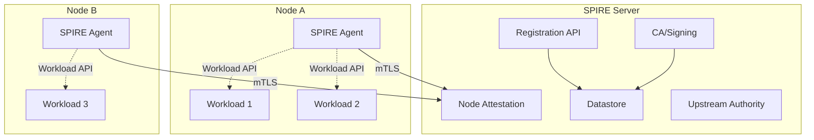
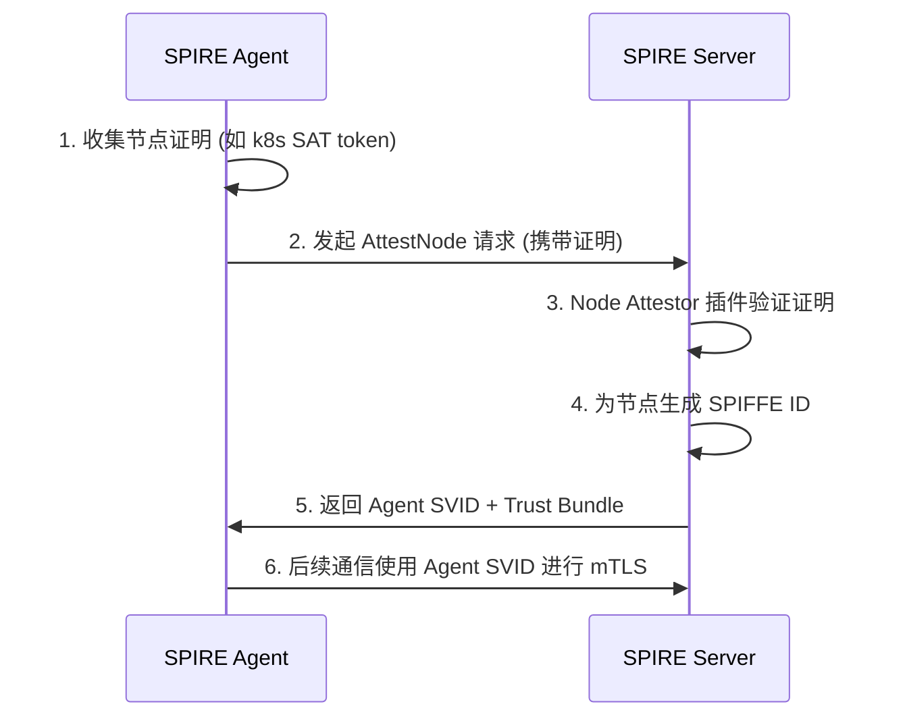
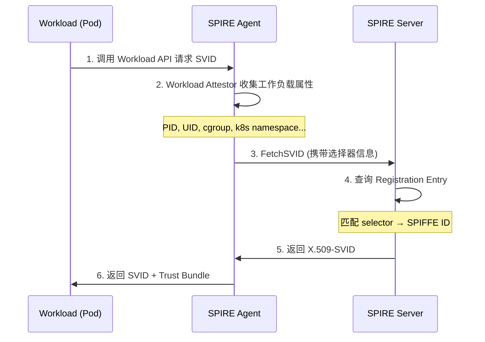
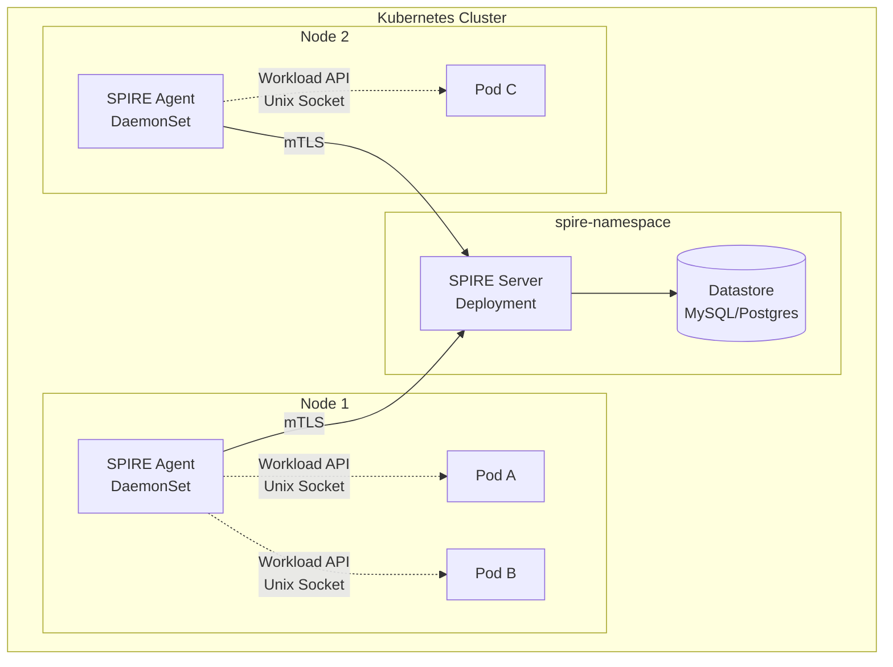

# SPIRE 概念与基本原理

## 一、背景：为什么需要 SPIRE？

在传统的网络架构中,服务间通信的身份认证通常依赖 IP 地址、端口号或静态密钥。但在云原生环境下,微服务动态扩缩、Pod 漂移、容器 IP 频繁变化,传统的身份认证方式暴露出以下问题:

- **IP 不可信**: 容器 IP 动态分配,无法作为稳定身份标识。
- **密钥管理复杂**: 静态密钥分发、轮换困难,容易泄露。
- **跨平台异构**: Kubernetes、裸机、虚拟机等不同环境缺乏统一身份体系。
- **零信任要求**: 安全边界不再以网络为界,需要对每个服务实例进行细粒度认证。

**SPIFFE (Secure Production Identity Framework For Everyone)** 和 **SPIRE (SPIFFE Runtime Environment)** 正是为解决这些问题而生的。

---

## 二、核心概念

### 2.1 SPIFFE ID

SPIFFE ID 是 SPIFFE 标准中定义的工作负载身份标识,格式为 URI:

```
spiffe://<trust-domain>/<workload-identifier>
```

例如:

```
spiffe://example.org/ns/production/sa/default
spiffe://prod.example.com/billing/payment
```

- **Trust Domain (信任域)**: 同一管理区间内所有 SPIFFE ID 的前缀,通常对应一个组织或集群。例如 `example.org`。
- **Workload Identifier (工作负载标识)**: 在信任域内唯一标识一个工作负载,可以基于命名空间、ServiceAccount、节点名等。

> 核心思想: **每个工作负载拥有一个独立、可验证的加密身份,不依赖 IP 地址或网络位置。**

> 📖 **信任域详解**: 信任域是 SPIFFE 身份体系的顶层组织单元,决定了工作负载的信任边界。同一信任域内天然互信,跨信任域需建立联邦。详见: [SPIRE 信任域详解](../6.spire/2.%20spire-trust-domain.md)

### 2.2 SVID (SPIFFE Verifiable Identity Document)

SVID 是 SPIFFE ID 的可验证文档。SPIRE 支持两种 SVID 格式:

1. **X.509-SVID**: 一个 X.509 证书,Subject 或 SAN 中包含 SPIFFE ID。用于 TLS/mTLS 通信。
2. **JWT-SVID**: 一个 JWT Token,包含 SPIFFE ID 和声明 (claims)。用于应用层认证,如 OAuth2 bearer token。

X.509-SVID 的特点:
- 短期有效 (默认 1 小时),自动轮换。
- 由 SPIRE Server 签发,Trust Bundle 可验证。
- 私钥不与 SPIRE Server 共享,由 SPIRE Agent 在本地生成。

### 2.3 Trust Bundle (信任根)

Trust Bundle 是一组 CA 证书,用于验证其他 SPIFFE 身份的 SVID。同一信任域内的服务共享同一个 Trust Bundle,跨信任域可通过联邦 (Federation) 机制交换 Trust Bundle。

### 2.4 Workload API

Workload API 是工作负载获取自身 SVID 和 Trust Bundle 的标准接口。它是一个本地 Unix Domain Socket,工作负载通过 gRPC 调用获取:

- 自身的 X.509-SVID (证书 + 私钥)。
- 自身的 JWT-SVID。
- Trust Bundle (用于验证对端 SVID)。
- 支持订阅模式,证书轮换时自动推送。

> Workload API 是 SPIFFE 标准的实现,不绑定 SPIRE,任何兼容 SPIFFE 的系统都可以使用。

---

## 三、SPIRE 架构

SPIRE 由两大核心组件构成: **SPIRE Server** 和 **SPIRE Agent**。



### 3.1 SPIRE Server

SPIRE Server 是信任域的中央控制平面,负责:

- **身份注册 (Registration API)**: 管理 SPIFFE ID 到工作负载选择器 (Selector) 的映射关系。
- **证书签发 (CA)**: 签发和轮换 X.509-SVID 及 JWT-SVID。
- **Node Attestation**: 验证节点 (运行 SPIRE Agent 的机器) 的真实性。
- **Trust Bundle 管理**: 维护和分发信任根。
- **联邦 (Federation)**: 跨信任域交换 Trust Bundle,实现跨域身份认证。

SPIRE Server 本身是有状态的,需要一个 Datastore (如 SQLite、MySQL、PostgreSQL) 来持久化注册信息和已签发的 SVID 记录。

### 3.2 SPIRE Agent

SPIRE Agent 运行在**每个节点**上 (Kubernetes 中以 DaemonSet 部署),负责:

- **Node Attestation 客户端**: 向 SPIRE Server 证明自己所运行节点的身份。
- **Workload Attestation**: 本地识别并验证工作负载的身份 (基于内核级信息,如 PID、UID、cgroup 等)。
- **Workload API 服务**: 在本地暴露 Unix Domain Socket,供工作负载调用。

> SPIRE Agent **不能**在初始化后离线工作 (即不能像 Vault Agent 那样缓存后离线签发证书),它必须持续与 SPIRE Server 保持通信。

### 3.3 关键插件机制

SPIRE 的认证逻辑通过插件实现,用户可根据环境选择或开发自定义插件:

| 插件类型 | 作用 | 常见实现 |
|---------|------|---------|
| **Node Attestor** | 验证节点身份 | `join_token`, `aws_iid`, `gcp_iit`, `k8s_sat` |
| **Workload Attestor** | 识别工作负载身份 | `k8s`, `unix`, `docker` |
| **Key Manager** | 管理 Agent 私钥 | `memory`, `disk` |
| **Upstream Authority** | 对接外部 CA | `disk`, `aws_pca`, `vault` |

---

## 四、核心工作流程

### 4.1 节点认证 (Node Attestation)

节点认证是 SPIRE Agent 与 SPIRE Server 建立信任的过程:



节点认证后,SPIRE Agent 获得节点级别的 SPIFFE ID,例如:

```
spiffe://example.org/spire/agent/k8s_sat/cluster1/node-abc123
```

此后,SPIRE Agent 与 Server 之间的所有通信都使用该 Agent SVID 进行 mTLS 双向认证。

### 4.2 工作负载认证 (Workload Attestation)

工作负载 (如 Pod、进程) 通过 SPIRE Agent 获取身份的流程:



### 4.3 注册条目 (Registration Entry)

注册条目定义了 "什么样选择器的工作负载 → 获得什么 SPIFFE ID"。示例:

```yaml
# 示例: 将特定 namespace 和 ServiceAccount 的 Pod 映射到 SPIFFE ID
entry:
  spiffe_id: "spiffe://example.org/ns/production/sa/payment"
  parent_id: "spiffe://example.org/spire/agent/k8s_sat/cluster1/*"
  selectors:
    - "k8s:ns:production"
    - "k8s:sa:payment"
  ttl: 3600
```

- **spiffe_id**: 分配给工作负载的 SPIFFE ID。
- **parent_id**: 允许在哪些节点上运行 (Agent 的 SPIFFE ID 模式)。
- **selectors**: 匹配工作负载的条件,由 Workload Attestor 提供。
- **ttl**: SVID 的有效期 (秒)。

### 4.4 SVID 轮换

SPIRE 自动轮换 SVID,无需人工干预:

- **X.509-SVID**: SPIRE Agent 在证书即将过期时 (通常为 TTL 的 50%) 自动向 Server 请求新证书,并通过 Workload API 推送给工作负载。
- **JWT-SVID**: 按需签发,使用者可在过期后重新请求。
- **Agent SVID**: Agent 自身的证书也自动轮换,确保长期运行的节点身份不会过期。

---

## 五、Kubernetes 集成实践

### 5.1 部署拓扑

在 Kubernetes 中,SPIRE 的典型部署结构:



**关键设计**:
- SPIRE Agent 以 DaemonSet 部署,每节点一个实例。
- Agent 的 Workload API Socket 通过 `hostPath` 挂载到 Pod 中。
- SPIRE Server 以 Deployment 部署,需持久化存储 (Datastore)。

### 5.2 工作负载身份示例

在 Kubernetes 中,SPIRE 可以为 Pod 提供细粒度的 SPIFFE 身份:

| Kubernetes 属性 | SPIFFE ID 示例 |
|----------------|---------------|
| Namespace + ServiceAccount | `spiffe://cluster.local/ns/prod/sa/api-server` |
| Deployment | `spiffe://cluster.local/ns/prod/deployment/frontend` |
| Node | `spiffe://cluster.local/node/worker-01` |
| Cluster + SA | `spiffe://cluster.local/k8s/cluster-a/sa/default` |

---

## 六、SPIRE vs 传统方案对比

| 维度 | 传统方案 (静态密钥) | 服务网格 (Istio) | SPIRE |
|------|-------------------|-----------------|-------|
| **身份粒度** | 服务级别 | Pod 级别 | 进程级别 (细粒度) |
| **证书管理** | 手动分发/轮换 | 自动 (Citadel) | 自动轮换 |
| **跨平台** | 无标准 | Kubernetes 为主 | 多云、裸机、VM |
| **运行时依赖** | 无 | Sidecar (Envoy) | Workload API Socket |
| **零信任** | 弱 | 中 (mTLS) | 强 (SPIFFE 标准) |
| **应用侵入性** | 高 (内嵌密钥) | 低 (Sidecar) | 低 (Socket 调用) |

---

## 七、总结

SPIRE 的核心价值在于为云原生环境提供了一套**标准化、自动化、细粒度**的工作负载身份体系:

1. **SPIFFE ID** 为每个工作负载提供稳定的加密身份。
2. **SVID** 使身份可验证,支持 mTLS 和 JWT 两种形式。
3. **Workload API** 将身份获取与应用解耦,应用无需关心证书管理。
4. **自动轮换** 消除了证书过期的运维负担。
5. **插件化架构** 适配多云、混合云环境。

在零信任架构中,SPIRE 扮演着**身份基础设施**的角色,是构建服务间安全通信的基石。无论是配合服务网格 (如 Istio) 实现传输层 mTLS,还是直接为应用提供 JWT Token 用于 API 认证,SPIRE 都能提供一致的解决方案。

---

## 参考资料

- [SPIFFE 官方文档](https://spiffe.io/docs/latest/spiffe-about/overview/)
- [SPIRE 官方文档](https://spiffe.io/docs/latest/spire-about/)
- [SPIRE GitHub](https://github.com/spiffe/spire)
- [SPIFFE 标准](https://github.com/spiffe/spiffe/blob/main/standards/X509-SVID.md)
