# SPIRE 信任域 (Trust Domain) 详解

## 一、为什么需要信任域？

在回答"什么是信任域"之前,我们先看几个真实场景,理解**没有信任域概念时**会遇到什么问题。

### 场景 1: 服务间身份验证的困惑

假设你的公司有两个 Kubernetes 集群,分别运行着不同的微服务:

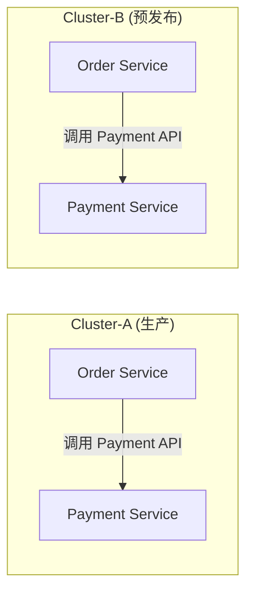

当 `Order Service` 调用 `Payment Service` 时,`Payment Service` 需要回答一个问题:

> **"我凭什么相信你就是你声称的那个 Order Service?"**

在传统方案中,你可能这么做:
- 配置一个共享密钥,`Order Service` 携带密钥调用 `Payment Service`。
- 但密钥泄露怎么办? 密钥怎么轮换?
- 每个服务都要单独配置密钥,成百上千个服务的密钥管理将是噩梦。

### 场景 2: 生产与预发布的隔离

再看一个更棘手的问题:

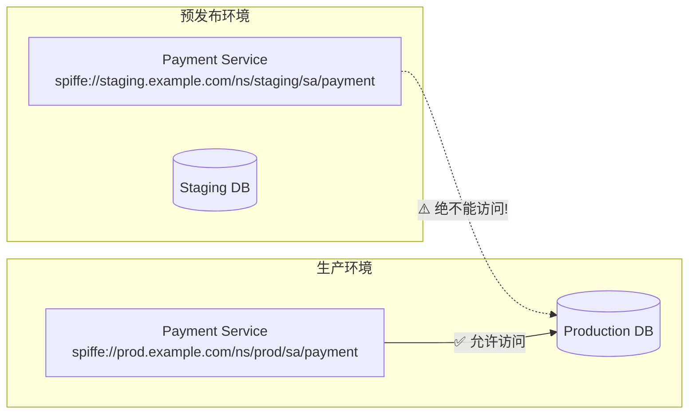

预发布环境的 `Payment Service` **绝不能**访问生产数据库。但如果只用 IP 白名单或网络策略,动态 IP 的环境下很容易出错。我们需要一个**基于身份而非网络的访问控制**。

### 场景 3: 跨组织协作

你的公司与合作伙伴共建一个供应链平台:

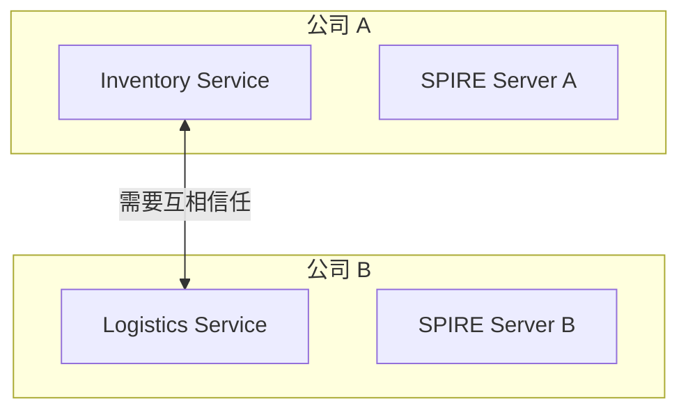

公司 A 的 `Inventory Service` 和公司 B 的 `Logistics Service` 需要互相调用。但两家公司都有自己的安全策略和 CA 体系,**谁都不愿意把自己的根 CA 交给对方管理**。

---

**以上三个场景,归根结底都是同一个问题: 如何定义一个可验证的、有边界的工作负载身份体系?**

这就是信任域 (Trust Domain) 存在的意义。

---

## 二、什么是信任域？

### 2.1 概念定义

信任域是 SPIFFE 身份体系中的**最顶层组织单元**,它划定了:

- **管理边界**: 一个信任域内的所有身份,由一套 SPIRE Server 统一管理。
- **信任边界**: 同一信任域内的工作负载**天然互信**;跨信任域**默认不互信**,需要显式建立联邦 (Federation)。
- **加密边界**: 同一信任域共享一个根 CA (Trust Bundle),所有 SVID 都由该 CA 签发。

你可以把它类比为:

| 概念 | 信任域类比 |
|------|-----------|
| Kerberos Realm | 同一 Realm 内的 principal 由同一 KDC 管理 |
| AWS Account | 同一 Account 内的资源天然互访,跨 Account 需要 IAM Role |
| DNS Domain | 每个域名唯一标识一个命名空间 |
| K8s Namespace | 同一 Namespace 内资源隔离,跨 Namespace 需显式授权 |

但信任域**层级更高**——它横跨集群、环境甚至组织。

### 2.2 信任域的直观理解

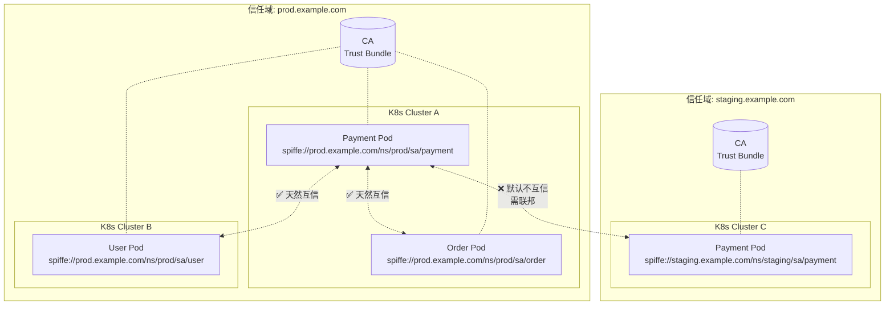

> **核心直觉**: 信任域内的服务 "说同一种信任语言" (同一个 CA 签发),所以天然可以互相验证。不同信任域的服务 "说不同的信任语言",需要先交换 "词典" (Trust Bundle) 才能互相理解。

---

## 三、信任域如何解决上述场景的问题？

### 3.1 解决场景 1: 服务间身份验证

有了信任域,每个工作负载都有 SPIFFE ID:

```
Payment Service → spiffe://prod.example.com/ns/prod/sa/payment
Order Service   → spiffe://prod.example.com/ns/prod/sa/order
```

`Order Service` 调用 `Payment Service` 时:

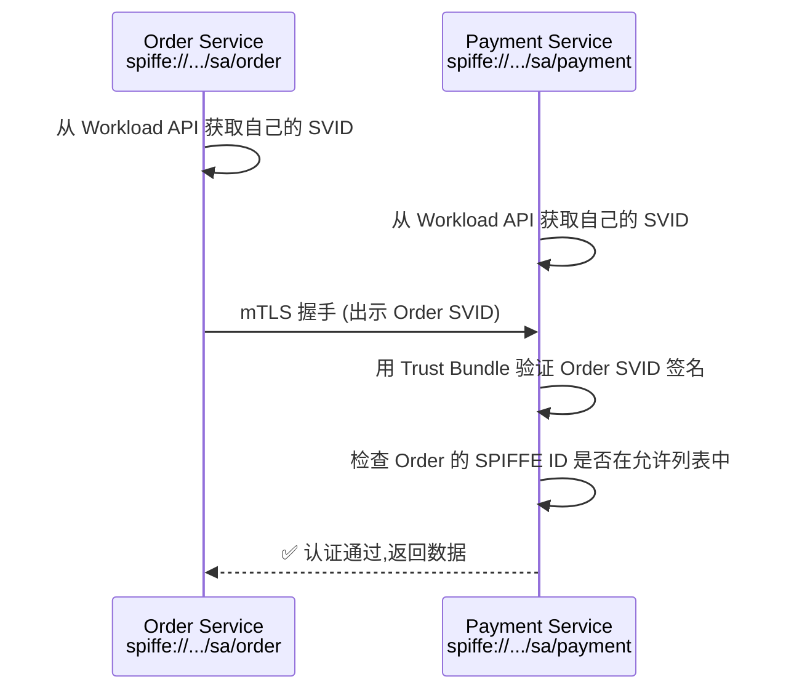

不需要配置任何共享密钥。`Payment Service` 只需:
1. 用 Trust Bundle 验证对端证书的签名 → 确保证书由信任域 CA 签发。
2. 检查对端 SPIFFE ID → 确认对方就是它声称的身份。

### 3.2 解决场景 2: 环境隔离

通过**不同信任域**天然实现隔离:

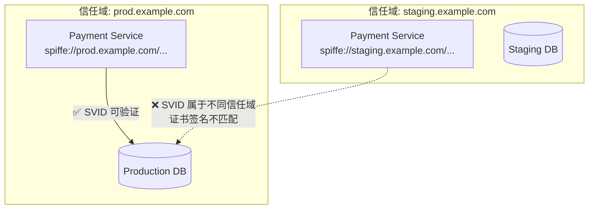

即使有人把预发布服务的流量导向生产数据库,生产数据库收到 mTLS 握手时会发现:
- 对端证书的 SPIFFE ID 是 `spiffe://staging.example.com/...`
- 而自己的信任域是 `prod.example.com`
- **证书签名无法用生产 Trust Bundle 验证 → 拒绝连接**

这就是**基于加密身份的环境隔离**,比网络策略更可靠。

### 3.3 解决场景 3: 跨组织协作

两家公司各自维护独立的信任域,通过 SPIRE Federation 交换 Trust Bundle:

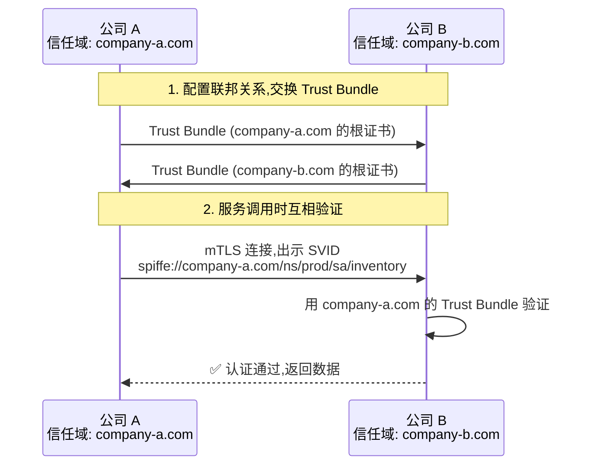

关键优势:
- **双方都不交出根 CA 私钥**——只交换公钥证书 (Trust Bundle)。
- **身份边界清晰**——公司 A 的身份始终是 `company-a.com`,公司 B 的身份始终是 `company-b.com`。
- **授权可精细控制**——可以只允许特定的 SPIFFE ID 跨域访问。

---

## 四、信任域的核心属性

| 属性 | 说明 |
|------|------|
| **全局唯一性** | 信任域名必须在全球唯一,推荐使用组织拥有的 DNS 域名 |
| **单一信任根** | 同一信任域内所有 SVID 由同一个根 CA 签发 |
| **管理独立性** | 每个信任域由独立的 SPIRE Server (或 HA 集群) 管理 |
| **默认隔离** | 不同信任域之间默认不可互访,需显式建立联邦 |
| **不可伪造** | 工作负载无法伪造属于其他信任域的 SPIFFE ID (证书签名不匹配) |

---

## 五、信任域的命名

SPIFFE 规范推荐使用**你实际拥有的域名**作为信任域,以保证全局唯一性:

```
# ✅ 推荐: 使用组织拥有的真实域名
spiffe://prod.example.com/ns/default/sa/payment
spiffe://staging.example.com/ns/default/sa/payment
spiffe://k8s.us-east.example.com/ns/default/sa/api-gateway

# ❌ 不推荐: 随意命名,容易与他人冲突
spiffe://my-cluster/ns/default/sa/payment
spiffe://k8s-prod/ns/default/sa/payment
```

> **为什么必须全局唯一?** 想象两家公司都用了 `spiffe://prod-cluster`,当它们通过联邦交换 Trust Bundle 时,SPIFFE ID 无法区分来自哪家公司,安全控制会失效。

---

## 六、信任域的使用模式

### 模式 1: 单信任域、多集群

所有集群共享同一个信任域,由一套 SPIRE Server 管理。

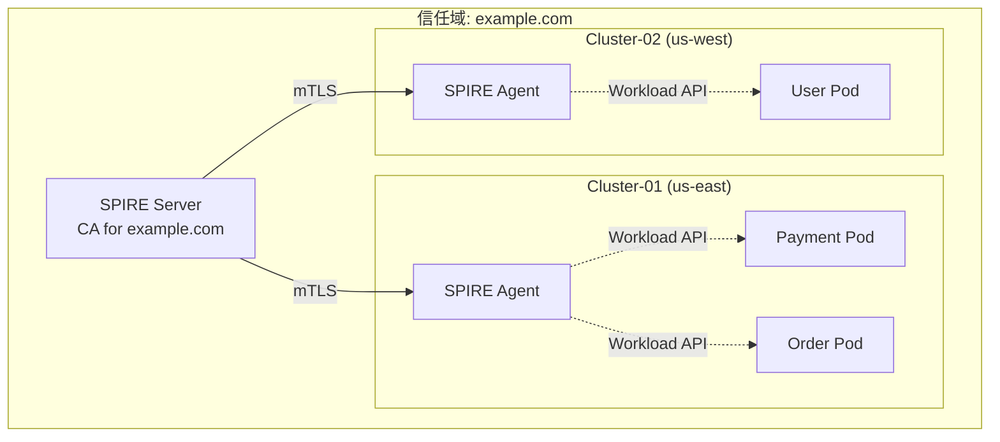

SPIFFE ID 示例:

```
spiffe://example.com/ns/prod/sa/payment     ← 运行在 Cluster-01
spiffe://example.com/ns/prod/sa/order       ← 运行在 Cluster-01
spiffe://example.com/ns/prod/sa/user        ← 运行在 Cluster-02
```

**优点:**
- 零配置互信,所有集群的工作负载自动互信。
- 管理最简单,只需维护一套 SPIRE Server。
- SPIFFE ID 设计简洁统一。

**缺点:**
- SPIRE Server 单点 (可 HA,但仍是单一故障域)。
- SPIRE Server 需要跨集群可达 (网络延迟要求)。
- 不适合多团队独立运维。

**适用场景:** 中小规模,单一团队运维,集群间网络延迟低。

---

### 模式 2: 多信任域 + 联邦

每个环境或集群拥有独立的信任域,通过联邦实现跨域认证。

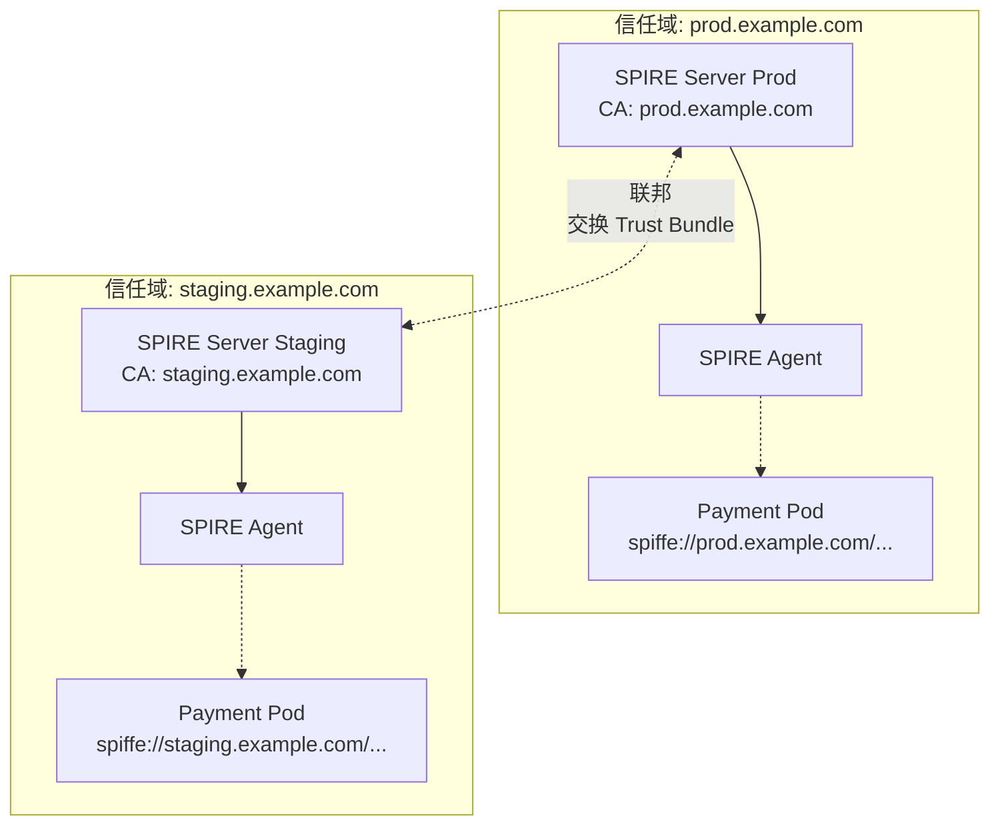

**优点:**
- 故障隔离更好——prod SPIRE Server 宕机不影响 staging。
- 各团队独立运维自己的 SPIRE。
- 环境间从加密层面严格隔离 (默认不互信)。

**缺点:**
- 需要配置和维护联邦关系。
- Trust Bundle 需要定期同步。
- 运维复杂度增加。

**适用场景:** 大型组织,多团队独立运维,需要严格环境隔离。

---

### 模式 3: 按组织边界划分

在跨公司协作场景中,每个组织独立维护信任域。

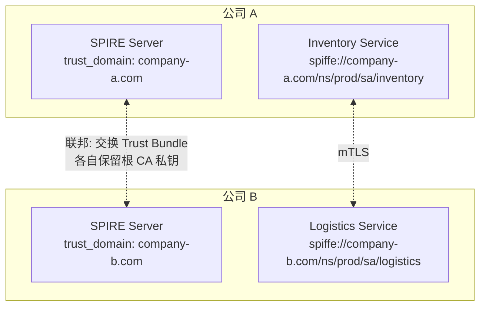

**优点:**
- 各组织完全独立,不共享根 CA 私钥。
- 身份边界与组织边界天然对齐。
- 符合合规要求 (金融、医疗等行业)。

**缺点:**
- 需要跨组织协调联邦配置。
- Trust Bundle 轮换需要多方配合。

**适用场景:** 跨公司合作、SaaS 平台与客户集成、供应链协作。

---

## 七、如何选择信任域策略？

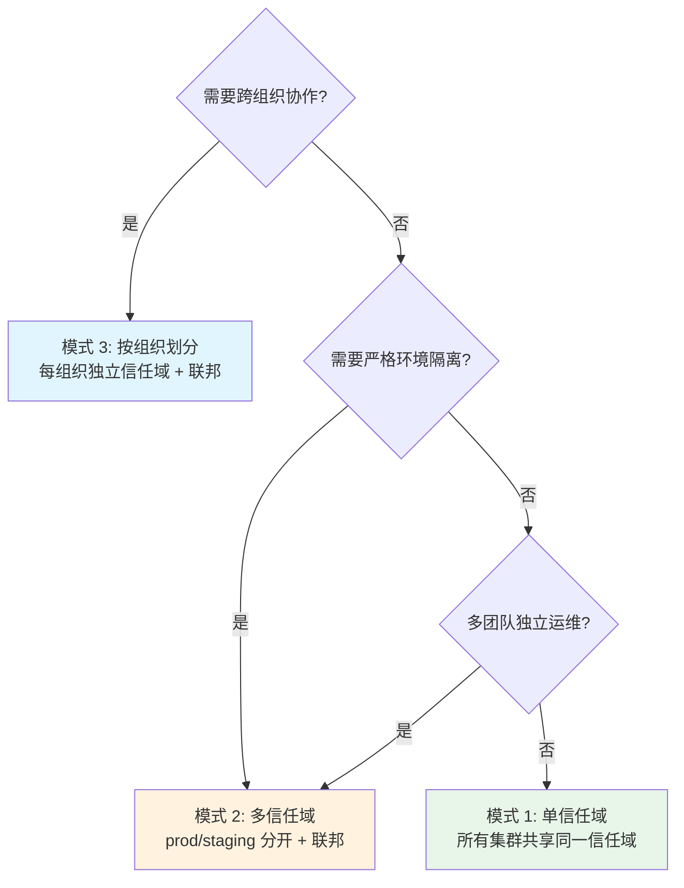

> **实践建议**: 初次引入 SPIRE 时,优先从**模式 1 (单信任域)** 开始。当遇到以下信号时,再考虑拆分:
> - SPIRE Server 成为单点瓶颈。
> - 不同团队对 SPIRE 的运维需求冲突。
> - 需要满足合规要求的强隔离。
> - 跨公司/跨组织集成。

---

## 八、配置示例

### SPIRE Server 配置信任域

```hocon
# spire-server.conf
server {
  trust_domain = "prod.example.com"    # 信任域核心配置
  bind_address = "0.0.0.0"
  bind_port = 8081

  ca_subject {
    country = ["CN"]
    organization = ["Example Corp"]
    common_name = "SPIRE CA for prod.example.com"
  }
}

plugins {
  DataStore "sql" {
    plugin_data {
      database_type = "mysql"
      connection_string = "root:password@tcp(mysql:3306)/spire?charset=utf8mb4"
    }
  }

  NodeAttestor "k8s_sat" {
    plugin_data {
      clusters = {
        "prod-cluster" = {
          service_account_allow_list = ["spire:spire-agent"]
        }
      }
    }
  }

  KeyManager "disk" {
    plugin_data {
      keys_path = "/opt/spire/data/keys.json"
    }
  }
}
```

### SPIRE Agent 配置信任域

```hocon
# spire-agent.conf
agent {
  data_dir = "/opt/spire/data/agent"
  trust_domain = "prod.example.com"    # 必须与 Server 一致
  server_address = "spire-server.prod.svc.cluster.local"
  server_port = 8081
  log_level = "INFO"
}

plugins {
  NodeAttestor "k8s_sat" {
    plugin_data {
      # Agent 使用 Kubernetes ServiceAccount Token 证明身份
    }
  }

  WorkloadAttestor "k8s" {
    plugin_data {
      # 识别 Pod 的 namespace, service account 等信息
    }
  }

  KeyManager "disk" {
    plugin_data {
      keys_path = "/opt/spire/data/agent/keys.json"
    }
  }
}
```

### 注册条目 (Registration Entry)

```bash
# 注册生产 Payment 服务的 SPIFFE ID
spire-server entry create \
  -spiffeID spiffe://prod.example.com/ns/prod/sa/payment \
  -parentID spiffe://prod.example.com/spire/agent/k8s_sat/prod-cluster/* \
  -selector k8s:ns:prod \
  -selector k8s:sa:payment \
  -ttl 3600

# 注册预发布 Payment 服务的 SPIFFE ID (不同信任域)
spire-server entry create \
  -spiffeID spiffe://staging.example.com/ns/staging/sa/payment \
  -parentID spiffe://staging.example.com/spire/agent/k8s_sat/staging-cluster/* \
  -selector k8s:ns:staging \
  -selector k8s:sa:payment \
  -ttl 3600
```

---

## 九、常见误区

| 误区 | 实际 |
|------|------|
| "信任域 = Kubernetes 集群" | 不完全等同。一个信任域可以跨多个集群,也可以只覆盖一个集群的一部分。 |
| "不同信任域绝对不能通信" | 可以,只是需要**显式建立联邦关系**,属于有意识的、受控的互信。 |
| "信任域名可以随便取" | 不行。信任域名必须**全局唯一**,否则联邦时会发生 ID 冲突。 |
| "单信任域比多信任域更好" | 没有绝对的好坏,取决于**组织规模、隔离需求和运维能力**。 |

---

## 十、总结

信任域是 SPIFFE/SPIRE 架构中最核心的"分水岭"概念:

1. **它回答了"谁和谁是一伙的"** — 同一信任域 = 同一套身份体系。
2. **它定义了信任的默认边界** — 域内互信,域外不互信。
3. **它使跨组织协作成为可能** — 通过联邦,双方可以受控地互信,而不需要交出根 CA。

理解信任域,是理解整个 SPIFFE/SPIRE 身份体系的第一步。

---

## 参考资料

- [SPIFFE Trust Domain 规范](https://github.com/spiffe/spiffe/blob/main/standards/SPIFFE-ID.md)
- [SPIRE Federation 文档](https://spiffe.io/docs/latest/spire-about/federation/)
- [SPIRE 概念与基本原理](/k8s/yupcbxxy/)
