# SPIRE 身份标识: SPIFFE ID、Parent ID 与 Node Alias

## 一、从一个注册条目的困惑说起

假设你在 SPIRE 中为一个 Kubernetes Pod 注册身份,看到类似这样的命令:

```bash
spire-server entry create \
  -spiffeID spiffe://example.com/ns/prod/sa/payment \
  -parentID spiffe://example.com/spire/agent/k8s_sat/prod-cluster/* \
  -selector k8s:ns:prod \
  -selector k8s:sa:payment
```

看着这一长串参数,你可能会困惑:

- `-spiffeID` 我大概能理解 — 给工作负载分配的身份 ID。
- `-parentID` 是什么? 为什么还需要指定一个 "父 ID"?
- `spiffe://example.com/spire/agent/k8s_sat/prod-cluster/*` 这一大串又是什么? 最后的 `*` 是什么意思?
- 能不能把 `parentID` 简化一下,不要每次都写这么长的字符串?

**这三个问题,恰好对应了本文要讲的三个核心概念: SPIFFE ID、Parent ID 和 Node Alias。**

---

## 二、SPIFFE ID: 工作负载的身份证号

### 2.1 基本格式

SPIFFE ID 的格式在 SPIFFE 标准中定义为:

```
spiffe://<trust-domain>/<path>
```

拆解如下:

```
spiffe://example.com/ns/prod/sa/payment
  │         │            │
  │         │            └── path: 工作负载路径标识
  │         └── trust-domain: 信任域
  └── scheme: 固定为 spiffe://
```

### 2.2 SPIRE 中有三类 SPIFFE ID

在实际的 SPIRE 部署中,SPIFFE ID 按角色分为三个层级:

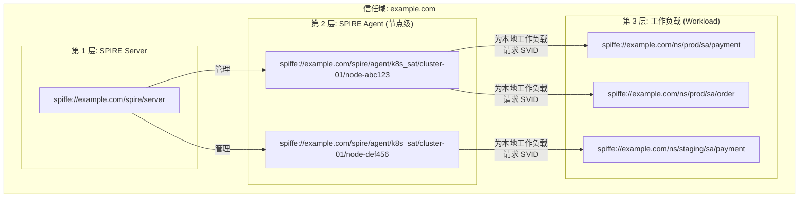

| 层级 | 拥有者 | SPIFFE ID 格式 | 示例 |
|------|--------|---------------|------|
| Server | SPIRE Server | `spiffe://<trust-domain>/spire/server` | `spiffe://example.com/spire/server` |
| Agent | 每个节点的 SPIRE Agent | `spiffe://<trust-domain>/spire/agent/<attestor>/<cluster>/<node>` | `spiffe://example.com/spire/agent/k8s_sat/prod-01/node-abc` |
| Workload | 业务 Pod/进程 | `spiffe://<trust-domain>/<自定义路径>` | `spiffe://example.com/ns/prod/sa/payment` |

### 2.3 工作负载 SPIFFE ID 的命名实践

工作负载的 SPIFFE ID 路径部分可以自由设计,常见的有几种风格:

```
# 风格 1: 仿 Kubernetes 层级 (推荐 — 直观,与 K8s 概念对齐)
spiffe://example.com/ns/prod/sa/payment
spiffe://example.com/ns/prod/sa/order
spiffe://example.com/ns/staging/sa/payment

# 风格 2: 按组织/团队划分
spiffe://example.com/team-payments/api-server
spiffe://example.com/team-payments/worker
spiffe://example.com/team-logistics/shipping

# 风格 3: 按服务类型划分
spiffe://example.com/services/payment/v2
spiffe://example.com/jobs/data-export
spiffe://example.com/cron/cleanup

# 风格 4: 包含集群信息
spiffe://example.com/us-east-1/prod/payment
spiffe://example.com/us-west-2/prod/payment
```

> **推荐**: 风格 1 最普遍,因为 SPIRE 的 `k8s` Workload Attestor 天然能识别 namespace 和 service account,路径可与之一一对应,便于理解和管理。

---

## 三、Parent ID: 谁在为这个身份做担保？

### 3.1 什么是 Parent ID？

Parent ID 是注册条目中的必填字段,它回答了一个关键问题:

> **"这个工作负载的 SVID 请求,应该由哪个 SPIRE Agent 来代理?"**

理解 Parent ID 需要先理解 SPIRE 的 SVID 签发链:

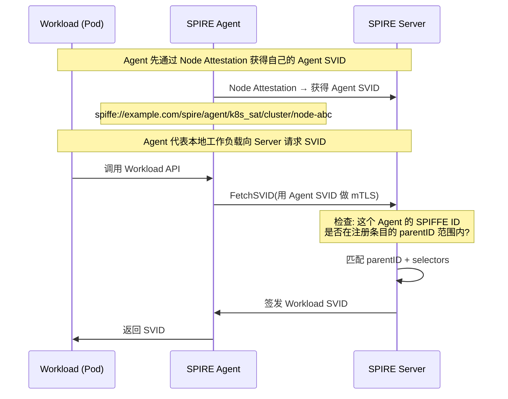

**核心逻辑**: SPIRE Server 不会直接面向工作负载签发 SVID,而是由 SPIRE Agent 作为 "中间人" 代理请求。Parent ID 就是用来**限制哪些 Agent 可以为哪些工作负载请求 SVID**。

### 3.2 为什么需要 Parent ID？

#### 先理解: SPIRE Server 签发 SVID 时做了什么检查？

当一个工作负载请求 SVID 时,SPIRE Server 的验证流程是**两步匹配**:

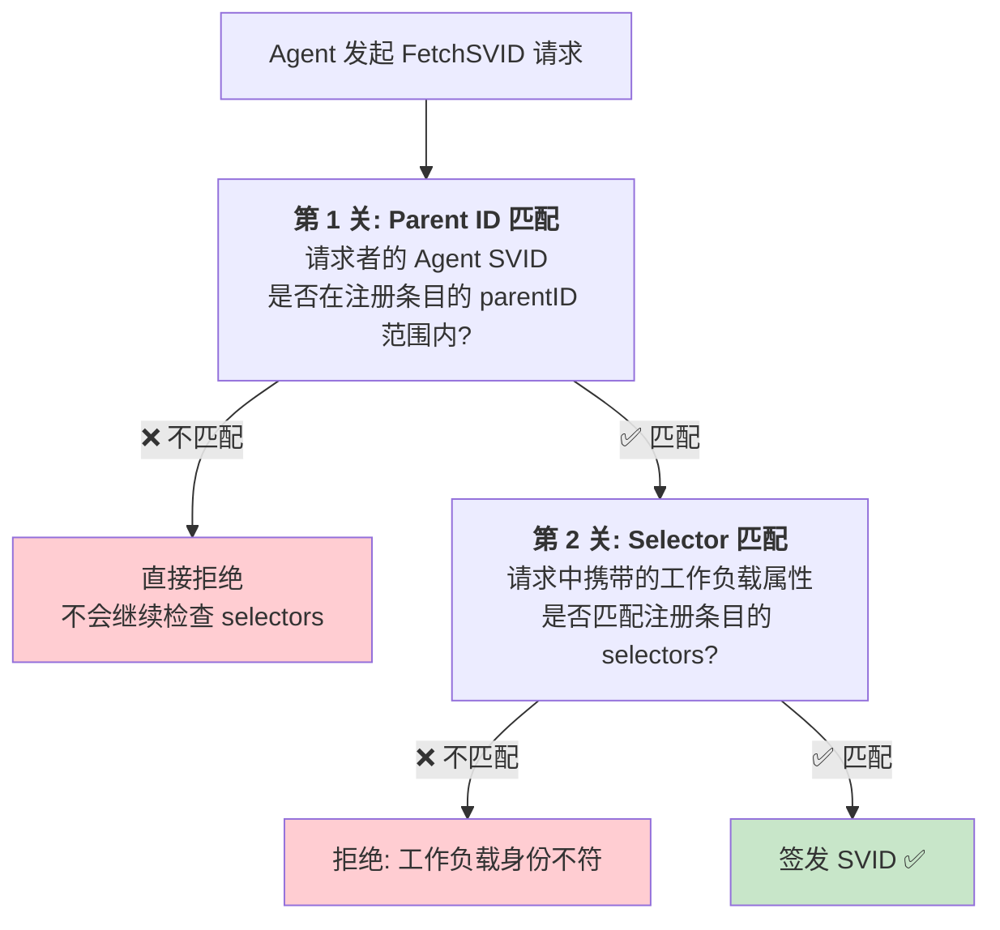

**关键**: 第 1 关和第 2 关是**先后顺序**的,必须先通过 Parent ID 检查,才会继续检查 Selectors。这是刻意设计的——先确认 "担保人可信",再确认 "被担保人身份属实"。

#### Parent ID 匹配的具体实现

当 Agent 发起 `FetchSVID` 请求时,Server 需要从数据库中查询出所有匹配的注册条目。Parent ID 匹配是决定哪些条目**有资格参与**后续 Selector 检查的关键一步。

**整个匹配流程分 3 步**:

##### Step 1: 解析 Parent ID 中的身份标识

注册条目中的 `parentID` 可以是以下两种形式之一:

```
形式 1: 完整的 Agent SPIFFE ID (可含通配符)
  spiffe://acme.com/spire/agent/k8s_sat/prod-cluster/node-abc
  spiffe://acme.com/spire/agent/k8s_sat/prod-cluster/*
  spiffe://acme.com/spire/agent/k8s_sat/*

形式 2: Node Alias (如果启用)
  spiffe://acme.com/prod/us-east
  spiffe://acme.com/prod/all
```

Server 需要识别这是哪一种形式。判断规则:
- 如果 parentID 包含 `/spire/agent/` 路径,则为形式 1 (完整 SPIFFE ID)
- 否则为形式 2 (Node Alias)

##### Step 2: 获取当前请求的 Agent 的身份信息

`FetchSVID` 请求由某个 Agent 发出,这个 Agent 必须先通过 Node Attestation 获得自己的 Agent SVID。Server 维护了 Agent 的身份映射表:

```
Agent SVID: spiffe://acme.com/spire/agent/k8s_sat/prod-cluster/node-001
  ├── X.509 证书 (当前有效)
  ├── 过期时间
  ├── Node Aliases (如果配置): [prod/us-east, prod/all]
  └── 证书公钥
```

当请求到达时,Server 从 mTLS 连接中提取请求者的证书,解出其 SPIFFE ID。

##### Step 3: 执行匹配规则

**情况 A: 如果 parentID 是完整 SPIFFE ID**

```
注册条目 parentID: spiffe://acme.com/spire/agent/k8s_sat/prod-cluster/*
请求者 Agent SVID: spiffe://acme.com/spire/agent/k8s_sat/prod-cluster/node-001

匹配算法 (前缀 + 通配符):
  1. 提取 parentID 的最后一个 /  后面的部分: "*"
  2. 如果是 "*" (单独的通配符),则匹配 "prod-cluster/" 下的所有节点
  3. 比较:
     parentID 前缀: spiffe://acme.com/spire/agent/k8s_sat/prod-cluster/
     Agent SVID 前缀: spiffe://acme.com/spire/agent/k8s_sat/prod-cluster/
     ✅ 前缀完全匹配!
  
结果: ✅ 匹配成功
```

**具体的匹配代码伪代码**:

```python
def matches_parent_id(request_agent_svid: str, parent_id: str) -> bool:
    # 情况 1: 精确匹配 (无通配符)
    if "*" not in parent_id:
        return request_agent_svid == parent_id
    
    # 情况 2: 通配符匹配
    # 注意: SPIRE 只支持尾部 *, 不支持中间或头部通配符
    if parent_id.endswith("/*"):
        # 移除尾部的 /*,得到前缀
        prefix = parent_id[:-2]  # 去掉 "/*"
        # Agent SVID 必须以这个前缀开头
        return request_agent_svid.startswith(prefix + "/")
    
    # 其他通配符格式暂不支持
    return False

# 示例
print(matches_parent_id(
    "spiffe://acme.com/spire/agent/k8s_sat/prod-cluster/node-001",
    "spiffe://acme.com/spire/agent/k8s_sat/prod-cluster/*"
))  # True

print(matches_parent_id(
    "spiffe://acme.com/spire/agent/k8s_sat/test-cluster/node-001",
    "spiffe://acme.com/spire/agent/k8s_sat/prod-cluster/*"
))  # False (test-cluster != prod-cluster)
```

**情况 B: 如果 parentID 是 Node Alias**

```
注册条目 parentID: spiffe://acme.com/prod/us-east
请求者 Agent SVID: spiffe://acme.com/spire/agent/k8s_sat/prod-cluster/node-001
请求者 Aliases: [prod/us-east, prod/all]

匹配算法:
  1. Server 识别 parentID 不含 "/spire/agent/" → 这是一个 alias
  2. 提取 alias: "prod/us-east"
  3. 在 Datastore 中查询: node-001 是否声明了 alias "prod/us-east"?
  4. 查询结果: node-001 的 alias 列表 = [prod/us-east, prod/all]
  5. "prod/us-east" in [prod/us-east, prod/all] → ✅ 是的!

结果: ✅ 匹配成功
```

**Alias 匹配的伪代码**:

```python
def matches_parent_id_alias(
    request_agent_svid: str,
    parent_id_alias: str,  # 如 "spiffe://acme.com/prod/us-east"
    agent_alias_mapping: dict  # Datastore 中的 Agent → Alias 映射
) -> bool:
    # 提取 parent_id_alias 中的别名部分
    # 格式: spiffe://<trust_domain>/<alias_path>
    # 示例: spiffe://acme.com/prod/us-east → alias_path = "prod/us-east"
    
    parts = parent_id_alias.split("/", 3)  # spiffe://acme.com/prod/us-east
    # parts[0] = "spiffe:"
    # parts[1] = ""
    # parts[2] = "<trust_domain>"
    # parts[3] = "prod/us-east"
    
    alias_path = parts[3] if len(parts) > 3 else None
    
    # 从 Datastore 查询当前 Agent 声明的 alias 列表
    agent_aliases = agent_alias_mapping.get(request_agent_svid, [])
    
    # 检查 alias_path 是否在列表中
    return alias_path in agent_aliases

# 示例
agent_mapping = {
    "spiffe://acme.com/spire/agent/k8s_sat/prod-cluster/node-001": 
        ["prod/us-east", "prod/all"],
    "spiffe://acme.com/spire/agent/k8s_sat/test-cluster/node-001": 
        ["staging/all"]
}

print(matches_parent_id_alias(
    "spiffe://acme.com/spire/agent/k8s_sat/prod-cluster/node-001",
    "spiffe://acme.com/prod/us-east",
    agent_mapping
))  # True

print(matches_parent_id_alias(
    "spiffe://acme.com/spire/agent/k8s_sat/test-cluster/node-001",
    "spiffe://acme.com/prod/us-east",
    agent_mapping
))  # False (staging Agent 没有 prod/us-east alias)
```

##### 一个完整的匹配示例

现在用一个完整的场景把上面的步骤串起来:

**Datastore 中的数据**:

```
注册条目 Entry-1:
  spiffeID: spiffe://acme.com/ns/prod/sa/payment
  parentID: spiffe://acme.com/spire/agent/k8s_sat/prod-cluster/*
  selectors: [k8s:ns:production, k8s:sa:payment-service]

注册条目 Entry-2:
  spiffeID: spiffe://acme.com/ns/prod/sa/order
  parentID: spiffe://acme.com/prod/us-east    ← Alias
  selectors: [k8s:ns:production, k8s:sa:order-service]

Agent 映射表:
  Agent-A (SPIFFE ID: spiffe://acme.com/spire/agent/k8s_sat/prod-cluster/node-001)
    └── Aliases: [prod/us-east, prod/all]
  
  Agent-B (SPIFFE ID: spiffe://acme.com/spire/agent/k8s_sat/test-cluster/node-001)
    └── Aliases: [staging/all]
```

**请求 1: Agent-A 请求 Payment SVID**

```
请求者: Agent-A (spiffe://acme.com/spire/agent/k8s_sat/prod-cluster/node-001)
工作负载: Pod (ns=production, sa=payment-service)

Server 检查注册条目 Entry-1:
  
  第 1 关: Parent ID 匹配检查
  ├─ Entry-1 parentID = spiffe://acme.com/spire/agent/k8s_sat/prod-cluster/*
  ├─ Agent-A SVID = spiffe://acme.com/spire/agent/k8s_sat/prod-cluster/node-001
  ├─ 前缀匹配 (spiffe://acme.com/spire/agent/k8s_sat/prod-cluster/) ✅
  └─ Parent ID 检查通过!

  第 2 关: Selector 匹配检查
  ├─ Pod selectors = [k8s:ns:production, k8s:sa:payment-service]
  ├─ Entry-1 selectors = [k8s:ns:production, k8s:sa:payment-service]
  ├─ 完全匹配 ✅
  └─ Selector 检查通过!

结果: ✅ 签发 SVID
```

**请求 2: Agent-B 请求 Payment SVID (伪造)**

```
请求者: Agent-B (spiffe://acme.com/spire/agent/k8s_sat/test-cluster/node-001)
工作负载: 伪造的 Pod (ns=production, sa=payment-service)

Server 检查注册条目 Entry-1:
  
  第 1 关: Parent ID 匹配检查
  ├─ Entry-1 parentID = spiffe://acme.com/spire/agent/k8s_sat/prod-cluster/*
  ├─ Agent-B SVID = spiffe://acme.com/spire/agent/k8s_sat/test-cluster/node-001
  ├─ 前缀不匹配 (test-cluster != prod-cluster) ❌
  └─ Parent ID 检查失败! 拒绝.

结果: ❌ 拒绝 (不会继续检查 Selector)
```

**请求 3: Agent-A 请求 Order SVID**

```
请求者: Agent-A (spiffe://acme.com/spire/agent/k8s_sat/prod-cluster/node-001)
工作负载: Pod (ns=production, sa=order-service)

Server 检查注册条目 Entry-2:
  
  第 1 关: Parent ID 匹配检查 (Alias 版本)
  ├─ Entry-2 parentID = spiffe://acme.com/prod/us-east  ← Alias
  ├─ Agent-A 声明的 Aliases = [prod/us-east, prod/all]
  ├─ "prod/us-east" in Aliases? ✅ 是的!
  └─ Parent ID 检查通过!

  第 2 关: Selector 匹配检查
  ├─ Pod selectors = [k8s:ns:production, k8s:sa:order-service]
  ├─ Entry-2 selectors = [k8s:ns:production, k8s:sa:order-service]
  ├─ 完全匹配 ✅
  └─ Selector 检查通过!

结果: ✅ 签发 SVID
```

---

#### 如果没有 Parent ID,会发生什么？

假设我们把 Parent ID 设为最宽泛的通配符 `spiffe://example.com/spire/agent/*`,意味着**信任域内任意 Agent 都可以请求这个 SVID**。

现在来看一个具体的攻击场景:

**背景设定**:
- 公司有两个环境: `生产集群` 和 `测试集群`。
- 两个集群都在同一个 SPIRE 信任域 `example.com` 下。
- 生产集群中运行 `Payment Service`,其 SPIFFE ID 为 `spiffe://example.com/ns/prod/sa/payment`。
- 测试集群开放给所有开发者和外包团队,安全性较弱。

**攻击步骤**:

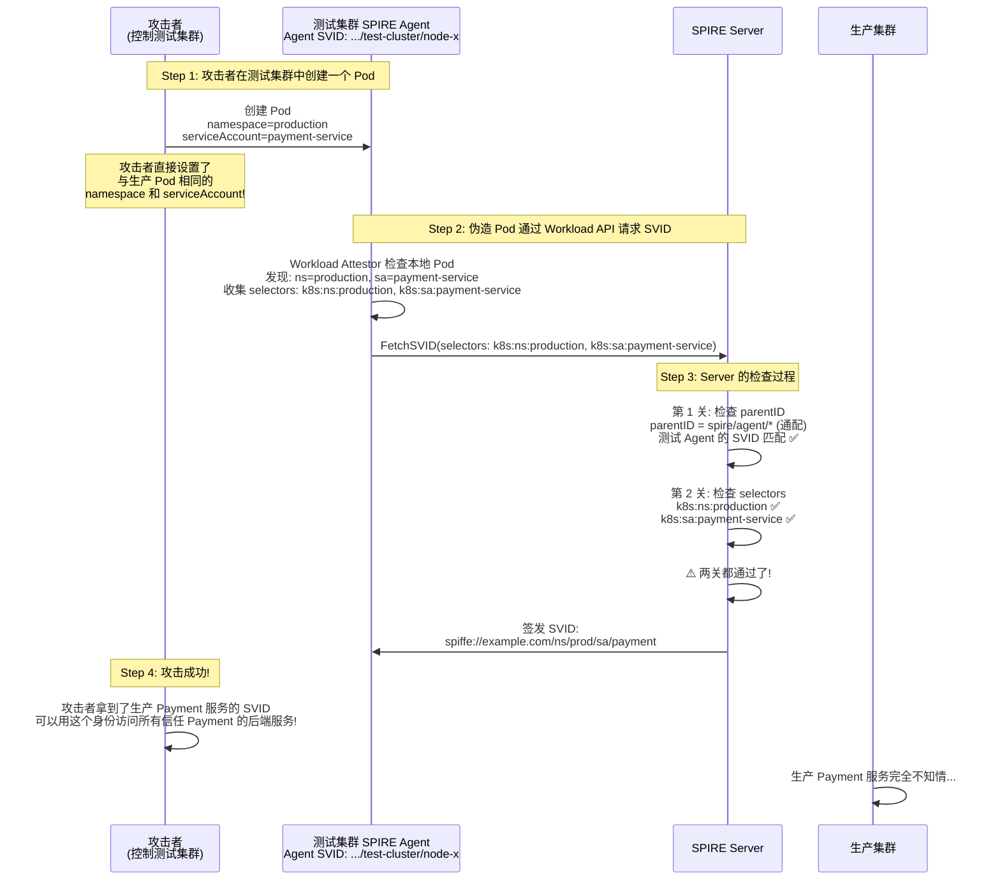

**攻击者为什么能绕过**:
1. 攻击者在测试集群中**人为设置了** `namespace=production, serviceAccount=payment-service`。
2. SPIRE Agent 的 Workload Attestor 是基于**内核信息** (cgroup, PID 等) 来识别工作负载属性的——这些属性在测试集群的 Pod 里**同样是真实的**。Agent 不会 "撒谎",它如实报告了它看到的信息。
3. 如果 parentID 不限制 Agent 来源,Server 无法区分 "这个请求是来自生产集群的 Agent 还是测试集群的 Agent"。

---

#### 加上 Parent ID 后,攻击被如何阻止？

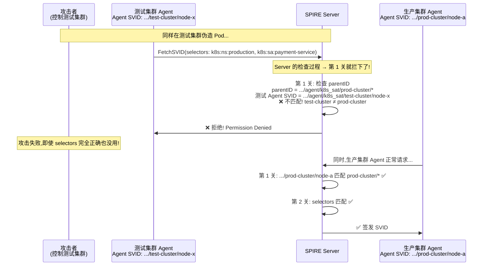

---

#### 再进一步: 如果攻击者控制了生产集群的一个节点呢？

这是一个更深层的问题。假设攻击者拿到了生产集群中某个**非关键节点**的 root 权限:

```
生产集群:
  node-critical: 运行 Payment Service
  node-compromised: 被攻击者控制
```

攻击者在 `node-compromised` 上伪造 Pod,会发生什么?

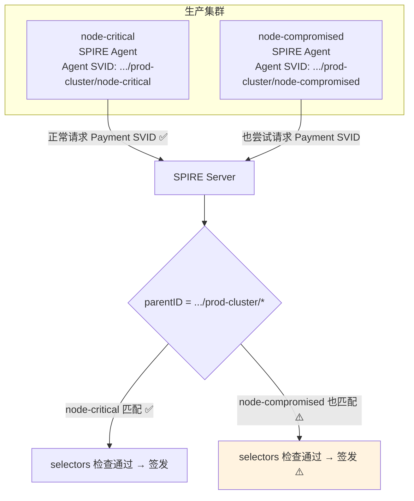

在这种情况下,**如果 parentID 是集群级别的通配符** (`*/prod-cluster/*`),攻击者确实可以拿到 SVID。这是 Parent ID 的粒度限制——通配符越宽泛,安全边界越宽。

**如何防御这种情况?** 这就是更细粒度的 Parent ID 发挥作用的地方:

```bash
# 不安全的写法 (集群级通配,任一节点被攻破即可冒用):
-parentID spiffe://example.com/spire/agent/k8s_sat/prod-cluster/*

# 更安全的写法 (精确到节点,或使用 Node Alias 精确分组):
-parentID spiffe://example.com/spire/agent/k8s_sat/prod-cluster/node-critical
-parentID spiffe://example.com/spire/agent/k8s_sat/prod-cluster/node-backup
```

更进一步,你可以用**节点标签/污点 + Node Alias** 来实现 "只有特定节点才能运行特定工作负载" 的约束:

```hocon
# 只给运行 Payment 的专用节点配置特殊 alias
# 专用节点的 spire-agent.conf:
agent {
  aliases = ["prod-cluster/pci-nodes"]
}

# 普通节点的 spire-agent.conf:
agent {
  aliases = ["prod-cluster/general-nodes"]
}
```

```bash
# Payment 服务的注册条目: 只允许专用节点
spire-server entry create \
  -parentID spiffe://example.com/prod-cluster/pci-nodes \
  -spiffeID spiffe://example.com/ns/prod/sa/payment \
  -selector k8s:ns:production \
  -selector k8s:sa:payment-service \
  -ttl 3600
```

---

#### 一个生活类比: 银行开卡

把这个逻辑类比到现实生活,就很容易理解了:

| SPIRE 概念 | 银行类比 |
|-----------|---------|
| **SPIFFE ID** | 银行卡号 (你的身份标识) |
| **Workload Attestor (Selectors)** | 身份证 + 人脸识别 (证明 "你就是你") |
| **Parent ID** | **只能在指定支行办理** (不是任何支行都能给你开卡) |
| **无 Parent ID 约束** | 任何支行的柜员都能给你开卡 — 如果某个支行被劫持,劫匪可以给任何人开卡 |
| **有 Parent ID 约束** | 只有总行/指定支行能开卡 — 劫持一个偏远支行没用 |

即使你有身份证 (selectors 匹配),如果走进了错误的支行 (parentID 不匹配),柜员也不会给你办卡。这是**双重验证**: 不仅验证你是谁,还验证是谁在帮你办。

---

#### 总结: Selector 和 Parent ID 各自的防守职责

| 防守层面 | 负责机制 | 防御什么 |
|---------|---------|---------|
| **"你是谁"** | Selectors (Workload Attestor) | 防止工作负载冒名顶替 (假 Pod 声称自己是 Payment Service) |
| **"谁在帮你证明"** | Parent ID (Agent 约束) | 防止在不可信的环境中伪造身份 (被攻破的测试集群冒充生产环境) |
| **"你在哪里"** | Parent ID + Node Alias (精确节点约束) | 防止在可信环境中的不可信节点上伪造身份 |

三者缺一不可: Selectors 没有 Parent ID,攻击者换个环境就能绕过; Parent ID 没有 Selectors,攻击者可以在合法节点上运行恶意工作负载。

> Parent ID 本质上是 **"谁有权为这个身份做担保"** 的约束。只有指定的 Agent 节点才能请求对应的 Workload SVID。**它不是可选的,是 SPIRE 安全模型的基础支柱。**

### 3.3 Parent ID 的格式与通配符

Parent ID 支持 `*` 通配符:

```bash
# 精确匹配: 只允许 node-abc 这一个 Agent
-parentID spiffe://example.com/spire/agent/k8s_sat/prod-cluster/node-abc

# 前缀通配: 允许 prod-cluster 下的所有 Agent
-parentID spiffe://example.com/spire/agent/k8s_sat/prod-cluster/*

# 宽泛通配: 允许所有 k8s_sat 认证的所有 Agent
-parentID spiffe://example.com/spire/agent/k8s_sat/*

# 最宽泛: 允许信任域下所有 Agent (不推荐,安全风险)
-parentID spiffe://example.com/spire/agent/*
```

### 3.4 Parent ID 典型使用模式

**模式 1: 按集群隔离 (推荐)**

```
# 生产集群的注册条目
-parentID spiffe://example.com/spire/agent/k8s_sat/prod-cluster/*

# 预发布集群的注册条目
-parentID spiffe://example.com/spire/agent/k8s_sat/staging-cluster/*
```

每个集群的 Agent 只能请求自己集群内工作负载的 SVID。

**模式 2: 按节点粒度隔离 (高安全场景)**

```
# 只允许特定节点运行 Payment 服务
-parentID spiffe://example.com/spire/agent/k8s_sat/prod-cluster/node-pci-dedicated-01
-parentID spiffe://example.com/spire/agent/k8s_sat/prod-cluster/node-pci-dedicated-02
```

适用于 PCI-DSS 等合规场景,确保敏感工作负载只运行在专用节点上。

**模式 3: 跨集群共享 (需要中心化管理)**

```
# 同一服务可运行在多个集群
-parentID spiffe://example.com/spire/agent/k8s_sat/prod-us-east/*
-parentID spiffe://example.com/spire/agent/k8s_sat/prod-us-west/*
```

---

## 四、Node Alias: Parent ID 的简化别名

> **一句话**: Node Alias 就是给每个 SPIRE Agent 起一个**人类可读的昵称**,然后用这个昵称来代替又长又难记的 Agent SPIFFE ID 写进注册条目的 `parentID` 里。

### 4.1 回到痛点: 不用 Alias 时有多痛苦？

假设你是一家公司的 SRE,管理着 3 个集群、共 150 个节点:

```
集群 prod-us-east   → 50 个节点 (node-001 ~ node-050)
集群 prod-us-west   → 50 个节点 (node-051 ~ node-100)
集群 staging        → 50 个节点 (node-101 ~ node-150)
```

每个 SPIRE Agent 完成 Node Attestation 后,会获得一个类似这样的 SPIFFE ID:

```
spiffe://acme.com/spire/agent/k8s_sat/prod-us-east/node-i-0a1b2c3d4e5f67890
```

现在你要注册 `Payment Service` 的 SPIFFE ID。你的要求是: **Payment 只能在美东生产集群运行**。

**没有 Node Alias 时**,你的注册条目必须这样写:

```bash
spire-server entry create \
  -parentID spiffe://acme.com/spire/agent/k8s_sat/prod-us-east/* \
  -spiffeID spiffe://acme.com/ns/prod/sa/payment \
  -selector k8s:ns:production \
  -selector k8s:sa:payment-service
```

这看起来还行? **问题才开始出现**:

**问题 1: 随着集群增多,通配符不精确**

三个月后,公司又在美东开了第二个生产集群 `prod-us-east-2`,Payment 允许在新集群运行吗?

```
# 现有通配符只覆盖了 prod-us-east (第一个集群)
-parentID spiffe://acme.com/spire/agent/k8s_sat/prod-us-east/*

# 如果要同时允许两个美东集群,你没法写:
#   prod-us-east 和 prod-us-east-2 没有共同前缀!
#   你只能写两条:
-parentID spiffe://acme.com/spire/agent/k8s_sat/prod-us-east/*
-parentID spiffe://acme.com/spire/agent/k8s_sat/prod-us-east-2/*
```

**问题 2: 跨集群无法按逻辑分组**

你想表达的业务语义是 **"允许所有美东生产节点"**,但 Agent SPIFFE ID 的结构是按 `attestor/cluster/node` 组织的,不是按你的业务逻辑。你没法写 `*-us-east-*` 这样的通配——SPIRE 的通配符只支持尾部 `*`。

**问题 3: 运维人员记不住、看不懂**

```bash
# 这是啥? 哪个集群? 哪个环境?
-parentID spiffe://acme.com/spire/agent/k8s_sat/cluster-xyz-2024/node-abc
```

Node Alias 就是为了解决以上所有问题而生的。

---

### 4.2 核心机制: Node Alias 到底做了什么？

Node Alias 的运作可以分三步理解:

#### Step 1: Agent "自我介绍"时顺便报上别名

当 SPIRE Agent 向 Server 做 Node Attestation 时,它不光证明 "我是一台合法节点",还会主动报上自己的别名:

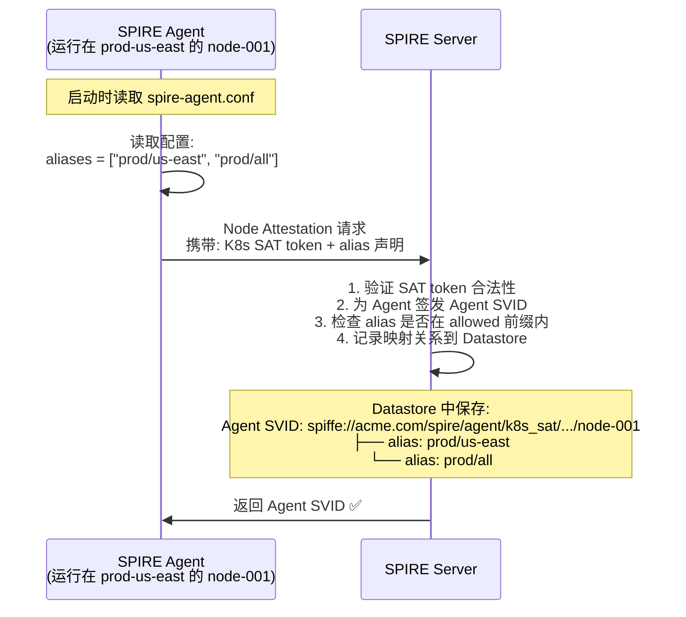

#### Step 2: Server 内部维护了一张 "Agent ↔ Alias" 映射表

Server 在 Datastore 中维护了类似这样的映射:

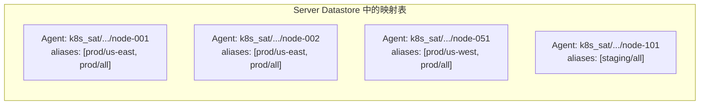

#### Step 3: 注册条目中使用 alias 代替原始 Agent SPIFFE ID

当你写注册条目时,`-parentID` 不再写原始的 Agent SPIFFE ID,而是写 alias:

```bash
# 原始写法 (又长又不直观):
-parentID spiffe://acme.com/spire/agent/k8s_sat/prod-us-east/*

# Alias 写法 (简短直观):
-parentID spiffe://acme.com/prod/us-east
```

**Server 在匹配时发生了什么?**

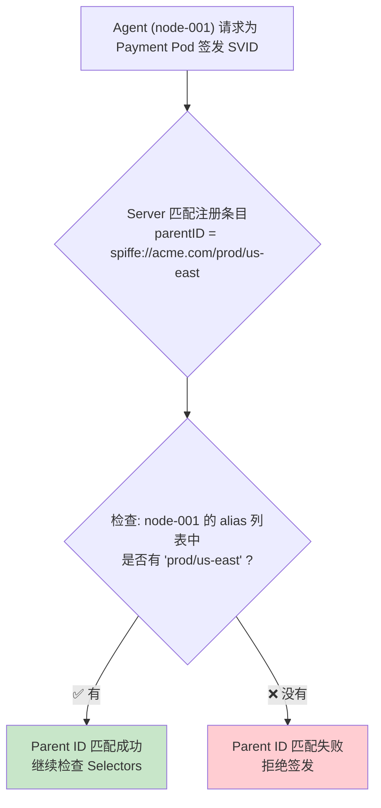

**关键理解**: Server 不是在做字符串前缀匹配,而是在查映射表。`spiffe://acme.com/prod/us-east` 这个 parentID,Server 会把它解析为 "trust_domain=acme.com, alias=prod/us-east",然后去查哪些 Agent 声明了这个 alias。

---

### 4.3 一个完整的时间线: 从 Agent 启动到 SVID 签发

把整个流程串起来,一个 Agent 从启动到成功为工作负载签发 SVID 的完整时间线:

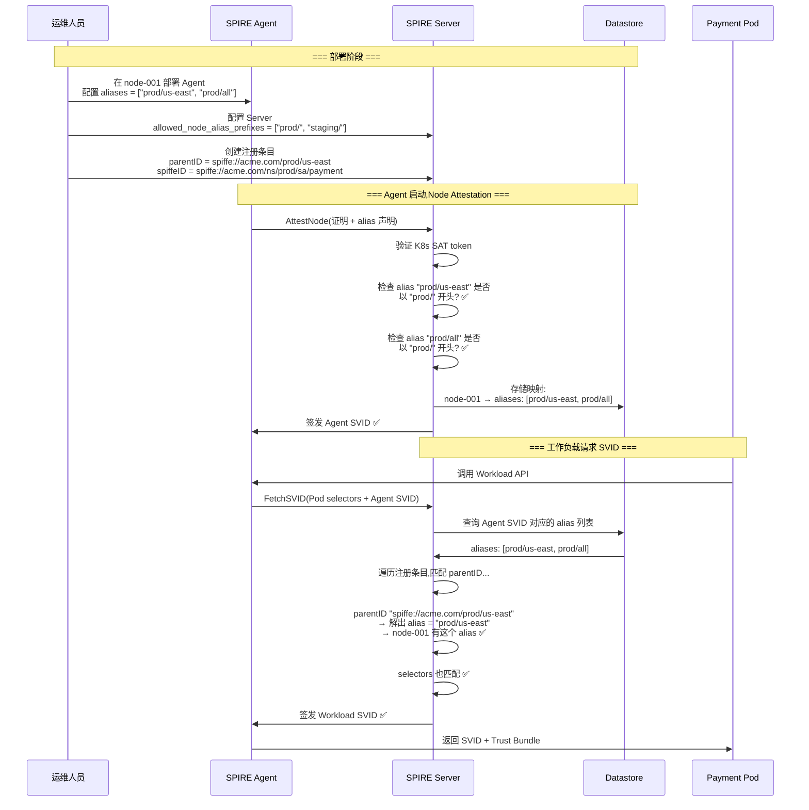

---

### 4.4 安全机制: 为什么 Server 必须限制 alias 前缀？

这是一个极其重要的安全问题。回看上面的流程,Agent 在 Node Attestation 时**主动声明**自己的 alias。如果 Server 不做任何限制,恶意 Agent 可以声明任意 alias:

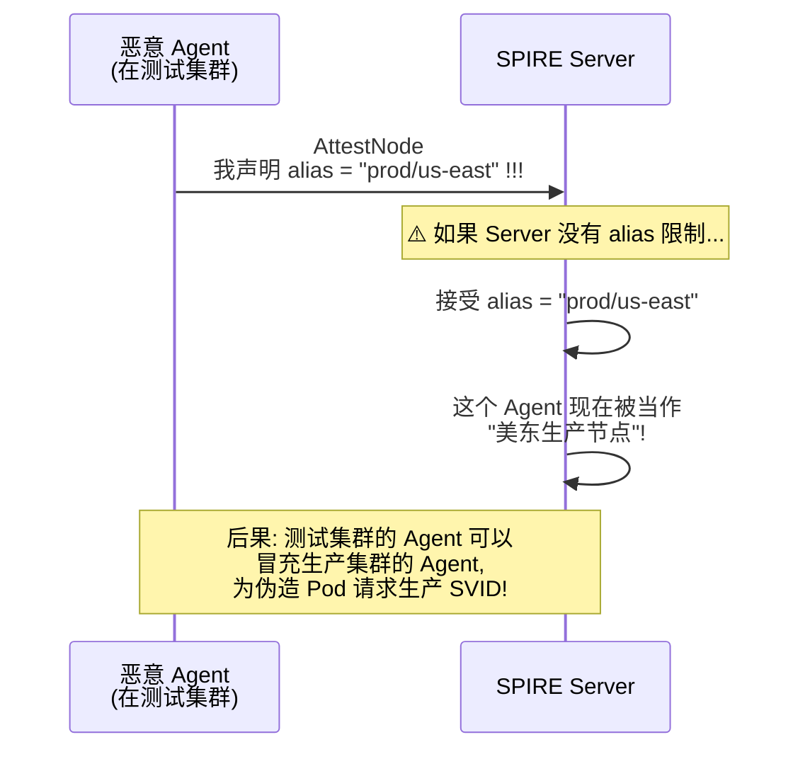

**这就是 `allowed_node_alias_prefixes` 的作用: 白名单机制,只允许特定前缀的 alias。**

```hocon
# spire-server.conf
server {
  trust_domain = "acme.com"

  experimental {
    # ⚠️ 安全关键配置: 只允许这些前缀
    allowed_node_alias_prefixes = [
      "prod/us-east",
      "prod/us-west",
      "prod/all",
      "staging/all"
    ]
  }
}
```

**检查逻辑**:

```
Agent 声明 alias = "prod/us-east"
  → Server 检查: "prod/us-east" 是否以 "prod/us-east" 开头? ✅ 允许

Agent 声明 alias = "prod/all"
  → Server 检查: "prod/all" 是否在允许列表中? ✅ 允许

恶意 Agent 声明 alias = "prod/us-east"
  → Server 检查: 但这是个测试集群的 Agent
  → 它虽然声明了 alias,但它的 Node Attestation 证明不了它是生产集群的节点
  → ❌ 注意: alias 前缀检查无法单独防止跨集群冒充!
```

> **⚠️ 重要**: `allowed_node_alias_prefixes` 本身**不能**防止跨集群冒充! 它防止的是 "Agent 随便瞎编 alias" 的问题。真正防止跨集群冒充的,是 Node Attestation 机制——一个测试集群的 Agent 无法通过生产集群的 K8s SAT 认证,所以它根本拿不到生产集群的 Agent SVID。Alias 前缀限制是**额外的纵深防御层**。

分层防御:

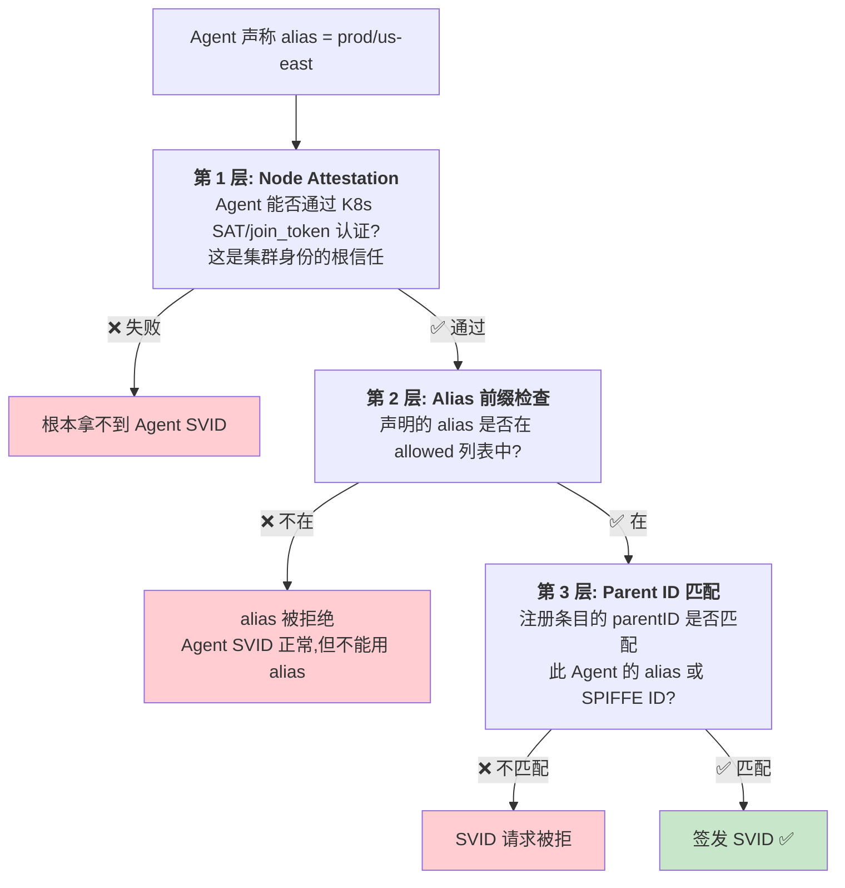

---

### 4.5 Node Alias 配置完整详解

#### 4.5.1 Agent 端配置

```hocon
# /opt/spire/conf/agent.conf
agent {
  data_dir = "/opt/spire/data/agent"
  trust_domain = "acme.com"
  server_address = "spire-server.spire.svc.cluster.local"
  server_port = 8081

  # ========== Node Alias 配置 ==========
  # 每个 Agent 可以有多个 alias (数组)
  # alias 是自由格式的字符串,建议用 / 分隔层级
  aliases = [
    "prod/us-east",        # 区域级: 美东所有生产节点
    "prod/us-east/zone-a", # 可用区级: 美东 zone-a
    "prod/all",            # 全局级: 所有生产节点
    "pci-compliant"        # 合规标签: 符合 PCI-DSS 的节点
  ]
}

plugins {
  NodeAttestor "k8s_sat" {
    plugin_data {
      cluster = "prod-us-east"
      service_account_allow_list = ["spire:spire-agent"]
    }
  }
  WorkloadAttestor "k8s" {
    plugin_data {
      skip_kubelet_verification = false
    }
  }
  KeyManager "memory" {
    plugin_data = {}
  }
}
```

**配置要点**:

| 要点 | 说明 |
|------|------|
| alias 是数组 | 一个 Agent 可以属于多个组,实现多维度分组 |
| 格式自由 | 推荐用 `/` 分隔层级,如 `环境/区域/可用区` |
| 建议加角色标签 | 如 `pci-compliant`、`gpu-node`,按节点硬件/合规属性分组 |
| 建议加全局标签 | 如 `prod/all`,方便粗粒度匹配 |

#### 4.5.2 Server 端配置

```hocon
# /opt/spire/conf/server.conf
server {
  bind_address = "0.0.0.0"
  bind_port = 8081
  trust_domain = "acme.com"

  # ========== Node Alias 前缀白名单 ==========
  experimental {
    # ⚠️ 安全关键: 每个 Agent 声明的 alias 必须以这里某个前缀开头
    # 否则 alias 会被 Server 拒绝
    allowed_node_alias_prefixes = [
      "prod/us-east",
      "prod/us-west",
      "prod/all",
      "staging/all",
      "pci-compliant"
    ]
  }

  ca_subject {
    country = ["US"]
    organization = ["ACME Corp"]
    common_name = "SPIRE CA for acme.com"
  }
}

plugins {
  DataStore "sql" {
    plugin_data {
      database_type = "mysql"
      connection_string = "root:password@tcp(mysql:3306)/spire?charset=utf8mb4"
    }
  }
  NodeAttestor "k8s_sat" {
    plugin_data {
      clusters = {
        "prod-us-east" = {
          service_account_allow_list = ["spire:spire-agent"]
        }
        "prod-us-west" = {
          service_account_allow_list = ["spire:spire-agent"]
        }
        "staging" = {
          service_account_allow_list = ["spire:spire-agent"]
        }
      }
    }
  }
  KeyManager "disk" {
    plugin_data {
      keys_path = "/opt/spire/data/keys.json"
    }
  }
}
```

#### 4.5.3 注册条目中使用 Alias

配置完成后,创建注册条目时就可以使用简洁的 alias:

```bash
# === 美东生产集群专用 ===
spire-server entry create \
  -parentID spiffe://acme.com/prod/us-east \
  -spiffeID spiffe://acme.com/ns/prod/sa/payment \
  -selector k8s:ns:production \
  -selector k8s:sa:payment-service \
  -ttl 3600

# === 所有生产集群通用 ===
spire-server entry create \
  -parentID spiffe://acme.com/prod/all \
  -spiffeID spiffe://acme.com/ns/prod/sa/api-gateway \
  -selector k8s:ns:production \
  -selector k8s:sa:api-gateway \
  -ttl 3600

# === 仅 PCI 合规节点 ===
spire-server entry create \
  -parentID spiffe://acme.com/pci-compliant \
  -spiffeID spiffe://acme.com/ns/prod/sa/payment-processor \
  -selector k8s:ns:production \
  -selector k8s:sa:payment-processor \
  -ttl 3600

# === 预发布环境 ===
spire-server entry create \
  -parentID spiffe://acme.com/staging/all \
  -spiffeID spiffe://acme.com/ns/staging/sa/payment \
  -selector k8s:ns:staging \
  -selector k8s:sa:payment-service \
  -ttl 3600
```

**parentID 中 alias 的格式**: `spiffe://<trust-domain>/<alias>`

对比一下有无 alias 的差异:

```bash
# ❌ 无 alias: 长, 不直观, 通配受限
-parentID spiffe://acme.com/spire/agent/k8s_sat/prod-us-east/*

# ✅ 有 alias: 短, 语义清晰, 分组灵活
-parentID spiffe://acme.com/prod/us-east
```

---

### 4.6 Node Alias 的最佳实践

#### 实践 1: 多级 Alias,粗细粒度兼顾

给每个 Agent 配置多层级的 alias,注册条目可按需选择匹配粒度:

```hocon
# 美东生产, zone-a 节点的 Agent:
aliases = [
  "prod/all",           # 一级: 所有生产
  "prod/us-east",       # 二级: 美东
  "prod/us-east/zone-a" # 三级: 具体可用区
]
```

注册条目可灵活选择:

```bash
# 宽松: 所有生产节点都行
-parentID spiffe://acme.com/prod/all

# 中等: 限定美东
-parentID spiffe://acme.com/prod/us-east

# 严格: 精确到可用区 (高可用要求)
-parentID spiffe://acme.com/prod/us-east/zone-a
```

#### 实践 2: 用标签 alias 实现节点角色分组

```hocon
# GPU 节点:
aliases = ["prod/all", "gpu-node", "gpu-a100"]

# 高内存节点:
aliases = ["prod/all", "high-mem-node"]

# 边缘节点:
aliases = ["prod/all", "edge-node"]
```

```bash
# AI 训练任务只跑在 A100 GPU 节点
-parentID spiffe://acme.com/gpu-a100

# 大数据处理只跑在高内存节点
-parentID spiffe://acme.com/high-mem
```

#### 实践 3: 查看和验证 alias

```bash
# 查看所有已注册的 Agent 及其 alias
$ spire-server agent list

SPIFFE ID                                                     Alias
spiffe://acme.com/spire/agent/k8s_sat/prod-us-east/node-001   prod/us-east, prod/all
spiffe://acme.com/spire/agent/k8s_sat/prod-us-east/node-002   prod/us-east, prod/all
spiffe://acme.com/spire/agent/k8s_sat/prod-us-west/node-051   prod/us-west, prod/all
spiffe://acme.com/spire/agent/k8s_sat/staging/node-101        staging/all

# 查看某个注册条目的详细信息
$ spire-server entry show -spiffeID spiffe://acme.com/ns/prod/sa/payment

Entry ID      : a1b2c3d4-e5f6-7890-abcd-ef1234567890
SPIFFE ID     : spiffe://acme.com/ns/prod/sa/payment
Parent ID     : spiffe://acme.com/prod/us-east   ← 用的 alias!
Selectors     : k8s:ns:production, k8s:sa:payment-service
TTL           : 3600
```

---

### 4.7 Node Alias vs 直接使用 Agent SPIFFE ID

| 维度 | 直接使用 Agent SPIFFE ID | 使用 Node Alias |
|------|------------------------|----------------|
| **可读性** | `spiffe://acme.com/spire/agent/k8s_sat/prod-us-east/node-abc123` | `spiffe://acme.com/prod/us-east` |
| **分组能力** | 只能按 attestor/cluster 前缀通配 | 自由语义分组 (按区域、角色、合规等) |
| **跨集群表达** | 无法表达 "所有美东集群" (前缀不同) | 所有美东 Agent 配置 `prod/us-east` alias |
| **变更灵活性** | 集群改名 → 所有注册条目都要改 | 集群改名 → 只需改 Agent 侧 alias |
| **安全** | 内置在 Agent SVID 中,无法伪造 | 需配合 `allowed_node_alias_prefixes` + Node Attestation |

---

### 4.8 一句话总结 Node Alias

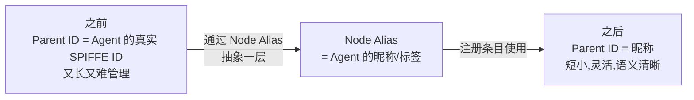

> Node Alias 的本质是**在 Agent 的原始 SPIFFE ID 之上加了一层逻辑分组**,让你可以用业务语义 (区域、环境、节点角色) 而非物理标识 (attestor/cluster/node) 来管理 Parent ID 约束。

---

## 五、三者关系全景图

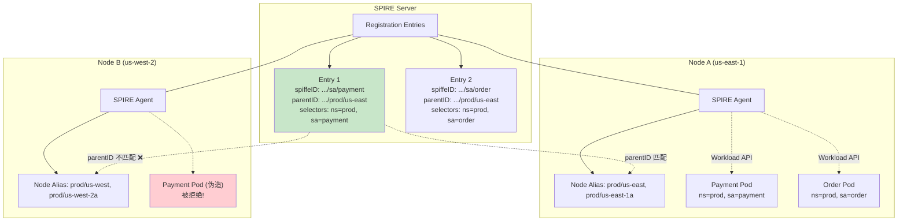

关键流程解析:

1. **Node A** 的 Agent 声明了 alias `prod/us-east`,注册条目 E1 的 `parentID` 为 `spiffe://example.com/prod/us-east` → **匹配成功** ✅
2. **Node B** 的 Agent 声明了 alias `prod/us-west`,注册条目 E1 的 `parentID` 不匹配 → **匹配失败** ❌
3. Node A 上的 Payment Pod 通过 Workload API 获取 `spiffe://example.com/ns/prod/sa/payment` 的 SVID。
4. Node B 上即使有人设法创建了同样的 Pod,也无法获取同样的 SPIFFE ID。

---

## 六、实战: 从零开始配置一个完整示例

### 场景设定

一家电商公司有两个 Kubernetes 集群:

- `prod-us-east`: 生产环境,美东
- `staging`: 预发布环境

现在要为 `payment` 和 `order` 两个服务配置 SPIRE 身份。

### Step 1: 配置 Agent 的 Node Alias

**生产集群的 Agent 配置** (`spire-agent-us-east.conf`):

```hocon
agent {
  trust_domain = "shop.example.com"
  server_address = "spire-server.prod.svc.cluster.local"
  server_port = 8081
  aliases = ["prod/us-east", "prod/all"]
}

plugins {
  NodeAttestor "k8s_sat" {
    plugin_data {
      cluster = "prod-us-east"
      service_account_allow_list = ["spire:spire-agent"]
    }
  }
  WorkloadAttestor "k8s" {
    plugin_data {
      skip_kubelet_verification = false
    }
  }
  KeyManager "memory" {
    plugin_data = {}
  }
}
```

**预发布集群的 Agent 配置** (`spire-agent-staging.conf`):

```hocon
agent {
  trust_domain = "shop.example.com"
  server_address = "spire-server.prod.svc.cluster.local"
  server_port = 8081
  aliases = ["staging/all"]
}
# ... 其余插件配置类似
```

### Step 2: Server 端允许合法的 alias 前缀

```hocon
# spire-server.conf
server {
  trust_domain = "shop.example.com"

  experimental {
    allowed_node_alias_prefixes = [
      "prod/us-east",
      "prod/us-west",
      "prod/all",
      "staging/all"
    ]
  }
}
```

### Step 3: 创建注册条目

```bash
# === 生产 Payment 服务 ===
# 只允许在美东生产节点运行
spire-server entry create \
  -spiffeID spiffe://shop.example.com/ns/prod/sa/payment \
  -parentID spiffe://shop.example.com/prod/us-east \
  -selector k8s:ns:production \
  -selector k8s:sa:payment-service \
  -ttl 3600

# === 生产 Order 服务 ===
# 可以在所有生产节点运行 (美东+美西)
spire-server entry create \
  -spiffeID spiffe://shop.example.com/ns/prod/sa/order \
  -parentID spiffe://shop.example.com/prod/all \
  -selector k8s:ns:production \
  -selector k8s:sa:order-service \
  -ttl 3600

# === 预发布 Payment 服务 (用于测试) ===
spire-server entry create \
  -spiffeID spiffe://shop.example.com/ns/staging/sa/payment \
  -parentID spiffe://shop.example.com/staging/all \
  -selector k8s:ns:staging \
  -selector k8s:sa:payment-service \
  -ttl 3600
```

### Step 4: 验证注册条目

```bash
$ spire-server entry show -spiffeID spiffe://shop.example.com/ns/prod/sa/payment

Entry ID      : a1b2c3d4-e5f6-7890-abcd-ef1234567890
SPIFFE ID     : spiffe://shop.example.com/ns/prod/sa/payment
Parent ID     : spiffe://shop.example.com/prod/us-east
Selectors     : k8s:ns:production, k8s:sa:payment-service
TTL           : 3600
```

### 效果验证

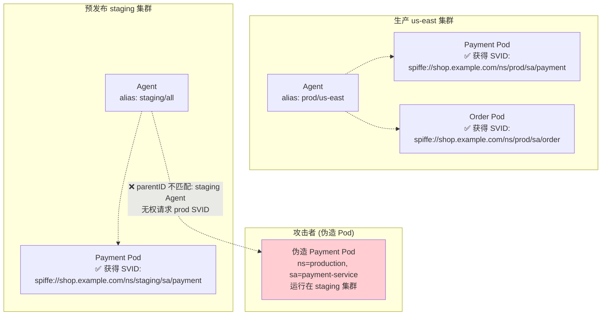

---

## 七、常见问题

### Q1: Parent ID 和 SPIFFE ID 有什么关系?

SPIFFE ID 是**工作负载的身份** (目标), Parent ID 是**担保人的身份** (约束)。一个注册条目同时定义两者: "由这些 Agent (parentID) 担保的这些工作负载 (selectors),可以获得这个 SPIFFE ID"。

### Q2: 一个 Agent 可以没有 Node Alias 吗?

可以。Node Alias 是可选的。不用 alias 时,直接使用 Agent 的完整 SPIFFE ID 作为 parentID 也能正常工作。alias 只是让管理更方便。

### Q3: Agent SPIFFE ID 和 Node Alias 可以同时使用吗?

可以。注册条目中的 `parentID` 可以写 Agent 完整 SPIFFE ID,也可以写 alias 对应的 ID,两者都能匹配。

### Q4: 如何查看某个节点当前注册了哪些 alias?

```bash
# 查看 Agent 列表及其 alias
spire-server agent list

# 输出示例:
# SPIFFE ID                                            Alias
# spiffe://shop.example.com/spire/agent/k8s_sat/...   prod/us-east
# spiffe://shop.example.com/spire/agent/k8s_sat/...   staging/all
```

### Q5: Selector 已经区分了 namespace 和 service account,为什么还需要 Parent ID?

Selectors 回答的是 **"这个工作负载是谁"** (基于 PID, cgroup, k8s 属性等内核级信息)。Parent ID 回答的是 **"谁在为它担保"** (基于哪个 Agent 发出的请求)。

两者的防守层面不同:
- Selectors 防止 **"冒名顶替"**: 一个假 Pod 声称自己是 `ns:production, sa:payment` → 但内核信息不会骗人。
- Parent ID 防止 **"跨节点/跨集群冒用"**: 即使某个集群被完全攻破,攻击者也拿不到其他集群专属的 SVID。

---

## 八、总结

| 概念 | 一句话概括 | 类比 |
|------|-----------|------|
| **SPIFFE ID** | 工作负载的身份标识 | 身份证号 |
| **Parent ID** | 谁可以为这个身份担保 (代理请求的 Agent) | 派出所 (只有指定派出所能签发身份证) |
| **Node Alias** | Parent ID 的人类可读别名 | 派出所挂牌名称 (比编号好记) |

三者的协作关系:

```
spiffe://shop.example.com/prod/us-east   ← Node Alias 简化后的 Parent ID
                  │            │
                  │            └── 这个注册条目的工作负载,
                  │                只能由 alias=prod/us-east 的 Agent 担保
                  │
                  └── 信任域: shop.example.com
```

理解这三个概念,你就掌握了 SPIRE 身份注册的核心逻辑。下一篇将深入 SPIRE 的联邦 (Federation) 机制,讲解跨信任域的身份认证。

---

## 参考资料

- [SPIRE 概念与基本原理](/k8s/yupcbxxy/)
- [SPIRE 信任域详解](2.%20spire-trust-domain.md)
- [SPIRE Registration Entry 文档](https://spiffe.io/docs/latest/spire-using/spire-server-registration/)
- [SPIRE Agent Node Alias 文档](https://github.com/spiffe/spire/blob/main/doc/spire_agent.md#agent-configuration)
