# SPIRE 在 Kubernetes 中的部署与工作流程

## 一、总体架构

在 Kubernetes 中部署 SPIRE,整体架构如下:

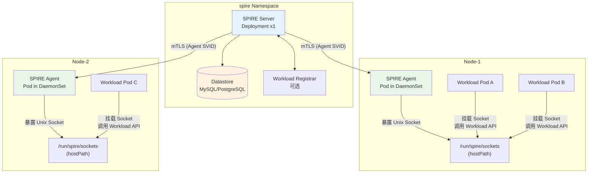

---

## 二、各组件角色与职责

### 2.1 SPIRE Server (控制平面)

SPIRE Server 是整个信任域的**中心大脑**,以 Deployment 方式部署在 `spire` namespace 中。

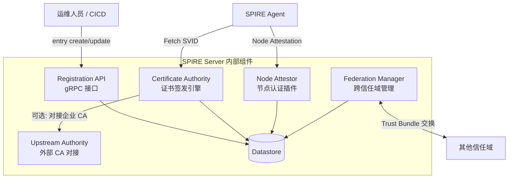

| 职责 | 说明 |
|------|------|
| **身份注册管理** | 通过 Registration API 管理 SPIFFE ID → Selector 的映射关系 (注册条目) |
| **证书签发 (CA)** | 为 Agent 和 Workload 签发 X.509-SVID 及 JWT-SVID |
| **节点认证** | 验证每个 SPIRE Agent 所在节点的合法性 (通过 K8s SAT/PSAT 等) |
| **Trust Bundle 分发** | 维护信任域的根证书,分发给所有 Agent 和工作负载 |
| **联邦管理** | 与其他信任域交换 Trust Bundle,实现跨信任域互信 |

### 2.2 SPIRE Agent (节点代理)

SPIRE Agent 以 **DaemonSet** 方式部署,每个 K8s 节点上运行一个实例:

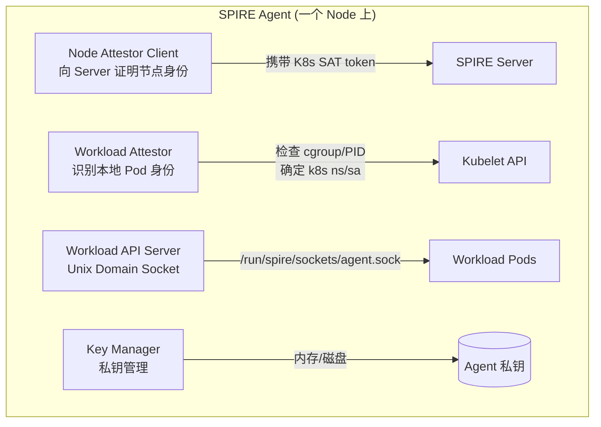

| 职责 | 说明 |
|------|------|
| **节点身份证明** | 向 SPIRE Server 做 Node Attestation,证明自己运行在合法 K8s 节点上 |
| **工作负载识别** | 调用 Kubelet API 获取 Pod 的 namespace、service account、labels 等信息 |
| **SVID 代理请求** | 代表本地工作负载向 Server 请求 SVID,并缓存在本地 |
| **Workload API 服务** | 在节点上暴露 Unix Domain Socket,供 Pod 调用获取 SVID 和 Trust Bundle |
| **SVID 自动轮换** | 在证书到期前自动向 Server 请求新证书,并通过 Workload API 推送 |

### 2.3 Datastore (持久化存储)

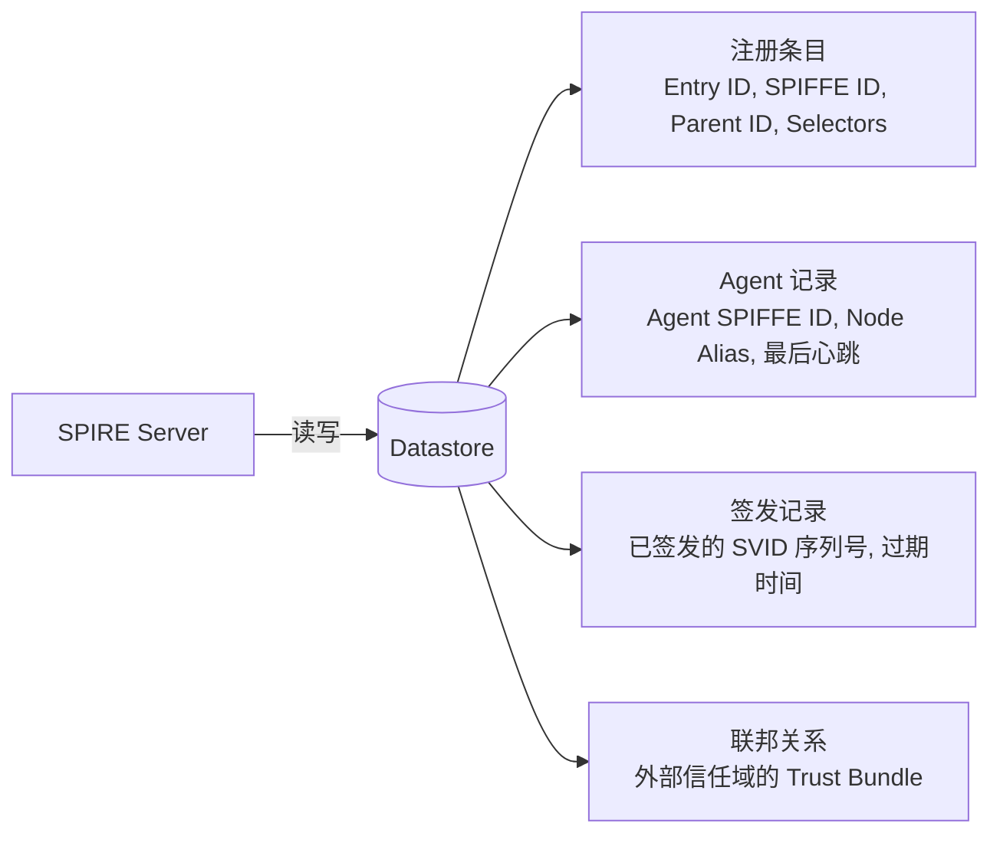

| 存储内容 | 说明 |
|---------|------|
| **注册条目 (Registration Entries)** | SPIFFE ID 到 Selector 的映射,是身份注册的核心数据 |
| **Agent 节点信息** | 所有已完成 Node Attestation 的 Agent 及其 alias、最后心跳时间 |
| **SVID 签发记录** | 已签发证书的序列号和过期时间,用于 CRL/吊销管理 |
| **联邦 Bundle** | 其他信任域的 Trust Bundle,用于跨域身份验证 |

支持的 Datastore 类型:
- **SQLite** (默认,仅限单实例,不适合生产)
- **MySQL / PostgreSQL** (生产推荐,支持 HA)

### 2.4 Workload Registrar (可选)

Workload Registrar 是一个**可选的辅助组件**,自动将 Kubernetes 资源 (如 Pod、Namespace) 转换为 SPIRE 注册条目,减少手动 `entry create` 的工作量。

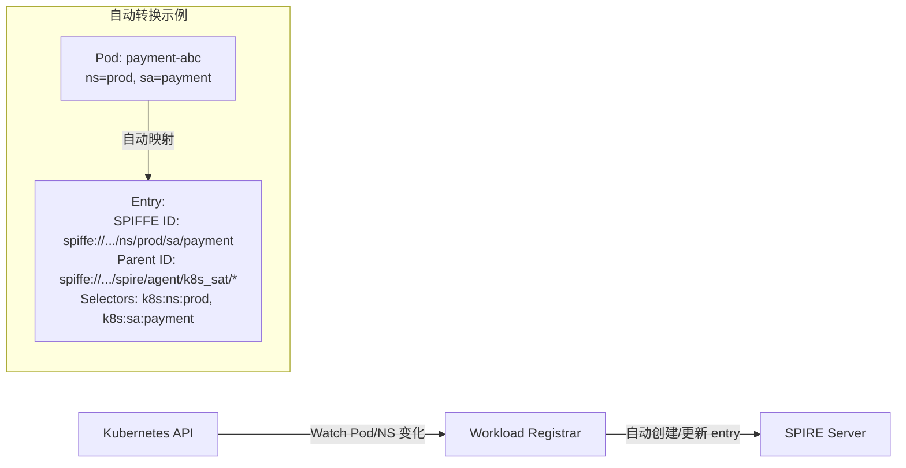

> 如果你的 Pod 身份模型比较简单 (如 每个 ServiceAccount 对应一个 SPIFFE ID),Workload Registrar 可以大幅减少手动配置。但复杂场景下通常仍需要手动创建注册条目。

---

## 三、完整工作流程

SPIRE 在 Kubernetes 中从启动到为工作负载签发 SVID,经历 **三个大阶段**。

### 3.1 阶段一: 部署与初始化

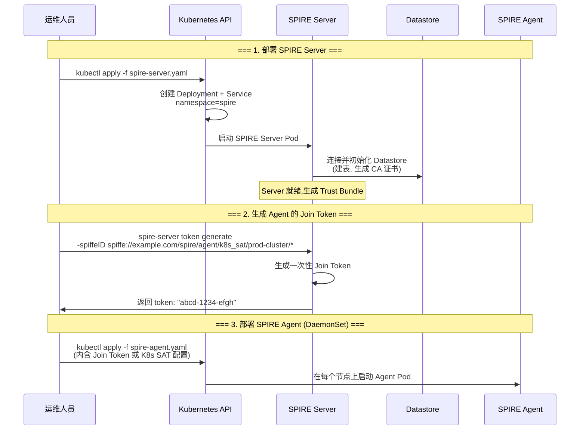

**关键 Kubernetes 资源**:

```yaml
# spire-server Service: 暴露 gRPC 端口供 Agent 连接
apiVersion: v1
kind: Service
metadata:
  name: spire-server
  namespace: spire
spec:
  selector:
    app: spire-server
  ports:
    - name: grpc
      port: 8081
      targetPort: 8081
---
# Agent DaemonSet: 每节点一个
apiVersion: apps/v1
kind: DaemonSet
metadata:
  name: spire-agent
  namespace: spire
spec:
  selector:
    matchLabels:
      app: spire-agent
  template:
    spec:
      # 关键: 使用 hostPID 访问宿主机进程信息 (Workload Attestation 需要)
      hostPID: true
      # 关键: 挂载宿主机路径,供 Agent 暴露 Socket
      volumes:
        - name: spire-agent-socket
          hostPath:
            path: /run/spire/sockets
            type: DirectoryOrCreate
      containers:
        - name: spire-agent
          image: ghcr.io/spiffe/spire-agent:latest
          volumeMounts:
            - name: spire-agent-socket
              mountPath: /run/spire/sockets
```

### 3.2 阶段二: 节点认证 (Node Attestation)

SPIRE Agent 启动后,首先必须通过 Node Attestation 向 Server 证明自己运行在一个合法的 Kubernetes 节点上。

Kubernetes 场景下最常用的认证方式是 **K8s SAT (Service Account Token)**:

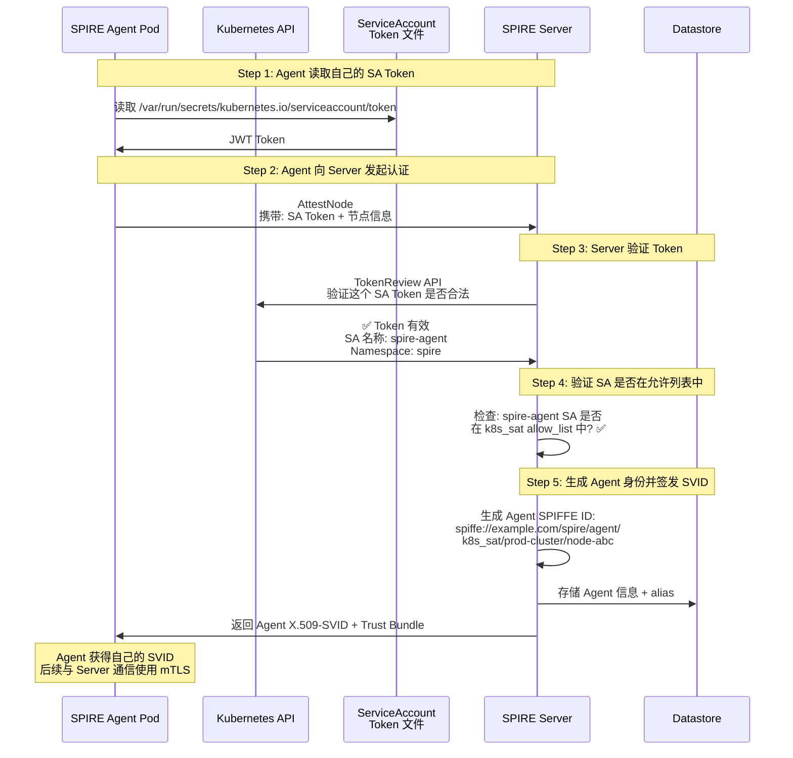

**K8s SAT 认证原理**:

```
每个 Kubernetes Pod 都会自动挂载一个 ServiceAccount Token
(路径: /var/run/secrets/kubernetes.io/serviceaccount/token)

这个 Token 是 Kubernetes 控制面签发的 JWT,
其中包含 Pod 所属的 ServiceAccount 名称和 Namespace。

SPIRE Agent 把 Token 发给 SPIRE Server,
Server 通过 Kubernetes TokenReview API 验证 Token 的合法性,
从而确认 Agent 确实运行在合法的 K8s 节点上。
```

**两种 K8s 认证方式对比**:

| 方式 | 原理 | 优点 | 缺点 |
|------|------|------|------|
| **k8s_sat** | Agent 用 ServiceAccount Token 做身份证明 | 简单,无需额外配置 | Token 是 Pod 级别的,无法区分具体节点 |
| **k8s_psat** | Agent 用 Projected ServiceAccount Token (可附加 Pod 信息) | 可绑定到具体 Pod UID | 配置稍复杂,Token 有效期更短 |

### 3.3 阶段三: 工作负载 SVID 签发

当业务 Pod 需要获取自己的 SPIFFE 身份时,经历以下流程。下面是一张**完整全链路图**,从 Pod 调用 Workload API 一直到 SVID 签发,包含 Step 2 的 4 个内核级小步骤:

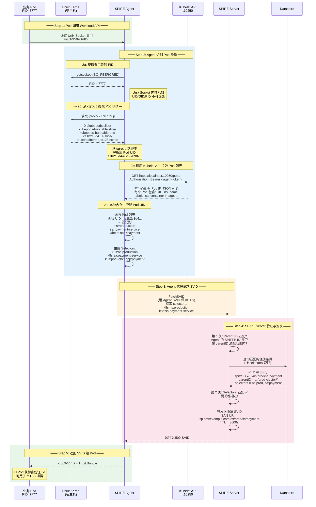

> **💡 关键细节**: Step 2c 中 Agent 调用的是 **本节点 Kubelet 的 HTTP API (`:10250/pods`)**,而不是 Kubernetes API Server。Kubelet 是节点本地服务,最了解本节点上的 Pod,本地调用延迟极低。Agent 拉取的是**全量 Pod 列表**,然后在本地内存中按 Pod UID 匹配——因为一个节点通常只有几十到几百个 Pod,全量拉取几乎无性能开销。

| 属性 | 值 |
|------|-----|
| **API 端点** | `https://<node-ip>:10250/pods` |
| **协议** | HTTP REST (Kubelet 原生 API) |
| **端口** | 10250 (Kubelet 默认只读端口) |
| **认证方式** | Agent 使用自己的客户端证书 (由 SPIRE Server 签发) 或 Bearer Token |
| **返回数据** | 本节点上**所有** Pod 的完整 JSON 描述 |

**为什么不直接通过 Pod UID 精确查询,而是拉全量?**

Kubelet 的 `/pods` API 没有按 Pod UID 过滤的参数,它返回的是该节点上所有 Pod 的列表。Agent 拉取全量后,**在本地内存中**按 UID 进行匹配。这看起来很 "笨",但实际上很高效——Kubelet 返回的数据量通常很小 (一个节点一般几十到几百个 Pod),本地匹配几乎不耗时。

**Agent 如何认证到 Kubelet?**

SPIRE Agent 调用 Kubelet API 时需要认证,有两种方式:

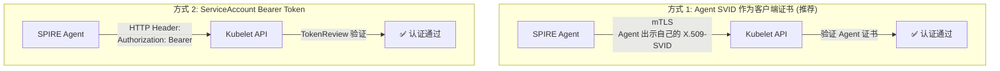

**Agent 拿到的 selectors 长什么样?**

这一步生成的 selectors 在后续会被发送给 SPIRE Server 用于匹配注册条目。以 `k8s` Workload Attestor 为例,它能提取的 selectors 包括:

| Selector 类型 | 格式 | 示例值 |
|--------------|------|--------|
| **Namespace** | `k8s:ns:<value>` | `k8s:ns:production` |
| **ServiceAccount** | `k8s:sa:<value>` | `k8s:sa:payment-service` |
| **Pod Name** | `k8s:pod-name:<value>` | `k8s:pod-name:payment-7f8d9c-abc` |
| **Pod UID** | `k8s:pod-uid:<value>` | `k8s:pod-uid:a1b2c3d4-e5f6...` |
| **Pod Label** | `k8s:pod-label:<key>:<value>` | `k8s:pod-label:app:payment` |
| **Pod Image** | `k8s:pod-image:<value>` | `k8s:pod-image:payment:v2.1.0` |
| **Node Name** | `k8s:node-name:<value>` | `k8s:node-name:worker-node-01` |

这些 selectors 给了注册条目极大的灵活性——你可以按 namespace + sa 匹配,也可以精确到某个 Pod UID,还可以按 Pod 的 label 匹配。

**与 Kubernetes API Server 的对比**:

| 维度 | 调用 Kubelet API (Agent 实际做法) | 调用 K8s API Server (如果这样做) |
|------|----------------------------------|-------------------------------|
| **访问范围** | 只能看到**本节点**的 Pod | 可以看到**全集群**的 Pod |
| **网络路径** | 本地 localhost,极低延迟 | 需经过 API Server,有网络延迟 |
| **依赖** | Kubelet 是节点必备组件 | API Server 可能不可达 (网络分区) |
| **安全** | 攻击面限于本节点 | 攻击面扩大到 API Server |
| **为什么 SPIRE 选这个** | ✅ Kubelet 最了解本节点 Pod | ❌ 过度获取,浪费且不安全 |

---

## 四、Pod 如何访问 Workload API

这是 Kubernetes 集成中最关键的部分 — Pod 如何拿到 Agent 提供的 Unix Socket。

### 4.1 Socket 挂载方式

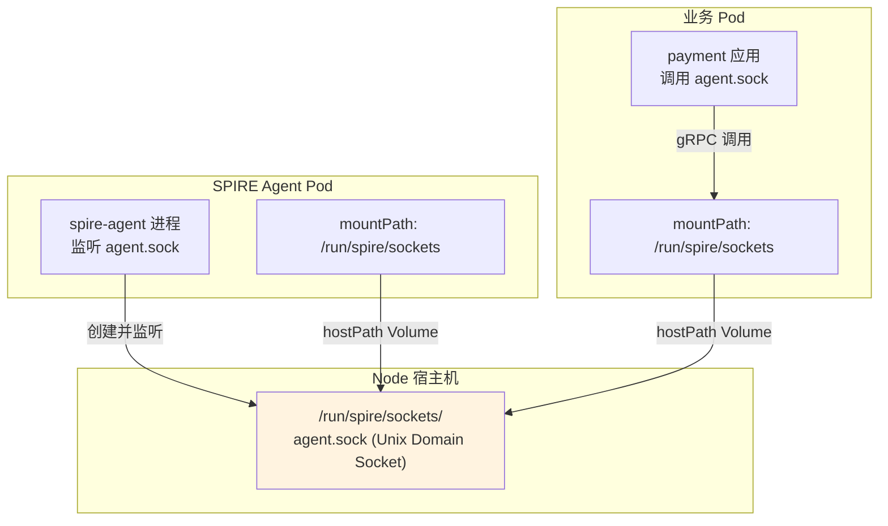

**Agent 的 Volume 配置** (在 DaemonSet 中):

```yaml
volumes:
  - name: spire-agent-socket
    hostPath:
      path: /run/spire/sockets
      type: DirectoryOrCreate

containers:
  - name: spire-agent
    volumeMounts:
      - name: spire-agent-socket
        mountPath: /run/spire/sockets
```

**业务 Pod 的 Volume 配置**:

```yaml
volumes:
  - name: spire-agent-socket
    hostPath:
      path: /run/spire/sockets
      type: DirectoryOrCreate

containers:
  - name: payment
    volumeMounts:
      - name: spire-agent-socket
        mountPath: /run/spire/sockets
        readOnly: true  # 业务 Pod 只读即可
```

### 4.2 应用代码如何调用 Workload API

应用不需要自己实现 SPIFFE 协议,使用 SPIFFE 官方 SDK 即可:

```go
// Go 语言示例
import (
    "github.com/spiffe/go-spiffe/v2/workloadapi"
)

func main() {
    // 连接到本地 Workload API Socket
    ctx := context.Background()
    client, err := workloadapi.New(ctx,
        workloadapi.WithAddr("unix:///run/spire/sockets/agent.sock"),
    )
    if err != nil {
        log.Fatal(err)
    }
    defer client.Close()

    // 获取当前 Pod 的 X.509-SVID
    svid, err := client.FetchX509SVID(ctx)
    if err != nil {
        log.Fatal(err)
    }

    // svid.Certificates 就是 PEM 格式的证书链
    // svid.PrivateKey 是私钥
    // 可以直接用于 TLS 配置
}
```

---

## 五、SPIRE 与 Kubernetes 的交互全景图

将以上所有组件和流程整合为一张全景架构图:

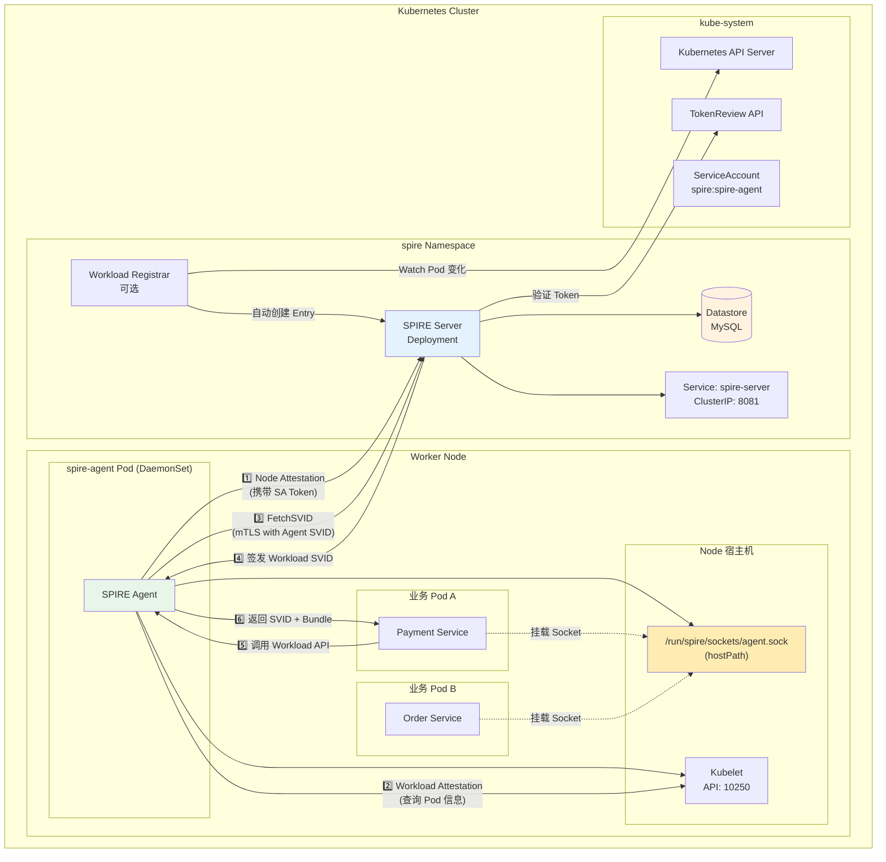

---

## 六、SVID 自动轮换流程

SPIRE 的一大优势是证书自动轮换,无需人工干预:

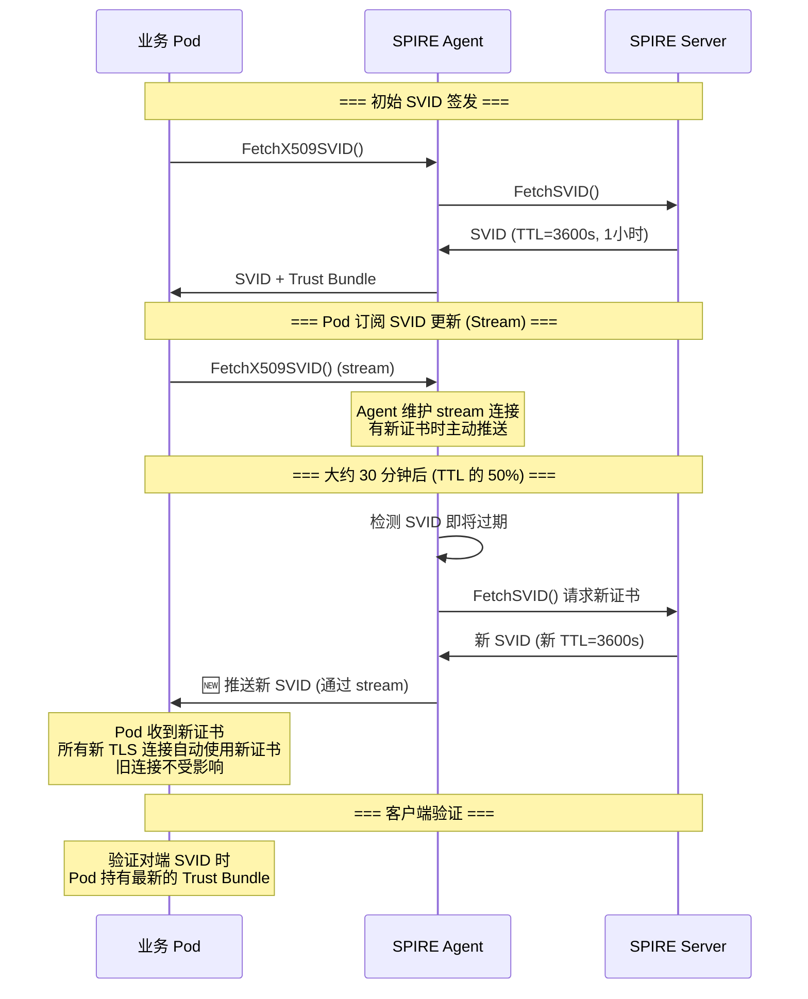

**关键机制**:
- Agent 在证书 TTL 的 **50%** 时主动发起轮换。
- Agent 维护了一个 **SVID 缓存**,即使 Server 短暂不可达,已签发的 SVID 仍可用直到过期。
- 业务 Pod 通过 Workload API 的 **stream 模式**订阅更新,证书更新后立即推送,无需重启。

---

## 七、常见部署模式

### 7.1 单集群部署 (入门)

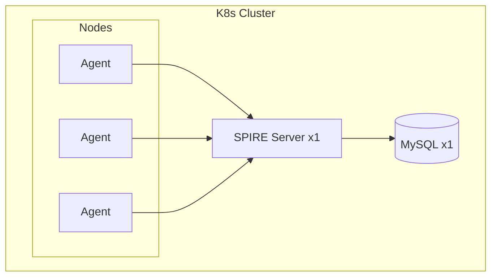

**特点**: 简单,适合 POC 和小规模生产。Server 单点,需依赖 K8s 自愈机制。

### 7.2 高可用部署 (生产推荐)

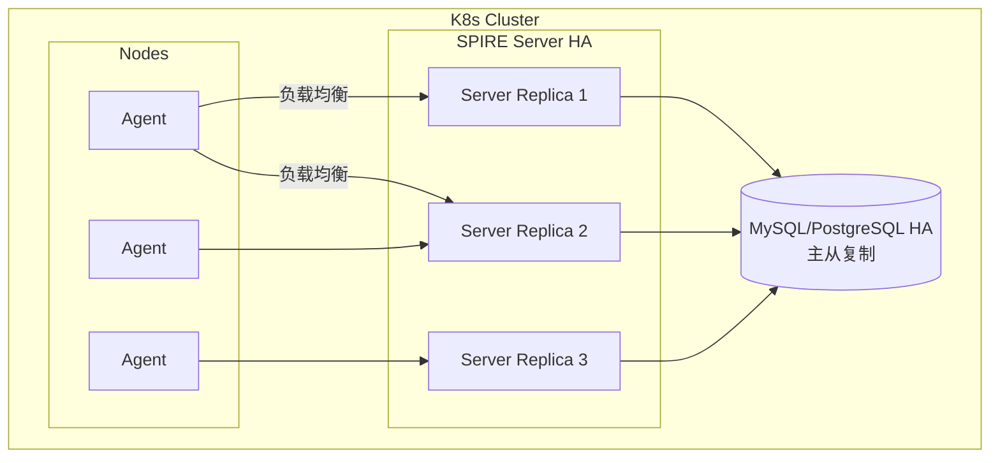

**关键配置**:
- SPIRE Server 通过 Deployment 设置 `replicas: 3`。
- 多个 Server 共享同一个 Datastore,实现无状态水平扩展。
- Agent 通过 K8s Service 连接 Server,由 K8s 自动负载均衡。

### 7.3 多集群共享 Server (跨集群统一身份)

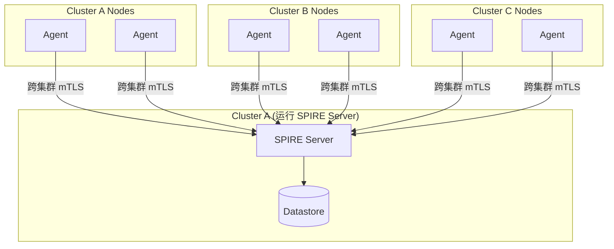

**特点**: 所有集群共享同一信任域,工作负载天然互信。要求集群间网络低延迟。

---

## 八、安全边界概述

> **结论**: 如果攻击者获得节点 root 权限,SPIRE 的 Workload Attestation **无法防御**——攻击者可通过 `nsenter`、创建 Static Pod、或 cgroup 伪造等多种方式获取同节点上任意 Pod 的 SVID。

这并非 SPIRE 的设计缺陷,而是其安全模型的有意边界: SPIRE 保证 "身份属性到凭证的映射正确",但不保证 "请求凭证的进程是原装应用"。节点安全的防护属于基础设施层。

详细的攻击路径分析、防御措施和纵深防御架构,参见: **[SPIRE 安全边界与能力模型](5.%20spire-security-boundary.md)**。

---

## 九、安全配置清单

| 配置项 | 位置 | 说明 |
|--------|------|------|
| **Server CA 私钥保护** | Server KeyManager | 生产环境使用 `disk` 或 KMS,不要用 `memory` |
| **Agent Node Attestor** | Server `NodeAttestor "k8s_sat"` | 配置 `service_account_allow_list` 限制哪些 SA 可以做 Agent |
| **Agent Workload Attestor** | Agent `WorkloadAttestor "k8s"` | 设置 `skip_kubelet_verification = false` 确保验证 Kubelet 证书 |
| **Workload API Socket** | Pod hostPath | Socket 目录权限设置为 `0700`,防止跨 Pod 访问 |
| **Agent SVID TTL** | Server 全局配置 | 默认 1h,根据安全要求适当缩短 |
| **Node Alias 前缀** | Server `allowed_node_alias_prefixes` | 必须配置,防止 Agent 随意声明 alias |

---

## 十、调试指南

### 查看 Agent 状态

```bash
# 查看所有已认证的 Agent
$ kubectl exec -n spire spire-server-0 -- \
  spire-server agent list

# 查看 Agent 的健康状态
$ kubectl exec -n spire spire-agent-abc -- \
  spire-agent healthcheck
```

### 查看注册条目

```bash
# 列出所有注册条目
$ kubectl exec -n spire spire-server-0 -- \
  spire-server entry show

# 按 SPIFFE ID 查看
$ kubectl exec -n spire spire-server-0 -- \
  spire-server entry show -spiffeID spiffe://example.com/ns/prod/sa/payment
```

### 手动测试 Workload API

```bash
# 进入业务 Pod,验证能否获取 SVID
$ kubectl exec -it payment-abc -- /bin/sh

# 使用官方工具测试
$ /opt/spire/bin/spire-agent api fetch x509 \
  -socketPath /run/spire/sockets/agent.sock
```

---

## 十一、总结

在 Kubernetes 中,SPIRE 的完整工作流程可以浓缩为以下 6 步:

```
1. SPIRE Server 启动 → 2. Agent DaemonSet 部署 → 3. Node Attestation
→ 4. 创建注册条目 → 5. Pod 调用 Workload API → 6. SVID 签发 + 自动轮换
```

每个组件的核心职责:

| 组件 | 一句话职责 |
|------|-----------|
| **SPIRE Server** | 签发和管理所有 SPIFFE 身份 (证书 + Trust Bundle) |
| **SPIRE Agent** | 在每个节点上代理本地 Pod 的身份请求,是 Pod 与 Server 之间的桥梁 |
| **Datastore** | 持久化注册条目、Agent 信息和证书签发记录 |
| **Workload Registrar** | (可选) 自动将 K8s 资源映射为 SPIRE 注册条目 |
| **Kubelet API** | Agent 通过它查询 Pod 的 namespace、SA 等身份信息 |
| **K8s SAT Token** | Agent 用它向 Server 证明自己运行在合法 K8s 节点上 |

---

## 参考资料

- [SPIRE 概念与基本原理](/k8s/yupcbxxy/)
- [SPIRE 信任域详解](2.%20spire-trust-domain.md)
- [SPIRE 身份标识: SPIFFE ID、Parent ID 与 Node Alias](3.%20spiffe-id-parent-id-node-alias.md)
- [SPIRE Kubernetes 部署指南](https://spiffe.io/docs/latest/spire-using/spire-k8s/)
- [SPIRE Agent 配置参考](https://github.com/spiffe/spire/blob/main/doc/spire_agent.md)
