# SPIRE 安全边界与能力模型

## 一、开篇: 一个尖锐的问题

在了解了 SPIRE 的完整工作流程后,你可能会产生一个疑问:

> "如果攻击者拿到了节点的 root 权限,他就能通过 `nsenter` 进入任意 Pod 的 namespace,然后调用 Workload API 拿到该 Pod 的 SVID。那 SPIRE 还有什么用?"

这是一个非常好的问题。回答它,就回答了 **SPIRE 的能力边界**——SPIRE 到底能防什么、不能防什么、以及为什么即使有这些限制,它仍然是零信任架构中不可或缺的基础设施。

---

## 二、先看没有 SPIRE 的世界

### 2.1 场景: 三个微服务,没有统一身份体系

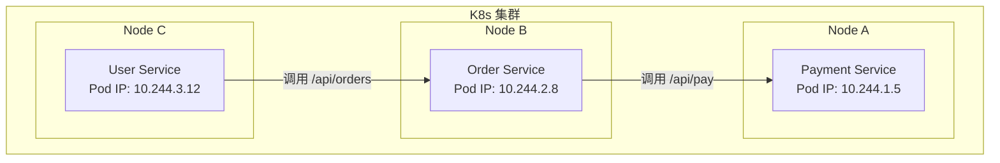

如何保证 Order Service 调用 Payment Service 时,Payment 能确认对方的身份?

**方案 A: IP 白名单**

```
Payment Service 配置:
  allowed_caller_ips:
    - 10.244.2.8  # Order Service 的 IP
```

问题:
- Pod 重启后 IP 会变 → 白名单失效。
- 攻击者只需伪造 IP 即可绕过 (K8s 网络平面内 IP 伪造并不难)。
- 无法区分 "Order Service 的两个实例" 和 "Order Service + 恶意 Pod"。

**方案 B: 共享密钥 (API Key / Token)**

```bash
# 运维给 Order Service 和 Payment Service 配置同一个密钥
ORDER_SERVICE_SECRET="abc123xyz"
PAYMENT_SERVICE_SECRET="abc123xyz"

# Order 调用 Payment 时带上密钥
curl -H "Authorization: Bearer abc123xyz" https://payment/api/pay
```

问题:
- 密钥泄漏后,**所有调用方身份都不可信**——你不知道请求是 Order Service 发的还是攻击者发的。
- 密钥轮换困难: 需要同时更新 Order 和 Payment,中途会出现认证失败。
- 密钥通常写在配置文件或环境变量中,容易被泄露。
- 无法实现**细粒度的服务间授权**: 密钥验证是 "全有或全无"。

**方案 C: Kubernetes ServiceAccount Token**

```bash
# Order Service 用它的 SA Token 调用 Payment
curl -H "Authorization: Bearer $(cat /var/run/secrets/kubernetes.io/serviceaccount/token)" \
  https://payment/api/pay
```

问题:
- SA Token 是**长期有效的** (1.24 之前甚至永不过期)。
- **任何**拿到这个 Token 的人/进程都可以冒充 Order Service。
- Token 的受众是 Kubernetes API Server,不是 Payment Service — Payment 需要调用 K8s API 做 TokenReview,增加延迟和依赖。

### 2.2 没有 SPIRE 时,安全问题的根源

以上三种方案有共同的缺陷:

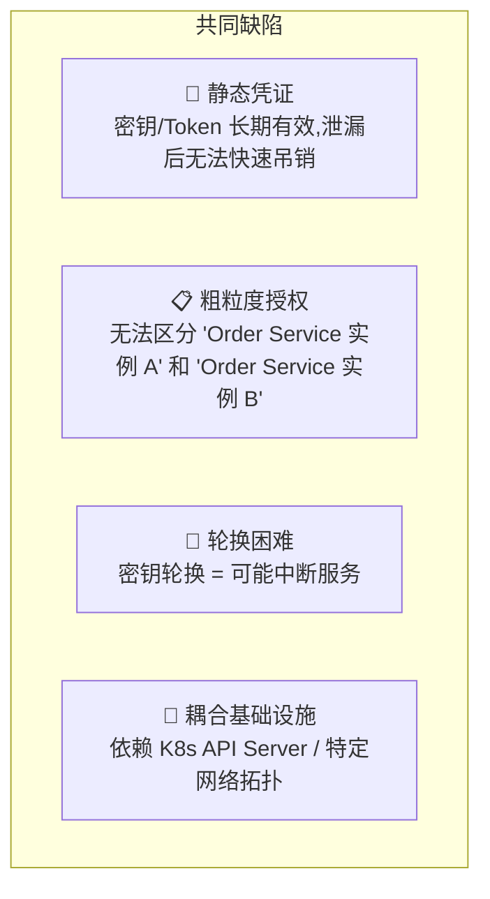

**根本问题**: 缺少一个 **标准化的、动态的、可验证的工作负载身份体系**。

---

## 三、SPIRE 解决了什么?

### 3.1 核心能力一: 标准化的加密身份

有了 SPIRE,每个工作负载都有一个可加密验证的身份:

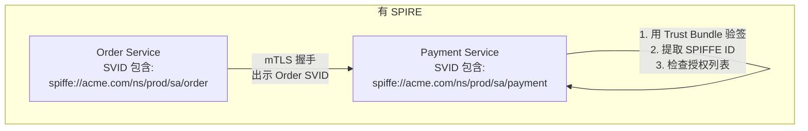

对比:

| 维度 | 无 SPIRE | 有 SPIRE |
|------|---------|----------|
| **身份形式** | IP 地址 / 静态密钥 / SA Token | X.509 证书 (SPIFFE ID 嵌入在 SAN 中) |
| **可验证性** | 需调用外部服务验证 (如 TokenReview) | 本地用 Trust Bundle 即可验证签名 |
| **有效期** | 长期 / 永久 | 短期 (默认 1h),自动轮换 |
| **粒度** | "这个密钥" → 无法区分实例 | "这个 SPIFFE ID" → 精确到 Pod |
| **跨平台** | 绑定 K8s | 多云、裸机、VM 统一 |

### 3.2 核心能力二: 自动化的证书生命周期

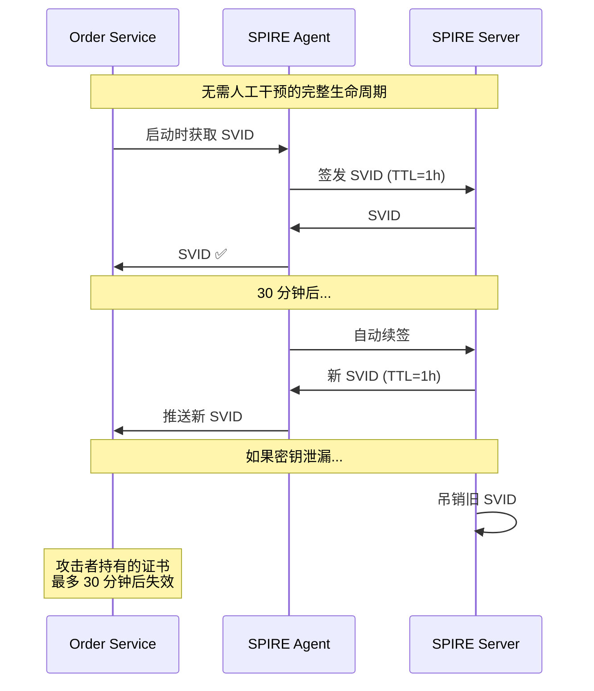

> **关键优势**: 不需要运维手动生成、分发、轮换证书。证书泄漏的影响窗口被限制在 TTL 的一半以内。

### 3.3 核心能力三: 细粒度的服务间授权

SPIRE 使你可以实现**基于 SPIFFE ID 的精确授权**:

```go
// Payment Service 的授权逻辑
var allowedCallers = map[string][]string{
    "/api/pay": {
        "spiffe://acme.com/ns/prod/sa/order",       // Order Service 可以调
        "spiffe://acme.com/ns/prod/sa/api-gateway",  // API Gateway 也可以
    },
    "/api/refund": {
        "spiffe://acme.com/ns/prod/sa/admin-panel",  // 只有 Admin 可以退款
    },
    "/api/admin/ledger": {
        "spiffe://acme.com/ns/prod/sa/auditor",      // 只有审计服务可以看账本
    },
}

func authMiddleware(next http.Handler) http.Handler {
    return http.HandlerFunc(func(w http.ResponseWriter, r *http.Request) {
        // 从 mTLS 连接中提取对端 SPIFFE ID
        callerID := getSPIFFEIDFromCert(r.TLS.PeerCertificates[0])

        // 精确匹配: 检查这个 SPIFFE ID 是否有权限访问这个 API
        allowed, ok := allowedCallers[r.URL.Path]
        if !ok || !contains(allowed, callerID) {
            http.Error(w, "Forbidden", 403)
            return
        }
        next.ServeHTTP(w, r)
    })
}
```

这种细粒度授权在传统方案中几乎不可能实现——你无法给每个微服务实例颁发独立的、可验证的证书。

### 3.4 场景对比: 有 SPIRE vs 无 SPIRE

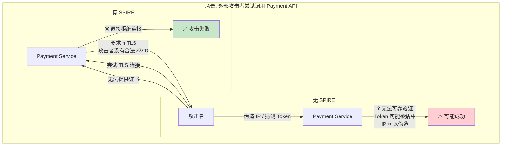

---

## 四、SPIRE 的能力边界: 不能防什么?

SPIRE 不是银弹。理解它的能力边界,才能正确评估它在整体安全架构中的位置。

### 4.1 边界一: 节点被攻破 (root 权限) — 三种攻击路径详解

**结论: SPIRE 不能防。** 当攻击者拿到节点 root 后,至少有 **三种方式** 获取同节点上任意 Pod 的 SVID。下面逐条分析。

#### 4.1.1 前置理解: Agent 如何识别 Pod 身份

要理解攻击为什么能成功,必须先理解 SPIRE Agent 的 `k8s` Workload Attestor 的判断依据:

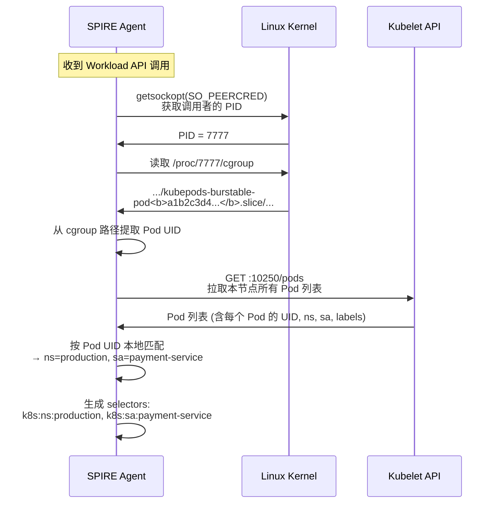

**核心机制**: Agent 通过 cgroup→Pod UID→Kubelet 查询→生成 selectors。整个链路只依赖内核提供的信息,不检查调用者的二进制、内存或任何应用层特征。

---

#### 4.1.2 攻击路径 A: nsenter 进入现有 Pod

拥有 root 后最直接的方式——用 `nsenter` 进入目标 Pod 的 namespace,然后调用 Workload API:

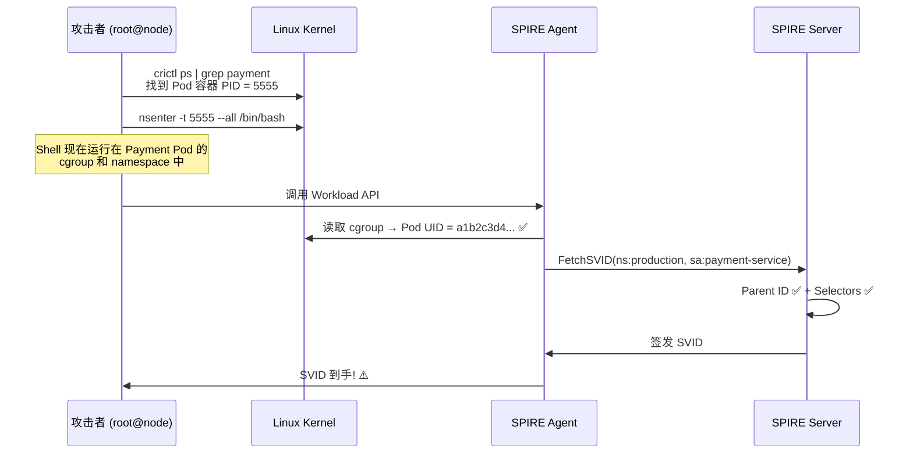

**为什么成功**: `nsenter` 让攻击者的进程获得了目标 Pod 的真实 cgroup,内核向 Agent 报告的是真实信息,Agent 无法分辨调用者是原装应用还是入侵者。

---

#### 4.1.3 攻击路径 B: 自己创建满足 selectors 的新 Pod

上面的方式是 "潜入现有 Pod"。还有另一条路: **创建一个新 Pod,让它的 ns/sa 匹配注册条目的 selectors**。

```
注册条目:
  selectors: k8s:ns:production, k8s:sa:payment-service
  → SPIFFE ID: spiffe://acme.com/ns/prod/sa/payment

攻击者思路:
  不用潜入 Payment Pod,自己建一个就行!
  → 新 Pod ns=production, sa=payment-service
  → selectors 一样能匹配
  → 照样拿到 Payment 的 SPIFFE ID
```

**B1: 创建 Static Pod**

Kubelet 除了通过 API Server 管理 Pod,还会 watch 本地一个 manifest 目录 (默认 `/etc/kubernetes/manifests/`),自动创建其中的 Pod 定义:

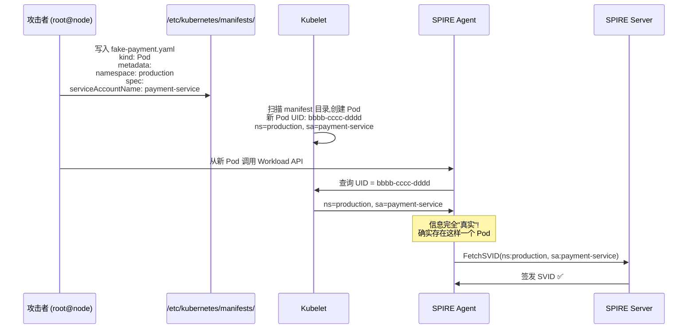

**Kubelet 不验证** "这个 Pod 是否应该运行在这个节点上" 或 "这个 SA 是否真的属于这个 Pod",它照单全收。

**B2: cgroup 伪造 (更底层)**

不创建 Pod,直接操作 Linux cgroup 文件系统,让 Agent 误以为调用者属于目标 Pod:

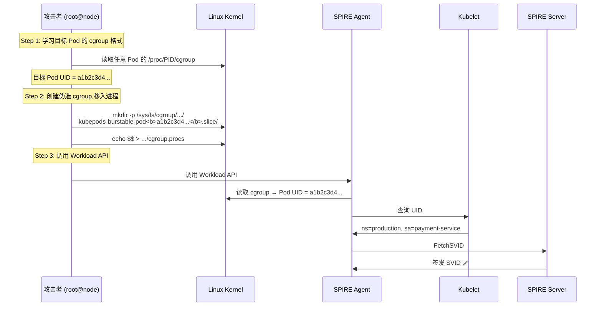

Linux cgroup 是文件系统接口,root 有完全读写权限。攻击者可以创建任意路径结构、将进程移入任意 cgroup。Agent 读到什么就信什么。

---

#### 4.1.4 三路对比: 为什么 SPIRE 每条都拦不住

| 维度 | A: nsenter | B1: Static Pod | B2: cgroup 伪造 |
|------|-----------|---------------|-----------------|
| **原理** | 潜入已有 Pod | Kubelet 创建新 Pod,新 Pod 碰巧匹配 selectors | 伪造 cgroup 归属 |
| **cgroup 检查** | 真实 Pod 的 cgroup ✅ | 新 Pod 的真实 cgroup ✅ | 攻击者伪造,但内核如实报告 ✅ |
| **Kubelet 查询** | 返回真实 Pod 信息 ✅ | 返回新 Pod 信息 (攻击者设定的) ✅ | 返回目标 Pod 信息 ✅ |
| **Selectors** | 真实 Pod 的 ns/sa ✅ | 新 Pod 的 ns/sa 命中 ✅ | 目标 Pod 的 ns/sa 命中 ✅ |
| **SPIRE 能察觉吗** | ❌ | ❌ | ❌ |
| **难度** | 低 (一行 `nsenter`) | 中 (需写 manifest 目录) | 中 (需了解 cgroup 格式) |
| **痕迹** | 少 | 多 (Kubelet 日志) | 少 (cgroup fs) |

**三种路径的共同本质**: 攻击者利用 root 在内核/Kubelet 层面制造了 "真实的假象"。Agent 的整个识别链路——cgroup→Pod UID→Kubelet→selectors——每一步拿到的都是 "真实" 数据,但数据的来源本身已被污染。

> **核心洞察**: SPIRE 保证的是 "身份属性与凭证的映射正确" (cgroup 指向 Pod A → 签发 Pod A 的 SVID),而不保证 "请求这个凭证的进程是否应当拥有它"。后者是节点安全的责任,不是身份基础设施的责任。

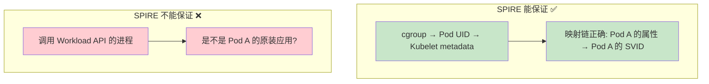

---

#### 4.1.5 为什么这不算 SPIRE 的缺陷?

因为此时攻击者已经有 root 了。root 意味着他可以做比伪造 SVID **严重得多**的事:
- 直接读取 Pod 内存 (dump 进程内存,获取所有运行时数据)
- 拦截 Pod 网络流量 (tcpdump, 中间人)
- 杀掉 Pod 进程后自己监听端口 (完全接管服务)

SVID 泄漏只是节点被攻破的**众多后果之一**,不是根因。把防止节点 root 的责任全压在 SPIRE 上,就像要求一把门锁能防止盗贼用推土机推倒整面墙——这是不同层面的安全问题。

### 4.2 边界二: SPIRE Agent 自身被攻破

**SPIRE 不能防。** 如果攻击者攻破了 Agent 进程 (或 Agent 所在的 Pod),他可以直接:
- 读取 Agent 内存中的 SVID 缓存。
- 篡改 Workload API 的响应。
- 用 Agent 的 SVID 向 Server 请求任意 SVID。

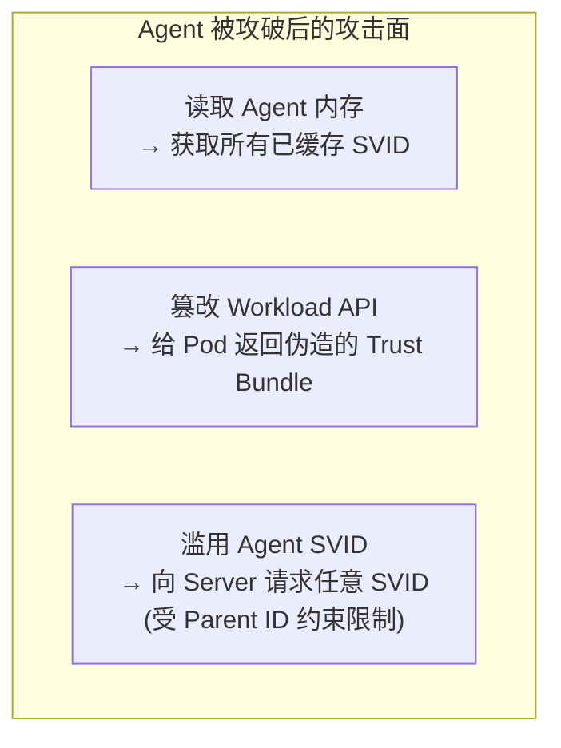

**缓解措施**: Agent 以最小权限运行,使用独立的 ServiceAccount,限制其 RBAC 权限。

### 4.3 边界三: Kubelet 被攻破或伪造

**SPIRE 不能防。** Agent 的 `k8s` Workload Attestor 依赖 Kubelet API 查询 Pod 信息:

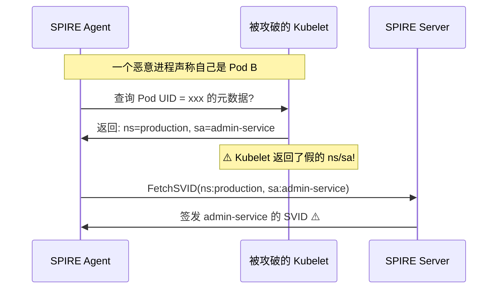

**为什么这是 Kubelet 的问题而不是 SPIRE 的?** SPIRE 的 Workload Attestor 设计上**信任 Kubelet**——因为 Kubelet 是 Kubernetes 节点代理,如果 Kubelet 不可信,整个节点的 Pod 管理都已经失控了。

**缓解措施**:
- 启用 Kubelet 证书验证 (`skip_kubelet_verification = false`)。
- 使用 `k8s_psat` 等不依赖 Kubelet 的认证方式。
- 节点安全加固,防止 Kubelet 被篡改。

### 4.4 边界四: SPIRE Server 被攻破

**SPIRE 绝对不能防。** Server 保存着 CA 私钥,被攻破意味着信任域彻底沦陷:

```
攻击者控制 Server 后可以:
  → 签发任意 SPIFFE ID 的 SVID
  → 篡改注册条目 (把攻击者的 Pod 映射到任意 SPIFFE ID)
  → 替换 Trust Bundle (让所有服务信任攻击者的伪造 CA)
  → 删除审计日志,销毁证据
```

**这是最高级别的安全威胁**,需要最高级别的防护:
- Server 的 CA 私钥使用 KMS/HSM 保护。
- Server 部署在独立的、加固的 namespace 中。
- Server 的 Datastore 访问严格控制。
- Server 的操作需要审计和审批。

### 4.5 边界五: 应用本身有漏洞

**SPIRE 不能防。** 如果应用代码有 RCE (远程代码执行) 漏洞:

```
攻击者通过 RCE 在 Payment Pod 内执行代码
  → 这个代码天然在 Payment Pod 的 cgroup 中运行
  → 调用 Workload API 毫无障碍
  → 拿到 Payment Pod 的合法 SVID
  → 以 Payment Pod 的身份访问所有下游服务
```

**这合理吗?** 合理——因为攻击者的代码确实运行在 Payment Pod 里,它**就是** Payment Pod 的一部分。SPIRE 无法区分 "正常的应用代码" 和 "被注入的恶意代码"。

**这是应用安全的责任,不是身份基础设施的责任。**

---

## 五、SPIRE 在整个安全体系中的位置

### 5.1 分层安全模型

SPIRE 属于 **第 3 层——身份与访问控制层**:

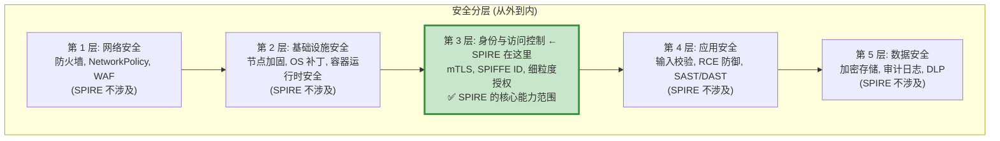

### 5.2 SPIRE 解决的是哪一层的问题?

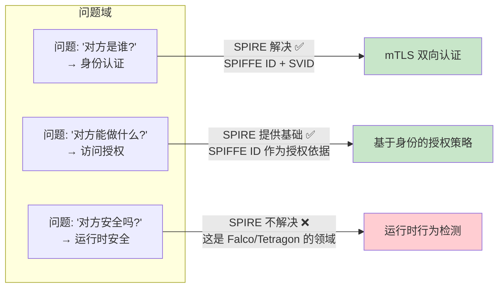

### 5.3 不同攻击场景下,各层的防护责任

```mermaid
graph TB
    subgraph "攻击场景 vs 防护层级"
        direction TB

        S1["场景: 外部攻击者<br/>尝试调用内部 API"]
        S1_D["✅ SPIRE 防得住<br/>没有合法 SVID → mTLS 握手失败"]

        S2["场景: Pod A 尝试<br/>冒充 Pod B"]
        S2_D["✅ SPIRE 防得住<br/>cgroup 不同 → 拿不到 Pod B 的 SVID"]

        S3["场景: 测试集群 Pod<br/>冒充生产集群 Pod"]
        S3_D["✅ SPIRE 防得住<br/>Parent ID 不匹配 → Server 拒签"]

        S4["场景: 攻击者拿到 Node root<br/>进入 Pod namespace"]
        S4_D["❌ SPIRE 防不住<br/>→ 需要基础设施安全层<br/>(节点加固,沙箱运行时)"]

        S5["场景: 应用 RCE<br/>攻击者在 Pod 内执行代码"]
        S5_D["❌ SPIRE 防不住<br/>→ 需要应用安全层<br/>(代码审计,WAF,RASP)"]

        S6["场景: SPIRE Server<br/>被攻破"]
        S6_D["❌ SPIRE 防不住<br/>→ 需要 HSM/KMS, 访问控制<br/>这是身份基础设施的最高防护级别"]
    end

    style S1_D fill:#c8e6c9
    style S2_D fill:#c8e6c9
    style S3_D fill:#c8e6c9
    style S4_D fill:#fff3e0
    style S5_D fill:#fff3e0
    style S6_D fill:#ffcdd2
```

---

## 六、构建以 SPIRE 为中心的纵深防御

理解了 SPIRE 的能力边界后,正确的做法不是放弃 SPIRE,而是**围绕它构建多层防御**:

### 6.1 完整防御架构

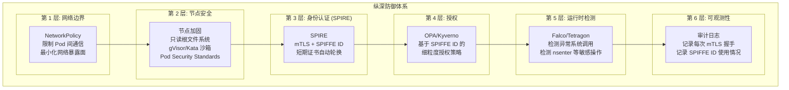

### 6.2 每层失效时,下一层仍然在保护

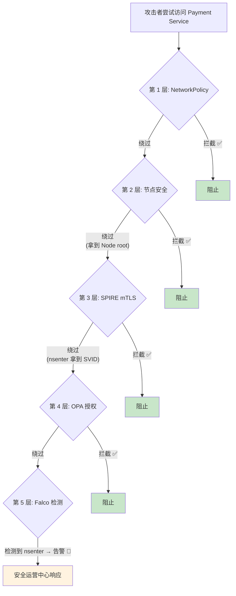

### 6.3 具体配置示例: SPIRE + OPA

**场景**: 即使攻击者拿到了 Pod 的 SVID,OPA 策略可以进一步限制这个 SVID 能做什么:

```rego
# OPA 策略: 只允许特定 SPIFFE ID 访问特定 API
package authz

default allow = false

# 规则 1: Order Service 可以调用 Payment 的 /api/pay
allow {
    input.spiffe_id == "spiffe://acme.com/ns/prod/sa/order"
    input.path == "/api/pay"
    input.method == "POST"
}

# 规则 2: Admin Service 可以调用 /api/refund
allow {
    input.spiffe_id == "spiffe://acme.com/ns/prod/sa/admin-panel"
    input.path == "/api/refund"
    input.method == "POST"
}

# 规则 3: 审计服务只能 GET 账本
allow {
    input.spiffe_id == "spiffe://acme.com/ns/prod/sa/auditor"
    input.path == "/api/admin/ledger"
    input.method == "GET"
}
```

Envoy 或 API Gateway 在收到请求后:
1. 通过 mTLS 提取 SPIFFE ID。
2. 调用 OPA 进行策略决策。
3. 即使 SVID 合法,如果 SPIFFE ID 不在允许列表中,仍然拒绝。

### 6.4 具体配置示例: Falco 检测 nsenter 与 cgroup 篡改

```yaml
# Falco 规则 1: 检测 nsenter (节点被攻破的信号)
- rule: NSEnter Detected
  desc: "检测到 nsenter 命令执行"
  condition: >
    proc.name = "nsenter" and
    container.name != "spire-agent"
  output: >
    ⚠️ nsenter detected!
    user=%user.name command=%proc.cmdline
  priority: CRITICAL

# Falco 规则 2: 检测 cgroup 文件系统写入
- rule: Cgroup Modification by Non-Kubelet
  desc: "非 kubelet/containerd 进程修改了 cgroup 结构"
  condition: >
    (open_write or create) and
    fd.name startswith "/sys/fs/cgroup/kubepods/" and
    proc.name not in (kubelet, containerd, runc)
  output: >
    ⚠️ Suspicious cgroup write detected!
    user=%user.name file=%fd.name proc=%proc.name
  priority: CRITICAL

# Falco 规则 3: 检测 Static Pod manifest 文件写入
- rule: Static Pod Manifest Written
  desc: "检测到向 kubelet manifest 目录写入 Pod 定义"
  condition: >
    (open_write or create) and
    fd.name startswith "/etc/kubernetes/manifests/"
  output: >
    ⚠️ Static Pod manifest written!
    user=%user.name file=%fd.name
  priority: CRITICAL
```

### 6.5 Kubernetes 特有防御措施

针对 Static Pod 和 cgroup 伪造这两条 K8s 特有攻击路径:

```yaml
# 1. 以只读方式挂载 kubelet manifest 目录 (防止 Static Pod)
# 或使用 non-standard 路径并严格限制写入权限
---
# 2. 限制 cgroup 文件系统访问
# PodSecurityStandard: restricted
# 禁止 hostPath 挂载 /sys/fs/cgroup
---
# 3. 使用沙箱运行时 (防止 nsenter + cgroup 访问)
# gVisor / Kata Containers
# 在沙箱中,攻击者无法访问宿主机 namespace 和 cgroup fs
```

当 Falco 检测到异常时:
1. 立即告警到安全运营中心。
2. 自动隔离该节点 (cordons + taint)。
3. 触发 SVID 吊销流程。

---

## 七、总结: SPIRE 的正确定位

### 7.1 一句话定位

> SPIRE 是零信任架构中**身份层的实现**,它解决了"在不可信网络中,如何确定对方的身份"的问题。它不能解决"对方是否安全"的问题——那是其他安全层的职责。

### 7.2 SPIRE 的 "可以" 与 "不可以"

| 类别 | SPIRE 可以 | SPIRE 不可以 |
|------|-----------|-------------|
| **身份认证** | ✅ 为每个工作负载提供可加密验证的 SPIFFE ID | ❌ 验证工作负载的应用代码是否被篡改 |
| **证书管理** | ✅ 自动签发、轮换、吊销 X.509 和 JWT SVID | ❌ 管理非 SPIFFE 体系的证书 |
| **跨服务授权** | ✅ 提供 SPIFFE ID 作为授权决策的输入 | ❌ 制定授权规则 (这是 OPA/Kyverno 的事) |
| **节点安全** | ✅ 通过 Node Attestation 验证节点归属 | ❌ 防止节点被 root |
| **Pod 隔离** | ✅ 通过 cgroup 区分不同 Pod | ❌ 防止同 Pod 内不同进程的权限提升 |
| **网络层防护** | ✅ 提供 mTLS 所需的证书 | ❌ 充当防火墙或 NetworkPolicy |
| **运行时安全** | ✅ 提供身份上下文给 Falco 等工具 | ❌ 检测异常行为 (这是 Falco/Tetragon 的事) |

### 7.3 最终架构全景

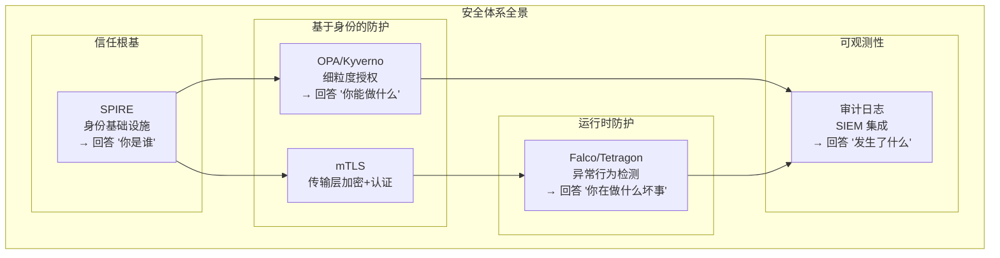

**SPIRE 是整个体系的基石,但不是全部。** 就像房子的地基—没有它房子会塌,但只有地基也不能遮风挡雨。正确使用 SPIRE 的方式,是将它嵌入到完整的纵深防御体系中,让每一层各司其职。

---

## 参考资料

- [SPIRE 概念与基本原理](/k8s/yupcbxxy/)
- [SPIRE 在 Kubernetes 中的部署与工作流程](4.%20spire-in-k8s.md)
- [SPIRE 身份标识: SPIFFE ID、Parent ID 与 Node Alias](3.%20spiffe-id-parent-id-node-alias.md)
- [SPIFFE 安全模型](https://spiffe.io/docs/latest/spiffe-about/spiffe-concepts/)
- [零信任架构 NIST SP 800-207](https://www.nist.gov/publications/zero-trust-architecture)
