# SPIRE 组件、流程与 MySQL 数据表解析

本文从 SPIRE 代码仓库出发，梳理 SPIRE 的核心组件、主要工作流程，以及 SPIRE Server 在 MySQL/SQL Datastore 中的表结构和字段。

## 一、SPIRE 的核心组件

SPIRE 的运行时主要由两个进程组成：

- `spire-server`
- `spire-agent`

它们分别负责不同职责，协同实现 SPIFFE 身份管理。

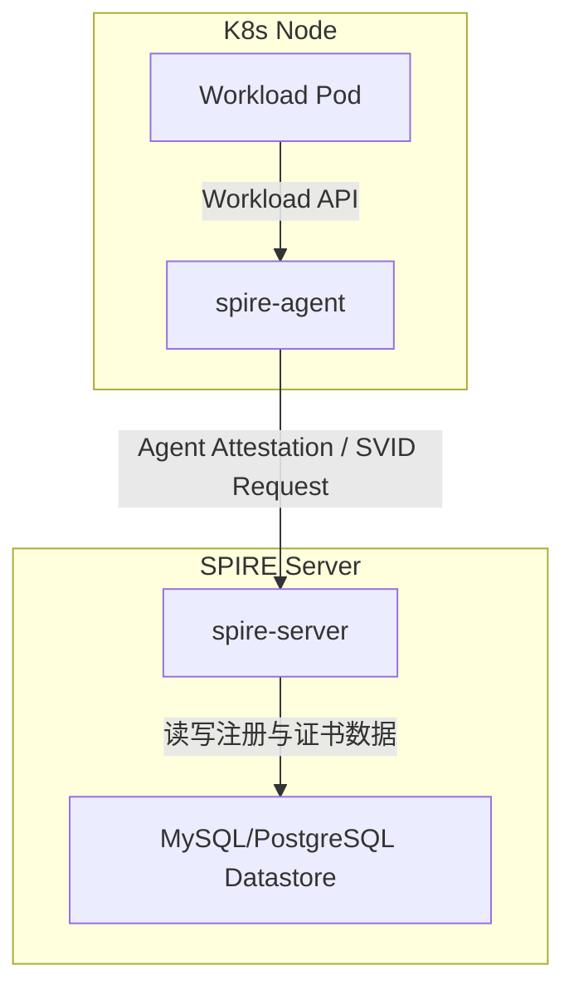

### 1.1 SPIRE Server

SPIRE Server 是信任域的“中心大脑”。它负责：

- 管理 `SPIFFE ID` 的注册条目
- 管理 `trust bundle` 和 CA
- 提供认证和签发 SVID 的能力
- 维护 SQL Datastore 中的所有持久数据
- 执行授权策略、注册条目事件、CA 轮换等

Server 依赖的核心子模块包括：

- `pkg/server/datastore` / `pkg/server/datastore/sqlstore`
- `pkg/server/ca`
- `pkg/server/registration`
- `pkg/server/bundle`
- `pkg/server/authpolicy`
- `pkg/server/endpoints`

### 1.2 SPIRE Agent

SPIRE Agent 部署在每个节点上，作用是：

- 执行 Node Attestation（节点认证）
- 向 SPIRE Server 获取 Agent SVID
- 曝露本地 Workload API，供 Pod 获取 SVID 和 Trust Bundle
- 管理本地 SVID 缓存与自动轮换

Agent 关键子模块：

- `pkg/agent/attestor/node`
- `pkg/agent/attestor/workload`
- `pkg/agent/manager`
- `pkg/agent/endpoints`
- `pkg/agent/storage`

### 1.3 “Controller Manager” 在 SPIRE 里是什么？

SPIRE 代码仓库里没有一个独立的 `spire-controller-manager` 进程。

这里的“controller manager”更多是一个**调用者身份类型**，由 `pkg/server/authpolicy/policy.rego` 中的 `cluster_controller_manager` 策略定义。

它的意义是：

- 用一个特殊 SPIFFE ID 作为 caller
- 允许该 caller 访问、创建、更新自己所管理 cluster UUID 范围内的 entry
- 采用 `hint`、`parent_id`、`entry.id` 等约束，避免跨 cluster 操作

所以它不是独立组件，而是 SPIRE Server 中的一类受控调用者。

## 二、SPIRE 关键流程

### 2.1 SPIRE Server 启动与 Datastore 初始化

SPIRE Server 启动时，会做以下详细流程：

1. 读取配置与日志/metrics 参数
2. 初始化插件 catalog、观察目录中的插件
3. 初始化数据库连接和 schema 检查
4. 加载或创建 CA/JWT Authority
5. 加载 trust bundle，并写入或读取 `bundles` 表
6. 初始化注册管理、Bundle 管理、授权策略、Endpoints 服务
7. 启动 gRPC/http 监听接口，等待 Agent 和客户端请求

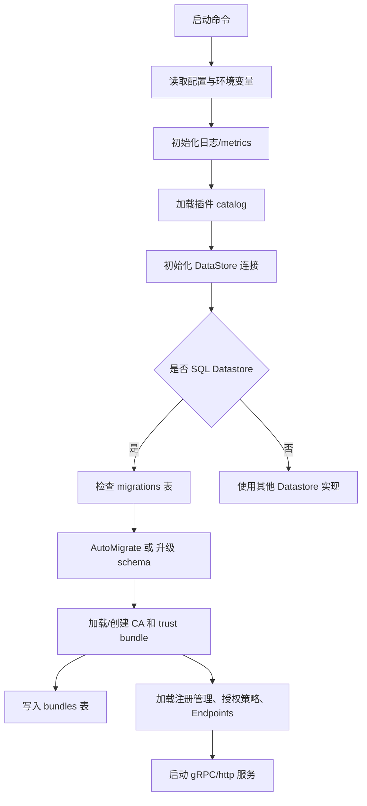

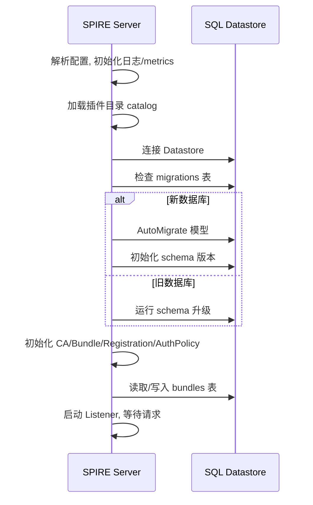

### 2.2 SPIRE Agent 启动与 Node Attestation

SPIRE Agent 启动时，会做以下详细流程：

1. 读取配置与本地目录参数
2. 初始化本地插件 catalog
3. 初始化本地存储和缓存目录
4. 启动 Workload API、本地 socket
5. 执行 Node Attestation：组装节点身份信息并发送给 Server
6. 接收 Agent SVID 和 trust bundle
7. 缓存 SVID 并开始定期续签
8. 等待本地工作负载的 SVID 请求

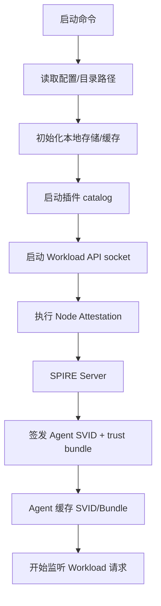

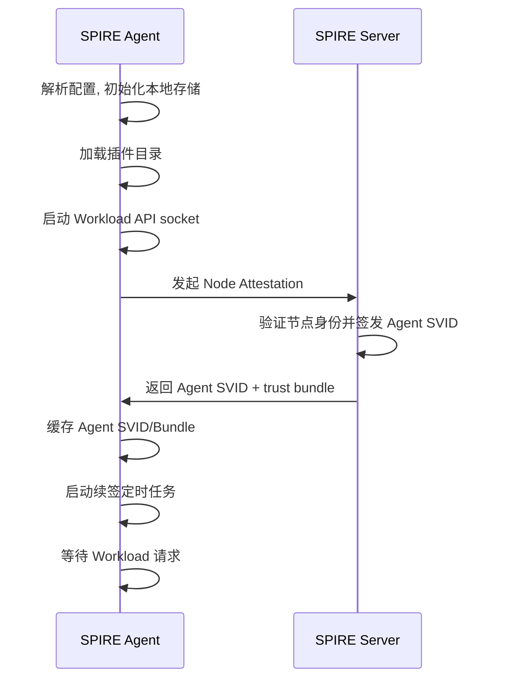

### 2.3 Workload 获取 SVID 的完整流程

Agent 启动后会：

1. 读取本地配置
2. 创建本地目录与存储
3. 启动插件 catalog
4. 执行 Node Attestation
5. 通过 Workload API 暴露本地身份服务

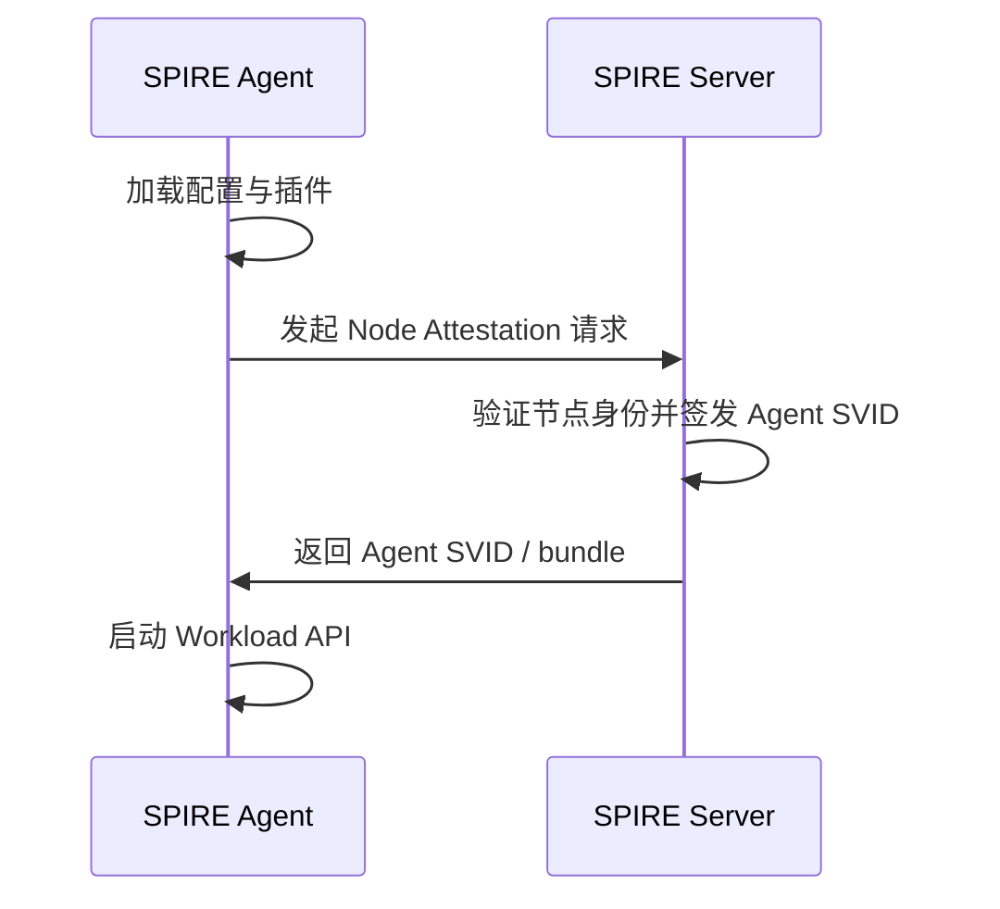

### 2.3 Workload 获取 SVID 的完整流程

这是 SPIRE 最核心的场景之一：Pod 如何拿到自己的身份。

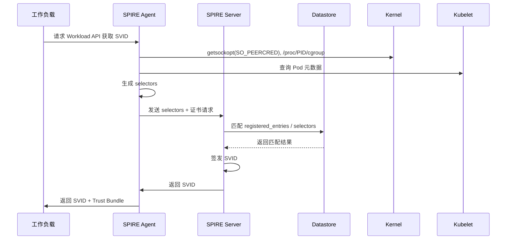

## 三、SPIRE Server 的 MySQL 数据表

SPIRE Server 的 SQL Datastore 实现位于 `pkg/server/datastore/sqlstore`。这里的数据模型由 GORM struct 定义，AutoMigrate 会生成数据库表。

### 3.1 主要表与用途

#### 3.1.1 `bundles`
用途：存储信任域的 trust bundle。

字段：

- `id`
- `created_at`
- `updated_at`
- `trust_domain` `UNIQUE`
- `data`（MEDIUMBLOB）

说明：

- bundle 中保存 CA 证书数据
- 与 `registered_entries` 的联邦关系通过 `federated_registration_entries` 建关联

生成与使用：

- trust bundle 通常在 SPIRE Server 初始化或 Bundle 管理插件加载时生成。
- Server 会从配置的 CA 根证书、活跃的 X.509 authority，或内置 Bundle 插件中构建 bundle 数据。
- 生成后，bundle 会写入 `bundles` 表，并由 Server 用于校验 SVID、签名验证以及向 Agent 提供信任根。
- SPIRE Agent 启动或与 Server 交互时，会获取并缓存该 trust bundle，然后在 Workload API 响应中把 bundle 返回给本地工作负载。
- Workload 通过 trust bundle 验证对端 SVID 的签名，并建立基于 SPIFFE 的 mTLS 信任链。

#### 3.1.2 `attested_node_entries`
用途：存储已认证节点（SPIRE Agent）的信息。

字段：

- `id`
- `created_at`
- `updated_at`
- `spiffe_id` `UNIQUE`
- `data_type`
- `serial_number`
- `expires_at` `INDEX`
- `new_serial_number`
- `new_expires_at`
- `can_reattest`

说明：

- 该表记录 Agent 认证后的节点身份
- 保存当前证书和续签证书信息

#### 3.1.3 `attested_node_entries_events`
用途：记录节点事件。

字段：

- `id`
- `created_at`
- `updated_at`
- `spiffe_id`

说明：

- 该表通常用于事件驱动缓存同步、节点相关事件遍历

#### 3.1.4 `node_resolver_map_entries`
用途：存储 Node Attestor 生成的 selector。

字段：

- `id`
- `created_at`
- `updated_at`
- `spiffe_id`
- `type`
- `value`

说明：

- 每一个 Selector 会映射到一个节点 SPIFFE ID
- 查询节点属性时，Server 会根据这个表来辅助匹配

#### 3.1.5 `registered_entries`
用途：存储 SPIRE 的注册条目。

字段：

- `id`
- `created_at`
- `updated_at`
- `entry_id` `UNIQUE`
- `spiffe_id` `INDEX`
- `parent_id` `INDEX`
- `ttl`
- `admin`
- `downstream`
- `expiry` `INDEX`
- `revision_number`
- `store_svid`
- `hint` `INDEX`
- `jwt_svid_ttl`

说明：

- 这是 SPIRE 的核心注册表
- 一条 entry 定义一个 SPIFFE 身份的匹配规则
- `parent_id` 决定由哪个 Agent 或哪类 Agent 可以请求该 entry

#### 3.1.6 `selectors`
用途：存储注册条目的 selector 列表。

字段：

- `id`
- `created_at`
- `updated_at`
- `registered_entry_id`
- `type`
- `value`

说明：

- 每条注册 entry 有多个 selector
- selector 定义了匹配工作负载的条件

#### 3.1.7 `dns_names`
用途：存储 entry 的 DNS 名称。

字段：

- `id`
- `created_at`
- `updated_at`
- `registered_entry_id`
- `value`

说明：

- 用于 entry 的 DNS 相关配置

#### 3.1.8 `federated_trust_domains`
用途：存储联邦信任域的配置。

字段：

- `id`
- `created_at`
- `updated_at`
- `trust_domain` `UNIQUE`
- `bundle_endpoint_url`
- `bundle_endpoint_profile`
- `endpoint_spiffeid`
- `implicit`

说明：

- 该表保存与其他信任域联邦的详细信息

#### 3.1.9 `ca_journals`
用途：存储 CA 轮转历史/当前 CA 元数据。

字段：

- `id`
- `created_at`
- `updated_at`
- `data`（MEDIUMBLOB）
- `active_x509_authority_id` `INDEX`
- `active_jwt_authority_id` `INDEX`

说明：

- 该表用于 CA 管理与轮换
- `data` 内部保存当前和准备中的 CA 信息

#### 3.1.10 `join_tokens`
用途：存储 Join Token，用于节点启动时加入。

字段：

- `id`
- `created_at`
- `updated_at`
- `token` `UNIQUE`
- `expiry`

说明：

- 该表是节点加入 SPIRE Server 的临时凭证存储

#### 3.1.11 `registered_entries_events`
用途：记录注册条目的事件。

字段：

- `id`
- `created_at`
- `updated_at`
- `entry_id`

说明：

- 这张表记录注册条目创建/修改/删除等事件，用于增量同步或事件通知

#### 3.1.12 `migrations`
用途：记录 schema 版本和代码版本。

字段：

- `id`
- `created_at`
- `updated_at`
- `version`
- `code_version`

说明：

- 这个表由 `pkg/server/datastore/sqlstore/migration.go` 管理
- 用于判断数据库是否需要升级

### 3.2 表之间的关系

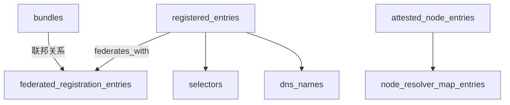

### 3.3 主要写入路径

#### 3.3.1 节点认证写入

- `attested_node_entries`
- `node_resolver_map_entries`
- `attested_node_entries_events`

这类写入发生在 Agent 认证阶段，Server 通过 `CreateAttestedNode`、`SetNodeSelectors` 等接口写入。

#### 3.3.2 注册条目写入

- `registered_entries`
- `selectors`
- `dns_names`
- `federated_registration_entries`
- `registered_entries_events`

这类写入发生在 `spire-server entry create/update/delete` 或 API 变更时。

#### 3.3.3 Bundle 写入

- `bundles`
- `federated_registration_entries`

这类写入发生在 bundle 设置、追加或删除时。

#### 3.3.4 CA 轮转写入

- `ca_journals`

这类写入发生在 SPIRE Server 的 CA 轮转与历史记录阶段。

#### 3.3.5 Join Token 写入

- `join_tokens`

这类写入用于临时允许节点加入，节点启动时读取。

## 四、SPIRE 组件与 SQL 数据流

### 4.1 典型的 Workload SVID 请求路径

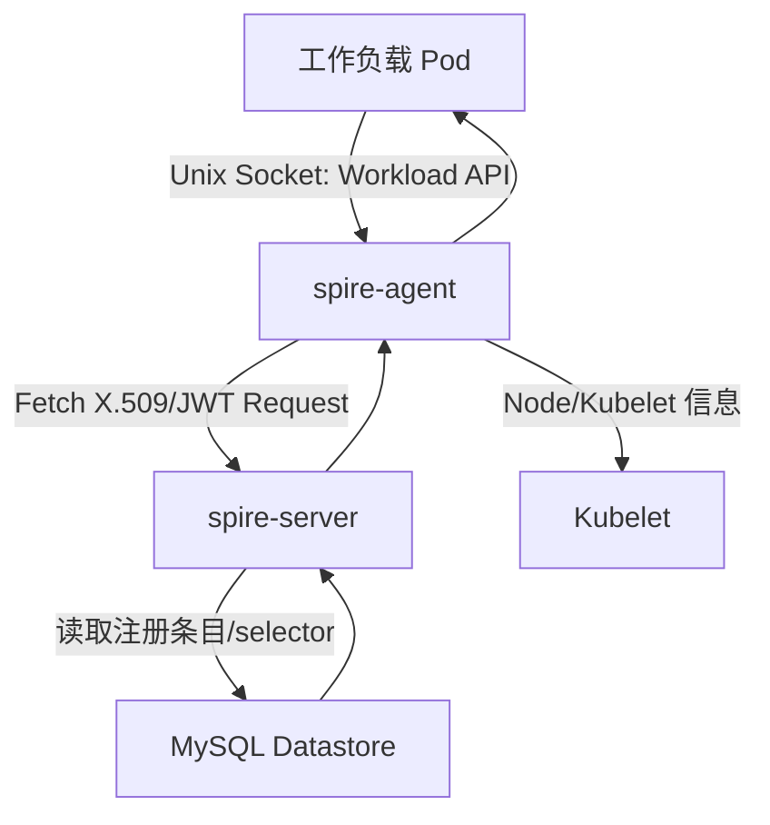

### 4.2 Node Attestation 与注册写入路径

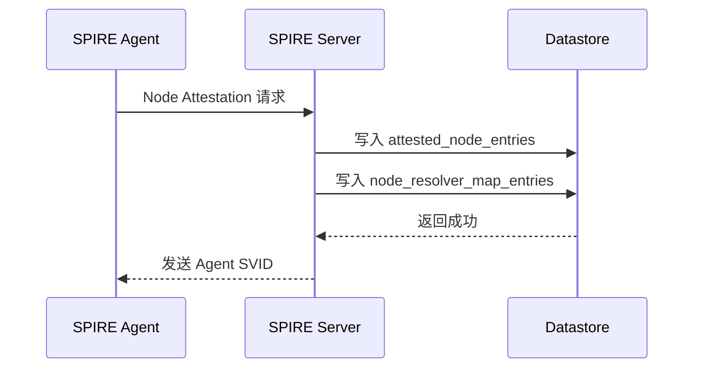

### 4.3 注册条目创建流程

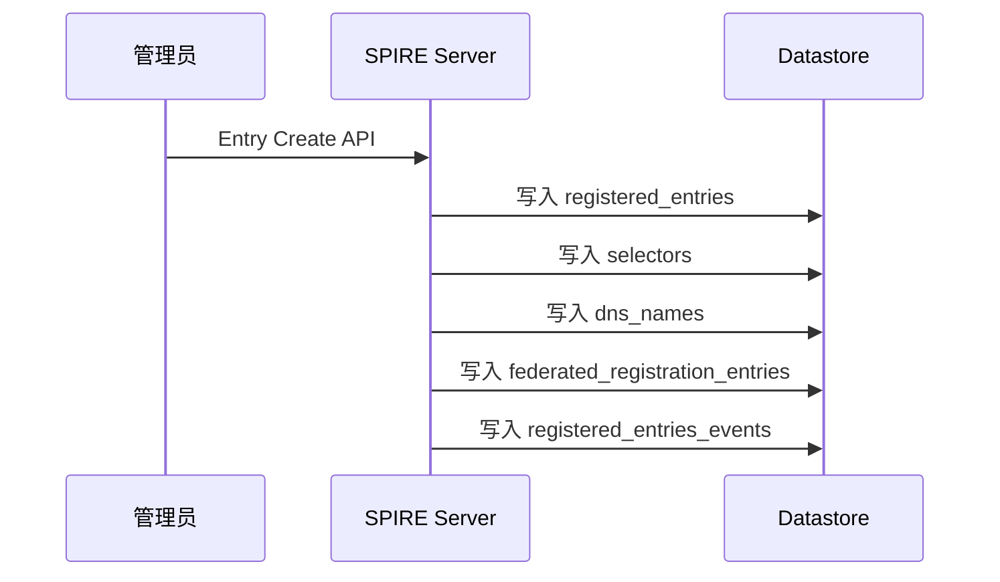

## 五、SPIRE Server 中的“Controller Manager”权限模型

SPIRE Server 的 `authpolicy` 模块专门约束一类调用者：

- SPIFFE ID 格式为 `spiffe://<trust-domain>/cluster_controller_manager/cluster/<uuid>`
- 只能访问属于该 cluster UUID 的注册条目
- 需要在请求中带 `hint = controller-manager-<uuid>`

它的存在说明：SPIRE 的访问控制不仅基于身份，还基于调用者的“语义角色”。

## 六、总结

SPIRE 并不是一个简单的证书签发系统，它是一个由 `spire-server` 和 `spire-agent` 组成的分布式身份基础设施。

- `spire-server` 负责统一管理注册条目、bundle、CA、授权策略和 SQL 数据表
- `spire-agent` 负责每个节点上的身份代理、Workload API 和证书轮转
- `controller manager` 不是独立进程，而是 SPIRE Server 中的一类受控调用者身份
- SQL Datastore 的主要表包括：
  - `bundles`
  - `attested_node_entries`
  - `node_resolver_map_entries`
  - `registered_entries`
  - `selectors`
  - `dns_names`
  - `federated_trust_domains`
  - `ca_journals`
  - `join_tokens`
  - `registered_entries_events`
  - `migrations`

该文章提供了从组件到数据层的端到端视角，适合用于理解 SPIRE 在生产环境中的运行方式。

---

## 参考链接

- SPIRE 代码目录：`pkg/server/datastore/sqlstore`
- Node Attestation：`pkg/agent/attestor/node`
- Workload Attestor：`pkg/agent/attestor/workload`
- Server 授权策略：`pkg/server/authpolicy/policy.rego`
