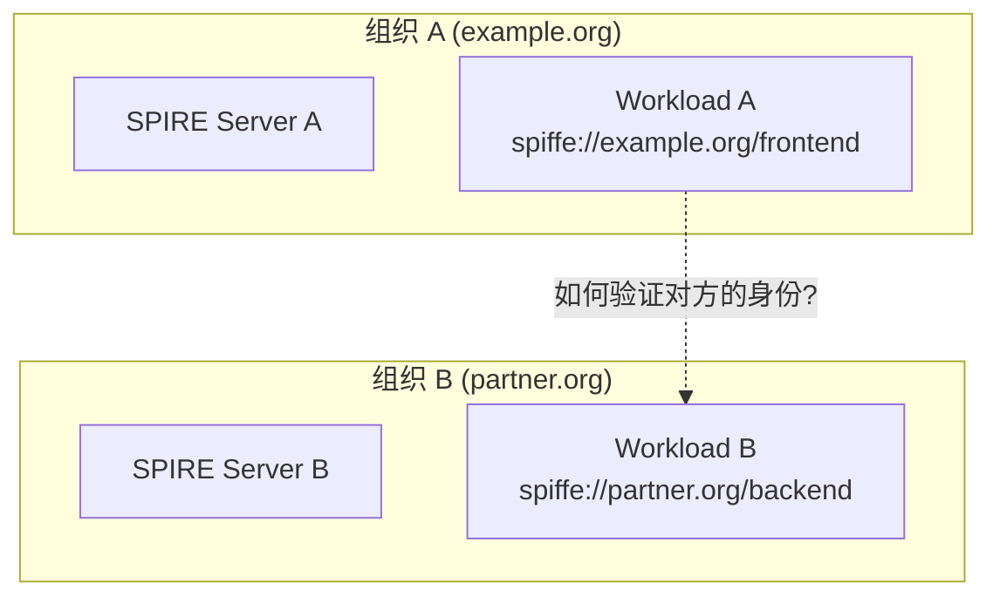
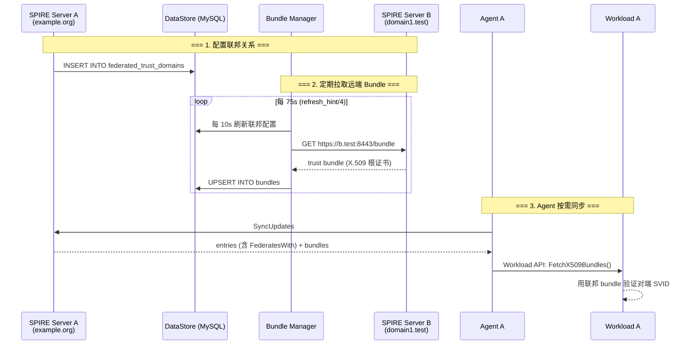
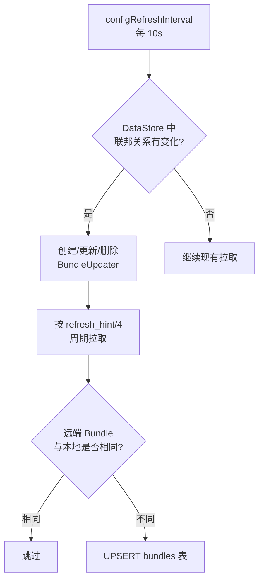
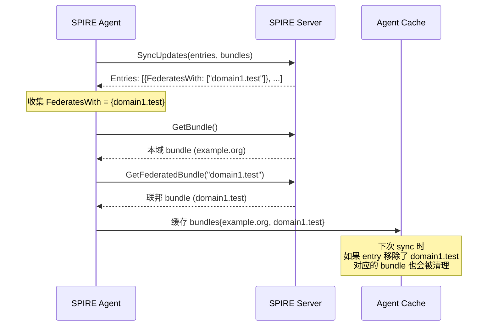
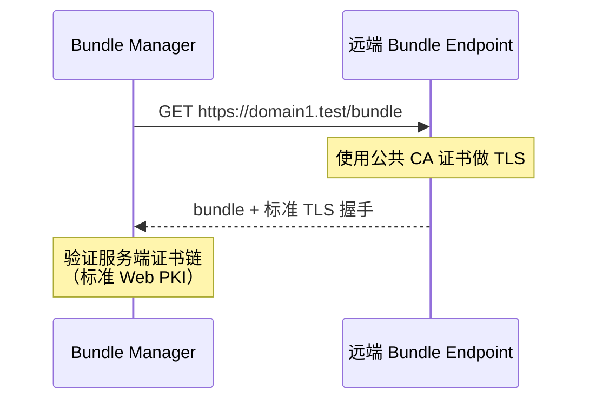
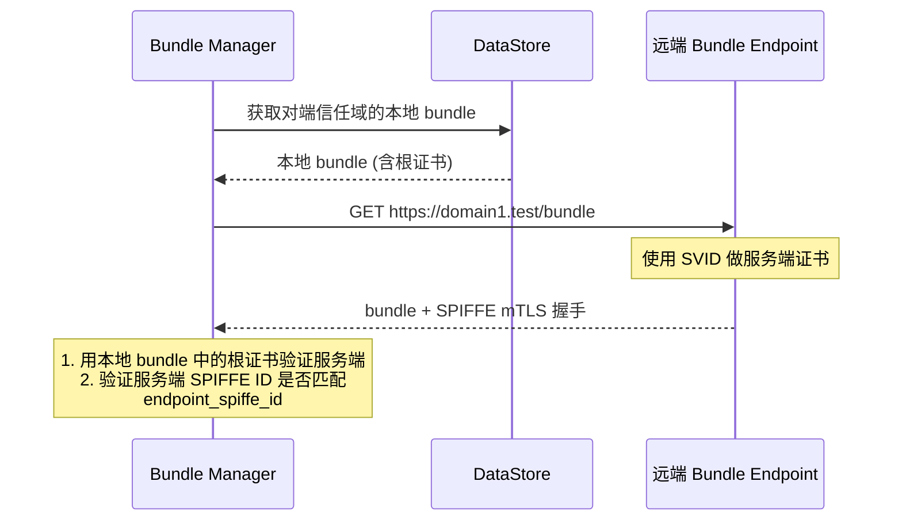
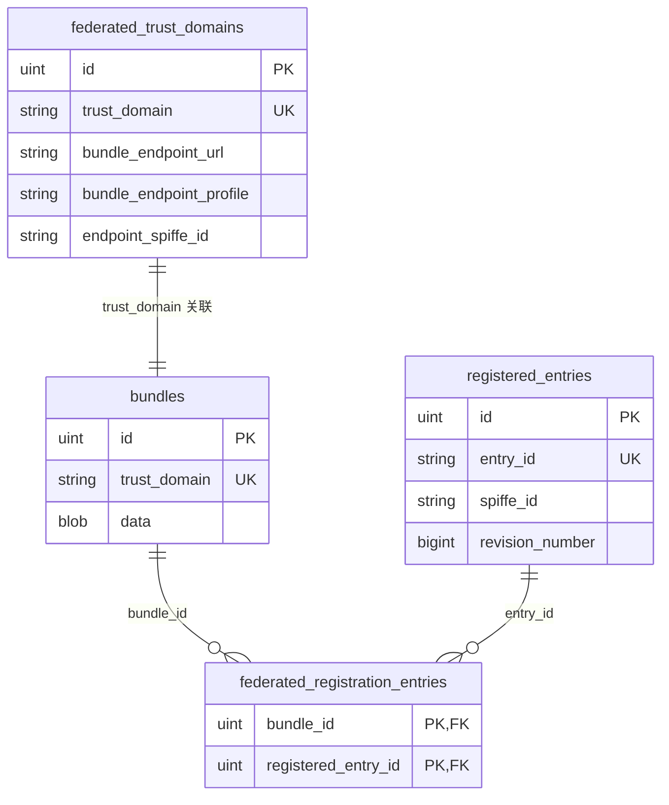
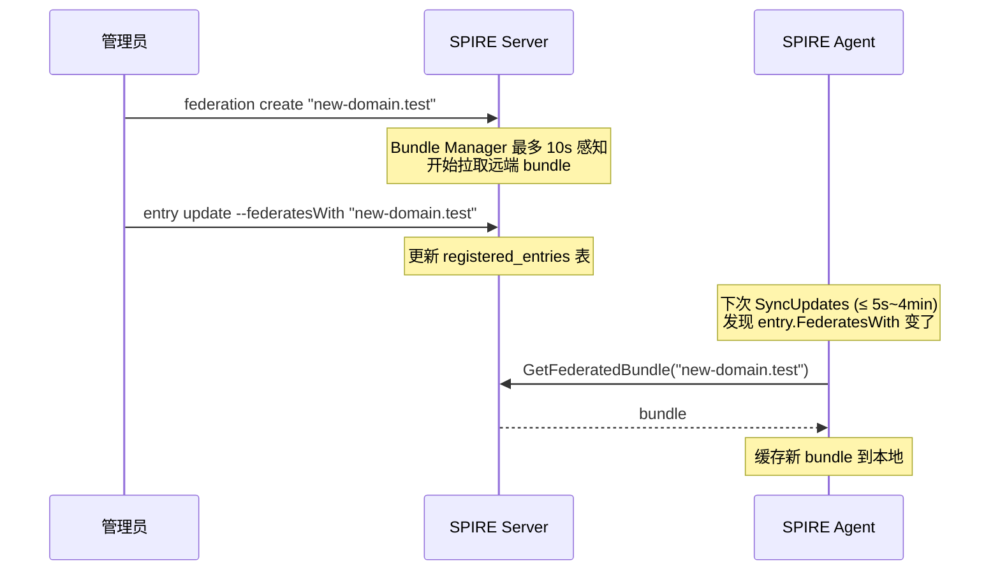

# SPIRE 联邦（Federation）深度解析

## 一、背景：为什么需要联邦？

在前面的文章中，我们讨论了 SPIRE 信任域的概念——一个信任域内的所有工作负载共享同一个根证书，由同一个 SPIRE Server 管理。但在实际生产环境中，往往存在**多个独立的信任域**：



**联邦（Federation）** 就是用来解决跨信任域身份验证的机制——它让 `spiffe://example.org/frontend` 能够验证并信任来自 `spiffe://partner.org/backend` 的身份。

联邦的本质是**信任链的传递**：每个信任域将自己的根证书（Trust Bundle）通过标准的 SPIFFE Bundle Endpoint 暴露出来，其他信任域定期拉取并缓存，从而使跨域身份验证成为可能。

---

## 二、整体架构



核心流程只有三步：

1. **Server 端配置联邦关系**——告诉 SPIRE "我知道如何获取 domain1.test 的 bundle"
2. **Bundle Manager 定期拉取**——从远端 Bundle Endpoint 拉取并存入 DataStore
3. **Agent 按需同步**——根据 Workload 的 Registration Entry 决定拉取哪些联邦 bundle

---

## 三、配置方式

SPIRE 支持两种配置联邦关系的方式：**静态配置**（Server 配置文件）和**动态 API**（Trust Domain API）。

### 3.1 静态配置 (server_full.conf)

```hcl
server {
    federation {
        # 可选：将本 Server 暴露为 Bundle Endpoint
        bundle_endpoint {
            address = "0.0.0.0"
            port = 8443
            refresh_hint = "5m"
            profile "https_web" {
                acme {
                    domain_name = "example.org"
                    email = "admin@example.org"
                }
            }
        }

        # 配置要联邦的外部信任域
        federates_with "domain1.test" {
            bundle_endpoint_url = "https://b.test:8443"
            bundle_endpoint_profile "https_spiffe" {
                endpoint_spiffe_id = "spiffe://domain1.test/spire/server"
            }
        }
        federates_with "domain2.test" {
            bundle_endpoint_url = "https://c.test:8443"
            bundle_endpoint_profile "https_web" {}
        }
    }
}
```

### 3.2 动态 API（推荐）

```bash
# 创建联邦关系
spire-server federation create \
    -trustDomain "domain1.test" \
    -bundleEndpointURL "https://b.test:8443" \
    -bundleEndpointProfile "https_spiffe" \
    -endpointSPIFFEID "spiffe://domain1.test/spire/server"

# 查看所有联邦关系
spire-server federation list

# 手动刷新指定域名的 Bundle
spire-server federation refresh -trustDomain "domain1.test"
```

### 3.3 两种 Profile 对比

| Profile | 验证方式 | 适用场景 |
|---------|---------|---------|
| `https_web` | 标准 TLS（Web PKI） | 对端使用公共 CA 签发的证书 |
| `https_spiffe` | SPIFFE mTLS，验证对端 SPIFFE ID | 对端也是 SPIFFE 兼容系统，运行时需要本地已有对端 bundle |

> **注意**：静态配置会**覆盖**同名的动态配置，且静态关系不会出现在 `federation list` 的输出中。对于需要动态管理的场景，推荐使用 API 方式。

---

## 四、原理详解

### 4.1 Bundle Manager：Server 端的定时拉取器

Bundle Manager 是 Server 内部的一个后台组件，代码位于 `pkg/server/bundle/client/manager.go`：

```go
const (
    // 每 10 秒重新加载联邦配置
    configRefreshInterval = time.Second * 10

    // 默认刷新间隔（当远端未返回 refresh_hint 时）
    defaultRefreshInterval = time.Minute * 5
)
```

工作机制：

1. **每 10 秒**从 DataStore 重新加载 `federated_trust_domains` 表，发现新增/删除的联邦关系
2. 为每个联邦关系创建一个 `BundleUpdater`，根据 profile 创建对应的 HTTP 客户端
3. **定期拉取**远端 Bundle，拉取间隔 = `refresh_hint / 4`（默认 refresh_hint 为 5 分钟，即每 75 秒一次）
4. 如果本地 Bundle 已存在且与远端相同（通过 `bundle.Equal()` 比较），跳过存储
5. 如果不同或有新增，将新 Bundle 以 protobuf 格式存入 `bundles` 表



### 4.2 Agent 同步：按需拉取

Agent 端**不需要任何联邦配置**——这是 SPIRE 设计的关键特点。Agent 根据 Registration Entry 的 `FederatesWith` 字段自动发现需要哪些联邦 Bundle。

从 `pkg/agent/client/client.go` 中的同步逻辑（简化）：

```go
func (c *client) SyncUpdates(ctx context.Context, 
    cachedEntries map[string]*common.RegistrationEntry,
    cachedBundles map[string]*common.Bundle) (SyncStats, error) {

    // Step 1: 从所有 entry 中收集 FederatesWith
    federatedTrustDomains := make(stringSet)
    for _, entry := range cachedEntries {
        for _, federatesWith := range entry.FederatesWith {
            federatedTrustDomains.Add(federatesWith)
        }
    }

    // Step 2: 并发拉取本域 + 联邦 bundles
    protoBundles, err := c.fetchBundles(ctx, federatedTrustDomains.Sorted())
    
    // Step 3: 更新缓存（旧的联邦 bundle 如果不在新列表中会被清除）
    for k := range cachedBundles {
        delete(cachedBundles, k)
    }
    for _, b := range protoBundles {
        cachedBundles[bundle.TrustDomainId] = bundle
    }
}
```



联邦 Bundle 采用的是**并发拉取**机制（`fetchFederatedBundlesConcurrently`），以防止联邦关系过多时同步超时：

```go
// pkg/agent/client/client.go
const maxBundleWorkers = 4  // 最大并发 worker 数

func (c *client) fetchFederatedBundlesConcurrently(...) {
    jobCh := make(chan string)
    // 启动 worker pool
    for range min(maxBundleWorkers, len(trustDomains)) {
        wg.Go(func() {
            for trustDomain := range jobCh {
                bundle, err := c.fetchFederatedBundle(ctx, bundleClient, trustDomain)
                resultCh <- fetchBundleResult{bundle: bundle, err: err}
            }
        })
    }
    // 喂入所有待拉取的信任域
    for _, b := range trustDomains {
        jobCh <- b
    }
}
```

### 4.3 两种 Profile 的握手流程

**https_web 模式**（Web PKI）：



**https_spiffe 模式**（SPIFFE mTLS）：



> **关键**：`https_spiffe` 模式要求本地必须先有对端信任域的 bundle（即"先有鸡还是先有蛋"问题）。解决方案是在创建联邦关系时通过 `-bundle` 参数传入初始 bundle，或者跨域管理员手动交换初始根证书。

---

## 五、涉及的 MySQL 表

### 5.1 `federated_trust_domains` — 联邦关系表

```sql
CREATE TABLE `federated_trust_domains` (
    `id`                      INTEGER PRIMARY KEY AUTO_INCREMENT,
    `created_at`              DATETIME,
    `updated_at`              DATETIME,
    `trust_domain`            VARCHAR(255) NOT NULL,
    `bundle_endpoint_url`     VARCHAR(255),
    `bundle_endpoint_profile` VARCHAR(255),    -- 'https_web' 或 'https_spiffe'
    `endpoint_spiffe_id`      VARCHAR(255),    -- https_spiffe 时的对端 SPIFFE ID
    `implicit`                BOOL,
    UNIQUE INDEX `uix_federated_trust_domains_trust_domain` (`trust_domain`)
);
```

存储所有联邦关系的配置信息。Bundle Manager 每 10 秒读取此表来发现新增/删除的联邦关系。

### 5.2 `bundles` — 信任包表

```sql
CREATE TABLE `bundles` (
    `id`            INTEGER PRIMARY KEY AUTO_INCREMENT,
    `created_at`    DATETIME,
    `updated_at`    DATETIME,
    `trust_domain`  VARCHAR(255) NOT NULL,
    `data`          MEDIUMBLOB,            -- protobuf 序列化的 common.Bundle
    UNIQUE INDEX `uix_bundles_trust_domain` (`trust_domain`)
);
```

**本域 bundle 和所有联邦 bundle 都存在同一张表中**，通过 `trust_domain` 字段区分。`data` 字段存储的是 `common.Bundle` protobuf 消息的二进制序列化数据，包含 X.509 根证书列表和 JWT 签名公钥。

### 5.3 `federated_registration_entries` — 联邦关联表

```sql
CREATE TABLE `federated_registration_entries` (
    `bundle_id`            INTEGER,
    `registered_entry_id`  INTEGER,
    PRIMARY KEY (`bundle_id`, `registered_entry_id`)
);
```

多对多关联表，连接 `bundles` 和 `registered_entries`。表示"哪个 Workload (entry) 需要哪个联邦域的信任包 (bundle)"。

### 5.4 表关系



---

## 六、Agent 和 Workload 需要做什么？

### 6.1 Agent：零配置

Agent 的配置文件（`conf/agent/agent_full.conf`）中**没有任何 federation 相关的配置项**。Agent 完全通过 Entry 的 `FederatesWith` 字段自动感知需要哪些联邦 bundle。

### 6.2 Workload：需要在 Entry 中声明

每个需要与其他信任域通信的 Workload，必须在其 Registration Entry 中显式声明 `federates_with`：

```bash
# 创建 Entry 时指定
spire-server entry create \
    -spiffeID spiffe://example.org/my-workload \
    -parentID spiffe://example.org/my-agent \
    -selector unix:uid:1000 \
    -federatesWith "domain1.test"

# 后续添加联邦关系时更新已有 Entry
spire-server entry update \
    -entryID "entry-id" \
    -federatesWith "domain1.test"
```

在 Kubernetes 中（通过 k8s-workload-registrar）：

```yaml
apiVersion: v1
kind: Pod
metadata:
  name: my-workload
  annotations:
    spire.spiffe.io/federates_with: "domain1.test,domain2.test"
```

### 6.3 已存在联邦关系后如何处理？

如果联邦关系是**后来才配置的**，完整操作流程如下：



---

## 七、设计哲学：为什么不能"配置了就全局联邦"？

一个最常被问到的问题是：**为什么不设计成一旦 Server 配置了联邦关系，Agent 就以信任域维度自动拉取所有联邦 Bundle？这样就不用逐条 Entry 配置了。**

这恰恰是 SPIRE 安全设计的核心——**最小权限原则（Least Privilege）**。

### 7.1 三层安全模型

| 层级 | 配置位置 | 语义 |
|------|---------|------|
| **Server 层** | `federation.federates_with` | "我知道**如何获取**这个域名的 Bundle" |
| **Entry 层** | `RegistrationEntry.FederatesWith` | "**这个具体的 Workload** 被授权与这些域通信" |
| **Agent 层** | 自动聚合所有 Entry 的 `FederatesWith` | "我的 Workloads 需要这些 Bundle，我去拉取" |

### 7.2 安全场景分析

同一个 Agent 节点上可能运行多个不同角色的 Workload：

```
Agent (node1)
├── Workload A (frontend)    → FederatesWith: ["partner.test"]   ← 需要联邦
├── Workload B (backend)     → FederatesWith: ["database.test"]  ← 需要联邦
└── Workload C (internal)    → FederatesWith: []                  ← 纯内部，不需要
```

如果 Agent 以 Server 维度拉取所有联邦 Bundle：
- `Workload C`（纯内部服务）会拿到 `partner.test` 的根证书
- 内部服务没有理由信任外部域——这是不必要的信任材料暴露
- 一旦 `Workload C` 被攻破，攻击者获得了额外的信任锚点，扩大了攻击面

### 7.3 测试代码中的精确验证

SPIRE 的测试代码（`client_test.go`）精确验证了"按 Entry 拉取"的行为：

```go
// 场景：Entry 没有 FederatesWith → 联邦 Bundle 不会被 Agent 缓存
tc.entryServer.entries = []*types.Entry{{
    Id: "0", /* 没有 FederatesWith */
}}
syncUpdates()
// 结果：只有本域 bundle，domain1.test 不存在
// cachedBundles = {"spiffe://example.org": ...}

// 场景：添加 FederatesWith → Bundle 立即被缓存
tc.entryServer.entries[0].FederatesWith = []string{"domain1.test"}
syncUpdates()
// cachedBundles = {"spiffe://example.org": ..., "spiffe://domain1.test": ...}

// 场景：移除 FederatesWith → Bundle 随之被清理
tc.entryServer.entries[0].FederatesWith = []string{"domain2.test"}
syncUpdates()
// domain1.test 的 bundle 被清除，domain2.test 的出现
```

SPIRE 的设计原则是：**每一份信任关系的授予都必须是有意识的安全决策**，而不是配置的副作用。"不声明 = 不联邦"比"配置了 = 全联邦"更安全。

---

## 八、关键参数总结

| 参数 | 默认值 | 说明 |
|------|--------|------|
| `configRefreshInterval` | 10 秒 | Bundle Manager 重新加载联邦配置的间隔 |
| `refresh_hint` | 5 分钟 | Bundle Endpoint 建议的刷新间隔 |
| 实际拉取间隔 | `refresh_hint / 4`（75 秒） | 每个联邦域的实际拉取间隔 |
| `defaultSyncInterval` | 5 秒 | Agent 初始同步间隔 |
| `maxSVIDSyncInterval` | 4 分钟 | Agent 最大同步间隔（有 SVID 时） |
| `synchronizeMaxInterval` | 8 分钟 | 同步最大退避时间 |
| `maxBundleWorkers` | 4 | Agent 拉取联邦 Bundle 的最大并发数 |

---

## 九、兼容性保证

SPIRE 对联邦有严格的版本兼容性保证：

- **Server 间版本偏差**：同一集群中 Server 必须保持在 ±1 个小版本内
- **Agent-Server 版本偏差**：Agent 可以比 Server 最多旧一个小版本，绝不能比 Server 新
- **升级路径**：仅支持单小版本跳跃升级，Server 先于 Agent 升级
- **插件兼容性**：破坏性变更必须保留一个版本的向后兼容性并记录 deprecation warning

---

## 十、总结

SPIRE 联邦是一个设计精巧的跨信任域身份认证机制：

1. **Server 端配置"获取方式"**——指定如何连接远端 Bundle Endpoint
2. **Bundle Manager 自动定期拉取**——每 75 秒从远端获取最新 Bundle
3. **Agent 按需拉取**——仅获取其 Workload 通过 Entry 声明需要的联邦 Bundle
4. **Workload 透明使用**——通过标准 Workload API 获取所有需要的信任材料
5. **最小权限设计**——Entry 级别的 `FederatesWith` 控制确保信任边界不被意外扩大

这种设计在安全性与易用性之间取得了很好的平衡——配置稍显繁琐，但换来的是精确的信任边界控制，这正是零信任安全模型的核心要求。
