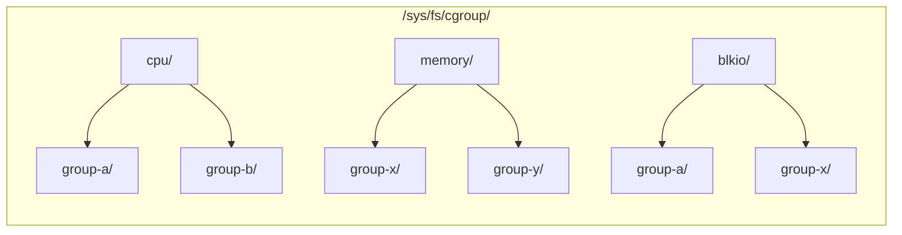

# cgroup v1 详解

> 本文与 [cgroup v2 详解](/linux/cgroup/) 互为对照。如果你使用的是 Ubuntu 22.04+、Debian 11+、RHEL 9+ 等现代发行版，系统默认就是 cgroup v2，可以优先阅读 v2 文章。本文面向仍在使用 cgroup v1 的存量环境，或需要理解 v1 → v2 差异的读者。

## cgroup v1 的架构

cgroup v1 有一个最核心的设计特征：**每个资源控制器（subsystem）各自维护一棵独立的层级树**。



这意味着：

- 同一个进程的 CPU 限制在 `/sys/fs/cgroup/cpu/group-a/` 中管理
- 但它的内存限制可能在 `/sys/fs/cgroup/memory/group-x/` 中管理
- 两者完全独立，没有层级约束

这和 cgroup v2 的统一层级形成了鲜明对比。在 v2 中，一个进程只属于一个 cgroup 目录，该目录下同时有 `cpu.max`、`memory.max`、`io.max` 等所有控制文件。

## 挂载结构

cgroup v1 的挂载点长这样：

```bash
mount | grep cgroup
```

典型输出：

```text
tmpfs on /sys/fs/cgroup type tmpfs (ro,nosuid,nodev,noexec,mode=755)
cgroup on /sys/fs/cgroup/systemd type cgroup (rw,nosuid,nodev,noexec,relatime,xattr,name=systemd)
cgroup on /sys/fs/cgroup/cpu,cpuacct type cgroup (rw,nosuid,nodev,noexec,relatime,cpu,cpuacct)
cgroup on /sys/fs/cgroup/memory type cgroup (rw,nosuid,nodev,noexec,relatime,memory)
cgroup on /sys/fs/cgroup/blkio type cgroup (rw,nosuid,nodev,noexec,relatime,blkio)
cgroup on /sys/fs/cgroup/cpuset type cgroup (rw,nosuid,nodev,noexec,relatime,cpuset)
cgroup on /sys/fs/cgroup/devices type cgroup (rw,nosuid,nodev,noexec,relatime,devices)
cgroup on /sys/fs/cgroup/freezer type cgroup (rw,nosuid,nodev,noexec,relatime,freezer)
cgroup on /sys/fs/cgroup/net_cls,net_prio type cgroup (rw,nosuid,nodev,noexec,relatime,net_cls,net_prio)
cgroup on /sys/fs/cgroup/hugetlb type cgroup (rw,nosuid,nodev,noexec,relatime,hugetlb)
cgroup on /sys/fs/cgroup/pids type cgroup (rw,nosuid,nodev,noexec,relatime,pids)
cgroup on /sys/fs/cgroup/perf_event type cgroup (rw,nosuid,nodev,noexec,relatime,perf_event)
```

每个子系统一行，对应一个独立的挂载点。你可以单独挂载或卸载任意一个子系统。

### 为什么 cgroup 要被"挂载"成一个文件系统？

看到 `mount` 输出里有这么多 `cgroup on ...` 的条目，你可能会困惑：cgroup 不是一个内核资源控制机制吗，为什么要像硬盘一样"挂载"？

答案在于 Linux 内核的经典设计哲学：**一切皆文件**。cgroup 选择了 **cgroupfs**——一种**虚拟文件系统（pseudo-filesystem）**来暴露内核接口。这和 `/proc`、`/sys` 是同一类东西：它们不占用任何磁盘空间，文件内容由内核在读取时实时生成。

```bash
# 对比：这些都是虚拟文件系统，不存在于硬盘上
mount | grep -E "cgroup|proc|sysfs"
# proc on /proc type proc        ← 进程信息
# sysfs on /sys type sysfs       ← 内核对象信息
# cgroup on /sys/fs/cgroup/...   ← 资源控制信息
```

**为什么选择文件系统而不是自定义系统调用？**

| 方式 | 优点 | 缺点 |
|------|------|------|
| 自定义系统调用（`cgroup_limit(pid, type, value)`）| 语义精确 | 每次加新功能要改内核、改 glibc、改所有语言的绑定 |
| 虚拟文件系统（`echo value > /sys/fs/cgroup/.../memory.max`）| 任何语言都能用（`echo`、`cat`、C 的 `fopen`、Python 的 `open()`）| 类型不安全（字符串解析），权限模型依赖文件权限 |

内核开发者选择了后者。用文件系统接口有几个实际好处：

1. **零依赖**：不需要更新 glibc 或任何用户态库，`echo` 和 `cat` 就能操作。
2. **可组合**：可以用 shell 脚本、Python、Go、Rust——任何能读写的语言都能操作 cgroup。
3. **权限模型复用**：直接复用 Linux 的文件权限（`rwx`）和 ACL，不需要重新设计一套权限系统。
4. **可发现性**：`ls` 一下就能看到有哪些控制器、哪些文件，不需要翻文档。

**挂载的本质**：挂载操作把内核中的 cgroup 数据结构"投影"到用户能看到的目录树上。当你执行：

```bash
mount -t cgroup -o cpu,cpuacct none /sys/fs/cgroup/cpu
```

翻译成人话就是："请内核把 cpu 和 cpuacct 这两个控制器的操作接口，以文件的形式放在 `/sys/fs/cgroup/cpu` 这个目录下"。之后你在这个目录下 `mkdir` 就是创建新的 cgroup、`echo` 就是写配置、`cat` 就是读统计。

**cgroup v1 为什么有这么多挂载点？**

这正是 v1 架构的直观体现——每个控制器是一棵独立的树，所以要分开挂载：

```bash
# v1：每控制器一挂载。同一个进程可能分布在不同的挂载点下
/sys/fs/cgroup/cpu/group-a/       # 管 CPU
/sys/fs/cgroup/memory/group-x/    # 管内存  
/sys/fs/cgroup/blkio/group-a/     # 管 IO
# ↑ 三棵树，互不相干

# v2：一个挂载，所有控制器都在一棵树下
/sys/fs/cgroup/group-a/
├── cpu.max       # CPU
├── memory.max    # 内存
└── io.max        # IO
# ↑ 一棵树，一个进程只属于一个目录
```

理解了"为什么是文件系统"，再去读 cgroup 配置文件时就会有更深的领会——你面对的不是普通文件，而是**内核实时生成的资源控制接口**。

## 核心控制器与文件详解

### 1. cpu — CPU 使用率配额

cgroup v1 的 CPU 控制器通过 CFS（Completely Fair Scheduler）实现硬限制和权重分配。

**核心文件：**

| 文件 | 含义 |
|------|------|
| `cpu.cfs_period_us` | 调度周期（微秒），默认 `100000`（100ms）|
| `cpu.cfs_quota_us` | 每周期内允许的 CPU 时间（微秒）|
| `cpu.shares` | CPU 相对权重，默认 `1024` |
| `cpu.stat` | CPU 统计信息 |

```bash
# 限制进程组最多用 1.5 个 CPU 核心
# cfs_quota_us / cfs_period_us = 150000 / 100000 = 1.5 CPU
echo 150000 > /sys/fs/cgroup/cpu/mygroup/cpu.cfs_quota_us

# 不限制（默认）
echo -1 > /sys/fs/cgroup/cpu/mygroup/cpu.cfs_quota_us

# 设置相对权重（不是硬限制，只在 CPU 争抢时起作用）
echo 512 > /sys/fs/cgroup/cpu/mygroup/cpu.shares

# 查看 CPU 使用统计
cat /sys/fs/cgroup/cpu/mygroup/cpu.stat
# nr_periods 1234       ← 经历的调度周期数
# nr_throttled 5        ← 被限流的周期数
# throttled_time 45678  ← 被限流的累计时间（纳秒）
```

### 2. cpuacct — CPU 使用统计（通常和 cpu 一起挂载）

**纯只读**，只负责统计，不做限制。

| 文件 | 含义 |
|------|------|
| `cpuacct.usage` | 累计 CPU 使用时间（纳秒）|
| `cpuacct.usage_percpu` | 每个 CPU 核心的使用时间 |
| `cpuacct.stat` | 按 user / system 分拆的时间 |

```bash
# 查看进程组总 CPU 时间
cat /sys/fs/cgroup/cpu,cpuacct/mygroup/cpuacct.usage
# 98765432100000  （纳秒）

# 换算成秒: 98765 秒 ≈ 27 小时
```

在 cgroup v2 中，`cpuacct` 的功能合并到了 `cpu.stat` 中（`usage_usec` 字段）。

### 3. cpuset — CPU 核心与 NUMA 节点绑定

将进程绑定到指定的 CPU 核心和内存节点。

| 文件 | 含义 |
|------|------|
| `cpuset.cpus` | 允许使用的 CPU 核心列表 |
| `cpuset.mems` | 允许使用的 NUMA 节点 |
| `cpuset.cpu_exclusive` | 是否独占 CPU 核心 |
| `cpuset.mem_exclusive` | 是否独占内存节点 |
| `cpuset.memory_migrate` | 移动进程时是否迁移内存页 |

```bash
# 绑定到 CPU 0-3，NUMA 节点 0
echo "0-3" > /sys/fs/cgroup/cpuset/mygroup/cpuset.cpus
echo "0" > /sys/fs/cgroup/cpuset/mygroup/cpuset.mems

# 创建独占 CPU 分区（其他 cgroup 不能用这些 CPU）
echo 1 > /sys/fs/cgroup/cpuset/mygroup/cpuset.cpu_exclusive
```

限制：cgroup v1 的 `cpuset` 不能像 v2 那样通过 `cpuset.cpus.partition` 创建正式的 CPU 独占分区。v1 的 `cpu_exclusive` 只是一个软约定。

### 4. memory — 内存限制

这是 cgroup v1 中最复杂的控制器，也是 v1 vs v2 差异最大的地方。

**核心文件：**

| 文件 | 含义 |
|------|------|
| `memory.limit_in_bytes` | 内存硬限制 |
| `memory.soft_limit_in_bytes` | 内存软限制（仅全局压力时生效）|
| `memory.usage_in_bytes` | 当前内存用量 |
| `memory.max_usage_in_bytes` | 历史峰值用量 |
| `memory.stat` | 详细内存统计 |
| `memory.oom_control` | OOM 行为控制 |
| `memory.swappiness` | swap 倾向（0-100）|
| `memory.move_charge_at_immigrate` | 迁移时的内存页处理 |
| `memory.use_hierarchy` | 是否计入子 cgroup 的内存 |

```bash
# 限制最大 512MiB 内存
echo 536870912 > /sys/fs/cgroup/memory/mygroup/memory.limit_in_bytes

# 设置软限制 256MiB（全局内存压力时尽量回收超过此值的部分）
echo 268435456 > /sys/fs/cgroup/memory/mygroup/memory.soft_limit_in_bytes

# 查看当前用量
cat /sys/fs/cgroup/memory/mygroup/memory.usage_in_bytes
# 412090368  （≈ 393MiB）

# 查看详细统计
cat /sys/fs/cgroup/memory/mygroup/memory.stat
# cache 12341248           ← 页缓存
# rss 234123456            ← 匿名常驻内存
# mapped_file 567890       ← 通过 mmap 映射的文件
# swap 0                   ← swap 用量
# inactive_anon 12345678   ← 不活跃的匿名页（可回收）
# ...
```

**cgroup v1 内存下调的限制（重要）：**

v1 的 `memory.limit_in_bytes` **不能下调到当前 `memory.usage_in_bytes` 以下**：

```bash
# 假设当前用量 400MiB
echo 268435456 > /sys/fs/cgroup/memory/mygroup/memory.limit_in_bytes
# bash: echo: write error: Device or resource busy  ← EBUSY!
```

这就是为什么 Kubernetes 在 cgroup v1 上无法实现内存的 "NotRequired" 原地调整——必须重启容器（重建 cgroup）才能应用更低的内存限制。

**OOM 控制：**

```bash
# 禁用当前 cgroup 的 OOM killer（不推荐）
echo 1 > /sys/fs/cgroup/memory/mygroup/memory.oom_control
# 进程会 hang 在内存分配上，而不是被杀
```

### 5. blkio — 块设备 IO 限制

限制对块设备（磁盘）的读写带宽和 IOPS。

**核心文件：**

| 文件 | 含义 |
|------|------|
| `blkio.throttle.read_bps_device` | 读带宽上限（字节/秒）|
| `blkio.throttle.write_bps_device` | 写带宽上限（字节/秒）|
| `blkio.throttle.read_iops_device` | 读 IOPS 上限 |
| `blkio.throttle.write_iops_device` | 写 IOPS 上限 |
| `blkio.weight` | IO 权重（CFQ 调度器）|
| `blkio.time` | 各设备的 IO 时间统计 |

```bash
# 格式: <major>:<minor> <limit>
# 限制 /dev/sda (8:0) 读 10MB/s，写 5MB/s
echo "8:0 10485760" > /sys/fs/cgroup/blkio/mygroup/blkio.throttle.read_bps_device
echo "8:0 5242880" > /sys/fs/cgroup/blkio/mygroup/blkio.throttle.write_bps_device

# 限制 /dev/sda 最多 100 IOPS 读
echo "8:0 100" > /sys/fs/cgroup/blkio/mygroup/blkio.throttle.read_iops_device

# 查看 IO 时间分布
cat /sys/fs/cgroup/blkio/mygroup/blkio.time
# 8:0 123456789  ← 设备 8:0 上的累计 IO 时间（毫秒）
```

**cgroup v1 blkio 的限制：**
- `blkio.weight` 只在使用 CFQ 调度器时生效（内核 5.0+ 默认使用 mq-deadline / kyber，CFQ 已移除）
- IOPS 和带宽限制（`throttle.*`）不依赖 CFQ，可用于任何 IO 调度器
- v2 的 `io` 控制器接口更统一：一个 `io.max` 文件就能配置读写带宽和 IOPS

### 6. freezer — 暂停/恢复进程

| 文件 | 含义 |
|------|------|
| `freezer.state` | `FROZEN`（暂停）/ `THAWED`（运行）/ `FREEZING`（暂停中） |

```bash
# 暂停进程组
echo FROZEN > /sys/fs/cgroup/freezer/mygroup/freezer.state

# 恢复
echo THAWED > /sys/fs/cgroup/freezer/mygroup/freezer.state
```

cgroup v2 用 `cgroup.freeze`（写 `1` 或 `0`）替代了 `freezer` 子系统，接口更简洁。

### 7. devices — 设备访问控制

控制 cgroup 内进程对设备文件（`/dev/*`）的读写权限。

| 文件 | 含义 |
|------|------|
| `devices.list` | 当前允许的设备访问列表 |
| `devices.allow` | 添加设备访问规则 |
| `devices.deny` | 删除设备访问规则 |

```bash
# 规则格式: type major:minor access
# type: a=all, c=char, b=block
# access: r=read, w=write, m=mknod

# 允许访问 /dev/null (char 1:3)
echo "c 1:3 rwm" > /sys/fs/cgroup/devices/mygroup/devices.allow

# 禁止访问所有块设备
echo "a *:* rwm" > /sys/fs/cgroup/devices/mygroup/devices.deny

# 查看当前规则
cat /sys/fs/cgroup/devices/mygroup/devices.list
```

cgroup v2 用 eBPF 的 Device Filter 替代了 `devices` 控制器（通过 `bpf()` 系统调用挂载 cgroup device hook）。

### 8. 其他控制器速查

| 控制器 | 核心文件 | 功能 |
|--------|---------|------|
| `net_cls` | `net_cls.classid` | 给网络包打上 classid 标签，用于 `tc`（流量控制）过滤 |
| `net_prio` | `net_prio.ifpriomap` | 设置进程组在不同网卡上的网络优先级 |
| `hugetlb` | `hugetlb.<size>.limit_in_bytes` | 限制大页内存（2MiB / 1GiB）用量 |
| `pids` | `pids.max` | 限制进程数（与 v2 相同）|
| `perf_event` | 通过 `perf_event_open()` 系统调用使用 | 按 cgroup 进行性能事件采样，如 CPU cycles、cache misses |
| `rdma` | `rdma.max` | 限制 RDMA（InfiniBand / RoCE）资源 |

## cgroup v1 独特的进程归属模型

这是 v1 和 v2 的最根本差异之一。

在 cgroup v1 中，**一个进程可以同时属于多个不同子系统的不同 cgroup**：

```bash
# 同一个进程 PID 1234 在不同子系统中属于不同的 cgroup
cat /sys/fs/cgroup/cpu/group-a/cgroup.procs     # 1234 ← CPU 限制在 group-a
cat /sys/fs/cgroup/memory/group-x/cgroup.procs   # 1234 ← 内存限制在 group-x
cat /sys/fs/cgroup/blkio/group-a/cgroup.procs    # 1234 ← IO 限制也在 group-a
```

这种灵活性看似强大，实际带来两个严重问题：
1. **管理混乱**：没有统一的界面查看一个进程的所有资源限制。
2. **无法实现资源间的协调**：例如内存和 IO 控制器无法协作，因为它们在独立的树中。

cgroup v2 修正了这一点：`/sys/fs/cgroup/mygroup/` 下同时有 `cpu.max`、`memory.max`、`io.max`，一个进程放入 `cgroup.procs` 后，所有资源限制统一生效。

## 手动操作 cgroup v1

```bash
# Step 1: 确认使用的是 cgroup v1
[ "$(stat -fc %T /sys/fs/cgroup/)" = "tmpfs" ] || \
  { echo "当前不是 cgroup v1"; exit 1; }

# Step 2: 在 cpu 子系统中创建 cgroup
sudo mkdir /sys/fs/cgroup/cpu/demo
ls /sys/fs/cgroup/cpu/demo/
# 自动生成 cpu.cfs_quota_us, cpu.shares, cpu.stat, tasks 等文件

# Step 3: 限制 CPU 为 0.5 核
echo 50000 | sudo tee /sys/fs/cgroup/cpu/demo/cpu.cfs_quota_us
echo 100000 | sudo tee /sys/fs/cgroup/cpu/demo/cpu.cfs_period_us

# Step 4: 限制内存 64MB（在 memory 子系统中创建同名 cgroup）
sudo mkdir /sys/fs/cgroup/memory/demo
echo 67108864 | sudo tee /sys/fs/cgroup/memory/demo/memory.limit_in_bytes

# Step 5: 将进程加入 cgroup
# 注意：需要在每个子系统中分别加入！
echo $$ | sudo tee /sys/fs/cgroup/cpu/demo/tasks       # v1 用 tasks 而非 cgroup.procs
echo $$ | sudo tee /sys/fs/cgroup/memory/demo/tasks

# Step 6: 验证
cat /sys/fs/cgroup/cpu/demo/cpu.cfs_quota_us   # 50000
cat /sys/fs/cgroup/memory/demo/memory.limit_in_bytes  # 67108864
```

> **注意**：cgroup v1 使用 `tasks` 文件来管理进程进出（v2 使用 `cgroup.procs`）。`tasks` 可以包含线程 ID（TID），而 `cgroup.procs` 只接受进程 ID（PID）。

## cgroup v1 → v2 的关键变化对照表

| 场景 | cgroup v1 | cgroup v2 |
|------|-----------|-----------|
| 挂载结构 | 每控制器独立挂载 | 统一挂载到 `/sys/fs/cgroup/` |
| 进程归属 | 同一进程属于不同子系统的不同节点 | 一个进程只属于一个 cgroup |
| 进程管理文件 | `tasks`（可含 TID）| `cgroup.procs`（仅 PID）+ `cgroup.threads`（仅 TID）|
| CPU 硬限制 | `cpu.cfs_quota_us` / `cpu.cfs_period_us` | `cpu.max`（`$MAX $PERIOD`）|
| CPU 权重 | `cpu.shares` | `cpu.weight` |
| 内存硬限制 | `memory.limit_in_bytes` | `memory.max` |
| 内存软保护 | `memory.soft_limit_in_bytes`（仅在全局压力时作用）| `memory.low`（尽力保护）+ `memory.min`（硬保护）|
| 内存节流 | 不支持 | `memory.high` |
| IO 控制 | `blkio.throttle.*`（分散在多个文件）| `io.max`（一个文件，统一格式）|
| 进程冻结 | `freezer` 子系统，`FROZEN` / `THAWED` | `cgroup.freeze`，写 `1` / `0` |
| 设备访问 | `devices` 子系统 | eBPF Device Filter |
| 事件通知 | 不支持 | `cgroup.events`（`poll()` / `inotify`）|
| 子控制器控制 | 无（每控制器独立启用）| `cgroup.subtree_control`（`+cpu` / `-memory`）|
| 层级约束 | 无 | `cgroup.max.depth` / `cgroup.max.descendants` |
| 杀掉进程组 | 不支持 | `cgroup.kill` |
| 内存下调 | 不可靠（`EBUSY`）| 原生支持 |

## 为什么应该迁移到 cgroup v2

1. **内核不再为 v1 开发新功能**：所有新特性（如 `memory.high` 节流、PSI 压力监控）只在 v2 中实现。
2. **Kubernetes 1.27+ 的 in-place resource resize 强依赖 v2**：内存的 `NotRequired` 原地调整需要 v2 的 `memory.max` 支持动态下调。
3. **containerd / CRI-O 推荐 v2**：容器运行时对 v2 的支持更加完善，systemd cgroup 驱动在 v2 上表现更好。
4. **IO 控制更精确**：v2 的 `io` 控制器支持 `rbps`、`wbps`、`riops`、`wiops` 在同一文件中配置，接口更统一。

## 如何判断当前系统是 v1 还是 v2

```bash
# 一行命令
[ "$(stat -fc %T /sys/fs/cgroup/)" = "cgroup2fs" ] && echo "cgroup v2" || echo "cgroup v1"

# 或者看挂载
mount | grep cgroup | head -3
# 多行 → v1
# 一行 cgroup2 → v2
```

## 总结

cgroup v1 是容器技术发展初期的基石，但它"每控制器一棵树"的架构在扩展性和一致性上遇到了瓶颈。cgroup v2 以统一层级、更完善的内存保护、更简洁的接口彻底解决了这些问题。

如果你在维护一个还在使用 cgroup v1 的环境，本文可以作为接口参考。如果条件允许（内核 >= 5.8、发行版支持），建议尽早迁移到 v2。
