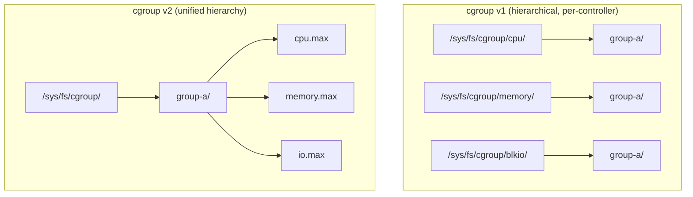
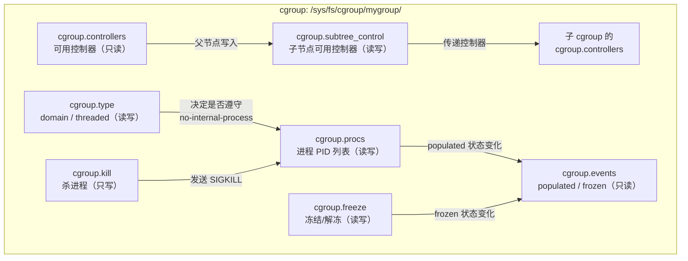
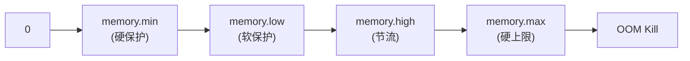

# cgroup v2 详解

## 一句话理解

cgroup（Control Groups）是 Linux 内核提供的一种机制，用于**限制、隔离和统计**一组进程的资源使用。它是容器技术的基石——没有 cgroup，Docker 和 Kubernetes 就无法实现对 CPU、内存等资源的限制。

> cgroup 做的事情就是：把若干进程放进一个"控制组"，然后对这个组说——你最多只能用 2 个 CPU、最多 512MiB 内存、最多 100MB/s 磁盘 IO。超了就限流或杀掉。

## 为什么需要 cgroup

在 cgroup 出现之前，Linux 上对进程资源的控制手段很有限：

| 需求 | cgroup 之前 | cgroup 之后 |
|------|------------|------------|
| 限制进程 CPU 使用 | `nice` / `renice`（只能调优先级，不能设硬上限）| `cpu.max`，精确到微秒级配额 |
| 限制进程内存 | `ulimit -m`（不可靠，很多场景不生效）| `memory.max`，内核强制回收 |
| 统计进程 IO | 几乎无法追踪 | `io.stat`，精确到字节 |
| 隔离一组进程 | 无法做到 | 把进程放进一个 cgroup 即可 |

cgroup 于 2006 年（Linux 2.6.24）由 Google 工程师引入内核，最初叫 "process containers"，后来改名为 cgroup。此后它逐步演进出 v1 和 v2 两个版本。

## cgroup v1 vs v2

这是理解 cgroup 最重要的背景知识。

### 架构差异



cgroup v1 的核心问题是 **每个控制器（cpu、memory、blkio...）各自挂载一棵独立的层级树**。这意味着同一个进程可能在不同子系统中属于不同层级的不同节点，管理复杂且容易产生不一致。

cgroup v2 用 **统一层级（unified hierarchy）** 彻底解决了这个问题：所有控制器挂载在一棵树下，一个 cgroup 目录同时包含 cpu、memory、io 等所有控制文件。

### 关键差异对比

| 特性 | cgroup v1 | cgroup v2 |
|------|-----------|-----------|
| 层级结构 | 每控制器独立树 | 统一树 ✅ |
| 进程归属 | 同一进程可属于不同树的节点 | 一个进程只属于一个 cgroup ✅ |
| 内存限制下调 | 不可靠（内核拒绝）| 原生支持 ✅ |
| 内存保护（soft limit）| `memory.soft_limit_in_bytes` | `memory.low` ✅ |
| IO 控制 | `blkio` 子系统 | `io` 控制器 ✅ |
| PSI（Pressure Stall Info）| ❌ | ✅ |
| 内核推荐 | 冻结维护 | 主力开发方向 |

### 检查当前系统使用的版本

```bash
# 方法 1：查看 /sys/fs/cgroup 的文件系统类型
stat -fc %T /sys/fs/cgroup/
# 输出 cgroup2fs → cgroup v2 ✅
# 输出 tmpfs     → cgroup v1

# 方法 2：查看挂载信息
mount | grep cgroup
# cgroup v1: 看到多行，如 cgroup on /sys/fs/cgroup/cpu, cgroup on /sys/fs/cgroup/memory...
# cgroup v2: 只有一行 cgroup2 on /sys/fs/cgroup type cgroup2

# 方法 3：检查是否存在统一层级文件
ls /sys/fs/cgroup/cgroup.controllers 2>/dev/null && echo "cgroup v2" || echo "cgroup v1"
```

## cgroup v2 核心文件（接口文件）

在深入各个资源控制器之前，先理解 cgroup v2 本身的"骨架"——每个 cgroup 目录下都有一组以 `cgroup.` 开头的接口文件，它们定义了 cgroup 的层级结构、进程归属、控制器启用等基础行为。这些文件不属于任何具体控制器，而是 cgroup v2 统一层级的管理机制。

### 文件一览

```bash
# 创建一个 cgroup 后，自动生成的文件
ls /sys/fs/cgroup/mygroup/
# cgroup.controllers      ← 当前 cgroup 可用的控制器列表
# cgroup.subtree_control  ← 控制哪些控制器对子 cgroup 生效
# cgroup.procs            ← 属于当前 cgroup 的进程 PID 列表
# cgroup.threads          ← 属于当前 cgroup 的线程 TID 列表（threaded 模式）
# cgroup.events           ← cgroup 的事件通知（如进程数为 0）
# cgroup.type             ← cgroup 类型：domain（默认）或 threaded
# cgroup.max.depth        ← 允许创建的最大子 cgroup 层级深度
# cgroup.max.descendants  ← 允许创建的最大子 cgroup 数量
# cgroup.stat             ← cgroup 的统计信息（如包含的子 cgroup 数量）
# cgroup.freeze           ← 冻结/解冻 cgroup 中所有进程
# cgroup.kill             ← 杀掉 cgroup 中所有进程
```

### `cgroup.controllers` — 可用控制器列表

**只读**。列出当前 cgroup 可以使用哪些资源控制器。

```bash
cat /sys/fs/cgroup/cgroup.controllers
# 输出示例:
# cpuset cpu io memory hugetlb pids rdma
```

这个列表取决于：
- 内核编译时是否启用了该控制器
- 父 cgroup 的 `cgroup.subtree_control` 是否启用了该控制器（向下传递）

**常见误区**：即使 `cgroup.controllers` 里列出了 `cpu`，也不代表子 cgroup 继承了 CPU 控制能力。需要在父 cgroup 的 `cgroup.subtree_control` 中显式写入 `+cpu`。

### `cgroup.subtree_control` — 子 cgroup 控制器开关

**可读写**。决定哪些控制器会向下传递给**直接子 cgroup**。这是 cgroup v2 最重要的设计之一——控制器启用是显式、分层级的。

```bash
# 查看当前子 cgroup 启用了哪些控制器
cat /sys/fs/cgroup/cgroup.subtree_control
# 输出: cpu memory pids  （子 cgroup 可以使用这三个控制器）

# 让子 cgroup 也能使用 io 控制器
echo "+io" > /sys/fs/cgroup/cgroup.subtree_control

# 让子 cgroup 不再使用 pids 控制器
echo "-pids" > /sys/fs/cgroup/cgroup.subtree_control
```

**"无内部进程"规则（No Internal Process Rule）**：当一个父 cgroup 的 `cgroup.subtree_control` 非空时（即启用了控制器向下传递），该父 cgroup 就不能再包含进程（`cgroup.procs` 必须为空），除非它是根 cgroup。这个规则确保资源控制的层级关系清晰：

```bash
# 示例：正确的层级
mkdir /sys/fs/cgroup/parent
echo "+cpu +memory" > /sys/fs/cgroup/parent/cgroup.subtree_control
# parent 现在不能有进程（除非它是 root cgroup 的直接子节点）

mkdir /sys/fs/cgroup/parent/child
echo $$ > /sys/fs/cgroup/parent/child/cgroup.procs  # ✅ 进程在 child 中
```

### `cgroup.procs` — 进程归属

**可读写**。列出和修改属于当前 cgroup 的进程。

```bash
# 查看当前 cgroup 中有哪些进程
cat /sys/fs/cgroup/mygroup/cgroup.procs
# 一行一个 PID

# 将当前 shell 移入 mygroup
echo $$ > /sys/fs/cgroup/mygroup/cgroup.procs

# 将 PID 1234 移回父 cgroup
echo 1234 > /sys/fs/cgroup/cgroup.procs
```

**重要规则**（cgroup v2）：
- 一个进程只能属于一个 cgroup（v1 中一个进程可以在不同子系统的不同层级中）。
- 写入 PID 时，该进程会自动从其原 cgroup 中移除。
- 只有叶子 cgroup（没有子 cgroup 的 cgroup）可以包含进程（"无内部进程"规则）。

### `cgroup.events` — 事件通知

**只读**。通过 `poll()` / `inotify` 监听 cgroup 的关键事件。

```bash
cat /sys/fs/cgroup/mygroup/cgroup.events
# populated 1  ← 当前 cgroup 或其子 cgroup 中有进程
# frozen 0     ← 未被冻结
```

| 字段 | 含义 | 用途 |
|------|------|------|
| `populated` | `1` = 有进程；`0` = 空 | 容器管理器监听此字段，判断何时可以清理 cgroup |
| `frozen` | `1` = 已冻结；`0` = 未冻结 | 配合 `cgroup.freeze` 使用 |

这也是 Kubernetes kubelet 判断 Pod 是否已经完全终止的机制之一：当 Pod 对应的 cgroup 的 `populated` 变为 `0`，意味着所有容器进程都已退出。

### `cgroup.type` — cgroup 类型

**可读写**。cgroup 有两种运行模式：

| 值 | 含义 |
|----|------|
| `domain` | 默认模式。可以包含进程，可以有子 cgroup，但遵守"无内部进程"规则 |
| `threaded` | 线程模式。用于管理同一进程内的不同线程组，不遵守"无内部进程"规则 |

```bash
# domain 模式的典型结构（容器场景）
/sys/fs/cgroup/mypod/          # domain，subtree_control 非空 → 不能有进程
├── cgroup.procs               # 空
└── container-a/               # domain，叶子节点 → 可以有进程
    └── cgroup.procs           # PID: 12345, 12346

# threaded 模式的典型结构
/sys/fs/cgroup/mythreaded/     # threaded
├── threads/                   # 管理各线程
│   ├── cgroup.threads         # TID: 200, 201
```

### `cgroup.freeze` — 冻结进程组

**可读写**。暂停或恢复 cgroup 中所有进程的执行。

```bash
# 冻结 mygroup 中的所有进程
echo 1 > /sys/fs/cgroup/mygroup/cgroup.freeze

# 此时所有进程被暂停，CPU 调度器不再调度它们
cat /sys/fs/cgroup/mygroup/cgroup.events | grep frozen
# frozen 1  ← 已冻结

# 解冻
echo 0 > /sys/fs/cgroup/mygroup/cgroup.freeze
```

用途：容器快照前冻结进程、调试时暂停目标进程组等。相比 cgroup v1 的 `freezer` 子系统，v2 的 `cgroup.freeze` 更简单——一个文件，写 `1` 或 `0`。

### `cgroup.kill` — 杀掉进程组

**只写**。向 cgroup 内的所有进程发送 `SIGKILL`。

```bash
# 杀掉 mygroup 中所有进程
echo 1 > /sys/fs/cgroup/mygroup/cgroup.kill
```

这在容器清理场景中非常有用：比遍历 `cgroup.procs` 然后逐个 `kill -9` 更高效和原子。

### `cgroup.max.depth` / `cgroup.max.descendants` — 层级约束

**可读写**。限制子 cgroup 的嵌套深度和总数，防止层级膨胀。

```bash
# 限制 mygroup 下最多只有 3 层子 cgroup
echo 3 > /sys/fs/cgroup/mygroup/cgroup.max.depth

# 限制 mygroup 下最多只有 100 个子 cgroup
echo 100 > /sys/fs/cgroup/mygroup/cgroup.max.descendants
```

### `cgroup.stat` — 统计信息

**只读**。提供当前 cgroup 的统计概览。

```bash
cat /sys/fs/cgroup/mygroup/cgroup.stat
# nr_descendants 5        ← 子 cgroup 总数（递归）
# nr_dying_descendants 0  ← 正在被删除的子 cgroup 数
```

### 文件关系图

把这些文件的关系画出来：



## cgroup 核心控制器

每个控制器（controller，也叫 subsystem）负责管理一种资源。以下按重要性排列：

### 1. cpu —— CPU 时间配额

控制组内进程能使用的 CPU 时间。

**cgroup v2 核心文件：**

| 文件 | 含义 | 示例 |
|------|------|------|
| `cpu.max` | CPU 带宽限制 | `200000 100000` = 最多用 2 个 CPU 核心 |
| `cpu.weight` | CPU 权重（相对比例）| `100`（默认），越大分得越多 |
| `cpu.stat` | CPU 使用统计 | `usage_usec`、`user_usec`、`system_usec` |

```bash
# 限制进程组最多使用 1.5 个 CPU 核心
# 格式: $MAX $PERIOD (单位: 微秒)
echo "150000 100000" > /sys/fs/cgroup/mygroup/cpu.max
# 含义: 每 100ms 周期内最多运行 150ms → 1.5 CPU
```

**cgroup v1 对应文件：**
- `cpu.cfs_quota_us` + `cpu.cfs_period_us`（硬限制，对应 `cpu.max`）
- `cpu.shares`（相对权重，对应 `cpu.weight`）

### 2. memory —— 内存上限与保护

这是最复杂也最重要的控制器。

**cgroup v2 核心文件：**

| 文件 | 类型 | 含义 |
|------|------|------|
| `memory.max` | 硬限制 | 内存用量硬上限，超了就 OOM kill |
| `memory.min` | 硬保护 | 这 `memory.min` 部分内存保证不被全局回收 |
| `memory.low` | 软保护（尽力）| 低于此值的内存尽量不回收，除非别无选择 |
| `memory.high` | 节流阈值 | 超过后限速内存分配但不 OOM |
| `memory.current` | 只读 | 当前内存用量（含 page cache） |
| `memory.swap.max` | swap 限制 | swap 用量上限 |
| `memory.stat` | 只读 | 详细的内存统计 |
| `memory.oom.group` | 控制 | `1` = 整个 cgroup 一起 OOM；`0` = 只杀单个进程 |

```bash
# 限制最大 512MiB 内存
echo "536870912" > /sys/fs/cgroup/mygroup/memory.max

# 保护 128MiB 不被回收
echo "134217728" > /sys/fs/cgroup/mygroup/memory.min

# 设置当超过 400MiB 时节流（throttle）但不杀掉
echo "419430400" > /sys/fs/cgroup/mygroup/memory.high

# 查看当前用量
cat /sys/fs/cgroup/mygroup/memory.current
```

**`memory.max` vs `memory.high` 的区别（重要）：**

| | `memory.max` | `memory.high` |
|------|-------------|--------------|
| 超限行为 | **OOM Kill** — 直接杀进程 | **Throttle** — 让分配变慢，进程进入 D 状态 |
| 用途 | 硬隔离，绝对不能超 | 软限制，允许短暂超用 |
| Kubernetes 对应 | `limits.memory` | 暂无直接对应 |
| 适合场景 | 多租户隔离 | 缓存类应用 |

**cgroup v1 对应文件：**
- `memory.limit_in_bytes`（对应 `memory.max`）
- `memory.soft_limit_in_bytes`（对应 `memory.low`，但语义不同——v1 的 soft limit 仅在全局压力时才生效）

### 3. cpuset —— CPU 和 NUMA 节点绑定

将进程绑定到特定的 CPU 核心和 NUMA 内存节点上，对延迟敏感型应用（如 DPDK、实时处理）至关重要。

```bash
# 绑定到 CPU 核心 0-3
echo "0-3" > /sys/fs/cgroup/mygroup/cpuset.cpus

# 绑定到 NUMA 节点 0
echo "0" > /sys/fs/cgroup/mygroup/cpuset.mems
```

`cpuset` 在 v1 和 v2 中变化不大。v2 的主要改进是 `cpuset.cpus.partition` 可以创建 CPU 独占分区，避免被 root cgroup 中的进程抢占。

### 4. io —— 块设备 IO 控制（v2） / blkio（v1）

限制进程组对块设备（磁盘）的读写速度和 IOPS。

**cgroup v2 核心文件：**

```bash
# 格式: <major>:<minor> rbps=<读上限> wbps=<写上限> riops=<读IOPS> wiops=<写IOPS>
# 限制 /dev/sda (8:0) 读 10MB/s，写 5MB/s
echo "8:0 rbps=10485760 wbps=5242880" > /sys/fs/cgroup/mygroup/io.max

# 查看当前 IO 统计
cat /sys/fs/cgroup/mygroup/io.stat
```

### 5. pids —— 进程数限制

防止 fork bomb：限制一个 cgroup 内同时存在的进程数。

```bash
# 最多允许 100 个进程
echo "100" > /sys/fs/cgroup/mygroup/pids.max

# 查看当前进程数
cat /sys/fs/cgroup/mygroup/pids.current
```

Kubernetes 的 `--pod-max-pids` 功能底层就是通过 pids 控制器实现的。

### 6. 其他控制器

| 控制器 | v1/v2 | 功能 |
|--------|-------|------|
| `hugetlb` | v1 + v2 | 限制大页内存（HugeTLB）用量 |
| `devices` | v1 only | 控制对设备文件（`/dev/*`）的访问 |
| `freezer` | v1 only | 暂停/恢复 cgroup 中所有进程（v2 中由 `cgroup.freeze` 替代）|
| `net_cls` / `net_prio` | v1 only | 给网络包打标签，用于 tc（流量控制）分类 |
| `perf_event` | v1 + v2 | 按 cgroup 进行性能监控 |
| `rdma` | v1 + v2 | 限制 RDMA/IB 资源 |

## cgroup 与 systemd

在现代 Linux 发行版中，你不应该手动操作 `/sys/fs/cgroup` 来管理 cgroup。**systemd 是 cgroup 的唯一写管理者**（Single Writer 原则）。

### systemd 的 cgroup 层级

```
/sys/fs/cgroup/
├── system.slice/          # 系统服务
│   ├── sshd.service/
│   ├── nginx.service/
│   └── ...
├── user.slice/            # 用户会话
│   └── user-1000.slice/
│       ├── session-1.scope/
│       └── ...
└── machine.slice/         # 虚拟机/容器（可选）
```

每个 systemd service 自动获得一个 cgroup：

```bash
# 查看 nginx 服务的 cgroup
systemctl status nginx | grep CGroup
# CGroup: /system.slice/nginx.service

# 查看该 cgroup 的 CPU 限制
cat /sys/fs/cgroup/system.slice/nginx.service/cpu.max

# 临时限制 nginx 的 CPU（重启失效）
systemctl set-property nginx.service CPUQuota=150%
# 等价于:
# echo "150000 100000" > /sys/fs/cgroup/system.slice/nginx.service/cpu.max

# 临时限制内存（重启失效）
systemctl set-property nginx.service MemoryMax=512M
# 等价于:
# echo "536870912" > /sys/fs/cgroup/system.slice/nginx.service/memory.max

# 持久化（写入 drop-in 文件，重启后保留）
systemctl set-property --runtime nginx.service MemoryMax=512M  # --runtime 表示临时
# 不加 --runtime 才会写入 /etc/systemd/system.control/
```

### systemd-cgls：可视化 cgroup 树

```bash
# 树形展示所有 cgroup
systemd-cgls

# 只显示某个 service 的子 cgroup
systemd-cgls -u nginx.service
```

### systemd-cgtop：实时 cgroup 资源监控

```bash
# 类似 top，但按 cgroup 聚合
systemd-cgtop

# 输出示例:
# /sys/fs/cgroup                                tasks   %CPU   Memory  Input/s Output/s
# system.slice                                      42   12.3    1.2G        -        -
# system.slice/nginx.service                         2    5.1   256M        -        -
# user.slice                                        38    3.2   512M        -        -
```

## cgroup 与容器

cgroup 是容器的资源隔离基础。每个容器本质上就是一组被 namespace 隔离的进程，加上一个 cgroup 来限制资源。

### Docker / containerd 如何用 cgroup

当 Docker 创建容器时：

```bash
# --memory 限制容器内存 → 写入 memory.max
docker run --memory=512m --cpus=1.5 nginx

# 背后等价于：
# 1. 在 /sys/fs/cgroup/system.slice/docker-<containerID>.scope/ 下创建 cgroup
# 2. echo 536870912 > memory.max
# 3. echo "150000 100000" > cpu.max
# 4. 把容器进程的 PID 写入 cgroup.procs
```

可以用 `docker inspect` 查看：

```bash
docker inspect <container> | jq '.[0].HostConfig.CgroupParent'
docker inspect <container> | jq '.[0].HostConfig.Memory'
docker inspect <container> | jq '.[0].HostConfig.NanoCpus'
```

### Kubernetes 如何用 cgroup

Kubernetes 的 Pod QoS 模型直接映射到 cgroup：

```
/sys/fs/cgroup/kubepods.slice/
├── kubepods-guaranteed.slice/       # Guaranteed Pods
│   └── pod<UID>.slice/
│       └── cri-containerd-<ID>.scope/
├── kubepods-burstable.slice/        # Burstable Pods
│   └── pod<UID>.slice/
│       └── cri-containerd-<ID>.scope/
└── kubepods-besteffort.slice/       # BestEffort Pods
    └── pod<UID>.slice/
        └── cri-containerd-<ID>.scope/
```

不同 QoS 的 Pod 被放在不同的父 cgroup 下。当节点内存紧张时，kubelet 的 eviction manager 会优先从 `besteffort` → `burstable` → `guaranteed` 的顺序选择 Pod 驱逐，而这个优先级正是通过 cgroup 层级来实现的。

```bash
# 查看一个 Pod 的 cgroup 内存限制
kubectl exec <pod> -- cat /sys/fs/cgroup/memory.max

# 在宿主机上查看
POD_UID=$(kubectl get pod <pod> -o jsonpath='{.metadata.uid}')
cat /sys/fs/cgroup/kubepods.slice/kubepods-burstable.slice/kubepods-burstable-pod${POD_UID}.slice/memory.max
```

## 手动操作 cgroup 实战

虽然生产环境应该通过 systemd 或容器运行时来管理 cgroup，但手动操作是理解底层机制的最佳方式。

### 创建 cgroup 并限制一个进程

```bash
# Step 0: 确保是 cgroup v2
[ "$(stat -fc %T /sys/fs/cgroup/)" = "cgroup2fs" ] || \
  { echo "需要 cgroup v2"; exit 1; }

# Step 1: 创建一个新的 cgroup
CGROUP_NAME="demo-limited"
sudo mkdir -p /sys/fs/cgroup/${CGROUP_NAME}

# Step 2: 查看这个新 cgroup 继承了哪些控制器
cat /sys/fs/cgroup/${CGROUP_NAME}/cgroup.controllers

# Step 3: 设置内存限制 64MB
echo "67108864" | sudo tee /sys/fs/cgroup/${CGROUP_NAME}/memory.max

# Step 4: 设置 CPU 限制为 0.5 核
echo "50000 100000" | sudo tee /sys/fs/cgroup/${CGROUP_NAME}/cpu.max

# Step 5: 启动一个测试进程
# 开一个 shell，持续分配内存
sudo bash -c '
echo $$ > /sys/fs/cgroup/demo-limited/cgroup.procs
# 现在这个 bash 及其子进程都在限制之下
stress --vm 1 --vm-bytes 100M --timeout 10s
'
# 会看到: stress 分配 100MB 内存失败（OOM），因为限制只有 64MB
```

### 实时调整资源限制（这就是 Kubernetes in-place resize 的底层机制）

```bash
# 运行时上调内存限制
echo "134217728" | sudo tee /sys/fs/cgroup/demo-limited/memory.max
# 128MB — 不影响正在运行的进程

# 运行时下调 CPU 限制
echo "25000 100000" | sudo tee /sys/fs/cgroup/demo-limited/cpu.max
# 0.25 核 — 立即限速，进程会变慢但不会被杀
```

### 查看 cgroup 统计信息

```bash
# 内存统计
cat /sys/fs/cgroup/demo-limited/memory.stat
# anon 12345678          ← 匿名页（进程实际使用的内存）
# file 9876543           ← 文件缓存页
# kernel 3456789         ← 内核数据结构
# pgfault 12345          ← 缺页次数
# pgmajfault 67          ← 主缺页次数（需要读磁盘，越高性能越差）

# CPU 统计
cat /sys/fs/cgroup/demo-limited/cpu.stat
# usage_usec 123456789   ← 总 CPU 使用时间（微秒）
# user_usec 100000000    ← 用户态时间
# system_usec 23456789   ← 内核态时间

# IO 统计
cat /sys/fs/cgroup/demo-limited/io.stat
# 8:0 rbytes=123456 wbytes=654321 rios=100 wios=50
```

## cgroup v2 的内存保护机制详解

这是一个容易被忽略但非常重要的特性。cgroup v2 提供了三层内存保护，从强到弱：

| 文件 | 保护强度 | 行为 |
|------|---------|------|
| `memory.min` | 硬保护 | **绝对不会**被回收，除非 OOM 杀掉整个 cgroup |
| `memory.low` | 软保护（尽力）| 在回收其他 cgroup 的内存之前，尽量不回收该 cgroup |
| `memory.max` | 硬限制 | 超过就 OOM 或 throttle |

**三者的协作关系：**



一个容器的内存用量如果低于 `memory.min`，内核保证这块内存不被全局回收。在 `memory.low` 和 `memory.high` 之间，内存受保护但不绝对。超过 `memory.high` 后分配会变慢，超过 `memory.max` 直接被杀。

在 Kubernetes 中：
- `memory.min` 通常被设置为 Pod 的 `requests.memory`（保证该 Pod 不被 eviction）
- `memory.max` 被设置为 Pod 的 `limits.memory`

```bash
# 在节点上查看某个 Pod 的内存保护配置
cat /sys/fs/cgroup/kubepods.slice/.../memory.min    # K8s 可能设为 requests.memory
cat /sys/fs/cgroup/kubepods.slice/.../memory.low    # 通常为 0（K8s 默认不用）
cat /sys/fs/cgroup/kubepods.slice/.../memory.max    # = limits.memory
cat /sys/fs/cgroup/kubepods.slice/.../memory.current # 当前实际用量
```

## 常见问题与调试

### 1. 进程无法加入 cgroup

```bash
echo $$ > /sys/fs/cgroup/mygroup/cgroup.procs
# -bash: echo: write error: Invalid argument
```

原因：cgroup v2 要求必须先设置好资源限制（如 `memory.max`），然后才能添加进程。另外，cgroup v2 中一个进程只能属于一个 cgroup，如果该进程已经在 `/sys/fs/cgroup/user.slice/...` 中，需要先移出。

### 2. 内存限制不生效

常见原因：
- cgroup v1 下调内存到已用量以下 → 内核返回 `EBUSY`
- 在 cgroup v2 中，需要确保该 cgroup 没有任何子 cgroup 在使用内存

### 3. 容器内看不到 cgroup 信息

Kubernetes 挂载 cgroup 到容器时，默认只暴露容器自己的子 cgroup，不暴露宿主机根 cgroup。如果应用需要感知限制，读 `/sys/fs/cgroup/memory.max` 即可。

### 4. cgroup v1 迁移到 v2

大多数现代发行版（Ubuntu 22.04+、Debian 11+、RHEL 9+、Fedora 31+）默认使用 cgroup v2。如果需要手动切换：

```bash
# 编辑 /etc/default/grub
GRUB_CMDLINE_LINUX="systemd.unified_cgroup_hierarchy=1 cgroup_no_v1=all"

# 更新 grub 并重启
sudo update-grub && sudo reboot
```

## 总结

cgroup 是现代 Linux 资源管理的基石，理解它对于使用容器、排查性能问题至关重要：

| 认知层 | 要点 |
|--------|------|
| **是什么** | 内核级的进程组资源限制/隔离/统计机制 |
| **v1 vs v2** | v2 是统一层级，一个目录包含所有控制器；v1 是每控制器独立树 |
| **核心控制器** | cpu（配额）、memory（上限+保护）、cpuset（绑定）、io（磁盘）、pids（进程数）|
| **与 systemd 的关系** | systemd 是 cgroup 的单一写管理者 |
| **与容器的关系** | 每个容器 = namespace 隔离 + cgroup 资源限制 |
| **与 K8s 的关系** | QoS 模型映射到 cgroup 层级，eviction 按层级优先级执行 |
| **内存保护三层** | `memory.min`（硬保护）→ `memory.low`（软保护）→ `memory.max`（硬上限）|
