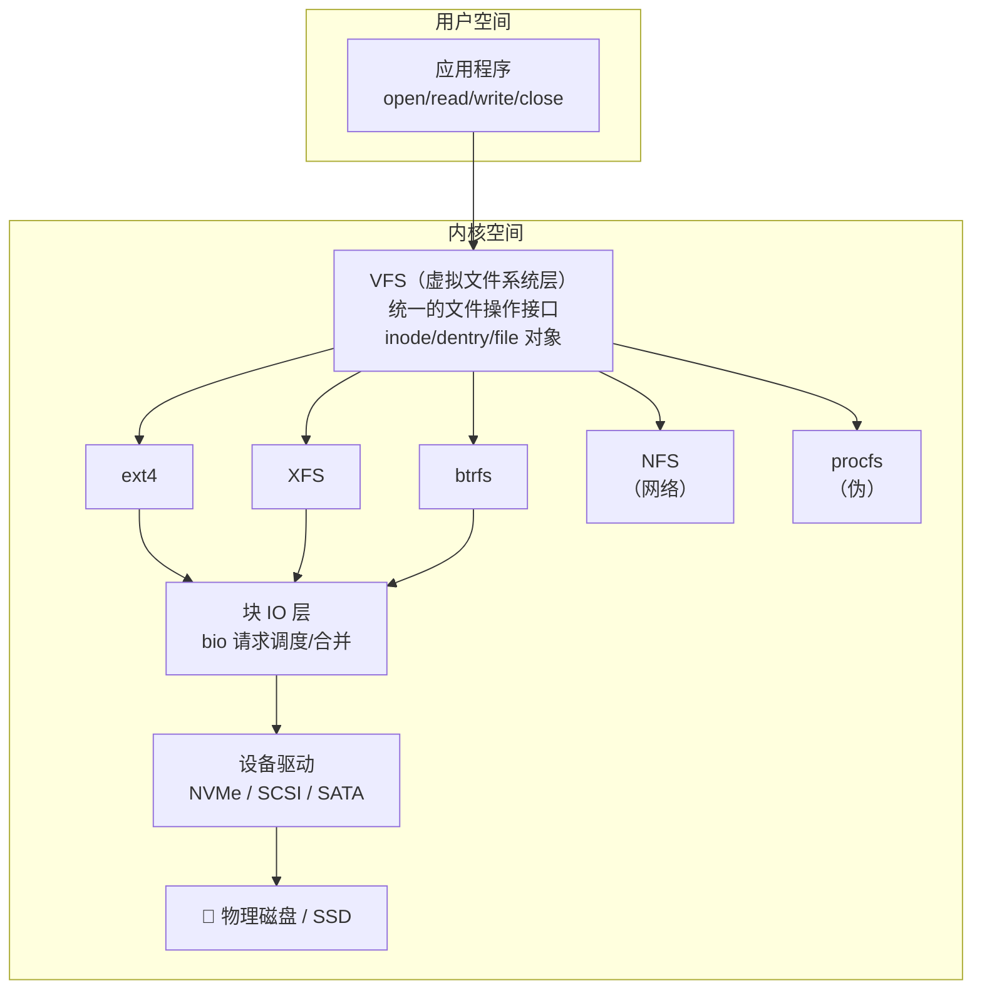
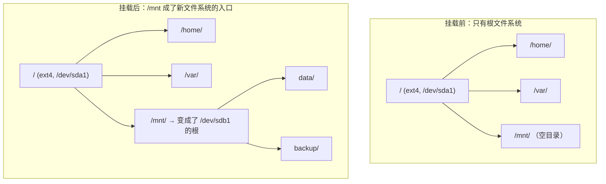
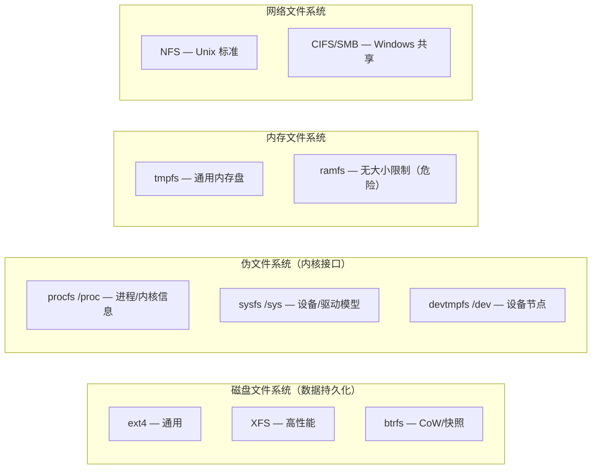
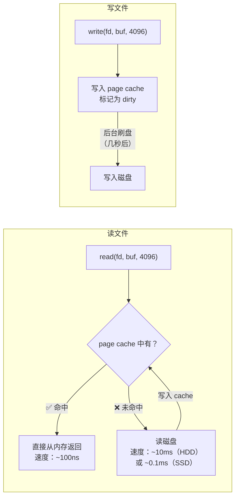
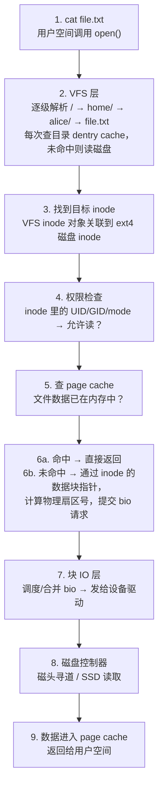

# Linux 文件系统全景

## 一句话理解

文件系统是 Linux 在磁盘上**组织和管理数据**的机制。它不是"文件夹和文件"那么简单——从你敲下 `ls` 到磁盘磁头寻道，中间穿过 VFS、具体文件系统驱动、块 IO 层、设备驱动四层架构。

> 如果把磁盘比作一本**空白笔记本**，文件系统就是那套**目录、页码、索引**的系统，让你能快速找到第 3 章第 5 页写了什么。

## 全景架构：四层模型

Linux 的文件系统不是单一的东西，而是一个分层架构。每一层解决不同的问题：



### 第一层：VFS（Virtual File System）

VFS 是 Linux 文件系统的**万能翻译官**。无论底层是 ext4、XFS、NFS 还是 `/proc` 伪文件系统，上层应用都用同一套系统调用（`open`、`read`、`write`、`close`）。

```bash
# 几十种文件系统，用户完全不感知差异
cat /etc/passwd          # ext4
cat /proc/cpuinfo        # procfs（伪文件系统，数据由内核实时生成）
cat /sys/class/net/lo    # sysfs
ls /mnt/nfs-server/      # NFS 网络文件系统
```

VFS 定义了四个核心内核对象：

| 对象 | 含义 | 对应磁盘结构 | 类比 |
|------|------|-------------|------|
| **super_block** | 一个已挂载的文件系统 | 超级块 | 图书馆的"馆藏总目录" |
| **inode** | 一个文件/目录的元数据 | 磁盘 inode | 一本书的"图书卡" |
| **dentry** | 目录项（文件名→inode 的缓存） | 目录数据块 | 图书馆的"书名索引卡片" |
| **file** | 一个进程打开的文件实例 | 无磁盘对应 | 你借到手里的"那本书" |

> 这就是为什么 Linux 一个正在运行的进程可以访问另一个文件系统的文件——VFS 把所有差异都屏蔽了。

### 第二层：具体文件系统

每种文件系统实现自己的磁盘布局。在 Linux 上常用的有：

| 文件系统 | 定位 | 核心特点 | 典型场景 |
|---------|------|---------|---------|
| **ext4** | 通用默认 | 稳定、成熟、日志 | 根分区、/home、通用服务器 |
| **XFS** | 高性能 | 大文件、高并发 | 数据库、大文件存储 |
| **btrfs** | 新一代 | Copy-on-Write、快照、压缩 | 容器镜像存储、NAS |
| **tmpfs** | 内存文件系统 | 数据在 RAM 中，掉电丢失 | `/tmp`、`/dev/shm` |
| **procfs** | 伪文件系统 | 内核数据暴露，不占磁盘 | `/proc` |
| **sysfs** | 伪文件系统 | 设备/驱动信息 | `/sys` |
| **overlayfs** | 联合文件系统 | 多层叠加 | Docker 镜像分层 |

### 第三层：块 IO 层

所有对磁盘的读写最终都变成对"块"的操作。块 IO 层负责：

- **调度**：把多个 IO 请求合并、排序，减少磁头移动（对 HDD 重要，对 SSD 意义较小）
- **缓存**：page cache——读取过的数据留在内存，下次读直接命中
- **bio 结构体**：描述一次 IO 操作（读/写哪个扇区、多少字节、读到哪个内存页）

### 第四层：设备驱动

最终把 bio 请求翻译成 SCSI/NVMe/ATA 命令发给硬件控制器。

## 文件系统如何"长"在目录树上：挂载（Mount）

Windows 给每个分区分配一个盘符（C:、D:）。Linux 完全不同——所有文件系统长在**同一棵目录树**上，挂载就是把一个文件系统"嫁接"到某个目录节点。



```bash
# 挂载的本质操作
mount /dev/sdb1 /mnt
# 翻译：把 /dev/sdb1 上的文件系统"嫁接"到 /mnt 目录
# 原来 /mnt 里的内容暂时被"遮挡"，卸载后恢复

# 查看所有挂载点
mount | head -5
# /dev/sda1 on / type ext4 (rw,relatime)
# devtmpfs on /dev type devtmpfs (rw)
# proc on /proc type proc (rw)
# tmpfs on /run type tmpfs (rw)
# /dev/sdb1 on /mnt type ext4 (rw)

# 查看磁盘分区
lsblk
# NAME   MAJ:MIN RM  SIZE RO TYPE MOUNTPOINT
# sda      8:0    0  100G  0 disk
# └─sda1   8:1    0  100G  0 part /
# sdb      8:16   0  500G  0 disk
# └─sdb1   8:17   0  500G  0 part /mnt
```

> 这就是为什么 `df -h` 能看到多个文件系统，但 `ls /` 看起来只是一棵普通的目录树——挂载让多个文件系统无缝融合在一棵树下。

### `/etc/fstab`：系统启动时"自动挂载"的配置表

`mount` 命令挂载是临时的，重启就没了。要让挂载**永久生效**，需要写入 `/etc/fstab`（File System Table）。系统启动时，`systemd` 或 `init` 会自动按这个文件逐行挂载。

```bash
cat /etc/fstab
```

典型内容：

```
# <设备>           <挂载点>  <类型>  <选项>           <dump> <fsck顺序>
/dev/sda1          /         ext4    defaults         0      1
UUID=abc123...     /home     ext4    defaults         0      2
UUID=def456...     /var      xfs     defaults,noatime 0      2
tmpfs              /tmp      tmpfs   defaults,size=4G 0      0
//192.168.1.10/share /mnt/nas cifs  credentials=/etc/samba/cred,uid=1000 0 0
/dev/sdb1          /mnt/data ext4    noauto,user      0      0
```

**逐字段拆解**：

| 字段 | 含义 | 举例 |
|------|------|------|
| **第 1 列：设备** | 要挂载的东西 | `/dev/sda1`、`UUID=xxx`、`tmpfs`、`//server/share` |
| **第 2 列：挂载点** | 挂到哪个目录 | `/`、`/home`、`/mnt/data` |
| **第 3 列：文件系统类型** | ext4/xfs/ntfs 等 | `ext4`、`xfs`、`tmpfs`、`cifs`、`nfs` |
| **第 4 列：挂载选项** | 逗号分隔 | `defaults`、`noatime`、`ro`、`noexec` |
| **第 5 列：dump** | 是否用 dump 备份（0=不） | 通常填 `0` |
| **第 6 列：fsck 顺序** | 启动时检查顺序（0=不检查，1=根，2=其他） | 根填 `1`，其他填 `2` 或 `0` |

**常用挂载选项速查**：

| 选项 | 作用 |
|------|------|
| `defaults` | 等于 `rw,suid,dev,exec,auto,nouser,async` |
| `noatime` | 读文件不更新 atime，**显著提升 IO 性能** |
| `relatime` | 折中方案，atime 延迟更新（多数发行版默认） |
| `ro` | 只读挂载 |
| `noexec` | 禁止执行该分区上的二进制文件 |
| `nosuid` | 忽略 suid/sgid 位（安全加固） |
| `noauto` | 启动时不自动挂载（需手动 `mount`） |
| `user` | 允许普通用户挂载/卸载 |
| `size=4G` | 限制 tmpfs 最大大小 |

### `/proc/mounts`：内核眼中的"当前挂载状态"

`/etc/fstab` 是**配置**，`/proc/mounts` 是**事实**——它显示内核当前真正挂载的所有文件系统：

```bash
cat /proc/mounts | head -10
# sysfs /sys sysfs rw,nosuid,nodev,noexec,relatime 0 0
# proc /proc proc rw,nosuid,nodev,noexec,relatime 0 0
# udev /dev devtmpfs rw,nosuid,relatime,size=... 0 0
# /dev/sda1 / ext4 rw,relatime,errors=remount-ro 0 0
# tmpfs /run tmpfs rw,nosuid,nodev,size=... 0 0
# ...
```

`/proc/mounts` 比 `mount` 命令更可靠——它直接来自内核，不经过任何用户态缓存。当 `mount` 命令的输出让你困惑时（比如 systemd 管理的 mount namespace 下），去看 `/proc/mounts`。

### 实操例子：从零添加一个永久挂载

```bash
# 场景：插了一块新硬盘 /dev/sdb1，想永久挂到 /data

# 1. 创建挂载点
sudo mkdir -p /data

# 2. 获取 UUID（比 /dev/sdb1 更可靠，设备名可能变）
sudo blkid /dev/sdb1
# /dev/sdb1: UUID="a1b2c3d4-..." TYPE="ext4"

# 3. 编辑 /etc/fstab，添加一行
echo "UUID=a1b2c3d4-...  /data  ext4  defaults,noatime  0  2" | sudo tee -a /etc/fstab

# 4. 验证配置是否正确（不重启，立刻按 fstab 挂载）
sudo mount -a
# 没报错 → 配置正确

# 5. 确认已挂载
df -h /data
lsblk | grep sdb1
```

### 实操例子：解读一条复杂的 fstab 行

```
UUID=abc123 /mnt/backup ext4 rw,noatime,nosuid,nodev,noexec 0 2
       │         │        │                │                 │  └─ fsck 顺序：2（根以后检查）
       │         │        │                │                 └─ dump：0（不备份）
       │         │        │                └─ 选项：读写、不记录atime、禁用suid、禁止设备文件、禁止执行
       │         │        └─ 类型：ext4
       │         └─ 挂载点：/mnt/backup
       └─ 设备：通过 UUID 标识（最稳定）
```

这条配置的含义是：**把一个 ext4 分区（UUID=abc123）以安全加固模式挂到 `/mnt/backup`——允许读写，但关掉 atime 更新提升性能，禁止 suid/设备文件/执行文件防止安全风险。**

### 实操例子：用 tmpfs 加速编译

```bash
# 在 /tmp 上挂载一个 8GB 的内存盘，IO 极快
# 写入 /etc/fstab：
tmpfs /tmp tmpfs defaults,size=8G,mode=1777 0 0

# 验证
mount | grep /tmp
# tmpfs on /tmp type tmpfs (rw,relatime,size=8G)

# 效果：编译临时文件全在内存中，速度提升数倍
# 代价：重启清空，不能放需要持久化的东西
```

### 三个 mount 相关文件的定位

| 文件 | 性质 | 作用 | 谁写 |
|------|------|------|------|
| `/etc/fstab` | 配置文件 | 定义**应该**挂载什么 | 管理员 |
| `/proc/mounts` | 内核状态 | 显示**当前实际**挂载了什么 | 内核 |
| `/etc/mtab` | 兼容符号链接 | 通常 → `/proc/self/mounts` 或 `/proc/mounts` | 历史遗留 |

## 文件系统目录结构：FHS 标准

Linux 的目录布局遵循 **FHS（Filesystem Hierarchy Standard）**。这不是内核强制要求，而是约定俗成：

```mermaid
graph TD
  Root["/ 根目录"]
  Root --> Bin["/bin — 基本命令（ls, cp, cat）"]
  Root --> Boot["/boot — 内核和启动文件"]
  Root --> Dev["/dev — 设备文件（一切都是文件！）"]
  Root --> Etc["/etc — 配置文件"]
  Root --> Home["/home — 用户家目录"]
  Root --> Lib["/lib — 共享库"]
  Root --> Media["/media — 可移动介质挂载点"]
  Root --> Mnt["/mnt — 临时挂载点"]
  Root --> Opt["/opt — 第三方软件"]
  Root --> Proc["/proc — 进程和内核信息（伪文件系统）"]
  Root --> Root2["/root — root 用户家目录"]
  Root --> Run["/run — 运行时数据（tmpfs）"]
  Root --> Sbin["/sbin — 系统管理命令"]
  Root --> Sys["/sys — 设备和驱动信息（伪文件系统）"]
  Root --> Tmp["/tmp — 临时文件"]
  Root --> Usr["/usr — 用户程序和数据"]
  Root --> Var["/var — 可变数据（日志、缓存）"]
```



关键区分：哪些目录可能是**独立的文件系统**？

| 目录 | 是否常独立挂载 | 原因 |
|------|:------------:|------|
| `/` | — | 根文件系统，必须有 |
| `/home` | ✅ | 用户数据隔离，方便重装系统保留数据 |
| `/var` | ✅ | 日志/数据库增长可能填满根分区 |
| `/tmp` | ✅ | 常挂载为 tmpfs（内存），加速 + 自动清理 |
| `/boot` | ✅ | 某些启动模式要求独立分区 |
| `/usr` | 历史原因 | 过去用于无盘工作站，现在通常合并到 `/` |

## 两类文件系统：磁盘上的 vs 内存中的

不是所有文件系统都对应一块硬盘：



```bash
# 亲手体验不同类型
# 磁盘文件系统
ls -l /etc/hosts          # ext4 上的普通文件

# 伪文件系统——内容不存在磁盘上，内核实时生成
cat /proc/cpuinfo         # CPU 信息
cat /sys/class/net/eth0/address  # MAC 地址

# 内存文件系统——极快，但重启消失
echo "hello" > /dev/shm/test.txt
cat /dev/shm/test.txt     # hello
# 重启后 /dev/shm 清空

# 网络文件系统
mount -t nfs 192.168.1.100:/exports /mnt/nfs
```

## 日志（Journal）与写时复制（Copy-on-Write）

文件系统最大的敌人不是断电，而是**断电时写了一半**——这会导致文件系统不一致。

### 日志文件系统（Journaling）

日志文件系统（ext3/ext4、XFS）的做法：在真正写入数据之前，先把"我要做什么"记在一本日志里。

```
正常写入流程（以 ext4 为例）：

  Step 1: 把「我要在块 50000 写入以下数据」写到日志区
  Step 2: 标记日志为"待提交"
  Step 3: 真正把数据写到块 50000
  Step 4: 标记日志为"已完成"

断电恢复：
  启动时扫描日志：
    - "待提交"状态的 → 重放，完成写入
    - "已完成"状态的 → 忽略，数据已安全落盘
    - 没有记录 → 什么也没发生
```

所以 ext4 不是不会坏，而是**不会"半坏"**——要么写完，要么没写，不存在中间状态。

```bash
# 查看 ext4 是否有日志特性
sudo dumpe2fs /dev/sda1 2>/dev/null | grep features | grep has_journal
# Filesystem features: has_journal ext_attr resize_inode dir_index filetype ...

# 文件系统修复——本质上就是在重放/清理日志
sudo fsck.ext4 /dev/sda1
```

### 写时复制文件系统（CoW）

btrfs 和 ZFS 走了另一条路——**从不原地修改数据**。

```
传统文件系统改一个块：
  原数据在块 A → 新数据直接覆盖块 A（原地写）
  风险：写到一半断电 → 块 A 新旧数据混杂，文件损坏

CoW 文件系统改一个块：
  原数据在块 A → 新数据写到块 B → 更新指针指向块 B
  块 A 保持原样，直到确认块 B 写入成功
  风险：写到一半断电 → 指针还指向块 A，旧数据完好无损
```

额外好处：因为旧数据始终保持原样，可以轻松做**快照**——快照本质上就是保留旧指针不变。

```bash
# btrfs 创建快照（瞬间完成，几乎不占空间）
btrfs subvolume snapshot /mnt/btrfs /mnt/btrfs-snap

# 之后即使 /mnt/btrfs 里的文件被删改，快照里还有原始版本
```

> **一句话区分**：Journal 保证**一致性**（没写完的可以回放），CoW 保证**原子性**（写操作要么完全生效要么完全无效）。两者都防断电，但思路不同。

## page cache：内存中的文件系统加速器

Linux 对文件读写有一层**页缓存（page cache）**，这是文件系统性能关键：



```bash
# 查看 page cache 占用
free -h
#               total        used        free      shared  buff/cache   available
# Mem:           15Gi       4.0Gi       3.0Gi       500Mi       8.0Gi        10Gi
#                                                              ↑ 8GB 是 page cache

# 手动释放 cache（仅用于测试！生产环境不要这样）
echo 3 | sudo tee /proc/sys/vm/drop_caches

# 查看某个文件被 cache 了多少
vmtouch /path/to/large/file
# Files: 1    Directories: 0    Resident Pages: 256/256  1M/1M  100%
#                                                      ↑ 100% 在内存中
```

> `buff/cache` 占用高是**好事**——Linux 尽可能用空闲内存做缓存，应用需要时立刻释放，性能就来自这些"被占满"的内存。

## 把一切穿起来：从 `cat file.txt` 到磁盘的完整旅程



这整条链路，你的 [inode 文章](/linux/inode/) 已经详细剖析了第 3、5、6 步。本文补充了第 1-2 步的 VFS 层和第 7-8 步的块 IO 层，合在一起就是完整的 Linux 文件系统全景。

## 总结

Linux 文件系统是一个分四层的严谨架构：

| 层 | 角色 | 核心概念 |
|----|------|---------|
| **VFS** | 统一接口 | inode / dentry / file / super_block |
| **具体 FS** | 磁盘布局 | ext4 的日志 / btrfs 的 CoW / XFS 的 extent |
| **块 IO 层** | 调度缓存 | page cache / bio / IO 调度器 |
| **设备驱动** | 硬件通信 | NVMe / SCSI / SATA 命令 |

**几个关键认知：**

1. **"一切都是文件"** — 不仅仅是磁盘文件，`/proc`、`/sys`、`/dev` 都是文件系统，连网络 socket 都是文件描述符
2. **挂载而非盘符** — Linux 用单棵树 + 挂载代替 Windows 的多盘符，更灵活但也更隐蔽
3. **page cache 是性能核心** — `buff/cache` 高不是坏事，是 Linux 在用内存买性能
4. **日志和 CoW 保护数据** — 不是不坏，而是坏得有底线

配合 [Linux inode 详解](/linux/inode/)，你就掌握了文件系统的"骨架"（inode/目录/数据块）和"全景"（VFS/挂载/IO 栈）两个维度。
