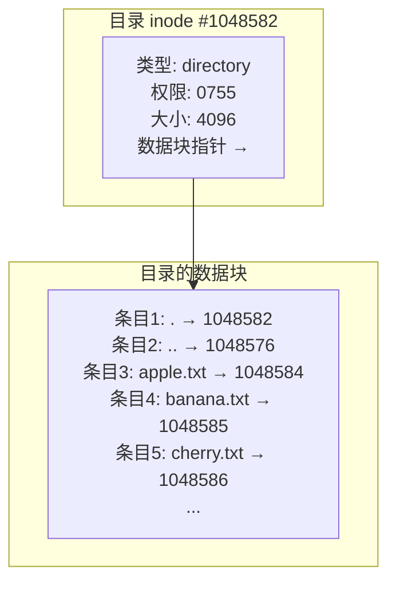
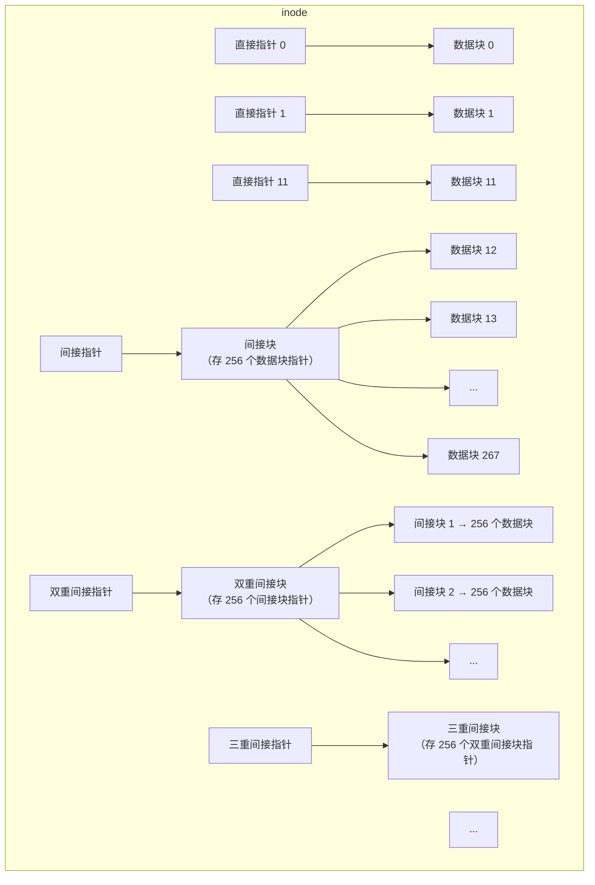
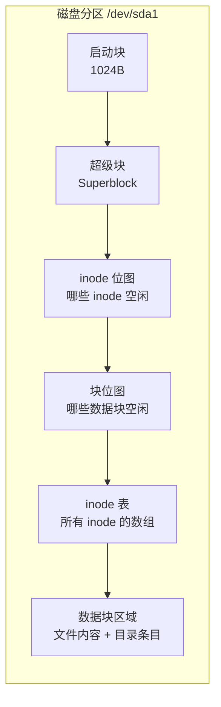
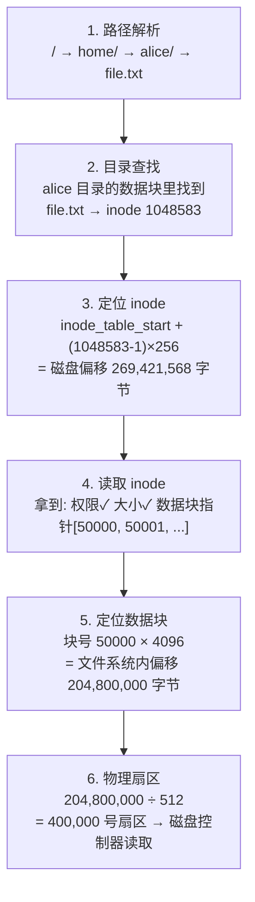
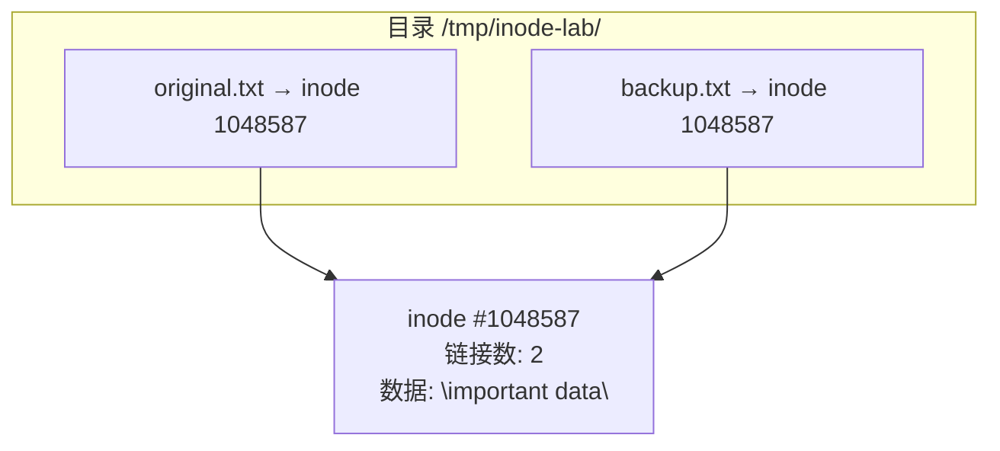

# Linux inode 详解

## 从一个实验开始

打开终端，跟着敲以下命令。你就能直观地"看见" inode：

```bash
# 创建一个测试目录
mkdir /tmp/inode-lab && cd /tmp/inode-lab

# 创建一个文件
echo "hello" > file1.txt

# 查看它的 inode 号（-i 参数）
ls -i
# 1048583 file1.txt    ← 这个数字就是 inode 号

# 用 stat 看更详细的信息
stat file1.txt
```

`stat` 会输出类似这样的内容：

```
  File: file1.txt
  Size: 6             Blocks: 8          IO Block: 4096   regular file
Device: 259,1         Inode: 1048583      Links: 1
Access: (0644/-rw-r--r--)  Uid: ( 1000/   alice)   Gid: ( 1000/   alice)
Access: 2026-06-22 15:00:00.000000000 +0800
Modify: 2026-06-22 15:00:00.000000000 +0800
Change: 2026-06-22 15:00:00.000000000 +0800
```

现在你看到了——**每个文件都有一个对应的 inode，像一个档案袋**，里面装着这个文件除了"名字"和"内容"以外的所有信息。

## 文件系统怎么找到一个文件？

你敲下 `cat file1.txt` 的时候，内核经历了一个三步查找过程：


**文件名根本不在 inode 里，文件名存在目录里。** 目录本质上就是一个特殊的"文件"，它的数据内容是下面这张表：

```
/tmp/inode-lab 目录的数据（简化）：
┌──────────────┬──────────┐
│ 文件名        │ inode 号  │
├──────────────┼──────────┤
│ .            │ 1048582  │  ← "." 指向目录自己的 inode
│ ..           │ 1048576  │  ← ".." 指向 /tmp 的 inode
│ file1.txt    │ 1048583  │  ← "file1.txt" 指向文件的 inode
└──────────────┴──────────┘
```

**动手验证一下**：目录自己的 inode 和 `.` 指向的 inode 是同一个：

```bash
ls -di /tmp/inode-lab            # 目录本身的 inode
# 1048582 /tmp/inode-lab

ls -aid /tmp/inode-lab/.         # "." 的 inode
# 1048582 /tmp/inode-lab/.       ← 一样的！
```

### 如何"查看"目录这张映射表？

目录存储文件名→inode 映射，而你查看它的方式就是——`ls -i`：

```bash
cd /tmp/inode-lab

# 创建几个文件作为例子
touch apple.txt banana.txt cherry.txt

# ls -i 本质上就是在"读目录文件"，输出文件级的文件名→inode 映射
ls -i
# 1048584 apple.txt
# 1048585 banana.txt
# 1048586 cherry.txt
# 1048582 file1.txt
# ↑ 这就是目录的数据内容！每一行 = 一条目录项

# stat 可以看目录自身占了多少"数据空间"（里面存的条目越多，目录文件越大）
stat /tmp/inode-lab | head -4
#   File: /tmp/inode-lab
#   Size: 4096       ← 目录文件本身占 4096 字节，用来存所有文件名→inode 条目
#   ...
```

> `ls -i` 就是查看目录这张表的最直接方式。每创建一个文件，内核就在目录的数据块中追加一条 `(文件名, inode号)` 记录。每 `rm` 一个文件，就从目录中删除对应条目。

### 目录映射表存在哪里？

目录本身就是一个**特殊类型的文件**（类型为 `directory`），它有自己的 inode，而它的数据块里存的不是普通文件内容，正是**文件名→inode 的映射表**。



整个链路是：
1. 目录自身的 inode 指向目录的数据块
2. 目录的数据块里存储 `(文件名, inode号)` 条目
3. 内核根据条目中的 inode 号，去 inode 表中找到目标文件的 inode
4. 目标文件的 inode 指向文件的实际数据块

```bash
# 验证：目录自身的 inode 是一个普通数字，类型是 directory
stat -c "%i %F" /tmp/inode-lab
# 1048582 directory

# 目录文件的大小会随着条目增多而增长
mkdir /tmp/inode-lab/many
for i in $(seq 1 1000); do touch /tmp/inode-lab/many/file_$i; done
ls -ld /tmp/inode-lab/many
# drwxr-xr-x ... 20480 ... many  ← 1000 个条目让目录从 4096 涨到 20480 字节
```

## inode 里到底存了什么？

继续做实验，把 inode 里的每个字段都"摸"一遍：

```bash
cd /tmp/inode-lab

# 1. 先看现状
ls -i file1.txt        # inode 号
stat file1.txt         # 所有元数据
stat -c "%h" file1.txt # 只看链接数 → 1
```

### 实验一：文件大小和链接数

```bash
# 追加内容，看看 inode 哪些字段变了
echo "world" >> file1.txt
stat file1.txt
# Size 从 6 变成了 12  ← 大小变了
# Modify 时间更新了       ← mtime 变了（内容改了）
# Change 时间也更新了     ← ctime 变了（数据块指针变了）
# Inode 号不变           ← inode 号是文件的身份证，终身不变
```

### 实验二：权限变更

```bash
# 改权限
chmod 600 file1.txt
stat file1.txt
# Access 从 0644 变成 0600  ← 权限变了
# Modify 没变                  ← 内容没改，mtime 不变
# Change 更新了                ← 元数据改了，ctime 必须更新
```

**关键洞察**：`ctime`（Change Time）在你修改 inode 里**任何元数据**时都会更新——改权限、改所有者、增减链接、甚至只是打开文件写入。而 `mtime`（Modify Time）只在文件**内容**被修改时更新。

### 实验三：inode 号是终身身份证

```bash
# 重命名文件
mv file1.txt file2.txt
ls -i
# 1048583 file2.txt     ← inode 号没变！只是目录表里的名字改了

# 这意味着 mv 极快——它只改了目录表里的一条记录，完全没碰文件内容和 inode
```

**这就是 `mv` 在同文件系统内是 O(1) 的原因**：它不复制数据，只修改目录中的一行 `旧文件名 → 新文件名`。

## inode 是怎么分配出来的？

### 实验四：大文件如何用多个数据块——间接指针

一个 inode 只有固定大小（通常 256 字节），里面能直接存的数据块指针数量有限。那一个 10GB 的文件怎么办？

答案是多级指针——inode 里不直接存所有数据块的地址，而是用一棵"指针树"：



以 ext4（4KB 块大小）为例，一个 inode 有 15 个指针槽位：

| 指针类型 | 数量 | 每个指向 | 能覆盖的数据量 |
|---------|------|---------|--------------|
| **直接指针** | 12 个 | 1 个数据块（4KB） | 12 × 4KB = **48KB** |
| **间接指针** | 1 个 | 一个间接块（含 256 个数据块指针） | 256 × 4KB = **1MB** |
| **双重间接指针** | 1 个 | 256 个间接块，每块 256 个数据块指针 | 256² × 4KB = **256MB** |
| **三重间接指针** | 1 个 | 256 个双重间接块，每块 256² 个数据块指针 | 256³ × 4KB = **64GB** |

> 这就是为什么 ext4 单文件最大可以到 16TB（取决于块大小）。小文件直接用 12 个直接指针就能覆盖 48KB，不需要额外的间接块开销。

**用具体例子走一遍：**

假设你有一个 ext4 文件系统，块大小 4KB，每个指针 4 字节，一个块能塞下 1024 个指针（实际 ext4 中一个 4KB 块存 256 个 16 字节的 extent 描述符，此处用简化的经典间接块模型便于理解）。

```
例 1：文件大小 = 100 字节
┌─────────────────────────────────────────────┐
│ 内核：只需要 1 个数据块，用「直接指针 0」指向它  │
│ inode 开销：15 个指针槽位，只用了 1 个          │
│ 读文件：inode → 直接指针 0 → 数据块 → 返回数据  │
└─────────────────────────────────────────────┘

例 2：文件大小 = 100KB
┌─────────────────────────────────────────────┐
│ 100KB ÷ 4KB = 25 个数据块                    │
│ 12 个直接指针只覆盖前 48KB                     │
│ 剩下的 13 个数据块需要「间接指针」              │
│ 内核从间接块中取第 0~12 号指针                 │
│                                              │
│ 读文件偏移 60KB 处：                           │
│   60KB > 48KB → 不在直接指针范围               │
│   60KB - 48KB = 12KB                         │
│   12KB ÷ 4KB = 第 3 个间接块指针 → 数据块     │
└─────────────────────────────────────────────┘

例 3：文件大小 = 500MB
┌─────────────────────────────────────────────┐
│ 500MB ÷ 4KB = 128000 个数据块                │
│ 直接指针：12 块 = 48KB                        │
│ 间接指针：256 块 = 1MB                        │
│ 48KB + 1MB = 还是远远不够                     │
│ 启动「双重间接指针」                           │
│   第 1 层：双重间接块存 256 个间接块指针        │
│   第 2 层：每个间接块存 256 个数据块指针        │
│   共 256 × 256 = 65536 个数据块 = 256MB      │
│ 还不够 500MB → 用满 2 个双重间接块指针         │
└─────────────────────────────────────────────┘

例 4：文件大小 = 10GB（蓝光电影）
┌─────────────────────────────────────────────┐
│ 10GB ÷ 4KB ≈ 262 万个数据块                  │
│ 启动「三重间接指针」                           │
│   第 1 层：三重间接块 → 256 个双重间接块       │
│   第 2 层：每个双重间接块 → 256 个间接块       │
│   第 3 层：每个间接块 → 256 个数据块           │
│   共 256³ = 16,777,216 个数据块 ≈ 64GB       │
│ 只用一部分就够了                               │
└─────────────────────────────────────────────┘
```

**一个生活类比**：把 inode 想象成你的**通讯录**。

- 通讯录只有 15 行空白（15 个指针槽）
- 前 12 行直接写朋友的电话号码（**直接指针**）——够应付 12 个朋友
- 第 13 行写了一个地址，指向另一本电话簿，里面记录了 256 个人的号码（**间接指针**）
- 第 14 行写了一个地址，指向一个"电话簿目录"，该目录又指向 256 本电话簿（**双重间接**）
- 第 15 行同理，再套一层（**三重间接**）

小通讯录，大容量——这就是 inode 的精妙设计。

```bash
# 实验：对比不同大小文件的块使用情况
cd /tmp/inode-lab

# 1KB 的小文件——只用直接指针
dd if=/dev/zero of=tiny.txt bs=1024 count=1 2>/dev/null
stat tiny.txt
# Size: 1024      Blocks: 8        ← 1 个数据块（8 个 512B 扇区）

# 100KB 的文件——直接指针 + 间接指针开始介入
dd if=/dev/zero of=medium.txt bs=1024 count=100 2>/dev/null
stat medium.txt
# Size: 102400    Blocks: 208      ← 约 26 个数据块，超出 12 个直接指针范围

# 10MB 的文件——深度使用间接指针
dd if=/dev/zero of=large.txt bs=1M count=10 2>/dev/null
stat large.txt
# Size: 10485760  Blocks: 20480    ← 2560 个数据块

# 用 filefrag 查看文件数据块在磁盘上的实际分布（需要 root）
filefrag -v tiny.txt medium.txt large.txt 2>/dev/null || echo "需要 root 权限"
# tiny.txt:   1 extent found    ← 1 个连续区间（ext4 用 extent 替代了经典间接块）
# medium.txt: 1 extent found    ← ext4 的 extent 比间接块更高效
# large.txt:  3 extents found   ← 大文件分散在 3 个不连续区域
```

## 从 inode 号到物理磁盘扇区：完整映射链

前面讲了"inode 指向数据块"，但 **inode 号本身怎么定位到磁盘上的物理位置？** 数据块号又怎么换算成实际扇区？下面把完整链路走一遍。

### 磁盘上的文件系统布局

当你格式化一个分区时（比如 `mkfs.ext4 /dev/sda1`），磁盘被划分成以下区域：



超级块里记录了文件系统的**全局参数**，包括 inode 表的起始位置：

| 超级块中的关键信息 | 含义 | 示例值 |
|-------------------|------|--------|
| `s_inodes_count` | inode 总数 | 6553600 |
| `s_inode_size` | 每个 inode 的字节数 | 256 |
| `s_first_ino` | 第一个可用 inode 号 | 11（0-10 保留） |
| `s_inode_table_blocks` | inode 表占用多少个数据块 | … |
| `s_blocks_per_group` | 每个块组有多少数据块 | 32768 |

### 三步定位：inode 号 → inode 的物理位置

```
已知：inode 号 = 1048583，inode_size = 256 字节
问题：这个 inode 在磁盘的哪个字节偏移处？

第 1 步：inode 表在磁盘上的起始位置
  inode_table_start = 超级块记录的 inode 表起始块号 × 块大小
  假设 = 块号 256 × 4096 = 1048576 字节处

第 2 步：inode 1048583 在 inode 表中的偏移
  inode 号从 1 开始编号，所以：
  offset_in_table = (1048583 - 1) × 256 = 268,372,992 字节

第 3 步：inode 在磁盘上的绝对位置
  inode_on_disk = 1,048,576 + 268,372,992 = 269,421,568 字节处
                = 约 257 MiB 处
```

整个计算只是简单的算术——内核拿到 inode 号后，一条公式算出它在磁盘上的确切位置，然后直接读那一块。

### 从 inode 里的块号到磁盘扇区

inode 里存的数据块指针是**逻辑块号**（相对于文件系统起始位置），内核再把它换算成物理扇区：

```
已知：inode 里的数据块指针对应的块号 = 50000，块大小 = 4096
磁盘扇区大小 = 512 字节（传统硬盘）

逻辑块号 → 文件系统内的字节偏移：
  50000 × 4096 = 204,800,000 字节

再 → 磁盘扇区号：
  204,800,000 ÷ 512 = 400,000 号扇区
```

### 完整映射链一览

把整条链路串起来，从你敲下 `cat /home/alice/file.txt` 到磁头移动到正确扇区：



```bash
# 实验：用 dumpe2fs 查看超级块中的 inode 表位置（ext 系列）
sudo dumpe2fs /dev/sda1 2>/dev/null | grep -E "Inode count|Inode size|Inode table|Block size" | head -10
# Inode count:              6553600
# Inode size:               256
# Block size:               4096
# Inode table at 256-2816    ← inode 表从第 256 个块开始，占 2560 个块

# 验证：手动算出 inode 1048583 的位置
# inode_table_start_block = 256
# inode_table_start_byte = 256 × 4096 = 1,048,576
# inode_offset = (1048583 - 1) × 256 = 268,372,992
# inode_absolute_byte = 1,048,576 + 268,372,992 = 269,421,568
echo "inode 1048583 在磁盘上约 $((269421568 / 1024 / 1024)) MiB 处"

# 用 debugfs 验证 inode 内容（包括其数据块指针）
sudo debugfs -R "stat <1048583>" /dev/sda1 2>/dev/null | head -20
# Inode: 1048583   Type: regular    Mode:  0644   Flags: 0x80000
# ...
# EXTENTS:
# (0): 50000          ← 数据块从逻辑块 50000 开始
```

> **实际比这个更复杂**：现代 ext4 默认用 **extent**（连续区间描述）替代了经典的间接块模型。一个 extent 记录 `(起始块号, 连续块数)`，比逐块记录指针高效得多。但原理不变：逻辑块号 → 文件系统内偏移 → 物理扇区。

### 实验五：观察 inode 号的分配

```bash
cd /tmp/inode-lab

# 连续创建三个文件，观察 inode 号
touch a.txt && ls -i a.txt
touch b.txt && ls -i b.txt
touch c.txt && ls -i c.txt

# 输出类似：
# 1048584 a.txt
# 1048585 b.txt
# 1048586 c.txt
# ↑ 连续分配

# 删除中间的文件
rm b.txt

# 再创建一个新文件
touch d.txt && ls -i d.txt
# 1048585 d.txt    ← 复用了刚才 b.txt 的 inode 号！
```

inode 号是**回收重用**的。文件删除后，它的 inode 回到空闲池，下一次创建文件时可能被分配给新文件。

### 实验五：一个文件系统有多少 inode？

```bash
# df -i 查看 inode 使用情况（不是 df -h！）
df -i /tmp
# Filesystem      Inodes  IUsed   IFree IUse% Mounted on
# /dev/sda1      6553600 245678 6307922    4% /

# 这意味着这个文件系统最多能创建 6553600 个文件（和目录）
# 不管磁盘还剩多少空间，inode 用完了就再也创建不了新文件
```

**inode 数量在格式化文件系统时就定死了。** 这就是为什么有时候 `df -h` 显示磁盘还有空间但就是创建不了文件——inode 耗尽了。

## 硬链接：给 inode 起第二个名字

前面说了，文件名只存在目录表里。这意味着**同一个 inode 可以在目录表里有多个名字**——这就是硬链接。

### 实验六：创建和观察硬链接

```bash
cd /tmp/inode-lab

echo "important data" > original.txt
ls -i original.txt
# 1048587 original.txt

# 创建硬链接
ln original.txt backup.txt

# 查看两个文件的 inode
ls -i original.txt backup.txt
# 1048587 backup.txt
# 1048587 original.txt     ← 完全相同的 inode 号！

# 链接数变成了 2
stat -c "%h" original.txt
# 2
```



**两个文件名完全等价，没有"原文件"和"副本"之分。** 它们指向的是同一个 inode。

### 实验七：删除"源文件"看看

```bash
# 删除 original.txt
rm original.txt

# backup.txt 还在，数据也没丢
cat backup.txt
# important data

# 但链接数降为 1
stat -c "%h" backup.txt
# 1
```

内核删除文件的逻辑是：删除目录项 → inode 链接数 -1 → 如果链接数变成 0 **且**没有进程打开这个文件 → 释放 inode 和数据块。

### 实验八：硬链接不能跨文件系统

```bash
# 假设 /home 和 /tmp 是不同的文件系统
ln /tmp/inode-lab/backup.txt ~/backup.txt
# ln: failed to create hard link '/home/alice/backup.txt' =>
#      '/tmp/inode-lab/backup.txt': Invalid cross-device link
```

硬链接的本质是两个文件名指向**同一个 inode 号**，而 inode 号只在单个文件系统内唯一。跨文件系统就没法保证了。

### 实验九：硬链接不能链接目录

```bash
ln /tmp/inode-lab /tmp/inode-lab-link
# ln: /tmp/inode-lab: hard link not allowed for directory
```

如果允许目录硬链接，可能形成环路——目录 A 的子目录 B 又硬链接回 A，`find` 和 `du` 等工具会陷入死循环。

## 软链接（符号链接）：另一种"别名"

软链接走了一条完全不同的路——它自己是一个**独立的文件**，有自己的 inode，内容只是**目标文件的路径字符串**。

### 实验十：创建和观察软链接

```bash
cd /tmp/inode-lab

echo "hello target" > target.txt

# 创建软链接
ln -s target.txt shortcut.txt

# 比较两者的 inode——不一样！
ls -i target.txt shortcut.txt
# 1048588 shortcut.txt     ← 不同的 inode
# 1048589 target.txt        ← 不同的 inode

# 软链接的内容就是目标路径
readlink shortcut.txt
# target.txt

# 软链接指向不存在的文件时，变成"断链"
rm target.txt
cat shortcut.txt
# cat: shortcut.txt: No such file or directory

# 但软链接本身的 inode 还在
ls -i shortcut.txt
# 1048588 shortcut.txt     ← 还在！只是目标没了
```

```mermaid
graph TD
  subgraph "目录 /tmp/inode-lab/"
    D1["target.txt → inode 1048589"]
    D2["shortcut.txt → inode 1048588"]
  end
  D1 --> InodeTarget["inode #1048589<br/>数据: \"hello target\""]
  D2 --> InodeLink["inode #1048588<br/>数据: \"target.txt\"（路径字符串）"]
  InodeLink -.->|"内核解析路径"| InodeTarget
```

### 硬链接 vs 软链接：一张速查表

| | 硬链接 | 软链接 |
|---|--------|--------|
| 本质 | 多个目录项指向**同一个** inode | 一个独立文件，内容是路径字符串 |
| inode 号 | 与目标相同 | 与目标不同 |
| 占不占 inode | 不占新 inode | 占一个新 inode |
| 删除目标后 | 数据还在（链接数 > 0） | 断链，访问报错 |
| 跨文件系统 | ❌ | ✅ |
| 链接目录 | ❌ | ✅ |
| 查看链接数 | `stat -c "%h"` 会 +1 | 不影响目标链接数 |

## inode 的"死亡"与"复活"

### 实验十一：删了文件，但进程还抓着不放

这是生产环境最经典的坑。我们来复现它：

```bash
cd /tmp/inode-lab

# 创建一个 100MB 的文件
dd if=/dev/zero of=bigfile bs=1M count=100 2>/dev/null

# 用一个进程持续打开它（模拟正在写日志的服务）
tail -f bigfile &
# 记住这个后台进程的 PID
TAIL_PID=$!

# 查看当前磁盘使用
df -h /tmp | tail -1

# 删除文件
rm bigfile

# 文件从目录中消失了...
ls -l bigfile
# ls: cannot access 'bigfile': No such file or directory

# 但磁盘空间没回来！
df -h /tmp | tail -1
# 空间没变！因为 tail 进程还抓着 inode

# 找到被删除但还在用的文件
lsof -p $TAIL_PID 2>/dev/null | grep deleted
# tail  12345  alice  3r  REG  259,1  104857600  1048590 /tmp/inode-lab/bigfile (deleted)

# 关掉进程后，空间才释放
kill $TAIL_PID
df -h /tmp | tail -1
# 空间回来了！
```

**内核的"引用计数"机制**：inode 有两个计数器——**链接数**（有几个目录项指向它）和**打开计数**（有几个进程打开了它）。只有两者都归零，inode 和数据块才被真正释放。

```
inode 被真正删除的条件：
  链接数 == 0  AND  打开计数 == 0

  链接数 > 0 → rm 也删不掉数据（还有别的文件名指向它）
  打开计数 > 0 → lsof 能看到 (deleted)，进程关了才释放
```

> 这也是 logrotate 能无缝轮转日志的底层原理：`mv` 旧日志 → 发信号让进程重新 `open()` → 旧 inode 在进程关旧 fd 后自动释放。

## 时间戳三兄弟：atime、mtime、ctime

每个 inode 有三个时间戳，我们用实验把它们搞清楚：

### 实验十二：逐个触发三种时间戳

```bash
cd /tmp/inode-lab

echo "v1" > ts-test.txt
stat ts-test.txt
# Access: 2026-06-22 15:00  ← atime（创建时的读取）
# Modify: 2026-06-22 15:00  ← mtime（内容变了）
# Change: 2026-06-22 15:00  ← ctime（inode 刚分配）

# —— 等几秒 ——

# 读文件：只有 atime 更新
cat ts-test.txt
stat ts-test.txt
# Access: 2026-06-22 15:01  ← atime 变了！
# Modify: 2026-06-22 15:00  ← 不变
# Change: 2026-06-22 15:00  ← 不变

# —— 等几秒 ——

# 改内容：mtime 和 ctime 都更新
echo "v2" > ts-test.txt
stat ts-test.txt
# Access: 2026-06-22 15:01
# Modify: 2026-06-22 15:02  ← mtime 变了（内容改了）
# Change: 2026-06-22 15:02  ← ctime 也变了（数据块指针变了，属于元数据变更）

# —— 等几秒 ——

# 改权限：只有 ctime 更新
chmod 444 ts-test.txt
stat ts-test.txt
# Access: 2026-06-22 15:01
# Modify: 2026-06-22 15:02  ← 不变（内容没改）
# Change: 2026-06-22 15:03  ← ctime 变了（权限属于元数据）
```

一张图总结三者的触发条件：

| 操作 | atime | mtime | ctime |
|------|:-----:|:-----:|:-----:|
| `cat file`（读） | ✅ | — | — |
| `echo "x" >> file`（写内容） | — | ✅ | ✅ |
| `chmod` / `chown`（改元数据） | — | — | ✅ |
| `ln` / `rm`（增减链接） | — | — | ✅ |
| `mv` 同文件系统 | — | — | ✅ |

### ctime 和 mtime 的根本区别

很多人把两者搞混，因为它们经常"同时更新"。但它们的职责完全不同：

- **mtime（内容修改时间）**：回答"这个文件的**数据**上次什么时候被改过"。只有文件内容变化才更新。
- **ctime（inode 变更时间）**：回答"这个文件的**档案袋**（inode）上次什么时候被动过"。改权限、改所有者、增减硬链接、修改内容——只要 inode 里的任何一个字段变了，ctime 就更新。

```
操作                → 动了什么？       → mtime 更新？  → ctime 更新？
─────────────────────────────────────────────────────────────────
echo "hi" >> f     → 数据块+文件大小    → ✅ 当然        → ✅ 因为 inode 的大小/块指针变了
chmod 755 f        → 权限位             → ❌ 内容没变    → ✅ 因为 inode 权限字段变了
ln f g             → f 的链接数         → ❌ 内容没变    → ✅ 因为 inode 链接数字段变了
cat f              → 什么都没写         → ❌             → ❌（atime 更新另算）
```

**一个生活类比**：把你的文件想象成一本书。
- **mtime** = 你最后一次修改书的内容（写了一章新内容）
- **ctime** = 你最后一次动这本书的任何东西（改了内容，或者换了封面（chmod），或者贴了新的标签（chown），或者在图书馆目录里新增了一条指向这本书的记录（ln））

所以 mtime 更新的场景，ctime **一定**也更新（因为修改内容必然导致 inode 的数据块指针或大小字段变化）。但反过来不成立——改权限只更新 ctime，不更新 mtime。

**ctime 无法被 `touch -t` 伪造。** 如果你怀疑一个文件的 mtime 被人为修改过，去看 ctime——ctime 一定 ≥ mtime（因为修改内容也会触发 ctime 更新）。

```bash
# 伪造 mtime 很容易
touch -t 202001010000 fake.txt
stat -c "%y" fake.txt  # mtime = 2020-01-01 ← 看起来是 2020 年的文件
stat -c "%z" fake.txt  # ctime = 2026-06-22 ← 暴露了！真实操作时间是现在
```

## 当事情出问题：inode 相关排障

### 排查一：inode 耗尽

```bash
# 症状：创建文件报错，但 df -h 显示有空间
touch newfile.txt
# touch: cannot touch 'newfile.txt': No space left on device

# 马上检查 inode 使用率
df -i /
# Filesystem      Inodes  IUsed   IFree IUse% Mounted on
# /dev/sda1      6553600 6553600 0    100% /   ← inode 100% 用完！

# 找到哪个目录里小文件最多（罪魁祸首）
for d in /var/* /tmp/*; do
  count=$(find "$d" -type f 2>/dev/null | wc -l)
  [ "$count" -gt 1000 ] && printf "%8d  %s\n" "$count" "$d"
done | sort -rn | head
```

常见元凶：邮件队列（postfix 的 `maildrop`）、PHP session 文件、Docker overlay2 层、npm/cargo 缓存。

### 排查二：被删除但仍占空间的文件

```bash
# 按占用空间排序，找出 (deleted) 文件
lsof -nP 2>/dev/null | grep '(deleted)' | \
  awk '{print $1, $2, $7, $9}' | sort -t' ' -k3 -rn | head -10

# 输出示例：
# java    12345  10737418240  /var/log/app.log (deleted)
#          ↑ PID           ↑ 占用 10GB！

# 处理方法：重启该进程或发信号让它重新打开文件
kill -HUP 12345
```

### 排查三：找出最老的 inode（辅助老旧文件清理）

```bash
# 找出 180 天前创建的文件
find /data -type f -ctime +180 -ls 2>/dev/null | head -20

# 或者按 inode 号排序（inode 号小的一般创建得早）
find /data -type f -printf "%i %p\n" 2>/dev/null | sort -n | head -20
```

## 总结

inode 是文件系统最核心的概念。学完本文你应该有一个清晰的心智模型：

```mermaid
graph TB
  subgraph "用户视角"
    User["用户: 我用文件名操作文件"]
  end

  subgraph "文件系统内部"
    Dir["目录 = 文件名 → inode 号的映射表"]
    InodeT["inode 表 = 所有 inode 的数组<br/>每个 inode 存: 权限/大小/时间/数据块指针"]
    Data["数据块 = 实际文件内容"]
  end

  User -->|"open(\"foo.txt\")"| Dir
  Dir -->|"inode #1048576"| InodeT
  InodeT -->|"数据块指针"| Data
```

**三个核心要点：**

1. **inode 和文件名是分离的** — inode 不存文件名，文件名只存目录里。这带来硬链接和原子的 `mv`。
2. **inode 有引用计数** — 链接数（几个文件名指向它）+ 打开计数（几个进程在用）。两者都归零才释放。这解释了 `rm` 后空间不释放的经典问题。
3. **inode 数量有限制** — 格式化时定死。`df -h` 有空间但 `df -i` 耗尽时，新文件创建失败。

配合 [Linux Namespace 详解](/linux/namespace/) 和 [cgroup v2 详解](/linux/cgroup/)，你就能从文件系统、资源隔离、资源限制三个维度理解容器技术的全部内核基础。
