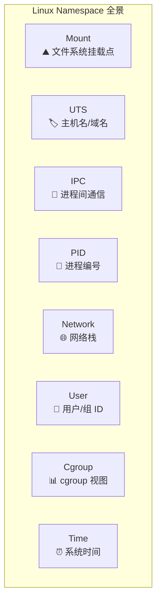
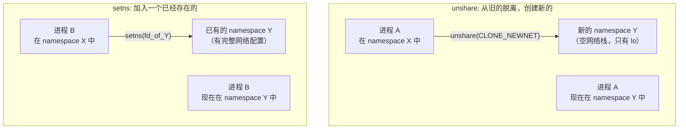
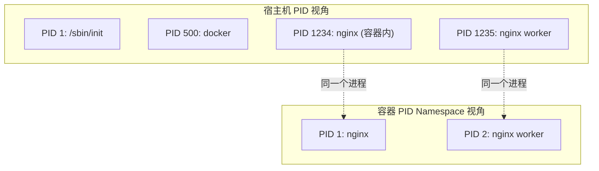
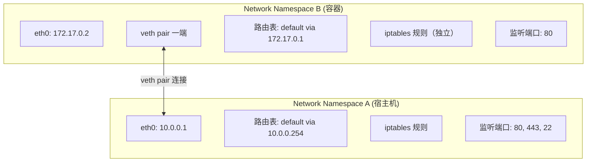
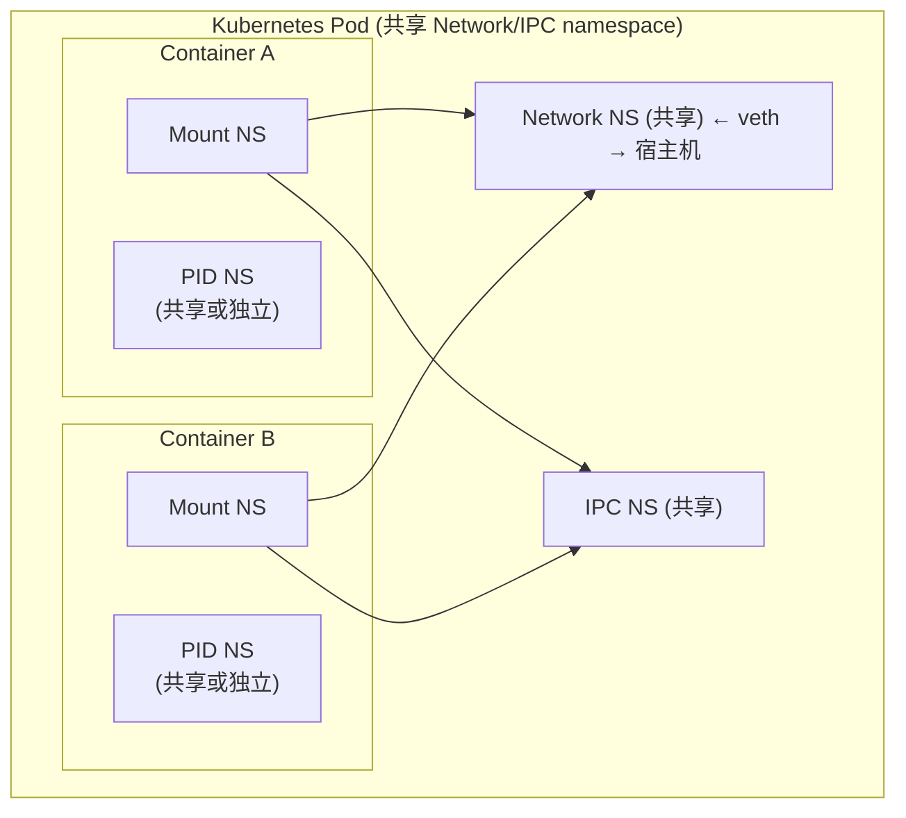
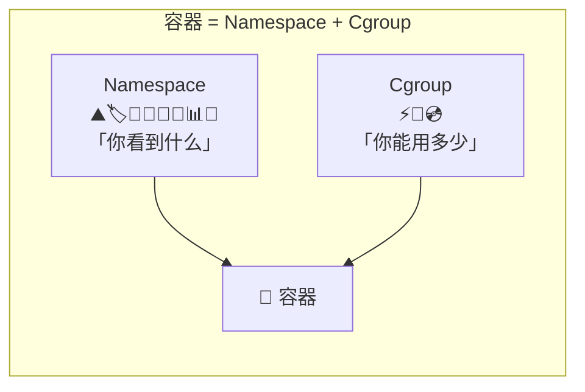

# Linux Namespace 详解

## 一句话理解

Namespace（命名空间）是 Linux 内核提供的一种**资源隔离**机制。它让一组进程看到独立的系统资源视图——仿佛它们独占了一台机器。如果说 cgroup 解决的是"你能用多少资源"，那 namespace 解决的就是"你能看到什么资源"。

> cgroup = **限额**（how much you can use），namespace = **视野**（what you can see）。两者合在一起，就是容器技术的基石。

## 为什么需要 Namespace

在没有 namespace 之前，Linux 上所有进程共享同一个全局资源视图：

- 所有进程看到同一个主机名（`hostname`）
- 所有进程共享同一个 PID 编号空间（PID 1 只有一个 init）
- 所有进程看到同一套网络接口（`eth0`、`lo`）
- 所有进程共享同一个文件系统根目录
- 所有进程的 root 用户就是同一个 root（UID 0）

这带来的问题是：**进程之间无法做到真正的隔离**。如果你想在一台机器上跑多个服务，它们会互相干扰——改个 hostname 全局生效，mount 一个文件系统所有进程可见，网络端口冲突更是家常便饭。

Namespace 从内核层面解决了这个问题。它于 2002 年（Linux 2.4.19）首次引入，此后逐步覆盖了操作系统的各个维度。

## Namespace 全景：8 种隔离维度

截至 Linux 6.x，内核支持 **8 种 namespace**，每一种隔离操作系统的一个维度：



| # | Namespace | 引入版本 | 隔离内容 | 标志 |
|---|-----------|---------|---------|------|
| 1 | **Mount** | Linux 2.4.19 (2002) | 文件系统挂载点 | `CLONE_NEWNS` |
| 2 | **UTS** | Linux 2.6.19 (2006) | 主机名、NIS 域名 | `CLONE_NEWUTS` |
| 3 | **IPC** | Linux 2.6.19 (2006) | System V IPC、POSIX 消息队列 | `CLONE_NEWIPC` |
| 4 | **PID** | Linux 2.6.24 (2008) | 进程 PID 编号空间 | `CLONE_NEWPID` |
| 5 | **Network** | Linux 2.6.24 (2008) | 网络设备、IP、端口、路由、iptables | `CLONE_NEWNET` |
| 6 | **User** | Linux 3.8 (2013) | UID/GID 映射 | `CLONE_NEWUSER` |
| 7 | **Cgroup** | Linux 4.6 (2016) | cgroup 根目录视图 | `CLONE_NEWCGROUP` |
| 8 | **Time** | Linux 5.6 (2020) | 系统时钟（`CLOCK_MONOTONIC`、`CLOCK_BOOTTIME`） | `CLONE_NEWTIME` |

> 这 8 种 namespace 恰好覆盖了操作系统的 8 个维度。当你运行 `docker run` 时，Docker 会为容器创建全部 8 种 namespace（取决于配置），让容器以为自己独占一台机器。

## Namespace 的三大系统调用

操作 namespace 有三个核心系统调用：

| 系统调用 | 作用 | 典型场景 |
|---------|------|---------|
| `clone(flags)` | 创建新进程并放入新 namespace | 容器启动时创建"一号进程" |
| `unshare(flags)` | 将当前进程移入新 namespace | `unshare -n ping 8.8.8.8` |
| `setns(fd)` | 将当前进程加入已有 namespace | `nsenter -t $PID -n` 进入容器网络 |

### clone — 创建时隔离

```c
// 创建新进程，同时创建新的 UTS、PID、Network namespace
// 新进程会看到独立的 hostname、PID 空间和网络栈
int flags = CLONE_NEWUTS | CLONE_NEWPID | CLONE_NEWNET;
pid_t child_pid = clone(child_func, child_stack, flags, NULL);
```

`clone` 是容器运行时的底层机制。当你执行 `docker run`，容器进程就是通过 `clone` 带上一系列 `CLONE_NEW*` 标志创建的。

### unshare — 运行时隔离

```bash
# unshare 命令让你在 shell 中直接体验 namespace
# 创建一个新的 Network namespace，在其中执行命令
unshare --net --uts /bin/bash
hostname isolated-box    # 修改主机名，不影响宿主机
ip link                  # 只能看到 lo，看不到宿主机的 eth0
```

`unshare` 的特别之处在于：它可以让一个**已经在运行**的进程脱离当前 namespace，进入新创建的 namespace。`clone` 是给新进程用的，`unshare` 是给当前进程用的。

### setns — 加入已有 namespace

```bash
# 加入一个已有进程的 namespace
# 先找到目标进程 PID
ls -l /proc/1234/ns/net    # 查看进程 1234 的 net namespace

# 进入它的 network namespace
nsenter -t 1234 -n /bin/bash
# 现在你在这个 bash 中看到的网络环境，和进程 1234 完全一致
```

这是调试容器的利器——`docker exec` 的底层就是 `setns`。当你执行 `kubectl exec` 进入 Pod 时，kubelet 本质上也是用 `setns` 把调试进程加入容器的各 namespace。

### unshare vs setns：一张表看清区别

这两个系统调用最容易混淆——它们的命令行工具 `unshare` 和 `nsenter` 看起来都在"切换 namespace"，但方向完全相反：



| 维度 | `unshare` | `setns` |
|------|-----------|---------|
| **方向** | **脱离**当前 namespace，创建**全新的** namespace | **加入**一个**已经存在**的 namespace |
| **Namespace 状态** | 新创建，空白/初始状态 | 已有，可能已被配置过 |
| **命令行工具** | `unshare` | `nsenter` |
| **对原 namespace 的影响** | 原 namespace 不受影响（仍存在） | 原 namespace 不受影响（进程离开了它） |
| **CAP_SYS_ADMIN** | 需要（除非配合 user namespace） | 需要（除非加入的是自己已拥有的 user namespace） |
| **典型问题** | "我想给当前进程一个独立的网络栈" | "我想看看容器里面是什么样" |
| **底层本质** | 创建新 namespace 并切换过去 | 切换到已有 namespace |
| **PID namespace 特殊限制** | 只能为子进程创建（`clone`），不能对自己的 PID namespace 做 `unshare` | 只能加入子 PID namespace（后代），不能加入兄弟或祖先 |

**一个形象的类比：**

- `unshare` = 你从合租房**搬出去**，租了一间**空的新公寓**。新公寓里什么都没有——没有家具（没有网络配置），墙是白的（空的挂载表）。你需要自己从头布置。
- `setns` = 你用自己的钥匙**打开别人的房门**，**走进去**看看里面什么样。别人的公寓可能已经布置得很齐全了（有 IP、有路由、有挂载的磁盘），你只是进去"体验"一下。

**实际场景对比：**

```bash
# === unshare：给当前 shell 一个全新的、空的 network namespace ===
unshare --net /bin/bash
ip addr show
# 1: lo: ... state UNKNOWN ...   ← 只有 lo，什么网络都没有
# 你需要自己创建 veth、配 IP、配路由...从头开始

# === setns（nsenter）：进入一个已经有完整网络配置的容器 ===
docker run -d --name mynginx nginx
nsenter -t $(docker inspect -f '{{.State.Pid}}' mynginx) -n /bin/bash
ip addr show
# 1: lo: ...
# 2: eth0@if5: ... inet 172.17.0.2/16 ...  ← 已经有 IP、有路由等
# 你进入了 Docker 已经配置好的网络环境
```

**为什么这两个系统调用都要存在？**

它们解决的是 namespace 生命周期中的两个不同阶段：

1. **创建阶段**（`clone` / `unshare`）：需要有人把 namespace **造出来**。容器运行时（runc、containerd）用 `clone` 造出初始 namespace，然后用 `unshare` 在容器启动后再隔离某些维度。
2. **访问阶段**（`setns`）：需要能**进入**一个已经存在的 namespace。调试工具（`docker exec`、`kubectl exec`、`nsenter`）依赖 `setns` 进入目标容器的世界。

> 如果没有 `setns`，你永远无法"进入"一个已经运行的容器的 namespace——`unshare` 只会给你一个全新的空白 namespace，不是你想要的"看看容器里什么样"。

### /proc 中的 namespace 文件

每个进程的 namespace 信息暴露在 `/proc/[pid]/ns/` 下：

```bash
ls -l /proc/$$/ns/
# 输出示例：
# lrwxrwxrwx 1 root root 0 Jun 22 10:00 cgroup -> 'cgroup:[4026531835]'
# lrwxrwxrwx 1 root root 0 Jun 22 10:00 ipc -> 'ipc:[4026531839]'
# lrwxrwxrwx 1 root root 0 Jun 22 10:00 mnt -> 'mnt:[4026531841]'
# lrwxrwxrwx 1 root root 0 Jun 22 10:00 net -> 'net:[4026531840]'
# lrwxrwxrwx 1 root root 0 Jun 22 10:00 pid -> 'pid:[4026531836]'
# lrwxrwxrwx 1 root root 0 Jun 22 10:00 pid_for_children -> 'pid:[4026531836]'
# lrwxrwxrwx 1 root root 0 Jun 22 10:00 time -> 'time:[4026531834]'
# lrwxrwxrwx 1 root root 0 Jun 22 10:00 time_for_children -> 'time:[4026531834]'
# lrwxrwxrwx 1 root root 0 Jun 22 10:00 user -> 'user:[4026531837]'
# lrwxrwxrwx 1 root root 0 Jun 22 10:00 uts -> 'uts:[4026531838]'
```

方括号里的数字（如 `4026531835`）是 namespace 的 **inode 号**，同一 namespace 中的进程会指向同一个 inode。这可以用来判断两个进程是否在同一个 namespace 中：

```bash
# 判断进程 A 和进程 B 是否共享同一个 network namespace
[ "$(readlink /proc/1234/ns/net)" = "$(readlink /proc/5678/ns/net)" ] \
  && echo "Same network namespace" || echo "Different network namespace"
```

## 八大 Namespace 逐一详解

### 1. Mount Namespace — 文件系统隔离

**最早引入的 namespace（Linux 2.4.19, 2002 年）**，是整个 namespace 机制的起点。

Mount namespace 隔离的是**文件系统挂载点视图**。在 mount namespace 中 `mount` / `umount` 操作不会影响其他 namespace。

```bash
# 实验：在两个 mount namespace 中看到不同的 /tmp
unshare --mount --fork /bin/bash
mount -t tmpfs tmpfs /tmp
echo "hello" > /tmp/test.txt
# 另一个终端中：ls /tmp/test.txt  → 文件不存在
```

**为什么 mount namespace 是第一个被实现的？**

2001 年，Linux VServer 等项目需要让每个虚拟环境看到独立的文件系统根目录（`chroot`）。但 `chroot` 有一个致命缺陷：进程可以轻易逃逸（通过 `chdir` + `chroot` 或 `fchdir`）。内核开发者意识到需要在 VFS 层面做真正的隔离——于是 mount namespace 诞生了，它让每个 namespace 维护独立的挂载点列表，从根本上杜绝了逃逸问题。

**核心特性：**

| 特性 | 说明 |
|------|------|
| 挂载点隔离 | 在一个 namespace 中的 `mount`/`umount` 不影响其他 namespace |
| 挂载传播（mount propagation） | 可以控制挂载事件是否在 namespace 间传播（`shared`/`slave`/`private`/`unbindable`） |
| 根目录可独立 pivot_root | 每个 mount namespace 可以有独立的 `/`，这正是容器文件系统隔离的基础 |

**挂载传播类型：**

```bash
# 查看挂载点的传播类型
cat /proc/self/mountinfo | grep "/"
# shared:1  ← shared，挂载事件会双向传播
# master:1 ← slave，只接收来自 master 的事件
# （没有 shared/master 标记） ← private，完全隔离
```

| 传播类型 | 含义 | 容器场景 |
|---------|------|---------|
| `shared` | 挂载事件双向传播 | 宿主机挂载磁盘，容器也能看到 |
| `slave` | 仅接收来自 master 的挂载事件 | 容器能看到宿主机的挂载，但容器内的挂载不影响宿主机 |
| `private` | 完全隔离，不传播 | 默认模式，容器和宿主机互不影响 |
| `unbindable` | 和 private 一样，且不能被 bind mount | 安全敏感场景 |

**与容器的关系：** 这是容器文件系统隔离的基石。Docker 的镜像分层（overlay2）就是在 mount namespace 中实现的——每个容器在自己的 mount namespace 里看到叠加后的文件系统，而宿主机看到的是原始目录。

### 2. UTS Namespace — 主机名隔离

**UTS** 这个名字来自 Unix 的历史——**Unix Time-sharing System**。它隔离的是两个信息：

- `hostname`（主机名）
- `domainname`（NIS 域名，基本淘汰）

```bash
# 快速实验
unshare --uts /bin/bash
hostname container-01
hostname  # 输出: container-01

# 在另一个终端
hostname  # 还是原来的主机名
```

虽然 UTS namespace 隔离的内容很少，但它是容器"身份感"的重要组成部分。你在容器里看到 `hostname` 是你的容器 ID，而不是宿主机的主机名。

```bash
# 在 Docker 容器内
docker run -it --hostname my-app alpine hostname
# my-app

# 查看该容器拥有的 UTS namespace
ls -l /proc/$(docker inspect -f '{{.State.Pid}}' <container>)/ns/uts
```

### 3. IPC Namespace — 进程间通信隔离

IPC namespace 隔离的是 System V IPC 对象和 POSIX 消息队列：

| 隔离资源 | 说明 |
|---------|------|
| System V 共享内存（`shmget`） | 不同 namespace 的进程无法通过同一个 key 访问同一块共享内存 |
| System V 信号量（`semget`） | 不同 namespace 的信号量集相互独立 |
| System V 消息队列（`msgget`） | 不同 namespace 的消息队列相互独立 |
| POSIX 消息队列（`mq_open`） | 不同 namespace 的 `/myqueue` 指向不同队列 |

```bash
# 实验：不同 IPC namespace 中同一个 key 创建不同共享内存
unshare --ipc /bin/bash
ipcmk -M 1024   # 创建共享内存，key=0x00000000
ipcs -m         # 查看共享内存段

# 在另一个终端
ipcs -m         # 看不到上面创建的共享内存段
```

**为什么 IPC 隔离很重要？** 在共享主机上运行多个应用时，如果没有 IPC namespace，进程 A 可能通过共享内存意外读写进程 B 的数据。IPC namespace 确保了通信边界。

> POSIX 消息队列在 Linux 上由 `mqueue` 文件系统（通常挂载在 `/dev/mqueue`）管理，所以它其实也依赖 mount namespace 的正确隔离。

### 4. PID Namespace — 进程编号隔离

PID namespace 是最直观的 namespace：它让不同 namespace 中的进程拥有**独立的 PID 编号空间**。



**关键特性：**

1. **PID 嵌套**：PID namespace 可以嵌套。子 namespace 中的进程在父 namespace 中有不同的 PID。
2. **PID 1 特殊角色**：每个 PID namespace 中的 PID 1 进程承担 `init` 角色——收养孤儿进程、处理信号。如果 PID 1 退出，内核会向该 namespace 中所有进程发送 `SIGKILL`。
3. **只能看到子级**：进程只能看到同一 PID namespace 或子 PID namespace 中的进程，看不到祖先 namespace 中的其他进程。

```bash
# 查看进程在各级 namespace 中的 PID
cat /proc/1234/status | grep -E "^Pid|^NSpid"
# Pid:    1234
# NSpid:  1234    1
# 含义: 在父 namespace 中 PID=1234，在当前 namespace 中 PID=1
```

**与容器的关系：** 这是你在容器里执行 `ps aux` 只看到容器内进程的原因：

```bash
# Docker 容器内
docker run -it alpine ps aux
# PID   USER     TIME  COMMAND
#   1   root     0:00  /bin/sh
#   7   root     0:00  ps aux
# 只看到 2 个进程，看不到宿主机的几百个进程
```

### 5. Network Namespace — 网络栈隔离

**最复杂、也最常用的 namespace**。Network namespace 拥有一整套独立的网络栈：



每个 network namespace 拥有独立的：

| 资源 | 说明 |
|------|------|
| 网络设备 | `lo`、`eth0`、`docker0` 等 |
| IP 地址 | 每个 namespace 可以有独立的 IP |
| 路由表 | 独立的路由策略 |
| iptables/nftables 规则 | 完全独立的防火墙规则 |
| 端口空间 | 不同 namespace 可以同时监听同一个端口号 |
| `/proc/net` | 只显示本 namespace 的网络信息 |
| Socket 隔离 | 不同 namespace 的 socket 相互不可见 |

```bash
# 创建两个 network namespace 并连接它们
# 1. 创建两个 namespace
ip netns add ns1
ip netns add ns2

# 2. 创建 veth pair 连接它们
ip link add veth1 type veth peer name veth2

# 3. 分别分配
ip link set veth1 netns ns1
ip link set veth2 netns ns2

# 4. 配置 IP 并启用
ip netns exec ns1 ip addr add 10.0.0.1/24 dev veth1
ip netns exec ns1 ip link set veth1 up
ip netns exec ns1 ip link set lo up

ip netns exec ns2 ip addr add 10.0.0.2/24 dev veth2
ip netns exec ns2 ip link set veth2 up
ip netns exec ns2 ip link set lo up

# 5. 现在 ns1 和 ns2 可以互相 ping 了
ip netns exec ns1 ping 10.0.0.2  # ✅ 通
```

**与容器的关系：** Docker 的网络模型（bridge、host、none、overlay）就是在 network namespace 之上构建的。每个容器有自己的 network namespace，Docker daemon 通过 veth pair、bridge、iptables 将它们与宿主机和外部世界连接起来。

### 6. User Namespace — 用户权限隔离

**最强大的 namespace，也是最复杂的**。User namespace 允许一个进程在 namespace 内是 root（UID 0），但在宿主机上只是一个普通用户。

```bash
# 实验：在没有 user namespace 的情况下以普通用户创建新的 net namespace
unshare --net ip link add dummy0 type dummy
# RTNETLINK answers: Operation not permitted  ← 失败！需要 root

# 有了 user namespace 后
unshare --user --net --map-root-user /bin/bash
# 现在你在新的 user namespace 中是 root
id      # uid=0(root) gid=0(root)
ip link add dummy0 type dummy  # ✅ 成功！
```

**核心概念：UID/GID 映射**

User namespace 通过 `/proc/[pid]/uid_map` 和 `/proc/[pid]/gid_map` 文件将 namespace 内的 UID/GID 映射到宿主机的 UID/GID：

```bash
# 格式: inside-uid outside-uid length
# 含义: namespace 内的 inside-uid 对应宿主机的 outside-uid
echo "0 1000 1" > /proc/$$/uid_map
# 含义: 在 namespace 里是 UID 0 (root)，映射到宿主机的 UID 1000 (普通用户)
```

```
Namespace 内: UID 0 → 宿主机: UID 1000
Namespace 内: UID 1 → 宿主机: UID 1001
Namespace 内: UID 2 → 宿主机: UID 1002
```

**这带来了一个革命性的能力：非特权用户也能创建容器。** 这就是 "rootless container" 的原理——Podman 和 Docker 的 rootless 模式都依赖 user namespace。

> User namespace 于 2013 年（Linux 3.8）引入，但真正成熟是在 Linux 4.x 之后。它是内核攻击面最大的 namespace——几乎每个内核子系统都需要理解 UID 映射。

### 7. Cgroup Namespace — cgroup 视图隔离

Cgroup namespace 于 Linux 4.6（2016 年）引入，解决了一个长期痛点：容器内进程读取 `/proc/self/cgroup` 时，看到的是宿主机的 cgroup 路径，暴露了编排系统的内部路径。

```bash
# 没有 cgroup namespace（旧行为）
docker run -it alpine cat /proc/1/cgroup
# 12:cpuset:/docker/a1b2c3d4...    ← 暴露了容器 ID

# 有 cgroup namespace（新行为）
docker run -it alpine cat /proc/1/cgroup
# 12:cpuset:/                        ← 只看到 "/"，仿佛自己就是根
```

Cgroup namespace 隔离的是 cgroup 文件系统的**根视图**。当进程在 cgroup namespace 中时，它看到的自己的 cgroup 路径是相对于该 namespace 根 cgroup 的。

### 8. Time Namespace — 时钟隔离

2020 年（Linux 5.6）引入的最新 namespace。它隔离两个系统时钟：

| 时钟 | 含义 |
|------|------|
| `CLOCK_MONOTONIC` | 系统启动后经过的时间（不可调） |
| `CLOCK_BOOTTIME` | 包含休眠时间版本的 monotonic |

```bash
# 查看 time namespace 支持的偏移量
cat /proc/$$/timens_offsets
# monotonic           0           0
# boottime            0           0

# 在 time namespace 中让 monotonic 时钟偏移 1 小时
unshare --time --boottime 3600 0 /bin/bash
cat /proc/self/timens_offsets
# monotonic           0           0
# boottime         3600           0
```

**主要用途：** 容器快照恢复和迁移。当你把一个容器从一台机器迁移到另一台机器后，可以通过 time namespace 让容器内的 `CLOCK_MONOTONIC` 保持连续，避免应用程序因检测到时钟跳变而出错。

## Namespace 的通用特性

### 生命周期：谁在用，namespace 就活着

Namespace 的生命周期由内核自动管理：**当 namespace 中没有任何进程时，它自动销毁**。

但有一个重要例外：bind mount `/proc/[pid]/ns/[type]` 文件可以保持 namespace 存活，即使其中没有进程。

```bash
# 保持一个 network namespace 存活（即使没有进程在其中）
touch /var/run/netns/myns
ip netns add myns
mount --bind /proc/1234/ns/net /var/run/netns/myns
# 现在即使进程 1234 退出，myns 这个 netns 也还会活着
```

这也是 `ip netns` 命令的实现原理——它在 `/var/run/netns/` 下维护 bind mount，确保没有进程的 network namespace 不会被自动回收。

### namespace 之间可以独立组合

这 8 种 namespace 不是"全有或全无"的。你可以按需选择组合：

```bash
# 只隔离网络和主机名（不隔离 PID 和 mount）
unshare --net --uts /bin/bash

# Docker 默认创建所有 namespace 的完整容器
# 但你也可以选择共享某些 namespace
docker run --network=host ...    # 共享宿主机 network namespace
docker run --pid=host ...        # 共享宿主机 PID namespace
docker run --ipc=host ...        # 共享宿主机 IPC namespace
```

Kubernetes Pod 的核心理念也源于此：同一个 Pod 中的容器共享 Network 和 IPC namespace，但各自拥有独立的 Mount namespace。



### 查看系统所有 namespace

```bash
# 列出所有 namespace（按类型分组）
lsns

# 示例输出：
#         NS TYPE   NPROCS   PID USER   COMMAND
# 4026531835 cgroup    156     1 root   /sbin/init
# 4026531836 pid       150     1 root   /sbin/init
# 4026531837 user      156     1 root   /sbin/init
# 4026531838 uts       155     1 root   /sbin/init
# 4026531839 ipc       155     1 root   /sbin/init
# 4026531840 net       153     1 root   /sbin/init
# 4026531841 mnt       139     1 root   /sbin/init
# 4026532500 net         2  1234 root   /usr/bin/docker-proxy
# 4026532501 mnt         1  5678 root   nginx: master process

# 只看特定进程的 namespace
lsns -p 5678

# 只看特定类型
lsns -t net
```

## Namespace vs cgroup：一张对照表

这两者经常一起被提及，但解决的是完全不同的问题：



| 维度 | Namespace | Cgroup |
|------|-----------|--------|
| **核心功能** | 资源**隔离**（isolation） | 资源**限制**（limitation） |
| **解决的问题** | 进程 A 看不到进程 B 的资源 | 进程 A 不会耗尽进程 B 的资源 |
| **操作方式** | 系统调用 `clone`/`unshare`/`setns` | 文件系统接口 `/sys/fs/cgroup/` |
| **可见性** | `/proc/[pid]/ns/` | `/proc/[pid]/cgroup` |
| **是否可选** | 每种 namespace 可选 | 每种控制器可选 |
| **历史** | 2002 年开始，8 种 | 2006 年开始，v1 十几个子系统和 v2 |
| **对容器的意义** | 没有 namespace，容器就只是普通进程 | 没有 cgroup，一个容器可能拖垮整台机器 |

**一个具体的类比：**

- Namespace = 你租了一间公寓的**墙**——别人看不见你，你也看不见别人。
- Cgroup = 你公寓的**电表和水表**——你最多只能用分配的份额，用超了就断电断水。

一个完整的容器需要这两者：光有墙（namespace）没有表（cgroup），一个租户可以霸占所有水电；光有表没有墙，租户之间互相能看到、能干扰。

## 总结

Linux namespace 是容器世界的"隐身衣"。8 种 namespace 覆盖了操作系统的 8 个维度，让每个容器以为自己是宇宙中唯一的运行环境：

1. **Mount** — 你看到的是自己 rootfs，不是宿主机的文件系统
2. **UTS** — 你有自己的主机名
3. **IPC** — 你的共享内存、信号量、消息队列与他人隔离
4. **PID** — 你的 `ps aux` 只有自己的进程
5. **Network** — 你有自己的网卡、IP、端口、防火墙
6. **User** — 你可以是容器里的 root，但在宿主机只是个普通用户
7. **Cgroup** — 你的 cgroup 路径看起来就像根
8. **Time** — 你的时钟可以被人为偏移，用于快照恢复

理解 namespace 不仅是理解容器的前提，也是理解 Kubernetes Pod 共享模型、rootless 容器、以及 Linux 安全模型的关键。搭配 [cgroup v2 详解](/linux/cgroup/)，你就掌握了容器技术的两大内核基石。
