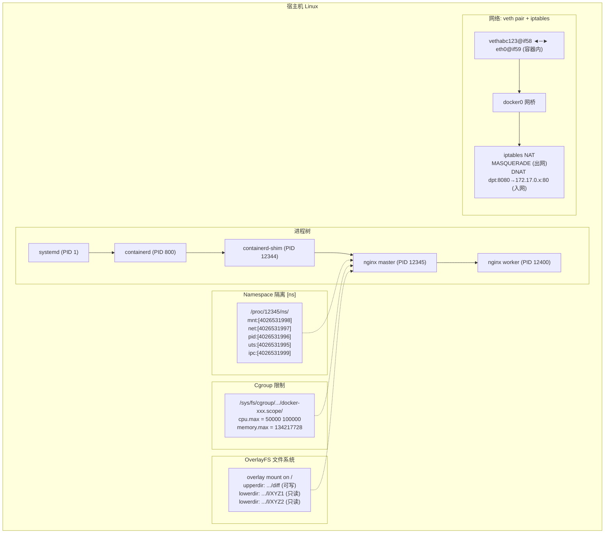

# 从 Linux 视角看 Docker 容器：它不过是一个"被绑架"的普通进程

## 一句话理解

Docker 容器在 Linux 眼里**没有任何魔法**——它就是一个被 namespaces "关在小黑屋"里、被 cgroups "戴上镣铐"的普通进程。宿主机上 `ps aux` 能看到它，`/proc/<pid>/` 目录正常存在，`kill -9` 也能杀死它。Docker 只是帮你自动化了"创建隔离进程"的繁琐步骤。

> 如果你能理解：**容器 = 进程 + namespace（视野限制）+ cgroup（资源限制）+ overlayfs（文件系统）**，你就掌握了容器技术的全部精髓。

## 先来一个实验：找到你的容器进程

启动一个 Nginx 容器，然后在宿主机上找到它：

```bash
# 启动一个 Nginx 容器
docker run -d --name my-nginx --memory 128m --cpus 0.5 nginx:latest

# 在宿主机上找它
ps aux | grep nginx
# 输出示例：
# root     12345  0.0  0.1 123456 12345 ?  Ssl  10:00  0:00 nginx: master process nginx -g daemon off;
# 会发现 nginx 进程就在宿主机的进程列表里，完全没有隐藏
```

这第一眼就能揭示核心事实：**容器进程直接运行在宿主机内核上，宿主机的 `ps` 一览无余。**

## 一、进程视角：容器就是一个进程

### 1.1 查看容器进程的 PID

```bash
# 方法1：docker inspect
docker inspect my-nginx --format '{{.State.Pid}}'
# 输出: 12345

# 方法2：docker top
docker top my-nginx
# 输出:
# UID   PID   PPID  C  STIME  TTY  TIME     CMD
# root  12345 12344 0  10:00  ?    00:00:00 nginx: master process nginx -g daemon off;
# 101   12400 12345 0  10:00  ?    00:00:00 nginx: worker process
```

你拿到了宿主机上的真实 PID：`12345`。从这个 PID 出发，我们可以像查看任何普通进程一样查看它的全部 Linux 信息。

### 1.2 查看进程树：容器进程的爸爸是谁？

```bash
pstree -ps 12345
# 输出示例：
# systemd(1)───containerd(800)───containerd-shim(12344)───nginx(12345)───nginx(12400)
```

容器进程的父进程链非常清晰：

```
systemd (宿主机 init)
  └── containerd (容器运行时)
       └── containerd-shim (垫片进程，负责 stdio 和退出状态)
            └── nginx (你的容器进程！)
                 └── nginx worker
```

`containerd-shim` 是一个"垫片"进程，它做两件事：
- 保持容器的 stdin/stdout/stderr 管道打开，让你 `docker logs` 能看到输出
- 当容器进程退出时，向 containerd 报告退出码

> 这也解释了为什么即使 `docker stop` 了，也会有 `containerd-shim` 进程残留一段时间——它要等容器完全退出后才清理。

### 1.3 容器进程的 proc 目录——啥都不缺

```bash
# 容器的 /proc 目录在宿主机上同样可以访问
ls /proc/12345/
# 输出和普通进程一模一样：
# attr/  cmdline  cwd/  environ  exe  fd/  maps  mounts  ns/  root/  stat  status  ...
```

下面我们逐一探索这些关键文件，看看容器进程和普通进程到底有什么不同。

## 二、Namespace 视角：容器的"小黑屋"

Namespace 是容器隔离的核心。**进程被关进 namespace 后，它看到的世界就变了——但 `/proc/<pid>/ns/` 不会撒谎。**

### 2.1 对比容器和宿主机的 namespace

```bash
# 查看容器进程的 namespace
sudo ls -l /proc/12345/ns/
# 输出示例：
# lrwxrwxrwx 1 root root 0 Jun 25 10:00 cgroup -> cgroup:[4026532000]
# lrwxrwxrwx 1 root root 0 Jun 25 10:00 ipc    -> ipc:[4026531999]
# lrwxrwxrwx 1 root root 0 Jun 25 10:00 mnt    -> mnt:[4026531998]
# lrwxrwxrwx 1 root root 0 Jun 25 10:00 net    -> net:[4026531997]
# lrwxrwxrwx 1 root root 0 Jun 25 10:00 pid    -> pid:[4026531996]
# lrwxrwxrwx 1 root root 0 Jun 25 10:00 uts    -> uts:[4026531995]
# lrwxrwxrwx 1 root root 0 Jun 25 10:00 user   -> user:[4026531837]

# 对比一下当前 shell（宿主机）的 namespace
sudo ls -l /proc/$$/ns/
# 输出示例：
# lrwxrwxrwx 1 root root 0 Jun 25 10:00 cgroup -> cgroup:[4026531835]
# lrwxrwxrwx 1 root root 0 Jun 25 10:00 ipc    -> ipc:[4026531839]
# lrwxrwxrwx 1 root root 0 Jun 25 10:00 mnt    -> mnt:[4026531841]
# lrwxrwxrwx 1 root root 0 Jun 25 10:00 net    -> net:[4026531840]
# lrwxrwxrwx 1 root root 0 Jun 25 10:00 pid    -> pid:[4026531836]
# lrwxrwxrwx 1 root root 0 Jun 25 10:00 uts    -> uts:[4026531838]
# lrwxrwxrwx 1 root root 0 Jun 25 10:00 user   -> user:[4026531837]
```

关键发现：**方括号里的数字全部不同**（user 可能除外），说明容器进程被放在了**全新的 namespace** 里。这就是隔离的本质。

```
┌─────────────────────────────────┐  ┌─────────────────────────────────┐
│       宿主机 Shell ($$)          │  │       容器 nginx (12345)         │
│                                  │  │                                  │
│  mnt:[4026531841] ←─ 不同的房子   │  │  mnt:[4026531998] ←─ 不同的房子   │
│  net:[4026531840] ←─ 不同的网    │  │  net:[4026531997] ←─ 不同的网    │
│  pid:[4026531836] ←─ 不同的编号   │  │  pid:[4026531996] ←─ 不同的编号   │
│  uts:[4026531838] ←─ 不同的主机名 │  │  uts:[4026531995] ←─ 不同的主机名 │
│  ipc:[4026531839] ←─ 不同通信通道 │  │  ipc:[4026531999] ←─ 不同通信通道 │
└─────────────────────────────────┘  └─────────────────────────────────┘
```

### 2.2 站在宿主机上"偷看"容器的世界

借助 `/proc/<pid>/root`，你可以站在宿主机上，以容器的文件系统视角执行命令：

```bash
# 查看容器内的根目录文件（从宿主机看容器的 "/"）
sudo ls /proc/12345/root/
# 输出: bin  boot  dev  etc  home  lib  media  mnt  opt  proc  root  run  sbin  srv  sys  tmp  usr  var
# 这就是 nginx 镜像的解压内容！

# 查看容器内的进程列表（从宿主机看容器的 "/proc"）
sudo ls /proc/12345/root/proc/
# 输出: 1  10  ... （这些是容器内看到的 PID）

# 对比宿主机 /proc —— 看到的东西完全不一样
ls /proc/
# 输出: 1  2  3  ... 800 ... 12345 ... （宿主机上所有进程）
```

### 2.3 nsenter：像"灵魂附体"一样进入容器

`nsenter` 命令可以让你**临时加入**一个正在运行的容器的 namespace：

```bash
# 进入容器的全部 namespace（等价于 docker exec，但是直接在宿主机操作）
sudo nsenter -t 12345 -a /bin/bash

# 此时你在容器内部：
hostname      # 输出容器的 hostname，不是宿主机的
ip addr       # 只能看到容器内的网卡
ps aux        # 只能看到容器内的进程，PID 从 1 开始
ls /          # 看到的是容器镜像的文件系统

exit  # 退出容器
```

```bash
# 高级玩法：只进入容器的 network namespace 排查网络问题
sudo nsenter -t 12345 -n ip addr
# 输出容器内的网络配置，非常适合调试

# 只进入 mount namespace 查看容器的文件
sudo nsenter -t 12345 -m ls /etc/nginx/
```

> `docker exec` 本质上就是 `nsenter` 的封装——通过容器的 PID 加入它的 namespace。

### 2.4 容器内的 PID 1 vs 宿主机的真实 PID

```bash
# 在容器内看
docker exec my-nginx ps aux
# 输出：
# USER  PID  %CPU %MEM    VSZ   RSS TTY  STAT  START  TIME  COMMAND
# root    1   0.0  0.1  12345  6789 ?    Ss    10:00  0:00  nginx: master process
# nginx  10   0.0  0.1  12345  6789 ?    S     10:00  0:00  nginx: worker process

# 在宿主机上看同一个进程
ps aux | grep 12345
# 输出：
# root  12345  0.0  0.1  12345  6789 ?  Ss  10:00  0:00  nginx: master process
# 101   12400  0.0  0.1  12345  6789 ?  S   10:00  0:00  nginx: worker process
```

同一个进程，容器内显示 PID=1（因为有 PID namespace），宿主机上显示 PID=12345（真实的全局 PID）。**pid namespace 只是做了 PID 编号的"翻译"，进程本身还是那个进程。**

## 三、Cgroup 视角：容器的"镣铐"

Cgroup 负责限制容器能用多少资源。`docker run --memory 128m --cpus 0.5` 的配置，最终都写入了 `/sys/fs/cgroup/` 下的文件。

### 3.1 找到容器对应的 cgroup 路径

```bash
# 方法1：从 /proc/<pid>/cgroup 查看
cat /proc/12345/cgroup
# cgroup v2 输出示例（只有一行）：
# 0::/system.slice/docker-abc123def456.scope

# 方法2：用 docker inspect
docker inspect my-nginx --format '{{.HostConfig.CgroupParent}}'
```

### 3.2 查看容器的资源限制

```bash
# 假设容器的 cgroup 路径是 /sys/fs/cgroup/system.slice/docker-abc123.scope/
CGPATH="/sys/fs/cgroup/system.slice/docker-abc123def456.scope"

# 查看 CPU 限制（我们设了 --cpus 0.5）
cat $CGPATH/cpu.max
# 输出: 50000 100000
# 含义：每 100000 微秒（100ms）周期内，最多使用 50000 微秒（50ms）→ 0.5 核

# 查看内存限制（我们设了 --memory 128m）
cat $CGPATH/memory.max
# 输出: 134217728
# 含义：134217728 bytes = 128 MiB

# 查看当前内存使用量
cat $CGPATH/memory.current
# 输出: 52428800  ← 约 50MB

# 查看容器内的所有进程
cat $CGPATH/cgroup.procs
# 输出:
# 12345
# 12400
# 这就是被"关"在这个 cgroup 里的进程 PID 列表
```

### 3.3 实时验证：cgroup 限制如何生效

```bash
# 在容器内运行一个内存炸弹
docker exec my-nginx sh -c "dd if=/dev/zero of=/dev/null bs=100M count=10"
# 不会有任何问题，因为只是写 /dev/null

# 真正消耗内存的测试——在容器内用 stress 工具
docker exec my-nginx sh -c "tail /dev/zero"
# 由于 memory.max=128M，这个命令很快就会 OOMKilled

# 在宿主机上观察 cgroup 事件
cat /sys/fs/cgroup/system.slice/docker-abc123def456.scope/memory.events
# 输出:
# low 0
# high 0
# max 1234      ← 达到 memory.max 限制的次数
# oom 1         ← 发生 OOM kill 的次数！
# oom_kill 1    ← 实际杀死的进程数
```

### 3.4 对比：关闭 cgroup 限制会怎样

```bash
# 启动一个没有内存限制的容器做对比
docker run -d --name no-limit-nginx nginx:latest
NO_LIMIT_PID=$(docker inspect no-limit-nginx --format '{{.State.Pid}}')

# 查看它的 cgroup 内存限制
cat /proc/$NO_LIMIT_PID/cgroup
# 找到对应的 cgroup 路径
cat /sys/fs/cgroup/system.slice/docker-xxx.scope/memory.max
# 输出: max
# "max" 表示没有限制——可以使用宿主机的全部内存
```

### 3.5 手动修改 cgroup 限制——不用重启容器

```bash
# 将容器的内存限制改为 256M，实时生效！
echo "268435456" | sudo tee /sys/fs/cgroup/system.slice/docker-abc123def456.scope/memory.max

# 将 CPU 限制改为 1 核
echo "100000 100000" | sudo tee /sys/fs/cgroup/system.slice/docker-abc123def456.scope/cpu.max

# 容器不需要重启，内核立即执行新限制
docker stats my-nginx --no-stream
# 你会看到 MEM LIMIT 已经变成 256MiB
```

> 这就是 Kubernetes 能够在不重启 Pod 的情况下动态调整资源限制的底层原理——直接写 cgroup 文件。

## 四、文件系统视角：OverlayFS 的层层叠加

Docker 镜像的分层构建，底层依赖 OverlayFS（联合文件系统）。

### 4.1 查看容器的挂载信息

```bash
# 从容器的 /proc/<pid>/mountinfo 查看挂载
cat /proc/12345/mountinfo | grep overlay
# 输出类似：
# ... overlay / overlay rw,relatime,lowerdir=/var/lib/docker/overlay2/l/XYZ1:/var/lib/docker/overlay2/l/XYZ2,upperdir=/var/lib/docker/overlay2/ABC123/diff,workdir=/var/lib/docker/overlay2/ABC123/work ...
```

解读这个输出：

```
/var/lib/docker/overlay2/ABC123/diff   ← upperdir（可写层，容器所有的修改都写在这里）
/var/lib/docker/overlay2/l/XYZ1        ← lowerdir 第1层（镜像层，只读）
/var/lib/docker/overlay2/l/XYZ2        ← lowerdir 第2层（镜像层，只读）
```

```
┌────────────────────────────┐
│  Upper Dir（可读写层）        │  ← 容器删除/修改的文件在这里做标记
│  /var/lib/docker/overlay2/ │     docker diff 看到的改动都在这
│  ABC123/diff               │
├────────────────────────────┤
│  Lower Dir 2（只读层）       │  ← RUN apt-get install nginx 产生
│  /var/lib/docker/overlay2/ │
│  l/XYZ2                    │
├────────────────────────────┤
│  Lower Dir 1（只读层）       │  ← FROM ubuntu:22.04 产生
│  /var/lib/docker/overlay2/ │
│  l/XYZ1                    │
└────────────────────────────┘
```

### 4.2 在宿主机上直接看容器的"可写层"

```bash
# 拿到容器的 merged 目录（overlay 合并后的完整视图）
MERGED=$(cat /proc/12345/mountinfo | grep ' / ' | awk '{print $5}')
echo $MERGED
# 输出: /var/lib/docker/overlay2/ABC123/merged

# 这就是容器内 "/" 看到的真实内容
sudo ls $MERGED
# 输出: bin  boot  dev  etc  home  lib  ...

# 对比 —— 和 /proc/12345/root 看到的一模一样
sudo ls /proc/12345/root/
```

### 4.3 验证 OverlayFS 的写时复制 (Copy-on-Write)

```bash
# 在容器内修改一个文件
docker exec my-nginx sh -c "echo hello > /tmp/test.txt"

# 在宿主机上查找这个文件
# 在 lowerdir（只读层）找不到
sudo ls /var/lib/docker/overlay2/l/XYZ1/tmp/ 2>/dev/null
# 无输出

# 在 upperdir（可写层）找到了！
sudo ls /var/lib/docker/overlay2/ABC123/diff/tmp/
# 输出: test.txt

sudo cat /var/lib/docker/overlay2/ABC123/diff/tmp/test.txt
# 输出: hello
```

如果在容器内**修改**了一个镜像中已有的文件（比如 `/etc/nginx/nginx.conf`）：
- 原文件在 lowerdir 中保持不变
- 修改后的副本会写到 upperdir
- OverlayFS 合并时，upperdir 的文件"遮住" lowerdir 的同名文件

这就是 OverlayFS 的 **Copy-on-Write**：改什么才复制什么，不改的部分在所有容器间共享。

### 4.4 docker diff：快速查看容器改了什么

```bash
docker diff my-nginx
# 输出：
# C /root          ← Changed（修改）
# A /tmp/test.txt  ← Added（新增）
# C /etc/nginx/nginx.conf  ← Changed（修改了配置文件）
```

`docker diff` 本质上就是在对比 upperdir 和 lowerdir。

## 五、网络视角：Veth Pair 和 iptables

### 5.1 查看容器的网卡

```bash
# 在宿主机上，用容器的 net namespace 执行 ip 命令
sudo nsenter -t 12345 -n ip addr
# 输出：
# 1: lo: ...
# 58: eth0@if59: ...
# 容器内只有一个 eth0

# 退出容器视角，在宿主机上看看 veth pair 的另一端
ip link show | grep veth
# 输出：
# 59: vethabc123@if58: ...
```

注意编号的对应关系：
- 容器内 `eth0@if59`（index 58，peer index 59）
- 宿主机 `vethabc123@if58`（index 59，peer index 58）

**veth pair 是一对虚拟网线**——一端插在容器里（eth0），另一端插在宿主机的 docker 网桥上。

```
┌─────────────────┐         ┌─────────────────────┐
│  容器 (net ns)    │         │  宿主机 (host net ns) │
│                  │         │                      │
│  eth0@if59       │  veth   │  vethabc123@if58     │
│  (index 58)      │◄══════►│  (index 59)          │
│  172.17.0.2/16   │  pair   │  master: docker0     │
│                  │         │                      │
└─────────────────┘         └──────────┬───────────┘
                                       │
                                ┌──────▼──────┐
                                │   docker0   │
                                │   网桥       │
                                │ 172.17.0.1  │
                                └──────┬──────┘
                                       │
                                  ┌────▼────┐
                                  │  NAT    │
                                  │ (iptables)│
                                  └────┬────┘
                                       │
                                  宿主机 eth0
                                  (外网)
```

### 5.2 查看 iptables 规则：容器出网的秘密

```bash
# 查看 Docker 在 iptables 中添加的 NAT 规则
sudo iptables -t nat -L POSTROUTING | grep docker
# 输出类似：
# MASQUERADE  all  --  172.17.0.0/16  anywhere
```

这条规则的含义：所有从容器网络 `172.17.0.0/16` 发出的流量，在离开宿主机网卡前做 SNAT（源地址转换），伪装成宿主机 IP。

```bash
# 在容器内访问外网
docker exec my-nginx curl ifconfig.me
# 你会看到输出的是宿主机的公网 IP，而不是容器的 172.17.0.2

# 这就是 iptables MASQUERADE 在起作用
```

### 5.3 查看端口映射：DNAT 规则

```bash
# 启动一个带端口映射的容器
docker run -d --name nginx-port -p 8080:80 nginx:latest
PID=$(docker inspect nginx-port --format '{{.State.Pid}}')

# 查看 iptables DNAT 规则
sudo iptables -t nat -L DOCKER | grep 8080
# 输出类似：
# DNAT  tcp  --  anywhere  anywhere  tcp dpt:8080 to:172.17.0.3:80
```

`-p 8080:80` 的本质就是添加了一条 DNAT 规则：宿主机的 8080 端口 → 容器的 172.17.0.3:80。

## 六、完整全景图：把前面的碎片拼成一张图

把你执行 `docker run -d --name my-nginx --memory 128m --cpus 0.5 -p 8080:80 nginx:latest` 之后，Linux 系统上实际发生的事情全部画出来：



一句话总结：

- **进程**：`ps aux | grep nginx` 就能看到，有真实的宿主 PID
- **Namespace**：`/proc/<pid>/ns/` 里全是独立的方括号号
- **Cgroup**：`/sys/fs/cgroup/.../docker-xxx.scope/` 里写着资源限额
- **文件系统**：`/proc/<pid>/mountinfo` 里能看到 overlay 的 lowerdir 和 upperdir
- **网络**：veth pair 一端在容器、一端在宿主机网桥，iptables 负责 NAT

## 七、总结：容器不是什么黑科技

| 你可能以为的 | Linux 实际看到的 |
|:---|:---|
| 容器是一个轻量级虚拟机 | 容器就是一个**普通进程**，`kill -9` 就能杀 |
| 容器有自己的内核 | 容器**没有内核**，直接调宿主机的 syscall |
| 容器里的文件系统是独立的 | 只是 OverlayFS 把多层镜像"叠"出来的视图 |
| 容器有自己的 IP 和网卡 | 容器有一个**虚拟** eth0，通过 veth pair 连到宿主机网桥 |
| `docker run -m 128m` 是魔法 | 只是往 `/sys/fs/cgroup/.../memory.max` 写了个数字 |
| 容器启动很快是因为什么高级技术 | 因为**根本就是启动一个进程**，不 boot 内核 |

**容器技术的全部秘密，就藏在这三个 Linux 内核特性里**：

$$
\text{Container} = \text{Namespace} + \text{Cgroup} + \text{OverlayFS}
$$

Docker、containerd、Podman 这些工具，都是在这三个技术之上，帮你做了镜像管理、网络配置、日志收集等"保姆级"服务。但剥开这些壳，Linux 只看到一个被 namespace "关小黑屋"、被 cgroup "戴手铐"的普通进程。
