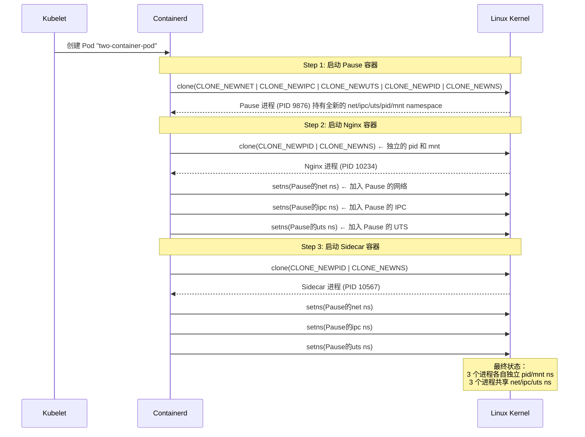

# 从 Linux 视角看 K8s Pod 多容器：不过是几个进程"合租"了一套 namespace

## 一句话理解

在 Kubernetes 里，一个 Pod 包含多个容器看起来很神奇——它们共享 IP、共享端口空间、能通过 `localhost` 互访。但从 Linux 视角看，**Pod 的本质就是一组进程，它们的部分 namespace（Network、IPC、UTS）指向同一个内核对象，而另外的 namespace（Mount、PID）各自独立**。再加上一个永远不死的 Pause 进程当"房东"来锚定这些共享 namespace。

> 如果你读过上一篇《从 Linux 视角看 Docker 容器》，那么理解 Pod 只需要多一个概念：**多个容器的某些 namespace 符号链接指向同一个方括号号**。

## 先来一个实验：创建一个双容器 Pod

我们用最经典的 Sidecar 模式——Nginx 主容器 + Busybox 边车容器：

```yaml
# pod-demo.yaml
apiVersion: v1
kind: Pod
metadata:
  name: two-container-pod
spec:
  containers:
  - name: nginx
    image: nginx:latest
    ports:
    - containerPort: 80
  - name: sidecar
    image: busybox:latest
    command: ["sh", "-c", "while true; do echo 'sidecar alive'; sleep 10; done"]
```

```bash
kubectl apply -f pod-demo.yaml
```

Pod 运行起来后，我们直接 SSH 到 Pod 所在的 K8s 节点上，用 Linux 原生命令来解剖它。

## 一、进程视角：一个 Pod 在宿主机上对应几个进程？

### 1.1 找到 Pod 的所有进程

```bash
# 先找到 Pause 容器（每个 Pod 都有一个）
crictl ps | grep two-container-pod
# 输出类似：
# CONTAINER ID   IMAGE                              STATE     NAME       POD ID
# abc123def456   registry.k8s.io/pause:3.9          Running   (pause)    789...
# 111222333444   nginx:latest                       Running   nginx      789...
# 555666777888   busybox:latest                     Running   sidecar    789...

# 拿到每个容器的宿主机 PID
PAUSE_PID=$(crictl inspect abc123def456 | jq '.info.pid')
NGINX_PID=$(crictl inspect 111222333444 | jq '.info.pid')
SIDECAR_PID=$(crictl inspect 555666777888 | jq '.info.pid')
echo "Pause: $PAUSE_PID, Nginx: $NGINX_PID, Sidecar: $SIDECAR_PID"
# 输出示例: Pause: 9876, Nginx: 10234, Sidecar: 10567
```

三个容器，三个进程。宿主机上看得清清楚楚。

### 1.2 查看进程树：Pause 是"房东"

```bash
pstree -ps $PAUSE_PID
# 输出示例：
# systemd(1)───containerd(800)───containerd-shim(9870)───pause(9876)

pstree -ps $NGINX_PID
# 输出示例：
# systemd(1)───containerd(800)───containerd-shim(10230)───nginx(10234)───nginx(10235)

pstree -ps $SIDECAR_PID
# 输出示例：
# systemd(1)───containerd(800)───containerd-shim(10560)───sleep(10567)
```

关键发现：**Pause、Nginx、Sidecar 三个进程不是父子关系**，它们各自有独立的 `containerd-shim` 父进程。但它们共享某些 namespace——这正是 Pod 的核心秘密。

```
                     systemd
                        │
                   containerd
                   /    |    \
          shim(Pause) shim(nginx) shim(sidecar)
               |          |           |
            pause(9876) nginx(10234) sleep(10567)
               |          |
               └─共享 net/ipc/uts ns─┘
```

## 二、Namespace 视角：哪些共享，哪些独立

这是理解 Pod 最关键的部分。我们直接对比三个进程的 `/proc/<pid>/ns/` 目录。

### 2.1 共享的 Namespace：Network、IPC、UTS

```bash
# 查看三个进程的 namespace 符号链接
# 为了方便对比，只看 inode 号（方括号里的数字）
sudo ls -l /proc/9876/ns/net /proc/10234/ns/net /proc/10567/ns/net
# 输出：
# lrwxrwxrwx ... net -> net:[4026532222]
# lrwxrwxrwx ... net -> net:[4026532222]  ← 一样的！
# lrwxrwxrwx ... net -> net:[4026532222]  ← 一样的！

sudo ls -l /proc/9876/ns/ipc /proc/10234/ns/ipc /proc/10567/ns/ipc
# 输出：
# lrwxrwxrwx ... ipc -> ipc:[4026532221]
# lrwxrwxrwx ... ipc -> ipc:[4026532221]  ← 一样的！
# lrwxrwxrwx ... ipc -> ipc:[4026532221]  ← 一样的！

sudo ls -l /proc/9876/ns/uts /proc/10234/ns/uts /proc/10567/ns/uts
# 输出：
# lrwxrwxrwx ... uts -> uts:[4026532220]
# lrwxrwxrwx ... uts -> uts:[4026532220]  ← 一样的！
# lrwxrwxrwx ... uts -> uts:[4026532220]  ← 一样的！
```

**Network、IPC、UTS 三个 namespace 的方括号号完全相同**，这意味着三个容器进程指向的是**同一个内核 namespace 对象**。它们看到的是同一个网络栈、同一个 hostname、共享同一套 IPC 资源。

### 2.2 独立的 Namespace：Mount、PID

```bash
# Mount namespace —— 各自独立
sudo ls -l /proc/9876/ns/mnt /proc/10234/ns/mnt /proc/10567/ns/mnt
# 输出：
# lrwxrwxrwx ... mnt -> mnt:[4026532223]
# lrwxrwxrwx ... mnt -> mnt:[4026532224]  ← 不同！
# lrwxrwxrwx ... mnt -> mnt:[4026532225]  ← 不同！

# PID namespace —— 各自独立
sudo ls -l /proc/9876/ns/pid /proc/10234/ns/pid /proc/10567/ns/pid
# 输出：
# lrwxrwxrwx ... pid -> pid:[4026532226]
# lrwxrwxrwx ... pid -> pid:[4026532227]  ← 不同！
# lrwxrwxrwx ... pid -> pid:[4026532228]  ← 不同！
```

Mount 和 PID namespace 各自独立——每个容器有自己的根文件系统和自己的 PID 编号空间。

### 2.3 一张图总结 Pod 的 namespace 共享模型

```
┌────────────────────────────────────────────────────────────┐
│                         Pod                                 │
│                                                             │
│   共享的 namespace（指向同一个内核对象）:                       │
│   ┌──────────────────────────────────────────────────┐      │
│   │  Network NS  net:[4026532222]                    │      │
│   │  IPC NS      ipc:[4026532221]                    │      │
│   │  UTS NS      uts:[4026532220]                    │      │
│   └──────────────────────────────────────────────────┘      │
│         ▲                ▲                ▲                 │
│         │                │                │                 │
│   ┌─────┴─────┐    ┌─────┴─────┐    ┌─────┴─────┐          │
│   │  Pause    │    │  Nginx    │    │  Sidecar  │          │
│   │  (9876)   │    │  (10234)  │    │  (10567)  │          │
│   │           │    │           │    │           │          │
│   │ 独立 mnt  │    │ 独立 mnt  │    │ 独立 mnt  │          │
│   │ mnt:[..3] │    │ mnt:[..4] │    │ mnt:[..5] │          │
│   │ 独立 pid  │    │ 独立 pid  │    │ 独立 pid  │          │
│   │ pid:[..6] │    │ pid:[..7] │    │ pid:[..8] │          │
│   └───────────┘    └───────────┘    └───────────┘          │
│                                                             │
│   Pause 是 net/ipc/uts namespace 的 "锚点"                   │
│   只要 Pause 不退出，这些 namespace 就不会被内核回收           │
└────────────────────────────────────────────────────────────┘
```

## 三、实验验证：用命令逐个验证共享效果

光看图不够，我们来亲手验证。

### 3.1 验证共享 Network NS：通过 localhost 互访

```bash
# 进入 Nginx 容器的 network namespace
sudo nsenter -t $NGINX_PID -n ip addr
# 输出：
# 1: lo: <LOOPBACK,UP,LOWER_UP> ...
# 3: eth0@if4: <BROADCAST,...> ... 10.244.1.5/24 ...
# Nginx 容器的 IP 是 10.244.1.5

# 进入 Sidecar 容器的 network namespace 看
sudo nsenter -t $SIDECAR_PID -n ip addr
# 输出和上面一模一样！IP 也是 10.244.1.5！
# 因为它们共享同一个 Network namespace
```

现在来验证最关键的结论：

```bash
# 在 Sidecar 容器内用 localhost 访问 Nginx
kubectl exec two-container-pod -c sidecar -- wget -qO- http://localhost:80
# 输出：Nginx 的欢迎页面 HTML！
# 成功！因为 localhost 在同一个 Network namespace 里
```

```bash
# 反过来，在 Nginx 容器内访问 Sidecar（如果 Sidecar 开了一个端口）
# 同样可以通过 localhost 访问，因为它们在同一个 net namespace
```

> 这就是为什么同一 Pod 内的容器**绝对不能监听相同端口**——它们共享端口空间，`localhost:80` 对 Nginx 和 Sidecar 来说指向的是同一个端口。

### 3.2 验证共享 UTS NS：相同的主机名

```bash
# 查看 Nginx 容器的 hostname
sudo nsenter -t $NGINX_PID -u hostname
# 输出: two-container-pod

# 查看 Sidecar 容器的 hostname
sudo nsenter -t $SIDECAR_PID -u hostname
# 输出: two-container-pod  ← 完全相同！
```

UTS namespace 共享意味着两个容器的 `hostname` 命令看到的是同一个值。Pod 名就是它们的默认 hostname。

### 3.3 验证独立 Mount NS：各自有不同的文件系统

```bash
# Nginx 容器的根文件系统
sudo ls /proc/$NGINX_PID/root/
# 输出: bin  boot  dev  etc  home  ...  usr  var
# 这是 nginx:latest 镜像的内容

# Sidecar 容器的根文件系统
sudo ls /proc/$SIDECAR_PID/root/
# 输出: bin  dev  etc  home  ...  tmp  usr  var
# 这是 busybox:latest 镜像的内容 —— 少了很多目录

# 在 Nginx 容器中找 busybox 的命令
sudo ls /proc/$NGINX_PID/root/bin/ | grep busybox
# 无输出 —— Nginx 镜像里没有 busybox

# 在 Sidecar 容器中找 nginx 的命令
sudo ls /proc/$SIDECAR_PID/root/usr/sbin/ | grep nginx
# 无输出 —— busybox 镜像里没有 nginx
```

Mount namespace 独立意味着：每个容器看到的是**自己镜像的解压内容**，互相不可见。

### 3.4 验证独立 PID NS：各自从 PID 1 开始编号

```bash
# 从 Nginx 容器内部看
sudo nsenter -t $NGINX_PID -p -m ps aux
# 输出：
# PID  USER  COMMAND
#   1  root  nginx: master process
#   7  nginx nginx: worker process
#   ...

# 从 Sidecar 容器内部看
sudo nsenter -t $SIDECAR_PID -p -m ps aux
# 输出：
# PID  USER  COMMAND
#   1  root  sleep 10
#   ...
```

两个容器各自的 PID 1 是不同的进程，但在它们自己的视角里都是从 1 开始。

### 3.5 验证 `shareProcessNamespace`：PID 也可以共享！

K8s 提供了一个特殊选项 `shareProcessNamespace: true`，让 Pod 内的容器也能看到彼此的进程：

```yaml
# pod-share-pid.yaml
apiVersion: v1
kind: Pod
metadata:
  name: share-pid-pod
spec:
  shareProcessNamespace: true   # 关键配置！
  containers:
  - name: nginx
    image: nginx:latest
  - name: sidecar
    image: busybox:latest
    command: ["sh", "-c", "sleep 3600"]
```

```bash
kubectl apply -f pod-share-pid.yaml

# 找到进程 PID
NGINX_PID2=$(crictl inspect ... | jq '.info.pid')
SIDECAR_PID2=$(crictl inspect ... | jq '.info.pid')

# 检查 PID namespace —— 现在相同了！
sudo ls -l /proc/$NGINX_PID2/ns/pid /proc/$SIDECAR_PID2/ns/pid
# 输出：
# lrwxrwxrwx ... pid -> pid:[4026533000]
# lrwxrwxrwx ... pid -> pid:[4026533000]  ← 一样的！

# 在 Sidecar 容器内可以看到 Nginx 进程了
kubectl exec share-pid-pod -c sidecar -- ps aux
# 输出：
# PID  USER  COMMAND
#   1  root  /pause              ← Pause 进程
#   7  root  nginx: master       ← 能看到 Nginx！
#  13  nginx nginx: worker
#  14  root  sleep 3600          ← Sidecar 自己
```

> 开启 `shareProcessNamespace` 后，Sidecar 容器可以直接看到 Nginx 的进程，甚至可以用 `/proc/<pid>` 来读取 Nginx 的运行时信息。这在需要监控或信号传递的场景下非常有用。但要注意：这也意味着容器之间可以通过 `/proc` 相互影响。

## 四、Volume 共享：不同 Mount NS 如何看到同一个目录

Pod 内容器通过 `volumes` 共享目录。但从 Linux 视角看，**两个独立 mount namespace 的进程，如何看到同一个目录呢？**

### 4.1 实验：创建一个带共享 Volume 的 Pod

```yaml
# pod-with-volume.yaml
apiVersion: v1
kind: Pod
metadata:
  name: volume-pod
spec:
  containers:
  - name: writer
    image: busybox:latest
    command: ["sh", "-c", "while true; do date >> /shared/log.txt; sleep 2; done"]
    volumeMounts:
    - name: shared-data
      mountPath: /shared
  - name: reader
    image: busybox:latest
    command: ["sh", "-c", "while true; do tail -1 /shared/log.txt; sleep 2; done"]
    volumeMounts:
    - name: shared-data
      mountPath: /shared
  volumes:
  - name: shared-data
    emptyDir: {}
```

```bash
kubectl apply -f pod-with-volume.yaml

# 等 Pod 运行后，reader 容器能看到 writer 写入的内容
kubectl logs volume-pod -c reader
# 输出: Thu Jun 25 15:00:01 UTC 2026
#       Thu Jun 25 15:00:03 UTC 2026
#       ...
```

### 4.2 从 Linux 视角：挂载信息揭示了什么

```bash
# 拿到两个容器的 PID
WRITER_PID=$(crictl inspect ... | jq '.info.pid')
READER_PID=$(crictl inspect ... | jq '.info.pid')

# 检查它们的 mount namespace —— 是独立的
sudo ls -l /proc/$WRITER_PID/ns/mnt /proc/$READER_PID/ns/mnt
# 输出：两个不同的方括号号（mount ns 独立）

# 但看它们的挂载信息
sudo cat /proc/$WRITER_PID/mountinfo | grep shared
# 输出类似：
# ... /var/lib/kubelet/pods/<pod-uid>/volumes/kubernetes.io~empty-dir/shared-data /shared ...

sudo cat /proc/$READER_PID/mountinfo | grep shared
# 输出类似：
# ... /var/lib/kubelet/pods/<pod-uid>/volumes/kubernetes.io~empty-dir/shared-data /shared ...
```

关键发现：**两个容器虽然 mount namespace 独立，但它们都把宿主机上的同一个目录挂载到了自己的文件系统里。**

```
宿主机目录:
/var/lib/kubelet/pods/<uid>/volumes/.../shared-data/
                    │
          ┌─────────┴─────────┐
          ▼                   ▼
   Writer 容器的            Reader 容器的
   mount namespace         mount namespace
   /shared ──bind──►      /shared ──bind──►
   同一个宿主机目录          同一个宿主机目录
```

**Volume 共享的本质**：不是 mount namespace 共享了，而是 kubelet 把同一个宿主机目录 **bind mount** 进了两个独立 mount namespace 中的对应路径。写入操作最终落在宿主机同一个目录，所以彼此可见。

```bash
# 你可以在宿主机上直接看到共享的数据
sudo ls /var/lib/kubelet/pods/<pod-uid>/volumes/kubernetes.io~empty-dir/shared-data/
# 输出: log.txt

sudo cat /var/lib/kubelet/pods/<pod-uid>/volumes/kubernetes.io~empty-dir/shared-data/log.txt
# 输出 container writer 写入的所有内容
```

## 五、Pause 容器：Pod 的"房东"和命名空间的"锚点"

### 5.1 Pause 做了什么

Pause 容器的镜像极小（约 700KB），它的唯一代码就是：

```c
// Pause 容器的核心逻辑（简化版）
#include <unistd.h>
int main() {
    // 阻塞所有信号
    sigset_t mask;
    sigfillset(&mask);
    sigprocmask(SIG_BLOCK, &mask, NULL);
    
    // 永远睡眠，什么都不做
    while (1) {
        pause();  // 等待信号，但因为全部阻塞了，所以永远不会被唤醒
    }
}
```

它的唯一作用就是：**活着**。

### 5.2 为什么需要它活着

Namespace 有一个关键特性：**当 namespace 中最后一个进程退出时，这个 namespace 就被内核回收了。**

```
如果 Pause 不存在：
  Nginx(10234) 启动 → 创建 net NS → Nginx 挂掉 → net NS 被回收
  → Sidecar 的 net NS 也没了 → Pod 网络崩溃

有 Pause：
  Pause(9876) 启动 → 创建 net/ipc/uts NS → Pause 永远不退出
  → Nginx 加入 Pause 的 net NS → Nginx 挂掉 → net NS 还在（Pause 还活着）
  → Nginx 重启 → 重新加入 Pause 的 net NS → 网络不受影响
```

```bash
# 验证：杀掉 Nginx 容器，Pod 的 IP 不会变化
# （K8s 会自动重启 Nginx 容器）
kubectl get pod two-container-pod -o wide
# 记录 IP: 10.244.1.5

# 模拟 Nginx 容器崩溃
crictl stop 111222333444

# 等 K8s 重启 Nginx 后
kubectl get pod two-container-pod -o wide
# IP 依然是 10.244.1.5 —— 因为 Pause 还活着，net NS 没变
```

### 5.3 宿主机上的验证

```bash
# 用 lsns 查看 Pause 持有的 namespace
lsns -t net | grep 9876
# 输出：
# 4026532222 net  3  9876 root  /pause
# NPROCS=3 说明有 3 个进程在使用这个 net namespace（Pause + Nginx + Sidecar）

# 查看引用这个 net namespace 的所有进程
sudo ls -l /proc/*/ns/net | grep 4026532222
# 输出三个进程都引用着同一个 net:[4026532222]
```

## 六、完整流程图：Pod 从创建到运行

把 K8s 创建一个 Pod 时，背后 Linux 发生的事情串起来：



用系统调用的视角来看：

| 步骤 | 系统调用 | 效果 |
|:---|:---|:---|
| 启动 Pause | `clone(NEWNET\|NEWIPC\|NEWUTS\|NEWPID\|NEWNS)` | 创建一套完整的新 namespace |
| 启动 Nginx | `clone(NEWPID\|NEWNS)` + `setns(Pause的net)` + `setns(Pause的ipc)` + `setns(Pause的uts)` | 新 pid/mnt + 复用 Pause 的 net/ipc/uts |
| 启动 Sidecar | 同 Nginx | 新 pid/mnt + 复用 Pause 的 net/ipc/uts |

## 七、总结：Pod 在 Linux 眼里是什么

| Pod 的特性 | Linux 的实现方式 | 如何验证 |
|:---|:---|:---|
| 容器共享 IP | 所有容器进程的 `/proc/PID/ns/net` 指向同一个方括号号 | `ls -l /proc/*/ns/net \| grep 4026532222` |
| 通过 localhost 互访 | 共享 Network namespace，localhost 指向同一个 lo 接口 | `nsenter -t PID -n curl localhost:80` |
| 容器有独立的文件系统 | 每个容器有独立的 Mount namespace | `ls -l /proc/*/ns/mnt`，方括号号不同 |
| 容器共享 Volume | kubelet 将同一宿主机目录 bind mount 到各自的 mount namespace | `cat /proc/*/mountinfo \| grep shared` |
| 容器看到自己的 PID 从 1 开始 | 每个容器有独立的 PID namespace | `nsenter -t PID -p ps aux`，各自看到不同的 PID 1 |
| 容器不会因其他容器崩溃而丢 IP | Pause 进程永远不死，锚定 namespace | `lsns -t net`，NPROCS >= 1 |

**Pod 的终极公式**：

$$
\text{Pod} = \text{Pause 进程（锚定共享 NS）} + \sum_{i=1}^{n} \text{业务容器进程（独立 NS + 加入共享 NS）}
$$

你可以把 Pod 想象成一套 "合租房"：
- **Pause** 是签了长约的主租客（永远不搬走，房子就一直存在）
- **Network/IPC/UTS namespace** 是公共区域（客厅、厨房、WiFi），所有租客共享
- **Mount/PID namespace** 是各自的卧室（装修风格不同，互不干扰）
- **Volume** 是共用的储藏室（物理上是同一间，每个租客从自己卧室开了扇门进去）

Docker 让你看到一个"被隔离的进程"，K8s Pod 让你看到一组"部分共享、部分隔离"的进程。两者的底层机制完全一样——都是 Linux namespace 的排列组合。
