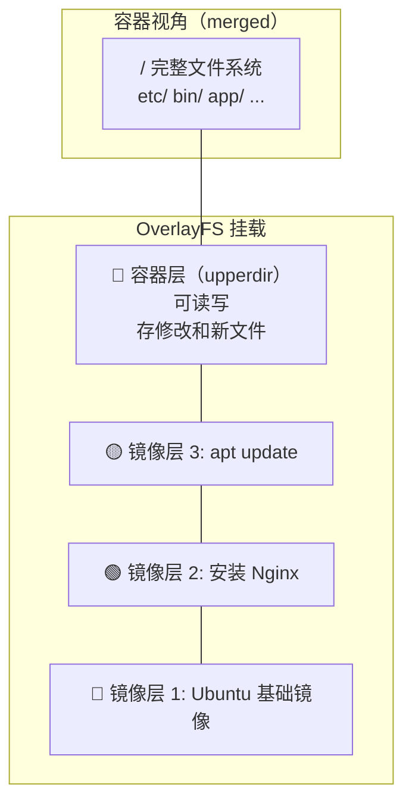
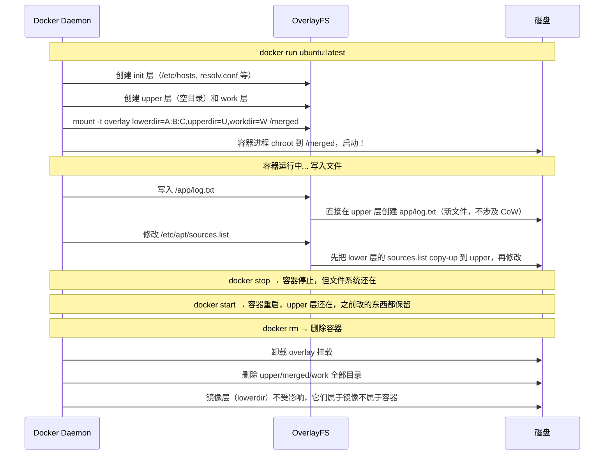

# Docker 文件系统揭秘：你的镜像不过是一摞"叠叠乐"目录

## 一句话理解

Docker 镜像的"分层"不是什么黑魔法——它就是 **OverlayFS（联合文件系统）** 把多个只读目录叠在一起，最上面再盖一个可写层。你 `docker run` 一个容器时，不过是内核把这些目录"合并视图"呈现给容器进程。**容器里删文件不释放镜像空间、写文件会触发 Copy-on-Write、镜像拉取能复用公共层**——这些日常现象背后全是 OverlayFS 的机制在起作用。

> 如果你能理解：**镜像 = 多个只读 lower 层叠在一起，容器 = 再多叠一个可写 upper 层**，Docker 文件系统就没有秘密了。

## 先来一个实验：解剖一个 Docker 镜像

我们拉一个最简单的镜像，看看它的"层"到底是什么：

```bash
# 拉一个 alpine 镜像
docker pull alpine:latest

# 查看镜像有哪些层
docker history alpine:latest
# 输出示例：
# IMAGE          CREATED       CREATED BY                       SIZE
# a606584aa4aa   2 weeks ago   /bin/sh -c #(nop)  CMD [...]    0B
# <missing>      2 weeks ago   /bin/sh -c #(nop) ADD file:...  7.79MB
```

每一行就是一层。`docker history` 看不到的，我们用 `docker inspect` 看：

```bash
docker inspect alpine:latest | jq '.[0].RootFS'
# 输出示例：
# {
#   "Type": "layers",
#   "Layers": [
#     "sha256:d8a5e7c5b0e6...",
#     "sha256:a1b2c3d4e5f6..."
#   ]
# }
```

这些 `sha256` 就是每一层的 content-addressable ID。接下来我们直接去 Docker 的数据目录看看这些层在宿主机上到底长什么样。

## 一、OverlayFS 基础：三个目录搭出一个"合体视图"

在深入 Docker 之前，先用原生 Linux 命令手动搭一个 OverlayFS，理解它的核心概念：

```bash
# 创建实验目录
mkdir -p /tmp/overlay-demo/{lower,upper,work,merged}

# lower 层：放一个只读文件
echo "hello from lower" > /tmp/overlay-demo/lower/base.txt
echo "this file only in lower" > /tmp/overlay-demo/lower/only-lower.txt

# upper 层：放一个同名但内容不同的文件（模拟"覆盖"）
echo "hello from upper" > /tmp/overlay-demo/upper/base.txt
echo "this file only in upper" > /tmp/overlay-demo/upper/only-upper.txt

# 挂载 OverlayFS：lower 在下，upper 在上，merged 是合并视图
mount -t overlay overlay \
  -o lowerdir=/tmp/overlay-demo/lower,upperdir=/tmp/overlay-demo/upper,workdir=/tmp/overlay-demo/work \
  /tmp/overlay-demo/merged

# 看看合并后的效果
ls /tmp/overlay-demo/merged/
# 输出: base.txt  only-lower.txt  only-upper.txt

cat /tmp/overlay-demo/merged/base.txt
# 输出: hello from upper   ← upper 层的同名文件"盖住"了 lower 层！
```

这个实验揭示了 OverlayFS 的核心规则：

```
合并视图 (merged) = upper 层 ∪ lower 层
规则：同名文件 upper 覆盖 lower
     删除操作通过 "whiteout 文件" 标记
     新建/修改只发生在 upper 层（Copy-on-Write）
```

用一张图来理解：



> **关于 `mount` 命令的深入原理**（VFS 层如何工作、tmpfs/bind mount/procfs/overlay 四种 mount 的详细对比、`/proc/mounts` 和 `findmnt` 的用法等），请参见独立文章：[mount 命令原理：把文件系统"嫁接"到目录树上](/linux/mount/)。这里只保留与 OverlayFS 直接相关的要点。

Docker 在启动容器时，本质上就是一条 mount 命令，把多个 lower 层 + 一个 upper 层"嫁接"成一个 merged 视图：

| Docker 操作 | 背后的 mount 动作 |
|-------------|------------------|
| `docker run` | 创建 upper/work 目录 → `mount -t overlay lowerdir=... /var/lib/docker/overlay2/xxx/merged` |
| `docker run -v /host:/container` | `mount --bind /host /var/lib/docker/overlay2/xxx/merged/container` |
| `docker run --tmpfs /container/tmp` | `mount -t tmpfs tmpfs /var/lib/docker/overlay2/xxx/merged/container/tmp` |
| `docker rm` | `umount /var/lib/docker/overlay2/xxx/merged` → 删 upper/work 目录 |

> 一句话：**Docker 容器里看到的整个文件系统，就是一个精心组织的 overlay mount 引出的"虚拟视图"。**

### 关键概念速记

| 概念 | OverlayFS 术语 | Docker 术语 | 权限 |
|------|---------------|------------|------|
| 底层 | `lowerdir` | 镜像层 (Image Layer) | 只读 |
| 顶层 | `upperdir` | 容器层 (Container Layer) | 可读写 |
| 工作层 | `workdir` | （内部使用） | 内部 |
| 合并视图 | `merged` | 容器内看到的 `/` | — |

## 二、去 Docker 的数据目录里一探究竟

Docker 默认使用 `overlay2` 存储驱动，所有数据在 `/var/lib/docker/overlay2/` 下：

```bash
# Docker 的数据根目录
ls /var/lib/docker/overlay2/
# 输出示例：
# l/              ← 缩短的层 ID 符号链接（解决挂载参数长度限制）
# abc123.../      ← 每个镜像层是一个目录
# def456.../
# ghi789.../
# jkl012...-init/ ← 容器的 init 层（包含 /etc/hosts, /etc/resolv.conf 等）
# mno345.../      ← 容器的可写层（upperdir）
```

### 2.1 追踪一个运行中容器的文件系统

```bash
# 首先启动一个容器
docker run -d --name fs-demo alpine:latest sleep 3600

# 获取容器的层信息
docker inspect fs-demo | jq '.[0].GraphDriver'
# 输出示例：
# {
#   "Name": "overlay2",
#   "Data": {
#     "LowerDir": "/var/lib/docker/overlay2/abc123/diff:/var/lib/docker/overlay2/def456/diff",
#     "MergedDir": "/var/lib/docker/overlay2/mno345/merged",
#     "UpperDir": "/var/lib/docker/overlay2/mno345/diff",
#     "WorkDir": "/var/lib/docker/overlay2/mno345/work"
#   }
# }
```

提炼成一张对照表：

```
LowerDir  → 镜像的所有只读层（用 : 分隔，最左边是顶层镜像层）
UpperDir  → 容器的可写层（你在这个容器里创建/修改的文件都在这里）
MergedDir → 容器内进程看到的 "/"（LowerDir + UpperDir 的合并视图）
WorkDir   → OverlayFS 内部工作目录（不用关心）
```

### 2.2 验证：往容器里写文件到底写到了哪里？

```bash
# 在容器里创建一个新文件
docker exec fs-demo sh -c "echo 'created inside container' > /inside.txt"

# 在宿主机上找这个文件
# 容器的可写层（UpperDir）在宿主机的典型路径：
#   /var/lib/docker/overlay2/<container-id>/diff/
# 完整路径可通过 docker inspect 拿到：
UPPER_DIR=$(docker inspect fs-demo | jq -r '.[0].GraphDriver.Data.UpperDir')
echo "$UPPER_DIR"
# 输出示例: /var/lib/docker/overlay2/abc123def456.../diff
#                                    │               │
#                                    │               └── diff/ 目录就是 upper 层的内容
#                                    └── 这个哈希 ID 是容器的 overlay2 目录，
#                                        不是镜像层的 ID（镜像层和容器层是不同的目录）

cat "$UPPER_DIR/inside.txt"
# 输出: created inside container
#  ↑ 容器里写的文件，在宿主机上就在这里！

ls -la "$UPPER_DIR/"
# 你会看到 /inside.txt 就在这里！
# 镜像层（lowerdir）完全没有被修改。

# 也可以手动找到这个目录（不用 docker inspect）：
# 方法 1：直接看 overlay2 目录下最近修改的
ls -lt /var/lib/docker/overlay2/ | head -5
# 方法 2：容器的 overlay2 ID 在 /var/lib/docker/image/overlay2/layerdb/mounts/ 下
#         但 docker inspect 是最简单的方式
```

### 2.3 验证：修改镜像已有文件发生了什么？

```bash
# alpine 镜像自带 /etc/alpine-release 文件，我们修改它
docker exec fs-demo sh -c "echo 'modified' >> /etc/alpine-release"

# 检查 upper 层：容器里 `修改已有文件` → 文件被 copy-up 到了这里
UPPER_DIR=$(docker inspect fs-demo | jq -r '.[0].GraphDriver.Data.UpperDir')
# 这个目录的典型值是 /var/lib/docker/overlay2/<64位哈希>-init/diff 或
#                       /var/lib/docker/overlay2/<64位哈希>/diff
# 带 -init 后缀的是 Docker 自动生成的 init 层（包含 /etc/hosts, /etc/resolv.conf 等），
# 不带 -init 的才是容器的可写层

cat "$UPPER_DIR/etc/alpine-release"
# 输出: ...modified  ← 这个文件被复制到了 upper 层并在上面修改了！
#                      原来的镜像层文件完全没有被触碰

# 而 lower 层的原文件纹丝未动
# lower 层路径类似：/var/lib/docker/overlay2/<镜像层哈希>/diff/etc/alpine-release
LOWER_LAYERS=$(docker inspect fs-demo | jq -r '.[0].GraphDriver.Data.LowerDir')
echo "$LOWER_LAYERS"
# 输出示例: /var/lib/docker/overlay2/aaa111/diff:/var/lib/docker/overlay2/bbb222/diff
#           ↑ 多个 lower 层用冒号 : 分隔，最左边是最上层镜像
# lower 层里的 /etc/alpine-release 还是原始的
```

这就是 **Copy-on-Write（写时复制）**：修改镜像已有文件时，OverlayFS 先把该文件从 lower 层**复制**到 upper 层，然后在 upper 层的副本上**修改**。lower 层的原文件永远不会被触碰。

## 三、Copy-on-Write 的两面性：性能与空间

### 3.1 优点：镜像层复用

```bash
# 假设你拉了两个镜像，都基于 alpine
docker pull nginx:alpine
docker pull redis:alpine

# 查看它们共享的层
docker inspect nginx:alpine | jq '.[0].RootFS.Layers'
docker inspect redis:alpine | jq '.[0].RootFS.Layers'
# 你会发现最底下的几层 sha256 完全一样！
# Docker 只存一份——这就是 `docker pull` 有时极快的原因。
```

磁盘上 alpine 基础层的 `diff` 目录只有一份，多个镜像共享：

```
/var/lib/docker/overlay2/
├── sha256_alpine_base/       ← nginx 和 redis 共享
│   └── diff/
│       ├── bin/
│       ├── etc/
│       └── ...
├── sha256_nginx_layer/       ← nginx 独有
│   └── diff/
│       └── usr/sbin/nginx
├── sha256_redis_layer/       ← redis 独有
│   └── diff/
│       └── usr/bin/redis-server
```

### 3.2 注意：容器内删文件不释放磁盘空间

这是 Docker 新手最容易踩的坑：

```bash
# 你镜像里有个 1GB 的日志文件，你在容器里删了它
docker exec fs-demo rm /var/log/huge.log

# 磁盘空间并没有释放！因为"删除"只是 upper 层多了个 whiteout 标记文件，
# lower 层的 huge.log 还是原封不动地占着空间。

# 怎么做才能真正减小镜像体积？
# 在 Dockerfile 的同一层里删除（RUN 指令里先下载再删除是没用的）：
# ❌ 错误：
#   RUN curl -o /tmp/huge.tar.gz ...  && tar xzf /tmp/huge.tar.gz
#   RUN rm /tmp/huge.tar.gz             # 前面那层已经固化，删了也没用
# ✅ 正确：
#   RUN curl -o /tmp/huge.tar.gz ... && tar xzf /tmp/huge.tar.gz && rm /tmp/huge.tar.gz
#   三条命令在同一个 RUN 中，属于同一层，不会固化中间文件。
```

白话说就是：**每一层一旦生成就像刻在石头上了**，后面层的删除只是在上面贴一张"此文件已删除"的便签，石头上的字还在。

### 3.3 Copy-on-Write 的性能开销

读文件的查找顺序（代价随层数增加）：

```
打开 /etc/nginx/nginx.conf 时：
  1. 先在 upper 层找 → 没找到
  2. 在 lower 层 1 找 → 没找到
  3. 在 lower 层 2 找 → 找到了！返回
  4. 如果所有层都没有 → ENOENT

结论：层越多，首次打开文件的查找开销越大。
      但内核有 inode 缓存，热点文件不会有问题。
```

写文件的流程：

```
首次写入一个镜像已有的大文件（比如 500MB 的数据库文件）：
  1. 先从 lower 层把整个 500MB 文件复制到 upper 层（耗时！）
  2. 然后在 upper 层的副本上执行写入

结论：首次写入大文件有显著的延迟（copy-up 开销）。
      小文件、日志追加这类场景几乎无感。
```

## 四、Dockerfile 里每一行指令都是一层

理解了这个背景，我们重新审视 Dockerfile 的每一条指令：

```dockerfile
FROM ubuntu:22.04           # 层 1: ubuntu 基础镜像
RUN apt-get update           # 层 2: apt 缓存更新（几十 MB）
RUN apt-get install -y nginx # 层 3: 安装 nginx（几十 MB）
COPY app/ /app/              # 层 4: 你的应用程序代码
RUN chmod +x /app/start.sh   # 层 5: 修改权限（几乎不占空间但多了一层）
CMD ["/app/start.sh"]        # 不算层（只是元数据）
```

每一行 `RUN` / `COPY` / `ADD` 都生成**一个独立的只读层**。层越多，问题越多：

- 镜像体积膨胀（apt 缓存在第 2 层，删了也没用）
- 挂载参数越来越长（内核限制一页内存大小）
- 文件查找开销增加

所以 Dockerfile 最佳实践的核心就是 **"合层"**：

```dockerfile
# ✅ 好写法：同一层完成安装+清理
RUN apt-get update && \
    apt-get install -y nginx && \
    rm -rf /var/lib/apt/lists/*    # 缓存在同一层删除，不占空间
```

## 五、容器文件系统的完整生命周期

用一张时序图来总结从 `docker run` 到 `docker rm` 的全部变化：



## 六、`docker commit` 原理：把 upper 层"烧录"成新镜像层

你可能用过 `docker commit` 把一个修改过的容器保存为新镜像：

```bash
# 在容器里装个 curl
docker exec fs-demo apk add curl

# commit 成新镜像
docker commit fs-demo alpine-with-curl:v1

# 新镜像多了一层！
docker history alpine-with-curl:v1
```

`docker commit` 本质上就是把容器的 **upper 层目录打个 tar 包**，作为新的一层插入到镜像的层列表末尾。之前的所有 lower 层不变。

## 七、常见问题速查

| 问题 | 原因 | 解法 |
|------|------|------|
| 容器内 `df -h` 显示磁盘满了，但宿主机还有空间 | Docker 默认 10GB 的容器存储限制 | `docker run --storage-opt size=20G` 或修改 daemon 配置 |
| `docker pull` 时某些层拉取极快 | 那些层跟本地已有镜像共享，直接复用 | 正常现象，说明基础镜像相同 |
| 容器删掉一个大文件，磁盘没释放 | 只是 upper 层加了 whiteout，lower 层原文件还在 | 重建镜像时在同一层删除；或用 `docker system prune` 清理无用镜像层 |
| `overlay2: too many levels of symbolic links` | 层数太多，内核发现递归链接 | 减少镜像层数（合并 RUN 指令） |
| `/var/lib/docker/overlay2` 越来越大 | 停止的容器其 upper 层不会被自动删除 | `docker system prune -a` 清理停止容器和无用镜像 |

## 总结

Docker 的文件系统，从下往上是这样一个结构：

```
🧱 基础镜像层 → 🧱 中间镜像层 → 🧱 顶层镜像层 → 🔴 容器可写层 (upper)
│                                                         │
└─────────── 这些只读层被所有容器共享 ──────────┘            └── 每个容器独享
```

- **每一层**在磁盘上就是一个普通目录（`/var/lib/docker/overlay2/<id>/diff/`）
- **每一层**生成后永远不变（immutable），修改只发生在容器自己的 upper 层
- **层共享**是 `docker pull` 飞快和磁盘高效利用的根源
- **CoW** 保护了镜像层的不可变性，但对首次写大文件有性能开销

说到底，**Docker 的文件系统不过是在 Linux OverlayFS 上包了一层好看的 CLI**。你把 `/var/lib/docker/overlay2/` 里的那些 `diff` 目录手动 mount 起来，效果和 Docker 一模一样——Docker 只是帮你管理了"哪个容器用哪几层、谁先谁后"这些簿记工作。
