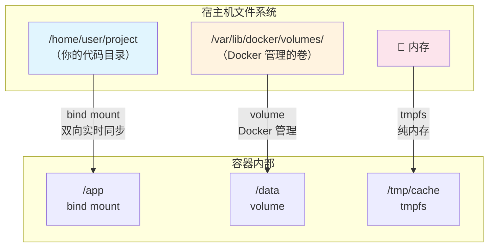
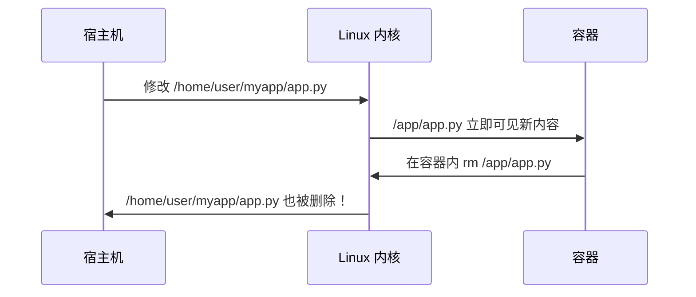
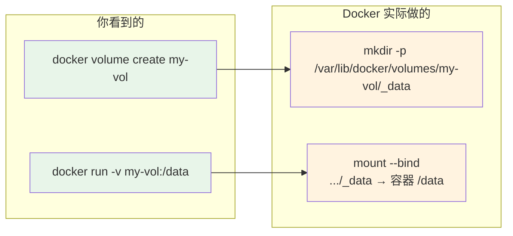
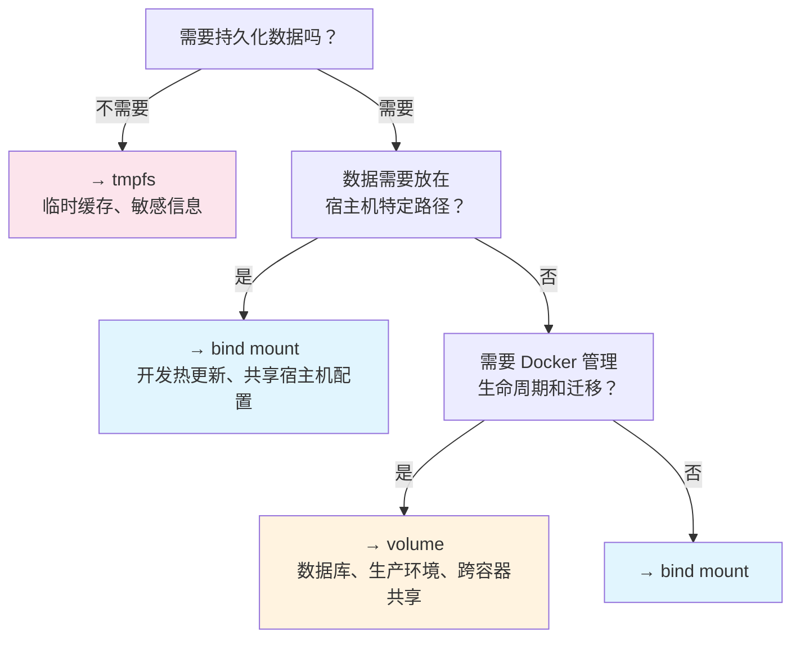

# Docker 挂载操作详解：bind mount、volume、tmpfs 的原理与实战

## 一句话理解

Docker 提供了三种"把外部数据塞进容器"的方式——**bind mount**（宿主机目录直接映射）、**volume**（Docker 管理的独立存储）、**tmpfs**（纯内存临时存储）。它们的本质都是 Linux 内核的 `mount` 系统调用，只是**谁管理生命周期、数据存在哪、性能特征**不同。理解这三种挂载，你就掌握了容器数据管理的全部。

> 如果你能记住：**bind mount = 宿主机路径 ↔ 容器路径（你管）**，**volume = Docker 管的一块存储 ↔ 容器路径（Docker 管）**，**tmpfs = 内存 ↔ 容器路径（关机就丢）**，Docker 挂载就没有秘密了。

## 先来一张全景图



## 一、三种挂载方式速览

用一个 `docker run` 命令把三种挂载全用上：

```bash
docker run -d --name demo \
  # 1️⃣ bind mount：宿主机目录 → 容器目录
  --mount type=bind,source=/home/user/myapp,target=/app \
  # 2️⃣ volume：Docker 管理的卷 → 容器目录
  --mount type=volume,source=my-data,target=/data \
  # 3️⃣ tmpfs：内存 → 容器目录
  --mount type=tmpfs,target=/tmp/cache \
  nginx:latest
```

三种挂载的核心区别：

| 特性 | bind mount | volume | tmpfs |
|------|-----------|--------|-------|
| **数据存在哪** | 宿主机任意路径 | `/var/lib/docker/volumes/` | 内存 |
| **谁管理生命周期** | 你手动管理 | Docker 管理 | 内核管理 |
| **容器删除后数据** | 保留（在宿主机上） | 保留（除非 `docker rm -v`） | 消失 |
| **能否被多个容器共享** | ✅ 可以 | ✅ 可以（推荐） | ❌ 不行（每个容器独立） |
| **性能** | 宿主机磁盘性能 | 宿主机磁盘性能 | 内存级性能 |
| **可移植性** | 差（依赖宿主机路径） | 好（Docker 抽象） | 好 |
| **适用场景** | 开发时热更新代码 | 数据库持久化、共享配置 | 临时缓存、敏感信息 |

## 二、bind mount：宿主机目录"直通"容器

### 2.1 原理

bind mount 的本质就是 Linux 的 `mount --bind` 系统调用。Docker 在创建容器时，在容器的 mount namespace 中执行：

```bash
# Docker 底层做的事情，等价于这条命令：
mount --bind /home/user/myapp /var/lib/docker/overlay2/xxx/merged/app
```

**关键点**：这不是"复制"，而是**同一个 inode 的两个入口**。容器内外看到的是**同一份数据**，任何一方的修改立即对另一方可见。



> ⚠️ **危险提示**：bind mount 是双向的！容器内 `rm -rf /app/*` 会真的删掉你宿主机上的文件。

### 2.2 实战：开发时热更新代码

这是 bind mount 最经典的场景——你在宿主机上改代码，容器里立刻生效：

```bash
# 假设你的项目目录结构：
# ~/myapp/
#   ├── app.py
#   ├── requirements.txt
#   └── templates/

# 启动开发容器，把代码目录挂进去
docker run -d --name dev-app \
  --mount type=bind,source=$HOME/myapp,target=/app \
  --workdir /app \
  python:3.11 \
  python app.py

# 在宿主机上修改代码
echo 'print("hot reload!")' >> ~/myapp/app.py

# 容器里立刻能看到
docker exec dev-app cat /app/app.py
# 输出中包含: print("hot reload!")
```

#### bind mount 的只读模式

如果你不想让容器修改宿主机文件，加上 `readonly`：

```bash
docker run -d --name safe-app \
  --mount type=bind,source=$HOME/myapp,target=/app,readonly \
  python:3.11

# 容器内尝试写入会失败
docker exec safe-app touch /app/new-file.txt
# touch: cannot touch '/app/new-file.txt': Read-only file system
```

### 2.3 bind mount 的"权限地狱"

bind mount 最常见的问题是**文件权限不匹配**。容器内的 UID/GID 和宿主机可能完全不同：

```bash
# 宿主机上，你的用户是 uid=1000
ls -ln ~/myapp/app.py
# -rw-r--r-- 1 1000 1000 1234 Jul 10 10:00 app.py

# 容器里，默认以 root (uid=0) 运行
docker run --rm --mount type=bind,source=$HOME/myapp,target=/app alpine id
# uid=0(root) gid=0(root) — 但访问 uid=1000 的文件一般没问题（root 能力）

# 但如果容器以非 root 用户运行（比如 nginx 用 uid=101）：
docker run --rm --user 101 \
  --mount type=bind,source=$HOME/myapp,target=/app \
  alpine cat /app/app.py
# cat: can't open '/app/app.py': Permission denied  ← 炸了！
```

**解决方案**：

```bash
# 方案 1：让容器用户匹配宿主机的 uid
docker run --user $(id -u):$(id -g) ...

# 方案 2：在 Dockerfile 中创建匹配的用户
# RUN addgroup --gid 1000 appuser && adduser --uid 1000 --gid 1000 appuser

# 方案 3：放宽文件权限（不推荐，但快速）
chmod 666 ~/myapp/app.py
```

### 2.4 bind mount 的一个坑：挂载会"盖住"镜像原有的文件

```bash
# 镜像里 /app 本来有一个 config.json
docker run --rm alpine sh -c 'mkdir -p /app && echo "original" > /app/config.json && cat /app/config.json'
# 输出: original

# 如果你 bind mount 一个空目录到 /app：
mkdir /tmp/empty-dir
docker run --rm \
  --mount type=bind,source=/tmp/empty-dir,target=/app \
  alpine ls /app/
# 输出为空！镜像里原来的 config.json 被"盖住"了
```

> 这就是 mount 的"遮蔽"特性——和 Linux `mount` 命令的行为完全一致。挂载后，原目录的内容被暂时隐藏，`umount` 后恢复。

## 三、volume：Docker 帮你管存储

### 3.1 原理

Volume 是 Docker 提供的一层抽象——你不需要关心数据存在宿主机的哪个角落，Docker 帮你在 `/var/lib/docker/volumes/<卷名>/_data/` 下创建一个目录来存数据。

```bash
# 创建一个 volume
docker volume create my-vol

# Docker 在背后做的事：
# mkdir -p /var/lib/docker/volumes/my-vol/_data

# 启动容器时，Docker 做的是：
# mount --bind /var/lib/docker/volumes/my-vol/_data \
#        /var/lib/docker/overlay2/xxx/merged/app/data
```

**本质还是 bind mount！** volume 只是帮你管理了宿主机上的源路径，你不需要手动指定。这也意味着 volume 的性能和宿主机磁盘性能一致。



### 3.2 为什么用 volume 而不是 bind mount？

| 场景 | 用 bind mount | 用 volume |
|------|--------------|-----------|
| 开发时改代码热更新 | ✅ | ❌（路径不直观） |
| 数据库持久化（MySQL、Postgres） | ❌ | ✅ |
| 跨容器共享配置 | ❌ | ✅ |
| 需要 Docker 管理生命周期 | ❌ | ✅ |
| 生产环境部署 | ❌ | ✅ |
| 宿主机路径不确定/不可移植 | ❌ | ✅ |

Volume 的核心优势是**可移植**：你不需要知道宿主机上 `/var/lib/docker/volumes/` 的路径，所有操作通过 `docker volume` 命令完成。

### 3.3 实战：用 volume 持久化数据库

```bash
# 创建 PostgreSQL 数据库，数据用 volume 持久化
docker run -d --name my-postgres \
  --mount type=volume,source=pg-data,target=/var/lib/postgresql/data \
  -e POSTGRES_PASSWORD=secret \
  postgres:16

# 创建一张表，插入数据
docker exec my-postgres psql -U postgres -c "
  CREATE TABLE users (id SERIAL PRIMARY KEY, name TEXT);
  INSERT INTO users (name) VALUES ('Alice'), ('Bob');
  SELECT * FROM users;
"
#  id | name
#  ----+-------
#   1 | Alice
#   2 | Bob

# 删除容器
docker rm -f my-postgres

# 重新创建容器，挂载同一个 volume
docker run -d --name my-postgres-2 \
  --mount type=volume,source=pg-data,target=/var/lib/postgresql/data \
  -e POSTGRES_PASSWORD=secret \
  postgres:16

# 数据还在！
docker exec my-postgres-2 psql -U postgres -c "SELECT * FROM users;"
#  id | name
#  ----+-------
#   1 | Alice
#   2 | Bob
```

这就是 volume 最核心的价值：**容器的生命周期和数据生命周期解耦**。

### 3.4 volume 的常用操作

```bash
# 查看所有 volume
docker volume ls

# 查看 volume 详情（找到宿主机上的实际路径）
docker volume inspect pg-data
# 输出中包含：
# "Mountpoint": "/var/lib/docker/volumes/pg-data/_data"

# 备份 volume 数据
docker run --rm \
  --mount type=volume,source=pg-data,target=/data \
  --mount type=bind,source=$(pwd),target=/backup \
  alpine tar czf /backup/pg-data-backup.tar.gz -C /data .

# 恢复 volume 数据
docker run --rm \
  --mount type=volume,source=pg-data-restore,target=/data \
  --mount type=bind,source=$(pwd),target=/backup \
  alpine tar xzf /backup/pg-data-backup.tar.gz -C /data

# 删除 volume（删除前确保没有容器在使用）
docker volume rm pg-data

# 清理所有未被使用的 volume
docker volume prune
```

### 3.5 volume 的"首次填充"机制

这是一个很巧妙的设计：当你把一个**空的** volume 挂载到容器中某个**非空**目录时，Docker 会自动把镜像里该目录的内容**复制到 volume 中**：

```bash
# nginx 镜像的 /usr/share/nginx/html/ 下有默认的 index.html
# 创建一个空的 volume 并挂载到该目录
docker volume create nginx-html

docker run -d --name web \
  --mount type=volume,source=nginx-html,target=/usr/share/nginx/html \
  nginx:latest

# volume 里自动有了 nginx 默认的 html 文件！
docker run --rm \
  --mount type=volume,source=nginx-html,target=/data \
  alpine ls /data/
# 输出: 50x.html  index.html  ← 从镜像自动复制过来的
```

> ⚠️ **注意**：这个"填充"只在 volume **首次创建且为空**时发生。如果 volume 已经有数据了，就不会覆盖。bind mount **没有**这个特性——bind mount 直接盖住，不管你镜像里原来有什么。

## 四、tmpfs：把内存当磁盘用

### 4.1 原理

tmpfs mount 直接在内核内存中创建一个文件系统，完全不碰磁盘：

```bash
# Docker 底层等价于：
mount -t tmpfs -o size=64M tmpfs /var/lib/docker/overlay2/xxx/merged/tmp/cache
```

**两个核心特征**：
1. **速度极快**——纯内存读写，没有磁盘 I/O
2. **断电即丢**——容器停止或重启后，数据消失

### 4.2 实战：缓存敏感信息

```bash
# 场景：应用需要在 /tmp/secrets 放临时 API token
# 用 tmpfs 确保容器重启后 token 自动清除
docker run -d --name api-server \
  --mount type=tmpfs,target=/tmp/secrets,tmpfs-size=65536000 \
  my-api:latest

# 写入 token
docker exec api-server sh -c 'echo "sk-abc123..." > /tmp/secrets/token'

# 重启容器
docker restart api-server

# token 消失了！
docker exec api-server cat /tmp/secrets/token
# cat: can't open '/tmp/secrets/token': No such file or directory
```

#### tmpfs 的常用选项

```bash
docker run --rm \
  --mount type=tmpfs,target=/tmp/cache,tmpfs-size=128M,tmpfs-mode=1777 \
  alpine sh -c 'df -h /tmp/cache && ls -ld /tmp/cache'
# Filesystem      Size  Used Avail Use% Mounted on
# tmpfs           128M     0  128M   0% /tmp/cache
# drwxrwxrwt    2 root  root    40 Jul 10 10:00 /tmp/cache
```

选项说明：
- `tmpfs-size`：限制最大内存使用量（字节），不加限制可能导致 OOM
- `tmpfs-mode`：文件权限模式，`1777` = 所有人可读写 + sticky bit（类似 `/tmp`）

### 4.3 tmpfs vs volume 速度对比

```bash
# 创建一个 volume
docker volume create speed-test-vol

# 对比写入 1000 个小文件的速度
echo "=== volume（磁盘） ==="
time docker run --rm \
  --mount type=volume,source=speed-test-vol,target=/data \
  alpine sh -c 'for i in $(seq 1 1000); do echo "hello" > /data/file-$i.txt; done'

echo "=== tmpfs（内存） ==="
time docker run --rm \
  --mount type=tmpfs,target=/data \
  alpine sh -c 'for i in $(seq 1 1000); do echo "hello" > /data/file-$i.txt; done'

# tmpfs 通常快 10-100 倍（取决于磁盘类型）
```

## 五、三种挂载的底层对比

用 `findmnt` 或 `/proc/mounts` 可以看到 docker 创建的真实挂载条目：

```bash
# 启动一个用了三种挂载的容器
docker run -d --name mount-demo \
  --mount type=bind,source=/tmp/host-dir,target=/app/bind \
  --mount type=volume,source=demo-vol,target=/app/vol \
  --mount type=tmpfs,target=/app/tmp \
  alpine sleep 3600

# 查看容器在宿主机上的 mount 条目
grep -E 'bind|vol|tmpfs' /proc/mounts | grep docker | head -5
```

典型输出（简化）：

```
# bind mount 条目：
/dev/sda1 on /var/lib/docker/overlay2/xxx/merged/app/bind type ext4 (rw,relatime)
#                      ↑ 还是原来的文件系统类型（ext4/xfs 等）

# volume 条目：
/dev/sda1 on /var/lib/docker/overlay2/xxx/merged/app/vol type ext4 (rw,relatime)
#                      ↑ 同样是 bind mount，源在 /var/lib/docker/volumes/

# tmpfs 条目：
tmpfs on /var/lib/docker/overlay2/xxx/merged/app/tmp type tmpfs (rw,relatime,size=65536k)
```

> **关键发现**：bind mount 和 volume 在内核层面**都是 bind mount**，只是源路径的管理方式不同。tmpfs 则是独立的 tmpfs 文件系统类型。

## 六、`-v` 和 `--mount` 两种语法

Docker 提供了两种挂载语法：

```bash
# 旧语法：-v（简洁但有歧义）
docker run -v /host/path:/container/path:ro    # bind mount
docker run -v my-vol:/container/path            # volume（名字里没有 /，Docker 认为是 volume）
docker run -v /container/path                   # 匿名 volume

# 新语法：--mount（显式、推荐）
docker run --mount type=bind,source=/host/path,target=/container/path,readonly
docker run --mount type=volume,source=my-vol,target=/container/path
docker run --mount type=tmpfs,target=/container/path
```

**推荐用 `--mount`**，原因：
- `-v` 的行为取决于参数格式（有歧义）
- `-v` 对于不存在的 bind mount 源，Docker 会**自动创建目录**（可能导致空目录挂载的"幽灵问题"）
- `--mount` 语法更清晰，不会误用

## 七、常见问题排查

### Q1：容器里写文件报 "Permission denied"

```bash
# 1. 先确认是不是 bind mount 的权限问题
docker inspect my-container | jq '.[0].Mounts'

# 2. 检查宿主机路径的权限
ls -la /host/path/

# 3. 检查容器运行用户
docker exec my-container id

# 4. 如果是 SELinux 导致（CentOS/RHEL），加上 :Z 标签
docker run -v /host/path:/container/path:Z ...
```

### Q2：数据写进 volume 了但不知道在宿主机哪

```bash
# 查看 volume 的实际存储路径
docker volume inspect my-vol | jq '.[0].Mountpoint'
# 输出: "/var/lib/docker/volumes/my-vol/_data"
```

### Q3：容器删了 volume 还在，怎么清理

```bash
# 查看哪些 volume 没有被任何容器使用
docker volume ls -f dangling=true

# 一次性清理
docker volume prune
```

## 八、总结：什么时候用哪种？



| 你的需求 | 推荐方式 |
|---------|---------|
| "我改代码，容器立刻生效" | bind mount |
| "数据库的数据不能丢" | volume |
| "几个容器共享一个配置文件目录" | volume |
| "API token 用完就扔" | tmpfs |
| "容器里生成日志，宿主机要收集" | bind mount |
| "生产环境部署，要能迁移" | volume |
| "读写频繁的临时文件" | tmpfs |

记住三句话：
- **bind mount**：宿主机哪哪哪 ↔ 容器哪哪哪，你说了算
- **volume**：Docker 你帮我管一块存储，挂到这
- **tmpfs**：给我块内存用用，关机就拉倒
