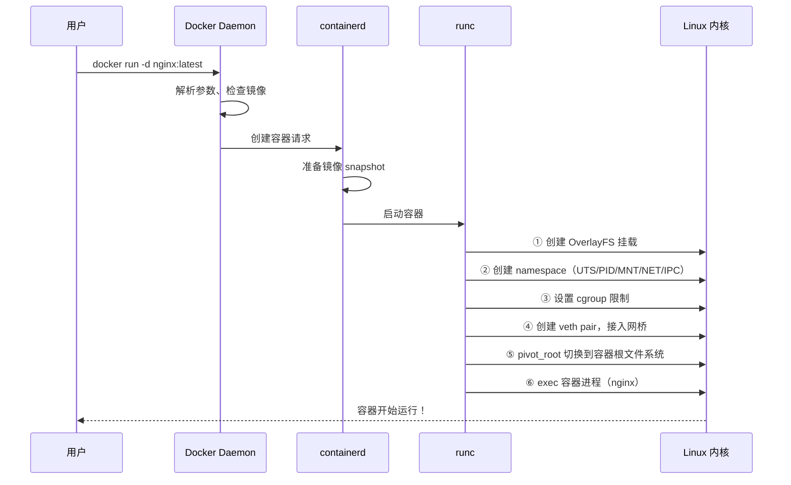
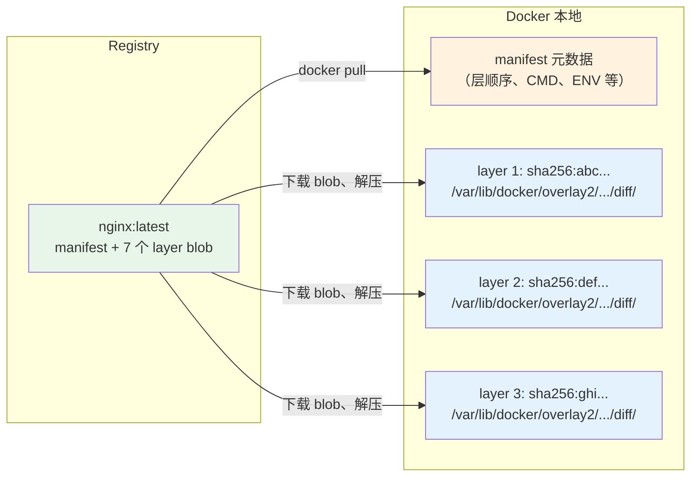
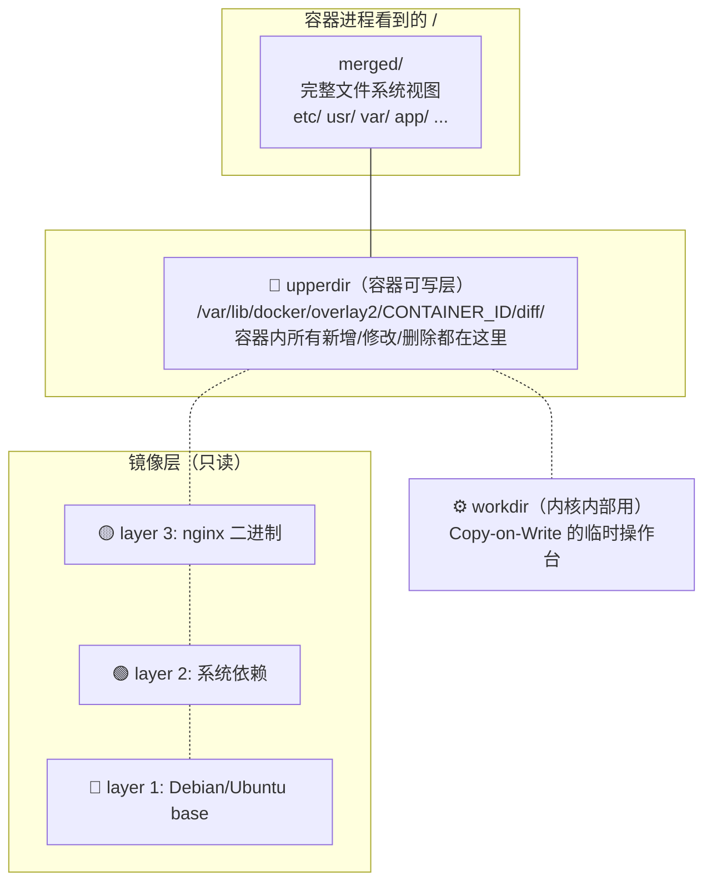
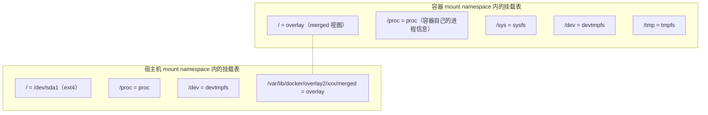
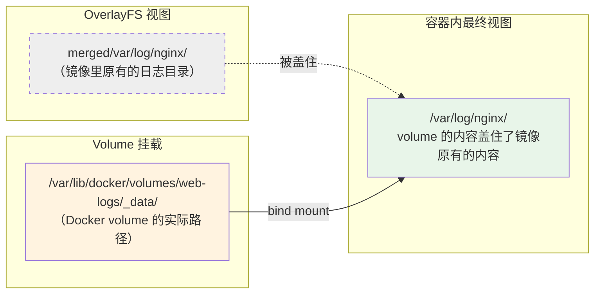
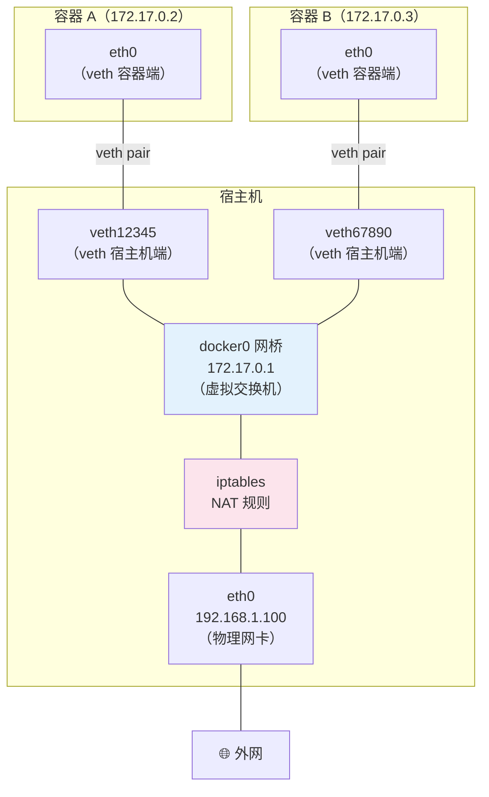
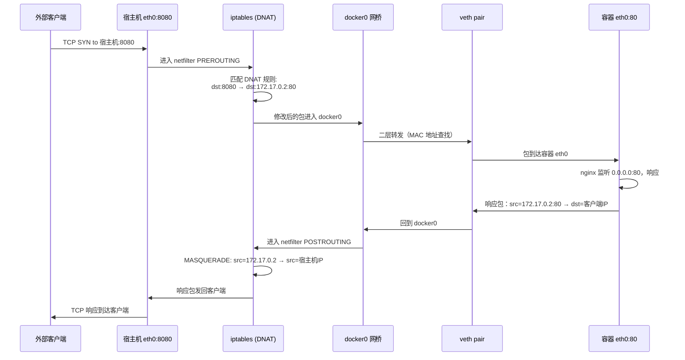

# docker run 背后发生了什么：一次完整的容器启动之旅

## 一句话理解

当你敲下 `docker run -d --name web -p 8080:80 -v /host/data:/data --memory 256m nginx:latest` 时，Docker 在背后做了一连串动作：**拉镜像 → 解包镜像层 → 创建 OverlayFS 联合挂载 → 创建 namespace 隔离 → 设置 cgroup 资源限制 → 创建 veth 网线插到 docker0 网桥 → 配置 iptables NAT 规则 → 挂载用户指定的卷 → pivot_root 切换根文件系统 → 最终执行容器的 ENTRYPOINT/CMD**。整个过程大约在 0.5～2 秒内完成，而背后涉及的内核机制比你想象的要多得多。

> 如果你能理解 `docker run` = **准备文件系统（OverlayFS）→ 创建隔离环境（namespace）→ 设置资源限制（cgroup）→ 接入网络（veth+bridge+NAT）→ 启动进程**，你就彻底搞懂了容器是如何"无中生有"的。

## 先来一张全景图



下面我们把这个流程拆成九个步骤，一步步看 Docker 到底做了什么。

## 第一步：拆解 docker run 命令

先拿一个典型命令来分析，命令行里每一个参数都对应了背后的一组内核操作：

```bash
docker run -d --name web \
  -p 8080:80 \                      # ← 端口映射（iptables DNAT）
  --mount type=bind,src=/host/data,dst=/data \  # ← bind mount
  --mount type=volume,src=web-logs,dst=/var/log/nginx \  # ← volume
  --memory 256m --cpus 1 \          # ← cgroup 资源限制
  --restart always \                # ← Docker 重启策略
  nginx:latest                      # ← 镜像名
```

这个命令展开后，Docker 要做以下事情：

| 参数 | 背后要做的事 | 涉及的内核机制 |
|------|-------------|---------------|
| `nginx:latest` | 拉镜像、解包各层、准备 rootfs | OverlayFS |
| `-p 8080:80` | 创建 veth 网卡、配 iptables NAT | net namespace, iptables |
| `--mount bind` | 在容器 mount namespace 中执行 bind mount | mount namespace, VFS |
| `--mount volume` | 在容器 mount namespace 中执行 bind mount | mount namespace, VFS |
| `--memory 256m` | 写入 cgroup 内存限制文件 | cgroup |
| `--cpus 1` | 写入 cgroup CPU 配额文件 | cgroup |

## 第二步：镜像准备——从 Registry 到本地 snapshot



如果你本地已经有镜像，跳过拉取。Docker daemon 拿到镜像后，主要拿到两样东西：

```bash
# 1. 镜像的 manifest——描述了层的顺序和元数据
docker inspect nginx:latest | jq '.[0].RootFS'
# {
#   "Type": "layers",
#   "Layers": [
#     "sha256:a1b2c3d4...",   ← 第 1 层（最底层，如 Debian base）
#     "sha256:e5f6g7h8...",   ← 第 2 层（如 apt install 的依赖）
#     "sha256:i9j0k1l2...",   ← 第 3 层（如 nginx 二进制）
#     ...
#   ]
# }

# 2. 每一层在磁盘上的实际目录
ls /var/lib/docker/overlay2/
# 每个目录就是一个"层"，里面是该层新增/修改的文件
# a1b2c3d4.../
#   └── diff/    ← 文件系统的"增量"（该层相对于上一层的 diff）
#       ├── etc/
#       ├── usr/
#       └── var/
```

每一层就是一个目录，里面有该层"新增/修改"的文件。这些目录最终会作为 OverlayFS 的 `lowerdir`。

## 第三步：创建容器的 OverlayFS——"叠叠乐"开始

这是 `docker run` 过程中最核心的一步。Docker（通过 containerd/runc）创建四个目录，然后执行一条 mount 命令：

```bash
# Docker 在宿主机上做的实际操作（简化版）：

# 1. 创建容器的专属目录
CONTAINER_ID="abc123..."
mkdir -p /var/lib/docker/overlay2/$CONTAINER_ID/{diff,work,merged}
#                                        diff   = upperdir（容器可写层）
#                                        work   = workdir （OverlayFS 内部工作目录）
#                                        merged = 挂载点  （容器进程看到的 "/"）

# 2. 把镜像的多个只读层叠在一起，加上容器的可写层
mount -t overlay overlay \
  -o lowerdir=/var/lib/docker/overlay2/layer3/diff:\
             /var/lib/docker/overlay2/layer2/diff:\
             /var/lib/docker/overlay2/layer1/diff,\
     upperdir=/var/lib/docker/overlay2/$CONTAINER_ID/diff,\
     workdir=/var/lib/docker/overlay2/$CONTAINER_ID/work \
  /var/lib/docker/overlay2/$CONTAINER_ID/merged
```

用一张图来理解这四层结构：



**此时容器进程还没启动**，但容器的根文件系统已经准备好了——现在你可以在宿主机上直接看到容器的"完整文件系统"：

```bash
# 在宿主机上直接看容器的文件系统！
ls /var/lib/docker/overlay2/$CONTAINER_ID/merged/
# bin/  boot/  dev/  etc/  home/  lib/  ...  ← 和容器里看到的一模一样！

# 你甚至可以在这里直接创建文件
echo "hello from host" > /var/lib/docker/overlay2/$CONTAINER_ID/merged/test.txt

# 容器启动后就能看到这个文件
docker exec web cat /test.txt
# hello from host
```

## 第四步：创建 Mount Namespace——容器文件系统"去宿主机化"

OverlayFS 挂载好了，但还没完。容器的文件系统需要一个**独立干净的挂载表**——不能把宿主机的 `/proc`、`/sys`、`/boot` 等直接暴露给容器。

Docker 通过创建一个新的 **mount namespace**，然后在新 namespace 里重新挂载必要的伪文件系统：

```bash
# 内核操作（由 runc 触发）：

# 1. 创建新的 mount namespace
unshare --mount /bin/bash

# 2. 在新 namespace 里，先确保所有挂载点都是"私有"的
#    （避免容器内的 mount 操作泄露到宿主机）
mount --make-rprivate /

# 3. pivot_root：把容器的根文件系统切换到 OverlayFS 的 merged 目录
#    这是最关键的一步——容器进程的 "/" 从此指向 merged 目录
pivot_root /var/lib/docker/overlay2/$CONTAINER_ID/merged \
           /var/lib/docker/overlay2/$CONTAINER_ID/merged/.pivot

# 4. 在新根文件系统里挂载必要的伪文件系统
mount -t proc  proc  /proc    # 进程信息
mount -t sysfs sysfs /sys     # 设备和内核信息
mount -t tmpfs tmpfs /tmp     # 临时文件
mount -t devtmpfs devtmpfs /dev  # 设备文件
```

**pivot_root vs chroot**：

```
chroot: 只是把进程的 "/" 路径改一下，但进程仍然能看到原来的根文件系统
        （通过 ../../ 可以逃逸）

pivot_root: 真正地"换掉"整个 mount namespace 的根
            （旧根被移到子目录，然后可以 umount 掉，无法逃逸）
```

> Docker 使用 `pivot_root` 而非 `chroot`，这样更加安全，容器进程无法通过 `../../` 逃逸到宿主机文件系统。

此时容器的文件系统可以表示为一张**叠加图**：



**关键**：两个 namespace 的挂载表是**完全独立**的。容器里 `mount` 看到 7 个挂载点，宿主机上 `mount` 看到 40+ 个挂载点，互不干扰。

## 第五步：用户指定的挂载——volume 和 bind mount

OverlayFS 和基础伪文件系统都挂好后，Docker 开始处理用户指定的 `-v` / `--mount` 参数。本质就是在容器的 mount namespace 里追加 bind mount 或 tmpfs mount：

```bash
# --mount type=bind,src=/host/data,dst=/data 的底层操作：
mkdir -p /var/lib/docker/overlay2/$CONTAINER_ID/merged/data
mount --rbind /host/data \
       /var/lib/docker/overlay2/$CONTAINER_ID/merged/data
#  ↑ --rbind 而不是 --bind，确保 /host/data 下的子挂载点也被带进容器

# --mount type=volume,src=web-logs,dst=/var/log/nginx 的底层操作：
# 1. Docker 先找到（或创建）volume 的实际路径
#    volume 的路径在: /var/lib/docker/volumes/web-logs/_data/
# 2. 然后就是一个 bind mount：
mount --rbind /var/lib/docker/volumes/web-logs/_data \
       /var/lib/docker/overlay2/$CONTAINER_ID/merged/var/log/nginx
```

**挂载的叠加顺序**决定了最终视图：

```
容器内进程看到的 /var/log/nginx/：
  ① overlay 的 merged 层中有 /var/log/nginx/ 目录
       ↓ 被盖住！
  ② bind mount: web-logs volume → /var/log/nginx/
       ↓ 最终生效
  ③ 容器内访问 /var/log/nginx/ 实际读写的是 volume 的数据
```



## 第六步：创建网络——veth pair + bridge + iptables NAT

如果说文件系统是容器的"身体"，那网络就是容器的"血管"。Docker 为每个容器创建一套虚拟网络设备：

### 6.1 默认 bridge 模式的工作原理

```bash
# docker run -p 8080:80 nginx 背后的网络操作：

# 1. 创建一对 veth（虚拟网线）
#    veth 总是成对出现：一头插容器，一头插宿主机网桥
#    像一根"虚拟网线"，从这头进去的数据从那头出来
ip link add veth12345 type veth peer name veth12345-c

# 2. veth 的一端放入容器的 net namespace
ip link set veth12345-c netns $CONTAINER_PID
#    容器里看到的就是 eth0

# 3. 给容器里的 veth 配置 IP 和路由
nsenter -t $CONTAINER_PID -n ip addr add 172.17.0.2/16 dev eth0
nsenter -t $CONTAINER_PID -n ip link set eth0 up
nsenter -t $CONTAINER_PID -n ip route add default via 172.17.0.1

# 4. veth 的另一端插到 docker0 网桥
ip link set veth12345 master docker0
ip link set veth12345 up

# 5. 配置 iptables DNAT 规则（端口映射的核心）
#    当宿主机的 8080 端口收到流量 → 转发给容器的 80 端口
iptables -t nat -A DOCKER ! -i docker0 \
  -p tcp --dport 8080 -j DNAT --to-destination 172.17.0.2:80

# 6. 配置 SNAT/MASQUERADE（让容器能访问外网）
#    容器发出的包，源 IP 换成宿主机的 IP
iptables -t nat -A POSTROUTING -s 172.17.0.0/16 ! -o docker0 \
  -j MASQUERADE
```

用图来理解 veth pair + bridge 的拓扑：



### 6.2 实验：用宿主机命令看到容器的网络

```bash
# 启动一个带端口映射的容器
docker run -d --name web -p 8080:80 nginx:latest

# 1. 查看宿主机上的 veth
ip link show | grep veth
# vetha1b2c3d@if12: <BROADCAST,MULTICAST,UP> ...
# ↑ 一头在宿主机，一头在容器里（@if12 指向对端）

# 2. 查看 docker0 网桥上的设备
brctl show docker0
# bridge name   bridge id           STP enabled   interfaces
# docker0       8000.0242abc...     no            vetha1b2c3d

# 3. 在宿主机上查看 iptables NAT 规则
iptables -t nat -L DOCKER -n
# Chain DOCKER (1 references)
# target  prot opt source      destination
# DNAT    tcp  --  0.0.0.0/0  0.0.0.0/0  tcp dpt:8080 to:172.17.0.2:80
# ↑ 所有到宿主机 8080 端口的 TCP 流量，全部 DNAT 到容器的 80 端口

# 4. 直接 Ping 容器的 IP（从宿主机）
ping 172.17.0.2
# PING 172.17.0.2 (172.17.0.2) 56(84) bytes of data.
# 64 bytes from 172.17.0.2: icmp_seq=1 ttl=64 time=0.05 ms
# ↑ 宿主机可以直接访问容器的内网 IP

# 5. 进入容器的 net namespace 看它的视角
CONTAINER_PID=$(docker inspect web --format '{{.State.Pid}}')
nsenter -t $CONTAINER_PID -n ip addr
# 1: lo: <LOOPBACK,UP,LOWER_UP> ...
# 12: eth0@if13: <BROADCAST,MULTICAST,UP,LOWER_UP> ...
#     inet 172.17.0.2/16 brd 172.17.255.255 scope global eth0
# ↑ 容器里只看到 lo 和 eth0，看不到宿主机的网络接口
```

### 6.3 一个 HTTP 请求的完整路径

以 `curl http://宿主机IP:8080` 为例，追踪一个请求是如何到达容器内 nginx 的：



## 第七步：Namespace 全家桶——六种隔离齐上阵

Docker 不只是隔离文件系统和网络，它用 Linux namespace 实现了**六维隔离**：

| Namespace 类型 | 隔离什么 | 容器里的效果 | 如果没有会怎样 |
|---------------|---------|------------|-------------|
| **Mount** | 挂载点列表 | 容器里 `df` 看到的和宿主机完全不同 | 容器能访问宿主机所有文件系统 |
| **PID** | 进程编号空间 | 容器里 nginx 的 PID=1，宿主机上 PID=12345 | 容器里 `ps` 能看到宿主机所有进程 |
| **Network** | 网络接口和路由 | 容器里 `ip addr` 只有 lo 和 eth0 | 容器能直接使用宿主机网络，端口冲突 |
| **UTS** | 主机名和域名 | 容器里 `hostname` = 容器 ID | 容器改 hostname 会影响宿主机 |
| **IPC** | 进程间通信（信号量、共享内存） | 容器里的共享内存与宿主机隔离 | 容器的共享内存可能被其他容器/宿主机读取 |
| **User** | 用户和组 ID 映射 | 容器里的 root(uid=0) 可映射为宿主机的 uid=1000 | 容器里 root 就是宿主机 root，极度危险 |

### 7.1 实验：查看容器的 namespace

```bash
# 启动一个容器
docker run -d --name ns-demo nginx:latest

# 拿到容器的 PID
PID=$(docker inspect ns-demo --format '{{.State.Pid}}')

# 查看该进程属于哪些 namespace
ls -la /proc/$PID/ns/
# 输出：
# lrwxrwxrwx cgroup -> 'cgroup:[4026531835]'
# lrwxrwxrwx ipc    -> 'ipc:[4026532778]'     ← IPC namespace
# lrwxrwxrwx mnt    -> 'mnt:[4026532776]'     ← Mount namespace
# lrwxrwxrwx net    -> 'net:[4026532781]'     ← Network namespace
# lrwxrwxrwx pid    -> 'pid:[4026532779]'     ← PID namespace
# lrwxrwxrwx uts    -> 'uts:[4026532777]'     ← UTS namespace
# ...
# [] 里的数字是 namespace 的 inode 号，相同编号 = 同一 namespace

# 对比：宿主机上某个普通进程的 namespace
ls -la /proc/1/ns/
# 注意括号里的 inode 号——和容器的完全不同！
# 说明容器在独立的 namespace 中运行
```

### 7.2 实验：nsenter 进入容器的各种 namespace

```bash
# 进入容器的 PID namespace，看容器里的进程
nsenter -t $PID -p ps aux
# PID   USER     TIME  COMMAND
#    1  root      0:00 nginx: master process nginx -g daemon off;
#    7  nginx     0:00 nginx: worker process
# ↑ 容器里 nginx master 是 PID 1！但在宿主机上是 $PID

# 进入容器的 UTS namespace，看主机名
nsenter -t $PID -u hostname
# ns-demo  ← 容器的主机名

# 进入容器的 network namespace，看网络
nsenter -t $PID -n ip addr
# 只有 lo 和 eth0 ← 看不到宿主机网卡
```

### 7.3 实验：不同容器的 namespace 共享

Docker 还支持让多个容器**共享同一个 namespace**，这在 K8s Pod 中是核心机制：

```bash
# 启动一个"基础"容器
docker run -d --name base nginx:latest

# 启动第二个容器，共享 base 的网络 namespace
docker run -d --name shared-net \
  --network container:base \
  alpine sleep 3600

# 验证：两个容器看到的是同一个网络接口
docker exec base ip addr
# eth0@...: 172.17.0.2/16

docker exec shared-net ip addr
# eth0@...: 172.17.0.2/16  ← 同一个 IP！同一个网卡！
# 它们共享了 net namespace
```

> K8s 的 Pod 就是这个原理：Pod 里的所有容器共享 net namespace（以及 IPC namespace），所以它们可以通过 `localhost` 互相通信。

## 第八步：Cgroup——给容器"戴镣铐"

namespace 解决了"能看到什么"（隔离），cgroup 解决"能用多少"（限制）。Docker 为每个容器创建一组 cgroup 控制器：

```bash
# docker run --memory 256m --cpus 1 nginx 背后的 cgroup 操作：

# 1. 创建容器的 cgroup 目录
CGROUP_PATH="/sys/fs/cgroup/system.slice/docker-$CONTAINER_ID.scope"
mkdir -p $CGROUP_PATH

# 2. 设置内存限制（memory cgroup）
echo "268435456" > $CGROUP_PATH/memory.max        # 256MB
echo "268435456" > $CGROUP_PATH/memory.high       # 软限制

# 3. 设置 CPU 限制（cpu cgroup）
echo "100000" > $CGROUP_PATH/cpu.max              # 1 个 CPU 核心
#       ↑ 100000 微秒 / 100000 微秒周期 = 1 个完整 CPU

# 4. 把容器进程的 PID 写入 cgroup.procs
echo $CONTAINER_PID > $CGROUP_PATH/cgroup.procs
```

**cgroup v2 的主要控制器**：

| 控制器 | 文件路径 | Docker 参数 | 作用 |
|--------|---------|------------|------|
| `memory` | `memory.max` | `--memory 256m` | 硬限制，超限进程被 OOM kill |
| `memory` | `memory.high` | — | 软限制，超限触发内存回收 |
| `cpu` | `cpu.max` | `--cpus 1.5` | CPU 使用上限 |
| `cpu` | `cpu.weight` | `--cpu-shares` | CPU 权重（竞争时按比例分配） |
| `io` | `io.max` | `--blkio-weight` | 磁盘 IO 限制 |
| `pids` | `pids.max` | `--pids-limit 100` | 最大进程数 |

### 实验：查看容器的 cgroup 设置

```bash
# 启动一个有限制的容器
docker run -d --name cg-demo \
  --memory 256m --cpus 1 \
  nginx:latest

PID=$(docker inspect cg-demo --format '{{.State.Pid}}')

# 找到容器进程所在的 cgroup 路径
cat /proc/$PID/cgroup
# 0::/system.slice/docker-abc123...scope

# 查看内存限制
cat /sys/fs/cgroup/system.slice/docker-abc123...scope/memory.max
# 268435456  ← 256MB

# 查看 CPU 限制
cat /sys/fs/cgroup/system.slice/docker-abc123...scope/cpu.max
# 100000 100000  ← 每 100ms 周期内最多用 100ms = 1 个 CPU

# 尝试在容器内突破内存限制
docker exec cg-demo sh -c \
  "dd if=/dev/zero of=/dev/null bs=1G count=10 2>&1 & sleep 1"
# 容器会被 OOM kill，状态变为 Exited (137)
```

## 第九步：启动进程——exec 容器入口

一切准备就绪，最后一步：启动容器的主进程。

```bash
# runc 最后的操作（简化）：
# 在容器的所有 namespace 中，执行镜像的 ENTRYPOINT/CMD

# 本质上等价于：
nsenter --all -t $CONTAINER_PID \
  chroot /var/lib/docker/overlay2/$CONTAINER_ID/merged \
  /usr/sbin/nginx -g 'daemon off;'
```

这个进程就是容器的"灵魂"——它在容器内 PID=1，宿主机上一个普通 PID。**进程退出，容器就停止。**

```bash
# 查看 nginx 镜像的默认启动命令
docker inspect nginx:latest | jq '.[0].Config.Cmd'
# ["nginx", "-g", "daemon off;"]
#  ↑ 这就是容器启动后 PID=1 进程的命令

# Docker 会把 docker run 后面你跟的参数附加到 CMD 后面
docker run nginx:latest echo "hello"
# 实际执行：nginx -g 'daemon off;' echo "hello"
# 但会被 ENTRYPOINT 覆盖
```

## 完整流程总结：从 docker run 到容器运行

把以上九个步骤串起来，就是一次完整的 `docker run` 之旅：

```mermaid
graph TD
    A["🟢 docker run -d --name web -p 8080:80 -v /data:/data --memory 256m nginx:latest"] --> B

    B["📦 检查本地镜像"] -->|本地有| D
    B -->|本地没有| C["📥 从 Registry 拉镜像<br/>下载 manifest + 各层 blob"]
    C --> D

    D["📂 准备 rootfs"] --> D1["解包镜像层到 /var/lib/docker/overlay2/<layer>/diff/"]
    D1 --> D2["创建容器的 upperdir 和 workdir"]
    D2 --> D3["mount -t overlay: lowerdir + upperdir → merged"]

    D3 --> E["🔒 创建 Namespace"]
    E --> E1["unshare: 创建 UTS/PID/MNT/NET/IPC namespace"]
    E1 --> E2["在新 MNT namespace 中 pivot_root 到 merged"]
    E2 --> E3["挂载 /proc, /sys, /dev, /tmp 等伪文件系统"]

    E3 --> F["💾 处理用户挂载"]
    F --> F1["bind mount: /host/data → merged/data"]
    F1 --> F2["bind mount: volume web-logs → merged/var/log/nginx"]

    F2 --> G["🌐 配置网络"]
    G --> G1["创建 veth pair"]
    G1 --> G2["veth 一端移入容器 NET namespace → eth0"]
    G2 --> G3["veth 另一端接入 docker0 网桥"]
    G3 --> G4["配置 iptables DNAT/SNAT 规则"]

    G4 --> H["⚖️ 设置 Cgroup"]
    H --> H1["创建 cgroup 目录"]
    H1 --> H2["写入 memory.max, cpu.max 等限制"]
    H2 --> H3["将容器 PID 写入 cgroup.procs"]

    H3 --> I["🚀 启动进程"]
    I --> I1["exec 容器的 ENTRYPOINT/CMD"]
    I1 --> I2["容器进程在宿主机上以普通 PID 运行"]

    style A fill:#e8f5e9
    style I2 fill:#c8e6c9
```



## 用 strace 亲眼看看 docker run 做了什么

纸上谈兵不过瘾，我们直接追踪 `runc` 的系统调用来验证以上每一步：

```bash
# 在一个终端里启动容器，用 strace 追踪 runc
strace -f -e trace=mount,unshare,pivot_root,clone,execve \
  docker run --rm alpine echo "hello" 2>&1 | head -30

# 你会看到类似这样的系统调用序列：
#
# unshare(CLONE_NEWNS|CLONE_NEWUTS|CLONE_NEWIPC|
#         CLONE_NEWPID|CLONE_NEWNET)      = 0     ← 创建 namespace
# mount("overlay", ".../merged", "overlay", MS_RELATIME,
#       "lowerdir=...,upperdir=...,workdir=...") = 0  ← OverlayFS 挂载
# mount("proc", ".../merged/proc", "proc", ...) = 0    ← 挂载 /proc
# mount("tmpfs", ".../merged/dev", "tmpfs", ...) = 0   ← 挂载 /dev
# pivot_root(".../merged", ".../merged/.pivot") = 0    ← 切换根文件系统
# execve("/bin/echo", ["echo", "hello"], ...)  = 0     ← 执行容器命令
```

## 常见问题：为什么 docker run 有时候特别慢？

了解了完整流程后，就能分析启动慢的原因：

| 现象 | 可能原因 | 对应步骤 |
|------|---------|---------|
| 卡在拉镜像 | Registry 网络慢、镜像层大 | 第二步 |
| 卡在 "creating container" | 磁盘 IO 瓶颈（解压层、创建 overlay） | 第三、四步 |
| 卡在端口映射 | 端口已被占用 | 第六步 |
| 立即 Exited | ENTRYPOINT/CMD 执行完就退出了 | 第九步 |
| OOMKilled | 内存限制太小，启动时就超了 | 第八步 |

## 一句话总结

`docker run` 没有黑魔法——它是一套精心编排的 Linux 内核功能调用序列：**overlay mount 搭文件系统 → namespace 建隔离环境 → veth+bridge+NAT 接网络 → cgroup 限制资源 → exec 启动进程**。每一步你都能在宿主机上用标准 Linux 命令（`ls /proc/$PID/ns/`、`cat /proc/mounts`、`iptables -t nat -L`、`cat /sys/fs/cgroup/...`）亲眼验证。所谓"容器"，不过是这些内核机制的一个优雅包装。
