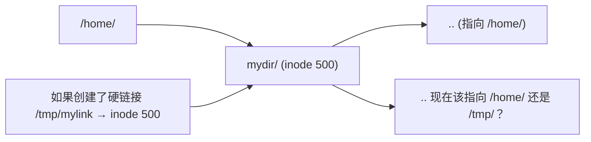

# Linux 软链接与硬链接：从 inode 层面理解它们的本质区别

## 一句话理解

**硬链接是同一个 inode 的多个"名字"**（像一个人有两张身份证），**软链接是一个指向目标路径的"路标"**（像路牌上写着"XX 路向前 500 米"）。硬链接的文件和原文件在内核层面完全平等、无法区分谁是"原本"；软链接则是一个独立的特殊文件，内容是目标路径字符串。

> 删除"原文件"后，硬链接指向的数据还在（因为 inode 引用计数没归零），而软链接立刻变成"死链接"（路牌指向了一条不存在的路）。

## 先来一个实验：把三种情况放在一起对比

```bash
# 准备工作：创建一个原始文件和目录
mkdir /tmp/link-lab && cd /tmp/link-lab
echo "I am the original content" > original.txt
mkdir subdir

# 创建硬链接 —— 同一个 inode 的第二个名字
ln original.txt hardlink.txt

# 创建软链接 —— 一个指向路径的特殊文件
ln -s original.txt symlink.txt
ln -s /tmp/link-lab/original.txt symlink-absolute.txt   # 绝对路径的软链接
ln -s ../link-lab/original.txt subdir/symlink-relative.txt  # 相对路径的软链接

# ===== 观察 1：看看它们长什么样 =====
ls -li
# 输出示例：
# 1048583 -rw-r--r-- 2 user user 27 Jun 26 10:00 hardlink.txt
# 1048583 -rw-r--r-- 2 user user 27 Jun 26 10:00 original.txt
#  ↑↑↑↑↑↑↑                                   ↑
#  同一个 inode 号！                       链接计数 = 2
#
# 1048584 lrwxrwxrwx 1 user user 12 Jun 26 10:00 symlink.txt -> original.txt
#           ↑                              ↑
#      文件类型是 l (link)              文件大小是 12 字节（正好是 "original.txt" 的长度！）
#                                      软链接文件的内容就是目标路径字符串

# ===== 观察 2：cat 都能读取内容 =====
cat hardlink.txt   # I am the original content
cat symlink.txt    # I am the original content  ← 内核自动帮你"跳转"了

# ===== 观察 3：修改任意一边，另一边同步变化 =====
echo "appended line" >> original.txt
cat hardlink.txt   # I am the original content\nappended line  ← 同步了！
cat symlink.txt    # I am the original content\nappended line  ← 同步了！（通过路标找到的）

# ===== 观察 4：删除"原文件"后的区别（关键！）=====
rm original.txt

cat hardlink.txt
# I am the original content
# appended line
# ↑ 硬链接还能读！因为 inode 还在，数据还在，只是少了一个名字

cat symlink.txt
# cat: symlink.txt: No such file or directory
# ↑ 软链接废了！路标指向的路径已不存在 —— 这叫 "悬空链接"（dangling symlink）

# 看看硬链接的 inode 信息
ls -li hardlink.txt
# 1048583 -rw-r--r-- 1 user user 43 Jun 26 10:05 hardlink.txt
#                         ↑ 链接计数从 2 变成了 1
# inode 1048583 还活着，数据完好

# 看看软链接的残留
ls -l symlink.txt
# lrwxrwxrwx 1 user user 12 Jun 26 10:00 symlink.txt -> original.txt
# 软链接文件本身还在，但目标没了，内核会高亮显示（通常是红底闪烁）
```

这个实验已经揭示了硬链接和软链接最根本的区别。下面我们深入内核视角来理解为什么。

## 一、从 inode 说起：文件名不是文件的"本质"

理解链接之前，必须先理解一个关键事实：**在 Linux 上，文件名不是文件的"身份证"，inode 才是。**

```
磁盘上的真实结构：

  ┌──────────────────┐     ┌─────────────────────────────┐
  │  目录项 (dentry)  │     │         inode                │
  │                   │     │                             │
  │  文件名: "a.txt"  │────→│ inode 号: 1048583           │
  │  inode 号: 1048583│     │ 文件大小: 27 bytes           │
  └──────────────────┘     │ 数据块指针: → [磁盘块 8821]   │
                           │ 链接计数: 2                   │
  ┌──────────────────┐     │ 权限: rw-r--r--               │
  │  目录项 (dentry)  │     │ 所有者: user                  │
  │                   │     └─────────────────────────────┘
  │  文件名: "b.txt"  │────↗
  │  inode 号: 1048583│    同一个 inode，两个文件名 —— 这就是硬链接！
  └──────────────────┘
```

关键结论：
- **文件内容存在磁盘数据块中**，inode 记录"数据块在哪里"
- **文件名存在目录里**，只是 inode 号的"别名"
- **硬链接就是让一个 inode 有多个文件名**，删除文件只是删了一个目录项，inode 的链接计数减 1；减到 0 才真正释放数据块
- **软链接本身也是一个 inode**，但它的数据块存的不是文件内容，而是"目标路径"这个字符串

> 详细 inode 原理见 [Linux inode 详解](/linux/inode/)。

## 二、硬链接的规则和限制

### 2.1 硬链接的"三不"原则

```bash
# 1. 不能跨文件系统
ln /home/user/file.txt /mnt/usb/link.txt
# ln: failed to create hard link '/mnt/usb/link.txt' => '/home/user/file.txt':
# Invalid cross-device link
# 原因：inode 号只在同一个文件系统内唯一，跨文件系统 inode 号可能冲突

# 2. 不能给目录创建硬链接（普通用户）
ln /tmp/mydir /tmp/mydir-link
# ln: /tmp/mydir: hard link not allowed for directory
# 原因：防止形成目录环，让 `find` 和 `rm -rf` 陷入死循环
# 例外：root 在某些文件系统上可以，但极度危险

# 3. 不能链接不存在的文件（废话，硬链接必须先有 inode）
ln nonexistent.txt link.txt
# ln: failed to access 'nonexistent.txt': No such file or directory
```

### 2.2 为什么目录不能硬链接？

这是个经典面试题。用图来解释：



每个目录里都有一个 `..` 指向父目录。如果同一个目录 inode 有两个父目录，`..` 就只能指向其中一个，另一个就成了"假父目录"。这会导致文件系统遍历（`find`、`pwd`、备份工具）全部乱套。

### 2.3 硬链接的典型应用场景

```bash
# 场景 1：备份/快照 —— rsync 的 --link-dest 就是这个原理
# 创建一个文件快照，不占额外空间
cp -l important.db important.db.backup
# -l 参数 = 创建硬链接而非拷贝。两份 "文件" 共享同一份数据块
# 之后 important.db 继续修改时，内核会触发 CoW（在某些文件系统如 btrfs 上）

# 场景 2：节省磁盘空间 —— 去重
# 如果两个目录下有完全相同的文件，可以用硬链接替代拷贝
# 工具：rdfind, fdupes, hardlink 等

# 场景 3：防止误删
# 重要的配置文件多一个硬链接，即使删了一个名字，数据还在
ln /etc/nginx/nginx.conf /root/nginx.conf.master
# 哪怕 /etc/nginx/nginx.conf 被覆盖或删除，你还有一份"锚"在 /root/
```

## 三、软链接的深入理解

### 3.1 软链接就是一个"路径字符串文件"

```bash
# 创建软链接
ln -s /usr/local/bin/python3 /usr/bin/python

# 查看它到底是什么
stat /usr/bin/python
#   File: /usr/bin/python -> /usr/local/bin/python3
#   Size: 24              ← 正好是目标路径 "/usr/local/bin/python3" 的长度
#   Blocks: 0             ← 数据很短，不需要额外磁盘块（存在 inode 内部）
#   IO Block: 4096   regular empty file?  No —— 它是 symbolic link

# 用 readlink 读取它的"内容"（即目标路径）
readlink /usr/bin/python
# /usr/local/bin/python3
```

软链接文件本身有三个特点：
1. **有自己的 inode**（和目标是不同的 inode）
2. **文件内容就是目标路径字符串**（通常很短，直接存在 inode 里，不占数据块）
3. **权限永远是 `lrwxrwxrwx`**——软链接本身的权限没有意义，访问时实际检查的是目标文件的权限

### 3.2 绝对路径 vs 相对路径 —— 移动目录时的区别

```bash
# 假设目录结构：
# /project/
#   ├── src/
#   │   └── app.py
#   └── bin/
#       └── （这里要放链接）

cd /project/bin

# 方式 A：绝对路径 —— 移动整个 project 目录后链接就断了
ln -s /project/src/app.py app-abs
# 如果整个 /project 目录重命名为 /project-v2，链接就指向了不存在的位置

# 方式 B：相对路径 —— 只要 bin/ 和 src/ 的相对位置不变，链接就有效
ln -s ../src/app.py app-rel
# 即使 /project 改名或移动，只要 bin/../src/app.py 的相对关系还在，链接就能正常工作
```

> 经验法则：**链接到同一项目内的文件用相对路径，链接到系统级位置（如 `/usr/bin`）用绝对路径。**

### 3.3 软链接的典型应用场景

```bash
# 场景 1：版本切换 —— 最常见的用法
# /usr/bin/python → /usr/bin/python3.12
# 切换版本只需要改这一个链接，不用改所有脚本的 shebang
ln -sf /usr/bin/python3.12 /usr/bin/python3
ln -sf /usr/bin/python3 /usr/bin/python

# 场景 2：统一路径 —— 简化复杂目录结构
# 把很深的路径链接到一个方便的位置
ln -s /var/lib/docker/volumes/app-data/_data /home/user/app-data
# 之后直接访问 ~/app-data 即可

# 场景 3：配置文件管理 —— 版本控制中的配置
# 把配置文件的"真身"放在 Git 仓库里，软链接到系统需要的位置
ln -s ~/dotfiles/.zshrc ~/.zshrc
ln -s ~/dotfiles/nvim ~/.config/nvim
# 这样所有配置都在 ~/dotfiles/ 下用 Git 管理

# 场景 4：库的版本管理（soname）
ls -l /usr/lib/x86_64-linux-gnu/libc.so*
# lrwxrwxrwx libc.so.6 -> libc-2.35.so     ← 软链接！
# 程序链接 libc.so.6，实际加载 libc-2.35.so
# 升级到 libc-2.36.so 只需改链接，不用重新编译所有程序
```

## 四、一张表：所有维度的对比

| 维度 | 硬链接 `ln` | 软链接 `ln -s` |
|------|-----------|-------------|
| **本质** | 同一个 inode 的多个目录项 | 一个独立文件，内容是目标路径字符串 |
| **inode 号** | 和目标文件相同 | 和目标文件不同（有自己的 inode） |
| **跨文件系统** | ❌ 不行（inode 号只在同一 FS 内唯一） | ✅ 可以（存的是字符串） |
| **链接目录** | ❌ 不行（防止目录环） | ✅ 可以 |
| **链接不存在的目标** | ❌ 不行 | ✅ 可以（悬空链接，用时会报错） |
| **删除目标后** | 数据还在（inode 引用计数 > 0） | 链接变死链（dangling symlink） |
| **`ls -l` 显示** | 看不出和普通文件的区别（除了链接计数 > 1） | 显示 `-> target` 和 `l` 类型标记 |
| **占磁盘空间** | 只占目录项（几十字节） | 占一个 inode + 可能的路径字符串空间 |
| **`stat` 能看到大小** | 和目标文件一样（共享同一个 inode） | 只显示路径字符串的长度 |
| **权限** | 和目标文件一样（共享 inode 的权限字段） | 始终 `lrwxrwxrwx`，实际权限看目标 |
| **移动/重命名** | 互不影响（各自是独立目录项，只关联同一个 inode） | 绝对路径的软链接会断，相对路径的可能不受影响 |
| **典型场景** | 备份快照、文件去重、防止误删 | 版本切换、路径简化、配置管理、库版本管理 |

## 五、一个综合性实验：把所有差异一次看清

```bash
#!/bin/bash
# 完整的链接对比实验

cd /tmp && rm -rf link-full-lab && mkdir link-full-lab && cd link-full-lab

echo "=== 第 1 步：创建原文件和两种链接 ==="
echo "original content" > original.txt
ln original.txt hard.txt
ln -s original.txt soft.txt

echo "=== 第 2 步：查看 inode 号（-i）和链接计数（第二列）==="
ls -li
# 1048583 -rw-r--r-- 2 ... hard.txt      ← inode 同 original.txt，链接计数 2
# 1048583 -rw-r--r-- 2 ... original.txt  ← 链接计数 2
# 1048584 lrwxrwxrwx 1 ... soft.txt -> original.txt  ← 不同 inode，链接计数 1

echo "=== 第 3 步：通过硬链接修改，原文件也变了 ==="
echo "modified via hard link" > hard.txt
cat original.txt   # modified via hard link  ← 同一个 inode！

echo "=== 第 4 步：通过软链接修改，原文件也变了 ==="
echo "modified via soft link" > soft.txt
cat original.txt   # modified via soft link  ← 内核查 soft.txt → 跳转到 original.txt → 写入

echo "=== 第 5 步：stat 对比（硬链接 vs 源文件完全相同）==="
stat original.txt | grep -E 'Inode|Links|Size'
stat hard.txt     | grep -E 'Inode|Links|Size'
# 两边的 Inode 和 Links 完全一样 —— 内核分不清谁才是"原本"

echo "=== 第 6 步：stat 对比（软链接 vs 源文件不同）==="
stat soft.txt     | grep -E 'Inode|Links|Size'
# Inode: 1048584  ← 和 original.txt 不同！
# Size: 12         ← 只等于 "original.txt" 的字符数

echo "=== 第 7 步：删除原文件 ==="
rm original.txt

echo "=== 第 8 步：硬链接还活着 ==="
cat hard.txt      # modified via soft link  ← 数据完好
ls -li hard.txt
# 1048583 -rw-r--r-- 1 ... hard.txt  ← 链接计数从 2 降为 1

echo "=== 第 9 步：软链接已经死了 ==="
cat soft.txt
# cat: soft.txt: No such file or directory
ls -l soft.txt
# lrwxrwxrwx 1 ... soft.txt -> original.txt  ← 红底闪烁的死链接

echo "=== 第 10 步：跨文件系统测试 ==="
# 假设 /tmp 和 ~ 在同一文件系统（通常都是），我们用 U 盘模拟
# 如果 /mnt/usb 是另一个文件系统（如 vfat）：
#   ln original.txt /mnt/usb/hard.txt       → Invalid cross-device link
#   ln -s /tmp/link-full-lab/original.txt /mnt/usb/soft.txt  → 成功！

echo "=== 第 11 步：目录链接测试 ==="
mkdir mydir
# ln mydir mydir-hard                        → hard link not allowed for directory
ln -s mydir mydir-soft                      # → 成功！
ls -l | grep mydir
# lrwxrwxrwx ... mydir-soft -> mydir
```

## 六、常见陷阱

### 陷阱 1：软链接的"复制"行为

```bash
# cp 默认会解引用（dereference）软链接 —— 复制的是目标文件内容，不是链接本身
cp soft.txt soft-copy.txt
cat soft-copy.txt     # 这是目标文件的内容副本，不是链接

# 想保留链接关系，用 -P（--no-dereference）
cp -P soft.txt soft-copy-as-link.txt
ls -l soft-copy-as-link.txt
# lrwxrwxrwx ... soft-copy-as-link.txt -> original.txt  ← 保留了链接
```

### 陷阱 2：`ls -l` 显示的大小不是文件真实大小

```bash
# 很多人误以为 ls -l 显示软链接的大小时，看到的是目标文件的大小
ls -l soft.txt
# lrwxrwxrwx 1 user user 12 Jun 26 10:00 soft.txt -> really-long-filename.txt
#                        ↑↑
#                  12 字节 = "original.txt" 的长度，不是目标文件的大小！

# 看目标文件的真实大小用：
ls -lL soft.txt    # -L 参数 = --dereference，追踪链接
# -rw-r--r-- 1 user user 43 Jun 26 10:00 soft.txt  ← 43 字节是目标文件的真实大小
```

### 陷阱 3：相对路径软链接的解析基准

```bash
# 软链接里的相对路径，解析基准是"软链接所在的目录"，不是"当前工作目录"
cd /tmp
ln -s ../etc/passwd /tmp/passwd-link
# passwd-link 里存的是 "../etc/passwd"
# 解析时：/tmp/../etc/passwd → /etc/passwd  ✅ 正确

# 但如果把软链接移动到别的目录，基准就变了
mv /tmp/passwd-link /home/user/
cat /home/user/passwd-link
# 解析时：/home/user/../etc/passwd → /home/etc/passwd  ❌ 不存在！
```

## 七、硬链接、软链接、bind mount 到底有什么区别？

前面提到 bind mount 也能"让同样的内容出现在不同路径"。很多人在这一步就搞混了——它们仨看起来做的是一样的事，到底差在哪？

### 7.1 一句话区分：谁在负责"跳转"？

我们用一本书来类比 Linux 文件系统：

```
把文件系统想象成一本有目录的书：

┌─────────────────────────────────────────────────────────────┐
│ 书本 = 磁盘                                                  │
│ 目录 = 文件名 → 页码（inode 号）的索引表                       │
│ 内容 = 某一页上的文字（数据块）                                 │
└─────────────────────────────────────────────────────────────┘
```

现在，假设内容在第 100 页。三种方式的区别是：

| 方式 | 类比 | 当你翻到那一页时... |
|------|------|-------------------|
| **硬链接** | 目录里有两个条目："`a.txt`→第 100 页" 和 "`b.txt`→第 100 页" | 直接看到第 100 页的内容。**根本没有"跳转"这个过程**——就是两个目录项指向同一页 |
| **软链接** | 目录里有一个条目："`c.txt`→第 200 页"。第 200 页上写着："请看第 100 页" | 先翻到第 200 页，读到一个"路标"字符串，**再翻到**第 100 页。多了一步 |
| **bind mount** | 书的**前言**里贴了一张便签："任何人要找第 300 页，请直接翻到第 100 页" | 在你翻页**之前**，内核拦截了"第 300 页"这个请求，直接替换成"第 100 页"。你根本不知道发生了重定向 |

**核心区别就在于"谁在路径解析的第几步拦截"：**

内核解析任何一个路径（比如 `/mnt/point/file.txt`）时，按照**固定的步骤顺序**执行：

```
内核路径解析的标准流程（每一步都按顺序执行）：

/  →  mnt  →  point  →  file.txt
│       │         │           │
│       │         │           └── 第 4 步：返回 inode，打开文件
│       │         │
│       │         └── 第 3 步：查目录 "point" 下的 "file.txt"
│       │              找到 dentry 后，检查是不是软链接？
│       │              ├── 不是 → 拿到 inode，继续下一步
│       │              └── 是（l 类型）→ 读软链接内容（路径字符串），
│       │                  回到第 1 步，用这个字符串重新解析！ ← 🔗 软链接在这里介入
│       │
│       └── 第 2 步：在 "/" 目录下查 "mnt" 这个子目录
│            找到 dentry 后，先查 mount tree：
│            ├── "/mnt" 是挂载点吗？→ 不是 → 继续下一步
│            └── "/mnt" 是挂载点吗？→ 是 → 跳到挂载源继续！
│                 ← 🔗 bind mount 在这里介入！
│
└── 第 1 步：从根目录 "/" 开始
```

**关键洞察：内核的检查顺序是固定的——mount tree 检查先于目录查找，目录查找先于软链接检查。**

现在把硬链接、软链接、bind mount 分别放到这个流程中，看它们各自在哪一步被触发：

```
═══════════════════════════════════════════════════════════════
例 1：硬链接 —— 根本没有"触发"这一步
═══════════════════════════════════════════════════════════════

环境：/tmp/a.txt 和 /tmp/b.txt 是硬链接（指向同一个 inode 1048583）

访问 cat /tmp/a.txt：

第 1 步：从 "/" 开始
第 2 步："/" 下查 "tmp" → 不是挂载点 → 得到 /tmp 的 dentry
第 3 步：/tmp 下查 "a.txt" → 不是软链接 → 得到 inode 1048583
第 4 步：返回 inode 1048583，读数据块 → "hello world"

访问 cat /tmp/b.txt：

第 1 步：从 "/" 开始
第 2 步："/" 下查 "tmp" → 不是挂载点 → 得到 /tmp 的 dentry
第 3 步：/tmp 下查 "b.txt" → 不是软链接 → 得到 inode 1048583（同一个！）
第 4 步：返回 inode 1048583，读数据块 → "hello world"

🟢 结论：硬链接没有"触发"任何特殊逻辑。
         就是路径 A 查到 inode X，路径 B 也查到同一个 inode X。
         内核全程没有"跳转"，没有"重定向"，没有"特殊处理"。
         两个名字是完全平等的。


═══════════════════════════════════════════════════════════════
例 2：软链接 —— 在第 3 步触发"重新走一遍"
═══════════════════════════════════════════════════════════════

环境：/tmp/link → /usr/data/file.txt（软链接）

访问 cat /tmp/link：

第 1 步：从 "/" 开始
第 2 步："/" 下查 "tmp" → 不是挂载点 → 得到 dentry
第 3 步：/tmp 下查 "link" → 是软链接（l 类型）！
         ↓
         读软链接内容 → 得到路径字符串 "/usr/data/file.txt"
         ↓
         🚨 回到第 1 步！用 "/usr/data/file.txt" 从头开始解析！
         ↓
第 1 步（第二轮）：从 "/" 开始
第 2 步（第二轮）："/" 下查 "usr" → 不是挂载点 → 继续 → 查 "data"
第 3 步（第二轮）："data" 下查 "file.txt" → 不是软链接 → 得到 inode 9876
第 4 步（第二轮）：返回 inode 9876，读数据块 → "real content"

🟡 结论：软链接让内核在路径解析途中"从头再来一次"。
         第二轮解析和第一轮走的是完全相同的流程（也会检查 mount tree、也可能遇到另一个软链接）。
         所以软链接可以链软链接（链式跳转），但内核为了防止死循环，最多跟 40 层。


═══════════════════════════════════════════════════════════════
例 3：bind mount —— 在第 2 步触发"路径替换"
═══════════════════════════════════════════════════════════════

环境：mount --bind /source /mnt/point
即：访问 /mnt/point 下的任何内容，内核自动跳到 /source 下

访问 cat /mnt/point/file.txt：

第 1 步：从 "/" 开始
第 2 步："/" 下查 "mnt" → 继续 → 查 "point"
        找到 /mnt/point 的 dentry
        然后 ⚠️ 查 mount tree！
        → 发现 /mnt/point 是一个挂载点，绑定到了 /source
        → 把当前位置从 /mnt/point 替换为 /source
        → 后续的 "file.txt" 查找在 /source 目录下进行
        （这一步发生在查 "point" 的 dentry 之后，查 "file.txt" 之前）
第 3 步：/source 下查 "file.txt" → 不是软链接 → 得到 inode 5555
第 4 步：返回 inode 5555，读数据块

🔵 结论：bind mount 跳过的不是"某一步"，而是在第 2 步和第 3 步之间
         插入了一次"路径替换"——把挂载点路径替换为源路径。
         这个替换对后续步骤完全透明，不管是软链接还是硬链接，
         都在替换后的路径上正常运行。


═══════════════════════════════════════════════════════════════
三者的触发顺序（谁先谁后）：
═══════════════════════════════════════════════════════════════

如果 /mnt/point 既是 bind mount 的挂载点，又恰好是一个软链接怎么办？
答案：mount tree 先检查，软链接后检查。

访问 cat /mnt/point：

第 1 步：从 "/" 开始
第 2 步："/" 下查 "mnt" → 然后查 "point"
        ⚠️ 查 mount tree：/mnt/point 是挂载点吗？
        ├── 是！→ 跳到源目录（比如 /source），在 /source 下继续
        └── 不是 → 继续第 3 步（此时才可能发现它是软链接）

🟣 也就是说：
   bind mount 的拦截发生在 mount tree 检查阶段（第 2 步末尾）。
   软链接的拦截发生在 dentry 类型检查阶段（第 3 步）。
   硬链接没有拦截——它根本不是"链接"，只是两个 dentry 碰巧指向同一 inode。

   优先级： mount tree → dentry 查找 → 软链接检查
            （先）                            （后）
```

### 7.2 一个直击本质的实验：把时间线拆开看

```bash
cd /tmp && rm -rf link-vs-mount && mkdir link-vs-mount && cd link-vs-mount
mkdir source
echo "hello world" > source/file.txt

# 创建三种"别名"
ln source/file.txt hard.txt                        # 硬链接
ln -s source/file.txt soft.txt                     # 软链接
mkdir bind-point && mount --bind source bind-point  # bind mount

# ──── 时刻 1：最初状态 ────
cat hard.txt      # hello world
cat soft.txt      # hello world
cat bind-point/file.txt  # hello world
# 看起来都一样？往下看

# ──── 时刻 2：修改源文件 ────
echo "modified" >> source/file.txt
cat hard.txt      # hello world\nmodified  ← 跟着变了（同一个 inode）
cat soft.txt      # hello world\nmodified  ← 跟着变了（路标指向了被修改的文件）
cat bind-point/file.txt  # hello world\nmodified  ← 跟着变了（VFS 跳到了被修改的目录）
# 还是都一样？

# ──── 时刻 3：删除源文件（关键分水岭！）────
rm source/file.txt

```bash
cd /tmp && rm -rf link-vs-mount && mkdir link-vs-mount && cd link-vs-mount
mkdir source
echo "hello world" > source/file.txt

# 创建三种"别名"
ln source/file.txt hard.txt                        # 硬链接
ln -s source/file.txt soft.txt                     # 软链接
mkdir bind-point && mount --bind source bind-point  # bind mount

# ──── 时刻 1：最初状态 ────
cat hard.txt      # hello world
cat soft.txt      # hello world
cat bind-point/file.txt  # hello world
# 看起来都一样？往下看

# ──── 时刻 2：修改源文件 ────
echo "modified" >> source/file.txt
cat hard.txt      # hello world\nmodified  ← 跟着变了（同一个 inode）
cat soft.txt      # hello world\nmodified  ← 跟着变了（路标指向了被修改的文件）
cat bind-point/file.txt  # hello world\nmodified  ← 跟着变了（VFS 跳到了被修改的目录）
# 还是都一样？

# ──── 时刻 3：删除源文件（关键分水岭！）────
rm source/file.txt

cat hard.txt
# hello world
# modified
# ↑ 还活着！inode 引用计数从 2 降为 1，数据块没有释放

cat soft.txt
# cat: soft.txt: No such file or directory
# ↑ 死了！路标指向的路径不存在了

cat bind-point/file.txt
# cat: bind-point/file.txt: No such file or directory
# ↑ 也访问不到了！bind mount 跳转到的源路径下没有这个文件了

# ──── 时刻 4：在源目录重建同名文件 ────
echo "BRAND NEW FILE" > source/file.txt

cat hard.txt
# hello world
# modified
# ↑ 还是原来的内容！hard.txt 锚定的是 inode 1048583，和新建的文件是不同 inode

cat soft.txt
# BRAND NEW FILE
# ↑ 活了！软链接指向路径 "source/file.txt"，这个路径又存在了，读到新文件

cat bind-point/file.txt
# BRAND NEW FILE
# ↑ 也活了！bind mount 跳转到 source/，现在 source/file.txt 又存在了
```

**这个实验揭示了最关键的区别**：
- 硬链接锚定的是 **inode**（数据的身份证），只要 inode 还在，数据就在
- 软链接锚定的是 **路径**（一个字符串），路径上有什么就读什么
- bind mount 锚定的是 **源目录**（VFS 层的一次跳转），源目录里有什么就有什么

### 7.3 为什么日常使用中它们"看起来差不多"？

因为 99% 的情况下你不会删源文件。在正常运行的系统里，三种方式都能正常读写，表现完全一致。**区别只在极端情况才暴露**：删源文件、移动目录、跨文件系统、设置只读权限。

### 7.4 决策口诀

```
想给文件多取个名字，免得不小心删了？         → 硬链接（同一个 inode，删一个名字还在）
想建个快捷方式，指向另一个文件系统的文件？    → 软链接（唯一能跨文件系统的"链接"方式）
想链接一整个目录？                           → 软链接（简单）或 bind mount（可设只读）
想让 root 也改不了某个目录？                  → bind mount -o remount,ro,bind
想在容器里访问宿主机目录？                    → bind mount（Docker -v / K8s hostPath）
想把内存文件系统（tmpfs）挂到某个子目录？      → mount（不是链接范畴，是全新文件系统嫁接）
```

### 7.5 一张速查表

| | 硬链接 `ln` | 软链接 `ln -s` | bind mount `mount --bind` |
|---|---|---|---|
| **锚定对象** | inode（数据本身） | 路径字符串 | 源目录（VFS 层） |
| **删源后** | 数据完好 | 死链接 | 挂载点变空（重建源即恢复） |
| **链接目录** | ❌ | ✅ | ✅ |
| **跨文件系统** | ❌ | ✅ | ✅ |
| **可设只读** | ❌ | ❌ | ✅ |
| **对程序透明** | 完全透明 | `stat` 能看出是 link | 完全透明 |
| **一句话记忆** | "同一个文件，两个名字" | "一个路标，指向路径" | "内核级的目录嫁接" |

> bind mount 的详细原理见 [mount 命令原理](/linux/mount/)。

## 总结

## 总结

```
硬链接： 文件名A ──┐
                  ├──→ [inode 1048583] ──→ [数据块: "hello world"]
        文件名B ──┘
        本质：inode 有多个"名字"，地位完全平等，删掉一个名字数据还在

软链接： 文件名C ──→ [inode 1048584] ──→ [数据块: "/path/to/A"]
                                                      │
                                         内核跟踪这个路径 ──→ [inode 1048583] ──→ [数据块]
        本质：一个存着"路标"的独立文件，内核访问时自动跳转
```

- **硬链接是"分身"**：和数据同生共死，inode 引用计数决定一切
- **软链接是"路牌"**：路在不在它不管，路牌自己只是一个路径字符串
- **日常原则**：跨文件系统、链接目录、需要一眼看出是链接 → 用软链接；同文件系统、防止误删、做快照 → 用硬链接
