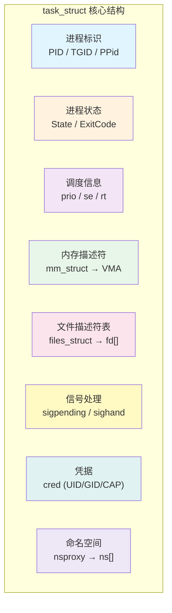
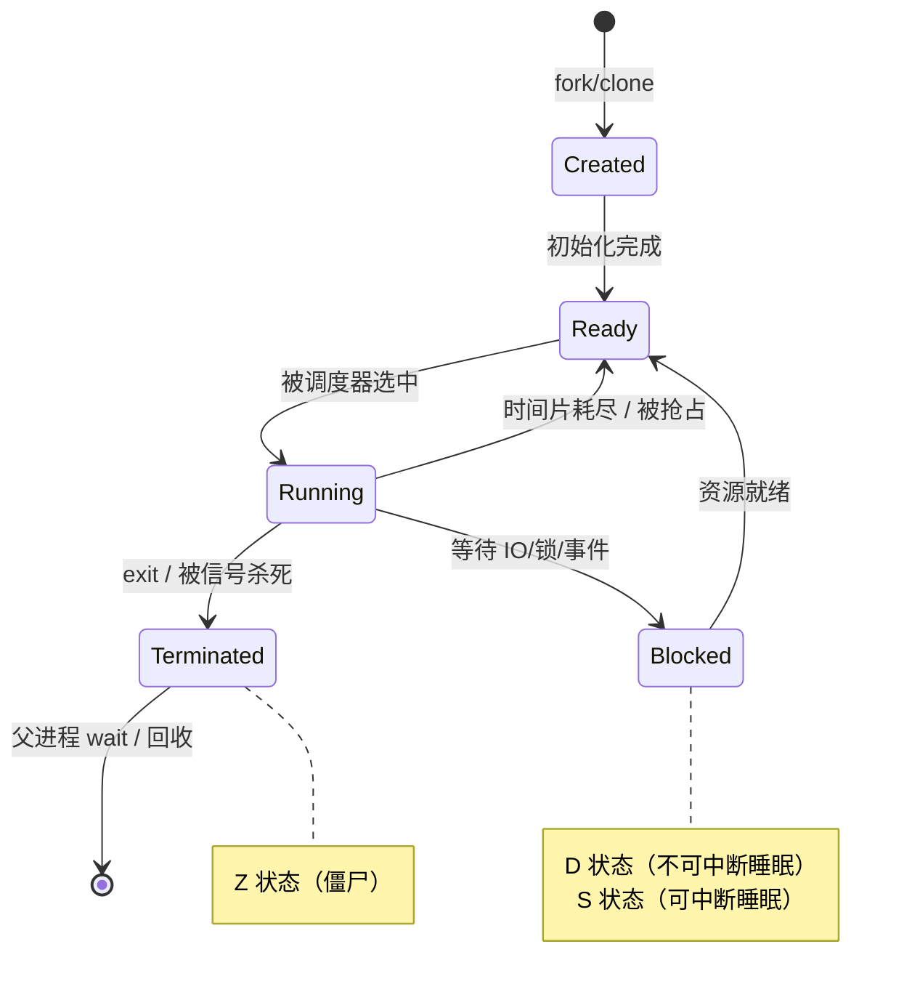
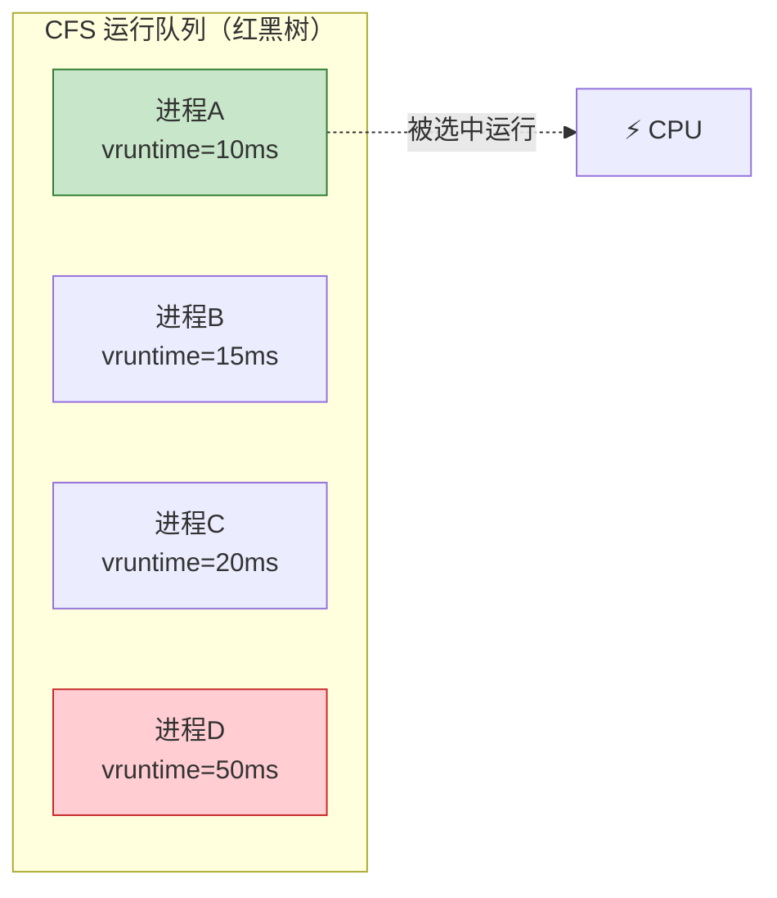
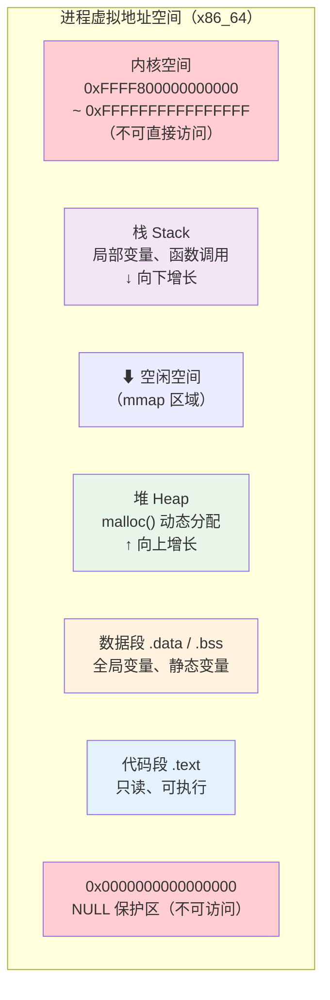
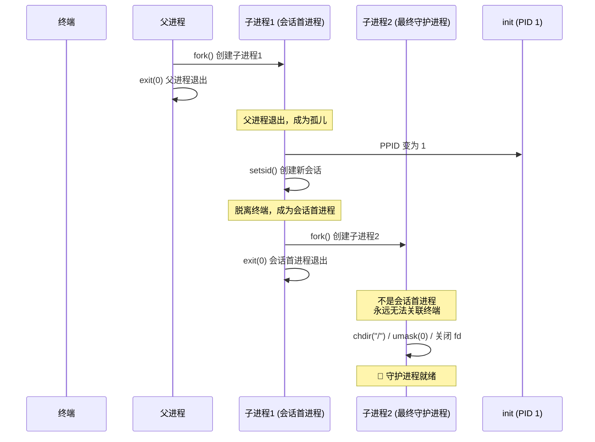
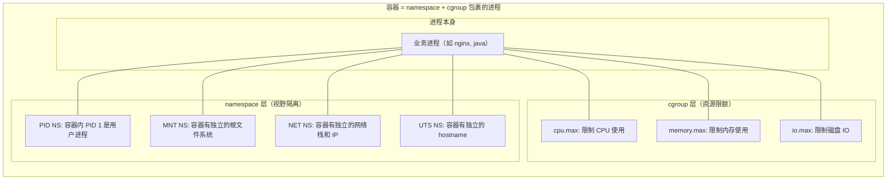

# Linux 进程管理详解

## 一句话理解

进程（Process）是 Linux 中最核心的抽象——它是**正在执行的程序实例**，是操作系统分配资源（CPU、内存、文件描述符等）的基本单位。Linux 内核通过一套精密的进程管理机制，让成百上千个进程在一台机器上**安全、公平、高效**地并发运行。

> 如果把操作系统比作一座工厂，进程就是车间里的工人。进程管理就是工厂的管理制度——工人怎么招（创建）、怎么分配任务（调度）、怎么发工资（资源分配）、怎么开除（终止）、怎么避免打架（隔离）。

## 进程的本质：内核中的 task_struct

Linux 中，进程在内核眼里就是一个 `task_struct` 结构体。内核通过它管理进程的一切信息。每个进程在 `/proc` 下都有自己的目录，以 PID 命名。

```bash
# 查看当前 shell 自己的 task_struct 信息
cat /proc/self/status | head -20
```

输出示例：

```
Name:   cat
Umask:  0022
State:  R (running)
Tgid:   12345
Ngid:   0
Pid:    12345
PPid:   12300
TracerPid:      0
Uid:    1000    1000    1000    1000
Gid:    1000    1000    1000    1000
FDSize: 256
Groups: 4 20 24 27 30 46 120 1000
VmPeak:     2560 kB
VmSize:     2432 kB
VmLck:         0 kB
VmPin:         0 kB
VmHWM:       640 kB
VmRSS:       640 kB
```

关键字段解读：
- `State`: 进程状态（后文详解）
- `Pid` / `PPid`: 进程 ID 和父进程 ID
- `Uid` / `Gid`: 四元组（实际、有效、保存、文件系统）
- `VmRSS`: 实际占用的物理内存
- `VmSize`: 虚拟内存大小

### task_struct 核心字段全景



> **关键区分：PID vs TGID**
> - PID（Process ID）：内核视角的"任务" ID。每个线程都有唯一的 PID。
> - TGID（Thread Group ID）：用户视角的"进程" ID。同一个进程的所有线程共享 TGID。
> - 对单线程进程：PID == TGID
> - 对多线程进程：TGID 统一是主线程的 PID，每个子线程有自己的 PID
>
> 所以 `ps` 命令显示的 PID **实际上是 TGID**，而 `ls /proc/<pid>/task/` 可以看到这个 TGID 下的所有线程（每个子目录名才是真正的内核 PID）。

## 进程生命周期：五态模型

Linux 进程在其生命周期中会在多种状态之间切换。理解这些状态是排查问题的基本功。



### 各状态详解

| 状态 | 缩写 | ps STAT | 含义 | 典型场景 |
|------|------|---------|------|----------|
| Running | R | `R` | 正在运行或在运行队列中等待 | CPU 密集型计算、正常运行的进程 |
| Interruptible Sleep | S | `S` | 可中断睡眠，等待事件完成 | 等待用户输入、等待网络数据、`sleep 10` |
| Uninterruptible Sleep | D | `D` | **不可中断睡眠**，通常等待 IO | 等待磁盘读写完成、等待 NFS 响应 |
| Stopped | T | `T` | 被暂停（SIGSTOP / SIGTSTP）| `Ctrl+Z` 暂停进程，调试器断点 |
| Zombie | Z | `Z` | 已终止但父进程尚未回收 | 父进程没有调用 `wait()` |
| Dead | X | `X` | 已死亡，即将被彻底回收 | 转瞬即逝，几乎看不到 |

> ⚠️ **D 状态的坑**：D 状态进程**不能被 kill**（连 `kill -9` 都不行），因为此时进程在内核态等待 IO 完成，信号只有在返回用户态时才会被处理。如果 IO 挂死（比如 NFS 服务器宕机），进程就会永远卡在 D 状态，唯一的解决办法是恢复 IO 或重启机器。

### 实战：观察进程状态

```bash
# 启动一个 sleep 进程，观察它的状态
sleep 100 &
# [1] 45678

# 查看状态（S = 可中断睡眠）
ps aux | grep sleep
# user  45678  0.0  0.0   7240   640 pts/0  S  10:00  0:00 sleep 100

# 按 Ctrl+Z 暂停它
# 或者 kill -STOP 45678
# 再看状态（T = 停止）
ps aux | grep sleep
# user  45678  0.0  0.0   7240   640 pts/0  T  10:00  0:00 sleep 100

# 恢复运行
kill -CONT 45678
```

```bash
# 制造一个 D 状态进程（需要 root，谨慎操作）
# 方法：从 NFS 挂载点读取，然后拔掉网线 / 关掉 NFS 服务器
# 可以在测试环境体验：

# 1. 挂载一个 loop 设备
sudo mount -o loop /tmp/test.img /mnt/test

# 2. 在另一个终端启动一个不断读写的进程
dd if=/dev/zero of=/mnt/test/bigfile bs=1M count=1000 &

# 3. 拔掉 loop 设备（模拟 IO 挂死）
sudo losetup -d /dev/loopX  # 挂死在 D 状态！
```

## 进程的"家谱"：父子进程与进程树

Linux 中所有进程形成一棵树，根是 PID 1 的 `init`（或 systemd）。

```bash
# 查看进程树
pstree -p | head -20
```

输出：
```
systemd(1)─┬─ModemManager(852)─┬─{ModemManager}(880)
           │                   └─{ModemManager}(890)
           ├─NetworkManager(853)─┬─{NetworkManager}(869)
           │                     └─{NetworkManager}(876)
           ├─accounts-daemon(854)─┬─{accounts-daemon}(862)
           │                      └─{accounts-daemon}(876)
           ├─containerd(870)─┬─containerd-shim(1234)─┬─nginx(1235)───nginx(1236)
           │                 │                        └─{containerd-shim}(1237)
           │                 └─{containerd}(1040)
           ...
```

关键概念：

### fork() — 进程的"分身术"

`fork()` 是 Unix/Linux 中创建进程的唯一方式。调用 `fork()` 后，内核复制当前进程的 `task_struct`，产生一个几乎完全相同的子进程。

```c
#include <stdio.h>
#include <unistd.h>

int main() {
    pid_t pid = fork();

    if (pid == 0) {
        // 子进程：fork() 返回 0
        printf("I'm child,  PID=%d, PPID=%d\n", getpid(), getppid());
    } else if (pid > 0) {
        // 父进程：fork() 返回子进程的 PID
        printf("I'm parent, PID=%d, child PID=%d\n", getpid(), pid);
    } else {
        // fork 失败
        perror("fork failed");
    }
    return 0;
}
```

输出：
```
I'm parent, PID=1000, child PID=1001
I'm child,  PID=1001, PPID=1000
```

> 💡 **写时复制（Copy-on-Write, CoW）**：现代 Linux 不会真的在 `fork()` 时复制全部内存。父子的内存页被标记为只读共享，只有一方尝试写入时才触发缺页中断，内核复制该页。这是 `fork()` 为什么这么快的关键。

### 孤儿进程与僵尸进程

这是两个容易被混淆但含义完全不同的概念：


- **孤儿进程**：无害，init 会自动接管并回收，无需担心。
- **僵尸进程**：虽然不占内存（已释放），但**占用 PID 资源**。大量僵尸进程可能导致 PID 耗尽，新进程无法创建。

### 实战：制造并观察僵尸进程

```c
// zombie.c — 制造一个僵尸进程
#include <stdio.h>
#include <stdlib.h>
#include <unistd.h>

int main() {
    pid_t pid = fork();

    if (pid == 0) {
        // 子进程：立即退出
        printf("Child (PID=%d) exiting...\n", getpid());
        exit(0);
    } else {
        // 父进程：故意不调用 wait()，一直 sleep
        printf("Parent (PID=%d), child PID=%d\n", getpid(), pid);
        printf("Run 'ps aux | grep Z' in another terminal to see zombie\n");
        sleep(60);  // 这 60 秒内子进程是僵尸
        // 父进程退出后，僵尸会被 init 回收
    }
    return 0;
}
```

编译运行：
```bash
gcc -o zombie zombie.c
./zombie &
# 另一个终端查看
ps aux | grep -w Z
# user  12346  0.0  0.0      0     0 pts/0  Z+  10:05  0:00 [zombie] <defunct>
```

> **如何清理僵尸进程？** 杀掉其父进程即可。父进程终止后，僵尸进程的 PPID 变为 1，init/systemd 会自动调用 `wait()` 回收。

## 进程调度：谁先用 CPU

Linux 调度器的核心任务是：**在成百上千个就绪进程中，决定下一个该让谁运行**。

### CFS（完全公平调度器）

从 Linux 2.6.23 起，CFS（Completely Fair Scheduler）是默认调度器。核心理念：

> CFS 不是按"时间片"分配，而是按**虚拟运行时间（vruntime）**。每个进程累积 vruntime，CFS 总是选择 vruntime **最小**的进程运行。CPU 密集型进程 vruntime 增长快，IO 密集型进程 vruntime 增长慢——自然实现了公平与优先级的平衡。



### nice 值与优先级

| nice 值 | 范围 | 含义 | 对 CPU 的影响 |
|---------|------|------|-------------|
| -20 | 最高优先级 | "我很重要，多给我 CPU" | vruntime 增长最慢，占更多 CPU |
| 0 | 默认 | 普通优先级 | vruntime 按实际运行时间增长 |
| 19 | 最低优先级 | "我不急，你让着别人" | vruntime 增长最快，占更少 CPU |

```bash
# 查看进程的 nice 值
ps -eo pid,ni,comm | head -20

# 以低优先级启动一个 CPU 密集型任务
nice -n 19 sha256sum /dev/zero &

# 调整已有进程的优先级
renice -n -5 -p <PID>   # 提高优先级（需要 root）
renice -n 10 -p <PID>   # 降低优先级
```

### 实战：观察 CPU 调度效果

```bash
# 终端 1：启动两个 CPU 密集型进程
dd if=/dev/zero of=/dev/null bs=1M &
dd if=/dev/zero of=/dev/null bs=1M &

# 终端 2：观察 CPU 分配是否公平
top -p <PID1>,<PID2>
# 两个 dd 进程应该各占约 50% CPU

# 终端 2：调整其中一个的 nice 值
renice -n 19 -p <PID1>   # 降低 PID1 的优先级
# 此时 PID2 会占更多 CPU，因为 PID1 的 vruntime 增长更快
```

## 进程内存布局

每个 Linux 进程都有统一的虚拟内存布局：



### 实战：查看进程内存映射

```bash
# 查看某个进程的内存布局
cat /proc/self/maps
```

输出示例（简化）：
```
00400000-00401000 r-xp ... /usr/bin/cat          # 代码段
00600000-00601000 r--p ... /usr/bin/cat          # 只读数据段
00601000-00602000 rw-p ... /usr/bin/cat          # 可读写数据段
01a00000-01a21000 rw-p ... [heap]                # 堆
7f1234000000-7f1234021000 rw-p ...               # mmap 区域
7ffe00000000-7ffe00021000 rw-p ... [stack]       # 栈
7ffe00030000-7ffe00031000 r-xp ... [vdso]        # vDSO
ffffffffff600000-ffffffffff601000 r-xp ... [vsyscall]  # vsyscall
```

### 进程内存指标速查

```bash
# 查看进程的详细内存指标
cat /proc/<PID>/status | grep -E "Vm|Rss"
```

| 指标 | 含义 | 说明 |
|------|------|------|
| VmSize | 虚拟内存总大小 | 包括未实际分配的，通常很大 |
| VmRSS | 常驻物理内存 | **实际占用的物理内存，最重要的指标** |
| VmData | 数据段大小 | .data + .bss + heap |
| VmStk | 栈大小 | 通常很小（默认 8MB） |
| VmExe | 代码段大小 | .text |
| VmLib | 共享库映射大小 | 动态链接库 |
| VmSwap | 换出到 swap 的内存 | 越大说明内存压力越严重 |

## 信号（Signal）：进程间的异步通信

信号是 Linux 中最轻量的进程间通信（IPC）机制——本质是一个异步通知："嘿，有事情发生了。"

### 核心信号速查表

| 信号 | 编号 | 默认行为 | 含义 | 能捕获？ | 能忽略？ |
|------|------|---------|------|---------|---------|
| SIGINT | 2 | Term | 终端中断（Ctrl+C） | ✅ | ✅ |
| SIGQUIT | 3 | Core | 终端退出（Ctrl+\），生成 core dump | ✅ | ✅ |
| SIGKILL | 9 | Term | **无条件杀死（不可捕获/忽略）** | ❌ | ❌ |
| SIGTERM | 15 | Term | 优雅终止（默认 kill） | ✅ | ✅ |
| SIGSTOP | 19 | Stop | **无条件暂停（不可捕获/忽略）** | ❌ | ❌ |
| SIGCONT | 18 | Cont | 继续运行（恢复 STOP 的进程） | ✅ | ✅ |
| SIGCHLD | 17 | Ignore | 子进程状态改变 | ✅ | ✅ |
| SIGPIPE | 13 | Term | 向无读端的管道写入 | ✅ | ✅ |
| SIGHUP | 1 | Term | 终端挂断（也用于 reload 配置） | ✅ | ✅ |
| SIGUSR1 | 10 | Term | 用户自定义信号 1 | ✅ | ✅ |
| SIGUSR2 | 12 | Term | 用户自定义信号 2 | ✅ | ✅ |

### 实战：信号处理

```bash
# kill 默认发送 SIGTERM（15），给进程优雅退出的机会
kill <PID>

# SIGKILL（9）直接杀，进程没有机会清理
kill -9 <PID>

# 查看所有信号
kill -l
```

```c
// signal_demo.c — 演示信号捕获
#include <stdio.h>
#include <stdlib.h>
#include <signal.h>
#include <unistd.h>

void handle_sigint(int sig) {
    printf("\nCaught SIGINT (%d), but I won't die!\n", sig);
    printf("Try Ctrl+\\ (SIGQUIT) or kill -9 instead.\n");
}

void handle_sigterm(int sig) {
    printf("\nCaught SIGTERM (%d), cleaning up...\n", sig);
    exit(0);  // 优雅退出
}

int main() {
    // 捕获 SIGINT（Ctrl+C）
    signal(SIGINT, handle_sigint);

    // 捕获 SIGTERM
    signal(SIGTERM, handle_sigterm);

    printf("My PID is %d\n", getpid());
    printf("Press Ctrl+C to test SIGINT capture\n");
    printf("Run 'kill %d' to test SIGTERM\n", getpid());

    while (1) {
        printf(".");
        fflush(stdout);
        sleep(1);
    }
    return 0;
}
```

> 💡 **SIGTERM vs SIGKILL**：优雅关闭应该先发 `SIGTERM`，给进程清理资源的机会（关闭连接、保存状态等）。只有当进程卡死、不理 `SIGTERM` 时，才用 `SIGKILL` 强制终止。Kubernetes 的 Pod 终止流程也是先 `SIGTERM`，等 `terminationGracePeriodSeconds` 后再 `SIGKILL`。

## 守护进程（Daemon）

守护进程是在后台运行、不与终端关联的长期服务进程。sshd、nginx、systemd-journald 都是守护进程。

守护进程的特征：
- 父进程通常是 PID 1（init/systemd）
- 没有控制终端（`tty` 显示 `?`）
- 工作目录通常是 `/`
- 文件描述符 0/1/2 通常重定向到 `/dev/null`

```bash
# 找出所有守护进程（没有 TTY 的非内核进程）
ps -eo pid,ppid,tty,comm | awk '$3 == "?" {print}'
```

### 守护进程的"变身"步骤

一个用户态程序变成守护进程，需要经过经典的 **double-fork** 仪式：

```c
// daemon_demo.c — 展示守护进程化的标准步骤
#include <stdio.h>
#include <stdlib.h>
#include <unistd.h>
#include <sys/stat.h>
#include <fcntl.h>

void daemonize() {
    // 步骤 1: 第一次 fork，父进程退出
    pid_t pid = fork();
    if (pid > 0) exit(0);  // 父进程退出，子进程继续
    if (pid < 0) exit(1);

    // 步骤 2: 创建新会话，脱离原终端
    setsid();  // 子进程成为新会话的首进程，不再关联任何终端

    // 步骤 3: 第二次 fork，确保不是会话首进程（防止重新获取终端）
    pid = fork();
    if (pid > 0) exit(0);
    if (pid < 0) exit(1);

    // 步骤 4: 重设工作目录
    chdir("/");

    // 步骤 5: 重设 umask
    umask(0);

    // 步骤 6: 关闭继承的文件描述符，重定向 stdin/stdout/stderr
    close(STDIN_FILENO);
    close(STDOUT_FILENO);
    close(STDERR_FILENO);
    open("/dev/null", O_RDONLY);  // stdin → /dev/null
    open("/dev/null", O_WRONLY);  // stdout → /dev/null
    open("/dev/null", O_WRONLY);  // stderr → /dev/null
}

int main() {
    daemonize();
    // 守护进程的主体逻辑
    while (1) {
        // 做一些后台工作...
        sleep(10);
    }
    return 0;
}
```



## /proc 文件系统

`/proc` 是 Linux 内核暴露的虚拟文件系统，是排查进程问题的第一站。`/proc/<PID>/` 下的每个文件都是内核动态生成的"体检报告"。

### 常用排查速查

```bash
cat /proc/<PID>/status       # 进程状态、内存、UID/GID 等（最常用）
cat /proc/<PID>/cmdline      # 启动命令
ls -la /proc/<PID>/fd/       # 所有打开的文件描述符
cat /proc/<PID>/maps         # 虚拟内存映射
cat /proc/<PID>/smaps        # 详细内存统计（Pss 最准）
cat /proc/<PID>/oom_score    # OOM Killer 评分
cat /proc/<PID>/cgroup       # 所属 cgroup（判断属于哪个容器）
cat /proc/<PID>/stack        # 内核栈（排查 D 状态卡死）
ls -la /proc/<PID>/root/     # 进程的根文件系统（容器场景极有用！）
```

### `/proc/<PID>/root` — 容器场景的关键

`/proc/<PID>/root` 指向该**进程视角下的根目录**。对容器内的进程，它指向容器根文件系统在宿主机上的实际路径。这意味着：

```bash
# 不需要 docker exec，直接从宿主机操作容器文件系统
PID=$(docker inspect --format '{{.State.Pid}}' nginx)
cat /proc/$PID/root/etc/nginx/nginx.conf  # 读取容器内配置
cp /proc/$PID/root/var/log/nginx/error.log /tmp/  # 从容器拷出日志
```

> 📖 **深入阅读**：[`/proc` 文件系统详解](/linux/proc-filesystem/) — 包含完整字段解读、容器 `root` 原理、sysctl 调优、综合排查案例。

## 进程管理与容器

容器的本质就是**被 namespace 隔离、被 cgroup 限制的一组进程**。理解进程管理，是理解容器的前提。



关键认知：
- 容器里的 PID 1 **就是你的业务进程**（比如 `java -jar app.jar`），而不是 init/systemd
- 容器里的 PID 1 有特殊责任：**回收僵尸进程**、**正确处理信号**
- 如果 PID 1 不处理 SIGTERM，容器就会等够 `terminationGracePeriodSeconds` 后被 SIGKILL 强杀
- Dockerfile 中推荐使用 `tini` 或 `--init` 作为 PID 1，来正确处理信号和回收僵尸

## 常用进程管理命令速查

```bash
# === 查看进程 ===
ps aux                  # 所有进程的详细信息
ps -eo pid,ppid,ni,stat,comm,args  # 自定义列
pstree -p               # 进程树
pgrep -a nginx          # 按名称查找进程
pidof nginx             # 按名称获取 PID

# === 实时监控 ===
top                     # 交互式进程监控
htop                    # top 的增强版（需安装）
pidstat 1               # 每秒输出进程 CPU、内存、IO 统计

# === 进程控制 ===
kill <PID>              # 发送 SIGTERM（优雅终止）
kill -9 <PID>           # 强制杀死
kill -STOP <PID>        # 暂停进程
kill -CONT <PID>        # 恢复进程
kill -HUP <PID>         # 常用于 reload 配置（如 nginx -s reload）
killall -9 <进程名>     # 按名称杀进程

# === 优先级 ===
nice -n 10 <command>    # 以低优先级启动
renice -n -5 -p <PID>   # 调整优先级

# === 后台任务 ===
command &               # 后台运行
Ctrl+Z                  # 暂停前台任务
jobs                    # 查看后台任务
fg %1                   # 将任务 1 调回前台
bg %1                   # 让暂停的任务 1 在后台继续运行
nohup command &         # 忽略 SIGHUP，退出终端后继续运行
disown -h %1            # 让作业 1 脱离 shell 的作业控制

# === /proc 调试 ===
strace -p <PID>         # 跟踪系统调用（排查卡死神器）
lsof -p <PID>           # 列出进程打开的所有文件
cat /proc/<PID>/stack   # 查看进程的内核栈（D 状态排查）
```

## 总结

Linux 进程管理的核心脉络：

1. **进程本质**：`task_struct` 结构体，内核通过它管理进程的一切
2. **生命周期**：创建（fork）→ 就绪 → 运行 → 阻塞/暂停 → 终止 → 回收
3. **调度公平**：CFS 调度器用 vruntime 公平分配 CPU，nice 值影响权重
4. **信号通信**：轻量级异步通知机制，SIGTERM 优雅退出，SIGKILL 强制终止
5. **内存隔离**：每个进程有独立虚拟地址空间，CoW 优化 fork 性能
6. **容器基石**：namespace 隔离视野 + cgroup 限制资源 = 容器

理解进程管理，你就理解了操作系统的一半。另一半是内存管理和文件系统——但那是另一个故事了。

---

> 📚 **延伸阅读**：
> - [Linux Namespace 详解](/linux/namespace/)
> - [cgroup v2 详解](/linux/cgroup/)
> - [容器的本质（K8s 视角）](/kubernetes/容器本质/)
