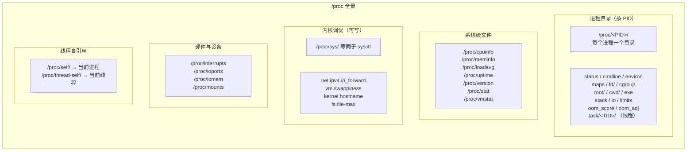
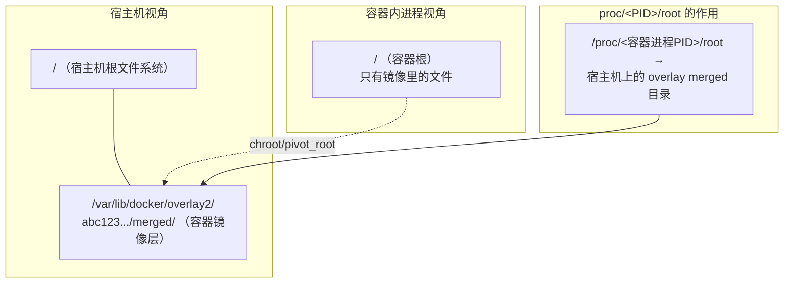

# /proc 文件系统详解：Linux 内核的运行时窗口

## 一句话理解

`/proc` 是一个**伪文件系统（pseudo-filesystem）**——它不存储在磁盘上，所有内容都是内核在读取时**动态生成**的。你可以把 `/proc` 理解为内核暴露给用户空间的一个"只读控制面板"，通过读写其中的文件，你就能观察（甚至修改）内核和每个进程的运行时状态。

> `/proc` 就像汽车的 OBD-II 诊断接口——车子跑着的时候，插上诊断仪就能看到转速、水温、故障码。`/proc` 就是对 Linux 系统的 OBD 接口。

## /proc 不是"真文件"

这是理解 `/proc` 最重要的一点：

```bash
# 看起来是普通文件，但读出来的内容永远是"此刻"的真实状态
cat /proc/meminfo     # 每次都重新生成，不占磁盘
ls -la /proc/meminfo  # 大小显示为 0（但读出来有内容！）
# -r--r--r-- 1 root root 0 Jun 25 10:00 /proc/meminfo
```

`/proc` 中的文件具有两个关键特性：

| 特性 | 说明 |
|------|------|
| **零磁盘占用** | 内容由内核的 `seq_file` / `proc_create` 接口动态生成，不落盘 |
| **即时性** | 每次 `read()` 都反映最新的内核状态，没有"过期数据" |

## /proc 全景结构



## /proc/&lt;PID&gt;/ 进程目录详解

进程目录是 `/proc` 中使用频率最高的部分。下面逐项介绍最重要的文件。

### 1. `status` — 进程"身份证"（最重要）

```bash
cat /proc/self/status
```

<details>
<summary>点击展开完整输出示例</summary>

```
Name:   bash
Umask:  0022
State:  S (sleeping)
Tgid:   1234
Ngid:   0
Pid:    1234
PPid:   1230
TracerPid:      0
Uid:    1000    1000    1000    1000
Gid:    1000    1000    1000    1000
FDSize: 256
Groups: 4 20 24 27 30 46 120 1000
NStgid: 1234
NSpid:  1234
NSpgid: 1234
NSsid:  1234
VmPeak:   128456 kB
VmSize:   125832 kB
VmLck:         0 kB
VmPin:         0 kB
VmHWM:      5840 kB
VmRSS:      5216 kB
RssAnon:    2048 kB
RssFile:    3168 kB
RssShmem:      0 kB
VmData:     3024 kB
VmStk:       132 kB
VmExe:       964 kB
VmLib:      2148 kB
VmPTE:        60 kB
VmSwap:        0 kB
HugetlbPages:  0 kB
CoreDumping:    0
THP_enabled:    1
Threads:        1
SigQ:   0/63342
SigPnd: 0000000000000000
ShdPnd: 0000000000000000
SigBlk: 0000000000010000
SigIgn: 0000000000384004
SigCgt: 000000004b813efb
CapInh: 0000000000000000
CapPrm: 0000000000000000
CapEff: 0000000000000000
CapBnd: 000001ffffffffff
CapAmb: 0000000000000000
NoNewPrivs:     0
Seccomp:        0
Seccomp_filters:        0
Speculation_Store_Bypass:       thread vulnerable
SpeculationIndirectBranch:        conditional enabled
Cpus_allowed:   3f
Cpus_allowed_list:      0-5
Mems_allowed:   00000000,00000000,00000000,00000000,00000000,00000000,00000000,00000000,00000000,00000000,00000000,00000000,00000000,00000000,00000000,00000000,00000000,00000000,00000000,00000000,00000000,00000000,00000000,00000000,00000000,00000000,00000000,00000000,00000000,00000000,00000000,00000001
Mems_allowed_list:      0
voluntary_ctxt_switches:        152
nonvoluntary_ctxt_switches:     8
```
</details>

#### 字段分组解读

**身份信息**
| 字段 | 含义 |
|------|------|
| `Name` | 进程名（executable name） |
| `Pid` | 进程 ID（内核视角） |
| `PPid` | 父进程 ID |
| `Tgid` | 线程组 ID（用户视角的 PID） |
| `Uid` / `Gid` | 四元组：real, effective, saved, filesystem |

**内存指标**（单位：kB）
| 字段 | 含义 | 重要程度 |
|------|------|----------|
| `VmPeak` | 虚拟内存峰值 | ⭐ |
| `VmSize` | 当前虚拟内存 | ⭐⭐ |
| **`VmRSS`** | **常驻物理内存（实际占用）** | ⭐⭐⭐⭐⭐ |
| `VmHWM` | RSS 历史峰值（High Water Mark） | ⭐⭐⭐ |
| `VmSwap` | 换出到 swap 的大小 | ⭐⭐⭐ |
| `VmData` | 数据段大小（heap + .data + .bss） | ⭐⭐ |
| `VmStk` | 栈大小 | ⭐ |
| `RssAnon` | 匿名页 RSS（malloc/mmap 等） | ⭐⭐⭐ |
| `RssFile` | 文件映射页 RSS（可执行代码、共享库等） | ⭐⭐⭐ |

> 💡 **RSS 是"水分"最少的指标**。容器 OOM 时，内核看的也是 RSS（+ page cache 等）。用 `docker stats` 看到的内存基本等同于 RSS。

**信号信息**
| 字段 | 含义 |
|------|------|
| `SigPnd` | 当前进程挂起的信号位图 |
| `ShdPnd` | 线程组共享的挂起信号 |
| `SigBlk` | 被阻塞的信号位图 |
| `SigIgn` | 被忽略的信号位图 |
| `SigCgt` | 被捕获的信号位图 |

**安全与能力**
| 字段 | 含义 |
|------|------|
| `CapPrm` / `CapEff` / `CapBnd` | Linux capabilities 位图 |
| `Seccomp` | seccomp 模式（0=关闭, 1=strict, 2=filter） |

**CPU 亲和性与调度**
| 字段 | 含义 |
|------|------|
| `Cpus_allowed_list` | 允许运行在哪些 CPU 核心 |
| `voluntary_ctxt_switches` | 主动上下文切换次数（IO 等待等） |
| `nonvoluntary_ctxt_switches` | 被动上下文切换次数（时间片耗尽） |

### 2. `fd/` 和 `fdinfo/` — 文件描述符

这是排查"文件句柄泄漏"的第一现场。

```bash
# 查看进程打开的所有文件描述符
ls -la /proc/<PID>/fd/

# 输出示例
# lrwx------ 1 root root 64 Jun 25 10:00 0 -> /dev/null
# lrwx------ 1 root root 64 Jun 25 10:00 1 -> /dev/null
# lrwx------ 1 root root 64 Jun 25 10:00 2 -> /dev/null
# lrwx------ 1 root root 64 Jun 25 10:00 3 -> socket:[45678]
# lrwx------ 1 root root 64 Jun 25 10:00 4 -> /var/log/nginx/access.log
# lrwx------ 1 root root 64 Jun 25 10:00 5 -> anon_inode:[eventpoll]
# lr-x------ 1 root root 64 Jun 25 10:00 6 -> pipe:[98765]

# 进一步查看 fd 的详细信息（偏移量、flags 等）
cat /proc/<PID>/fdinfo/4
# pos:    1048576       # 文件读写指针位置
# flags:  0100001       # O_WRONLY | O_APPEND
# mnt_id: 15
```

> 🔍 **排查技巧**：如果进程异常报 `Too many open files`，`ls /proc/<PID>/fd/ | wc -l` 可以快速确认已打开 fd 数量，再对比 `cat /proc/<PID>/limits | grep "open files"` 看限额。

### 3. `maps` 和 `smaps` — 虚拟内存地图

```bash
cat /proc/self/maps
```

输出示例（简化）：
```
55a8b0000000-55a8b0001000 r-xp 00000000 fd:01 123456  /usr/bin/bash
55a8b0002000-55a8b0003000 r--p 00001000 fd:01 123456  /usr/bin/bash
55a8b0003000-55a8b0004000 rw-p 00002000 fd:01 123456  /usr/bin/bash
55a8b1a00000-55a8b1a21000 rw-p 00000000 00:00 0       [heap]
7f1234000000-7f1234021000 rw-p 00000000 00:00 0
7f1234021000-7f1238000000 ---p 00000000 00:00 0
7f123c000000-7f123c021000 rw-p 00000000 00:00 0
7ffc00000000-7ffc00021000 rw-p 00000000 00:00 0       [stack]
7ffc00030000-7ffc00031000 r-xp 00000000 00:00 0       [vdso]
ffffffffff600000-ffffffffff601000 --xp 00000000 00:00 0 [vsyscall]
```

格式：`起始地址-结束地址  权限  偏移  设备  节点号  路径`

权限含义：
- `r` = 可读，`w` = 可写，`x` = 可执行
- `p` = 私有映射（private），`s` = 共享映射（shared）

`smaps` 是 `maps` 的"加量版"，会展开每段 VMA 的详细内存统计：

```bash
cat /proc/self/smaps | head -30
```

对每一段映射，`smaps` 额外提供：
- `Rss`: 常驻物理内存
- `Pss`: 按共享比例分摊后的 RSS（**容器场景下最准确的进程内存指标**）
- `Shared_Clean` / `Shared_Dirty`: 共享页
- `Private_Clean` / `Private_Dirty`: 私有页
- `Swap`: 该段换出大小
- `SwapPss`: 按比例分摊的 swap

> 💡 **Pss vs RSS**：多个进程共享同一个 `libc.so`，这段内存的 RSS 是重复计算的（每个进程都算一次），而 Pss 会按进程数均分。在容器场景中，Pss 更能反映单个进程真实的内存开销。

### 4. `cmdline` vs `comm`

```bash
# cmdline: 完整启动命令，参数用 \0 分隔
cat /proc/<PID>/cmdline | tr '\0' ' '
# /usr/bin/python3 /app/server.py --port 8080

# comm: 仅可执行文件名，最长 15 字符（这是内核限制）
cat /proc/<PID>/comm
# python3
```

> ⚠️ `comm` 可以被 `prctl(PR_SET_NAME)` 修改，所以不要完全信任它来判断进程身份。

### 5. `cgroup` — 进程所属的 cgroup 路径

```bash
cat /proc/<PID>/cgroup
# 0::/system.slice/docker-abc123.scope
# 或 cgroup v1:
# 12:memory:/docker/abc123
# 11:cpu:/docker/abc123
```

在容器场景中，这是判断"这个进程属于哪个容器"的关键依据。

### 6. `oom_score` 与 `oom_score_adj`

OOM Killer 选择牺牲品时使用的评分机制：

```bash
# oom_score: 当前评分（越高越容易被杀），内核动态计算
cat /proc/<PID>/oom_score
# 25

# oom_score_adj: 人工调整值（-1000 ~ 1000）
# -1000 = 完全豁免，永不杀
#   0   = 默认，内核自行判定
# 1000  = 优先牺牲
cat /proc/<PID>/oom_score_adj
# 0

# 让某个进程不被 OOM Killer 杀掉
echo -1000 > /proc/<PID>/oom_score_adj
```

> 🔍 Kubernetes 中，Pod 的 QoS 等级（Guaranteed / Burstable / BestEffort）就是通过设置 cgroup 的 `memory.oom.group` 和进程的 `oom_score_adj` 来实现的。BestEffort Pod 的 oom_score_adj 被设为 1000，总是最先被杀。

### 7. `stack` — 内核栈

排查 D 状态（不可中断睡眠）进程的利器：

```bash
cat /proc/<PID>/stack
# [<0>] blk_mq_get_tag+0x11c/0x2c0
# [<0>] __blk_mq_alloc_request+0x16e/0x260
# [<0>] blk_mq_submit_bio+0x3c1/0x6c0
# [<0>] submit_bio_noacct+0x53a/0x6e0
# ...
```

如果看到进程卡在 NFS、块设备等 IO 相关函数上，就知道了 D 状态的根因。

### 8. `io` — 进程 IO 统计

```bash
cat /proc/<PID>/io
# rchar: 4678923           # 读取的字节数（含 page cache）
# wchar: 1289456           # 写入的字节数（含 page cache）
# syscr: 892               # 读系统调用次数
# syscw: 456               # 写系统调用次数
# read_bytes: 409600       # 实际从存储层读取的字节
# write_bytes: 204800      # 实际写入存储层的字节
# cancelled_write_bytes: 0 # 取消的写入
```

> 💡 `rchar` 可能远大于 `read_bytes`，差值就是从 page cache 命中的部分——没有实际走磁盘 IO。

### 9. `exe`, `cwd`, `root` — 三个特殊的符号链接

这三个符号链接构成了进程访问文件系统的"坐标系"：

```bash
# exe: 指向进程的可执行文件
ls -la /proc/<PID>/exe
# lrwxrwxrwx 1 root root 0 Jun 25 10:00 exe -> /usr/bin/python3

# cwd: 进程的当前工作目录
ls -la /proc/<PID>/cwd
# lrwxrwxrwx 1 root root 0 Jun 25 10:00 cwd -> /app

# root: 进程看到的根目录（详见下一章 ⬇️）
ls -la /proc/<PID>/root
# lrwxrwxrwx 1 root root 0 Jun 25 10:00 root -> /
```

---

## 🔑 重点：`/proc/<PID>/root` 与容器场景

### 它是什么

`/proc/<PID>/root` 是一个符号链接，指向**该进程的根文件系统**。正常情况下（无容器、无 chroot），它指向宿主机的 `/`。但如果进程在容器里或执行过 `chroot`，它指向的就是**进程视角下的根目录**。



### 容器场景下的实际含义

当你启动一个 Docker 容器时：

```bash
docker run -d --name nginx nginx
```

Docker 做的事情：
1. 准备容器的根文件系统（通过 overlay2 等存储驱动，将镜像层叠加成一个 merged 目录）
2. 通过 `pivot_root` 或 `chroot` 系统调用，将进程的根目录切换到那个 merged 目录
3. 内核在 `task_struct` 中记录了这个根目录的引用

因此：

```bash
# 容器里的 nginx 进程看到的 / 是容器根文件系统
# 但在宿主机上：
ls /proc/<容器nginx的PID>/root/
# 输出的是容器根文件系统的内容（etc/, usr/, var/ 等）
# 而不是宿主机的 etc/, usr/, var/

# 确认一下
ls /proc/<容器nginx的PID>/root/etc/nginx/
# nginx.conf  ...  —— 这是容器里的 nginx 配置！
```

### 实战：从宿主机进入容器的文件系统

这是运维中非常实用的技巧——**不需要 `docker exec`，直接从宿主机操作容器内文件**：

```bash
# 1. 找到容器内进程的 PID
docker inspect --format '{{.State.Pid}}' <容器名>
# 或
ps aux | grep <进程名>

# 2. 通过 /proc/<PID>/root 直接操作容器文件系统
# ——不需要进入容器，不需要 docker exec

# 查看容器内 /etc/hosts
cat /proc/12345/root/etc/hosts

# 查看容器内有哪些进程（容器视角的 /proc）
ls /proc/12345/root/proc/

# 修改容器内的配置文件
echo "debug=true" >> /proc/12345/root/etc/app/config.ini

# 查看容器的根文件系统里有什么
ls -la /proc/12345/root/

# 把日志从容器里复制到宿主机
cp /proc/12345/root/var/log/app/app.log /tmp/app.log

# "cd 进容器"（切换当前进程的根到容器根——谨慎操作）
cd /proc/12345/root && ls
# 现在你看到的 ./etc 就是容器里的 /etc
```

> ⚠️ **注意**：通过 `/proc/<PID>/root` 访问容器文件系统可以绕过容器的只读层限制。如果容器根文件系统是只读的（`docker run --read-only`），你在宿主机上仍然可以写入 `/proc/<PID>/root/`，因为这些写操作发生在 overlay 的 upper 层而不是 lower 层。

### `/proc/<PID>/root` vs `docker cp` vs `docker exec` 

| 方式 | 原理 | 适用场景 |
|------|------|----------|
| `docker exec -it <容器> bash` | 在容器 namespace 中启动新进程 | 日常调试，需要容器内有 shell |
| `docker cp` | Docker daemon 通过 tar 流传输文件 | 文件复制进出容器 |
| `/proc/<PID>/root/` | 直接通过内核 VFS 访问进程根目录 | **容器内无 shell、容器崩溃、紧急救援** |

### 容器崩溃时的救援场景

当容器因为某些原因无法 `docker exec` 进入时（比如容器内的 init 进程挂了、容器处于 Created 状态等），`/proc/<PID>/root` 就成了救命稻草：

```bash
# 场景：容器一直重启，无法 exec 进入查看，但进程可能短暂存活
# 1. 快速捕获进程 PID
PID=$(docker inspect --format '{{.State.Pid}}' <容器名>)

# 2. 通过 /proc/<PID>/root 进入文件系统分析
# 查看应用日志
cat /proc/$PID/root/var/log/app/error.log

# 查看配置是否有问题
cat /proc/$PID/root/etc/app/config.yaml

# 看看磁盘使用
du -sh /proc/$PID/root/var/log/
```

### 安全视角：`/proc/<PID>/root` 的权限考量

```bash
# 在宿主机上，root 用户可以看到一切
# 但普通用户能否访问 /proc/<PID>/root 取决于 ptrace 权限

# 检查 ptrace 范围（谁可以"窥探"别人的进程）
cat /proc/sys/kernel/yama/ptrace_scope
# 0 = 任何进程都可以 ptrace（传统行为，不安全）
# 1 = 只有父进程或 root 可以（默认，较安全）
# 2 = 只有 root 通过 CAP_SYS_PTRACE 可以
# 3 = 完全禁止

# 如果 ptrace_scope=1，普通用户只能访问自己的 /proc/<PID>/root
# root 不受影响
```

> 🔒 容器安全：`/proc/<PID>/root` 本质上是一个**特权访问通道**。拥有 `CAP_SYS_PTRACE` 的进程可以访问宿主机上任意容器的文件系统。这就是为什么 Kubernetes 中要限制容器的 capabilities，以及为什么 `privileged` 容器很危险。

---

## /proc 中可写的调优参数：sysctl

`/proc/sys/` 下的文件是**可读可写**的，用于运行时调优内核参数。`sysctl` 命令本质上就是读写了这些文件。

```bash
# 查看所有可调参数
sysctl -a | wc -l  # 通常有 1000+ 个参数

# === 常用网络调优 ===
# 开启 IP 转发（让 Linux 当路由器）
echo 1 > /proc/sys/net/ipv4/ip_forward
# 等价于
sysctl -w net.ipv4.ip_forward=1

# 调整 TIME_WAIT 相关参数
sysctl net.ipv4.tcp_tw_reuse=1

# === 常用内存调优 ===
# 调整 swap 倾向（0-100，越低越不愿意用 swap）
cat /proc/sys/vm/swappiness  # 默认 60
echo 10 > /proc/sys/vm/swappiness

# 调整脏页比例（达到该比例开始刷盘）
cat /proc/sys/vm/dirty_ratio  # 默认 20（%）

# === 文件系统调优 ===
# 最大文件句柄数
cat /proc/sys/fs/file-max
# 最大 inotify 监听数
cat /proc/sys/fs/inotify/max_user_watches
```

### 内核参数作用域

| 参数层级 | 含义 | 示例 |
|---------|------|------|
| `kernel.*` | 内核核心行为 | `kernel.hostname`, `kernel.pid_max` |
| `net.*` | 网络协议栈 | `net.ipv4.tcp_syncookies`, `net.core.somaxconn` |
| `vm.*` | 虚拟内存管理 | `vm.swappiness`, `vm.overcommit_memory` |
| `fs.*` | 文件系统 | `fs.file-max`, `fs.inotify.max_user_watches` |
| `user.*` | 用户资源限制 | `user.max_user_namespaces` |

> ⚠️ `/proc/sys/` 的修改**不持久化**，重启后失效。要永久生效，需要写入 `/etc/sysctl.conf` 或 `/etc/sysctl.d/*.conf`。

---

## /proc 中的系统级信息文件

```bash
# === CPU ===
cat /proc/cpuinfo          # CPU 型号、核心数、频率、缓存、flag
cat /proc/stat             # CPU 时间统计（user/system/idle/iowait 等）

# === 内存 ===
cat /proc/meminfo          # 全局内存统计（MemTotal/MemFree/Buffers/Cached 等）
cat /proc/vmstat           # 虚拟内存事件统计（pgfault/pgscan 等）

# === 系统负载 ===
cat /proc/loadavg          # 1/5/15 分钟平均负载 + 运行/总进程数
cat /proc/uptime           # 系统启动时间（秒） + 空闲时间（秒）

# === 内核版本 ===
cat /proc/version          # 内核版本 + 编译信息

# === 磁盘与设备 ===
cat /proc/mounts           # 当前挂载点（比 /etc/fstab 更实时）
cat /proc/partitions       # 磁盘分区信息
cat /proc/diskstats        # 磁盘 IO 统计
cat /proc/interrupts       # 中断统计（各 CPU 核心的中断计数）

# === 文件系统 ===
cat /proc/filesystems      # 内核支持的文件系统类型
```

---

## 一个综合排查案例

### 场景：容器内存持续增长，疑似内存泄漏

```bash
# 1. 找到容器主进程 PID
PID=$(docker inspect --format '{{.State.Pid}}' myapp)

# 2. 查看当前内存占用基线
cat /proc/$PID/status | grep -E "VmRSS|VmSize|RssAnon|VmHWM"
# VmRSS:    512000 kB    # 512MB RSS
# VmHWM:    524000 kB    # 历史峰值 524MB

# 3. 等几分钟后再次查看
cat /proc/$PID/status | grep VmRSS
# VmRSS:    612000 kB    # 涨到 612MB，确认增长趋势

# 4. 深入分析内存构成
# 看 heap 是否在涨
cat /proc/$PID/smaps | grep -A 20 '\[heap\]' | grep -E "^(Rss|Pss|Size):"

# 看匿名页总量（malloc/mmap 分配）
cat /proc/$PID/status | grep RssAnon
# 如果 RssAnon 持续增长 → 应用层内存泄漏

# 5. 检查 OOM 风险
cat /proc/$PID/oom_score
# 如果是 600+，说明接近被杀的边缘
# 对照 cgroup 限制
cat /proc/$PID/cgroup  # 查看属于哪个 cgroup
cat /sys/fs/cgroup/memory/.../memory.limit_in_bytes  # cgroup 内存上限

# 6. 用 strace 看看是不是有大量 brk/mmap 调用
strace -p $PID -e brk,mmap -c -S time &
sleep 30
kill %1
# 查看系统调用统计，看内存分配频率

# 7. 如果容器崩溃但进程还在，直接进入容器文件系统取证
ls -la /proc/$PID/root/tmp/          # 访问容器的 /tmp
cat /proc/$PID/root/var/log/app/*.log  # 查看容器内日志
```

---

## /proc 的局限性

| 限制 | 说明 |
|------|------|
| **不是原子快照** | 两次 `cat /proc/meminfo` 之间数据已变化，不同文件之间存在时间差 |
| **性能开销** | 频繁读取大文件（如 `/proc/<PID>/smaps`）会产生可感知的 CPU 开销 |
| **内核版本差异** | 不同内核版本 `/proc` 下的文件格式可能不同 |
| **并非所有信息都在 /proc** | `cgroup v2` 的大部分信息在 `/sys/fs/cgroup/`，网络命名空间详情在 `/var/run/netns/` |
| **容器视角不同** | 容器内的 `/proc` 看到的是经过 namespace 过滤的视图，与宿主机不同 |

---

## 总结

| 类别 | 用途 | 关键文件 |
|------|------|----------|
| 进程诊断 | 了解一个进程的一切 | `status`, `maps`, `fd/`, `stack` |
| 内存分析 | 进程用了多少内存、内存去哪了 | `status`（RSS）, `smaps`（Pss）, `maps` |
| 容器救援 | 从宿主机访问容器文件系统 | **`/proc/<PID>/root/`** |
| 内核调优 | 运行时修改内核参数 | `/proc/sys/` |
| 系统监控 | 全局系统状态概览 | `meminfo`, `cpuinfo`, `loadavg`, `stat` |

`/proc` 是 Linux 给运维和开发者的"上帝视角"——每一个进程在想什么、做什么，内核都知道，而 `/proc` 就是内核向我们汇报的通道。掌握它，你就掌握了排查 Linux 问题的大半技能。

---

> 📚 **延伸阅读**：
> - [Linux 进程管理详解](/linux/process-management/)
> - [Linux Namespace 详解](/linux/namespace/)
> - [cgroup v2 详解](/linux/cgroup/)
> - Linux 内核文档：[proc.txt](https://www.kernel.org/doc/Documentation/filesystems/proc.txt)
> - `man 5 proc` — 官方手册，最权威的 `/proc` 参考
