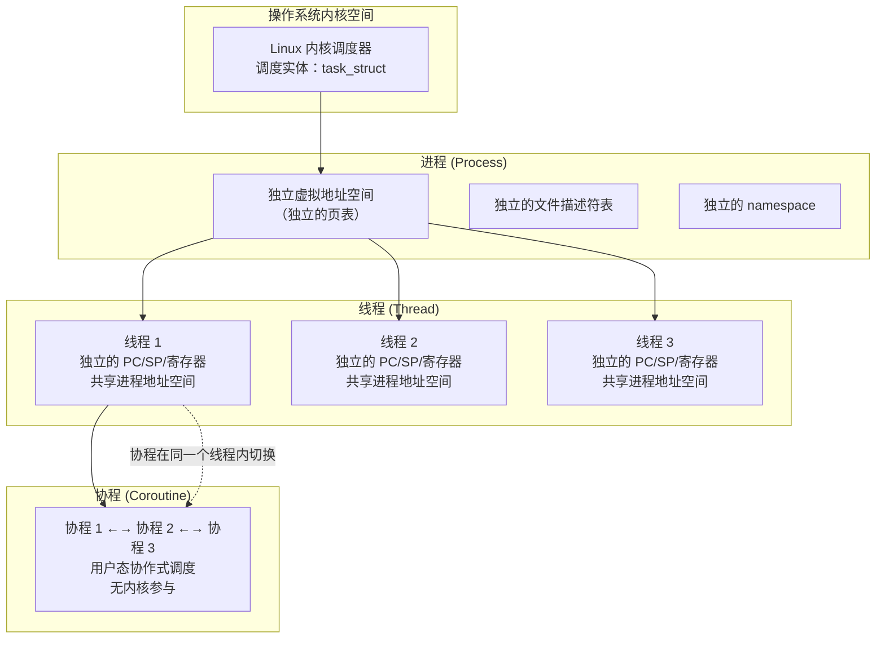
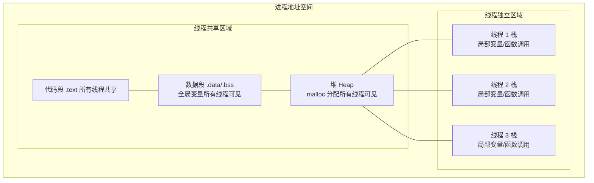
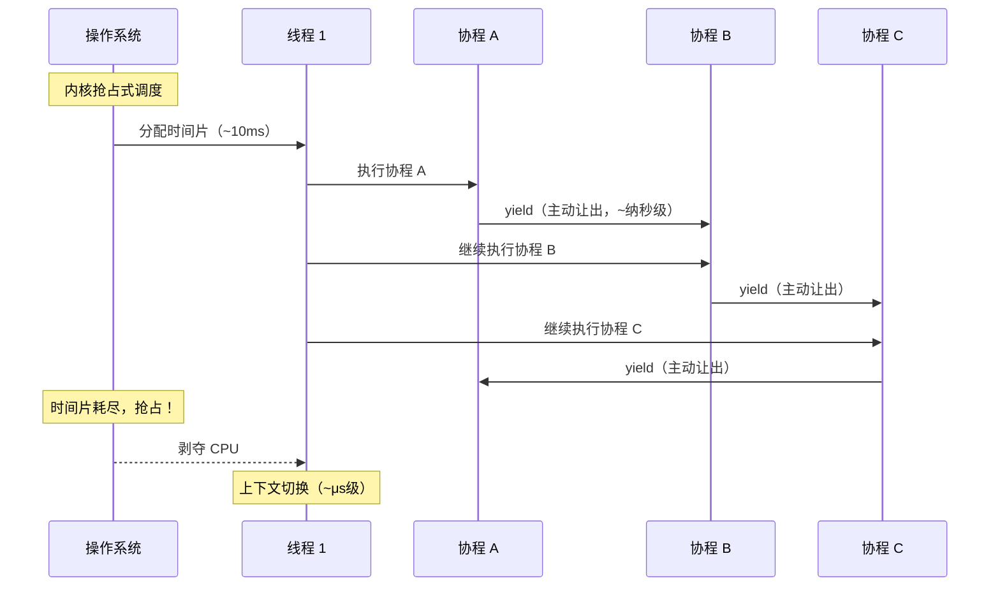
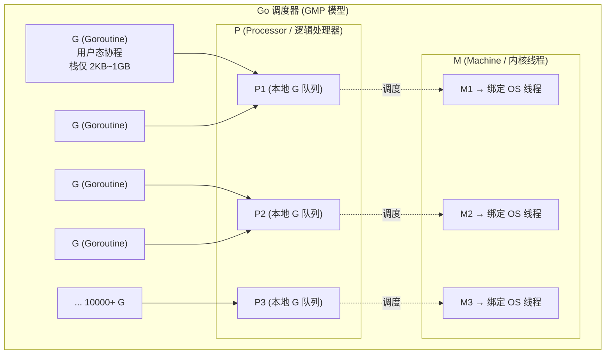
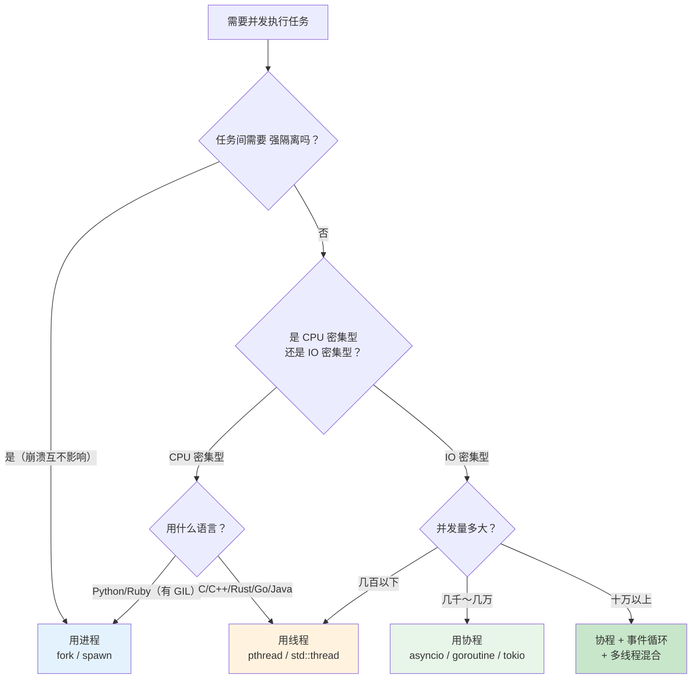
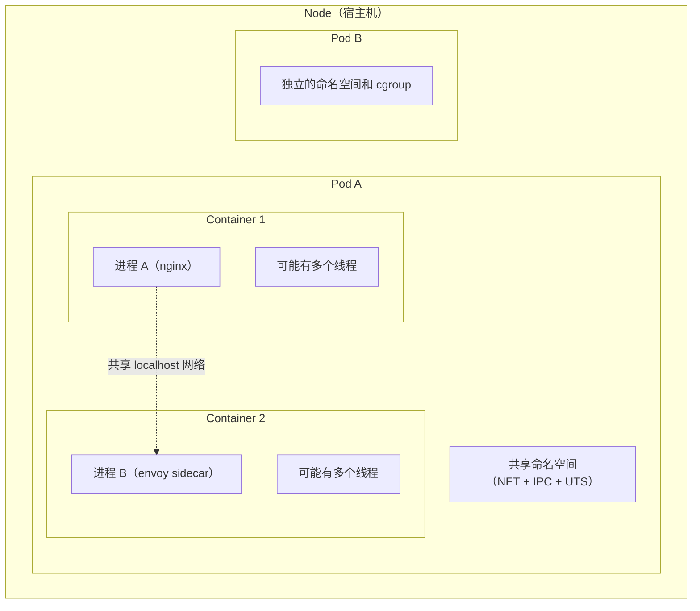

# 进程、线程与协程：三者的关系与演进

## 一句话理解

进程、线程、协程是操作系统和编程语言中三种**不同粒度的并发执行单元**。它们的关系可以用一句话概括：

> **进程是资源分配的最小单位，线程是 CPU 调度的最小单位，协程是用户态的"轻量级线程"。** 进程像一栋独立别墅（独享资源），线程像别墅里的室友（共享资源），协程像室友制定的高效任务清单（自己安排执行顺序）。

## 三者关系全景



## 核心差异对比

| 维度 | 进程 | 线程 | 协程 |
|------|------|------|------|
| **调度者** | 内核 CFS 调度器 | 内核 CFS 调度器 | **用户态程序自己** |
| **内存** | 完全独立，页表隔离 | 共享进程地址空间，独立栈 | 共享线程栈（或独立小栈） |
| **上下文切换代价** | ~1-10μs，涉及页表切换 | ~0.1-1μs，仅寄存器切换 | **~10-100ns**，纯函数调用级 |
| **创建/销毁代价** | 高（fork + exec） | 中（clone + 栈分配） | **极低**（几 KB 栈，用户态分配） |
| **通信方式** | 管道、共享内存、socket | 共享内存、mutex、条件变量 | 直接函数调用、channel |
| **隔离性** | ⭐⭐⭐⭐⭐ 最强 | ⭐⭐⭐ 中等 | ⭐ 最弱（同一线程内） |
| **一个崩溃的影响** | 不影响其他进程 | **可能拖垮整个进程** | 只影响当前线程 |
| **典型数量** | 数十～数百 | 数百～数千 | **数万～数十万** |
| **内核感知** | 是（task_struct） | 是（task_struct） | **否**（内核无感知） |
| **抢占性** | 抢占式 | 抢占式 | **协作式**（主动让出） |

## 一、进程：资源隔离的"容器"

进程我们已经在前两篇文章中详细讨论过了，这里做一个快速回顾：

```c
// 每个进程有独立的资源
// 三个进程互不影响
pid_t pid = fork();
if (pid == 0) {
    // 子进程 1：有自己的内存空间
    int x = 10;  // 这个 x 仅子进程可见
    x++;
    printf("child: x=%d\n", x);  // x=11
} else {
    // 父进程：完全不同的内存空间
    int x = 10;  // 这个 x 仅父进程可见
    printf("parent: x=%d\n", x);  // x=10
}
```

**进程的核心特点**：资源隔离，安全第一。一个进程崩溃不会影响其他进程。

### 动手观察：创建进程并在 Linux 上观察

我们来写一个程序创建两个子进程，然后在 Linux 上用工具观察它们。

在开始之前，先了解 `fork()` 做了什么：

> `fork()` 是 Linux 中**唯一**能创建新进程的系统调用。它做的事情就是把当前进程**完整复制一份**——代码、数据、堆、栈、文件描述符、寄存器状态……全部照抄。复制完之后，内核里就有了两个几乎一模一样的进程：原来的叫**父进程**，新复制出来的叫**子进程**。两个进程从 `fork()` 的下一行**同时**继续往下执行，唯一的区别就是 `fork()` 的返回值不同（父进程收到子进程的 PID，子进程收到 0）。

```c
// process_lab.c — 创建子进程并保持运行，方便观察
#include <stdio.h>
#include <unistd.h>
#include <sys/wait.h>

int main() {
    pid_t p1, p2;

    printf("Parent PID: %d\n", getpid());

    // ┌─────────────────────────────────────────────────────┐
    // │ fork() 最反直觉的地方：调用一次，返回两次           │
    // │                                                     │
    // │ 调用 fork() 之前，只有 1 个进程在跑（当前进程）     │
    // │ 调用 fork() 之后，变成了 2 个进程在跑：             │
    // │                                                     │
    // │   进程 A（原进程 = 父进程）                         │
    // │     └─ fork() 返回 子进程的 PID（比如 12346）       │
    // │        → p1 = 12346，所以 p1 > 0，走不进 if         │
    // │                                                     │
    // │   进程 B（新进程 = 子进程）                         │
    // │     └─ fork() 返回 0                                │
    // │        → p1 = 0，所以 p1 == 0，进入 if ！           │
    // │                                                     │
    // │ 两个进程从 fork() 的下一行继续执行，代码完全相同，  │
    // │ 唯一的区别就是 fork() 的返回值不同。                │
    // │ 所以 if (p1 == 0) 的意思是：                        │
    // │   "我现在是不是在子进程里？"                        │
    // └─────────────────────────────────────────────────────┘
    p1 = fork();
    if (p1 == 0) {
        // 能走到这里的，一定是子进程（p1 == 0）
        printf("Child 1: PID=%d, PPID=%d\n", getpid(), getppid());
        while (1) sleep(10);
    }

    // 能走到这里的，一定是父进程（p1 > 0，值是子进程 1 的 PID）
    // 子进程在上面 while(1) 里卡住了，不会下来

    p2 = fork();         // 父进程再次 fork，产生第二个子进程
    if (p2 == 0) {
        // 能走到这里的，一定是子进程 2
        printf("Child 2: PID=%d, PPID=%d\n", getpid(), getppid());
        while (1) sleep(10);
    }

    // 只有父进程能走到这里
    printf("Parent: I have two children: %d and %d\n", p1, p2);
    while (1) sleep(10);
}
```

```bash
# 编译并运行
gcc -o process_lab process_lab.c
./process_lab &

# === 观察 1：用 ps 查看进程树 ===
ps -eo pid,ppid,stat,comm | grep process_lab
# 输出示例：
# 12345  6789  S  process_lab    ← 父进程
# 12346 12345  S  process_lab    ← 子进程 1 (PPID=12345)
# 12347 12345  S  process_lab    ← 子进程 2 (PPID=12345)

# 看到三个独立进程，PPID 指向同一个父进程

# === 观察 2：用 pstree 看进程树更直观 ===
pstree -p 12345
# process_lab(12345)─┬─process_lab(12346)
#                     └─process_lab(12347)

# === 观察 3：每个进程有独立的内存空间 ===
# 查看父进程的内存
cat /proc/12345/status | grep -E "^VmRSS|^VmSize"
# VmSize:  2432 kB
# VmRSS:    640 kB

# 查看子进程 1 的内存——完全独立的一份
cat /proc/12346/status | grep -E "^VmRSS|^VmSize"
# VmSize:  2432 kB
# VmRSS:    640 kB
# 注意：VmSize 几乎一样（fork 时复制了地址空间，但 CoW 让实际物理内存共享直到写入）

# === 观察 4：每个进程有自己的 /proc 目录 ===
ls /proc/12345/fd/   # 父进程的文件描述符
ls /proc/12346/fd/   # 子进程 1 的文件描述符——独立的！

# === 观察 5：进程间隔离——一个进程崩溃不影响其他 ===
kill -9 12346        # 杀死子进程 1
ps -eo pid,ppid,comm | grep process_lab
# 父进程 (12345) 和子进程 2 (12347) 仍然在运行！
```

> 🔍 **关键发现**：三个进程有**三套独立的 /proc 目录**，三份独立的 `status`，三个独立的 PID。它们唯一的联系是 PPID（父子关系）。

## 二、线程：共享空间的"轻量级进程"

线程的出现是为了解决进程的两个痛点：
1. **创建太重**：fork 一个进程要复制页表、文件描述符表等
2. **通信太慢**：进程间通信必须通过内核（管道、共享内存等）

线程让多个执行流**共享同一个进程的资源**（内存、文件描述符等），只保持各自独立的执行上下文（PC、SP、寄存器）。

### 线程的内存模型



> 💡 **关键理解**：线程独享栈和寄存器，但共享堆、数据段、代码段。这意味着：
> - 一个线程 `malloc` 的内存，其他线程**可以直接读写**（无需 IPC）
> - 一个线程修改全局变量，其他线程**立即可见**（需要同步保护）
> - 一个线程 `free` 了某块内存，其他线程再访问就**崩溃**

### 实战：多线程共享内存

```c
#include <stdio.h>
#include <pthread.h>
#include <unistd.h>

// ╔═══════════════════════════════════════════════════════╗
// ║  SHARED MEMORY DEMO：两个线程抢着改同一个全局变量      ║
// ║                                                       ║
// ║  关键差异（对比 fork）：                               ║
// ║  - fork() 后父子进程各有一份独立的变量副本             ║
// ║  - pthread_create() 后所有线程共享同一份全局变量       ║
// ║  - 所以多线程不需要 pipe/shared-mem，直接读写就行      ║
// ║  - 但也因此需要 mutex 保护，否则数据会乱              ║
// ╚═══════════════════════════════════════════════════════╝

// 全局变量：放在进程的 .data 段
// 所有线程共享这"同一个"变量（不是各有一份！）
int shared_counter = 0;

// mutex（互斥锁）：保护共享变量的"门禁"
// 同一时刻只允许一个线程进入临界区
pthread_mutex_t mutex = PTHREAD_MUTEX_INITIALIZER;

void* worker(void* arg) {
    int id = *(int*)arg;        // 拿到线程编号

    for (int i = 0; i < 100000; i++) {
        // ┌── 临界区开始 ──────────────────────┐
        // │ 加锁：如果别的线程已经拿到了锁，    │
        // │       当前线程会在这里阻塞等待      │
        pthread_mutex_lock(&mutex);

        // shared_counter++ 翻译成 CPU 指令是三步：
        //   1. MOV  eax, [shared_counter]   // 从内存读到寄存器
        //   2. ADD  eax, 1                   // 寄存器 +1
        //   3. MOV  [shared_counter], eax   // 写回内存
        // 如果不加锁，两个线程可能同时执行步骤1，
        // 读到相同的旧值，最终 +1 只生效一次（丢失一次更新）
        shared_counter++;

        // │ 解锁：放行，让其他线程可以进来    │
        pthread_mutex_unlock(&mutex);
        // └── 临界区结束 ──────────────────────┘
    }
    printf("Thread %d done\n", id);
    return NULL;
}

int main() {
    pthread_t t1, t2;          // 线程句柄（类似 fd）
    int id1 = 1, id2 = 2;

    // pthread_create 不是 fork()！
    // - 它不会"复制"进程，而是创建一个新的执行流
    // - 新线程从 worker() 函数开始执行（不是从 create 的下一行）
    // - 新线程和主线程共享全局变量、堆、文件描述符
    // - 主线程继续往下走，不会停在 create
    pthread_create(&t1, NULL, worker, &id1);
    pthread_create(&t2, NULL, worker, &id2);

    // pthread_join：等待指定线程结束
    // 类似 waitpid() 等待子进程，但等的是线程
    // 如果不 join，主线程先退出 → 整个进程结束 → 所有线程被强杀
    pthread_join(t1, NULL);
    pthread_join(t2, NULL);

    // 如果 mutex 正确工作，结果一定是 200000
    // 如果去掉 lock/unlock，结果大概率 < 200000
    printf("Final counter: %d (expected 200000)\n", shared_counter);
    return 0;
}
```

> ⚠️ 如果去掉 `pthread_mutex_lock/unlock`，最终的 `shared_counter` 通常**小于** 200000。这是因为 `counter++` 不是原子操作（它分三步：读取 → 加1 → 写回），两个线程可能读到相同的值然后各自加1写回，导致"丢失了一次更新"。这就是**竞态条件（race condition）**。

### 线程的内核视角

在 Linux 中，线程和进程在内核层面**都是** `task_struct`。区别在于创建时 `clone()` 的参数。

> `clone()` 是 Linux 内核中**唯一**用来创建新执行流（进程/线程）的系统调用。`fork()` 和 `pthread_create()` 都是它的"包装"——它们底层调的都是 `clone()`，只是传入的标志位不同：
>
> - **都调用 `clone()`**：是的，`fork()` 和 `pthread_create()` 最终都走到 `clone()` 系统调用。
> - **区别在于 flags**：`clone()` 通过一堆 `CLONE_*` 标志位来决定"父子之间共享什么"。

| 上层接口 | 底层系统调用 | clone 标志 | 共享什么 | 结果 |
|----------|-------------|------------|---------|------|
| `fork()` | `clone(SIGCHLD, ...)` | 几乎无共享标志 | （几乎）无 | **独立进程** |
| `pthread_create()` | `clone(CLONE_VM \| CLONE_FS \| CLONE_FILES \| CLONE_SIGHAND, ...)` | 共享内存 + 文件系统 + fd + 信号 | 内存空间、文件系统信息、fd 表、信号处理 | **线程** |

**关键标志位含义**：

| 标志 | 含义 | 不设这个标志的效果（= fork 的行为） |
|------|------|-------------------------------------|
| `CLONE_VM` | 共享虚拟内存空间 | 父子各有独立的地址空间（写时复制） |
| `CLONE_FS` | 共享文件系统信息（root、pwd、umask） | 父子各有独立的 fs 信息 |
| `CLONE_FILES` | 共享文件描述符表 | 父子各有独立的 fd 表（但 fd 指向同一个内核文件对象） |
| `CLONE_SIGHAND` | 共享信号处理表 | 父子各有独立的信号处理函数设置 |
| `CLONE_THREAD` | 标记为同一线程组（共享 TGID） | 独立的线程组（独立的 PID） |

用一句话记住：

> `fork()` = `clone()` 加上"**什么都别共享**" → 出来的是进程  
> `pthread_create()` = `clone()` 加上"**能共享的全共享**" → 出来的是线程  
> 进程和线程在 Linux 里没有本质区别，只是"共享程度"不同。

理解了 `clone()` 的标志位之后，就能看懂线程在内核中的身份标识了。这里有一个**非常容易掉进去的坑**——`ps` 命令的列名在骗你。

#### 真相：内核里每个 task 只有一个 PID

内核给每个 `task_struct` 分配一个全局唯一的编号，就叫 **PID**。不管这个 task 是"进程"还是"线程"，在内核眼里都只是一个 `task_struct`，都有一个 PID。**不存在什么"SPID"，那是 `ps` 自己编的名字。**

#### 那 `/proc/<PID>/status` 里的 `Tgid` 又是什么？

当多个 task 用 `CLONE_THREAD` 标志创建时（即线程），它们共享同一个 **TGID**（Thread Group ID）。TGID 的值等于线程组中第一个 task（主线程）的 PID。这样用户空间就能通过 TGID 把一组线程归为一个"进程"。

#### 混乱的根源：`ps` 的列名

`ps` 为了用户友好，做了一个糟糕的命名决定：

| `ps` 的列名 | 实际对应的内核字段 | 真相 |
|-------------|-------------------|------|
| `ps` 的 `PID` 列 | **TGID** | `ps` 把 TGID 叫做 "PID"——它在骗你 |
| `ps -T` 的 `SPID` 列 | **PID**（内核真实的） | `ps` 被迫另起名字 "SPID" 来展示真正的内核 PID |

> 💡 **PID 和 SPID 不是两个不同的东西**——SPID 就是内核真正的 PID。`ps` 之所以要搞出一个 "SPID" 列名，纯粹是因为它已经霸占了 "PID" 这个列名去显示 TGID 了。这不是内核的锅，是 `ps` 的历史遗留命名问题。

#### 一张图看懂

```
ps -T -p 23456 的输出：
  PID   SPID   COMMAND
 23456  23456  thread_lab    ← 主线程：TGID=23456，内核PID=23456（两者相等）
 23456  23457  thread_lab    ← 子线程：TGID=23456，内核PID=23457
 23456  23458  thread_lab    ← 子线程：TGID=23456，内核PID=23458
  ↑      ↑
  │      └── SPID = 内核真实的 PID（每个线程唯一）
  └── ps 的 "PID" = 其实是 TGID（同一进程的所有线程都一样）

/proc/23456/task/ 目录下的子目录名：
  23456/  23457/  23458/  23459/
    ↑       ↑       ↑       ↑
    └── 这些就是内核真实的 PID，也就是 ps -T 里的 SPID
        主线程恰好 PID==TGID，子线程的 PID 和 TGID 不同
```

记住两条规则就够了：
- **内核层面**：每个线程有唯一的 PID，同组线程共享 TGID
- **`ps` 层面**：`ps` 的 "PID" = TGID，`ps -T` 的 "SPID" = 内核 PID

```bash
# 查看多线程进程的线程
ps -T -p <PID>
# SPID 列 = 每个线程真实的内核 PID
# PID  列 = 其实是 TGID（所有线程都一样）

# 或
ls /proc/<PID>/task/
# 每个子目录名 = 一个线程的内核 PID
```

### 动手观察：创建线程并在 Linux 上观察

把上面的 `shared_counter` 程序稍作修改，让线程持续运行，方便我们观察：

```c
// thread_lab.c — 创建 3 个线程并保持运行
#include <stdio.h>
#include <pthread.h>
#include <unistd.h>

void* worker(void* arg) {
    int id = *(int*)arg;
    printf("Thread %d: my TID (kernel PID) = %d\n", id, gettid());
    while (1) sleep(10);  // 挂起，方便观察
    return NULL;
}

int main() {
    pthread_t t1, t2, t3;
    int id1 = 1, id2 = 2, id3 = 3;

    printf("Main process PID: %d\n", getpid());

    pthread_create(&t1, NULL, worker, &id1);
    pthread_create(&t2, NULL, worker, &id2);
    pthread_create(&t3, NULL, worker, &id3);

    // 主线程也 sleep
    while (1) sleep(10);
}
```

```bash
# 编译（注意链接 pthread 库）
gcc -o thread_lab thread_lab.c -pthread
./thread_lab &

# === 观察 1：ps 默认只显示进程级别的信息 ===
ps aux | grep thread_lab
# user  23456  0.0  0.0   2560   960 pts/0  Sl  10:00  0:00 ./thread_lab
# 只看到 1 个进程！线程对 ps 默认不可见

# === 观察 2：ps -T 显示线程 ===
ps -T -p 23456
#   PID   SPID  STAT  COMMAND
# 23456  23456  Sl    thread_lab    ← 主线程
# 23456  23457  Sl    thread_lab    ← 线程 1（SPID 不同！）
# 23456  23458  Sl    thread_lab    ← 线程 2
# 23456  23459  Sl    thread_lab    ← 线程 3
# 注意：PID 相同（23456），但 SPID（线程 ID）不同！

# === 观察 3：/proc/<PID>/task/ 看线程 ===
ls /proc/23456/task/
# 23456/  23457/  23458/  23459/
# 每个子目录就是一个线程！

# 每个线程有自己独立的 status
cat /proc/23456/task/23457/status | grep -E "^Name|^Pid|^Tgid"
# Name:   thread_lab
# Tgid:   23456    ← 线程组 ID = 主线程 PID
# Pid:    23457    ← 这个线程自己的内核 PID

cat /proc/23456/task/23456/status | grep -E "^Name|^Pid|^Tgid"
# Name:   thread_lab
# Tgid:   23456
# Pid:    23456    ← 主线程：Pid == Tgid

# === 观察 4：线程共享文件描述符 —— 对比进程！===
ls -la /proc/23456/fd/           # 主进程视角的 fd
ls -la /proc/23456/task/23457/fd/ # 线程 1 的 fd
# 两个目录内容完全相同！—— 因为线程共享文件描述符表

# === 观察 5：用 htop 可视化（推荐！）===
# 按 F2 → Display options → 勾选 "Show custom thread names"
# 或直接：
htop -p 23456
# 按 H 键切换线程显示模式
# 可以看到一个进程下的多条线程，每条有自己的 CPU 占用

# === 观察 6：TOP 看线程 ===
top -H -p 23456
# 显示每个线程的 CPU 占用率

# === 观察 7：线程的内存是共享的 ===
# 所有线程的 /proc/<PID>/task/<TID>/status 中：
# VmRSS 主线程:   960 kB
# VmRSS 线程 1:   960 kB   ← 和主线程一样！
# VmRSS 线程 2:   960 kB   ← 和主线程一样！
# 因为 RSS 是进程级别的统计，线程只是读取了同一份数据
```

> 🔍 **关键发现**：
> - 4 个线程（1 主 + 3 子）只有 **1 个 PID**（用户视角），但内核视角有 **4 个 task_struct**
> - 文件描述符表**完全共享**——一个线程 `open()` 的文件，其他线程可以直接用 fd 号访问
> - 内存统计（VmRSS）是**进程级别**的，所有线程看到的值相同
> - `ps` 默认不显示线程，需要用 `-T` 或 `-L` 参数

## 三、协程：用户态的"协作式任务"

协程（Coroutine）是三者中最"年轻"的概念，但它的思想可以追溯到 1960 年代。近年随着 Go 语言 goroutine、Python asyncio、Kotlin coroutine 的流行，协程成为高并发编程的核心范式。

### 协程解决了什么问题

线程虽然比进程轻量，但仍然有瓶颈：

```bash
# 一台 8 核机器，跑 10000 个线程会怎样？
# 每个线程默认栈 8MB → 10000 × 8MB = 80GB 虚拟内存
# 加上上下文切换开销 → CPU 大部分时间在"切换"而非"执行"
# 这就是 C10K 问题的根源
```

协程的思路是：**把调度权从内核拿回用户态**。一个线程里可以跑成千上万个协程，协程之间**协作式**地让出执行权，切换代价几乎为零。

### 协程 vs 线程的核心区别



### 实战：Python 协程示例

```python
import asyncio
import time

# === 传统多线程方式（受 GIL 限制）===
def io_task_sync(n):
    """模拟 IO 密集型任务"""
    print(f"Task {n}: starting")
    time.sleep(1)  # 阻塞整个线程！
    print(f"Task {n}: done")

# 跑 3 个任务需要 3 秒（串行）
# 如果用 3 个线程，在 Python 中受 GIL 限制也跑不满

# === 协程方式 ===
async def io_task_async(n):
    """同样的任务，用协程"""
    print(f"Task {n}: starting")
    await asyncio.sleep(1)  # 让出控制权，不阻塞！
    print(f"Task {n}: done")

async def main():
    # 3 个任务"同时"跑，总耗时约 1 秒
    await asyncio.gather(
        io_task_async(1),
        io_task_async(2),
        io_task_async(3),
    )

# asyncio.run(main())
# 输出：
# Task 1: starting
# Task 2: starting
# Task 3: starting
# （约 1 秒后）
# Task 1: done
# Task 2: done
# Task 3: done
```

> 💡 `time.sleep(1)` vs `await asyncio.sleep(1)`：
> - `time.sleep(1)`：**阻塞整个线程**，这 1 秒内线程什么都干不了
> - `await asyncio.sleep(1)`：**挂起当前协程**，线程立即去执行其他协程，1 秒后再回来

### 实战：Go 语言的 Goroutine

Go 把协程做到极致——goroutine 是语言内置的一等公民：

```go
package main

import (
    "fmt"
    "sync"
    "time"
)

func worker(id int, wg *sync.WaitGroup) {
    defer wg.Done()
    fmt.Printf("Worker %d starting\n", id)
    time.Sleep(100 * time.Millisecond) // 模拟 IO
    fmt.Printf("Worker %d done\n", id)
}

func main() {
    var wg sync.WaitGroup

    // 轻松启动 10000 个 goroutine
    // 每个 goroutine 初始栈只有 ~2KB
    // 10000 × 2KB = 20MB，对比线程的 80GB
    for i := 0; i < 10000; i++ {
        wg.Add(1)
        go worker(i, &wg) // "go" 关键字创建 goroutine
    }

    wg.Wait()
    fmt.Println("All workers done")
}
```

Go 的 GMP 调度模型是实现高效率的关键：



Go 调度器要点：
- **G** = goroutine，用户态协程，数量可达数十万
- **M** = machine，对应一个操作系统线程，数量有限（默认最多 10000）
- **P** = processor，逻辑处理器，数量通常等于 CPU 核心数（`GOMAXPROCS`）
- Go 调度器在**用户态**完成 G 的调度，只在必要时才涉及内核

### 动手观察：创建协程并在 Linux 上观察

协程最有趣的特点是：**内核完全不知道它们的存在**。我们用 Python 和 Go 分别验证。

#### Python asyncio 协程观察

```python
# coroutine_lab.py — 创建 1000 个协程，观察 OS 视角
import asyncio
import os
import time

async def worker(n):
    """每个协程：睡 10 秒（非阻塞）"""
    print(f"Coroutine {n}: started")
    await asyncio.sleep(10)  # 让出控制权，不阻塞
    print(f"Coroutine {n}: done")

async def main():
    print(f"Process PID: {os.getpid()}")
    print(f"Press Ctrl+C after checking /proc/{os.getpid()}")

    # 创建 1000 个协程
    tasks = [asyncio.create_task(worker(i)) for i in range(1000)]
    print(f"Created {len(tasks)} coroutines")
    print("Now check another terminal...")

    await asyncio.gather(*tasks)

if __name__ == "__main__":
    asyncio.run(main())
```

```bash
# 终端 1：运行
python3 coroutine_lab.py &
# Process PID: 34567
# Created 1000 coroutines
# Now check another terminal...

# === 终端 2：观察 OS 视角 ===
PID=34567

# 1. ps 看进程数 —— 只有 1 个！
ps -T -p $PID
#   PID   SPID  STAT  COMMAND
# 34567  34567  Sl    python3
# （可能只有 1 个线程，或者极少数辅助线程）

# 2. 看线程数
ls /proc/$PID/task/ | wc -l
# 1  （或极少数，比如 1~3 个）
# 1000 个协程 → OS 只看到 1 个线程！

# 3. 看内存 —— 1000 个协程非常省内存
cat /proc/$PID/status | grep VmRSS
# VmRSS:   约 15-30 MB（1000 个协程！）
# 对比：如果 1000 个线程，仅栈就 1000×8MB = 8GB

# 4. 用 strace 看系统调用 —— 看不到协程切换
strace -p $PID -e clone,futex -f 2>&1 | head -20
# 只会看到很少的 futex 调用（事件循环），不会看到 clone（创建新线程）
```

#### Go goroutine 协程观察

```go
// goroutine_lab.go — 创建 10000 个 goroutine
package main

import (
    "fmt"
    "os"
    "os/signal"
    "sync"
    "syscall"
)

func main() {
    fmt.Printf("Process PID: %d\n", os.Getpid())
    fmt.Println("Press Ctrl+C to exit")

    var wg sync.WaitGroup

    // 创建 10000 个 goroutine
    for i := 0; i < 10000; i++ {
        wg.Add(1)
        go func(id int) {
            defer wg.Done()
            select {} // 永久阻塞，保持 goroutine 存活
        }(i)
    }

    fmt.Println("Created 10000 goroutines, check /proc now...")

    // 等待 Ctrl+C
    sigCh := make(chan os.Signal, 1)
    signal.Notify(sigCh, syscall.SIGINT, syscall.SIGTERM)
    <-sigCh
    fmt.Println("Exiting...")
}
```

```bash
# 终端 1：编译运行
go build -o goroutine_lab goroutine_lab.go
./goroutine_lab &
# Process PID: 45678
# Created 10000 goroutines, check /proc now...

# === 终端 2：观察 ===
PID=45678

# 1. 看线程数 —— Go 默认用 GOMAXPROCS 个线程
ls /proc/$PID/task/ | wc -l
# 输出类似 5~8（Go runtime 的少量系统线程）
# 10000 个 goroutine → 内核只看到几个线程！

# 2. 看内存 —— 惊人地少
cat /proc/$PID/status | grep -E "VmRSS|VmSize"
# VmSize:   约 400-800 MB  （虚拟内存，含预留的栈空间）
# VmRSS:    约 15-50 MB    （实际物理内存）
# 10000 个 goroutine 仅几十 MB 物理内存！

# 3. 对比：如果用 10000 个线程
# 仅线程栈就需要 10000 × 8MB = 80GB 虚拟内存
# 加上调度开销，CPU 大部分时间在做上下文切换

# 4. strace 验证——没有大量 clone 调用
timeout 3 strace -p $PID -c 2>&1
# 几乎看不到 clone() 系统调用
# Go runtime 用少量的 OS 线程 + 用户态调度
```

> 🔍 **关键发现**：
> - **1000 个 Python 协程** → OS 视角：1 个进程，1 个线程，~20MB 内存
> - **10000 个 Go goroutine** → OS 视角：1 个进程，5~8 个线程，~30MB 内存
> - 协程切换不经过内核，`strace` 看不到任何调度相关的系统调用
> - 这就是为什么协程能支撑 C10K/C100K 高并发——内核的开销被完全绕过了

## 四、C10K 到 C10M：三者的实际应用

并发编程的发展史，就是不断降低"每个连接的开销"：

| 时代 | 模型 | 每连接开销 | 10万连接所需内存 |
|------|------|-----------|----------------|
| Apache prefork | 一个进程一个连接 | ~10MB | ~1TB 💀 不可能 |
| Nginx / Tomcat NIO | 一个线程一个连接 | ~8MB 栈 | ~800GB 💀 不现实 |
| Netty / Node.js | 事件循环 + 少量线程 | ~几KB 状态 | ~几百MB ✅ |
| **Go / Rust tokio** | **协程 + 少量线程** | **~2KB goroutine** | **~200MB** ✅✅ |

```python
# 用 Python asyncio 轻松处理 10000 个并发连接
import asyncio

async def handle_client(reader, writer):
    data = await reader.read(1024)
    # 处理请求...
    writer.close()

async def main():
    server = await asyncio.start_server(
        handle_client, '0.0.0.0', 8888)
    # 10000 个连接，只需要 1 个线程！
    async with server:
        await server.serve_forever()

# 核心思想：
# 1 个线程 + 10000 个协程 = 10000 个并发连接
# 协程在 IO 等待时自动 yield，线程去处理其他协程
```

## 五、一张表看清三者的"该用谁"

| 场景 | 推荐 | 原因 |
|------|------|------|
| 需要强隔离，崩溃互不影响 | **进程** | Chrome 每个 tab 一个进程 |
| CPU 密集型计算（科学计算、视频编码） | **线程** | 利用多核，无 GIL 的语言 |
| IO 密集型（Web 服务、数据库代理） | **协程** | 高并发低开销 |
| 混合场景（Go 后端服务） | **协程 + 线程** | Go 的 GMP 模型 |
| Python CPU 密集 | **多进程** | 绕过 GIL |
| Python IO 密集 | **协程（asyncio）** | 单线程高并发 |
| C/C++ 高性能服务 | **线程 + 协程库** | libco、boost.fiber |

### 决策流程图



## 六、容器与 K8s 视角

在 Kubernetes 中，Pod 是调度的最小单位：



关键对应关系：
- **K8s Pod** = 一组共享 namespace 的**进程**
- **Container** = 一个被 cgroup 限制的**进程**（可能多线程）
- **应用代码内** = 可以用**协程**实现高并发（K8s 不感知协程）

> 💡 K8s 的资源限制（CPU request/limit）是针对**整个 Pod 的所有进程和线程**。如果你的 Go 服务在 Pod 里启动了 10000 个 goroutine，K8s 看到的是 1 个进程（几个线程），CPU 限制按 Pod 总额计算。

## 总结


一句话记住三者的关系：

> 进程是**操作系统**管理资源的方式，线程是**操作系统**调度 CPU 的方式，协程是**程序员**管理并发的方式。操作系统不知道协程的存在——在它眼里，一万个协程不过是几个线程在忙忙碌碌。

## 七、全景对比实验

把三个 lab 同时跑起来，用一张表总结你在 Linux 上观察到的差异：

| 观察项 | 进程 (process_lab) | 线程 (thread_lab) | 协程 (coroutine_lab) |
|--------|-------------------|-------------------|----------------------|
| `ps aux` 看到的数量 | 3 个进程 | 1 个进程 | 1 个进程 |
| `/proc/.../task/` 目录数 | 每个进程 1 个 | 1 个进程下有 4 个 | 1 个进程下 1~8 个 |
| 文件描述符是否共享 | ❌ 各自独立 | ✅ 完全共享 | ✅ 完全共享 |
| 内存是否共享 | ❌ 独立地址空间 | ✅ 共享堆/数据段 | ✅ 共享 |
| VmRSS 总量 | 3 × ~640KB ≈ 2MB | ~960KB（共享） | ~20MB（1000 协程） |
| `strace` 可见创建过程 | `clone()` 无特殊标志 | `clone(CLONE_VM\|...)` | **无 clone 调用** |
| 内核感知执行单元数 | 3 个 task_struct | 4 个 task_struct | 1 个 task_struct |
| 崩溃隔离 | ✅ 互相不影响 | ❌ 一个线程 segfault 全崩 | ❌ 协程 panic 可能拖垮线程 |

### 一图胜千言

```bash
# 在 Linux 上同时创建 3 个进程 / 3 个线程 / 3000 个协程
# 然后用以下命令并排观察：

# 终端 1：只看进程
watch -n 1 'ps -eo pid,ppid,nlwp,comm | head -20'
# nlwp = 线程数（number of light-weight processes）
# 协程程序 nlwp 很小，进程/线程程序 nlwp 为实际数量

# 终端 2：实时看内存
watch -n 1 'cat /proc/<PID>/status | grep -E "VmRSS|Threads"'

# 终端 3：看内核调度
vmstat 1
# 观察 cs (context switch) 列
# 大量线程 → cs 很高
# 大量协程 → cs 几乎不涨
```

---

> 📚 **延伸阅读**：
> - [Linux 进程管理详解](/linux/process-management/)
> - [`/proc` 文件系统详解](/linux/proc-filesystem/)
> - [Linux Namespace 详解](/linux/namespace/)
> - [cgroup v2 详解](/linux/cgroup/)
