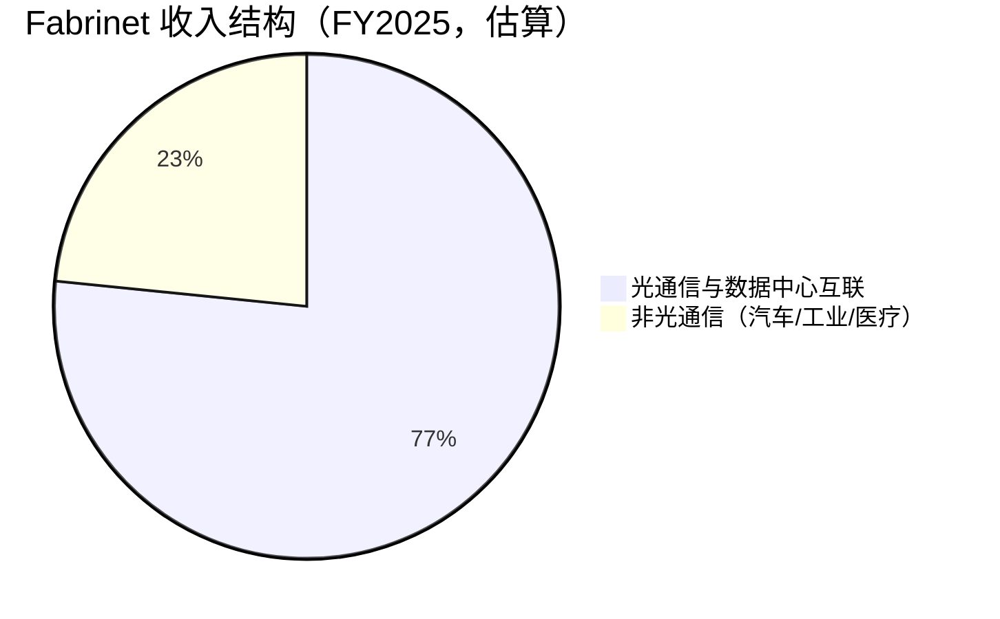
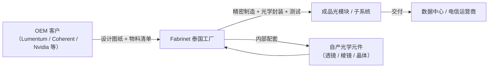

# Fabrinet（FN）基本面深度分析：AI 算力背后的"隐形冠军"

## 一、公司概览：不是芯片公司，却决定了算力上限

Fabrinet（纽交所代码：FN）是一家总部注册于开曼群岛、核心运营在泰国的**高复杂度光学与电子制造服务商**，成立于 1999 年。公司最独特的标签是——**它不卖自己的产品，但几乎所有高端光通信巨头的核心器件，都是它造的。**

简单理解：英伟达造 GPU，但 GPU 之间的高速互联需要光模块；光模块公司（如 Lumentum、Coherent）设计光模块，但**制造这些光模块里最精密的子系统和光学封装**——这件事，很大一部分是 Fabrinet 干的。

| 基本资料 | |
|:---|---|
| 公司全称 | Fabrinet |
| 股票代码 | NYSE: FN |
| 成立年份 | 1999 年（2000 年开始运营） |
| 总部（注册地） | 开曼群岛 |
| 核心运营基地 | 泰国（占制造面积 90% 以上） |
| CEO | Seamus Grady（2023 年上任） |
| 员工人数 | 16,457（LTM） |
| 制造面积 | 约 370 万平方英尺（泰国 330 万） |
| 商业模式 | 高端光学/电子制造服务（EMS），不持自有品牌 |

## 二、Fabrinet 到底做什么？——四个业务板块拆解

### 2.1 光通信与数据中心互联制造（核心支柱）

这是 Fabrinet 的绝对核心，也是它最深的护城河所在。公司为全球一线光通信 OEM（如 Lumentum、Coherent、Infinera 等）制造以下产品：

- **光收发器 / 转发器**（Transceivers / Transponders）——包括 400G、800G 和 **1.6T（配合英伟达 Blackwell）**光模块
- 可调谐激光器、调制器、光放大器
- **ROADM**（可重构光分插复用器）——光网络核心节点设备
- **有源光缆（AOC）**——数据中心内部 GPU 到 GPU 的高速互联

AI 数据中心里 GPU 集群之间的通信带宽越来越大，光模块速率从 400G → 800G → 1.6T 的迭代在加速。Fabrinet 卡位在这个链条的**精密制造环节**——它不负责设计，但负责把设计"造出来且造好"。

### 2.2 汽车电子与传感器

为汽车及 Tier-1 供应商制造高精度传感器与电子模块：

- 差压传感器、微型陀螺仪
- 燃油与环境相关传感器
- 应用于车辆安全、动力系统与智能化功能

### 2.3 工业激光系统

制造多种工业与科研用激光设备：

- 光纤激光器、固体激光器
- 二极管泵浦激光器
- 应用于半导体加工、精密制造、医疗设备

### 2.4 定制光学元件与精密玻璃制品

这是 Fabrinet 区别于普通 EMS（电子代工）厂商的关键能力——**它能自制核心光学元件**：

- 激光晶体、透镜、棱镜、反射镜
- 光学基板及专用组件
- 石英、熔融石英、硼硅酸盐等精密玻璃制品

这部分业务既能内部配套（整合到客户系统中），也可独立销售，增强了客户粘性。

## 三、关键财务数据：一家"真赚钱"的制造公司

与上一篇分析的 MaxLinear（持续亏损）不同，Fabrinet **正在盈利，且盈利能力不差**。

### 3.1 收入与盈利（LTM 至 2026 年 Q1）

| 指标 | 数值 | 评价 |
|------|------|------|
| **营业收入（LTM）** | $42.4 亿 | 持续增长 |
| **FY2025 全年收入** | $34.2 亿 | +19% YoY |
| **Q1 FY2026 收入** | $9.78 亿 | +22% YoY |
| **Q2 FY2026 指引** | $10.5–11.0 亿 | 强劲环比增长 |
| **毛利率** | 12.04% | 🟡 典型 EMS 水平，偏低 |
| **营业利润率** | 9.86% | 🟢 EMS 中属优秀 |
| **净利润率** | 9.94% | 🟢 接近 10%，优秀 |
| **净利润（LTM）** | $4.21 亿 | 🟢 |
| **每股收益（LTM）** | $11.64 | 🟢 |
| **EBITDA** | $4.80 亿 | 🟢 |

> 毛利率 12% 看起来低？对，这是制造服务业的特点。但 Fabrinet 能把 12% 的毛利做到近 10% 的净利——运营效率极高。作为对比，鸿海（富士康）的净利率只有 2-3%。

### 3.2 资产负债表——极度健康

| 指标 | 数值 | 评价 |
|------|------|------|
| 现金及等价物 | $9.45 亿 | 🟢🟢 极其充裕 |
| 总债务 | $443 万 | 🟢🟢 几乎零负债 |
| **净现金** | **+$9.41 亿** | 🟢🟢 每股净现金 $26.26 |
| 净资产 | $23.0 亿 | |
| 每股净资产 | $64.32 | |
| 流动比率 | 2.55 | 🟢 流动性充裕 |
| 速动比率 | 1.60 | 🟢 |

> 🔑 **这张资产负债表是 Fabrinet 最被低估的优势。** 近 10 亿美元净现金意味着即使行业下行，公司也能安然度过，甚至逆势回购或收购。

### 3.3 现金流——高投入高增长

| 指标 | 数值 |
|------|------|
| 经营性现金流（LTM） | $2.57 亿 |
| 资本支出 | −$2.11 亿 |
| **自由现金流** | **$4,581 万** |
| FCF/股 | $1.28 |

> ⚠️ FCF 很薄，但这是**主动选择**——公司正在大手笔扩建泰国产能以满足 AI 驱动的需求。CapEx 占经营现金流的 82%，一旦扩产周期结束，FCF 将大幅释放。

### 3.4 盈利能力指标

| 指标 | 数值 | 评价 |
|------|------|------|
| **ROE** | 19.99% | 🟢 接近 20%，优秀 |
| **ROIC** | **30.23%** | 🟢🟢 资本回报率极高 |
| ROA | 8.52% | 🟢 |
| 人均创收 | $257,337 | |
| 人均创利 | $25,580 | |

**ROIC 30% 是什么概念？** 这意味 Fabrinet 每投入 1 块钱的资本，一年能赚回 3 毛。在所有制造业公司中，这个水平属于顶尖梯队。高 ROIC 也说明公司的"护城河"确实存在——客户的高转换成本带来了定价权。

## 四、商业模式：为什么是"隐形冠军"？

### 4.1 它不是普通代工厂

很多人第一反应："这就是个泰国代工厂，跟富士康差不多。"——**错。**

| 维度 | 普通 EMS（富士康/捷普） | Fabrinet |
|------|------------------------|----------|
| 核心产品 | 消费电子组装（iPhone、PC） | **高精度光学子系统** |
| 技术门槛 | 中（规模化组装） | **高（精密光学封装 + 光纤对准）** |
| 良率要求 | 95-99% | **接近 100%（光学件报废即全损）** |
| 客户转换成本 | 低-中 | **极高（重新验证需 6-18 个月）** |
| 净利率 | 1-3% | **~10%** |
| 单客户依赖度 | 分散 | 相对集中 |

Fabrinet 做的不是"把零件拼起来"，而是"在微米级别把激光对准光纤、在真空中封装光学元件"——错一个微米，整个模块报废。这种能力不是随便哪个代工厂能在泰国外包出去的。

### 4.2 泰国制造 = 成本优势 + 地缘避险

Fabrinet 90% 以上的制造面积集中在泰国。在"去中国化"的全球供应链重构中，泰国成为最大受益国之一：

- ✅ 劳动力成本远低于中国和美国
- ✅ 成熟的制造业配套生态（30+ 年积累）
- ✅ 地缘政治中性——不受中美贸易战直接冲击
- ✅ 公司深耕 20 余年，工程师和技工团队稳定

## 五、AI 叙事：真龙头还是概念傍身？

Fabrinet 的 AI 故事非常直接而且**有实锤**：

### 5.1 1.6T 光模块——英伟达 Blackwell 的"血管"

英伟达 Blackwell GPU 平台需要 **1.6Tbps 光模块**来支持 GPU 之间的高速互联。Fabrinet 是这一代光模块的**核心制造合作伙伴**。

> 逻辑链：AI 训练需要更大的 GPU 集群 → GPU 之间需要更多带宽 → 需要更快的光模块（800G → 1.6T）→ Fabrinet 负责精密制造这些光模块的核心子系统。

这不是"蹭概念"——公司 FY2026 Q1 收入同比增长 22% 就是 AI 驱动的直接体现。

### 5.2 数据量级对比

| 指标 | 2022 年（AI 前） | 2026 年（当前） | 增长 |
|------|:-----------:|:-----------:|:----:|
| FY 收入 | $22.6 亿 | $42.4 亿（LTM） | +88% |
| 净利润率 | 8.9% | 9.94% | 经营杠杆初现 |
| 员工人数 | ~11,000 | 16,457 | +50% |
| 股价 | ~$125 | $654 | +423% |

### 5.3 与中国"易中天"的对标

Fabrinet 在美国的地位，相当于**新易盛 + 天孚通信 + 中际旭创**在中国的角色——光模块产业链的核心玩家。而且 Fabrinet 还是天孚通信的下游客户，说明了 Fabrinet 在整个光通信供应链中的枢纽位置。

## 六、股价与估值：贵得有道理？

### 6.1 市场表现

| 指标 | 数值 |
|------|------|
| 当前股价（2026.5.29） | $654.16 |
| 52 周涨幅 | **+182%** |
| 市值 | $234.4 亿 |
| 企业价值 | $225.0 亿 |
| Beta | 1.22（波动略高于市场） |
| 做空比例 | 6.69%（偏高） |
| 机构持股 | 110.56%（极高） |

### 6.2 估值指标

| 估值指标 | 数值 | 行业类比 | 判断 |
|----------|:----:|:------:|:----:|
| 市盈率（P/E，LTM） | 56.19x | | 🟡 贵 |
| 远期 P/E | 39.92x | EMS 15-25x，高成长 25-35x | 🟡 偏高 |
| 市销率（P/S） | 5.53x | EMS 1-2x | 🔴 贵 |
| 远期 P/S | 4.34x | | 🟡 |
| 市净率（P/B） | 10.17x | | 🟡 |
| P/FCF | 511x | | 🔴（CapEx 周期所致） |
| EV/EBITDA | 46.90x | | 🟡 偏高 |
| ROIC | **30.23%** | | 🟢🟢 优秀 |

### 6.3 分析师共识

- **9 位分析师，共识评级：Buy**
- **平均目标价：$749.11**
- **当前股价 vs 目标价：+14.5% 上行空间**

> 跟 MaxLinear（目标价低于现价 37%）完全不同的图景——分析师认为 Fabrinet 还能涨。

### 6.4 从哪里赚出这个估值？

市场给 Fabrinet 40 倍远期 PE，是因为假定它未来 2-3 年能维持 **20%+ 的年盈利增长**。从自由现金流反推，当前股价隐含的核心假设是：

> **未来中期自由现金流以 15-17% 的年复合增速增长，随后逐步回归稳态。**

在 AI 基础设施仍在扩张的背景下，这个假设并非离谱。但问题在于：

1. **CapEx 太高了。** $2.11 亿资本开支吃掉了 82% 的经营现金流。一旦订单增长放缓，这些产能可能变成闲置成本。
2. **客户集中风险。** 一个大客户（如 Lumentum）如果转单或自建产能，对 Fabrinet 冲击巨大。
3. **光模块周期。** 每一代光模块（400G → 800G → 1.6T）的放量窗口有限，在下一次迭代到来之前可能出现"青黄不接"。

## 七、风险因素

### 7.1 🔴 客户集中度风险

光通信 OEM 行业高度集中，Fabrinet 的大客户（Lumentum、Coherent/II-VI、Infinera 等）几家就贡献了大部分收入。任何一家转向自建或切换供应商，都会造成重大冲击。

### 7.2 🔴 光模块技术迭代风险

1.6T 光模块是当前的增长引擎。如果下一代（3.2T）的光学架构发生根本变化（如硅光子集成替代了分立光学封装），Fabrinet 的精密光学制造优势可能被绕开。

### 7.3 🟡 估值收缩风险

56 倍 PE 意味着市场对增长的容错率很低。如果某季业绩不及预期，"双杀"（盈利下跌 + 估值压缩）可能很痛。

### 7.4 🟡 CapEx 周期风险

公司正在大手笔扩建泰国产能。如果 AI 资本开支增速放缓（哪怕不萎缩，只是从一个增速降到另一个增速），扩出来的产能可能拉低利用率，侵蚀利润。

### 7.5 🟡 地缘政治风险

泰国虽然是地缘中立国，但东南亚区域局势（南海、缅甸）的不确定性始终存在。Fabrinet 几乎把所有鸡蛋放在了泰国这一个篮子里。

## 八、多空双方的核心论点

| | 多头论点 | 空头论点 |
|---|---|---|
| **AI 趋势** | 1.6T 光模块需求才刚开始放量，3.2T 在路上 | 光模块是周期性的，每一代产品的放量窗口有限 |
| **竞争壁垒** | 精密光学制造门槛极高，客户转换成本高 | 核心客户（Lumentum 等）可能自建产能 |
| **盈利能力** | ROIC 30%，净利率 10%，EMS 中的异类 | 毛利率仅 12%，本质上仍是低毛利的代工生意 |
| **资产负债表** | 近 $10 亿净现金，抗风险能力极强 | 现金多但 CapEx 大，FCF 薄如纸 |
| **估值** | 40x 远期 PE 配 20%+ 增长，PEG ~2x 合理 | 56x 历史 PE、5.5x P/S，以制造业标准极贵 |
| **股价动能** | +182% 有基本面支撑，分析师看好 | 做空比例 6.69%，若业绩 miss 可能引发踩踏 |

## 九、总结与评级

**Fabrinet 是 AI 光通信产业链中最具"隐形冠军"气质的公司。** 它不设计芯片，不写软件，但几乎所有高端光模块核心器件的精密制造都绕不开它。它拥有 30% 的 ROIC、10% 的净利率、近 10 亿美元的净现金，在 EMS 行业中属于绝对的顶尖梯队。

但它也不是没有隐忧：客户集中、技术迭代风险、CapEx 高企，以及 56 倍 PE 蕴含的市场高预期——任何一丝基本面瑕疵都可能触发估值回调。

| 维度 | 评级 | 说明 |
|------|:----:|------|
| 业务质量 | ⭐⭐⭐⭐ | 精密光学制造壁垒高，AI 光互联的核心卡位 |
| 财务健康 | ⭐⭐⭐⭐⭐ | 近零负债 + $9.4 亿净现金 + 30% ROIC |
| 成长性 | ⭐⭐⭐⭐ | AI 驱动需求强劲，FY2026 Q2 指引 $10.5-11 亿 |
| 估值合理性 | ⭐⭐⭐ | 56x PE 偏贵，但 40x 远期 PE 在成长股中尚可接受 |
| 管理层 | ⭐⭐⭐⭐ | 运营执行稳健，持续回购，产能扩张有序 |
| **综合** | **⭐⭐⭐⭐** | AI 光通信的优质标的，但建议等待更好的入场时机 |

> **与 MaxLinear 的对比：**
>
> | | MaxLinear（MXL） | Fabrinet（FN） |
> |---|---|---|
> | 盈利？ | ❌ 还在亏损 | ✅ 净利率 10% |
> | 现金状况？ | 🔴 净负债 | 🟢 $9.4 亿净现金 |
> | ROIC？ | −15% | 30% |
> | 估值矛盾？ | PEG 0.7 但无利润支撑 | 56x PE 但有实打实利润 |
> | 分析师态度？ | 目标价低于现价 37% | 目标价高于现价 14% |
>
> **两家都在 AI 光互联赛道上，但 Fabrinet 的基本面远比 MaxLinear 扎实。** 如果你看好 AI 基础设施的长期趋势，Fabrinet 是比 MaxLinear 安全得多的选择——当然，价格也更贵。

> **免责声明：** 本文仅为基本面分析，不构成任何投资建议。投资有风险，入市需谨慎。数据来源包括 Fabrinet 官方财报、StockAnalysis、新浪财经等公开信息，截止 2026 年 5 月底。

---

*在 AI 淘金热中，有人卖铲子，有人卖地图。Fabrinet 的角色更微妙——它不卖铲子，它帮铲子公司把最精密的那部分造出来。当所有人都在盯着英伟达的 GPU 出货量时，一个不为人知的泰国工厂，正在决定这些 GPU 能跑多快。*
