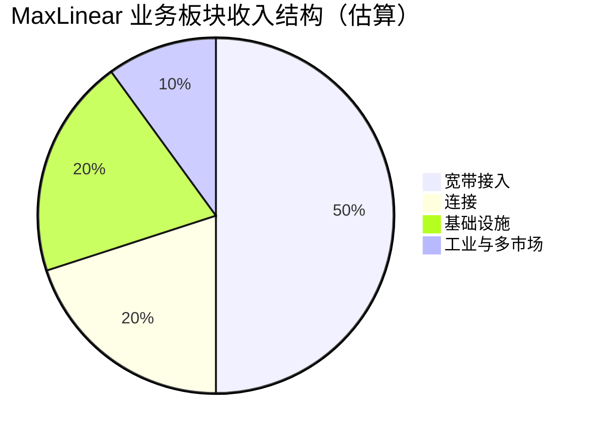
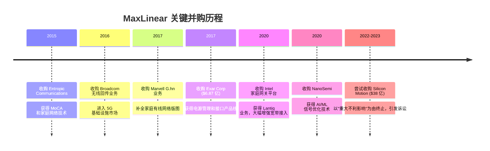

# MaxLinear（MXL）基本面深度分析：一家暴涨 700% 的芯片公司，值不值这个价？

## 一、公司概览：MaxLinear 是谁？

MaxLinear（纽交所代码：MXL）是一家总部位于加州 Carlsbad 的 **无晶圆厂（Fabless）半导体公司**，成立于 2003 年，2010 年在纽交所上市。公司的核心定位是：**用射频模拟和混合信号芯片让"多千兆连接"成为现实**。

简单说，你家里上网用的光猫/电缆调制解调器、5G 基站里的无线回传芯片、数据中心的光互联模块——这些设备的心脏部位，很可能就有一颗 MaxLinear 的芯片。

| 基本资料 | |
|:---|---|
| 公司全称 | MaxLinear, Inc. |
| 股票代码 | NYSE: MXL |
| 成立年份 | 2003 年 |
| 上市年份 | 2010 年（IPO 价 $14） |
| 总部 | Carlsbad, California, USA |
| CEO | Kishore Seendripu（联合创始人） |
| CTO | Curtis Ling（联合创始人） |
| 员工人数 | 1,115（2025 年） |
| 商业模式 | Fabless（设计芯片，外包给台联电等代工厂制造） |

## 二、产品线与业务版图

MaxLinear 的业务分为四大板块：

### 2.1 宽带接入（Broadband Access）——核心收入来源

这是 MaxLinear 最核心的业务，主要提供有线宽带接入的芯片方案：

- **DOCSIS 3.1 / 4.0 芯片**：用于有线电视网络的电缆调制解调器（Cable Modem）。2026 年 5 月，公司宣布其 Puma™ 8 平台率先实现 DOCSIS 3.1 VFI（Virtual Fiber Interface），向 DOCSIS 4.0 迈进。
- **光纤接入（PON）**：用于光纤到户（FTTH）的芯片方案。
- **MoCA / G.hn**：家庭内部网络连接技术，解决"最后一米"的有线组网。

### 2.2 连接（Connectivity）

- **Wi-Fi 芯片**：用于家庭网关、路由器等设备。
- **以太网**：多千兆以太网 PHY 和交换芯片。

### 2.3 基础设施（Infrastructure）

- **5G 无线回传**：2016 年从 Broadcom 收购的无线回传业务，用于基站之间的数据传输。
- **光互联**：用于数据中心内部和数据中心之间的高速光通信芯片（400Gbps+）。
- **AI 数据中心**：2026 年 5 月推出 Coronado™ 和 Laguna™ USB UART 解决方案，用于 AI 数据中心控制面互联。

### 2.4 工业与多市场（Industrial & Multi-Market）

- **电源管理芯片（PMIC）**：通过 2017 年收购 Exar 获得，应用于工业、汽车等领域。
- **接口芯片**：串行收发器、UART 等。

> 注：公司未单独披露各板块的精确收入占比，上图为基于公开信息的估算。

## 三、关键财务数据

### 3.1 收入与盈利（LTM，截至 2026 年 Q1）

| 指标 | 数值 | 评价 |
|------|------|------|
| **营业收入（LTM）** | $5.089 亿 | 同比有所恢复 |
| **2025 全年收入** | $4.68 亿 | 较 2024 年下滑 |
| **Q1 2026 收入** | $1.372 亿 | 单季稳健 |
| **毛利率** | 57.16% | 🟢 良好，Fabless 典型水平 |
| **营业利润率** | −15.89% | 🔴 深度亏损 |
| **净利润** | −$1.321 亿 | 🔴 持续亏损 |
| **每股收益（EPS）** | −$1.52 | 🔴 |
| **EBITDA** | −$3,710 万 | 🔴 |
| **自由现金流** | +$1,015 万 | 🟡 勉强为正 |

**核心矛盾：毛利率 57% 不差，但运营费用过高导致持续亏损。** 这不是一家"产品卖不出去"的公司，而是一家"花钱比赚钱快"的公司。

### 3.2 资产负债表

| 指标 | 数值 | 评价 |
|------|------|------|
| 现金及等价物 | $6,108 万 | 🟡 偏少 |
| 总债务 | $1.512 亿 | 🟡 可控 |
| 净现金 | −$9,010 万 | 🔴 净负债 |
| 净资产（Book Value） | $4.542 亿 | |
| 每股净资产 | $5.07 | |
| 流动比率 | 1.70 | 🟢 流动性充足 |
| 债务/权益 | 0.33 | 🟢 杠杆不高 |
| 利息覆盖率 | −8.30 | 🔴 利润不够付利息 |

### 3.3 现金流

| 指标 | 数值 |
|------|------|
| 经营性现金流（LTM） | +$2,215 万 |
| 资本支出 | −$1,199 万 |
| **自由现金流** | **+$1,015 万** |
| 折旧与摊销 | $4,378 万 |

自由现金流勉强为正——公司靠折旧摊销"撑"出了正现金流，实际经营仍处于盈亏边缘。

## 四、成长史：一家"并购整合型"芯片公司

MaxLinear 的成长高度依赖并购，历史上几笔关键交易塑造了今天的业务格局：

### 收购的双刃剑

**正面：**
- 通过收购 Intel 家庭网关部门（原 Lantiq），MaxLinear 获得了 DOCSIS 和 PON 的核心技术和客户关系，成为宽带接入领域的重要玩家。
- Exar 的收购带来了电源管理产品线，实现了业务多元化。

**负面：**
- 频繁收购积累了 **商誉和无形资产**，增加了摊销压力。
- 2022 年试图以 $38 亿收购 Silicon Motion（一家 NAND 闪存控制器公司），最终在 2023 年毁约，不仅损失了交易费用，还面临法律纠纷和声誉损害。**这暴露了管理层的"并购冲动"——在自身盈利能力尚未稳定的情况下急于蛇吞象。**

## 五、行业地位与竞争格局

MaxLinear 所在的市场高度分散但竞争者强大：

| 业务领域 | MaxLinear 地位 | 主要竞争对手 |
|----------|:------------:|--------------|
| 宽带接入（DOCSIS/PON） | 核心玩家 | Broadcom、MediaTek |
| Wi-Fi 芯片 | 中小玩家 | Broadcom、Qualcomm、MediaTek |
| 5G 无线回传 | 利基玩家 | Broadcom、Marvell |
| 光互联 | 新兴力量 | Marvell、Broadcom、Credo |
| 电源管理 | 中小玩家 | TI、ADI、MPS、Renesas |

**关键判断：MaxLinear 在所有业务线上都面临着比它大 10-100 倍的竞争对手。** Broadcom 的市值超过万亿，而 MaxLinear 只有 83 亿。MaxLinear 的生存策略是"在大厂不重视的细分市场做到最好"——但这意味着天花板相对有限。

## 六、股价与估值：最大的危险信号

### 6.1 股价暴涨之谜

| 指标 | 数值 |
|------|------|
| 当前股价（2026.5.29） | $92.93 |
| 52 周涨幅 | **+713%** |
| 市值 | $83.2 亿 |
| 企业价值 | $84.1 亿 |
| Beta | 3.96（极高波动） |

股价在一年内涨了 7 倍，但同期公司仍在亏损。这背后可能的驱动因素：

1. **AI 概念溢出效应**：市场将 AI 数据中心的"互联需求"叙事投射到了 MaxLinear 身上（公司确实推出了面向 AI 数据中心的新品）。
2. **宽带升级周期**：DOCSIS 4.0 和 Wi-Fi 7 的升级周期预期。
3. **小盘股 + 高 Beta 的动量效应**：85% 机构持股、3.34% 做空比例带来挤压空间。

### 6.2 估值指标——贵得离谱

| 估值指标 | 数值 | 行业合理区间 | 判断 |
|----------|:----:|:----------:|:----:|
| 市销率（P/S） | 16.35x | 3-8x | 🔴 极贵 |
| 远期 P/S | 13.06x | | 🔴 |
| 远期 P/E | 62.33x | 15-25x | 🔴 |
| 市净率（P/B） | 18.32x | 3-6x | 🔴 |
| P/FCF | 819x | 20-40x | 🔴🔴 |
| PEG | 0.70 | <1.0 为佳 | 🟢 表面合理 |

**PEG 为 0.70 看起来不贵——但这依赖于分析师对未来盈利增长的高预期。** 而当前公司仍在亏损，所谓的"增长"尚未兑现。PEG 低是因为 E（盈利）从一个极低的基数出发——这是典型的"估值陷阱"指标。

### 6.3 分析师分歧

- **11 位分析师共识评级：Buy**
- **平均目标价：$58.27**
- **当前股价 vs 目标价：溢价 37.3%**

> 🚨 即便给出"买入"评级的分析师，也认为当前股价高估了近 40%。这意味着要么市场知道一些分析师没看到的东西，要么这就是一个泡沫。

## 七、AI 叙事：真材实料还是概念炒作？

MaxLinear 近期最火爆的概念是 **"AI 数据中心互联"**。公司在 2026 年 5 月宣布了两款面向 AI 数据中心的产品：

- **Coronado™ USB UART**：用于 AI 服务器控制面互联
- **Laguna™ USB UART**：同类产品

此外，公司的光互联芯片（400Gbps+）确实受益于 AI 数据中心对高速互联的需求。

### 冷静分析：

| AI 相关利好 | 现实约束 |
|-------------|----------|
| 数据中心光互联需求增长 | MaxLinear 在该领域份额远小于 Marvell/Broadcom |
| AI 服务器内部互联 | USB UART 是辅助性产品，并非 AI 算力核心 |
| 算力爆发 → 网络升级 → 宽带升级 | 传导链条长，短期兑现难度大 |

**结论：AI 对 MaxLinear 的利好是真实的，但被市场情绪放大了。** 公司并不会因为 AI 而变成下一个英伟达——它的本质仍然是宽带接入芯片公司，AI 最多贡献 10-20% 的增量收入。

## 八、风险因素

### 8.1 🔴 估值泡沫风险

P/S 16x、P/FCF 819x、分析师目标价低于现价 37%——这是最直接的风险。一旦市场情绪逆转，高 Beta（3.96）意味着下跌会同样剧烈。

### 8.2 🔴 持续亏损，盈利时间表不明确

公司已连续多季亏损，营业利润率 −16%。如果宽带升级周期（DOCSIS 4.0 / Wi-Fi 7）延迟或不及预期，"扭亏为盈"的叙事将被打破。

### 8.3 🔴 客户集中度高

宽带接入芯片的主要客户是有线电视运营商（Comcast、Charter 等）和网关设备商，客户集中度高。失去一个关键客户将对收入造成重大冲击。

### 8.4 🟡 收购整合风险

历史上 MaxLinear 通过大量收购构建业务版图，但收购后的整合风险、商誉减值风险始终存在。Silicon Motion 的失败收购更是暴露了管理层在资本配置上的激进倾向。

### 8.5 🟡 竞争风险

Broadcom、Marvell、Qualcomm、MediaTek 在每一条产品线上都有布局且规模优势巨大。MaxLinear 必须在技术上持续领先才能守住利基市场。

### 8.6 🟡 半导体周期风险

半导体行业具有强周期性。如果宏观经济下行导致运营商削减资本开支，宽带基础设施的芯片需求将直接受冲击。

## 九、投资框架：多空双方的核心论点

| | 多头论点 | 空头论点 |
|---|---|---|
| **行业趋势** | DOCSIS 4.0 + Wi-Fi 7 + AI 数据中心三重升级周期叠加 | 升级周期可能不如预期快，宽带开支有周期性 |
| **公司地位** | 宽带接入芯片的核心供应商，深度绑定运营商 | Broadcom 等巨头随时可以加大投入碾压 |
| **盈利能力** | 收入增长将很快覆盖固定成本，经营杠杆即将释放 | 连续亏损多年，"扭亏"一说再而衰三而竭 |
| **估值** | PEG 仅 0.70，从增长角度看并不贵 | P/S 16x、P/FCF 819x，以任何标准都极贵 |
| **股价动能** | AI 叙事 + 宽带升级催化 + 高 Beta 上涨惯性 | 已涨 713%，做空比例 3.34%，回调随时发生 |
| **管理层** | 经验丰富，并购整合能力强 | Silicon Motion 毁约事件暴露判断力问题 |

## 十、总结与评级

**MaxLinear 是一家产品扎实、毛利率健康、但尚未证明自己能持续盈利的半导体公司。** 它所在的宽带接入市场有真实的升级需求（DOCSIS 4.0、Wi-Fi 7、光纤到户），但它必须在强大的竞争对手环伺中挤出一条路。

当前 $92.93 的股价和 $83 亿的市值，意味着市场在为一个"完美情况"定价——三重升级周期同时爆发、AI 数据中心带来额外增量、公司成功扭亏为盈。**任何一个环节不及预期，股价都有大幅回调的风险。**

| 维度 | 评级 | 说明 |
|------|:----:|------|
| 业务质量 | ⭐⭐⭐ | 产品有真实需求，但在强大对手面前天花板有限 |
| 财务健康 | ⭐⭐ | 毛利率尚可，但持续亏损，净负债状态 |
| 成长性 | ⭐⭐⭐ | 宽带升级 + AI 提供中期增长动力 |
| 估值合理性 | ⭐ | P/S 16x、P/FCF 819x，远超合理区间 |
| 管理层 | ⭐⭐⭐ | 技术出身，但并购决策有瑕疵 |
| **综合** | **⭐⭐** | 好公司 ≠ 好股票，当前价格透支了太多乐观预期 |

> **免责声明：** 本文仅为基本面分析，不构成任何投资建议。投资有风险，入市需谨慎。文中数据来源包括 MaxLinear 官方财报、Wikipedia、StockAnalysis 等公开信息，截止 2026 年 5 月底。

---

*MaxLinear 的故事是一个经典的"好公司碰上坏价格"案例。在华尔街，你不仅要判断一家公司好不好，还要判断市场为这个"好"付了多少钱。而当前市场为 MaxLinear 付的钱，需要一切都完美地如愿以偿。*
