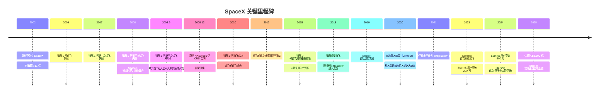
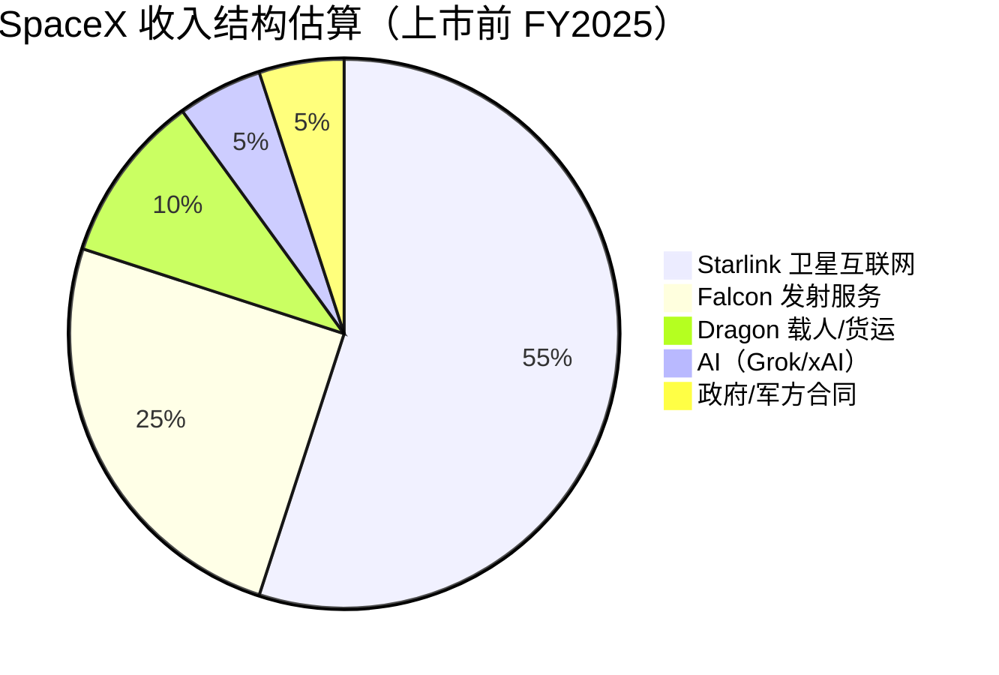
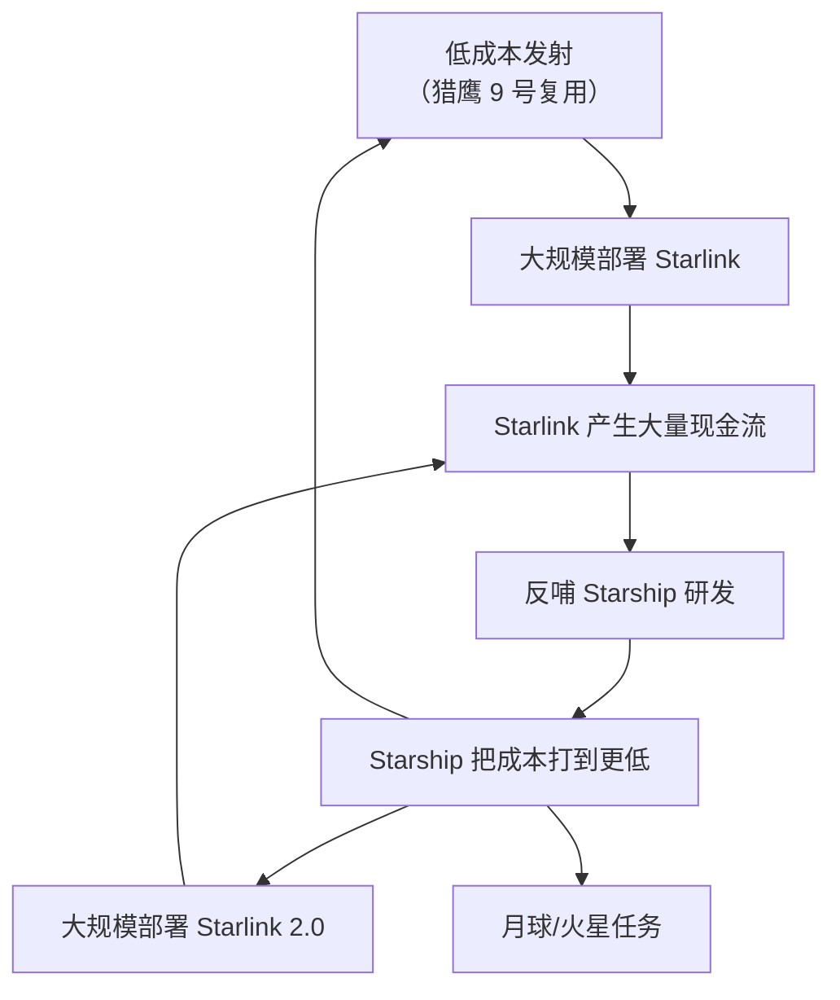

# SpaceX（SPCX）深度分析：改写航天史的万亿巨头，值不值得押注？

## 一、公司概览：SpaceX 是谁？

SpaceX（全称 Space Exploration Technologies Corp.，纳斯达克代码：**SPCX**）是一家由 **Elon Musk 于 2002 年创立**的航天与科技公司，总部位于德州 Starbase。22 年间，它从一家差点破产的火箭创业公司，成长为**全球市值最高的上市公司之一**。2026 年 6 月 12 日，SpaceX 在纳斯达克正式挂牌上市，首日即成为市值突破 $2 万亿的巨无霸。

SpaceX 的核心使命是：**让人类成为多行星物种**。但它的商业逻辑同样清晰——用可重复使用火箭把发射成本打到地板价，然后用星链（Starlink）建立一个覆盖全球的卫星互联网帝国，最终用星舰（Starship）殖民火星。

| 基本资料 | |
|:---|---|
| 公司全称 | Space Exploration Technologies Corp. |
| 股票代码 | **NASDAQ: SPCX**（2026 年 6 月 12 日上市） |
| 成立年份 | 2002 年 |
| 创始人 & CEO | Elon Musk |
| 总裁 & COO | Gwynne Shotwell（2008 年加入，实际运营操盘手） |
| 总部 | Starbase, Texas, USA（原 Hawthorne, CA） |
| 员工人数 | 约 22,000 |
| 主要产品 | Falcon 9、Falcon Heavy、Dragon、Starlink、Starship、Grok（AI） |
| 上市状态 | **纳斯达克上市（2026.6.12）** |
| 当前市值 | 约 $2.11 万亿（截至 2026.6.12 收盘） |
| 当前股价 | $160.95 |
| IPO 参考价 | $135.00 |
| 总股本 | 约 130.9 亿股 |

## 二、历史与关键里程碑：四次濒死，四次重生

SpaceX 的历史就是一部"从濒死到封神"的剧本。没有这家公司，美国在 2011 年航天飞机退役后到 2020 年之间，甚至没有能力把宇航员送入太空。



### 🔑 转折点：2008 年的那个秋天

2008 年 9 月 28 日，SpaceX 进行了猎鹰 1 号的第四次发射。前三次全部失败，公司账上只剩最后一次发射的钱。如果这次再失败，SpaceX 就关门了。

**第四次发射成功了。** SpaceX 成为人类历史上第一家将液体燃料火箭送入轨道的私人公司。同年 12 月，NASA 授予 SpaceX 一份 $16 亿的国际空间站补给合同——这笔钱救了 SpaceX 的命。

> 一个细节：马斯克后来透露，NASA 那份合同的签署日期，和他个人破产之间只差几天。

## 三、业务板块深度拆解

SpaceX 的业务可以分成四大板块。每一个板块单独拿出来，都足以撑起一家数十亿甚至数百亿美元的公司。



### 3.1 🚀 发射服务：全球航天业的"价格屠夫"

SpaceX 的立身之本。核心产品是**猎鹰 9 号（Falcon 9）**和**猎鹰重型（Falcon Heavy）**。

| 火箭型号 | 近地轨道运力 | 发射价格 | 复用能力 | 竞争对手同类价格 |
|----------|:---------:|:------:|:------:|:-------------:|
| **Falcon 9** | 22.8 吨 | $6,700 万 | 一级可复用 20+ 次 | ULA Atlas V: $1.1 亿 |
| **Falcon Heavy** | 63.8 吨 | $9,700 万 | 三个助推器均可复用 | SLS: $20 亿+ |
| **Starship（研发中）** | 100–200 吨 | 目标 <$1,000 万 | 完全可复用 | — |

**2024 年 SpaceX 执行了超过 130 次轨道发射，占全球发射总量的 50% 以上。** 也就是说，地球上每两次火箭发射，就有一次是 SpaceX 的。

经济逻辑极其简单：
- 传统火箭：一次性使用，每次发射要重新造一枚火箭 → 成本 $1–4 亿
- 猎鹰 9 号：一级回收后翻新复用 → 单次边际成本低至 $1,500 万以下

**复用不是噱头，是商业模式的革命。** 截至 2025 年底，猎鹰 9 号的一级助推器已实现单枚复用超过 25 次。SpaceX 把发射变成了类似航空公司的运营模式——不是每次都买新飞机，而是让同一架飞机反复飞。

### 3.2 🛰️ Starlink：卫星互联网帝国

Starlink 是 SpaceX 的"现金牛"——或者说，正在成为现金牛。

**核心数据：**

| 指标 | 数值 |
|------|------|
| 在轨卫星数量 | 约 7,000+ 颗（全球最多） |
| 活跃用户 | 500 万+（2024 年底） |
| 覆盖国家/地区 | 100+ |
| 用户月费 | $120（美国住宅）/ $50–80（国际） |
| 终端硬件价格 | $599 → $349 → $299（持续降价） |
| 2024 年收入估算 | $70–90 亿 |
| 2026 年收入预期 | $120–150 亿（部分分析师预测） |
| 已实现正现金流 | 是（2024 年确认） |

**Starlink 的商业模式是典型的"前期巨亏砸基建，后期躺着收订阅费"：**


**Starlink 的真正优势不是网速快，而是"哪里都能用"：**
- 偏远农村：没有光纤覆盖 → Starlink 是唯一选择
- 飞机/邮轮/房车：移动中的高速互联网
- 战时通讯：乌克兰战争证明，Starlink 在极端环境下不可替代
- 海事/航空 B2B：航空公司 WiFi、远洋货轮通讯 → 高利润率企业客户

> 💡 Starlink 最被低估的价值：它不是要和城市光纤竞争，而是要吃掉"光纤永远到不了"的那个市场。这个市场的规模大约是 $1,000–2,000 亿/年。

### 3.3 🚀 Starship：要么改变一切，要么烧光一切

Starship 是 SpaceX 正在开发的**超级重型运载火箭**，也是人类有史以来最大的火箭。它的参数本身就是科幻级别：

| 指标 | Starship | 土星五号（登月火箭） | SLS（NASA 新火箭） |
|------|:------:|:----------------:|:---------------:|
| 高度 | 121 米 | 110 米 | 98 米 |
| 近地轨道运力 | 100–200 吨 | 118 吨 | 95 吨 |
| 完全可复用？ | ✅ | ❌ | ❌ |
| 单次发射成本目标 | <$1,000 万 | $12 亿（通胀调整） | $20 亿+ |

**Starship 的意义超越了发射市场：**
1. **把每公斤入轨成本降到 $100 以下**（现在是 $2,000-3,000/kg），彻底改变太空经济
2. **在轨加油技术**——Starship 可以在太空中互相加油，这意味着能去月球、火星甚至更远
3. **大规模部署 Starlink 2.0**——V3 卫星更大更重，只有 Starship 能批量发射
4. **NASA 阿尔忒弥斯登月计划**——SpaceX 赢得了 NASA $29 亿合同，用 Starship 改造版作为月球着陆器

> ⚠️ Starship 是 SpaceX 最大的"赌注"和最大的风险。如果成功，SpaceX 将成为人类历史上第一家实现行星际运输的公司；如果失败，数十亿美元的研发投入将血本无归。截至 2026 年 6 月，Starship 已完成多次试飞，实现了超重型助推器的"筷子夹火箭"回收，但上面级（星舰本体）的完整回收尚未实现。

### 3.4 🐉 Dragon：NASA 的生命线

龙飞船（Dragon）是 SpaceX 的载人和货运飞船。自 2011 年航天飞机退役后，NASA 一度只能依赖俄罗斯联盟号飞船送宇航员上天（票价：$8,600 万/座位）。SpaceX 的 Dragon 用 $5,500 万/座位的价格拿回了这个能力。

| 任务类型 | 累计次数 | 客户 |
|----------|:------:|------|
| NASA 货运补给（CRS） | 30+ | NASA |
| NASA 载人任务（Crew） | 10+ | NASA |
| 私人太空任务 | 3+ | Axiom Space、Jared Isaacman 等 |

Dragon 不是 SpaceX 最大的收入来源（每年约 $20–30 亿），但它有特殊的战略价值：**它是 NASA 目前唯一认证的美国载人飞船。** 波音的 Starliner 一再延期，SpaceX 几乎垄断了美国的载人航天能力。

### 3.5 🤖 AI 业务：Grok 与 xAI

上市文件中披露，SpaceX 已整合了 Elon Musk 旗下 AI 初创公司 xAI 的业务。公司拥有第三个业务板块：**AI 平台**。

| AI 业务组成 | 说明 |
|------------|------|
| **Grok** | 前沿大语言模型（LLM），对标 ChatGPT 和 Gemini |
| **AI 解决方案** | 面向消费者和企业的 AI 产品 |
| **X 平台** | 实时信息、娱乐与言论自由社交平台 |
| **AI 算力基础设施** | 自建 AI 计算集群 |

AI 业务目前占收入比较小（约 5%），但增长极快，且与 SpaceX 的卫星互联网存在协同：Starlink 可以为全球 AI 推理节点提供低延迟连接，而 AI 又能优化 Starlink 的卫星网络调度。

> ⚠️ 这个架构意味着上市后的 SpaceX 是一个"航天 + 卫星互联网 + AI"的三合一平台，类似 Musk 商业帝国的"旗舰上市公司"。

## 四、财务分析（基于上市披露数据）

SpaceX 上市后首次公开了完整财报。以下数据来自 SEC 文件和市场公开信息。

### 4.1 收入与盈利（截至上市前最新报表）

| 指标 | 数值 | 评价 |
|------|------|------|
| **营业收入（TTM）** | 约 $192.3 亿（基于 EV/Sales 反推） | 🟢 高速增长 |
| **收入增速（YoY）** | **33.24%** | 🟢🟢 极高增速 |
| **毛利率** | 48.83% | 🟢 扎实，航天+互联网混合模式 |
| **营业利润率（EBIT）** | −21.10% | 🔴 深度亏损 |
| **净利润率** | −45.00% | 🔴 大幅亏损 |
| **每股收益（FWD EPS）** | −$0.64 | 🔴 仍在烧钱 |
| **ROE** | −132.79% | 🔴 巨额投资拉低回报 |
| **ROA** | −8.51% | 🔴 |

> 🚨 **关键矛盾：收入增速 33%+ 非常强劲，毛利率近 49% 也不差，但公司仍在巨亏。** 这不是因为产品卖不出去，而是因为 Starship 研发、Starlink 基建和 AI 算力集群的投入极其巨大。SpaceX 正在同时推进三个资本密集型项目。

### 4.2 资产负债表——上市后首次公开

| 指标 | 数值 | 评价 |
|------|------|------|
| 现金及等价物 | $236.8 亿 | 🟢🟢 极其充裕（IPO 融资注入） |
| 总债务 | $306.0 亿 | 🟡 有负债，但可控 |
| 净现金 | −$69.2 亿 | 🟡 净负债状态 |
| 企业价值（EV） | $2.12 万亿 | |
| 每股净资产（Book Value） | 约 $5.96 | |
| 市净率（P/B） | 27.02x | 🔴 极高 |

> 🔑 SpaceX 上市前几乎无负债，上市后账面出现了 $306 亿债务。这可能与 IPO 时的资本结构调整有关——公司可能在上市前进行了债务融资以优化资本结构，或整合了 xAI 和 X 平台的相关负债。

### 4.3 现金流（估算）

| 指标 | 估计 |
|------|------|
| 经营性现金流 | 估计仍为负值（Starlink 基建 + Starship 研发） |
| 资本支出 | 极高（Starlink 补网 + Starship 工厂 + AI 算力） |
| **自由现金流** | **大概率仍为负** |

### 4.4 盈利能力指标

| 指标 | 数值 | 评价 |
|------|------|------|
| Altman Z-Score | −0.45 | 🔴 财务压力区（高风险区间） |
| 毛利率 | 48.83% | 🟢 良好 |
| 净利率 | −45.00% | 🔴 巨亏 |

> ⚠️ Altman Z-Score 为 −0.45（低于 1.8 的警戒线），这主要是因为公司处于高速扩张期，资产规模相对于盈利能力过高。这是成长型公司的典型特征，不代表破产风险——但确实说明公司目前依靠资本市场输血。

## 五、商业模式与护城河：为什么没人追得上？

### 5.1 🔒 护城河一：发射成本领先 10 年以上

SpaceX 的发射成本已经做到了全世界最低。这不是一个可以通过"多花点钱"追上的差距：

- 猎鹰 9 号的复用技术，竞争对手（ULA、Arianespace、蓝色起源）至今没有量产
- 唯一有复用能力的竞品——蓝色起源 New Glenn——2025 年 1 月才首飞，比猎鹰 9 号晚了整整十年
- 中国商业航天在追赶，但在回收复用方面仍有数年差距

### 5.2 🔒 护城河二：垂直整合 + 内部协同

SpaceX 独特的商业模式是：**用自己的火箭发射自己的卫星，用自己的卫星赚钱反哺自己的火箭研发。**

```
普通卫星公司：花 $6,700 万租 SpaceX 的火箭发射卫星
SpaceX：不花钱（边际成本）用自己的火箭发射自己的卫星
```

仅此一项，Starlink 的部署成本就是所有竞争对手的 1/5 到 1/10。亚马逊的 Project Kuiper 是 Starlink 最直接的竞争对手，但它必须花市场价租火箭发射——包括租 SpaceX 的火箭。

### 5.3 🔒 护城河三：人才 + 文化 + 速度

SpaceX 吸引了全球最顶尖的航天工程师。原因很简单：**在那里你可以做真正改变世界的事情，而且迭代速度是 NASA 的 10 倍。** Starship 的"快速迭代、允许爆炸、从失败中学习"的开发哲学，在传统航天承包商（洛克希德·马丁、波音）那里是完全不可想象的。

### 5.4 🔒 护城河四：先发优势 + 频率优势

- Starlink 已经有 7,000+ 颗卫星在轨——频率和轨道位置是先占先得的稀缺资源
- 竞争对手即使现在开始部署，也要花 5–10 年才能达到同等覆盖密度
- SpaceX 的发射频率（每周 2–3 次）让竞争对手在补网速度上望尘莫及



## 六、竞争格局

### 6.1 发射市场

| 竞争对手 | 国家 | 可复用？ | 状态 | 与 SpaceX 差距 |
|----------|:---:|:------:|------|:-----------:|
| **ULA (波音+洛马)** | 美国 | ❌ | Vulcan 刚服役 | 大（价格 3-5x） |
| **蓝色起源** | 美国 | ✅ | New Glenn 2025 首飞 | 中（晚了 10 年） |
| **Rocket Lab** | 美国 | 部分（一级回收中） | Electron + Neutron | 中-大（规模小） |
| **Arianespace** | 欧洲 | ❌ | Ariane 6（刚首飞） | 大 |
| **中国航天** | 中国 | 🟡 研发中 | 商业公司追赶中 | 中（进步极快） |
| **ISRO** | 印度 | ❌ | 价格低但运力小 | 大 |

### 6.2 卫星互联网市场

| 竞争对手 | 卫星数量 | 状态 | 与 Starlink 差距 |
|----------|:------:|------|:-----------:|
| **亚马逊 Project Kuiper** | 0（2024 年才首发） | 刚起步 | 极大（落后 5 年+） |
| **OneWeb（Eutelsat）** | 600+ | 运营中 | 大（卫星少、成本高） |
| **中国星网（Guowang）** | 初期部署中 | 起步 | 中-大（国家意志加持） |
| **Telesat Lightspeed** | 规划中 | 未部署 | 极大 |

> 卫星互联网不是"百花齐放"的市场，而是**赢家通吃**——频率资源、轨道位置、用户规模三者形成正反馈，先发优势极难被颠覆。

## 七、股价与估值：$2.11 万亿值不值？

### 7.1 上市首周表现

| 指标 | 数值 |
|------|------|
| 当前股价（2026.6.12 收盘） | **$160.95** |
| IPO 参考价 | $135.00 |
| 首日涨幅 | **+19.22%** |
| 市值 | **$2.11 万亿** |
| 企业价值（EV） | $2.12 万亿 |
| 52 周交易区间 | $135.00 – $176.52 |
| 首日成交量 | 5.22 亿股 |
| 日均成交量（3 个月） | 2.61 亿股 |
| 总股本 | 130.9 亿股 |

### 7.2 估值指标——极贵

| 估值指标 | 数值 | 行业合理区间 | 判断 |
|----------|:----:|:----------:|:----:|
| 市销率（P/S） | ~11x（基于估算收入） | 3-8x | 🔴 贵 |
| EV/Sales（TTM） | **109.89x** | 3-8x | 🔴🔴 极贵 |
| EV/EBITDA（TTM） | **536.95x** | 15-25x | 🔴🔴 极贵 |
| 市净率（P/B） | **27.02x** | 3-6x | 🔴 极贵 |
| 市盈率（P/E） | 无意义（亏损） | — | N/A |
| 远期 P/E | 无意义（FWD EPS −$0.64） | — | N/A |

> 🚨 EV/Sales 高达 109.89x！作为对比，NVIDIA 在 AI 最狂热时也不过 30-40x。这是目前全球大盘股中最贵的估值之一。市场不是在给当前的 SpaceX 定价，而是在给"如果一切都成功了"的那个 SpaceX 定价。

### 7.3 估值逻辑分解

以 $2.11 万亿市值、$192 亿收入计算 P/S = ~11x。但 EV/Sales = 109.89x（企业价值口径差异主要来自 $306 亿债务和 $237 亿现金的调整以及 TTM 收入口径）。

如果 SpaceX 能在 3-5 年内实现：
- 收入 $800–1,000 亿（Starlink 5,000 万+ 用户 + 发射业务 + AI）
- 净利率 20%（规模效应 + AI 高利润率）
- 净利润 $160–200 亿 × 25x PE = $4,000–5,000 亿估值

那当前 $2.11 万亿仍然偏贵——除非收入增速远超预期。**也就是说，当前市价已透支了未来 5 年以上最乐观的情景。**

### 7.4 分析师覆盖

鉴于上市仅数日（6 月 12 日），华尔街分析师尚未发布正式评级和目标价。Seeking Alpha 的 Quant 评级和华尔街分析师评级均显示为"未覆盖"。

## 八、AI 与太空经济叙事

SpaceX 不直接做 AI，但它是 AI 基础设施的间接受益者：

1. **AI 数据中心需要大量电力** → 分布式能源 + 偏远地区数据中心 → 需要 Starlink 连接
2. **AI 算力集群的远距离互联** → Starlink 的星间激光链路提供低延迟全球互联
3. **太空数据的 AI 处理** → SpaceX 的卫星产生海量数据，AI 用于卫星自主运行和地球观测

更重要的是：**如果 AI 是人类文明的下一个台阶，太空资源是 AI 的物理天花板。** SpaceX 是唯一一家认真在做"让人类走出地球"这件事的公司——从 100 年的尺度看，这个叙事大得离谱。

## 九、投资可行性分析：终于能买了，但该买吗？

### 🟢 SpaceX 已上市——散户可以直接买入

2026 年 6 月 12 日，SpaceX 以 **SPCX** 为代码在纳斯达克挂牌上市。这意味着任何拥有美股账户的投资者都可以直接买入 SpaceX 股票。

| 交易信息 | |
|:---|---|
| 股票代码 | **SPCX**（NASDAQ） |
| 上市日期 | 2026 年 6 月 12 日 |
| IPO 参考价 | $135.00 |
| 首日收盘价 | $160.95（+19.22%） |
| 最小交易单位 | 1 股 |
| 是否可买 fractional shares | 是（多数券商支持） |

### 持股注意事项

| 要点 | 说明 |
|------|------|
| **市值极大** | $2.11 万亿，是全球前三大上市公司之一 |
| **估值极高** | EV/Sales 109.89x，EV/EBITDA 536.95x |
| **仍在亏损** | EBIT 利润率 −21%，净利率 −45% |
| **流动性充裕** | 日均成交 2.61 亿股，不存在流动性问题 |
| **ETF 已覆盖** | RONB（Baron First Principles ETF）已开始持有 SPCX |

### 谁已经持有？

上市前的私募投资者已通过 IPO 获得流动性：

| 机构 | 说明 |
|------|------|
| **Alphabet（Google）** | 2015 年投资 $9 亿，持有约 7.5% 股份 |
| **Fidelity** | 多轮参投的核心投资者 |
| **Baillie Gifford** | 长期持有者 |
| **Baron Capital** | 通过 Baron First Principles ETF（RONB）持有 |
| **Elon Musk** | 创始人，持有控制权股份 |

> 💡 Google 的 $9 亿投资在 SpaceX $2.11 万亿市值下价值约 $1,580 亿——10 年回报约 175 倍。

## 十、风险因素

### 🔴 风险一：估值泡沫——$2.11 万亿的完美预期

EV/Sales 109.89x、EV/EBITDA 536.95x……这不是"贵"，而是"把未来最好的一切都price in了"。如果 Starlink 用户增长放缓、Starship 发生重大事故或 AI 业务不及预期，估值可能面临"戴维斯双杀"——盈利不达预期叠加估值倍数收缩，跌幅可能达到 50%+。

### 🔴 风险二：关键人物风险

Elon Musk 是 SpaceX 的灵魂。他的精力分配（同时运营 Tesla、X、xAI、DOGE 政府效率部门等）是一个真实存在的风险。好在 Gwynne Shotwell 作为 COO 证明了 SpaceX 在 Musk 注意力分散时依然能高效运转。

### 🔴 风险三：Starship 研发失败

Starship 是 SpaceX 未来 10 年最大的赌注。如果它遭遇重大技术挫折（如无法实现上面级回收、在轨加油技术失败），不仅 NASA 的月球合同受威胁，Starlink 2.0 的部署也将受阻。

### 🔴 风险四：持续亏损 + 烧钱速度

公司净利率 −45%，ROE −132%。虽然这是"战略性亏损"（Starship + AI 基建），但上市后每个季度都要向华尔街交代。如果收入增速放缓而支出不降，股价压力将非常直接。

### 🔴 风险五：监管与政治风险

- FAA 对 Starship 的发射许可曾多次延迟
- 中国星网对 Starlink 的竞争，以及潜在的轨道频率争端
- 太空碎片问题——7,000+ 颗卫星的长期管理是监管的灰色地带

### 🟡 风险六：竞争加剧

- 中国商业航天和卫星互联网正在国家层面全力追赶
- 亚马逊 Kuiper 有贝索斯的"无限开火权"（亚马逊的现金流）
- 如果蓝色起源的 New Glenn 成功，发射市场的垄断溢价将缩小

### 🟡 风险七：Starlink 的盈利能力尚未被完全验证

虽然 Starlink 声称实现了正现金流，但上市后分析师会严格审视：卫星折旧是否充分？终端补贴何时能停止？用户增长速度能否持续？

### 🟡 风险八：AI 业务整合风险

xAI 和 X 平台的整合是上市前不久完成的。三个截然不同的业务（航天、电信、AI/社交媒体）在一个上市公司内能否产生真正的协同？还是会互相拖累？

## 十一、多空双方的核心论点

| | 多头论点 | 空头论点 |
|---|---|---|
| **发射业务** | 复用技术领先 10 年，全球发射份额 >50% | 蓝色起源、中国正在追赶，垄断溢价不可持续 |
| **Starlink** | 500 万+ 用户，先发优势 + 成本优势不可撼动 | 用户增速能持续吗？终端补贴何时结束？ |
| **Starship** | 如果成功，每公斤入轨成本降 95%，打开万亿市场 | 技术风险极高，仍未实现上面级完整回收 |
| **AI 业务** | Grok + X 平台 + AI 算力，三合一协同 | 整合复杂，AI 竞争激烈，与主业协同存疑 |
| **财务** | 收入增速 33%+，毛利率 49%，规模效应可期 | 净利率 −45%，不知何时盈利 |
| **估值** | $2.11 万亿反映了长期垄断+增长潜力 | EV/Sales 109x，全球最贵大盘股之一 |
| **护城河** | 垂直整合（自产火箭 + 自营卫星 + AI）全球独一无二 | 竞争对手（中国）可以用非经济手段竞争 |
| **上市时机** | 在市场最热时上市，融资能力最大化 | IPO 可能恰好是周期顶部 |

## 十二、总结与评级

**SpaceX 是 21 世纪最令人敬畏的工程技术公司，没有之一。** 它把航天发射从"国家工程"变成了"商业服务"，把卫星互联网从"PPT 概念"变成了"现金牛"，把火星殖民从"科幻小说"变成了"工程问题"。

但 $2.11 万亿的市值和 109x EV/Sales 的估值意味着——**几乎所有好消息都已经被定价了。**

| 维度 | 评级 | 说明 |
|------|:----:|------|
| 业务质量 | ⭐⭐⭐⭐⭐ | 发射 + 卫星互联网 + AI 三重垄断级优势 |
| 技术与壁垒 | ⭐⭐⭐⭐⭐ | 复用火箭 + 垂直整合 + 轨道频率，领先 10 年 |
| 财务健康 | ⭐⭐⭐ | 现金充裕但仍在巨亏（净利率 −45%），Altman Z −0.45 |
| 成长性 | ⭐⭐⭐⭐⭐ | 33%+ 年收入增速，Starlink + AI 双引擎 |
| 估值合理性 | ⭐ | 109x EV/Sales、536x EV/EBITDA，全球最贵之一 |
| 管理层 | ⭐⭐⭐⭐ | Shotwell 运营稳健，Musk 精力分散是隐忧 |
| **综合** | **⭐⭐⭐** | 好公司，但当前价格太贵，建议等待回调 |

### 最终判断

> **SpaceX 是人类科技史上的奇迹，但 $2.11 万亿的市值意味着你买的不是"现在"，而是"未来 10 年的完美剧本"。**
>
> 如果你是一个持有期 10 年以上的长期投资者，且能承受 50%+ 的波动，那么在回调时逐步建仓是合理的策略。但如果你期望在 1-2 年内获得合理回报，当前估值几乎没有安全边际——任何低于预期的财报都可能触发剧烈下跌。
>
> 建议策略：
> 1. **上市初期的狂热期（首周）不追高**——IPO 价格 $135 到首日 $161 已经跳涨 19%，估值极度亢奋
> 2. **等待第一个财报季（预计 8-9 月）**——届时管理层将首次面对华尔街的审视，股价可能出现大幅波动
> 3. **如果回调至 $120-135 区间（IPO 价附近）**——对于长期投资者来说，这将是一个更有吸引力的入场点
> 4. **关注 Starlink 用户增长 + Starship 试飞进度**——这是决定估值能否兑现的两个最关键变量
>
> 一句话总结：**SpaceX 是值得拥有一生的股票——但不是在 $160 的时候追进去。**

> **免责声明：** 本文仅为基本面分析，不构成任何投资建议。SpaceX 于 2026 年 6 月 12 日上市，部分财务数据基于上市初期公开信息，可能随后续披露更新。投资有风险，入市需谨慎。

---

*1969 年，人类登上月球。之后半个世纪，我们再也没有回去过。不是因为意愿不够，而是因为太贵了——每次发射的成本相当于一艘航空母舰。*
*
*SpaceX 做的事情，本质上就是把"登月"从国家才能负担的事情，变成一家公司就能做的事情。然后再从一家公司能做的事情，变成——也许有一天——一个普通人就能买票的事情。*
*
*$2.11 万亿的市值，就是市场在为这个愿景买单。贵不贵？很贵。值不值？取决于你相信多少。*
