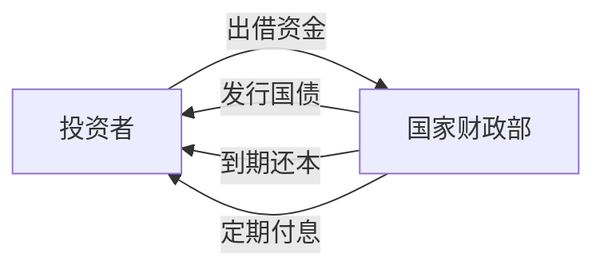
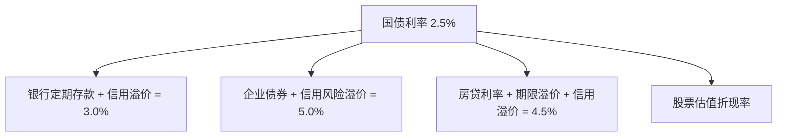
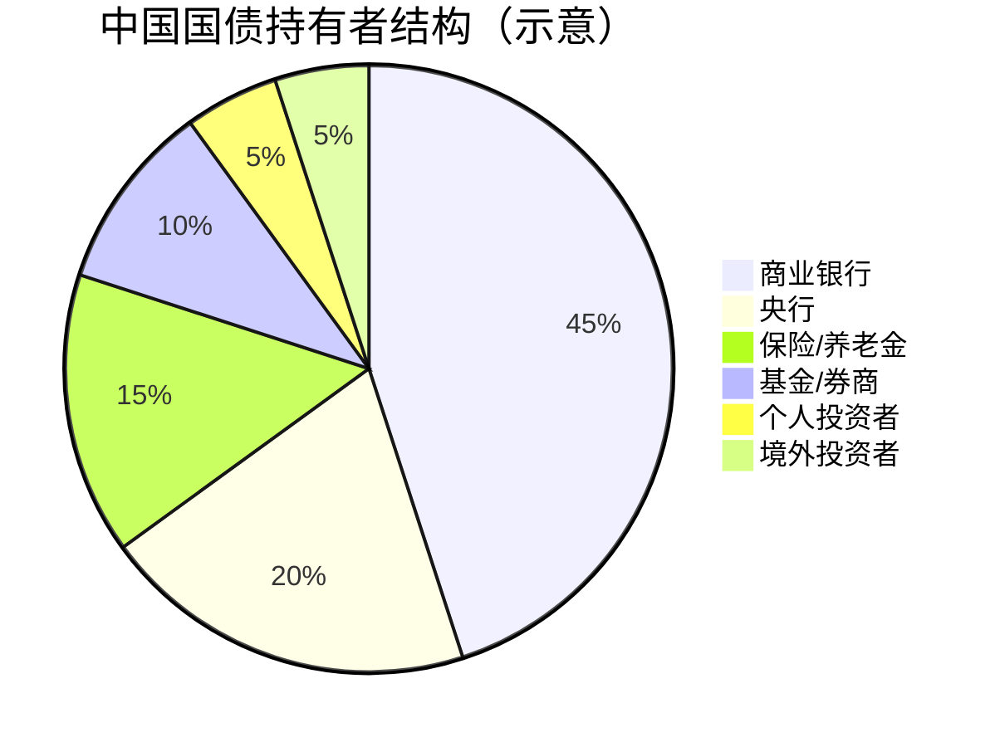
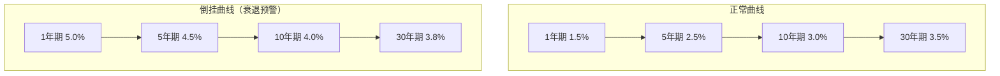
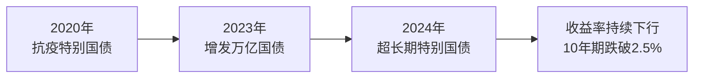
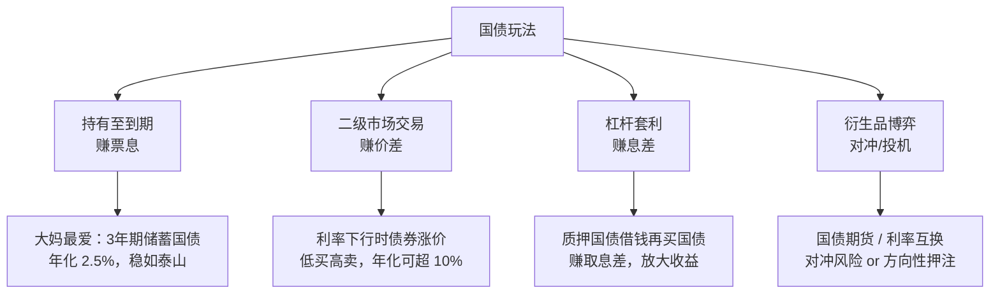
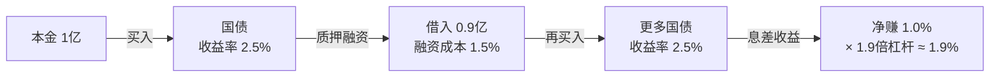

# 什么是国债？一文读懂国家借条

## 一、国债的本质：国家的"借条"

国债，全称**国家公债**（Government Bond），通俗地说就是**国家向你借钱时打的一张借条**。

想象一个场景：你朋友开店缺 10 万块，找你借钱并写了一张借条，约定 3 年后还本，每年付你 3% 的利息。把"朋友"换成"国家"，把"10 万块"换成"几百亿、几千亿"，就是国债的基本逻辑。



国债的三要素：

| 要素 | 说明 | 举例 |
|------|------|------|
| **面值** | 债券的票面金额 | 100 元 / 张 |
| **票面利率** | 约定的年化利率 | 2.5% / 年 |
| **期限** | 从发行到还本的时间 | 3 年 / 10 年 / 30 年 |

## 二、国家为什么要发行国债？

国家发行国债并不是因为"缺钱"这么简单，它承担着多重宏观经济职能：

### 2.1 弥补财政赤字

当政府的税收等收入不足以覆盖支出时，就需要借钱来填补缺口。国债是最主要的融资手段。

```
财政收入（税收、国企利润等）──→ 覆盖 ──→ 财政支出（基建、国防、教育等）
                                          │
                              不足部分 ←── 发行国债补足
```

### 2.2 调控宏观经济

国债是央行实施**货币政策**的核心工具之一：

- **经济过热**时，央行卖出国债，回收市场上的流动性（钱），给经济降温。
- **经济低迷**时，央行买入国债，向市场投放流动性，刺激经济。

这就是常说的**公开市场操作**（OMO，Open Market Operations）。

### 2.3 提供无风险基准利率

国债利率被视为一个国家的**无风险利率**（Risk-Free Rate），是整个金融体系的定价锚：



所有其他金融资产的定价，都是在国债利率的基础上加上各自的**风险溢价**。

### 2.4 重大项目建设融资

基础设施（高铁、水利、新能源等）投资大、回收周期长，私人资本不愿意或无力承担。国家通过发行长期国债募集资金，完成这些具有公共品属性的投资。

## 三、国债的分类

### 3.1 按期限划分

| 类型 | 期限 | 特点 |
|------|------|------|
| 短期国债（T-Bills） | 1 年以内 | 流动性极高，近似现金 |
| 中期国债（T-Notes） | 1 - 10 年 | 兼顾收益与流动性 |
| 长期国债（T-Bonds） | 10 年以上（最长达 50 年） | 锁定长期利率，价格波动大 |

### 3.2 按付息方式

- **附息国债**：定期（半年或一年）支付利息，到期还本。最常见。
- **贴现国债**：以低于面值的价格发行，到期按面值兑付，差价即为收益。短期国债多用此方式。

### 3.3 按发行场所

- **记账式国债**：电子化记录，可在二级市场交易。
- **储蓄国债（凭证式/电子式）**：面向个人投资者，不可上市交易，但可提前兑取。

## 四、国债为什么被称为"最安全的资产"？

国债违约风险极低，原因在于国家拥有三大"特权"：

1. **征税权**：国家可以通过税收获取收入来偿还债务。
2. **货币发行权**：主权国家可以发行本国货币来偿还以本币计价的国债。
3. **再融资能力**：国家通常可以"借新还旧"，滚动债务。

> ⚠️ 以上特权限定于**主权货币国家**。如果一个国家借的是外币债务（比如美元债），又无法印美元，那违约风险就真实存在了——1998 年俄罗斯、2001 年阿根廷都是典型例子。

## 五、国债的主要玩家



### 5.1 商业银行

银行是国债最大的买家。当市场风险加大时，银行倾向将资金配置到安全的国债上；同时银行也需要持有国债作为流动性管理工具。

### 5.2 中央银行

央行买卖国债不是为了盈利，而是为了执行货币政策——吞吐基础货币。

### 5.3 个人投资者

普通人购买国债的主要渠道：
- 银行柜台购买储蓄国债
- 证券账户购买记账式国债（二级市场交易）
- 通过债券基金间接持有

## 六、国债收益率：经济的"体温计"

### 6.1 什么是国债收益率？

虽然票面利率是固定的，但国债在二级市场上交易后，实际收益率会随价格波动：

$$
收益率 = \frac{票面利息 + (面值 - 购买价格) / 剩余年限}{购买价格} \times 100\%
$$

**核心规律**：债券价格 ↑ → 收益率 ↓（二者反向变动）

### 6.2 收益率曲线

不同期限国债的收益率连成一条曲线，它反映了市场对未来经济的预期：



- **正常曲线**：长期利率 > 短期利率，经济健康扩张。
- **平坦曲线**：长短端利率接近，经济前景不明朗。
- **倒挂曲线**：短期利率 > 长期利率，历史上每次美国经济衰退前都出现过。

> 🚨 收益率曲线倒挂是华尔街最关注的衰退预警信号之一，过去 50 年间每次美国经济衰退前 6-18 个月都出现了这一信号。

### 6.3 影响国债收益率的因素

| 因素 | 作用方向 | 逻辑 |
|------|----------|------|
| 央行加息 | 收益率 ↑ | 基准利率提升，新发债券更有吸引力 |
| 通胀预期上升 | 收益率 ↑ | 投资者要求更高回报弥补购买力损失 |
| 经济衰退预期 | 收益率 ↓ | 资金涌入安全资产（避险需求） |
| 财政赤字扩大 | 收益率 ↑ | 供给增加，压低价格 |
| 全球避险情绪 | 收益率 ↓ | 资金流入主权债券市场 |

## 七、中国国债市场概况

### 7.1 市场规模

中国现在是全球**第二大债券市场**（仅次于美国），国债存量规模超过 30 万亿人民币。

### 7.2 近年趋势



中国 10 年期国债收益率近年来持续走低，反映了：
- 经济增长中枢下移
- 通胀压力温和（甚至通缩风险）
- 央行宽松的货币政策取向
- 市场"资产荒"——优质资产稀缺

### 7.3 境外投资者

随着中国债券纳入全球三大债券指数（彭博巴克莱、摩根大通、富时罗素），境外资金持续流入。目前境外机构持有中国国债约 2 万亿人民币，成为不可忽视的力量。

## 八、普通人如何参与国债投资？

| 方式 | 门槛 | 流动性 | 适合人群 |
|------|------|--------|----------|
| 银行柜台买储蓄国债 | 100 元起 | 低（持有至到期） | 保守型，追求绝对安全 |
| 证券账户买记账式国债 | 10 万元起（每手） | 高（可随时卖出） | 有一定投资经验 |
| 债券 ETF / 债基 | 1 元起 | 高 | 普通投资者首选 |
| 国债期货 | 高（50 万+） | 极高 | 专业投资者 |

## 九、常见误区澄清

### 误区 1：「国家不会破产，所以国债没风险」

国家确实极难破产（以本币计价），但**利率风险和通胀风险**依然存在。你买的 30 年期国债利率 2.5%，如果 10 年后通胀率达到 5%，你的实际购买力就在缩水。

### 误区 2：「国债收益率低，不值得投」

国债在投资组合中的角色是**压舱石**，不是发动机。它提供的是确定性——在股市大跌时，国债往往是少数能保值的资产。

### 误区 3：「国债就是理财，随时可以取」

储蓄国债提前兑取是有**手续费**的，且分段计息。记账式国债在二级市场卖出可能面临**价格亏损**（市场利率上升时你的债券会折价）。

---

# 国债怎么玩？——从躺赚利息到高杠杆博弈

上面讲了国债是什么，下面聊聊不同玩家是怎么"玩"国债的——从大妈排队买国债到基金经理加杠杆套利，玩法天差地别。

## 十、玩法全景图



## 十一、玩法一：持有至到期——最朴素的"躺赚"

### 11.1 操作方式

买一张国债，什么都不做，到期拿回本金 + 每期利息。

### 11.2 实例

> **案例：老王买储蓄国债**
>
> 2024 年 3 月，老王在银行柜台买了 10 万元 3 年期储蓄国债，票面利率 2.38%。
>
> - 每年 3 月，老王账户自动到账 2,380 元利息。
> - 2027 年 3 月，拿回 10 万本金 + 最后一期 2,380 元利息。
> - 三年合计收益：2,380 × 3 = 7,140 元。
> - **年化收益率：2.38%，几乎零风险。**

### 11.3 适合谁？

- 厌恶风险的保守型投资者
- 有明确到期用钱计划的人（如 3 年后孩子上大学）
- 作为资产配置中的"压舱石"

### 11.4 局限

- **流动性差**：提前兑取储蓄国债会损失部分利息，且分段计息。
- **通胀侵蚀**：如果通胀率超过票面利率，实际购买力缩水。
- **机会成本**：锁定三年后发现更好的投资机会，钱取不出来。

---

## 十二、玩法二：二级市场交易——赚价格波动的钱

### 12.1 核心逻辑

债券价格与市场利率**反向波动**：

```
市场利率 ↓  →  新发国债利率降低  →  你手上的老国债（高利率）变得抢手  →  价格 ↑
市场利率 ↑  →  新发国债利率提升  →  你手上的老国债（低利率）无人问津  →  价格 ↓
```

这就创造了低买高卖的投机空间。

### 12.2 实例

> **案例：小李的利率下行套利**
>
> 2023 年初，中国 10 年期国债收益率为 2.90%，小李在二级市场以 **98 元**买入面值 100 元的 10 年期国债（票面利率 2.80%）。
>
> 到 2024 年中，10 年期国债收益率下行至 2.25%。他手上的老国债因为票面利率更高，市场价格涨到了 **103 元**。
>
> - 持有期间的利息收入：100 × 2.80% × 1.5 年 = 4.20 元
> - 卖出价差：103 - 98 = 5 元
> - 合计收益：4.20 + 5 = 9.20 元
> - **年化收益率：9.20 / 98 / 1.5 ≈ 6.26%**
>
> 远超 2.38% 的储蓄国债收益，因为小李赚的是"利率下行 → 债券涨价"的钱。

### 12.3 适合谁？

- 能判断利率走势的投资者
- 有证券账户，可以在交易所买卖记账式国债
- 愿意承受一定价格波动风险

### 12.4 风险提示

如果判断反了——利率上行，债券价格下跌——可能亏掉本金。比如：

> **反面案例：2022 年美国"债券熊市"**
>
> 美联储暴力加息，10 年期美债收益率从 1.5% 飙升到 4.2%。如果你在 2021 年底买入长期美债，一年内可能亏损 **15%-20%**——对债券来说这是百年一遇的惨烈。

---

## 十三、玩法三：杠杆套利——机构的"印钞机"

### 13.1 核心逻辑

这是银行和基金等机构的主流玩法：**买入国债 → 质押给市场借钱 → 用借来的钱再买国债 → 再质押……**，赚取债券收益率与融资成本之间的**息差**。



### 13.2 实例

> **案例：债券基金的杠杆操作**
>
> 某债券基金有净资产 10 亿元。基金经理做了以下操作：
>
> | 步骤 | 操作 | 规模 |
> |------|------|------|
> | ① | 买入 10 亿元国债，票面利率 2.5% | 10 亿 |
> | ② | 将 10 亿国债通过**债券回购**质押，借入 8 亿元 | +8 亿 |
> | ③ | 用 8 亿元再买入国债，票面利率 2.5% | +8 亿 |
> | ④ | 可将新增的 8 亿国债继续质押……（监管限制总杠杆 ≤ 120%-140%） | ≈ +4 亿 |
>
> **最终持仓：约 22 亿国债，杠杆倍数 ≈ 2.2 倍。**
>
> | 项目 | 金额 |
> |------|------|
> | 资产端收益（22亿 × 2.5%） | 5,500 万 |
> | 负债端成本（12亿 × 1.5%） | 1,800 万 |
> | **净收益** | **3,700 万** |
> | **净资产收益率** | **3.7%（vs. 无杠杆的 2.5%）** |
>
> 通过 2.2 倍杠杆，收益率从 2.5% 提升到 3.7%。看似不多，但对百亿级基金来说，多 1.2% 就是 1.2 亿真金白银。

### 13.3 核心工具：债券回购

```
银行间质押式回购是中国债券市场最大的融资工具，日均成交量超 5 万亿。
```

回购的本质：**以国债为抵押的短期借款**。你把国债暂时"卖"给对方，约定几天后以略高的价格买回，价差就是对方的利息。

| 品种 | 期限 | 用途 |
|------|------|------|
| 隔夜回购（R001） | 1 天 | 日常流动性管理 |
| 7 天回购（R007） | 7 天 | 短期杠杆融资 |
| 14 天 / 1 个月 | 14 天-1 月 | 跨季/跨年资金安排 |

### 13.4 风险

- **息差倒挂**：如果融资成本上升到高于国债收益率，杠杆变成"赔钱加速器"。
- **流动性枯竭**：极端市场下（如 2013 年"钱荒"），回购利率可能飙升到 10%+，机构被迫"割肉"卖出。
- **强制平仓**：质押的国债价格下跌，对手要求追加保证金，否则直接卖出你的质押券。

---

## 十四、玩法四：国债期货——放大博弈

### 14.1 什么是国债期货？

一张合约约定未来以固定价格买卖国债。你不需要真的持有国债，只需要支付 **保证金**（约 2%-5%），就能撬动几十倍的杠杆。

```
面值 100 万元的 10 年期国债期货，保证金只需约 2 万元。
国债收益率每变动 0.01%，期货价格大约变动 70-80 元。
方向判断正确 → 单日可赚数万元；方向错误 → 同样幅度亏损。
```

### 14.2 实例

> **案例：套期保值——基金经理的"保险"**
>
> 张经理管理一只 50 亿规模的债券基金，判断未来 3 个月利率可能上行（债券要跌）。
>
> 他不想卖掉持仓债券（会冲击市场、产生交易成本），于是在国债期货上做空：
>
> | 操作 | 说明 |
> |------|------|
> | 现货端 | 继续持有 50 亿国债 |
> | 期货端 | 做空约 50 亿面值的 10 年期国债期货 |
>
> **3 个月后利率果然上行，债券现货亏了 2,500 万，但期货空头赚了 2,400 万。**
> 净亏损仅 100 万——用期货的盈利对冲了现货的损失。
>
> 这就是**套期保值**（Hedging），把利率风险转移出去了。

> **案例：方向性投机——"裸空"国债**
>
> 2024 年初，小王判断央行即将收紧流动性、利率将大幅反弹。他在国债期货上**裸做空** 50 手（对应 5,000 万面值），保证金约 100 万元。
>
> 结果央行不仅没有收紧，反而超预期降息。10 年期国债收益率从 2.5% 暴跌至 2.2%，国债期货暴涨。
>
> - 每手亏损约 2.4 万元
> - 50 手合计亏损 120 万元
> - 保证金 100 万全部亏光，还倒欠期货公司 20 万（穿仓）
>
> **方向做反 + 高杠杆 = 血本无归。**

### 14.3 适合谁？

- **套期保值**：持有大量债券的机构（银行、保险、基金）。
- **方向性投机**：专业交易员，能承受爆仓风险。
- **不适合**：个人投资者除非经过严格训练——杠杆是把双刃剑。

---

## 十五、玩法五：骑乘策略（Riding the Yield Curve）

### 15.1 核心逻辑

收益率曲线在正常情况下是**向上倾斜**的（长期利率 > 短期利率）。买入剩余期限比实际持有期更长的债券，持有至剩余期限缩短后，债券的到期收益率降低 → 价格上涨 → 卖出获利。

### 15.2 实例

> **案例：骑乘策略**
>
> 当前收益率曲线：
> - 1 年期：1.80%
> - 3 年期：2.30%
> - 5 年期：2.60%
>
> 老赵计划持有 2 年。他不买 2 年期的债券，而是买入了一只 **5 年期国债**（票面利率 2.60%，价格 100 元）。
>
> 2 年后，这只债券剩余期限变成 3 年。当时 3 年期新发国债利率仍是 2.30%。他手上这只剩余 3 年的老债（票面利率更高），市场价格涨到了约 **100.85 元**。
>
> | 收益来源 | 金额 |
> |----------|------|
> | 2 年票息（2.60 × 2） | 5.20 元 |
> | 卖出价差（100.85 - 100） | 0.85 元 |
> | **合计** | **6.05 元** |
> | **年化收益率** | **≈ 3.03%** |
>
> 如果他老老实实买 2 年期债券（利率 2.05%），两年只能赚 4.10 元。骑乘策略多赚了将近 50%。

### 15.3 风险

- 收益率曲线走平或倒挂时，骑乘策略失效甚至亏损。
- 如果在持有期间整体利率大幅上行，债券价格下跌会吞噬骑乘收益。

---

## 十六、玩法六：利差交易——国债间的"搬砖"

### 16.1 核心逻辑

不同期限的国债之间存在利差。通过"做多一个 + 做空另一个"来赚取利差的收窄或走阔。

### 16.2 实例

> **案例：收益率曲线陡峭化交易**
>
> 当前：
> - 2 年期国债收益率：2.00%
> - 10 年期国债收益率：2.50%
> - **利差（10Y - 2Y）= 0.50%（50 bp）**
>
> 小赵判断央行会降息，短期利率下行速度会快于长期利率 → 利差将**走阔**到 80 bp。
>
> | 操作 | 方向 | 逻辑 |
> |------|------|------|
> | 做多 2 年期国债 | 买入 | 降息直接利好短端，价格上涨 |
> | 做空 10 年期国债 | 卖出 | 长端下行空间有限，相对表现更差 |
>
> 一个月后，央行降息 10 bp：
> - 2 年期收益率跌至 1.70%，价格上涨约 0.6%
> - 10 年期收益率跌至 2.40%，价格上涨约 0.9%
>
> 这个组合**亏了**——因为利差实际是**收窄**到了 70 bp（0.90% - 0.60% = 0.30%），与他判断的"走阔"相反。

> 💡 这就是利差交易的风险：你对方向的判断可能是对的（利率下行了），但你赢在了错的敞口上。你空 10 年期赚的，被多 2 年期亏掉的抵消了，因为前者涨得比后者更多。

---

## 十七、各玩法对比总结

| 玩法 | 收益来源 | 典型年化收益 | 最大回撤风险 | 杠杆 | 适合人群 |
|------|----------|:----------:|:----------:|:----:|----------|
| 持有至到期 | 票息 | 2%-3% | ≈ 0（本币主权债） | 无 | 所有人 |
| 二级市场交易 | 价差 + 票息 | 3%-10% | 5%-20% | 无/低 | 有判断力的个人 |
| 杠杆套利 | 息差 | 3%-5% | 5%-15%（爆仓风险） | 1.5-3x | 机构 |
| 国债期货 | 方向性价差 | ±??（高度不确定） | 无限（穿仓可能） | 20-50x | 专业交易员 |
| 骑乘策略 | 收益率下行 + 票息 | 3%-5% | 2%-8% | 无/低 | 中高级投资者 |
| 利差交易 | 利差变化 | ±??（不确定） | 视杠杆而定 | 可变 | 机构/高级玩家 |

---

## 十八、给普通人的实操建议

### 18.1 如果你想参与

| 资金量 | 推荐方式 | 操作路径 |
|:------:|----------|----------|
| < 10 万 | 债券基金 / 债券 ETF | 支付宝/券商 App 直接买 |
| 10-50 万 | 储蓄国债 + 债券基金组合 | 银行柜台 + 券商 |
| > 50 万 | 可考虑直接买记账式国债 | 券商交易软件 |

### 18.2 几条原则

1. **搞清楚你是来赚利息还是赚价差。** 两者逻辑完全不同，混在一起容易两头挨打。
2. **杠杆只有在你能承受爆仓时才用。** 机构用杠杆是因为有风控体系和资本缓冲，个人裸奔上杠杆和赌博无异。
3. **国债的敌人不是违约，是通胀和利率上行。** 2022 年美国"债券熊市"教会了所有人：不要以为债券不会跌。
4. **利率下行周期，越早锁定越长越好。** 把握大方向比纠结 0.1% 利差更重要。
5. **大部分普通人只需要债券基金。** 基金经理替你完成杠杆、骑乘、利差操作，你支付 0.3% 的管理费即可。

---

## 十九、总结

国债远不止是一张"国家借条"：

1. **对政府**，它是财政融资和宏观调节的工具。
2. **对央行**，它是货币政策的操作媒介。
3. **对金融市场**，它是定价的基准和风险的避风港。
4. **对普通人**，它是最基础的保值资产，也是观察宏观经济的窗口。

而参与国债的方式，从最简单的"买了不动等利息"，到专业的杠杆套利、期货对冲、利差博弈——每种玩法对应不同的收益预期和风险承受能力。

理解国债，就是理解现代金融体系的根基。它为一切高风险投资提供了参照系——没有无风险利率，就没有风险定价；没有国债，就没有现代金融市场。
