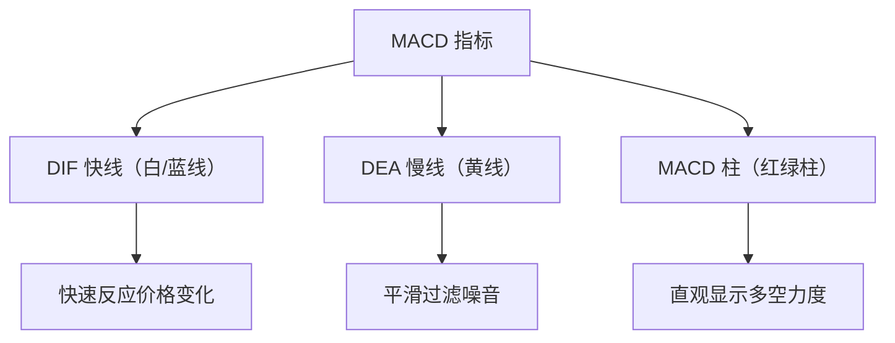
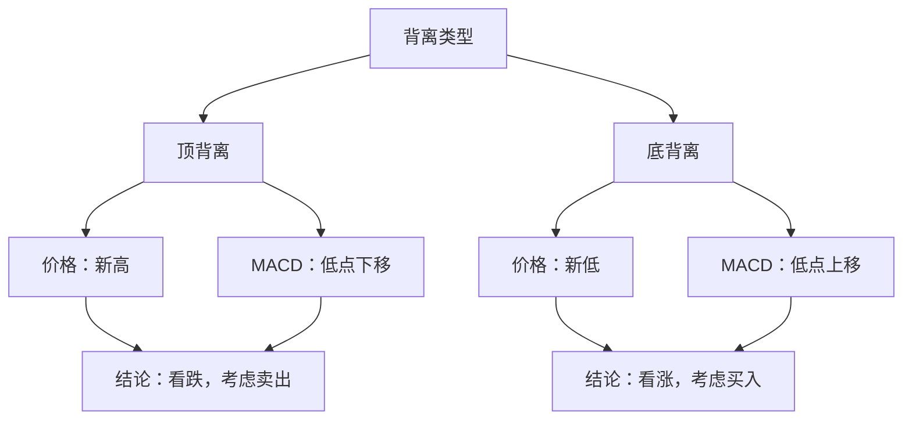
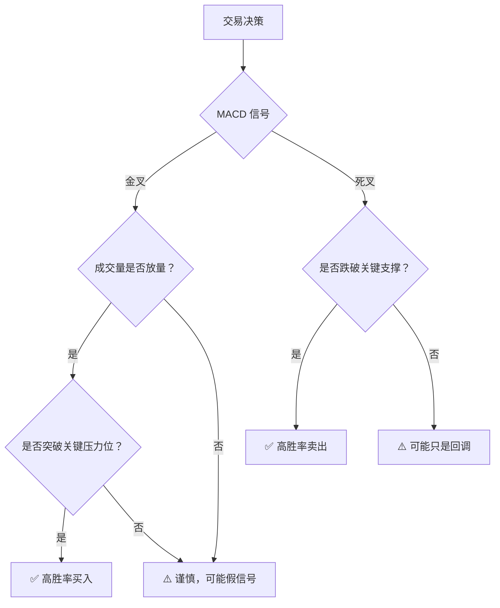

# 什么是 MACD？一文读懂技术分析中的"指标之王"

## 一、MACD 的本质：三条线，看透趋势

**MACD**（Moving Average Convergence Divergence），中文叫**指数平滑异同移动平均线**。名字很长，但你只需要记住它的核心作用：

> **MACD 帮你判断三件事：趋势的方向、趋势的强弱、以及趋势是否即将反转。**

它由三个部分组成，合称"MACD 三剑客"：

| 组成部分 | 英文名 | 俗称 | 在软件中通常显示为 |
|---------|--------|------|------------------|
| **DIF** | MACD Line | 快线 / DIF 线 | 白色或蓝色曲线 |
| **DEA** | Signal Line | 慢线 / 信号线 | 黄色曲线 |
| **MACD 柱** | Histogram | 红绿柱 / 能量柱 | 红绿相间的柱子 |



> **一句话总结**：DIF 和 DEA 的关系告诉你 **"趋势还在不在"**，MACD 柱的高度告诉你 **"力量还够不够"**。

## 二、MACD 是怎么算出来的？

MACD 听起来复杂，但计算逻辑其实只有三步。只要理解了这三步，你就真正"懂了"MACD。

### 2.1 第一步：算两根均线

MACD 的起点是两根**指数移动平均线（EMA）**：

- **EMA12**：最近 12 天的指数加权均价（快速线）
- **EMA26**：最近 26 天的指数加权均价（慢速线）

> 为什么用 12 和 26？这是 MACD 发明者 Gerald Appel 的"祖传参数"，经过了半个世纪的市场检验。你也可以调成 5 和 20 或 10 和 30，但 12/26 是最通用的默认值。

EMA 和普通均线（MA / SMA）的区别在于：EMA 给**近期价格更高权重**，所以它比普通均线更"灵敏"，能更快捕捉到价格变化。

### 2.2 第二步：DIF = 快线减慢线

把 EMA12 减去 EMA26，就得到了 **DIF**：

```
DIF = EMA12 − EMA26
```

| DIF 的数值 | 含义 |
|:--------:|------|
| **DIF > 0** | 短期价格高于长期价格 → 处于**上涨趋势** |
| **DIF < 0** | 短期价格低于长期价格 → 处于**下跌趋势** |
| **DIF = 0** | 短期和长期价格一致 → 趋势**临界点** |

> DIF 本质上是 **"短期情绪"** 和 **"长期趋势"** 之间的距离。距离越大，趋势越强。

### 2.3 第三步：DEA = DIF 的"平滑版"

DEA 是 DIF 的 9 日 EMA：

```
DEA = DIF 的 9 日 EMA
```

DEA 比 DIF 更平滑、更"迟钝"。它的作用是帮我们过滤掉 DIF 的短期噪音。

### 2.4 第四步：MACD 柱 = DIF − DEA

```
MACD 柱 = (DIF − DEA) × 2
```

> 乘以 2 只是为了把柱子"放大"，让它在图上更明显，不影响判断逻辑。

| MACD 柱的颜色 | 含义 |
|:----------:|------|
| **红柱（正值）** | DIF 在 DEA 上方 → **多头力量占优** |
| **绿柱（负值）** | DIF 在 DEA 下方 → **空头力量占优** |
| **柱子变短** | 多空力量的**差距在缩小** → 趋势可能反转 |


## 三、MACD 怎么看？四大经典信号

打开股票软件，调出 MACD 指标，你通常会看到类似下面这样的画面：

```
    ┌──────────────────────────────────────────┐
    │  K 线图（价格）                            │
    │      /\                                  │
    │     /  \     /\                          │
    │    /    \   /  \    /\                   │
    │   /      \ /    \  /  \                  │
    │  /        V      \/    \                 │
    ├──────────────────────────────────────────┤
    │  MACD 指标区域                             │
    │                                          │
    │  ─── DIF（快线，白/蓝）                     │
    │  ─── DEA（慢线，黄）                        │
    │  ┃┃┃ 红绿柱（MACD 柱）                     │
    │                                          │
    │  ────────── 0 轴 ──────────               │
    └──────────────────────────────────────────┘
```

### 3.1 信号一：金叉（Golden Cross）——买入信号

> **DIF 从下方向上穿过 DEA，形成"金叉"。**

```
   DIF  ──→ 穿过 DEA ──→ 向上

   DEA ──────────────────────
            ↑
          金叉点
```

| 金叉发生的位置 | 信号强度 | 说明 |
|:----------:|:------:|------|
| **0 轴下方** | ⭐⭐ 较弱 | 下跌趋势中的反弹，可能是假信号 |
| **0 轴附近** | ⭐⭐⭐ 中等 | 趋势转换的临界点，值得关注 |
| **0 轴上方** | ⭐⭐⭐⭐ 较强 | 上涨趋势中的再次启动，可信度高 |

### 3.2 信号二：死叉（Death Cross）——卖出信号

> **DIF 从上方向下穿过 DEA，形成"死叉"。**

```
   DIF ──→ 穿过 DEA ──→ 向下

   DEA ──────────────────────
            ↑
          死叉点
```

| 死叉发生的位置 | 信号强度 | 说明 |
|:----------:|:------:|------|
| **0 轴上方** | ⭐⭐ 较弱 | 上涨中的回调，不一定是反转 |
| **0 轴附近** | ⭐⭐⭐ 中等 | 趋势可能转弱，需要警惕 |
| **0 轴下方** | ⭐⭐⭐⭐ 较强 | 下跌趋势加速，风险较大 |

### 3.3 信号三：0 轴穿越——趋势确认

0 轴是 MACD 的多空分水岭：

```
    0 轴上方（多头区域）        0 轴下方（空头区域）
    ┌─────────────────┬─────────────────┐
    │  DIF > 0        │  DIF < 0        │
    │  上涨趋势        │  下跌趋势        │
    │  适合做多        │  适合观望/做空   │
    └─────────────────┴─────────────────┘
```

- **DIF 上穿 0 轴**：短期趋势确认转为上涨
- **DIF 下穿 0 轴**：短期趋势确认转为下跌

> 注意：0 轴穿越通常**滞后于**金叉/死叉，但它的可靠性更高。金叉是"预警"，0 轴穿越是"确认"。

### 3.4 信号四：背离（Divergence）——最强大的反转信号

背离是 MACD 最受追捧的信号，因为它往往能提前预警大级别的趋势反转。

#### 顶背离（看跌背离）

> **价格创新高，但 MACD 的高点却在降低。**

```
  价格：   /\              ← 第二个高点（更高）
         /  \    /\
        /    \  /  \
       /      \/    \
       
  MACD：  /\          ← 第一个高点（更高）
        /  \    /\
       /    \  /  \    ← 第二个高点（更低！）
      /      \/    \
      
  结论：价格上涨乏力，可能即将下跌。
```

**顶背离的逻辑**：价格虽然创了新高，但推动上涨的"能量"（MACD 柱高度 / DIF 高度）已经大不如前。就像一个人爬楼梯，虽然还在往上走，但每一步都越来越没劲——随时可能停下来甚至摔下去。

#### 底背离（看涨背离）

> **价格创新低，但 MACD 的低点却在抬高。**

```
  价格：  \    /\         ← 第二个低点（更低）
           \  /  \
            \/    \
                  \
                   
  MACD：   \  /\         ← 第二个低点（更高！）
            \/  \  /\
                  \/
      
  结论：下跌动能衰竭，可能即将反弹。
```

**底背离的逻辑**：价格虽然还在跌，但抛售的力量已经越来越弱。就像一辆车在下坡，虽然还在滑，但刹车已经踩下去了——减速甚至停下来只是时间问题。



## 四、MACD 的高级用法：不看金叉死叉也能用

### 4.1 MACD 柱的"缩头"与"伸头"

有时候不用等金叉死叉，光看 MACD 柱的变化就很有用：

```
红柱变化：
  ┃ ┃ ┃ ┃ ┃ ┃ ┃ ← 红柱一天比一天高 → 多头加速（持有/加仓）
  ┃ ┃ ┃ ┃ ┃     ← 红柱一天比一天矮（缩头）→ 多头减速（考虑减仓）

绿柱变化：
  ┃ ┃ ┃ ┃ ┃ ┃ ┃ ← 绿柱一天比一天长 → 空头加速（观望/减仓）
  ┃ ┃ ┃ ┃ ┃     ← 绿柱一天比一天短（缩头）→ 空头减速（可能见底）
```

> 红柱缩短 = "上涨没劲了"，绿柱缩短 = "下跌没劲了"。这是最简单也最实用的 MACD 信号。

### 4.2 多周期共振

专业交易者往往不只看一个时间周期的 MACD：

```
日线 MACD 金叉 + 周线 MACD 金叉 → ⭐⭐⭐⭐⭐ 强烈看涨
日线 MACD 金叉 + 周线 MACD 死叉 → ⭐⭐ 反弹而已，谨慎参与
日线 MACD 死叉 + 周线 MACD 死叉 → ⭐⭐⭐⭐⭐ 强烈看跌
日线 MACD 死叉 + 周线 MACD 金叉 → ⭐⭐ 回调而已，不必恐慌
```

> **大周期定方向，小周期找买点。** 这是多周期分析的核心思想。

## 五、MACD 的实战案例：以苹果（AAPL）为例

假设以下是苹果某段行情的 MACD 变化：

```
日期       价格      DIF     DEA     柱       信号
─────────────────────────────────────────────────
第 1 周    $150     −2.1    −1.8    ██ 绿    下跌中
第 2 周    $148     −2.3    −2.0    ██ 绿    死叉之后，继续跌
第 3 周    $145     −2.0    −1.9    █ 绿短   绿柱缩短！空头减速
第 4 周    $147     −1.5    −1.7    █ 红     金叉！DIF 上穿 DEA
第 5 周    $152     −0.5    −1.2    ██ 红    红柱放大，多头加速
第 6 周    $158     +1.2    −0.3    ███ 红    DIF 上穿 0 轴！趋势确认
第 7 周    $165     +2.5    +1.0    ████ 红   强势上涨中
第 8 周    $170     +3.0    +1.8    ███ 红    红柱缩短！多头减速
第 9 周    $168     +2.8    +2.2    █ 红      红柱继续缩小
第 10 周   $163     +2.0    +2.1    █ 绿      死叉！DIF 下穿 DEA
```

> 从这个案例可以看到两个关键规律：
> 1. **MACD 柱比金叉/死叉更早发出信号**——在第 3 周绿柱缩短时就可以留意，第 4 周金叉确认买入，而不是等到第 6 周 0 轴上穿。
> 2. **红柱缩短是明确的减仓信号**——第 8 周红柱开始缩短，尽管价格还在涨，但动能已经减弱，此时减仓比第 10 周死叉再卖更从容。

## 六、MACD 的核心局限——它也有"盲区"

没有任何指标是完美的，MACD 也不例外。知道它的局限，比知道它的用法更重要。

### 6.1 滞后性——MACD 的天生缺陷

MACD 是基于均线计算的，均线天然滞后于价格。这意味着：

- **金叉出现时，价格往往已经涨了一段**
- **死叉出现时，价格往往已经跌了一段**

```
价格：  ────↗────
              ↑ 金叉信号出现，但最佳买点已经过了
MACD：  ──────✚──
```

> **对策**：不要单独依赖 MACD。结合 K 线形态、成交量、支撑阻力位等其他工具一起判断。

### 6.2 震荡市中的"反复打脸"

在横盘震荡行情中，MACD 会产生大量的**假信号**：

```
震荡行情中的 MACD：
  金叉 → 买入 → 价格不涨反跌 → 止损
  死叉 → 卖出 → 价格不跌反涨 → 踏空
  金叉 → 买入 → 又跌了 → 又止损
  ...循环往复...
```

> **对策**：震荡市中减少交易频率，或者配合布林带（Bollinger Bands）、RSI 等震荡指标辅助判断。MACD 天生是**趋势指标**，在趋势行情中如鱼得水，在震荡行情中处处碰壁。

### 6.3 参数选择的困境

默认参数（12, 26, 9）虽然经典，但并不适用于所有场景：

| 参数组合 | 特点 | 适用场景 |
|---------|------|------|
| **(5, 20, 7)** | 更灵敏，信号更多 | 短线交易、日内交易 |
| **(12, 26, 9)** | 经典参数，平衡 | 中短线、日线级别 |
| **(20, 50, 12)** | 更平滑，信号更少但更可靠 | 中长线、周线级别 |

> 没有"最优参数"，只有"最适合你交易风格的参数"。

### 6.4 MACD 与其他指标的对比

| 指标 | 类型 | 核心作用 | 与 MACD 的关系 |
|------|:--:|------|------|
| **MACD** | 趋势指标 | 判断趋势方向和强度 | — |
| **RSI** | 震荡指标 | 判断超买超卖 | 震荡市中互补 MACD |
| **KDJ** | 震荡指标 | 判断短期买卖点 | 比 MACD 更灵敏，但假信号更多 |
| **均线（MA）** | 趋势指标 | 判断支撑阻力和趋势 | MACD 的"原材料" |
| **布林带** | 通道指标 | 判断波动率和超买超卖 | 震荡市中辅助 MACD |
| **成交量** | 量能指标 | 验证价格变动的可信度 | MACD 金叉 + 放量 = 强信号 |

## 七、MACD 的使用心法：三条黄金法则

### 法则一：顺势而为，不逆势操作

```
0 轴上方 → 优先做多，金叉买入
0 轴下方 → 优先观望，金叉谨慎
```

> 在 0 轴下方的金叉买入，就像逆水行舟——对了赚小钱，错了亏大钱。

### 法则二：等待确认，不抢跑

```
MACD 柱缩短 → 预警（可以关注，但不下单）
金叉/死叉出现 → 确认（可以下单）
0 轴突破 → 加强确认（可以加仓）
```

### 法则三：多指标共振，不孤军奋战

最强的交易信号往往不是 MACD 单独发出的，而是多个指标同时指向同一个方向：

```
✅ MACD 金叉 + 放量突破压力位 + RSI 未超买 → 高胜率买入信号
❌ MACD 金叉 + 缩量 + 接近压力位 → 假突破概率大
```



## 八、总结

| 要点 | 一句话 |
|------|------|
| **MACD 是什么** | 用两根均线的距离来衡量趋势方向和强度 |
| **最重要的信号** | 背离 > 0 轴穿越 > 金叉/死叉 > MACD 柱变化 |
| **最大的优势** | 直观、易懂、趋势行情中非常可靠 |
| **最大的劣势** | 滞后、震荡市中假信号多 |
| **最佳策略** | 多周期共振 + 多指标共振，永远不靠单一指标做决策 |

> **MACD 是"趋势的翻译官"，不是"财富的水龙头"。** 它能帮你读懂市场在干什么，但不能替你决定该干什么。真正赚钱的，永远是使用指标的那个人，而不是指标本身。
