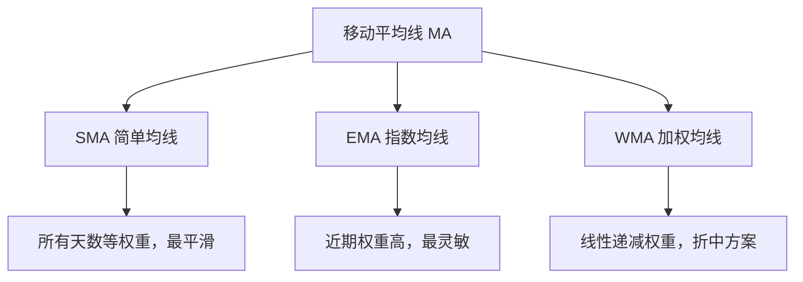
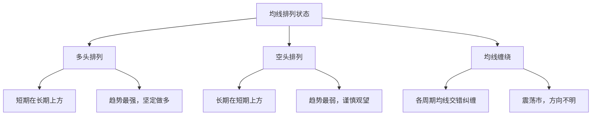

# 什么是均线（MA）？一文读懂技术分析的基石

## 一、均线的本质：价格的"平均值"

**移动平均线**（Moving Average，简称 MA）是所有技术指标中最古老、最简单、也是最重要的一条线。它的计算逻辑一句话就能说清楚：

> **把最近 N 天的收盘价加起来，除以 N，得到一个点。每天算一个点，连起来就是均线。**

| 例子 | 计算方式 |
|------|------|
| **5 日均线（MA5）** | 最近 5 天收盘价的平均值 |
| **20 日均线（MA20）** | 最近 20 天收盘价的平均值 |
| **年线（MA250）** | 最近 250 天的收盘价平均值 |


均线最大的作用就是**过滤噪音**。股价每天都在上蹿下跳，但均线帮你把短期波动"熨平"，让你看到价格的**真实方向**。

```
原始价格：  /\      /\
          /  \    /  \    /\
         /    \/\/    \/\/  \
        /                    \
        
5日均线：  ～～～～～～～～～～～～～  ← 平滑了！趋势一目了然
```

## 二、均线的三种类型

均线有很多种算法，但日常使用的主要是三类：

### 2.1 简单移动平均线（SMA）

```
SMA = (P₁ + P₂ + ... + Pₙ) ÷ N
```

**每个价格权重相同。** 这是最传统、最常用的均线。

| 优点 | 缺点 |
|------|------|
| 简单直观，计算透明 | 反应慢，对近期价格变化不够敏感 |
| 适合判断大级别趋势 | 会"两次受伤"——计算时加入旧数据、剔除旧数据都会影响结果 |

### 2.2 指数移动平均线（EMA）

```
EMA_today = 今日价格 × α + 昨日 EMA × (1 − α)
其中 α = 2 ÷ (N + 1)
```

**近期价格权重更高，越久远的价格权重越低。**

| 优点 | 缺点 |
|------|------|
| 反应快，紧跟价格变化 | 信号多，假信号也多 |
| 常用于 MACD、布林带等衍生指标 | 对极端价格敏感 |

### 2.3 加权移动平均线（WMA）

```
WMA = (P₁×1 + P₂×2 + ... + Pₙ×N) ÷ (1+2+...+N)
```

**最近一天权重为 N，最远一天权重为 1，线性递减。**

> WMA 介于 SMA 和 EMA 之间——比 SMA 灵敏，比 EMA 稳重。不过在实际交易中，EMA 的使用率已经远超 WMA。



## 三、均线的四种经典用法

### 3.1 用法一：看方向——一根均线定趋势

最简单的用法：**价格在均线之上，看多；价格在均线之下，看空。**

```
价格在 MA60 上方 → 多头趋势 → 逢低做多
─────────────────────── ← MA60（生命线）
价格在 MA60 下方 → 空头趋势 → 逢高做空
```

市场上最重要的几条"风向标"均线：

| 均线 | 俗称 | 核心作用 |
|:----:|------|------|
| **MA5** | 周线 | 超短线情绪，最灵敏 |
| **MA10** | 半月线 | 短线趋势参考 |
| **MA20** | 月线 | 短线多空分界线 |
| **MA60** | 季线 | **生命线**——中期趋势的核心标尺 |
| **MA120** | 半年线 | 中长期趋势 |
| **MA250** | 年线 | **牛熊分界线**——判断大周期多空 |

> MA60 被称为"生命线"不是没有道理的：60 个交易日约等于一个季度，它代表了市场中**长线资金的平均成本**。股价站稳 MA60 说明长线资金在赚钱，趋势健康；跌破 MA60 说明长线资金被套，趋势堪忧。

### 3.2 用法二：看支撑与阻力——均线是"磁铁"和"天花板"

均线在实战中最神奇的特性：**它既是支撑，也是压力。**

```
上涨中：价格回踩 MA20 就弹起
    ↗  ↗  ↗
  ↗  ↘↗  ↘↗  ↘↗   ← 每次跌到 MA20 就有人抄底
 ↗          MA20
────────────────────  MA20（支撑）
```

```
下跌中：价格反弹到 MA20 就被压回
    ↘  ↘  ↘
  ↘  ↗↘  ↗↘  ↗↘   ← 每次涨到 MA20 就有人解套卖出
 ↘          MA20
────────────────────  MA20（压力）
```

**为什么会有这种现象？** 因为均线代表了**市场参与者的平均成本**：

- **上涨中**：后来者成本高，跌到均线附近时，先买的人觉得"没跌到我的成本，还能拿"，后买的人觉得"跌到位了，可以抄底"→ 形成支撑
- **下跌中**：多数人被套在均线上方，涨回均线附近时，套牢盘蜂拥而出 → 形成压力

### 3.3 用法三：看交叉——金叉和死叉

当两条不同周期的均线交叉时，会产生强烈的交易信号：

#### 金叉（看涨）

> **短期均线从下方向上穿过长期均线。**

```
MA5 上穿 MA20 → 金叉 → 短期走强，买入信号
```

```
                  ↗ MA5（快线）
                ↗
    ──────────✚──────────  MA20（慢线）
            ↗
          ↗
        ↗  MA5
```

| 金叉组合 | 信号强度 | 实战意义 |
|---------|:------:|------|
| **MA5 金叉 MA10** | ⭐⭐ | 超短线反弹，假信号多 |
| **MA5 金叉 MA20** | ⭐⭐⭐ | 短线走强，常见买入点 |
| **MA10 金叉 MA60** | ⭐⭐⭐⭐ | 中期趋势转多，可靠性较高 |
| **MA20 金叉 MA60** | ⭐⭐⭐⭐⭐ | 经典中期看涨信号 |

#### 死叉（看跌）

> **短期均线从上方向下穿过长期均线。**

```
MA5 下穿 MA20 → 死叉 → 短期走弱，卖出信号
```

> **金叉和死叉的可靠性取决于时间周期**：日线级别的金叉/死叉用于短线交易，周线级别的金叉/死叉才是大级别的趋势信号。

### 3.4 用法四：看排列——多头排列与空头排列

当多条均线同时满足特定顺序时，市场处于最强的趋势状态：

#### 多头排列——最强上涨信号

```
MA5     ← 最高（最近）
MA10
MA20
MA60
MA120
MA250   ← 最低（最远）

短期均线 ＞ 中期均线 ＞ 长期均线
均线发散向上，像一把打开的扇子
```

> **多头排列 = 所有时间段的人都在赚钱。** 这意味着市场情绪极度乐观，趋势非常强劲。

#### 空头排列——最强下跌信号

```
MA250   ← 最高（最远）
MA120
MA60
MA20
MA10
MA5     ← 最低（最近）

长期均线 ＞ 中期均线 ＞ 短期均线
均线发散向下
```

> **空头排列 = 所有时间段的人都在亏钱。** 套牢盘层层叠叠，每一次反弹都会遇到不同周期均线的压制。



## 四、均线的实战案例

### 4.1 以贵州茅台为例（模拟行情）

```
日期        收盘价    MA5    MA20   MA60   均线状态
─────────────────────────────────────────────────
第 1 周     ¥1600    —      —      —      建仓期
第 2 周     ¥1620   ¥1610   —      —      MA5 拐头向上
第 3 周     ¥1650   ¥1635   —      —      
第 4 周     ¥1680   ¥1650  ¥1640   —      MA5 金叉 MA20 ✚
第 5 周     ¥1720   ¥1670  ¥1660   —      多头加速
第 6 周     ¥1780   ¥1700  ¥1690  ¥1680   站上 MA60！
第 7 周     ¥1750   ¥1720  ¥1710  ¥1695   回踩 MA20
第 8 周     ¥1800   ¥1745  ¥1730  ¥1710   支撑有效，继续涨
第 9 周     ¥1850   ¥1780  ¥1750  ¥1725   多头排列形成！
```

> 从这个案例可以看出：**均线从缠绕到发散的过程 = 趋势从混沌到清晰的过程。** 当 MA5 > MA20 > MA60 同时向上发散时，是最佳的持仓阶段。

### 4.2 均线的"粘合"与"发散"——最重要的形态转换

```
均线粘合（酝酿期）              均线发散（爆发期）
MA5  ──                        MA5  ──↗
MA10 ──  三线纠缠在一起          MA10 ──↗  三线向上张开
MA20 ──                        MA20 ──↗

→ 方向不明，等待选择             → 趋势明确，顺势而为
→ 成交量通常萎缩                 → 成交量通常放大
→ "横有多长，竖有多高"           → 利润最丰厚的阶段
```

> 均线粘合后首次发散的方向，往往是下一轮大趋势的方向。这是均线系统最有价值的信号之一。

## 五、均线的核心局限

### 5.1 滞后性——均线的原罪

均线是用**过去**的价格算出来的，它天然就慢价格一拍：

```
价格已经涨了 10%  →  MA20 才刚刚拐头
价格已经跌了 10%  →  死叉才姗姗来迟
```

| 均线周期 | 滞后程度 | 适用场景 |
|:------:|:------:|------|
| MA5 | 低 | 超短线，但噪音多 |
| MA20 | 中 | 短线波段 |
| MA60 | 较高 | 中长线趋势 |
| MA250 | 高 | 判断牛熊，不做买卖点 |

> **均线的滞后性不是缺陷，而是特性。** 它牺牲了速度，换来了稳定性。关键是你要接受这个取舍，而不是指望均线能又快又准。

### 5.2 震荡市中的"均线缠绕"

在横盘震荡行情中，短期均线和长期均线会反复交错，形成"均线麻花"：

```
MA5  ──╲ ╱──╲ ╱──
MA10 ───╳───╳───  ← 反复金叉死叉，来回打脸
MA20 ──╱ ╲──╱ ╲──
```

> **对策**：震荡市中，均线的金叉死叉几乎都是陷阱。此时应该放大周期（看周线、月线），或者换用布林带、RSI 等震荡指标。

### 5.3 假突破

价格短暂突破均线但很快又跌回来，是最常见的假信号：

```
  假突破（陷阱）
   ↗↘
  ↗  ↘
 ↗    ↘
───────────  MA60
            ↘
              ↘
```

> **对策**：不要以"盘中突破"为准，等收盘价确认站稳均线之上（至少连续 2-3 天）再行动。很多专业交易者要求价格在均线上方停留超过 3 天、且突破幅度超过 3%，才算有效突破。

## 六、均线与其他指标的关系

| 衍生指标 | 与均线的关系 |
|------|------|
| **MACD** | DIF = EMA12 − EMA26，就是两根均线的差值。MACD 本质上是"均线的二次加工" |
| **布林带** | 中轨 = MA20，上轨 = MA20 + 2σ，下轨 = MA20 − 2σ |
| **MA 通道** | 以均线为中心，上下各偏移固定比例形成的通道 |
| **均线背离** | 价格与均线的距离过大，通常意味着短期过度涨跌 |

> **均线是所有趋势指标之母。** 理解了均线，MACD、布林带、一目均衡表等指标都能轻松上手。反过来，不懂均线就去学 MACD，就像不懂加减法就去学微积分。

## 七、均线参数如何选择？

### 7.1 不同交易风格对应不同参数

| 交易风格 | 推荐均线组合 | 核心逻辑 |
|------|------|------|
| **超短线（日内/1-3天）** | MA5, MA10, MA20 | 捕捉日内和数日的波动 |
| **波段交易（1-4 周）** | MA10, MA20, MA60 | 吃一段中期趋势的利润 |
| **中长线（1-6 月）** | MA20, MA60, MA120 | 忍受短期波动，赚大级别的钱 |
| **长线投资（半年以上）** | MA60, MA120, MA250 | 判断牛熊，定投节奏 |

### 7.2 斐波那契均线

有些交易者喜欢用斐波那契数列作为均线参数：

```
MA5, MA8, MA13, MA21, MA34, MA55, MA89, MA144
```

> 这更多是一种玄学偏好，没有证据表明它比常规参数更有效。但因为你用、别人也用，它就变成了一种"自证预言"——大家都在看这些线，所以这些线确实有效。

## 八、均线使用的三条铁律

### 铁律一：只做均线同向的单子

```
MA60 向上 → 只做多，不做空
MA60 向下 → 只做空，不做多
MA60 走平 → 不交易，等方向
```

> 均线最大的作用是帮你**过滤掉逆势交易**。如果你能严格执行这条规则，已经能避开至少一半的亏损交易。

### 铁律二：金叉不是买入，是"可以买入"

金叉只是一个信号，不是圣旨。买入前还要确认：

```
✅ 金叉 + 放量 + 均线开始发散 → 做多
❌ 金叉 + 缩量 + 均线还在缠绕 → 不动
```

### 铁律三：永远在均线附近入场

不要在价格远离均线时追涨杀跌：

```
远离 MA20 时追涨 → 一回调就被套
回踩 MA20 附近时入场 → 止损小，盈亏比高
```

> 均线是你的"锚"。离锚太远，随时会被拉回来。

## 九、总结

| 要点 | 一句话 |
|------|------|
| **均线是什么** | 价格的平均值，帮你过滤噪音、看清趋势 |
| **最重要的均线** | MA20（月线）、MA60（生命线）、MA250（年线/牛熊线） |
| **四大用法** | 看方向 → 看支撑压力 → 看交叉 → 看排列 |
| **最强形态** | 均线多头排列 + 发散向上 |
| **最大弱点** | 滞后性，震荡市中反复打脸 |
| **最佳策略** | 均线同向时才交易，在均线附近入场，配合成交量验证 |

> **均线不是赚钱的魔法，而是管住手的纪律。** 它不能预测未来，但它能告诉你现在该站着、该走、还是该停下来。在市场中，知道"不做什么"往往比知道"做什么"更重要。
