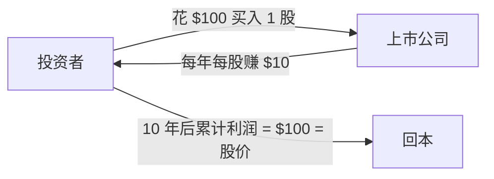
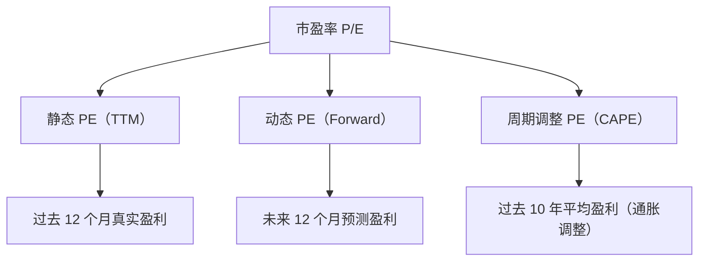
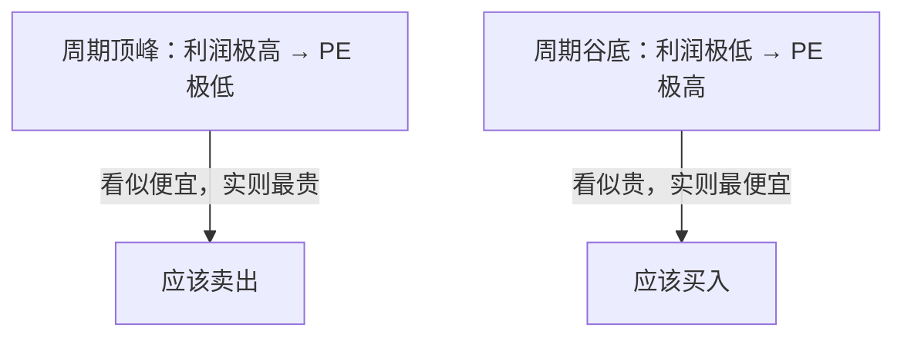

# 什么是市盈率？一文读懂股票估值的核心标尺

## 一、市盈率的本质：你愿意为公司利润付多少钱？

**市盈率**（Price-to-Earnings Ratio，简称 P/E）是股票投资中最基础、最广泛使用的估值指标。它的核心含义非常简单：

> **你愿意为公司每赚 1 块钱的利润，付出多少块钱的股价。**

举个例子：

| 场景 | 股价 | 每股盈利（EPS） | 市盈率 | 含义 |
|------|:---:|:---:|:---:|------|
| A 公司 | $100 | $10 | **10 倍** | 你花 $100 买入，公司每年帮你赚 $10，10 年回本 |
| B 公司 | $100 | $2 | **50 倍** | 你花 $100 买入，公司每年帮你赚 $2，50 年回本 |

市盈率本质上就是一个 **"回本年限"** 的粗略估算。10 倍 PE 意味着在利润不变的情况下，10 年能赚回你的投资本金。



## 二、市盈率的三种计算方式

市盈率看似简单（股价 ÷ 每股盈利），但"每股盈利"怎么取，衍生出了至少三种常见口径：

### 2.1 静态市盈率（TTM PE / Trailing PE）

使用**过去 12 个月（Trailing Twelve Months）**的实际每股盈利。

```
静态市盈率 = 当前股价 ÷ 过去 12 个月每股盈利（TTM EPS）
```

**特点**：最可靠，因为用的是已经发生的真实利润。缺点是"回头看"——如果公司上季度刚暴雷，TTM PE 可能"看起来很便宜"但实际上是陷阱。

### 2.2 动态市盈率（Forward PE）

使用分析师对**未来 12 个月**的盈利预测。

```
动态市盈率 = 当前股价 ÷ 未来 12 个月预测每股盈利（FWD EPS）
```

**特点**：更前瞻，但依赖于分析师预测的准确性。如果分析师集体乐观，Forward PE 会"看起来很低"。

### 2.3 滚动市盈率（Shiller CAPE / 周期调整市盈率）

由诺贝尔经济学奖得主罗伯特·席勒（Robert Shiller）提出，使用**过去 10 年经通胀调整后的平均盈利**。

```
CAPE = 当前股价 ÷ 过去 10 年经通胀调整的平均每股盈利
```

**特点**：剔除了经济周期的波动，适合判断整个市场的估值水平（如标普 500 CAPE），不适用于个股。



## 三、三种 PE 在同一时间可能天差地别

以 SpaceX（SPCX）上市首日为例：

| 市盈率类型 | 数值 | 原因 |
|-----------|:----:|------|
| **静态 PE（TTM）** | 无意义 | 公司仍在亏损，TTM EPS 为负值 |
| **动态 PE（Forward）** | 无意义 | 分析师预测 FWD EPS 仍为 −$0.64 |
| **CAPE** | 不适用 | 公司成立时间不够 10 年上市历史 |

> 这就是市盈率的第一个教训：**亏损公司没有有意义的 PE。** PE 只对已经稳定盈利的公司有效。

## 四、如何解读市盈率的高低？

### 4.1 绝对水平：多少算"高"？

没有统一的答案，但有一些历史参考：

| 市盈率区间 | 一般解读 | 典型公司举例 |
|:--------:|------|------|
| **0–10x** | 极低——市场预期利润将萎缩，或公司处于夕阳行业 | 传统能源、煤炭、烟草 |
| **10–15x** | 偏低——成熟行业、稳定但不增长 | 银行、公用事业 |
| **15–20x** | 合理——标普 500 长期历史中位数 ~16x | 消费品、工业 |
| **20–30x** | 偏高——市场预期中高速增长 | 科技蓝筹、医疗 |
| **30–50x** | 高——市场预期高增长或垄断溢价 | 高增长科技、SaaS |
| **50x+** | 极高——要么是超级成长股，要么是泡沫 | AI 概念、早期 SaaS |
| **负值** | 无意义——公司亏损 | 初创公司、周期性低谷公司 |

### 4.2 相对水平：行业比行业才有意义

**跨行业比较 PE 是投资者最常见的错误之一。**

| 行业 | 典型 PE 区间 | 为什么？ |
|------|:--------:|------|
| **科技** | 25–40x | 高增长预期，轻资产 |
| **银行** | 8–12x | 成熟行业，受监管和利率限制 |
| **公用事业** | 12–18x | 稳定但无增长，受费率管制 |
| **生物科技** | 20–100x 或无意义 | 研发驱动，盈利不稳定 |
| **半导体** | 15–25x | 周期性，但近年估值上移 |

> **不能说 30 倍 PE 的科技股比 10 倍 PE 的银行股"更贵"。** 科技股有更高的增长预期，其高 PE 可能完全合理。

### 4.3 PE 与增长的关系：PEG 指标

为了解决"高增长公司理应享受高 PE"的问题，衍生出了 **PEG（市盈率相对盈利增长比率）**：

```
PEG = 市盈率（PE） ÷ 盈利增长率（%）
```

| PEG 区间 | 一般解读 |
|:------:|------|
| **< 1.0** | 可能被低估 |
| **1.0–2.0** | 基本合理 |
| **> 2.0** | 可能高估 |

> ⚠️ PEG 的缺陷：依赖对未来增长率的预测，而增长率是最难预测的变量之一。PEG 低可能是因为"市场预期增长即将崩溃"。

## 五、市盈率的核心局限——它没告诉你的事

### 5.1 盈利可以被"操纵"

会计利润（EPS 的分母）不是客观事实，而是会计准则下的产物。管理层可以通过以下方式调节利润：

- **折旧方法变更**：延长资产折旧年限 → 每年折旧减少 → 利润"增加"
- **收入确认时点**：提前或推迟确认收入
- **一次性项目**：出售资产获得的非经常性收益
- **股权激励**：有些公司不计入成本

> 一家 PE 看起来很低（比如 5 倍）的公司，可能只是因为去年卖了一栋楼。

### 5.2 不考虑负债水平

PE 只看利润，不看资产负债表。两家 PE 相同的公司：

| | A 公司 | B 公司 |
|---|:---:|:---:|
| PE | 15x | 15x |
| 负债 | $0 | $500 亿 |
| 风险 | 低 | 高 |

显然 A 公司更安全，但只看 PE 完全看不出来。

### 5.3 不考虑资本开支

有些公司（如 Fabrinet）的净利润看起来不错（PE 合理），但实际上每年需要巨额资本开支来维持设备。自由现金流远低于净利润——也就是账面赚钱但实际上留不下钱。

### 5.4 周期性陷阱

周期性公司（如半导体、航运、钢铁）在行业顶峰时利润极高 → PE 极低 → 看起来很"便宜"。但此时往往是卖出的最佳时机，因为利润即将下行。反之，周期底部 PE 极高甚至为负 → 看起来"很贵" → 反而是买入时机。



### 5.5 不适用于亏损公司

如前所述，亏损公司的 PE 为负值，没有意义。对于这类公司，投资者通常使用：

- **市销率（P/S）**：市值 ÷ 收入
- **市净率（P/B）**：市值 ÷ 净资产
- **EV/EBITDA**：企业价值 ÷ 息税折旧摊销前利润

## 六、市盈率在不同市场环境下的表现

### 6.1 利率环境对 PE 的影响

利率是 PE 的"引力场"：

```
利率 ↓ → 债券变得不吸引人 → 资金流入股市 → PE 扩张
利率 ↑ → 债券变得有吸引力 → 资金流出股市 → PE 收缩
```

这就是为什么 2020–2021 年零利率时代，科技股 PE 可以膨胀到 50–100 倍；而 2022 年加息周期中，同样的公司 PE 腰斩。

### 6.2 不同市场的 PE 特征

| 市场 | 典型大盘 PE | 特点 |
|------|:--------:|------|
| **美股（标普 500）** | 18–25x | 科技股权重高，整体 PE 偏高 |
| **A 股（沪深 300）** | 12–16x | 银行和传统行业权重高，PE 偏低 |
| **港股（恒生指数）** | 8–12x | 长期折价，受地缘政治和流动性影响 |
| **日股（日经 225）** | 15–20x | 安倍经济学后估值修复 |
| **印度（Nifty 50）** | 20–25x | 高增长溢价 |

> A 股整体 PE 比美股低，不代表 A 股"更便宜"——两个市场的行业结构、增长前景、资金成本完全不同。

## 七、实战：怎样正确使用市盈率？

### 7.1 市盈率适合的场景

| 场景 | 适用性 |
|------|:-----:|
| 盈利稳定的成熟公司（消费、医药、公用事业） | ✅ 非常适用 |
| 同一行业内横向比较 | ✅ 适用 |
| 判断市场整体估值（用 CAPE） | ✅ 适用 |
| 高速成长公司 | 🟡 参考（结合 PEG） |
| 周期性公司 | ❌ 反向指标 |
| 亏损公司 | ❌ 无意义 |
| 资产密集型公司（银行、保险） | 🟡 用 PB 更好 |

### 7.2 市盈率的使用法则

1. **永远和同行业比**——拿科技股和银行股比 PE 没有意义
2. **看 3-5 年历史区间**——了解这家公司 PE 的"正常范围"
3. **结合 PEG 看成长性**——高 PE 配高增长可能是合理的
4. **结合资产负债表**——PE 低但负债高可能是价值陷阱
5. **不只看一个 PE**——同时参考 P/S、P/B、EV/EBITDA
6. **区分 PE 类型**——看清楚是 TTM 还是 Forward

### 7.3 一个自查清单

在根据 PE 做出投资决策前，问自己：

- 🔲 这家公司是稳定盈利的吗？（亏损公司 PE 无意义）
- 🔲 我在和同行业的公司比较吗？
- 🔲 我看的是 TTM PE 还是 Forward PE？
- 🔲 公司的利润质量好吗？（还是有很多一次性收益？）
- 🔲 当前 PE 在历史区间中处于什么位置？
- 🔲 利率环境对 PE 有什么影响？
- 🔲 公司有没有高负债？
- 🔲 公司的增长能支撑这个 PE 吗？

## 八、总结

| 维度 | 要点 |
|------|------|
| **本质** | 市盈率 = 你为公司每 1 元利润愿意付多少钱 |
| **公式** | PE = 股价 ÷ 每股盈利（EPS） |
| **三种口径** | 静态 PE（TTM）、动态 PE（Forward）、周期调整 PE（CAPE） |
| **核心用途** | 同行业比较估值水平 |
| **最大陷阱** | 低 PE ≠ 便宜（可能是利润虚高或即将下滑） |
| **最大局限** | 亏损公司不适用，不考虑负债和资本开支 |
| **最佳实践** | 结合 PEG、P/B、EV/EBITDA 等多指标综合判断 |

> **市盈率是估值的起点，不是终点。** 它像体温计——能告诉你有没有发烧，但不能告诉你为什么发烧。低 PE 可能是机会，也可能是陷阱；高 PE 可能是泡沫，也可能是优质公司的合理溢价。真正的投资判断，永远需要往 PE 的背后看——看盈利质量、看成长逻辑、看竞争壁垒。

---

*每个进入股市的人学到的第一个指标都是市盈率。但最优秀的投资者，往往是那些用了 20 年时间学会"忘记市盈率"的人——因为他们已经把它内化成了直觉，同时深知它的边界。*
