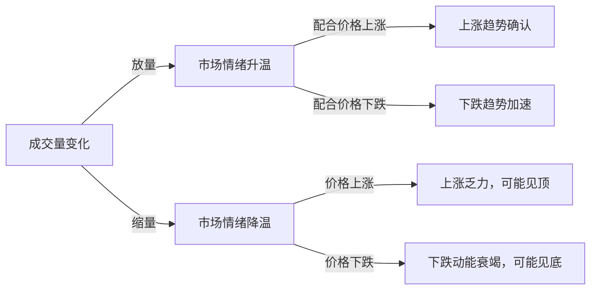
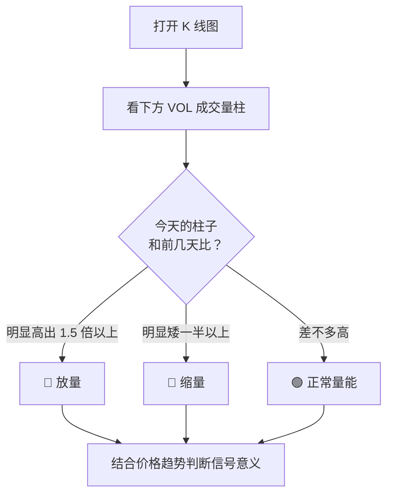
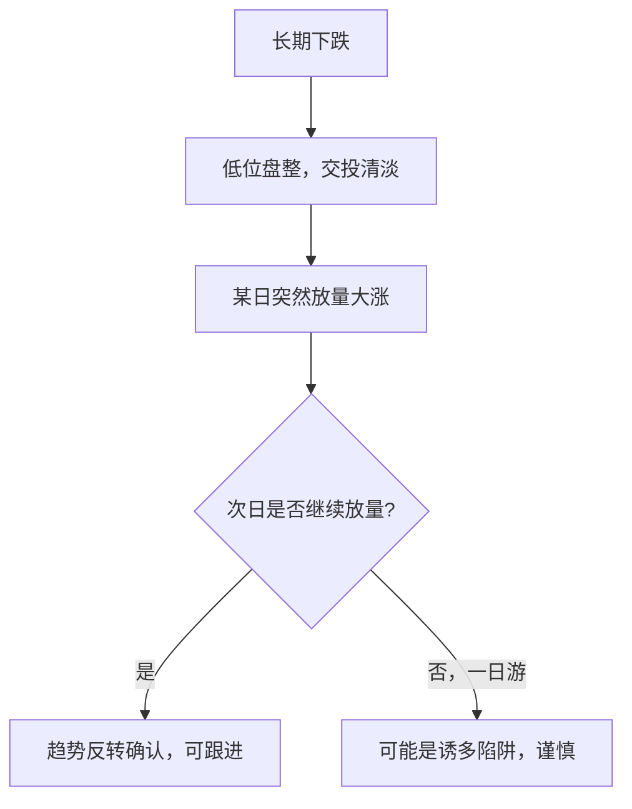
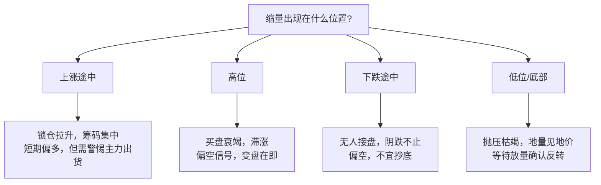
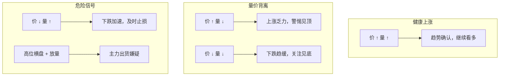
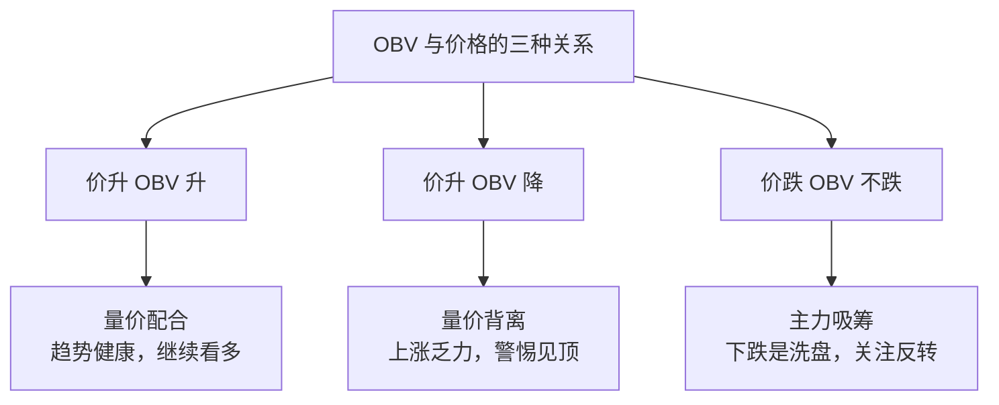

# 什么是放量和缩量？一文读懂成交量的核心信号

## 一、成交量的本质：市场的"呼吸"

在股票市场中，**成交量**代表了一定时间内买卖双方达成交易的股票数量。如果把价格比作市场的"语言"，那么成交量就是市场的"呼吸"——它告诉你这轮行情的"肺活量"有多大。

| 概念 | 定义 | 通俗理解 |
|------|------|------|
| **放量** | 成交量显著放大，远超近期平均水平 | 市场"深呼吸"——大量资金正在进出 |
| **缩量** | 成交量显著萎缩，低于近期平均水平 | 市场"屏住呼吸"——资金观望，交易冷清 |

> **核心原则：量在价先。** 成交量往往是价格变动的前兆——放量通常预示着趋势的启动或转折，缩量则意味着趋势的乏力或暂停。



## 二、如何一眼看出放量还是缩量？

在实际看盘时，你不需要手动计算——几乎所有股票软件都会把成交量直观地展示出来。下面教你三步快速判断。

### 2.1 第一步：找到成交量柱（VOL 指标）

打开任意一只股票的 K 线图，在 K 线区域的下方，你会看到一排**红绿相间的柱子**——这就是成交量柱（Volume，简称 VOL）。

```
┌─────────────────────────────────────────┐
│  K 线图（价格）                          │
│     ┃ ┃                                 │
│   ┃ ┃ ┃ ┃  ← K 线（阳线红/阴线绿）       │
│     ┃ ┃                                 │
├─────────────────────────────────────────┤
│  VOL 成交量柱                            │
│  ┃                                     │
│  ┃ ┃  ┃                                │
│  ┃ ┃  ┃  ┃  ┃  ← 每根柱子 = 一天的成交量  │
│  ┃ ┃  ┃  ┃  ┃                          │
│  ┃ ┃  ┃  ┃  ┃  ┃                       │
│  ┃ ┃  ┃  ┃  ┃  ┃  ┃ ← 柱子越高=量越大   │
└─────────────────────────────────────────┘
```

- **红色柱**：当天收盘价 ≥ 开盘价（阳线），买盘主导
- **绿色柱**：当天收盘价 < 开盘价（阴线），卖盘主导
- **柱子高度**：代表成交量的大小——越高量越大

### 2.2 第二步：看柱子的"相对高度"

放量和缩量不是看柱子的**绝对高度**，而是看**和前面一段时间相比**是高了还是低了。

```
近 20 天成交量柱子：
                                            ██ ← 这根特别高！
    ██          ██                         ██
    ██  ██      ██  ██      ██  ██      ██  ██
    ██  ██  ██  ██  ██  ██  ██  ██  ██  ██  ██
    ██  ██  ██  ██  ██  ██  ██  ██  ██  ██  ██
    ─────────────────────────────────────────
    前 19 天（正常量）              第 20 天（放量！）
```

> **直观判断法**：翻看最近一个月的成交量柱，如果今天的柱子明显比之前大部分柱子**高出 1.5 倍以上**，就是放量；如果今天的柱子明显比之前大部分柱子**矮一半以上**，就是缩量。

### 2.3 第三步：参考均量线（软件自带）

几乎所有行情软件都会在成交量区域画一条或多条**均量线**（通常为 5 日和 20 日均量）。这是一条平滑的曲线，代表了近期成交量的平均水平。

```
VOL 成交量柱 + 均量线（虚线）：

        放量区域                  缩量区域
    ┃   /\                   /\        ┃
    ┃  /  \                 /  \       ┃
    ┃ /    \   ┃    ┃      /    \      ┃
    ┃/      \  ┃    ┃     /      \     ┃
    ┃        \ ┃    ┃    ┃        \    ┃
    ┃         \┃    ┃    ┃         \   ┃
    ┗━━━━━━━━━━━━━━━━━━━━━━━━━━━━━━━━━━━┛
    .........均量线（20 日均量）.........

    柱子突破均量线 → 放量
    柱子远低于均量线 → 缩量
```

**判断规则**：
- 成交量柱**突破并远离**均量线 → **放量**
- 成交量柱**在均量线下方且明显矮小** → **缩量**
- 成交量柱在均量线**附近小幅波动** → 正常量能

### 2.4 常见软件中的查看方式

| 软件/APP | 查看位置 | 快捷键/操作 |
|------|------|------|
| **同花顺** | K 线图下方 "VOL" 区域 | 默认显示，柱状图 + 均量线 |
| **东方财富** | K 线图下方成交量区域 | 默认显示 |
| **雪球** | 个股页 → 日K → 下拉看成交量 | 点击 K 线图可切换指标 |
| **TradingView** | K 线图下方 Volume 指标 | 默认显示，可在指标栏调整 |
| **富途牛牛** | K 线图下方 "成交" 区域 | 默认显示 |

### 2.5 实战速判口诀

> **一看柱子高矮（比前面），二看均量线上线（突破还是远离），三看换手率（是否异常）。**
>
> **柱子突然蹿老高 → 放量；柱子缩成小矮人 → 缩量。**



## 三、放量：当市场"深呼吸"

### 3.1 什么是放量？

**放量**是指某只股票或整个市场的成交量显著高于近期平均水平。一般来说，当日成交量达到 20 日均量的 **1.5 倍以上**，可以视为放量；达到 **2 倍以上**则为显著放量。

```
放量程度 = 当日成交量 ÷ 近 N 日均量

放量判断参考：
- 1.0x–1.5x：正常波动
- 1.5x–2.0x：温和放量
- 2.0x–3.0x：明显放量
- 3.0x 以上：巨量/天量
```

### 3.2 放量的四种典型场景

#### 场景一：底部放量上涨——"增量资金入场"

股价经过长期下跌后在低位盘整，突然某一天放量大涨。

| 特征 | 含义 |
|------|------|
| 价格 | 从底部突破，涨幅明显 |
| 成交量 | 数倍于近期均量 |
| 信号 | **主力资金进场，底部确认，看涨信号** |



#### 场景二：顶部放量下跌——"主力出货"

股价经过大幅上涨后在高位，突然放量下跌。

| 特征 | 含义 |
|------|------|
| 价格 | 从高位回落，跌幅明显 |
| 成交量 | 巨量，往往创近期新高 |
| 信号 | **主力出货，顶部信号，看跌** |

> ⚠️ **天量天价**是 A 股常见谚语：当一只股票在高位放出历史天量时，往往意味着阶段性顶部已经不远。

#### 场景三：上涨途中放量——"空中加油"

股价已经在上升趋势中，某日继续放量上攻。

| 特征 | 含义 |
|------|------|
| 价格 | 沿均线上行，突破前高或盘整平台 |
| 成交量 | 持续温和放大 |
| 信号 | **上涨趋势健康，资金持续流入** |

> 健康的上涨趋势应该是"价升量增"——价格创新高的同时，成交量也在温和放大。

#### 场景四：下跌途中放量——"恐慌抛售"

股价处于下跌趋势，某日突然放出巨量继续大跌。

| 特征 | 含义 |
|------|------|
| 价格 | 加速下跌，跌幅扩大 |
| 成交量 | 急剧放大 |
| 信号 | **恐慌盘涌出，短期可能加速赶底** |

> 下跌途中的放量往往是"最后的恐慌"——当最坚定的持有者也选择割肉时，底部反而可能不远了。

## 四、缩量：当市场"屏住呼吸"

### 4.1 什么是缩量？

**缩量**是指成交量显著低于近期平均水平。一般来说，当日成交量不足 20 日均量的 **0.5 倍**，可以视为明显缩量。

```
缩量程度 = 当日成交量 ÷ 近 N 日均量

缩量判断参考：
- 0.7x–1.0x：正常偏低
- 0.5x–0.7x：温和缩量
- 0.3x–0.5x：明显缩量
- 0.3x 以下：地量
```

### 4.2 缩量的四种典型场景

#### 场景一：上涨途中缩量——"锁仓拉升"

股价在上涨，但成交量却在萎缩。

| 特征 | 含义 |
|------|------|
| 价格 | 继续上涨甚至创新高 |
| 成交量 | 逐步萎缩 |
| 信号 | **筹码高度锁定，抛压极轻** |

> 这种情况通常出现在**高度控盘**的股票中。主力已经收集了足够多的筹码，市场上流通的浮筹很少，因此不需要太大的成交量就能推高股价。但这也意味着一旦主力开始出货，跌幅可能很剧烈。

#### 场景二：高位缩量横盘——"滞涨风险"

股价在高位横盘整理，成交量明显萎缩。

| 特征 | 含义 |
|------|------|
| 价格 | 高位窄幅震荡，涨不动 |
| 成交量 | 持续萎缩 |
| 信号 | **买盘衰竭，变盘在即，偏空** |

> 高位缩量说明追涨的资金越来越少，市场上愿意在这个价格买入的人已经不多了。一旦出现利空，容易引发快速下跌。

#### 场景三：下跌途中缩量——"阴跌"

股价持续下跌，成交量逐步萎缩。

| 特征 | 含义 |
|------|------|
| 价格 | 缓慢下跌，跌幅不大但持续 |
| 成交量 | 持续地量水平 |
| 信号 | **无人接盘，阴跌不止，不宜抄底** |

> 下跌缩量说明没有资金愿意在这个位置接盘，也没有恐慌盘涌出。这种"温水煮青蛙"式的阴跌往往持续时间最长，也最折磨人。

#### 场景四：底部缩量盘整——"地量见地价"

股价在低位窄幅震荡，成交量萎缩到极致（地量）。

| 特征 | 含义 |
|------|------|
| 价格 | 低位横盘，波动极小 |
| 成交量 | 萎缩至"地量"水平 |
| 信号 | **抛压枯竭，底部区域，等待放量确认** |

> **"地量见地价"** 是技术分析中的重要原则。当成交量萎缩到极致，说明想卖的人基本都卖了，剩下的持有者"死猪不怕开水烫"。此时价格已跌无可跌，只需一点买盘就能引发反弹——但需要等待放量来最终确认。



## 五、量价关系的八大经典组合

技术分析中，**量价配合**是判断趋势最核心的依据。以下是八种经典量价组合及其含义：

| 序号 | 价格 | 成交量 | 技术含义 | 操作建议 |
|:---:|:---:|:---:|------|------|
| 1 | ↑ 涨 | ↑ 放量 | **价升量增**——上涨趋势健康 | 持股或买入 |
| 2 | ↑ 涨 | ↓ 缩量 | **价升量缩**——上涨乏力，量价背离 | 谨慎持有，注意止盈 |
| 3 | ↓ 跌 | ↑ 放量 | **价跌量增**——下跌趋势确认或加速 | 止损或观望 |
| 4 | ↓ 跌 | ↓ 缩量 | **价跌量缩**——下跌动能减弱 | 观望，等待企稳信号 |
| 5 | → 横盘 | ↑ 放量 | **横盘放量**——变盘信号 | 关注突破方向 |
| 6 | → 横盘 | ↓ 缩量 | **横盘缩量**——蓄势整理 | 等待方向选择 |
| 7 | ↑ 突破 | ↑ 巨量 | **突破巨量**——突破有效性强 | 可跟进，但设好止损 |
| 8 | ↑ 突破 | ↓ 缩量 | **缩量突破**——假突破风险高 | 谨慎，可能为诱多 |



## 六、放量与缩量的进阶量化方法

### 6.1 均量线对比法

最常用的方法是观察成交量与**均量线**（如 5 日均量、20 日均量）的关系：

| 对比 | 判断 |
|------|------|
| 当日量 > 5 日均量 × 1.5 | 短线放量 |
| 当日量 > 20 日均量 × 2 | 中线明显放量 |
| 当日量 < 5 日均量 × 0.5 | 短线缩量 |
| 连续 3 日 < 20 日均量 × 0.5 | 持续缩量，关注变盘 |

### 6.2 换手率辅助判断

换手率（当日成交量 ÷ 流通股本）能更直观地反映交易的活跃程度：

| 换手率区间 | 活跃程度 | 对应量能 |
|:--------:|------|------|
| **< 1%** | 极度冷清 | 地量/缩量 |
| **1%–3%** | 正常偏低 | 缩量或正常 |
| **3%–7%** | 活跃 | 温和放量 |
| **7%–15%** | 高度活跃 | 明显放量 |
| **> 15%** | 异常活跃 | 巨量/天量，警惕 |

> ⚠️ 换手率的"正常"水平因股票而异。大盘蓝筹股日换手 1% 已算活跃，而小盘题材股日换手 10% 可能只是常态。

### 6.3 相对量比指标

**量比**是衡量当前成交量相对近期水平的实时指标：

```
量比 = 当前成交量 ÷ 过去 5 日同时间段的平均成交量
```

| 量比 | 含义 |
|:---:|------|
| 0.5–1.0 | 正常偏小 |
| 1.0–1.5 | 正常 |
| 1.5–2.5 | 温和放量 |
| 2.5–5.0 | 明显放量 |
| > 5.0 | 巨量异动，重点关注 |

### 6.4 成交额（AMO）：量大的背后是谁在买？

**成交额** = 成交量 × 成交均价，代表当天买卖双方**实际花了多少钱**。

```
成交额（AMO）= 当日成交量 × 当日成交均价
```

为什么成交额很重要？因为**同样的成交量，背后的资金性质可能完全不同：**

| 场景 | 成交量 | 成交额 | 含义 |
|------|:---:|:---:|------|
| 茅台涨 2%，放量 | 500 万股 | ≈ 90 亿 | 机构大资金博弈 |
| 某 5 元低价股，放量 | 500 万股 | ≈ 2500 万 | 散户/游资博弈 |

> 同样是 500 万股的成交量，茅台背后的资金体量是低价股的 **360 倍**。只看成交量不看成交额，就像只数汽车数量不看是自行车还是卡车。

**成交额的实战用法：**

| 成交额特征 | 解读 |
|------|------|
| 成交额放大 + 价格上涨 | 真金白银流入，上涨可信度高 |
| 成交额放大 + 价格下跌 | 真金白银流出，下跌可信度高 |
| 成交量放大但成交额变化不大 | 可能是低价股活跃或大单拆细，意义有限 |
| 成交额萎缩到近期低点 | 市场冷淡，变盘前兆 |

### 6.5 OBV（能量潮）：成交量是"进"还是"出"？

**OBV（On-Balance Volume，能量潮）** 是一个经典的成交量衍生指标，用于判断资金是在流入还是流出。

```
OBV 的计算规则（逐日累加）：

当日收盘价 > 昨日收盘价 → 今日 OBV = 昨日 OBV + 今日成交量
当日收盘价 < 昨日收盘价 → 今日 OBV = 昨日 OBV - 今日成交量
当日收盘价 = 昨日收盘价 → 今日 OBV = 昨日 OBV（不变）
```

**通俗理解**：涨的日子把成交量"加"进来（认为是买方力量），跌的日子把成交量"减"出去（认为是卖方力量），然后看累积的趋势。

```
价格走势 vs OBV 走势：

价格上涨，OBV 也在涨：
  Price:  /\/\/\/\  (上升趋势)
  OBV:   /\/\/\/\  (同步上升)
  → 量价配合，趋势健康 ✅

价格上涨，但 OBV 在跌：
  Price:  /\/\/\/\  (上升趋势)
  OBV:   \/\/\/\/  (逐步下降)
  → 量价背离，上涨乏力 ⚠️ 可能见顶

价格下跌，OBV 横盘或上升：
  Price:  \/\/\/\/  (下降趋势)
  OBV:   ————————  (拒绝下跌)
  → 主力暗中吸筹，下跌是洗盘 🔍
```



> OBV 的核心价值不在于绝对数值，而在于**和价格走势是否同向**。当价格创新高但 OBV 没有创新高时，就是经典的"顶背离"警讯。

**各软件中如何查看 OBV：**

| 软件/APP | 操作方式 |
|------|------|
| **富途牛牛** | 个股 K 线页 → 点击下方指标区 → 搜索或选择 **OBV**（在"量价指标"分类下） |
| **同花顺** | K 线图下方 → 输入 **OBV** 回车，或点击指标切换 → 量价型 → OBV |
| **东方财富** | K 线图 → 下方指标栏 → 点击切换 → 选择 **OBV 能量潮** |
| **雪球** | 个股 K 线页 → 点击指标区域 → 搜索 **OBV** |
| **TradingView** | 指标栏 → 搜索 **OBV** → 选择 "On Balance Volume" |

> 在富途牛牛中，OBV 会显示为一条在 K 线图下方的**累积折线**。把它和上方的股价走势对比，观察是否同向即可。

### 6.6 虚拟成交量（VOL-TDX）：盘中预判全天量能

**虚拟成交量**是盘中实时估算当日全天成交量的指标，让你在盘中就能判断今天是放量还是缩量。

```
虚拟成交量 =（当日已成交量 ÷ 已交易时长）× 全天交易总时长
```

例如：上午 10:30，开盘 1 小时，已成交 500 万股，全天交易 4 小时：

```
虚拟全天量 = 500 × （4 ÷ 1） = 2000 万股
```

| 虚拟量 / 昨日量 | 判断 |
|:---:|------|
| **> 1.5** | 今日大概率放量 |
| **0.5–1.5** | 与昨日持平 |
| **< 0.5** | 今日大概率缩量 |

> ⚠️ 成交量在一天内不是均匀分布的——通常**开盘和收盘时段**成交量最大，中间时段较少。所以用简单比例估算会有偏差，但足以判断"放量还是缩量"的大方向。

### 6.7 成交量相关指标速查表

| 指标 | 全称 | 核心作用 | 适合场景 |
|------|------|------|------|
| **VOL** | 成交量 | 看量能绝对大小 | 判断放量/缩量 |
| **均量线** | 5/20 日均量 | 看量能相对水平 | 对比历史常态 |
| **换手率** | Turnover Rate | 看筹码交换活跃度 | 判断股票热度 |
| **量比** | Volume Ratio | 看实时量能变化 | 盘中快速判断 |
| **成交额** | AMO / Amount | 看资金体量大小 | 区分机构/散户 |
| **OBV** | 能量潮 | 看资金流入流出 | 判断趋势真假 |
| **虚拟成交量** | VOL-TDX | 预测全天量能 | 盘中提前预判 |

## 七、放量缩量的核心局限——它没告诉你的事

### 7.1 成交量可以被"制造"

主力资金可以通过**对倒**（自买自卖）制造虚假的放量假象，吸引散户跟风。因此：

> **并非所有的放量都代表真实的资金进出。** 尤其在小盘股中，对倒放量是常见的诱多手段。

### 7.2 缩量不等于安全

很多人认为"缩量下跌不用怕"，但实际上：

- 缩量下跌可能是**无人接盘**的信号——想卖都卖不掉
- 缩量横盘后可能选择**向下突破**——"久盘必跌"
- 缩量涨停虽然强势，但一旦开板往往伴随**巨量出货**

### 7.3 不同市场环境下的量能解读不同

| 市场环境 | 放量的意义 | 缩量的意义 |
|------|------|------|
| **牛市** | 资金跑步入场，趋势加强 | 短暂休整，筹码锁定 |
| **熊市** | 恐慌抛售或抄底资金入场 | 交投清淡，市场绝望 |
| **震荡市** | 方向选择信号 | 蓄势待发 |

### 7.4 大盘股 vs 小盘股的量能逻辑不同

| | 大盘蓝筹 | 小盘题材 |
|---|:---:|:---:|
| 正常换手率 | 0.5%–2% | 3%–10% |
| 放量标准 | 换手 > 3% | 换手 > 15% |
| 缩量标准 | 换手 < 0.3% | 换手 < 1% |
| 对倒风险 | 低 | **高** |

## 八、总结：量价关系的核心口诀

> **量增价升，趋势健康；量增价跌，趋势恶化。**
> **量缩价升，谨防见顶；量缩价跌，等待见底。**
> **天量天价，地量地价；量在价先，量变价变。**

放量和缩量不是孤立的指标，它们必须与**价格趋势、K 线形态、均线系统**结合起来才有实战意义。单独看量，就像只测量一个人的呼吸频率却不知道他在跑步还是睡觉——数据本身没有意义，场景才能赋予数据意义。

记住一个最重要的原则：**关注量能的"异常变化"**。无论是放量还是缩量，当它脱离了近期常态，就值得你提高警惕——因为那往往意味着市场正在酝酿新的变化。
