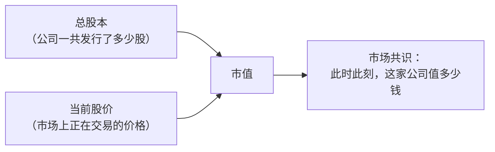
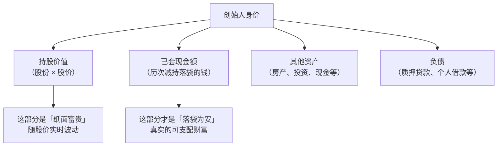
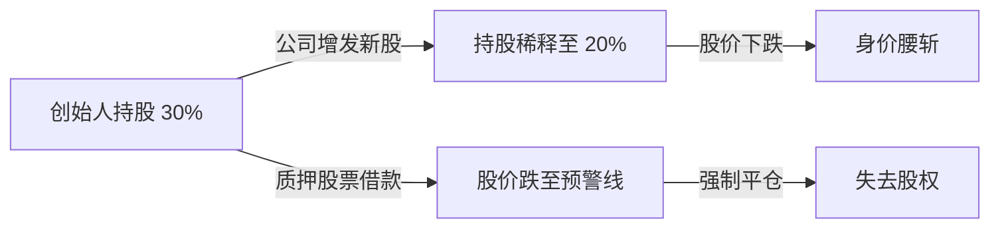
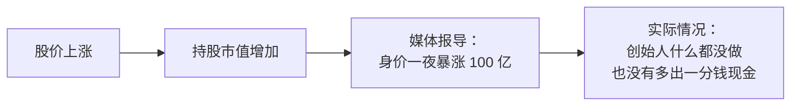
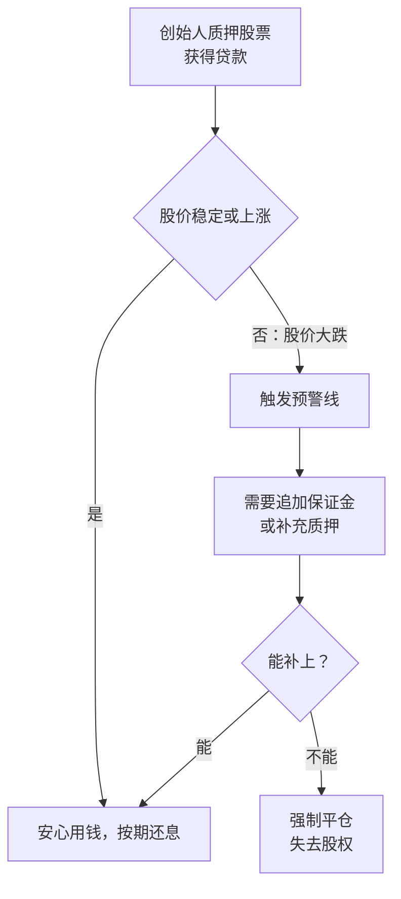
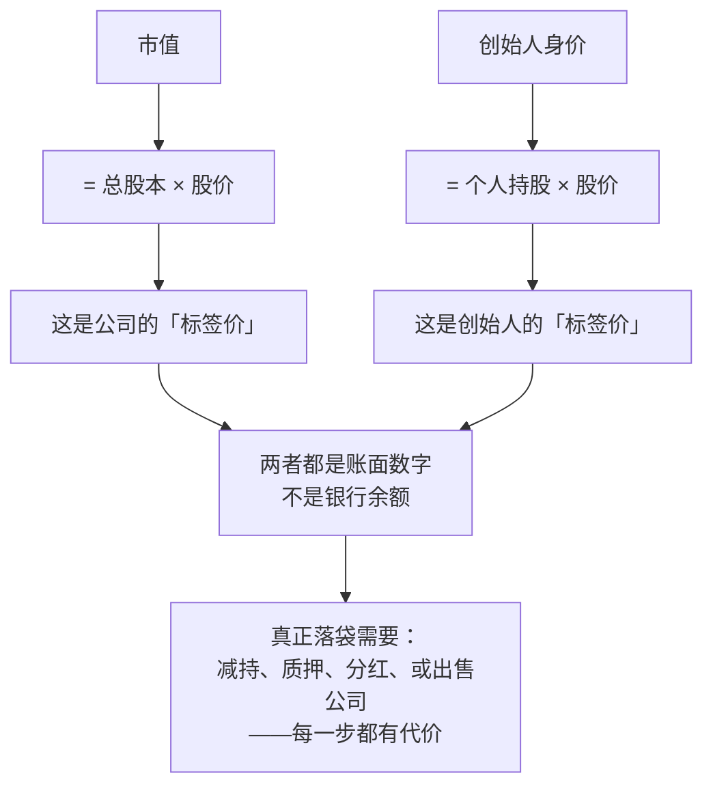

# 什么是市值？创始人的身价又是什么？

两个常被混淆的概念，一次讲清楚。

## 一、市值：市场对一家公司的"集体投票"

**市值**，全称"市场价值"（Market Capitalization），是指一家上市公司在股票市场上的总价值。它的计算公式极其简单：

$$
\text{市值} = \text{总股本} \times \text{当前股价}
$$

举个例子：如果一家公司总共发行了 1 亿股股票，当前每股价格是 50 元，那么这家公司的市值就是 **1 亿 × 50 = 50 亿元**。

市值反映的是**市场对一家公司整体价值的"集体投票"**——它不是公司的净资产，也不是公司的真实出售价格，而是千千万万投资者用真金白银交易出来的一个共识数字。



### 市值的几个关键特点

| 特点 | 说明 |
|------|------|
| **实时变动** | 股价每秒钟都在波动，市值也随之涨跌。一家公司可能在一天之内"蒸发"上百亿市值，也可能一夜之间暴增。 |
| **不是现金** | 市值 100 亿不代表公司账上有 100 亿现金。它只是"如果按当前价格买下所有股票需要花的钱"的一个理论值。 |
| **情绪驱动** | 市值受市场情绪、预期、宏观经济、行业风口等因素影响极大。有时一家盈利稳定的公司市值反而不如一家亏损但"讲故事"的公司。 |
| **不等于估值** | 未上市公司的估值（Valuation）是投资人和创始人在融资时谈判出来的；上市公司的市值是二级市场交易出来的。两者逻辑不同。 |

### 市值的常见分级

| 分级 | 市值范围 | 典型代表 |
|------|----------|----------|
| **大盘股（Large Cap）** | 超过 100 亿美元 | 苹果、微软、腾讯、茅台 |
| **中盘股（Mid Cap）** | 20 亿 – 100 亿美元 | 细分行业龙头 |
| **小盘股（Small Cap）** | 3 亿 – 20 亿美元 | 区域性公司、成长初期 |
| **微型股（Micro Cap）** | 低于 3 亿美元 | 初创上市公司 |

---

## 二、创始人的身价：纸面富贵还是真金白银？

**创始人的身价**，通俗地说，就是"这个创始人有多少钱"。它和市值有关，但绝不是一个简单的除法关系。

### 身价是怎么算出来的？

创始人的身价通常由以下几个部分构成：

$$
\text{身价} \approx \text{持股价值} + \text{已套现金额} + \text{其他资产} - \text{负债}
$$

其中**持股价值**是绝对大头：

$$
\text{持股价值} = \text{创始人持有的股份数} \times \text{当前股价}
$$

假设一家公司市值 100 亿，创始人持股 30%，那么他"纸面上"的持股价值就是 **30 亿**。媒体报道的"某某身价暴涨至 XX 亿"，通常指的就是这个数字。



### 为什么说这是"纸面富贵"？

创始人的身价有几个重要的"水分"：

#### 水分一：流动性陷阱

创始人持有的股票通常有**禁售期**（Lock-up Period），上市后 6 到 12 个月内不能卖出。即使解禁了，大规模抛售也会把股价砸穿——你卖 1% 可能股价就跌 10%，剩下的 29% 跟着缩水。

这就像你有一幅号称价值 1 亿的名画。拍卖行说它值 1 亿，但如果你真的拿出来卖，可能找不到买家；如果你一次性挂出十幅同等级别的画，整个市场都会崩盘。

#### 水分二：质押与稀释

很多创始人会把股票质押给银行换取贷款。一旦股价下跌到预警线，就会被强制平仓，身价瞬间崩塌。另外，公司后续融资、发期权、增发新股都会稀释创始人的持股比例。



#### 水分三：身价 ≠ 可支配财富

一个身价 100 亿的创始人，银行账户里可能只有几千万——剩下的全是股票。他们日常消费靠的是薪资、分红，或者少量套现。很多富豪榜上的"百亿富豪"其实现金流并不宽裕。

#### 水分四：纸面财富的脆弱性

股价腰斩，身价就腰斩。2021 年到 2022 年，很多中概股跌了 80%-90%，创始人身价一夜回到解放前——不是因为他们做错了什么，而是市场情绪变了。

---

## 三、市值和创始人身价的关系 — 一张表说清楚

| 维度 | 市值 | 创始人身价 |
|------|------|------------|
| **对象** | 整个公司 | 个人 |
| **计算** | 总股本 × 股价 | 个人持股 × 股价 + 其他资产 |
| **变动因素** | 股价波动、增发/回购 | 股价波动 + 减持/增持 + 质押 |
| **流动性** | 理论值，无法一次性变现 | 更差，大规模套现会打压股价 |
| **榜单意义** | 福布斯"全球最大公司" | 福布斯"全球富豪榜" |
| **可否直接花** | 不能——是账面数字 | 不能——除非卖掉股票变成现金 |

---

## 四、常见的误解，一次讲清楚

### 误解一："公司市值 100 亿，创始人持股 30%，所以他身价 30 亿，他是靠公司挣了 30 亿。"

不是的。这 30 亿是**未实现的账面价值**——创始人要真的变成银行存款，需要卖掉股票。而且他卖的时候，股价大概率会跌，实际落袋的可能远不到 30 亿。

> **真实类比**：你在北京有一套市值 1,000 万的房子。你的"身价"多了 1,000 万。但你能马上花掉这 1,000 万吗？不能，除非你把房子卖了——卖的时候可能市场不好，只卖了 900 万；卖完之后你也没地方住了。创始人的股票是同一个道理。

### 误解二："市值就是公司值多少钱，有人出价就能卖掉。"

市值的计算前提是"按当前价格买下所有股票"，但现实中没人会这么做。收购一家公司通常需要支付**溢价**（比市价高 20%-50%），因为你需要说服足够多的股东卖出。反过来，如果你想一次性清仓，也必须**折价**才能找到买家。

**所以市值是"边际交易价格"，不是"整体交易价格"。**

```
边际交易价格：最后一股股票成交的价格 × 总股本 = 市值
整体交易价格：如果真的有人来收购整个公司，需要付出的价格 > 市值（有收购溢价）
```

### 误解三："创始人身价暴涨，说明他赚钱了。"

只是他手里的股票更值钱了——账面数字变了，他的生活可能完全没变化。真正的"赚到钱"发生在**套现**那一刻。



### 误解四："公司亏损，创始人就不值钱了。"

不一定。亚马逊亏损了很多年，贝索斯的身价却一路上涨——因为市场相信它未来的盈利能力。市值和身价看的是**预期**，不是**过去**。

### 误解五："创始人可以随时卖掉股票，把钱拿出来。"

不能。有三大限制：

| 限制 | 说明 |
|------|------|
| **禁售期** | IPO 后通常 6-12 个月内不得卖出 |
| **信息披露** | 大股东减持需要提前公告，市场会提前反应 |
| **市场冲击** | 大量卖出会打压股价，卖得越多价格越差 |

---

## 五、创始人怎么把钱真正"拿出来"？

既然持股不能随便卖，那创始人怎么把账面财富变成真金白银？主要有四种方式：

### 方式一：减持套现

在符合规定的前提下，分批、少量地卖出股票。这是最直接的方式，但受制于禁售期、信息披露要求和市场承接力。

### 方式二：股票质押

把股票抵押给银行或券商，换取贷款。这样既保留了对公司的控制权，又能拿到现金。但风险在于：



### 方式三：分红

公司盈利后向股东分配利润。创始人持股比例高，分红金额也相应可观。但很多高增长公司选择不分红，将利润再投资。

### 方式四：出售公司

把整家公司卖给战略投资者或上市，一次性套现。这是最彻底的退出方式，但也意味着失去对公司的控制权。

---

## 六、富豪榜上的数字可信吗？

福布斯、胡润等富豪榜公布的"身价"数字，有几个需要注意的地方：

| 考量点 | 说明 |
|--------|------|
| **计算方式** | 通常以某个截止日的股价 × 已知持股数得出 |
| **信息滞后** | 榜单发布时的股价可能已经变了 |
| **持股不透明** | 创始人可能通过离岸公司、家族信托、代持等方式持股，外界只能估算 |
| **负债未知** | 榜单通常不扣除个人负债和质押贷款 |
| **税后折价** | 真要套现还要交资本利得税（A 股目前免征，美股 20%+），榜单不考虑这一点 |

> **结论**：富豪榜是"娱乐参考"，不是财务审计报告。它告诉你的是"如果此人在榜单截止日卖掉所有股票（且股价不变），理论上能拿到多少钱"——但现实中这既不可能发生，也不是他们的真实可支配财富。

---

## 七、总结

- **市值**是市场给一家公司的集体定价，反映的是预期而非现实。它等于总股本乘以股价，但不等同于公司的"出售价格"。
- **创始人身价**是个人持股的账面价值，纸面富贵，和能放进兜里的钱是两码事。
- 两者都高度依赖股价，而股价既受公司基本面影响，也受市场情绪左右。
- 创始人真正"有钱"，需要经过套现、质押、分红或出售公司——每一个路径都有成本和限制。
- 下次看到"某某身价一夜暴涨 100 亿"的标题，不妨多想一层：**这只是股价跳动带来的数字游戏——他既没有多赚到 100 亿现金，也不能马上把它变成现金。**



---

*理解市值和身价的区别，不是为了否定它们的意义，而是为了在看新闻和富豪榜时，拥有一个更清醒的视角：财富的本质不是数字，而是支配资源的能力。一张股票值多少钱，只有在你卖出去的那一刻才有意义。*